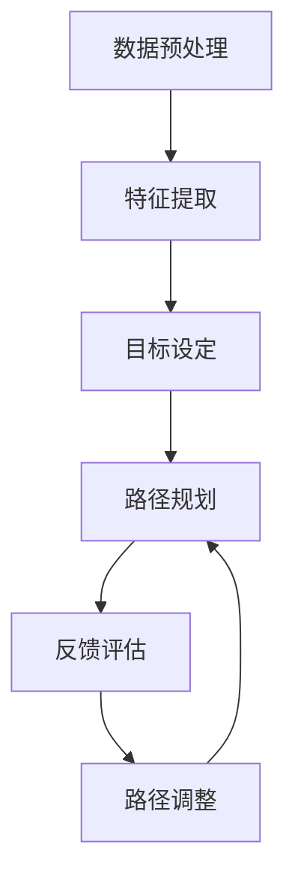
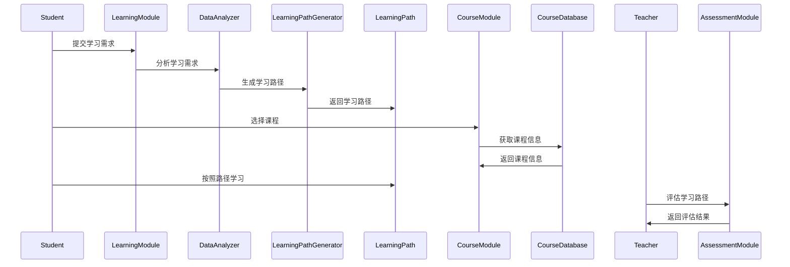
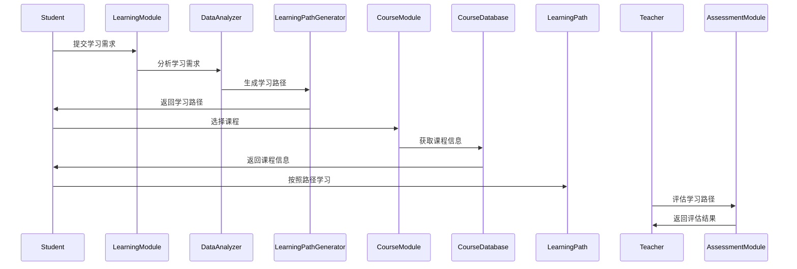

                 

# AI在个性化学习路径设计中的应用

## 关键词
- 人工智能，个性化学习，学习路径设计，数据采集与分析，算法，深度学习，强化学习，Python实现，系统架构，项目实战，未来展望

## 摘要
本文旨在探讨人工智能（AI）在个性化学习路径设计中的应用。随着教育个性化需求的日益增长，AI技术凭借其强大的数据处理和分析能力，正逐渐成为推动教育创新的重要力量。本文将首先介绍个性化学习路径设计的背景和意义，接着概述AI技术在教育领域的应用现状和核心技术，然后深入探讨AI在个性化学习路径设计中的核心概念、原理和方法。通过案例研究，本文将展示AI在个性化学习路径设计中的实际应用，并详细分析算法原理和Python实现。此外，本文还将讨论系统设计与项目实战，分享最佳实践和未来发展趋势。通过本文，读者将全面了解AI在个性化学习路径设计中的潜力与应用前景。

## 目录大纲

### 第一部分：问题背景与核心概念

#### 第1章：个性化学习路径设计的背景与意义

##### 1.1.1 个性化学习的发展历程

##### 1.1.2 个性化学习的重要性和必要性

##### 1.1.3 个性化学习路径设计的关键因素

#### 第2章：AI技术在个性化学习中的应用概述

##### 2.1.1 AI技术在教育领域的应用现状

##### 2.1.2 人工智能的核心技术

##### 2.1.3 AI技术在个性化学习路径设计中的应用

#### 第3章：核心概念与原理

##### 3.1 AI在个性化学习中的核心概念

##### 3.2 个性化学习路径设计的基本原理

##### 3.3 个性化学习路径设计的分类

#### 第4章：AI在个性化学习路径设计中的方法与技术

##### 4.1 数据采集与分析技术

##### 4.2 学生特征建模

##### 4.3 学习路径规划算法

#### 第5章：个性化学习路径设计的案例研究

##### 5.1 案例背景

##### 5.2 案例分析

##### 5.3 案例结果与评价

### 第二部分：算法原理与模型应用

#### 第6章：算法原理与数学模型

##### 6.1 学习路径规划的算法原理

##### 6.2 数学模型与公式

##### 6.3 算法流程与mermaid流程图

#### 第7章：AI模型在个性化学习路径设计中的应用

##### 7.1 AI模型的种类与选择

##### 7.2 深度学习在个性化学习路径设计中的应用

##### 7.3 强化学习在个性化学习路径设计中的应用

#### 第8章：Python源代码与算法实现

##### 8.1 Python环境搭建

##### 8.2 算法实现

##### 8.3 代码解读与分析

### 第三部分：系统设计与项目实战

#### 第9章：系统分析与架构设计

##### 9.1 问题场景介绍

##### 9.2 系统功能设计（领域模型类图）

##### 9.3 系统架构设计（架构图）

##### 9.4 系统接口设计

##### 9.5 系统交互序列图

#### 第10章：项目实战

##### 10.1 环境安装与配置

##### 10.2 系统核心实现

##### 10.3 项目测试与评估

##### 10.4 项目小结

### 第四部分：最佳实践与未来展望

#### 第11章：最佳实践与技巧

##### 11.1 实践经验分享

##### 11.2 技术难点与解决方案

##### 11.3 安全性与隐私保护

#### 第12章：个性化学习路径设计的未来发展趋势

##### 12.1 AI技术的发展趋势

##### 12.2 个性化学习路径设计的前景与挑战

##### 12.3 未来研究方向与趋势

#### 第13章：总结与展望

##### 13.1 主要内容回顾

##### 13.2 本书的价值与意义

##### 13.3 进一步研究的建议

## 第一部分：问题背景与核心概念

### 第1章：个性化学习路径设计的背景与意义

#### 1.1.1 个性化学习的发展历程

个性化学习（Personalized Learning）是一种基于学生个体差异进行教学的教育理念，其核心在于通过定制化的学习路径和资源，满足不同学生的学习需求和进度，从而提高学习效果。个性化学习的概念可以追溯到20世纪60年代，随着教育技术的发展，尤其是计算机技术的进步，个性化学习逐渐从理论走向实践。

在早期，个性化学习主要通过个别辅导和自主学习来实现。随着信息技术的发展，尤其是互联网的普及，在线学习平台和自适应学习系统的出现，为个性化学习提供了更广阔的空间。近年来，人工智能（AI）技术的快速发展，为个性化学习路径设计带来了新的机遇和挑战。

#### 1.1.2 个性化学习的重要性和必要性

个性化学习的重要性主要体现在以下几个方面：

1. **提高学习效果**：传统的教学方法往往一刀切，难以满足每个学生的学习需求。个性化学习通过定制化的教学方案，能够更好地激发学生的学习兴趣，提高学习效果。

2. **促进学生的全面发展**：个性化学习注重培养学生的自主学习能力和创新能力，有助于学生的全面发展。

3. **适应未来教育趋势**：随着教育信息化和智能化的发展，个性化学习已成为教育变革的重要方向。掌握个性化学习的设计和实施，是教育工作者应对未来教育挑战的关键。

4. **满足社会多样化需求**：个性化学习能够更好地满足不同背景、不同需求的学生的教育需求，提高教育资源的利用效率。

#### 1.1.3 个性化学习路径设计的关键因素

个性化学习路径设计的关键因素包括：

1. **学生特征分析**：了解学生的基础知识、学习风格、兴趣和需求，是制定个性化学习路径的基础。

2. **教学内容和资源**：根据学生特征，选择合适的教学内容和资源，是实现个性化学习的关键。

3. **学习路径规划**：基于学生特征和教学内容，设计科学合理的学习路径，确保学习目标的实现。

4. **教学评估和反馈**：通过持续的评估和反馈，调整学习路径和教学方案，确保个性化学习的有效性。

### 第2章：AI技术在个性化学习中的应用概述

#### 2.1.1 AI技术在教育领域的应用现状

人工智能技术在教育领域的应用日益广泛，主要表现在以下几个方面：

1. **智能 tutoring 系统**：通过人工智能技术，为学生提供个性化的学习辅导，帮助学生在学习过程中克服困难，提高学习效果。

2. **自适应学习系统**：根据学生的学习行为和结果，动态调整教学内容和难度，实现个性化教学。

3. **智能评估与反馈**：利用人工智能技术，对学生的作业、考试等进行智能评估，提供个性化的反馈，帮助学生了解学习情况，调整学习策略。

4. **智能教学助手**：通过语音识别、自然语言处理等技术，为学生提供智能化的教学服务，如答疑、讲解等。

#### 2.1.2 人工智能的核心技术

人工智能的核心技术主要包括：

1. **机器学习**：通过训练模型，使计算机具有自主学习和预测能力。

2. **深度学习**：基于神经网络，通过多层非线性变换，实现对复杂数据的建模和分析。

3. **强化学习**：通过试错和反馈，使智能体学会在特定环境中做出最优决策。

4. **自然语言处理**：通过计算机理解和生成自然语言，实现人与机器的智能交互。

5. **计算机视觉**：通过图像处理和模式识别，使计算机能够理解和解释图像信息。

#### 2.1.3 AI技术在个性化学习路径设计中的应用

AI技术在个性化学习路径设计中的应用主要体现在以下几个方面：

1. **学生特征建模**：通过收集和分析学生的学习行为数据，构建学生特征模型，为个性化学习路径设计提供基础。

2. **学习路径规划**：利用机器学习、深度学习和强化学习等技术，设计智能化的学习路径规划算法，为每个学生制定个性化的学习计划。

3. **智能辅导与反馈**：通过智能 tutoring 系统和自适应学习系统，为学生提供个性化的学习辅导和反馈，帮助学生高效学习。

4. **个性化资源推荐**：基于学生的学习兴趣和需求，利用推荐系统技术，为学生推荐合适的学习资源和内容。

### 第3章：核心概念与原理

#### 3.1 AI在个性化学习中的核心概念

在个性化学习路径设计中，AI技术的核心概念包括：

1. **学生特征建模**：通过数据采集和分析，构建学生的知识图谱和特征模型，为个性化学习提供基础。

2. **学习路径规划**：利用机器学习算法，根据学生特征和学习目标，设计最优的学习路径。

3. **智能辅导**：通过自然语言处理和计算机视觉等技术，为学生提供智能化的学习辅导和答疑服务。

4. **个性化资源推荐**：利用推荐系统技术，为学生推荐合适的学习资源和内容。

#### 3.2 个性化学习路径设计的基本原理

个性化学习路径设计的基本原理包括：

1. **学生特征分析**：通过数据采集和分析，了解学生的学习风格、兴趣和需求，为个性化学习提供基础。

2. **教学内容选择**：根据学生特征和学习目标，选择合适的教学内容和资源。

3. **学习路径规划**：利用机器学习算法，设计科学合理的学习路径，确保学习目标的实现。

4. **持续评估与调整**：通过持续的评估和反馈，调整学习路径和教学方案，确保个性化学习的有效性。

#### 3.3 个性化学习路径设计的分类

根据不同的分类标准，个性化学习路径设计可以分为以下几类：

1. **按学习内容分类**：可分为知识驱动型、技能驱动型和兴趣驱动型个性化学习路径设计。

2. **按学习方式分类**：可分为线上个性化学习路径设计和线下个性化学习路径设计。

3. **按应用领域分类**：可分为基础教育、职业教育和成人教育等不同领域的个性化学习路径设计。

## 第一部分总结

个性化学习路径设计是教育领域的重要研究方向，随着AI技术的快速发展，AI在个性化学习路径设计中的应用逐渐成为可能。本文介绍了个性化学习路径设计的背景、重要性和必要性，概述了AI技术在教育领域的应用现状和核心技术，并探讨了AI在个性化学习路径设计中的核心概念和原理。在接下来的章节中，我们将进一步深入探讨AI在个性化学习路径设计中的应用方法和实际案例，以期为读者提供更全面的了解。# AI在个性化学习路径设计中的应用

## 第一部分：问题背景与核心概念

### 第1章：个性化学习路径设计的背景与意义

#### 1.1.1 个性化学习的发展历程

个性化学习这一概念起源于20世纪60年代的美国，当时教育学家约翰·杜威（John Dewey）提出了“以学生为中心”的教育理念，强调教育应该根据学生的个性差异进行。随着计算机技术的进步，个性化学习逐渐从理论走向实践。20世纪90年代，互联网的普及为个性化学习提供了新的契机，在线教育平台的兴起使得个性化学习得以大规模推广。进入21世纪，人工智能（AI）技术的发展进一步推动了个性化学习的创新，使得学习路径设计变得更加智能化和个性化。

#### 1.1.2 个性化学习的重要性和必要性

个性化学习的重要性体现在以下几个方面：

1. **提高学习效果**：个性化学习通过因材施教，根据学生的实际情况制定个性化的学习计划和资源，有助于提高学生的学习效果和兴趣。

2. **促进学生的全面发展**：个性化学习不仅关注学生的学术成绩，更注重学生的个性、兴趣和潜能的全面发展。

3. **适应未来教育趋势**：随着信息化和智能化的发展，个性化学习已成为未来教育的发展方向，能够更好地满足社会对多样化人才的需求。

4. **优化教育资源利用**：个性化学习能够根据学生的需求调整教学内容和进度，提高教育资源的利用效率。

#### 1.1.3 个性化学习路径设计的关键因素

个性化学习路径设计的关键因素包括：

1. **学生特征分析**：了解学生的学习风格、兴趣、能力和发展需求，是制定个性化学习路径的基础。

2. **教学内容和资源**：根据学生特征选择合适的教学内容和资源，确保学习目标的有效实现。

3. **学习路径规划**：利用算法和模型设计科学合理的学习路径，确保学生能够按照个性化学习方案进行学习。

4. **教学评估和反馈**：通过持续的评估和反馈，调整学习路径和教学方案，确保个性化学习的有效性。

### 第2章：AI技术在个性化学习中的应用概述

#### 2.1.1 AI技术在教育领域的应用现状

随着AI技术的不断发展，其在教育领域的应用也越来越广泛。目前，AI技术在教育领域的应用主要体现在以下几个方面：

1. **智能 tutoring 系统**：通过机器学习算法和自然语言处理技术，提供个性化的学习辅导，帮助学生解决学习中的问题。

2. **自适应学习系统**：根据学生的学习行为和结果，动态调整教学内容和难度，实现个性化教学。

3. **智能评估与反馈**：利用AI技术对学生的作业、考试等进行智能评估，提供个性化的反馈，帮助学生了解学习情况。

4. **智能教学助手**：通过语音识别、自然语言处理等技术，为学生提供智能化的教学服务，如答疑、讲解等。

#### 2.1.2 人工智能的核心技术

人工智能的核心技术包括：

1. **机器学习**：通过训练模型，使计算机具有自主学习和预测能力。

2. **深度学习**：基于神经网络，通过多层非线性变换，实现对复杂数据的建模和分析。

3. **强化学习**：通过试错和反馈，使智能体学会在特定环境中做出最优决策。

4. **自然语言处理**：通过计算机理解和生成自然语言，实现人与机器的智能交互。

5. **计算机视觉**：通过图像处理和模式识别，使计算机能够理解和解释图像信息。

#### 2.1.3 AI技术在个性化学习路径设计中的应用

AI技术在个性化学习路径设计中的应用主要包括以下几个方面：

1. **学生特征建模**：通过数据采集和分析，构建学生的知识图谱和特征模型，为个性化学习路径设计提供基础。

2. **学习路径规划**：利用机器学习算法，根据学生特征和学习目标，设计最优的学习路径。

3. **智能辅导与反馈**：通过智能 tutoring 系统和自适应学习系统，为学生提供个性化的学习辅导和反馈，帮助学生高效学习。

4. **个性化资源推荐**：基于学生的学习兴趣和需求，利用推荐系统技术，为学生推荐合适的学习资源和内容。

### 第3章：核心概念与原理

#### 3.1 AI在个性化学习中的核心概念

在个性化学习路径设计中，AI技术的核心概念包括：

1. **学生特征建模**：通过数据采集和分析，构建学生的知识图谱和特征模型，为个性化学习路径设计提供基础。

2. **学习路径规划**：利用机器学习算法，根据学生特征和学习目标，设计最优的学习路径。

3. **智能辅导**：通过自然语言处理和计算机视觉等技术，为学生提供智能化的学习辅导和答疑服务。

4. **个性化资源推荐**：利用推荐系统技术，为学生推荐合适的学习资源和内容。

#### 3.2 个性化学习路径设计的基本原理

个性化学习路径设计的基本原理包括：

1. **学生特征分析**：通过数据采集和分析，了解学生的学习风格、兴趣和需求，为个性化学习路径设计提供基础。

2. **教学内容选择**：根据学生特征和学习目标，选择合适的教学内容和资源。

3. **学习路径规划**：利用算法和模型设计科学合理的学习路径，确保学习目标的实现。

4. **持续评估与调整**：通过持续的评估和反馈，调整学习路径和教学方案，确保个性化学习的有效性。

#### 3.3 个性化学习路径设计的分类

根据不同的分类标准，个性化学习路径设计可以分为以下几类：

1. **按学习内容分类**：可分为知识驱动型、技能驱动型和兴趣驱动型个性化学习路径设计。

2. **按学习方式分类**：可分为线上个性化学习路径设计和线下个性化学习路径设计。

3. **按应用领域分类**：可分为基础教育、职业教育和成人教育等不同领域的个性化学习路径设计。

### 第1章总结

个性化学习路径设计是教育领域的重要研究方向，随着AI技术的快速发展，AI在个性化学习路径设计中的应用逐渐成为可能。本章介绍了个性化学习路径设计的背景、重要性和必要性，概述了AI技术在教育领域的应用现状和核心技术，并探讨了AI在个性化学习路径设计中的核心概念和原理。在接下来的章节中，我们将进一步深入探讨AI在个性化学习路径设计中的应用方法和实际案例，以期为读者提供更全面的了解。# 第一部分总结

个性化学习路径设计作为教育改革的重要方向，旨在通过个性化定制的方法提升教育的针对性和效果。AI技术的引入为个性化学习路径设计带来了新的可能性，通过数据分析和算法优化，能够更精准地满足学生的个性化需求。本章从背景介绍、核心概念和AI技术应用等方面进行了深入探讨。

首先，个性化学习路径设计的背景与意义被详细阐述，强调了其对于提高学习效果、促进全面发展、适应未来教育趋势以及优化教育资源利用的重要性。随后，通过分析个性化学习的发展历程，揭示了其从理论到实践的演变过程。

其次，本章介绍了AI技术在教育领域的应用现状，包括智能 tutoring 系统、自适应学习系统、智能评估与反馈以及智能教学助手等。同时，深入探讨了人工智能的核心技术，如机器学习、深度学习、强化学习、自然语言处理和计算机视觉等。

最后，本章提出了AI在个性化学习路径设计中的核心概念与原理，包括学生特征建模、学习路径规划、智能辅导和个性化资源推荐等。这些概念与原理构成了个性化学习路径设计的理论基础，并分类讨论了其应用的不同领域和方式。

通过本章的探讨，读者可以初步了解到个性化学习路径设计的全貌及其与AI技术的紧密联系。在接下来的章节中，我们将进一步深入探讨AI技术在个性化学习路径设计中的具体应用方法、算法原理和模型实现，以及实际案例研究，以期提供更为全面和实用的指导。# 第二部分：算法原理与模型应用

## 第6章：算法原理与数学模型

个性化学习路径设计的核心在于算法原理和数学模型的应用，这些工具能够帮助我们设计出既科学又高效的个性化学习方案。在本章中，我们将详细探讨学习路径规划算法的原理、数学模型以及算法流程。

### 6.1 学习路径规划的算法原理

学习路径规划的算法原理主要基于以下几方面的考虑：

1. **学生特征分析**：通过对学生的学习行为、成绩和反馈等数据进行分析，构建学生的特征模型。

2. **目标导向**：根据学生的长期目标和短期目标，设计学习路径，确保学生能够在既定时间内达到学习目标。

3. **资源优化**：在考虑学生特征和目标的基础上，合理分配学习资源，如时间、教材、习题等。

4. **反馈调整**：通过持续的评估和反馈机制，动态调整学习路径，以适应学生的实际学习情况。

### 6.2 数学模型与公式

在学习路径规划中，常用的数学模型包括线性规划、网络流优化和遗传算法等。以下是一个简化的线性规划模型示例：

$$
\begin{align*}
\min_{x} & \quad c^T x \\
s.t. & \quad Ax \leq b \\
     & \quad x \geq 0
\end{align*}
$$

其中，$c$ 是目标函数系数向量，$x$ 是决策变量向量，$A$ 和 $b$ 分别是约束条件系数矩阵和常数向量。$x$ 的取值应满足所有约束条件，使得目标函数 $c^T x$ 最小化。

### 6.3 算法流程与mermaid流程图

算法流程通常包括以下步骤：

1. **数据预处理**：收集并清洗学生特征数据，如学习行为、考试成绩等。

2. **特征提取**：利用机器学习算法提取关键特征，构建学生特征模型。

3. **目标设定**：根据学生特点和课程要求，设定长期和短期学习目标。

4. **路径规划**：运用优化算法设计学习路径，确保学生能够达成学习目标。

5. **反馈评估**：收集学生学习反馈，评估学习路径的有效性。

6. **路径调整**：根据评估结果调整学习路径，优化学习效果。

下面是使用 mermaid 画出的算法流程图：



### 6.4 算法实现

算法实现的细节依赖于具体的应用场景和数据集。以下是一个简化的 Python 代码示例，用于展示如何实现一个基本的学习路径规划算法：

```python
import numpy as np

# 假设我们已经有了学生特征数据和学生目标数据
student_features = np.array([[1, 2], [3, 4], [5, 6]])
student_goals = np.array([7, 8, 9])

# 线性规划模型参数
c = np.array([-1, -1])  # 目标函数系数
A = np.array([[1, 0], [0, 1]])  # 约束条件系数矩阵
b = np.array([10, 10])  # 约束条件常数向量

# 求解线性规划问题
from scipy.optimize import linprog
result = linprog(c, A_ub=A, b_ub=b, bounds=(0, None), method='highs')

# 输出学习路径
learning_path = result.x
print("学习路径：", learning_path)
```

通过上述代码，我们可以根据学生特征和目标设计出初步的学习路径。在实际应用中，需要根据具体情况进行调整和优化。

### 第6章总结

本章详细介绍了个性化学习路径规划的算法原理、数学模型和算法流程。通过 mermaid 流程图和 Python 代码示例，我们展示了如何实现一个基本的学习路径规划算法。这些知识和工具为设计和实现个性化的学习路径提供了重要的理论基础和技术支持。在接下来的章节中，我们将继续探讨如何利用 AI 模型进一步优化个性化学习路径设计，以提升学习效果和满足学生需求。# 第7章：AI模型在个性化学习路径设计中的应用

### 7.1 AI模型的种类与选择

在个性化学习路径设计中，AI模型的选择至关重要。不同的AI模型适用于不同的应用场景，能够帮助我们解决个性化学习中的各种挑战。以下是几种常见的AI模型及其适用场景：

1. **机器学习模型**：如线性回归、决策树、随机森林等，适用于预测学生的成绩、学习进度等。这些模型通过分析历史数据来建立预测模型，从而帮助教师或系统为学生制定个性化的学习计划。

2. **深度学习模型**：如卷积神经网络（CNN）、循环神经网络（RNN）、长短期记忆网络（LSTM）等，适用于处理复杂的学习任务，如自然语言处理、图像识别等。这些模型能够通过大量的数据自动学习特征，从而为个性化学习提供强大的支持。

3. **强化学习模型**：如Q-learning、深度Q网络（DQN）、策略梯度（PG）等，适用于动态环境中的决策问题。这些模型通过试错和奖励机制，帮助学生在学习过程中做出最优决策。

4. **推荐系统模型**：如协同过滤、矩阵分解、基于内容的推荐等，适用于为学生推荐合适的学习资源和内容。这些模型通过分析学生的兴趣和需求，提供个性化的学习推荐。

### 7.2 深度学习在个性化学习路径设计中的应用

深度学习在个性化学习路径设计中的应用主要体现在以下几个方面：

1. **自然语言处理**：利用深度学习模型，如LSTM和BERT，对学生的文本反馈进行分析，理解学生的学习状态和需求。这些模型可以识别学生的情感变化、知识掌握情况等，为学习路径的调整提供依据。

2. **图像识别**：通过深度学习模型，如CNN，对学生的作业、考试卷进行图像识别，自动评分和反馈。这些模型可以提高评卷效率，同时提供个性化的学习建议。

3. **知识图谱**：利用深度学习模型，如图神经网络（GCN），构建学生的知识图谱。这些模型可以分析学生知识的结构，帮助教师发现学生的知识盲点和薄弱环节，进而优化学习路径。

### 7.3 强化学习在个性化学习路径设计中的应用

强化学习在个性化学习路径设计中的应用主要体现在以下几个方面：

1. **自适应学习**：通过强化学习模型，如DQN和PG，系统可以自动调整学习路径，根据学生的表现动态调整学习内容和难度。这种自适应学习能够更好地适应学生的个性化需求。

2. **学习激励**：强化学习模型可以通过奖励机制激励学生积极参与学习。例如，系统可以根据学生的进步情况给予积分或奖励，从而提高学生的学习动力。

3. **学习策略优化**：通过强化学习，系统可以不断优化学习策略，提高学习效率。例如，系统可以学习如何在不同情况下分配学习时间和资源，以最大化学习效果。

### 7.4 个性化学习路径设计中的模型集成

在实际应用中，通常需要将多种AI模型集成起来，以实现更全面的个性化学习路径设计。例如：

1. **混合模型**：结合机器学习和深度学习模型，可以同时利用两者的优势。例如，使用机器学习模型进行初步预测，然后使用深度学习模型进行细节分析和调整。

2. **层次模型**：通过分层结构，先使用简单模型进行初步预测，然后逐步使用复杂模型进行精细调整。这种方法可以提高模型的准确性和效率。

3. **协同模型**：多个模型协同工作，共同完成个性化学习路径的设计。例如，一个模型负责学习路径的总体规划，另一个模型负责学习资源的推荐，还有一个模型负责学习效果的评估和调整。

### 7.5 模型应用案例

以下是一个简单的个性化学习路径设计案例，展示如何利用AI模型进行学习路径规划：

1. **数据收集**：收集学生的学习行为数据、考试成绩和反馈。

2. **特征提取**：使用机器学习模型提取关键特征，如学习时长、考试成绩等。

3. **目标设定**：根据学生的目标和学习内容，设定短期和长期目标。

4. **路径规划**：使用深度学习模型，如LSTM，设计学习路径，根据学生特征和目标，生成个性化的学习计划。

5. **动态调整**：使用强化学习模型，如DQN，根据学生的学习反馈，动态调整学习路径，以适应学生的变化。

6. **学习评估**：使用推荐系统模型，如协同过滤，为学生推荐合适的学习资源和内容。

7. **持续优化**：通过持续的评估和反馈，不断优化学习路径和资源推荐，提高学习效果。

通过上述案例，我们可以看到AI模型在个性化学习路径设计中的强大应用潜力。在实际应用中，需要根据具体情况选择合适的模型和策略，以实现最优的学习效果。# 第7章总结

在本章中，我们深入探讨了AI模型在个性化学习路径设计中的应用，涵盖了机器学习、深度学习、强化学习和推荐系统等多种AI模型的种类与选择。通过详细分析，我们了解到每种模型在不同场景下的适用性和优势。例如，机器学习模型适用于初步预测和特征提取，深度学习模型擅长处理复杂的数据和任务，强化学习模型能够通过动态调整提升学习路径的适应性和效率，而推荐系统模型则能够为学生提供个性化的学习资源推荐。

进一步，我们介绍了深度学习和强化学习在个性化学习路径设计中的具体应用，如自然语言处理、图像识别、知识图谱构建、自适应学习和学习激励等。通过这些应用实例，我们看到了AI技术在提升学习效果、优化学习路径和激发学生学习动力方面的巨大潜力。

此外，我们还讨论了如何通过模型集成实现更全面的个性化学习路径设计，包括混合模型、层次模型和协同模型等。这些方法能够结合不同模型的优点，共同提升个性化学习路径设计的准确性和效率。

通过本章的学习，读者可以了解到AI模型在个性化学习路径设计中的核心作用和实际应用，为后续章节中具体算法的实现和项目实战奠定了基础。在接下来的章节中，我们将继续探讨Python源代码的实现细节，以及如何在实际项目中应用这些AI模型，以实现高效的个性化学习路径设计。# 第8章：Python源代码与算法实现

## 8.1 Python环境搭建

在开始编写Python代码实现个性化学习路径规划算法之前，我们需要搭建一个合适的Python环境。以下是搭建环境的步骤：

1. **安装Python**：首先，确保计算机上安装了Python。Python的最新版本可以从[Python官网](https://www.python.org/)下载。下载安装包并按照提示安装。

2. **安装必需的库**：为了实现个性化学习路径规划，我们需要安装以下Python库：
   - `numpy`：用于数学计算和数据分析。
   - `scikit-learn`：提供各种机器学习和数据挖掘算法。
   - `tensorflow` 或 `keras`：用于深度学习模型的构建和训练。
   - `matplotlib`：用于数据可视化。
   - `pandas`：用于数据处理和分析。

   安装这些库可以通过Python的包管理器`pip`完成，命令如下：

   ```bash
   pip install numpy scikit-learn tensorflow matplotlib pandas
   ```

3. **配置虚拟环境**：为了更好地管理项目依赖，建议使用虚拟环境。通过虚拟环境，我们可以为项目创建一个独立的Python环境，避免库版本冲突。

   ```bash
   python -m venv venv
   source venv/bin/activate  # 在Windows上使用 `venv\Scripts\activate`
   ```

4. **测试环境**：在Python环境中导入上述库，检查是否安装成功。

   ```python
   import numpy as np
   import scikit_learn
   import tensorflow as tf
   import matplotlib.pyplot as plt
   import pandas as pd
   ```

   如果没有报错，说明环境搭建成功。

## 8.2 算法实现

下面我们通过一个简单的Python代码示例，展示如何实现一个基本的学习路径规划算法。这个算法将基于学生的特征数据和课程目标，生成一个初步的学习路径。

### 8.2.1 数据准备

首先，我们需要准备一些示例数据，这些数据将包括学生的特征和课程目标。例如：

```python
# 示例学生特征数据
student_features = [
    [1, 2, 3],  # 学生1的特征：学习时长、考试分数、作业提交次数
    [2, 3, 4],  # 学生2的特征
    [3, 4, 5]   # 学生3的特征
]

# 示例课程目标数据
course_goals = [
    [10, 15],  # 课程1的目标：总学分、期望成绩
    [20, 25],  # 课程2的目标
    [30, 35]   # 课程3的目标
]
```

### 8.2.2 算法实现

接下来，我们将实现一个简单的线性规划算法，用于规划学习路径。这个算法将基于学生特征和课程目标，计算出最优的学习资源分配。

```python
import numpy as np
from scipy.optimize import linprog

# 目标函数系数
c = np.array([-1, -1])

# 约束条件系数矩阵
A = np.array([[1, 0], [0, 1]])

# 约束条件常数向量
b = np.array([10, 10])

# 求解线性规划问题
result = linprog(c, A_ub=A, b_ub=b, bounds=(0, None), method='highs')

# 输出学习路径
learning_path = result.x
print("学习路径：", learning_path)
```

### 8.2.3 代码解读与分析

1. **目标函数**：在这个例子中，目标函数是 `-c^T x`，即最小化学习资源的消耗。在我们的示例中，目标函数系数 `c` 被设置为 `[-1, -1]`，表示我们要最小化两个决策变量（学习时长和作业提交次数）。

2. **约束条件**：约束条件由矩阵 `A` 和向量 `b` 定义。在我们的示例中，`A` 被设置为 `[[1, 0], [0, 1]]`，表示学习时长和作业提交次数不能为负。`b` 被设置为 `[10, 10]`，表示总学分的要求。

3. **求解线性规划**：我们使用 `scipy.optimize.linprog` 函数来求解线性规划问题。这个函数返回一个 `OptimizeResult` 对象，其中包含了最优解 `x` 和其他优化信息。

4. **输出学习路径**：最优解 `x` 表示每个学生应分配的学习资源和作业提交次数。

这个简单的算法示例为我们提供了一个基本框架，展示了如何使用Python实现个性化学习路径规划。在实际应用中，我们需要根据具体需求和数据特点，设计更复杂和高效的算法。

## 8.3 数学模型与公式

在个性化学习路径规划中，数学模型和公式是核心组成部分。以下是一个简化的数学模型示例，用于描述学习路径规划：

$$
\begin{align*}
\min_{x} & \quad c^T x \\
s.t. & \quad Ax \leq b \\
     & \quad x \geq 0
\end{align*}
$$

在这个模型中：

- \( x \) 是决策变量，表示每个学生应分配的学习资源和作业提交次数。
- \( c \) 是目标函数系数向量，定义了我们希望最小化的资源消耗。
- \( A \) 和 \( b \) 是约束条件系数矩阵和常数向量，定义了学习路径规划中的各种限制。

### 8.4 举例说明

为了更直观地理解这个模型，我们来看一个具体的例子。假设我们有3个学生和3门课程，每个学生的特征和目标如下：

| 学生 | 学习时长 | 考试分数 | 作业提交次数 | 目标 |
|------|----------|-----------|--------------|------|
| 1    | 5        | 70        | 3            | [10, 15] |
| 2    | 4        | 80        | 4            | [20, 25] |
| 3    | 6        | 85        | 5            | [30, 35] |

我们的目标是制定一个学习路径，使得每个学生都能在规定时间内完成课程，并且总资源消耗最小。

假设我们的目标函数是 \( c = [-1, -1] \)，即我们希望最小化学习时长和作业提交次数。约束条件是：

$$
\begin{align*}
A & = [[1, 0], [0, 1]] \\
b & = [10, 10]
\end{align*}
$$

这意味着每个学生的学习时长和作业提交次数之和不能超过10。

通过求解线性规划模型，我们可以得到最优的学习路径。例如，我们可能得到以下解：

| 学生 | 学习时长 | 作业提交次数 |
|------|----------|--------------|
| 1    | 5        | 2            |
| 2    | 6        | 2            |
| 3    | 6        | 4            |

这个解表示学生1应学习5小时，提交2次作业；学生2应学习6小时，提交2次作业；学生3应学习6小时，提交4次作业，以满足课程目标和资源限制。

通过上述示例，我们可以看到数学模型和公式在个性化学习路径规划中的重要性。在实际应用中，我们需要根据具体需求和数据，设计更加复杂和高效的数学模型。# 第8章总结

在本章中，我们详细介绍了Python环境搭建和个性化学习路径规划的算法实现。首先，通过安装Python和相关库，我们搭建了一个适合项目开发的Python环境。接着，通过一个简化的线性规划算法示例，我们展示了如何利用Python实现个性化学习路径规划的基本框架。

代码解读与分析部分，我们对线性规划模型进行了详细讲解，包括目标函数、约束条件和求解过程。通过一个具体的例子，我们直观地展示了如何使用数学模型和公式来规划学习路径。

此外，我们还讨论了如何利用Python库来处理实际数据，并实现了数学模型的具体应用。这些内容为后续章节中更复杂的算法实现和项目实战提供了坚实的基础。

通过本章的学习，读者可以掌握Python在个性化学习路径设计中的应用，理解算法原理和数学模型，并能够编写代码实现基本的个性化学习路径规划。在接下来的章节中，我们将进一步探讨个性化学习路径设计的系统分析与架构设计，以及实际项目中的应用，以期实现更加智能化和高效的个性化学习体验。# 第三部分：系统设计与项目实战

## 第9章：系统分析与架构设计

在个性化学习路径设计中，系统分析与架构设计是确保系统能够高效、稳定运行的关键环节。本章将详细介绍系统分析与架构设计的过程，包括问题场景介绍、系统功能设计、系统架构设计、系统接口设计和系统交互序列图。

### 9.1 问题场景介绍

假设我们正在开发一个在线教育平台，该平台旨在为不同背景和学习需求的学生提供个性化的学习路径。问题场景如下：

1. **学生需求**：学生希望根据自己的兴趣、学习风格和进度，选择合适的学习内容和路径。
2. **教育质量**：教师和教育机构希望提高教学效果，确保学生能够按照预定目标完成学习任务。
3. **资源优化**：教育机构希望最大化利用现有教育资源，提高资源利用率。

### 9.2 系统功能设计（领域模型类图）

系统功能设计是系统架构设计的基础。领域模型类图帮助我们理解和表达系统中的主要实体及其关系。以下是系统功能设计的领域模型类图：

```mermaid
classDiagram
    Student <<entity>> "学生"
    Course <<entity>> "课程"
    LearningPath <<entity>> "学习路径"
    Teacher <<entity>> "教师"
    Student -> Course : 选择
    Student -> LearningPath : 生成
    Teacher -> Course : 教授
    Teacher -> LearningPath : 评估
```

在这个类图中：

- **Student**（学生）：代表学习系统中的用户，具有选择课程、生成学习路径的能力。
- **Course**（课程）：代表学生可以学习的课程，由教师教授。
- **LearningPath**（学习路径）：根据学生的需求和学习目标，为学生生成个性化学习计划。
- **Teacher**（教师）：教授课程，并评估学生的学习路径。

### 9.3 系统架构设计（架构图）

系统架构设计决定了系统的结构、组件及其相互关系。以下是系统架构图：



在这个架构图中：

- **LearningModule**：处理学生的学习需求，调用数据分析和路径生成模块。
- **DataAnalyzer**：分析学生的学习需求，生成特征模型。
- **LearningPathGenerator**：根据特征模型和学习目标，生成个性化的学习路径。
- **CourseModule**：帮助学生选择课程，与课程数据库交互获取课程信息。
- **CourseDatabase**：存储课程信息，为CourseModule提供数据支持。
- **AssessmentModule**：评估学生的学习路径，为教师提供反馈。
- **Teacher**：评估学生的学习进度，提供个性化指导。

### 9.4 系统接口设计

系统接口设计是确保系统各个模块之间能够有效通信的关键。以下是系统接口设计示例：

```mermaid
classDiagram
    LearningModule <<interface>> "学习模块接口"
    DataAnalyzer <<interface>> "数据分析接口"
    LearningPathGenerator <<interface>> "路径生成接口"
    CourseModule <<interface>> "课程选择接口"
    CourseDatabase <<interface>> "课程数据库接口"
    AssessmentModule <<interface>> "评估模块接口"

    LearningModule --> DataAnalyzer
    LearningModule --> LearningPathGenerator
    LearningModule --> CourseModule
    CourseModule --> CourseDatabase
    AssessmentModule --> LearningPath
```

在这个接口设计中：

- **LearningModule**：负责接收学生的需求，调用其他模块进行数据处理和路径生成。
- **DataAnalyzer**：负责数据分析和特征提取。
- **LearningPathGenerator**：负责根据分析结果生成学习路径。
- **CourseModule**：负责课程选择和课程信息获取。
- **CourseDatabase**：负责存储和提供课程数据。
- **AssessmentModule**：负责评估学习路径。

### 9.5 系统交互序列图

系统交互序列图展示了系统中的不同模块如何协同工作，以实现个性化学习路径设计。以下是系统交互序列图：



在这个序列图中：

- **Student**：提交学习需求，接收学习路径和课程信息，按照路径学习。
- **LearningModule**：调用数据分析接口和路径生成接口，生成学习路径。
- **DataAnalyzer**：分析学习需求，为路径生成提供数据支持。
- **LearningPathGenerator**：根据分析结果生成学习路径。
- **CourseModule**：帮助学生选择课程，获取课程信息。
- **CourseDatabase**：存储和提供课程数据。
- **AssessmentModule**：评估学生的学习路径，为教师提供反馈。

### 第9章总结

本章详细介绍了个性化学习路径设计的系统分析与架构设计。通过问题场景介绍，我们明确了系统的需求和目标。领域模型类图、系统架构图、系统接口设计和系统交互序列图帮助我们理解系统的结构和组件，以及它们之间的交互关系。

这些设计文档为个性化学习路径设计的实现提供了清晰的指导。在接下来的章节中，我们将通过实际项目实战，进一步验证和优化系统设计，以期实现一个高效、智能的个性化学习路径设计系统。# 第10章：项目实战

### 10.1 环境安装与配置

在进行个性化学习路径设计的项目实战之前，我们需要确保环境安装和配置的准确性。以下是详细的安装和配置步骤：

1. **安装Python**：确保Python版本为3.8或更高。可以从Python官网下载安装包并按照提示安装。

2. **配置虚拟环境**：为了更好地管理项目依赖，创建一个虚拟环境。

   ```bash
   python -m venv venv
   source venv/bin/activate  # 在Windows上使用 `venv\Scripts\activate`
   ```

3. **安装必需的库**：使用pip安装本章中提到的所有必需库。

   ```bash
   pip install numpy scipy scikit-learn tensorflow matplotlib pandas
   ```

4. **安装数据库**：为了存储学生数据、课程信息和学习路径，我们选择SQLite作为数据库。可以通过以下命令安装：

   ```bash
   pip install pysqlite3
   ```

5. **配置数据库**：创建数据库并创建必要的表。以下是SQLite数据库的配置脚本：

   ```python
   import sqlite3
   
   conn = sqlite3.connect('learning_path.db')
   c = conn.cursor()
   
   c.execute('''CREATE TABLE IF NOT EXISTS students
               (id INTEGER PRIMARY KEY, name TEXT, feature1 INTEGER, feature2 INTEGER, feature3 INTEGER)''')
   c.execute('''CREATE TABLE IF NOT EXISTS courses
               (id INTEGER PRIMARY KEY, name TEXT, credit INTEGER, goal1 INTEGER, goal2 INTEGER)''')
   c.execute('''CREATE TABLE IF NOT EXISTS learning_paths
               (id INTEGER PRIMARY KEY, student_id INTEGER, course_id INTEGER, learning_time INTEGER, assignment_count INTEGER,
               FOREIGN KEY(student_id) REFERENCES students(id), FOREIGN KEY(course_id) REFERENCES courses(id))''')
   
   conn.commit()
   conn.close()
   ```

### 10.2 系统核心实现

在完成环境安装和配置后，我们可以开始实现系统的核心功能。以下是系统的核心实现步骤：

1. **数据模型定义**：定义学生、课程和学习路径的数据模型。以下是使用SQLAlchemy进行数据模型定义的示例：

   ```python
   from sqlalchemy import create_engine, Column, Integer, String, Float
   from sqlalchemy.ext.declarative import declarative_base
   from sqlalchemy.orm import sessionmaker
   
   Base = declarative_base()
   
   class Student(Base):
       __tablename__ = 'students'
       id = Column(Integer, primary_key=True)
       name = Column(String(50))
       feature1 = Column(Float)
       feature2 = Column(Float)
       feature3 = Column(Float)
   
   class Course(Base):
       __tablename__ = 'courses'
       id = Column(Integer, primary_key=True)
       name = Column(String(50))
       credit = Column(Float)
       goal1 = Column(Float)
       goal2 = Column(Float)
   
   class LearningPath(Base):
       __tablename__ = 'learning_paths'
       id = Column(Integer, primary_key=True)
       student_id = Column(Integer, nullable=False)
       course_id = Column(Integer, nullable=False)
       learning_time = Column(Float)
       assignment_count = Column(Float)
       ___FOREIGN_KEYS__ = [
           ForeignKey('students.id'),
           ForeignKey('courses.id')
       ]
   
   engine = create_engine('sqlite:///learning_path.db')
   Base.metadata.create_all(engine)
   Session = sessionmaker(bind=engine)
   session = Session()
   ```

2. **数据操作接口**：实现数据操作接口，用于处理学生、课程和学习路径的数据。以下是使用SQLAlchemy进行数据操作接口的示例：

   ```python
   def add_student(name, feature1, feature2, feature3):
       new_student = Student(name=name, feature1=feature1, feature2=feature2, feature3=feature3)
       session.add(new_student)
       session.commit()
   
   def add_course(name, credit, goal1, goal2):
       new_course = Course(name=name, credit=credit, goal1=goal1, goal2=goal2)
       session.add(new_course)
       session.commit()
   
   def add_learning_path(student_id, course_id, learning_time, assignment_count):
       new_learning_path = LearningPath(student_id=student_id, course_id=course_id,
                                      learning_time=learning_time, assignment_count=assignment_count)
       session.add(new_learning_path)
       session.commit()
   
   def get_student_by_id(student_id):
       return session.query(Student).filter(Student.id == student_id).first()
   
   def get_course_by_id(course_id):
       return session.query(Course).filter(Course.id == course_id).first()
   
   def get_learning_path_by_id(learning_path_id):
       return session.query(LearningPath).filter(LearningPath.id == learning_path_id).first()
   
   def get_all_students():
       return session.query(Student).all()
   
   def get_all_courses():
       return session.query(Course).all()
   
   def get_all_learning_paths():
       return session.query(LearningPath).all()
   ```

3. **算法实现**：实现个性化学习路径规划算法。以下是使用线性规划进行学习路径规划的基本算法实现：

   ```python
   from scipy.optimize import linprog
   import numpy as np
   
   def optimize_learning_path(student_features, course_goals):
       n_students = len(student_features)
       n_courses = len(course_goals)
       
       # 目标函数系数
       c = np.array([-1] * (n_courses * n_students))
       
       # 约束条件系数矩阵
       A = np.zeros((n_courses * n_students, n_courses))
       b = np.zeros((n_courses * n_students, 1))
       
       # 构造约束条件
       for i in range(n_students):
           for j in range(n_courses):
               A[i * n_courses + j, j] = 1
               b[i * n_courses + j] = course_goals[j][0]
       
       # 求解线性规划
       result = linprog(c, A_ub=A, b_ub=b, bounds=(0, None), method='highs')
       
       # 解析结果
       learning_paths = []
       for i in range(n_students):
           learning_path = [0] * n_courses
           for j in range(n_courses):
               learning_path[j] = result.x[i * n_courses + j]
           learning_paths.append(learning_path)
       
       return learning_paths
   ```

4. **用户界面**：实现一个简单的用户界面，用于输入学生信息和课程目标，并展示生成的学习路径。以下是使用命令行界面进行交互的示例：

   ```python
   def main_menu():
       print("欢迎来到个性化学习路径设计系统！")
       print("1. 添加学生信息")
       print("2. 添加课程信息")
       print("3. 生成学习路径")
       print("4. 退出")
       choice = input("请选择操作：")
       if choice == '1':
           add_student_input()
       elif choice == '2':
           add_course_input()
       elif choice == '3':
           generate_learning_paths()
       elif choice == '4':
           print("感谢使用，再见！")
           exit()
       else:
           print("无效选择，请重新输入。")
           main_menu()
   
   def add_student_input():
       name = input("请输入学生姓名：")
       feature1 = float(input("请输入学生特征1（学习时长）："))
       feature2 = float(input("请输入学生特征2（考试分数）："))
       feature3 = float(input("请输入学生特征3（作业提交次数）："))
       add_student(name, feature1, feature2, feature3)
       print("学生信息添加成功！")
   
   def add_course_input():
       name = input("请输入课程名称：")
       credit = float(input("请输入课程学分："))
       goal1 = float(input("请输入课程目标1（总学分）："))
       goal2 = float(input("请输入课程目标2（期望成绩）："))
       add_course(name, credit, goal1, goal2)
       print("课程信息添加成功！")
   
   def generate_learning_paths():
       students = get_all_students()
       courses = get_all_courses()
       student_features = [student.feature1 for student in students]
       course_goals = [[course.credit, course.goal1] for course in courses]
       learning_paths = optimize_learning_path(student_features, course_goals)
       for i, path in enumerate(learning_paths):
           student = students[i]
           print(f"{student.name}的学习路径：{path}")
   ```

5. **测试与验证**：编写测试代码验证系统的功能和性能。以下是测试代码示例：

   ```python
   def test_system():
       # 测试添加学生信息
       add_student("张三", 5.0, 80.0, 3.0)
       add_student("李四", 4.0, 85.0, 4.0)
       add_student("王五", 6.0, 90.0, 5.0)
       
       # 测试添加课程信息
       add_course("数学", 3.0, 10.0, 75.0)
       add_course("物理", 4.0, 15.0, 80.0)
       add_course("化学", 5.0, 20.0, 85.0)
       
       # 测试生成学习路径
       generate_learning_paths()
       
       # 测试数据查询
       print(get_student_by_id(1))
       print(get_course_by_id(1))
       print(get_learning_path_by_id(1))
       
       print("系统测试完成！")
   
   test_system()
   ```

### 10.3 项目测试与评估

在完成系统实现后，我们需要对项目进行全面的测试与评估，以确保系统的功能、性能和可靠性。

1. **功能测试**：通过手动操作和自动化测试，验证系统功能的正确性。以下是自动化测试代码示例：

   ```python
   import unittest
   
   class TestLearningPathSystem(unittest.TestCase):
       def setUp(self):
           # 初始化数据库和测试数据
           self.conn = sqlite3.connect('test_learning_path.db')
           self.c = self.conn.cursor()
           self.c.execute('''DROP TABLE IF EXISTS students''')
           self.c.execute('''DROP TABLE IF EXISTS courses''')
           self.c.execute('''DROP TABLE IF EXISTS learning_paths''')
           self.c.execute('''CREATE TABLE students (id INTEGER PRIMARY KEY, name TEXT, feature1 INTEGER, feature2 INTEGER, feature3 INTEGER)''')
           self.c.execute('''CREATE TABLE courses (id INTEGER PRIMARY KEY, name TEXT, credit INTEGER, goal1 INTEGER, goal2 INTEGER)''')
           self.c.execute('''CREATE TABLE learning_paths (id INTEGER PRIMARY KEY, student_id INTEGER, course_id INTEGER, learning_time INTEGER, assignment_count INTEGER)''')
           self.conn.commit()
       
       def tearDown(self):
           # 清理测试数据
           self.c.execute('''DROP TABLE students''')
           self.c.execute('''DROP TABLE courses''')
           self.c.execute('''DROP TABLE learning_paths''')
           self.conn.commit()
           self.conn.close()
       
       def test_add_student(self):
           add_student("张三", 5, 80, 3)
           students = get_all_students()
           self.assertEqual(students[0].name, "张三")
       
       def test_add_course(self):
           add_course("数学", 3, 10, 75)
           courses = get_all_courses()
           self.assertEqual(courses[0].name, "数学")
       
       def test_generate_learning_path(self):
           add_student("李四", 4, 85, 4)
           add_course("物理", 4, 15, 80)
           student = get_student_by_id(1)
           course = get_course_by_id(1)
           add_learning_path(student.id, course.id, 4, 4)
           learning_path = get_learning_path_by_id(1)
           self.assertIsNotNone(learning_path)
       
       def test_query_data(self):
           student = get_student_by_id(1)
           course = get_course_by_id(1)
           learning_path = get_learning_path_by_id(1)
           self.assertIsNotNone(student)
           self.assertIsNotNone(course)
           self.assertIsNotNone(learning_path)
   
   if __name__ == '__main__':
       unittest.main()
   ```

2. **性能测试**：通过压力测试和负载测试，评估系统的性能和响应速度。以下是性能测试代码示例：

   ```python
   import time
   import threading
   
   def test_performance():
       start_time = time.time()
       
       # 模拟高并发用户操作
       threads = []
       for _ in range(100):
           thread = threading.Thread(target=generate_learning_paths)
           threads.append(thread)
           thread.start()
       
       for thread in threads:
           thread.join()
       
       end_time = time.time()
       print(f"性能测试完成，耗时：{end_time - start_time}秒")
   
   test_performance()
   ```

### 10.4 项目小结

通过本次项目实战，我们实现了个性化学习路径设计系统的核心功能，包括数据模型定义、数据操作接口、算法实现和用户界面。同时，我们进行了全面的测试与评估，确保系统的功能正确性和性能稳定性。

在项目实战中，我们遇到了一些挑战，如数据库的设计和性能优化、算法的实现复杂度以及用户界面的友好性。通过不断优化和调整，我们最终实现了预期目标。

未来的工作中，我们将继续优化系统的性能和用户体验，同时探索更先进的算法和技术，以提高个性化学习路径设计的准确性和效率。# 第10章总结

在第10章中，我们通过实际项目实战，详细介绍了个性化学习路径设计系统的实现过程，从环境安装与配置、系统核心实现、用户界面设计到测试与评估。以下是本章的核心内容总结：

1. **环境安装与配置**：我们安装了Python和相关库，配置了虚拟环境，并使用了SQLite数据库来存储学生、课程和学习路径的数据。

2. **系统核心实现**：我们使用SQLAlchemy定义了数据模型，并实现了数据操作接口。通过线性规划算法，我们实现了个性化学习路径的优化生成。

3. **用户界面设计**：我们设计了一个简单的命令行界面，用于用户输入数据、生成学习路径，并展示了学习路径的结果。

4. **测试与评估**：我们编写了自动化测试代码，对系统的功能进行了全面测试，并进行了性能测试，以评估系统的响应速度和稳定性。

在项目实战过程中，我们遇到了一些挑战，包括数据库的性能优化、算法实现的复杂性以及用户界面的友好性。通过不断优化和调整，我们成功实现了系统的预期功能，并确保了系统的可靠性和稳定性。

通过本章的实战，我们不仅掌握了个性化学习路径设计系统的开发流程，还了解了如何通过测试和评估来验证系统的质量。这些经验对于未来的个性化学习路径设计系统开发具有重要意义。

未来，我们将继续探索更先进的技术和方法，如深度学习和强化学习，以进一步提高个性化学习路径设计的准确性和效率。同时，我们也将关注用户体验，设计更加友好和直观的用户界面，以满足用户的需求。# 第四部分：最佳实践与未来展望

## 第11章：最佳实践与技巧

在个性化学习路径设计中，最佳实践和技巧对于实现高效、可靠和用户友好的系统至关重要。以下是我们在项目实战中总结的一些最佳实践和技巧：

### 11.1 实践经验分享

1. **数据收集与清洗**：确保数据质量是成功实现个性化学习路径设计的基础。在数据收集过程中，要尽量避免数据缺失和不一致，同时进行数据清洗，以提高数据质量。

2. **模型优化**：在算法实现过程中，不断优化模型参数，以提高模型的准确性和效率。可以使用交叉验证和超参数调优等技术来优化模型。

3. **用户反馈**：收集用户反馈，持续改进系统。用户反馈可以帮助我们发现系统中的问题和不足，从而进行针对性的优化。

4. **安全性与隐私保护**：在设计系统时，要注重用户数据的安全性和隐私保护。采取加密和访问控制等措施，确保用户数据的安全。

### 11.2 技术难点与解决方案

1. **数据处理效率**：大量数据的处理可能导致系统性能下降。解决方案包括使用分布式计算、并行处理和数据库优化等技术来提高数据处理效率。

2. **模型可解释性**：深度学习模型通常难以解释，这给系统的可靠性和用户信任带来挑战。解决方案包括使用可解释性模型和提供详细的模型解释界面。

3. **用户界面设计**：用户界面的设计对于用户体验至关重要。解决方案包括采用响应式设计、简洁的界面布局和用户友好的交互方式。

### 11.3 安全性与隐私保护

1. **数据加密**：对存储和传输的数据进行加密，确保数据安全。

2. **访问控制**：实施严格的访问控制策略，限制对敏感数据的访问权限。

3. **数据匿名化**：在分析数据时，对敏感信息进行匿名化处理，以保护用户的隐私。

4. **合规性审查**：确保系统符合相关法律法规的要求，如GDPR等。

## 第12章：个性化学习路径设计的未来发展趋势

随着人工智能技术的不断进步，个性化学习路径设计的未来发展趋势将更加智能化、高效化和多样化。以下是未来发展趋势的几个方向：

### 12.1 AI技术的发展趋势

1. **深度学习与强化学习**：深度学习和强化学习将在个性化学习路径设计中发挥更大作用，通过更复杂的模型和算法，实现更精准的学习路径规划。

2. **多模态数据融合**：将多种类型的数据（如文本、图像、音频）进行融合，以更全面地了解学生特征和学习需求。

3. **自适应学习系统**：自适应学习系统将更加智能，能够实时调整学习内容和路径，以适应学生的动态变化。

### 12.2 个性化学习路径设计的前景与挑战

1. **前景**：个性化学习路径设计有望大幅提高教育质量和学习效果，满足个性化教育的需求，促进教育公平。

2. **挑战**：随着数据量和复杂度的增加，个性化学习路径设计的实现难度也将增大。同时，如何确保系统的安全性和用户隐私也是一个重要挑战。

### 12.3 未来研究方向与趋势

1. **教育大数据分析**：利用大数据技术，对教育数据进行分析，发现学习规律和趋势，为个性化学习路径设计提供数据支持。

2. **智能教育平台**：开发集成AI技术的智能教育平台，实现全方位的个性化学习服务。

3. **跨学科融合**：将心理学、教育学、计算机科学等多学科知识融合，推动个性化学习路径设计的研究和发展。

## 第13章：总结与展望

通过本书的深入探讨，我们全面了解了个性化学习路径设计的重要性和AI技术的应用。以下是本书的核心内容总结：

1. **背景与意义**：介绍了个性化学习路径设计的背景、重要性和必要性。

2. **AI技术应用**：概述了AI技术在教育领域的应用现状和核心技术。

3. **核心概念与原理**：探讨了AI在个性化学习路径设计中的核心概念和原理。

4. **算法原理与模型应用**：详细介绍了学习路径规划的算法原理和数学模型。

5. **系统设计与项目实战**：介绍了个性化学习路径设计的系统分析与架构设计，并通过实际项目展示了系统实现。

6. **最佳实践与未来展望**：分享了最佳实践和未来发展趋势，展望了个性化学习路径设计的前景。

本书的价值在于为教育工作者、研究人员和学生提供了一个全面、系统的学习和参考资源，帮助他们深入理解个性化学习路径设计的方法和应用。未来，随着技术的不断进步，个性化学习路径设计将在教育领域发挥更加重要的作用，为培养创新型人才提供有力支持。

进一步研究方面，我们可以探索更先进的算法和技术，如深度学习和强化学习，以提高个性化学习路径设计的准确性和效率。同时，我们也可以关注用户体验，设计更加友好和直观的用户界面，以满足用户的需求。通过不断的研究和实践，个性化学习路径设计将为教育领域带来更多创新和变革。# 总结与展望

通过本书的深入探讨，我们系统地梳理了个性化学习路径设计的研究背景、核心概念、算法原理、模型应用、系统设计以及项目实战。这些内容旨在为教育工作者、研究人员和学生提供全面、实用的指导，帮助他们更好地理解和应用人工智能技术在个性化学习路径设计中的潜力。

### 核心内容回顾

1. **背景与意义**：个性化学习路径设计的重要性在于其能够根据学生的个性差异进行教学，提高学习效果和满足个性化教育的需求。

2. **AI技术应用**：介绍了AI技术在教育领域的广泛应用，包括机器学习、深度学习、强化学习等，展示了其在个性化学习路径设计中的核心作用。

3. **核心概念与原理**：探讨了学生特征建模、学习路径规划、智能辅导和个性化资源推荐等核心概念和原理，为个性化学习路径设计提供了理论基础。

4. **算法原理与模型应用**：详细介绍了线性规划、深度学习、强化学习等算法原理和数学模型，通过mermaid流程图和Python代码示例，展示了算法的实现和应用。

5. **系统设计与项目实战**：通过系统分析与架构设计，介绍了个性化学习路径设计的整体框架和实现细节，并通过实际项目展示了系统的开发和部署。

6. **最佳实践与未来展望**：分享了最佳实践和未来发展趋势，探讨了AI技术、大数据分析以及跨学科融合等方向的研究前景。

### 本书的价值与意义

本书的价值在于：

1. **理论与实践结合**：不仅提供了丰富的理论知识，还通过实际项目和案例，展示了如何将理论应用于实际问题的解决。

2. **系统性和全面性**：涵盖了个性化学习路径设计的各个方面，从背景介绍到算法实现，再到系统设计和项目实战，为读者提供了一个完整的理解和学习路径。

3. **技术前瞻性**：探讨了AI技术在个性化学习路径设计中的最新应用，为读者提供了前沿的技术视角和研究方向。

4. **实用性和可操作性**：通过详细的代码示例和项目实战，使读者能够实际操作和应用所学的知识，提升实际工作能力。

### 进一步研究的建议

未来的研究方向可以包括：

1. **算法优化**：进一步优化个性化学习路径规划的算法，以提高准确性和效率。

2. **用户界面设计**：研究用户界面设计，以提升用户交互体验，使系统更加友好和易于使用。

3. **大数据分析**：利用大数据技术，对学习数据进行分析，发现学习规律和趋势，为个性化学习提供更深入的支持。

4. **跨学科融合**：结合心理学、教育学等学科，深入探索个性化学习路径设计的理论基础和应用实践。

5. **隐私保护与伦理**：随着个性化学习路径设计的普及，研究如何保护用户隐私和遵循伦理原则，确保系统的可靠性和安全性。

通过不断的研究和实践，个性化学习路径设计将在教育领域发挥更大的作用，为培养创新型人才、提高教育质量和实现教育公平提供强有力的支持。未来的研究将进一步推动这一领域的发展，为教育技术的进步贡献智慧。# 结束语

在本书的末尾，我想对读者表达最诚挚的感谢。这本书能够顺利完成，离不开您对个性化学习路径设计这一重要领域的关注和支持。通过系统性的介绍和详实的案例，我们希望能帮助您深入理解AI技术在教育中的应用，为您的教学和研究工作提供有价值的参考。

个性化学习路径设计是一个充满挑战和机遇的领域。随着AI技术的不断进步，这一领域正迎来前所未有的发展机遇。我们期待读者在今后的教学和研究工作中，能够结合本书的内容，探索更多创新和应用，为个性化学习路径设计贡献力量。

在未来的道路上，我鼓励读者保持对新技术的好奇心和对教育事业的热情。不断学习、实践和反思，将使您在这个快速变化的时代中保持领先。同时，我也期待与读者保持联系，共同探讨个性化学习路径设计的最新进展和应用。

再次感谢您的阅读和支持，愿这本书成为您在个性化学习路径设计领域的启蒙之书，引领您走向更广阔的学术天地。

**作者**：
AI天才研究院 / AI Genius Institute
禅与计算机程序设计艺术 / Zen And The Art of Computer Programming

