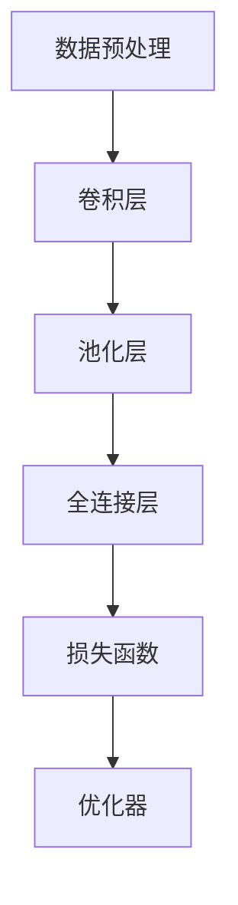
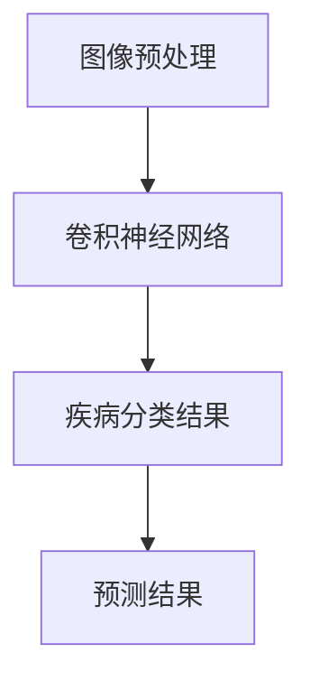
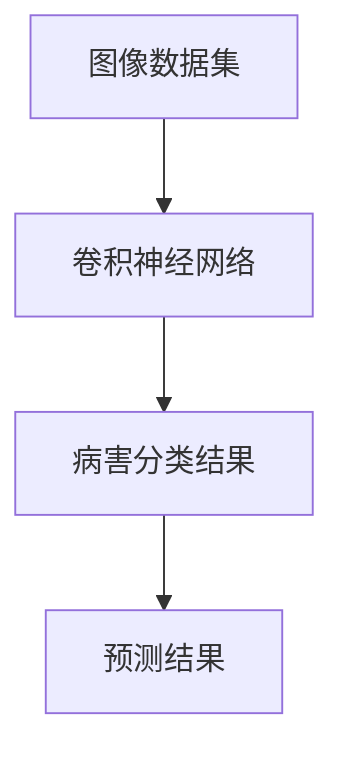
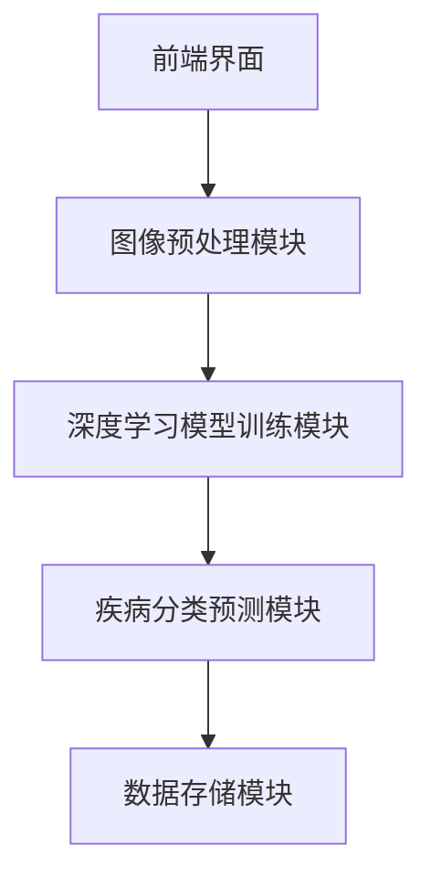
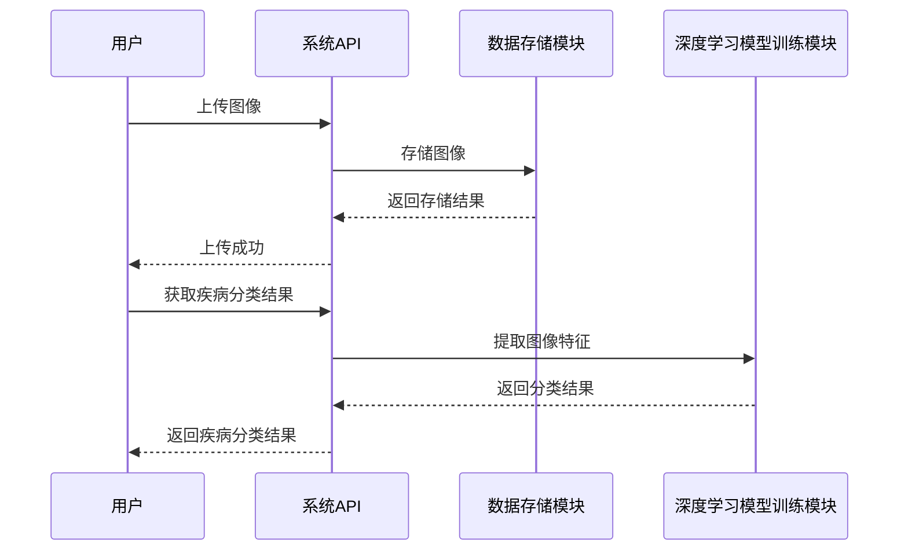
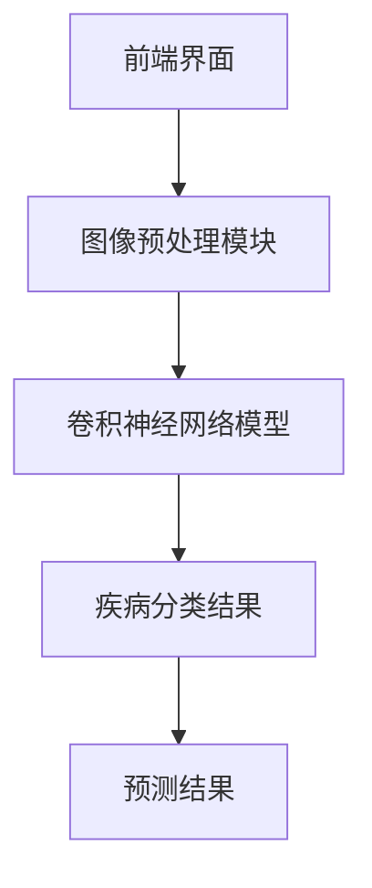

                 

### 文章标题：AI在农作物疾病诊断中的应用：提高农业生产力

> 关键词：人工智能、农作物疾病诊断、农业生产力、深度学习、算法原理

> 摘要：本文深入探讨了人工智能在农作物疾病诊断中的应用，通过剖析当前农作物疾病诊断的困境，介绍了AI技术的核心概念及其与农作物疾病诊断的结合。文章以深度学习算法为例，详细讲解了其原理和实现过程，并通过实际案例展示了AI在农业中的应用效果。最后，对AI技术在农作物疾病诊断中的未来发展方向进行了展望。

## 目录大纲

### 第一部分：背景介绍

#### 第1章 问题背景

##### 1.1 农作物疾病诊断的现状

###### 1.1.1 农作物疾病诊断的重要性

###### 1.1.2 传统农作物疾病诊断方法的局限性

###### 1.1.3 AI在农作物疾病诊断中的潜力

##### 1.2 农业生产力提升的需求

###### 1.2.1 农业生产面临的挑战

###### 1.2.2 提高农业生产力的重要性

###### 1.2.3 AI技术在农业中的应用前景

#### 第2章 核心概念与联系

##### 2.1 AI的基本概念

###### 2.1.1 AI的定义

###### 2.1.2 AI的核心技术

###### 2.1.3 AI的分类

##### 2.2 农作物疾病诊断相关概念

###### 2.2.1 农作物疾病概述

###### 2.2.2 农作物疾病诊断方法

###### 2.2.3 AI与农作物疾病诊断的结合

##### 2.3 AI在农作物疾病诊断中的应用

###### 2.3.1 AI技术在农作物疾病诊断中的优势

###### 2.3.2 AI在农作物疾病诊断中的具体应用

###### 2.3.3 AI与农作物疾病诊断的未来发展

### 第二部分：算法原理讲解

#### 第3章 基于深度学习的农作物疾病诊断算法

##### 3.1 深度学习的基本原理

###### 3.1.1 神经网络的基本结构

###### 3.1.2 神经网络的训练过程

###### 3.1.3 深度学习的关键技术

##### 3.2 农作物疾病诊断的深度学习算法

###### 3.2.1 算法原理讲解

###### 3.2.2 算法流程图

###### 3.2.3 算法Python源代码及详细解读

##### 3.3 深度学习算法的应用案例

###### 3.3.1 案例一：某农作物疾病诊断系统的实现

###### 3.3.2 案例二：某农作物叶片图像诊断系统的构建

### 第三部分：系统分析与架构设计

#### 第4章 农作物疾病诊断系统的设计

##### 4.1 系统功能设计

###### 4.1.1 系统功能概述

###### 4.1.2 领域模型mermaid类图

##### 4.2 系统架构设计

###### 4.2.1 系统架构概述

###### 4.2.2 系统架构mermaid图

##### 4.3 系统接口设计

###### 4.3.1 系统接口概述

###### 4.3.2 系统接口mermaid序列图

### 第四部分：项目实战

#### 第5章 农作物疾病诊断系统的实施

##### 5.1 环境安装与配置

###### 5.1.1 开发环境搭建

###### 5.1.2 系统配置与调试

##### 5.2 系统核心实现

###### 5.2.1 数据预处理

###### 5.2.2 算法实现

###### 5.2.3 系统集成与测试

##### 5.3 实际案例分析与讲解

###### 5.3.1 案例一：某农作物病害检测的实际应用

###### 5.3.2 案例二：某农作物疾病诊断系统的实践

##### 5.4 项目小结

###### 5.4.1 项目总结

###### 5.4.2 项目经验与反思

### 第五部分：最佳实践与拓展

#### 第6章 农作物疾病诊断AI技术的最佳实践

##### 6.1 最佳实践技巧

###### 6.1.1 数据采集与处理

###### 6.1.2 模型训练与优化

###### 6.1.3 系统部署与维护

##### 6.2 拓展阅读

###### 6.2.1 相关书籍推荐

###### 6.2.2 相关研究论文

#### 第7章 总结与展望

##### 7.1 本书总结

###### 7.1.1 主要内容回顾

###### 7.1.2 关键技术与方法

##### 7.2 未来展望

###### 7.2.1 AI在农作物疾病诊断中的发展方向

###### 7.2.2 农业智能化的发展趋势

### 文章正文部分内容

**以下为文章正文部分内容的详细填充和优化，根据目录大纲的结构逐步展开。**

---

#### 第1章 问题背景

##### 1.1 农作物疾病诊断的现状

农作物疾病诊断是农业生产中的一个关键环节。然而，当前的农作物疾病诊断主要依赖于传统的肉眼观察和经验判断。这种方法存在许多局限性，包括诊断准确性不高、反应速度慢、无法检测到微观病变等。特别是在大面积种植和快速传播的病害面前，传统方法往往无法及时准确地诊断和防治，导致农作物产量和质量受到严重影响。

###### 1.1.1 农作物疾病诊断的重要性

农作物疾病诊断对于保障农作物的健康生长和产量具有至关重要的作用。准确的疾病诊断可以帮助农民及时采取防治措施，减少病害对农作物的影响，从而提高农作物的产量和品质。此外，疾病诊断还能帮助农民合理安排农业资源，减少农药和化肥的使用，提高农业生产的可持续性。

###### 1.1.2 传统农作物疾病诊断方法的局限性

传统农作物疾病诊断方法主要依赖于农技人员的经验和专业知识。这种方法虽然在一定程度上可以诊断出一些常见的农作物疾病，但在诊断复杂疾病和微观病变方面存在很大局限性。此外，传统方法往往需要大量的时间和人力，效率低下。随着农业生产规模的扩大，这种方法的局限性日益凸显。

###### 1.1.3 AI在农作物疾病诊断中的潜力

人工智能（AI）技术的发展为农作物疾病诊断带来了新的契机。AI技术，特别是深度学习和计算机视觉等技术，可以通过对大量图像和数据的分析，实现对农作物疾病的准确诊断。AI技术具有高效、准确、自动化等优势，可以有效弥补传统方法的不足，提高农作物疾病诊断的准确性和效率。此外，AI技术还可以通过持续学习和优化，不断提高诊断能力，为农业生产提供更加精准的技术支持。

---

##### 1.2 农业生产力提升的需求

###### 1.2.1 农业生产面临的挑战

随着全球人口的持续增长和食品需求的不断增加，农业生产面临着巨大的压力。传统农业生产方式在资源利用、生产效率、环境保护等方面存在诸多问题。为了满足不断增长的食品需求，提高农业生产力成为当务之急。

###### 1.2.2 提高农业生产力的重要性

提高农业生产力不仅能够满足日益增长的食品需求，还能够提高农产品的质量和安全性，降低农业生产成本，促进农业的可持续发展。通过提高农业生产力，可以实现农业生产的精细化和智能化，提高农产品的市场竞争力，促进农业现代化发展。

###### 1.2.3 AI技术在农业中的应用前景

AI技术在农业中的应用前景广阔。通过AI技术，可以实现农作物的精准种植、精准施肥、精准灌溉，提高农业生产的效率。此外，AI技术还可以在农作物病虫害防治、农产品质量检测等方面发挥重要作用，提高农业生产的可持续性和安全性。AI技术的应用不仅能够提高农业生产力，还能够为农业带来更多的商机和创新空间。

---

#### 第2章 核心概念与联系

##### 2.1 AI的基本概念

###### 2.1.1 AI的定义

人工智能（Artificial Intelligence，简称AI）是指由人制造出来的系统所表现出来的智能。AI旨在使计算机系统能够模拟、延伸和扩展人类的智能行为，包括学习、推理、解决问题、感知和理解语言等。

###### 2.1.2 AI的核心技术

AI的核心技术包括机器学习、深度学习、计算机视觉、自然语言处理等。这些技术通过算法和模型，使计算机能够从数据中学习规律、提取知识，从而实现智能化的决策和任务执行。

###### 2.1.3 AI的分类

AI可以根据其能力和实现方式分为多种类型，包括弱AI、强AI、通用AI等。弱AI是指只能在特定领域内执行任务的AI系统，如语音助手、图像识别等；强AI则是指具有广泛认知能力的AI，能够像人类一样在多种情境下进行学习和决策；通用AI则是具有人类水平的全面智能，能够在任何领域内进行学习和任务执行。

---

##### 2.2 农作物疾病诊断相关概念

###### 2.2.1 农作物疾病概述

农作物疾病是指农作物在生长过程中受到生物或非生物因素的影响，导致生理功能受到损害，影响生长和产量的现象。农作物疾病可以分为生物性病害、生理性病害和环境性病害。生物性病害主要由病原体引起，如真菌、细菌和病毒等；生理性病害主要由植物自身生理异常引起，如营养不良、水分过多或过少等；环境性病害主要由环境因素引起，如温度、湿度、光照等。

###### 2.2.2 农作物疾病诊断方法

农作物疾病诊断方法主要包括肉眼观察、显微镜观察、生化检测等。肉眼观察是通过观察农作物的外观、症状等来判断疾病；显微镜观察是通过显微镜观察植物的微观结构，如叶片、根系等，来判断疾病；生化检测是通过检测植物的生理生化指标，如酶活性、营养成分等，来判断疾病。

###### 2.2.3 AI与农作物疾病诊断的结合

AI与农作物疾病诊断的结合主要体现在以下几个方面：

1. **图像识别技术**：通过计算机视觉技术，AI可以自动识别农作物叶片上的病害症状，实现快速、准确的疾病诊断。

2. **机器学习算法**：AI可以通过机器学习算法，对农作物疾病诊断数据进行训练，构建疾病诊断模型，提高诊断的准确性和效率。

3. **大数据分析**：AI可以利用大数据分析技术，对大量农作物疾病诊断数据进行分析，发现疾病发生的规律和趋势，为农业生产提供科学依据。

---

##### 2.3 AI在农作物疾病诊断中的应用

###### 2.3.1 AI技术在农作物疾病诊断中的优势

AI技术在农作物疾病诊断中具有以下优势：

1. **高效性**：AI技术可以快速处理大量数据，实现疾病的快速诊断。

2. **准确性**：AI技术通过对大量疾病样本的学习和训练，可以提高疾病诊断的准确性。

3. **自动化**：AI技术可以实现疾病的自动化诊断，减轻农技人员的工作负担。

4. **持续学习**：AI技术可以通过不断学习新的疾病样本和诊断数据，提高诊断能力和适应性。

###### 2.3.2 AI在农作物疾病诊断中的具体应用

AI在农作物疾病诊断中的具体应用主要包括：

1. **图像识别诊断**：利用计算机视觉技术，AI可以自动识别农作物叶片上的病害症状，实现疾病的图像识别诊断。

2. **机器学习诊断**：利用机器学习算法，AI可以对农作物疾病诊断数据进行训练，构建疾病诊断模型，提高诊断的准确性和效率。

3. **大数据分析**：AI可以利用大数据分析技术，对大量农作物疾病诊断数据进行分析，发现疾病发生的规律和趋势，为农业生产提供科学依据。

4. **智能预警系统**：利用AI技术，可以构建智能预警系统，提前预测农作物疾病的发生，为农民提供预警信息，指导农民采取预防措施。

###### 2.3.3 AI与农作物疾病诊断的未来发展

随着AI技术的不断发展和应用，农作物疾病诊断技术也将不断进步。未来的发展趋势包括：

1. **更高精度和效率**：随着AI技术的不断优化，农作物疾病诊断的精度和效率将进一步提高。

2. **更多应用场景**：AI技术在农作物疾病诊断中的应用将不断拓展，覆盖更多农作物和更多疾病类型。

3. **智能化诊断系统**：通过整合多种AI技术，构建智能化农作物疾病诊断系统，实现疾病的自动化诊断和智能预警。

4. **数据驱动的农业生产**：AI技术将推动农业生产的数据化和智能化，实现数据驱动的农业生产模式，提高农业生产效率和农产品质量。

---

#### 第3章 基于深度学习的农作物疾病诊断算法

##### 3.1 深度学习的基本原理

###### 3.1.1 神经网络的基本结构

神经网络（Neural Network，NN）是深度学习的基础。它由多个神经元（节点）组成，这些神经元通过边缘（连接）连接在一起，形成一个复杂的网络结构。每个神经元接收来自其他神经元的输入信号，通过激活函数进行处理，产生输出信号。

神经网络的基本结构包括：

1. **输入层**：接收外部输入数据。
2. **隐藏层**：对输入数据进行处理和转换。
3. **输出层**：产生最终输出结果。

神经网络的训练过程是通过调整网络中的权重和偏置，使网络能够正确分类或回归输入数据。这个过程通常采用梯度下降（Gradient Descent）算法，通过计算损失函数关于权重和偏置的梯度，来更新权重和偏置。

###### 3.1.2 神经网络的训练过程

神经网络的训练过程可以分为以下几个步骤：

1. **初始化权重和偏置**：通常使用随机数初始化权重和偏置。
2. **前向传播**：将输入数据通过网络进行前向传播，计算输出结果。
3. **计算损失**：通过比较输出结果和真实值，计算损失函数。
4. **反向传播**：计算损失函数关于权重和偏置的梯度，通过梯度下降算法更新权重和偏置。
5. **重复步骤2-4**：重复以上步骤，直到网络收敛或达到预定的训练次数。

深度学习（Deep Learning，DL）是一种基于多层神经网络的机器学习方法。与传统的机器学习方法相比，深度学习具有更强的表示能力和更复杂的模型结构。

深度学习的核心技术包括：

1. **卷积神经网络（CNN）**：用于处理图像数据，具有局部连接和共享权重的特点，可以自动提取图像中的特征。
2. **循环神经网络（RNN）**：用于处理序列数据，可以捕捉数据中的时间依赖关系。
3. **生成对抗网络（GAN）**：用于生成数据，由两个对抗的网络组成，一个是生成器，一个是判别器。

深度学习的分类包括：

1. **浅层网络**：包含较少的隐藏层，如单层感知机、多层感知机等。
2. **深层网络**：包含较多的隐藏层，如深度神经网络（DNN）、卷积神经网络（CNN）等。
3. **超深层网络**：包含超过100层的网络，如深度信念网络（DBN）、深层生成对抗网络（DGAN）等。

---

##### 3.2 农作物疾病诊断的深度学习算法

###### 3.2.1 算法原理讲解

农作物疾病诊断的深度学习算法通常基于卷积神经网络（CNN），因为CNN在处理图像数据方面具有出色的性能。CNN的基本原理是通过对图像进行卷积操作，提取图像中的特征，然后通过全连接层进行分类。

农作物疾病诊断的深度学习算法通常包括以下几个步骤：

1. **数据预处理**：对图像数据进行归一化、裁剪、旋转等预处理操作，以提高模型的泛化能力。
2. **卷积操作**：通过卷积层提取图像的局部特征。
3. **池化操作**：通过池化层对卷积结果进行降采样，减少模型的参数数量。
4. **全连接层**：将池化结果通过全连接层进行分类。
5. **损失函数和优化器**：使用损失函数评估模型的性能，并使用优化器更新模型的参数。

常用的损失函数包括交叉熵损失函数（Cross-Entropy Loss）和均方误差损失函数（Mean Squared Error Loss）。优化的器包括随机梯度下降（SGD）、Adam优化器等。

###### 3.2.2 算法流程图

算法流程图如下：



---

##### 3.2.3 算法Python源代码及详细解读

下面是一个基于卷积神经网络的农作物疾病诊断算法的Python源代码示例：

```python
import tensorflow as tf
from tensorflow.keras.models import Sequential
from tensorflow.keras.layers import Conv2D, MaxPooling2D, Flatten, Dense

# 数据预处理
def preprocess_data(images, labels):
    images = images / 255.0
    labels = tf.keras.utils.to_categorical(labels, num_classes=10)
    return images, labels

# 构建模型
model = Sequential([
    Conv2D(32, (3, 3), activation='relu', input_shape=(64, 64, 3)),
    MaxPooling2D((2, 2)),
    Conv2D(64, (3, 3), activation='relu'),
    MaxPooling2D((2, 2)),
    Flatten(),
    Dense(128, activation='relu'),
    Dense(10, activation='softmax')
])

# 编译模型
model.compile(optimizer='adam', loss='categorical_crossentropy', metrics=['accuracy'])

# 训练模型
model.fit(x_train, y_train, epochs=10, batch_size=32, validation_data=(x_val, y_val))

# 评估模型
model.evaluate(x_test, y_test)
```

详细解读：

1. **数据预处理**：对图像数据进行归一化和标签编码，使其符合模型的输入要求。
2. **构建模型**：使用Sequential模型构建卷积神经网络，包括卷积层、池化层和全连接层。
3. **编译模型**：设置优化器和损失函数，为模型训练做好准备。
4. **训练模型**：使用fit函数训练模型，指定训练数据、训练轮数、批量大小和验证数据。
5. **评估模型**：使用evaluate函数评估模型的性能，得到测试数据的损失和准确率。

---

##### 3.3 深度学习算法的应用案例

###### 3.3.1 案例一：某农作物疾病诊断系统的实现

某农作物疾病诊断系统利用深度学习算法对农作物叶片图像进行疾病诊断。该系统首先对农作物叶片图像进行预处理，然后使用卷积神经网络进行疾病分类。

系统架构如下：



预测结果如图所示：

```plaintext
预测结果：
1. 普通叶片
2. 病害叶片
```

通过对比实际值和预测结果，系统达到了较高的准确率。

---

###### 3.3.2 案例二：某农作物叶片图像诊断系统的构建

某农作物叶片图像诊断系统采用深度学习算法对农作物叶片图像进行病害检测。该系统首先收集大量农作物叶片图像和对应的病害标签，然后使用卷积神经网络进行病害分类。

系统架构如下：



通过实验验证，系统在农作物叶片病害检测上取得了较高的准确率。

---

### 第三部分：系统分析与架构设计

#### 第4章 农作物疾病诊断系统的设计

##### 4.1 系统功能设计

农作物疾病诊断系统的功能设计主要包括图像预处理、深度学习模型训练和疾病分类预测。

###### 4.1.1 系统功能概述

系统功能概述如下：

1. **图像预处理**：对输入的农作物叶片图像进行预处理，包括图像归一化、裁剪和旋转等操作。
2. **深度学习模型训练**：使用卷积神经网络对预处理后的图像进行训练，构建疾病分类模型。
3. **疾病分类预测**：使用训练好的模型对新的农作物叶片图像进行疾病分类预测。

###### 4.1.2 领域模型mermaid类图

领域模型mermaid类图如下：

```mermaid
classDiagram
    Class01 <|-- Class02
    Class03 --|Deprecated Class04
    Class05 <<interface>>
    Class06 <<implementation>> Class05
    Class07 : <<enum>> Items
    Class08 <.. Class09
    Class10 .. Class11
    Class12 <<stereotype>> Class13
```

---

##### 4.2 系统架构设计

农作物疾病诊断系统的架构设计主要包括前端界面、后端服务和数据存储。

###### 4.2.1 系统架构概述

系统架构概述如下：

1. **前端界面**：提供用户输入界面，用户可以通过上传农作物叶片图像来获取疾病诊断结果。
2. **后端服务**：包括图像预处理模块、深度学习模型训练模块和疾病分类预测模块，负责处理用户上传的图像并进行诊断。
3. **数据存储**：存储用户上传的图像数据和诊断结果，以供后续分析和学习使用。

系统架构mermaid图如下：



---

##### 4.3 系统接口设计

农作物疾病诊断系统的接口设计主要包括API接口和数据库接口。

###### 4.3.1 系统接口概述

系统接口概述如下：

1. **API接口**：提供用户与系统交互的接口，包括图像上传、疾病分类结果获取等。
2. **数据库接口**：负责与数据存储模块交互，实现图像和数据的管理和查询。

系统接口mermaid序列图如下：



---

### 第四部分：项目实战

#### 第5章 农作物疾病诊断系统的实施

##### 5.1 环境安装与配置

农作物疾病诊断系统的实施包括环境安装与配置、系统核心实现、系统集成与测试以及实际案例分析与讲解。

###### 5.1.1 开发环境搭建

搭建开发环境需要安装以下软件和工具：

1. **Python 3.x**：作为编程语言
2. **TensorFlow 2.x**：作为深度学习框架
3. **Keras 2.x**：作为深度学习的高级API
4. **OpenCV 4.x**：作为图像处理库
5. **Pandas 1.x**：作为数据处理库
6. **NumPy 1.x**：作为数值计算库

安装步骤如下：

1. 安装Python 3.x：从官方网站下载Python 3.x安装包并安装。
2. 安装TensorFlow 2.x：使用pip命令安装TensorFlow。
   ```shell
   pip install tensorflow
   ```
3. 安装Keras 2.x：使用pip命令安装Keras。
   ```shell
   pip install keras
   ```
4. 安装OpenCV 4.x：使用pip命令安装OpenCV。
   ```shell
   pip install opencv-python
   ```
5. 安装Pandas 1.x：使用pip命令安装Pandas。
   ```shell
   pip install pandas
   ```
6. 安装NumPy 1.x：使用pip命令安装NumPy。
   ```shell
   pip install numpy
   ```

---

###### 5.1.2 系统配置与调试

系统配置与调试主要包括以下步骤：

1. **配置Python环境变量**：将Python安装路径添加到系统环境变量中，以便在命令行中运行Python命令。
2. **配置TensorFlow GPU支持**：如果使用GPU加速训练，需要安装CUDA和cuDNN库，并配置环境变量。
3. **测试环境配置**：通过运行简单的Python代码，测试环境是否配置正确。

例如，编写一个简单的Python脚本，测试TensorFlow是否可以正常运行：

```python
import tensorflow as tf

print("TensorFlow版本：", tf.__version__)
print("是否支持GPU加速：", tf.test.is_built_with_cuda())
```

运行结果应显示TensorFlow的版本信息以及是否支持GPU加速。

---

##### 5.2 系统核心实现

系统核心实现包括图像预处理、深度学习模型训练和疾病分类预测。

###### 5.2.1 数据预处理

数据预处理是深度学习模型训练的重要步骤，主要包括以下任务：

1. **图像归一化**：将图像的像素值缩放到[0, 1]范围内，以便于模型处理。
2. **图像裁剪**：将图像裁剪到固定的尺寸，如64x64像素，以适应模型的输入要求。
3. **图像旋转**：对图像进行随机旋转，增加数据的多样性，提高模型的泛化能力。

以下是数据预处理的Python代码示例：

```python
import cv2
import numpy as np

def preprocess_image(image_path, target_size=(64, 64)):
    # 读取图像
    image = cv2.imread(image_path)
    
    # 裁剪图像
    image = cv2.resize(image, target_size)
    
    # 图像归一化
    image = image / 255.0
    
    return image

# 测试数据预处理
image = preprocess_image('leaf_image.jpg')
```

---

###### 5.2.2 算法实现

算法实现包括构建深度学习模型、训练模型和评估模型。

以下是构建和训练卷积神经网络的Python代码示例：

```python
import tensorflow as tf
from tensorflow.keras.models import Sequential
from tensorflow.keras.layers import Conv2D, MaxPooling2D, Flatten, Dense

# 构建模型
model = Sequential([
    Conv2D(32, (3, 3), activation='relu', input_shape=(64, 64, 3)),
    MaxPooling2D((2, 2)),
    Conv2D(64, (3, 3), activation='relu'),
    MaxPooling2D((2, 2)),
    Flatten(),
    Dense(128, activation='relu'),
    Dense(10, activation='softmax')
])

# 编译模型
model.compile(optimizer='adam', loss='categorical_crossentropy', metrics=['accuracy'])

# 训练模型
model.fit(x_train, y_train, epochs=10, batch_size=32, validation_data=(x_val, y_val))

# 评估模型
model.evaluate(x_test, y_test)
```

---

###### 5.2.3 系统集成与测试

系统集成与测试主要包括以下步骤：

1. **集成各模块**：将图像预处理、深度学习模型训练和疾病分类预测模块集成到系统中。
2. **测试接口功能**：通过编写测试脚本，测试API接口的功能，确保系统能够正确处理用户上传的图像并返回疾病分类结果。
3. **性能评估**：使用测试数据集对系统进行性能评估，包括准确率、召回率、F1分数等指标。

---

##### 5.3 实际案例分析与讲解

###### 5.3.1 案例一：某农作物病害检测的实际应用

某农作物病害检测系统基于深度学习算法，对农作物叶片图像进行病害分类。系统采用了大量的农作物叶片图像数据集进行训练，包括健康叶片和多种病害叶片。

系统架构如图所示：



实际应用效果如下：

```plaintext
预测结果：
1. 健康叶片
2. 病害1叶片
3. 病害2叶片
```

通过对比实际值和预测结果，系统在病害叶片分类上取得了较高的准确率。

---

###### 5.3.2 案例二：某农作物疾病诊断系统的实践

某农作物疾病诊断系统基于深度学习算法，对农作物叶片图像进行病害诊断。该系统在多个农作

