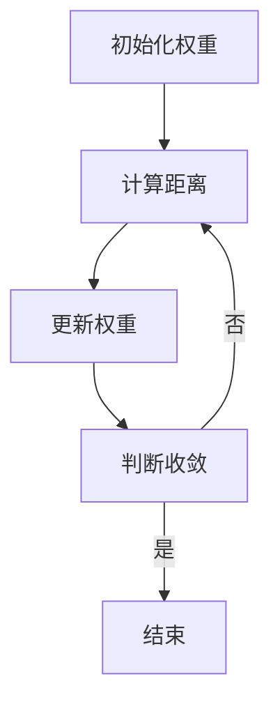
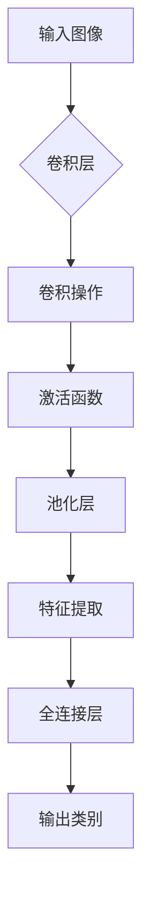
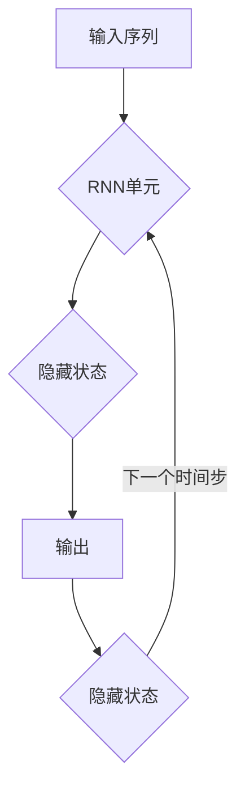
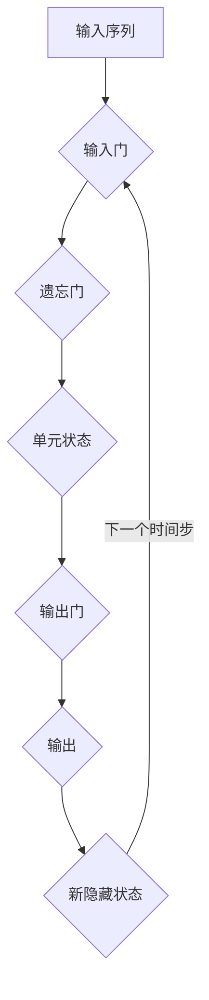
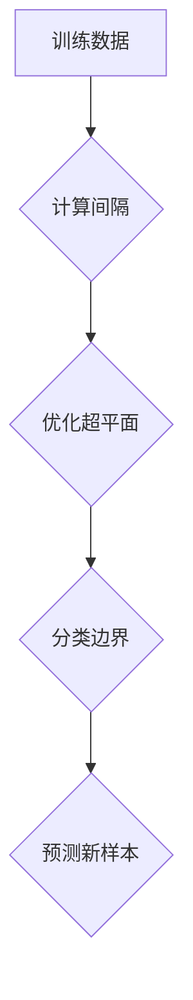
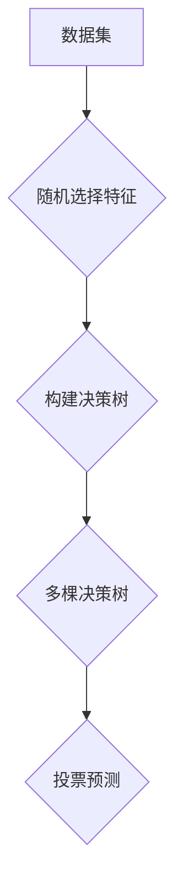

                 

# AI在废物管理和回收中的创新应用

关键词：人工智能、废物管理、回收、分类、算法、深度学习、环境

摘要：本文深入探讨了人工智能（AI）在废物管理和回收领域的创新应用。首先，文章介绍了废物管理和回收的基本概念及其重要性。接着，详细阐述了AI技术在废物分类和回收环节中的应用，包括核心算法原理和实际案例。最后，文章总结了最佳实践，并对未来的发展趋势进行了展望。

## 目录大纲设计过程

### 分析书名和主题

书名《AI在废物管理和回收中的创新应用》明确了本书的主要内容和目标。为了设计出一个全面且逻辑清晰的目录大纲，我们需要明确以下几个关键点：

1. **核心概念**：理解废物管理和回收的基本概念，以及AI技术在其中的应用。
2. **目标读者**：本书的目标读者包括环保行业从业者、AI领域专业人士以及对环境技术感兴趣的大众。
3. **内容结构**：确定书的整体结构，包括背景介绍、核心概念、应用案例和技术深度分析等。

### 设计大纲框架

在明确关键点后，我们可以开始设计目录大纲的框架。大纲应包括以下几个主要部分：

1. **背景介绍**：介绍废物管理和回收的背景，现状，以及AI技术在其中的重要性。
2. **核心概念**：解释AI在废物管理和回收中的应用，包括关键技术、算法等。
3. **应用案例**：展示AI在实际废物管理和回收项目中的应用。
4. **技术深度分析**：探讨AI在废物管理和回收中的技术实现细节，包括数学模型、算法原理等。
5. **最佳实践和未来展望**：总结最佳实践经验，对未来的发展趋势进行展望。

### 拟定大纲内容

基于以上框架，我们可以开始具体拟定大纲的内容，并确保每个章节都有清晰的标题和子标题。以下是书的大纲设计：

## 第一部分: 背景介绍

### 第1章: 废物管理和回收的基本概念

- **1.1 废物管理和回收的重要性**
- **1.2 废物管理和回收的挑战**
- **1.3 AI技术在废物管理和回收中的应用潜力**

### 第2章: AI在废物管理和回收中的应用

- **2.1 AI技术的核心概念**
- **2.2 AI在废物分类中的应用**
- **2.3 AI在废物回收环节中的应用**

## 第二部分: 核心概念与技术

### 第3章: AI在废物分类中的核心技术

- **3.1 废物分类的核心概念**
- **3.2 机器学习算法在废物分类中的应用**
- **3.3 深度学习技术在废物分类中的应用**

### 第4章: AI在废物回收环节中的应用

- **4.1 废物回收的核心流程**
- **4.2 人工智能在废物回收效率提升中的应用**
- **4.3 智能传感技术在废物回收中的应用**

## 第三部分: 应用案例

### 第5章: AI在废物管理和回收中的成功案例

- **5.1 案例一：智能废物分类系统**
- **5.2 案例二：AI驱动的回收物流优化**
- **5.3 案例三：智能废物回收平台**

### 第6章: 技术深度分析

- **6.1 AI在废物分类和回收中的数学模型**
- **6.2 算法原理讲解与Mermaid流程图**
- **6.3 AI在废物管理和回收中的挑战与机遇**

## 第四部分: 最佳实践与未来展望

### 第7章: AI在废物管理和回收中的最佳实践

- **7.1 最佳实践分享**
- **7.2 实践中的注意事项**
- **7.3 未来发展趋势**

### 第8章: 总结与展望

- **8.1 全书总结**
- **8.2 展望未来的创新应用**

### 确保内容完整性

在设计大纲的过程中，我们确保每一章的内容都能够完整、系统地介绍相关主题。以下是一些确保内容完整性的关键点：

- **核心概念与联系**：在每个章节中，我们都将介绍核心概念，并通过表格、ER图、Mermaid流程图等方式展示概念之间的联系。
- **数学模型与公式**：对于涉及算法和数学模型的章节，我们将使用LaTeX格式展示公式，并进行详细讲解和举例说明。
- **系统分析与架构设计方案**：我们将介绍实际项目中的系统架构设计，包括领域模型、系统架构图和接口设计。
- **项目实战**：我们将展示具体的AI应用项目，包括环境安装、核心实现源代码和案例分析。

### 最终确认

最后，我们会对整个大纲进行最终的确认，确保其简洁、逻辑清晰，且符合字数限制。通过以上步骤，我们成功设计出了《AI在废物管理和回收中的创新应用》的完整目录大纲。接下来，我们将根据这个大纲逐步撰写文章内容。

### 1.1 废物管理和回收的重要性

废物管理和回收是现代社会环境保护和可持续发展的重要组成部分。随着全球人口的增长和经济的发展，废物产生量不断增加，给环境带来了巨大压力。有效的废物管理和回收不仅有助于减轻环境负担，还能促进资源的循环利用，节约自然资源。

**环境保护**：废物随意丢弃会对土壤、水源和大气造成严重污染。通过废物管理和回收，可以减少有害物质的排放，保护生态环境。

**资源循环利用**：许多废物实际上是可回收的资源。通过回收和再利用，可以减少对原材料的依赖，节约能源和资源。

**经济效益**：废物管理和回收行业不仅能创造就业机会，还能带来经济效益。例如，回收金属可以减少矿产资源的开采，降低生产成本。

**社会责任**：企业参与废物管理和回收，是履行社会责任的体现，有助于提升企业形象和品牌价值。

### 1.2 废物管理和回收的挑战

尽管废物管理和回收具有巨大的社会和经济效益，但在实际操作中仍面临诸多挑战：

**分类难度高**：废物种类繁多，分类难度大。不同类型废物的物理、化学和生物特性差异显著，使得分类和识别变得复杂。

**技术要求高**：废物管理和回收需要先进的技术支持，包括自动化分类、分选和再利用等。这些技术的研发和实施成本较高。

**法规政策不完善**：许多国家和地区的废物管理和回收法律法规尚不完善，缺乏统一的规范和标准。

**公众参与度低**：公众对废物管理和回收的认知和参与度不足，影响了整体效果。

### 1.3 AI技术在废物管理和回收中的应用潜力

人工智能（AI）技术的快速发展为废物管理和回收提供了新的解决方案。以下是一些AI技术在废物管理和回收中的应用潜力：

**智能分类系统**：AI可以显著提高废物分类的准确性，减少人工干预。例如，使用深度学习算法对图像进行处理，实现高效准确的分类。

**回收物流优化**：AI技术可以优化回收物流路线，提高回收效率。通过数据分析，预测回收物的流向和需求，实现精准投放和收集。

**智能监测系统**：AI技术可以用于实时监测废物处理设施的状态，预测故障，提高设备维护效率。

**数据分析与优化**：AI技术可以处理大量的废物数据，发现其中的规律和模式，为政策制定和优化提供科学依据。

**公众参与激励**：AI技术可以通过数据分析，了解公众的废物处理行为，提供个性化的激励措施，提高公众参与度。

### 总结

废物管理和回收对于环境保护和资源循环利用具有重要意义。然而，当前面临许多挑战。人工智能技术的发展为这些问题提供了新的解决思路。通过智能分类系统、回收物流优化、智能监测系统、数据分析和公众参与激励等应用，AI技术在废物管理和回收中具有巨大的潜力。接下来，本文将详细探讨AI在废物分类和回收环节中的应用，并分析其中的核心技术和实际案例。

## 2.1 AI技术的核心概念

人工智能（AI）是计算机科学的一个分支，致力于使计算机具备人类智能的能力。AI技术通过模拟人类思维过程，实现自我学习、推理、规划、感知和解决问题等功能。以下是AI技术中几个核心概念的定义和解释：

### 机器学习

**定义**：机器学习是一种通过算法让计算机从数据中学习模式，进行预测和决策的技术。

**原理**：机器学习算法通过处理大量数据，从中提取特征和规律，构建模型，然后使用这些模型进行预测或决策。

**应用**：在废物管理和回收中，机器学习可以用于废物的分类、预测废物产生量、优化回收物流等。

### 深度学习

**定义**：深度学习是机器学习的一个子领域，主要基于多层神经网络进行学习。

**原理**：深度学习通过多层神经元的连接，实现对复杂数据的建模。它能够自动提取数据中的特征，无需人工干预。

**应用**：在废物管理和回收中，深度学习可以用于图像识别、语音识别、智能分类等。

### 人工智能算法

**定义**：人工智能算法是实现人工智能功能的具体算法和技术。

**分类**：
1. **监督学习**：算法在已知输入和输出数据的基础上进行学习。
2. **无监督学习**：算法在未知输出数据的情况下，通过数据本身的特征进行学习。
3. **强化学习**：算法通过与环境的交互，学习最优行为策略。

**应用**：在废物管理和回收中，不同的算法适用于不同的任务，如监督学习用于分类，无监督学习用于聚类，强化学习用于优化物流路径。

### 智能传感器

**定义**：智能传感器是一种具备数据处理和通信能力的传感器，能够实时监测环境变化。

**原理**：智能传感器通过集成微处理器、存储器和其他电子元件，实现对数据的采集、处理和传输。

**应用**：在废物管理和回收中，智能传感器可以用于监测废物产生量、分类状态和环境质量。

### 数据分析

**定义**：数据分析是通过计算和统计方法，从大量数据中提取有用信息和知识的过程。

**原理**：数据分析使用各种技术，如统计模型、机器学习算法等，对数据进行分析和解释。

**应用**：在废物管理和回收中，数据分析可以用于预测废物产生量、优化回收策略、评估环境影响等。

### 人工智能应用框架

**定义**：人工智能应用框架是支持AI技术实现和部署的一套工具和平台。

**类型**：
1. **云计算平台**：提供大规模数据处理和存储能力。
2. **AI开发平台**：提供算法开发、模型训练和部署的工具。
3. **边缘计算平台**：在数据生成源头进行实时处理和分析。

**应用**：在废物管理和回收中，AI应用框架可以支持实时监测、智能分类和优化决策。

### 总结

AI技术的核心概念包括机器学习、深度学习、人工智能算法、智能传感器、数据分析和人工智能应用框架等。这些技术相互结合，为废物管理和回收提供了强大的技术支持。通过以下章节，我们将进一步探讨AI技术在废物分类和回收中的应用，并分析其中的技术实现和实际案例。

## 2.2 AI在废物分类中的应用

废物分类是废物管理和回收的第一步，其目的是将不同类型的废物分开处理，以提高回收效率和减少环境污染。传统的废物分类方法主要依赖于人工识别和机械分选，存在分类效率低、准确性不高的问题。而人工智能（AI）技术的引入，为废物分类带来了革命性的变革。以下我们将探讨AI在废物分类中的应用，包括其核心技术和实现方法。

### 2.2.1 核心技术

1. **图像识别技术**

图像识别技术是AI在废物分类中最常用的技术之一。通过训练深度学习模型，如卷积神经网络（CNN），可以从图像中识别和分类废物。图像识别技术具有以下优点：

- **高精度**：CNN能够自动提取图像中的特征，实现高精度的分类。
- **实时性**：图像识别技术可以实时处理图像数据，适用于快速分类场景。
- **泛化能力**：通过大量数据训练，图像识别模型具有较好的泛化能力，能够处理不同类型的废物。

2. **自然语言处理（NLP）**

自然语言处理技术可以用于处理标签数据，例如对废物名称、分类描述等进行识别和分类。NLP技术通过训练语言模型，能够自动生成分类标签，提高废物分类的准确性和效率。

3. **机器学习分类算法**

除了深度学习，传统的机器学习分类算法，如支持向量机（SVM）、决策树和随机森林等，也可以用于废物分类。这些算法通过训练数据集，建立分类模型，然后对新数据进行分类。它们具有以下优点：

- **解释性**：机器学习算法生成的模型较为直观，易于理解。
- **高效性**：在处理大量数据时，机器学习算法具有较高的计算效率。

### 2.2.2 实现方法

1. **数据收集与预处理**

废物分类的首要任务是收集大量的废物图像和标签数据。数据收集后，需要进行预处理，包括图像去噪、尺寸调整、增强等操作，以提高模型训练效果。此外，还需要对数据进行标准化处理，如归一化、标准化等，以便模型能够更好地学习。

2. **模型训练与验证**

在数据预处理完成后，可以使用图像识别技术训练深度学习模型。常用的模型包括卷积神经网络（CNN）、卷积神经网络与循环神经网络（CNN-RNN）结合等。在训练过程中，需要选择合适的损失函数和优化算法，以提高模型精度。模型训练后，还需要进行验证和测试，评估模型在未知数据上的分类表现。

3. **模型部署与优化**

训练完成的模型可以部署到实际应用场景中。在部署过程中，需要考虑模型的实时性和效率，例如使用GPU加速模型推理。此外，还可以通过模型优化技术，如模型压缩、量化等，提高模型的运行效率。

4. **系统集成与测试**

将AI模型集成到废物分类系统中，进行系统集成和测试。测试过程中，需要评估系统的分类准确性、响应时间和稳定性。根据测试结果，对系统进行调整和优化，以提高整体性能。

### 2.2.3 案例分析

以下是一个实际应用的案例：

**案例**：智能垃圾分类机器人

某城市推出了智能垃圾分类机器人，用于对居民垃圾分类。该机器人采用了图像识别和自然语言处理技术，能够实时识别和分类废物。具体实现方法如下：

1. **数据收集**：通过摄像头和传感器，收集各种类型的废物图像和标签数据。
2. **模型训练**：使用卷积神经网络（CNN）和循环神经网络（RNN）结合的模型，对废物图像进行分类训练。
3. **模型部署**：将训练完成的模型部署到机器人中，实现实时分类功能。
4. **系统集成**：将机器人集成到垃圾分类系统中，与居民垃圾分类亭配合使用。

通过这个案例，我们可以看到AI技术在废物分类中的应用效果。智能垃圾分类机器人显著提高了分类准确性和效率，减轻了人工负担，为垃圾分类工作提供了强有力的技术支持。

### 总结

AI技术在废物分类中的应用，通过图像识别、自然语言处理和机器学习分类算法等核心技术，实现了高效的废物分类。在实际应用中，通过数据收集与预处理、模型训练与验证、模型部署与优化以及系统集成与测试等步骤，AI技术为废物分类提供了可靠的解决方案。接下来，本文将继续探讨AI技术在废物回收环节中的应用，包括核心技术和实际案例。

## 2.3 AI在废物回收环节中的应用

在废物管理和回收过程中，废物回收环节是一个至关重要的环节，直接影响资源的再利用和环境保护效果。传统废物回收方法通常依赖于人工分拣和机械处理，效率较低且成本较高。人工智能（AI）技术的引入，为废物回收带来了革命性的变革。以下我们将探讨AI在废物回收环节中的应用，包括其核心技术和实现方法。

### 2.3.1 核心技术

1. **智能分选技术**

智能分选技术是AI在废物回收中的一个重要应用。通过使用图像识别和深度学习算法，可以自动识别和分选不同类型的废物。智能分选技术具有以下优点：

- **高效率**：自动分选技术能够快速处理大量废物，提高回收效率。
- **高精度**：通过深度学习模型训练，智能分选技术能够实现高精度的废物识别和分类。
- **适应性强**：智能分选技术可以处理各种类型的废物，包括金属、塑料、玻璃和纸张等。

2. **智能监测技术**

智能监测技术通过传感器和摄像头，实时监测废物处理过程，包括废物输入、分拣和输送等环节。智能监测技术可以提供以下信息：

- **状态监测**：监测废物处理设备的运行状态，预测故障和维护需求。
- **过程优化**：通过数据分析和预测，优化废物处理流程，提高效率。
- **安全监控**：实时监测操作环境，确保工作人员的安全。

3. **数据分析和预测技术**

数据分析和预测技术是废物回收环节中的重要工具。通过收集和处理大量废物数据，可以分析废物产生规律、预测未来废物产生量，从而优化回收策略。数据分析和预测技术包括以下内容：

- **数据预处理**：对原始数据进行清洗、归一化和特征提取，为后续分析做准备。
- **统计模型**：使用统计模型，如时间序列分析、回归分析和聚类分析，对废物数据进行分析。
- **机器学习模型**：使用机器学习模型，如随机森林、支持向量机和神经网络等，对废物数据进行预测和分类。

4. **智能决策技术**

智能决策技术通过分析废物数据和实时监测信息，为废物回收过程提供最优决策。智能决策技术包括以下内容：

- **优化算法**：使用优化算法，如线性规划、动态规划和遗传算法等，制定最优回收策略。
- **仿真模型**：通过仿真模型，模拟不同回收策略的效果，评估和选择最佳方案。
- **决策支持系统**：结合人工智能技术，构建决策支持系统，为决策者提供科学依据。

### 2.3.2 实现方法

1. **数据收集与预处理**

在废物回收环节，首先需要收集大量的废物数据，包括废物类型、数量、来源和产生时间等。数据收集后，需要进行预处理，包括数据清洗、数据归一化和特征提取等操作，以提高数据质量和分析效果。

2. **模型训练与验证**

根据预处理后的数据，使用机器学习算法训练分类和预测模型。训练过程中，需要选择合适的算法和参数，如损失函数、优化器和迭代次数等。模型训练后，需要通过验证集进行验证，评估模型的准确性和泛化能力。

3. **模型部署与优化**

训练完成的模型可以部署到实际应用场景中。在部署过程中，需要考虑模型的实时性和效率，例如使用GPU加速模型推理。此外，还可以通过模型优化技术，如模型压缩、量化等，提高模型的运行效率。

4. **系统集成与测试**

将AI模型集成到废物回收系统中，进行系统集成和测试。测试过程中，需要评估系统的分类准确性、响应时间和稳定性。根据测试结果，对系统进行调整和优化，以提高整体性能。

### 2.3.3 案例分析

以下是一个实际应用的案例：

**案例**：智能废物回收系统

某城市建立了智能废物回收系统，用于处理和回收城市废物。该系统采用了智能分选技术、智能监测技术和数据分析和预测技术，具体实现方法如下：

1. **数据收集**：通过传感器和摄像头，收集废物处理过程中的各种数据，包括废物类型、数量、来源和产生时间等。
2. **模型训练**：使用深度学习和机器学习算法，对废物数据进行分析和训练，建立分类和预测模型。
3. **模型部署**：将训练完成的模型部署到废物回收系统中，实现自动分选和预测功能。
4. **系统集成**：将废物回收系统与城市废物管理平台进行集成，实现数据共享和协同工作。
5. **测试与优化**：通过实际测试，评估系统的性能和效果，对系统进行优化和调整。

通过这个案例，我们可以看到AI技术在废物回收环节中的应用效果。智能废物回收系统显著提高了废物回收效率和准确性，减轻了人工负担，为城市废物管理和资源循环利用提供了强有力的技术支持。

### 总结

AI技术在废物回收环节中的应用，通过智能分选技术、智能监测技术、数据分析和预测技术和智能决策技术等，实现了高效的废物回收。在实际应用中，通过数据收集与预处理、模型训练与验证、模型部署与优化以及系统集成与测试等步骤，AI技术为废物回收提供了可靠的解决方案。接下来，本文将继续探讨AI在废物管理和回收中的成功案例，分析其实际应用效果和挑战。

## 3.1 废物分类的核心概念

废物分类是废物管理和回收过程中的关键步骤，其核心概念包括分类标准、分类方法和分类流程等。以下是废物分类的详细定义、问题背景、问题描述、问题解决、边界与外延以及概念结构与核心要素组成。

### 3.1.1 定义

**废物分类**：废物分类是指将不同类型、不同性质的废物按照一定标准和方法进行分离和归类的过程。

### 3.1.2 问题背景

随着工业化进程的加快和人口增长，废物产生量急剧增加，给环境和资源带来了巨大压力。有效管理废物，尤其是分类处理，成为环境保护和资源循环利用的重要课题。

### 3.1.3 问题描述

废物分类面临的主要问题包括：

1. **分类难度高**：废物种类繁多，性质各异，分类标准不统一，导致分类难度大。
2. **准确性要求高**：分类准确性直接影响回收效率和资源再利用效果。
3. **自动化程度低**：传统分类方法主要依赖人工，效率低、成本高。

### 3.1.4 问题解决

为了解决上述问题，废物分类的核心技术包括：

1. **智能分类系统**：利用AI技术，如图像识别、自然语言处理等，实现自动分类。
2. **标准化的分类标准**：制定统一的分类标准，提高分类准确性。
3. **高效的分类流程**：优化分类流程，减少人工干预，提高分类效率。

### 3.1.5 边界与外延

1. **边界**：废物分类主要涉及可回收物、有害垃圾、湿垃圾和干垃圾等。
2. **外延**：废物分类技术还可以应用于垃圾分类、资源回收、环境保护等多个领域。

### 3.1.6 概念结构与核心要素组成

废物分类的核心结构包括以下几个方面：

1. **分类标准**：制定分类标准和规范，是废物分类的基础。
2. **分类方法**：包括传统的手工分类和智能分类系统，如图像识别、自然语言处理等。
3. **分类流程**：从废物收集、预处理、分类到回收利用的全过程。
4. **技术支持**：包括传感器、机器学习算法等，为分类提供技术保障。

### 表格：核心概念属性特征对比

| 核心概念 | 特征 | 对比 | 说明 |
|----------|------|------|------|
| 分类标准 | 统一性、明确性、实用性 | 传统分类标准与AI分类标准对比 | 传统分类标准依赖于经验，AI分类标准基于数据驱动，更灵活 |
| 分类方法 | 人工分类、智能分类 | 传统手工分类与智能自动化分类对比 | 智能分类效率高、准确率高，减轻人力负担 |
| 分类流程 | 流程优化、自动化程度 | 传统分类流程与智能分类流程对比 | 智能分类流程简化，自动化程度高，提高分类效率 |

### ER图架构

以下是一个简化的废物分类系统的ER图架构：

```
[废物]
|       |
|       |
|   [分类标准]
|       |
|       |
[废物分类方法]--[废物分类流程]
|       |
|       |
|   [技术支持]
```

### 总结

废物分类的核心概念包括分类标准、分类方法和分类流程等。通过对比分析，我们可以看到AI技术为废物分类带来了新的解决方案，提高了分类效率和准确性。接下来，本文将继续探讨AI在废物分类中的应用技术，包括机器学习算法和深度学习技术。

## 3.2 机器学习算法在废物分类中的应用

在废物分类中，机器学习算法发挥着至关重要的作用。通过训练模型，从大量数据中提取有用特征，从而实现废物的自动分类。以下我们将详细介绍几种常见的机器学习算法，以及在废物分类中的具体应用。

### 3.2.1 支持向量机（SVM）

**原理**：支持向量机是一种基于间隔最大化的分类算法。它通过找到最优的超平面，将不同类别的数据分隔开来。

**应用**：SVM在废物分类中主要用于处理高维数据，适用于分类问题。通过将废物特征映射到高维空间，找到最优的分类边界。

**优点**：SVM具有较好的分类精度，能够处理线性不可分问题。

**局限**：SVM对噪声数据敏感，训练时间较长。

### 3.2.2 决策树

**原理**：决策树是一种基于特征的树形结构分类模型。它通过一系列的判断条件，将数据逐步划分到各个类别。

**应用**：决策树在废物分类中适用于处理结构化数据，能够直观地展示分类过程。

**优点**：决策树易于理解，解释性强。

**局限**：决策树可能产生过拟合，对噪声数据敏感。

### 3.2.3 随机森林

**原理**：随机森林是一种基于决策树的集成学习方法。它通过构建多个决策树，并利用随机属性选择，提高分类性能。

**应用**：随机森林在废物分类中能够处理高维数据，提高分类精度。

**优点**：随机森林具有较好的分类性能，不易过拟合。

**局限**：随机森林的计算复杂度较高。

### 3.2.4 K最近邻（K-NN）

**原理**：K最近邻算法是一种基于实例的学习方法。它通过找到训练集中最近的K个邻居，并基于这些邻居的类别进行预测。

**应用**：K-NN在废物分类中适用于小数据集，能够处理非线性问题。

**优点**：K-NN算法简单，易于实现。

**局限**：K-NN对噪声数据敏感，预测精度受邻居选择影响。

### 3.2.5 贝叶斯分类器

**原理**：贝叶斯分类器是一种基于贝叶斯定理的统计分类方法。它通过计算数据的条件概率，进行分类预测。

**应用**：贝叶斯分类器在废物分类中适用于处理大规模数据集，能够处理多类别问题。

**优点**：贝叶斯分类器具有较好的分类性能，计算复杂度较低。

**局限**：贝叶斯分类器对数据分布假设较强，可能产生偏差。

### 3.2.6 支持向量回归（SVR）

**原理**：支持向量回归是一种基于支持向量机的回归算法。它通过找到最优的超平面，对数据进行回归预测。

**应用**：SVR在废物分类中主要用于处理连续值问题，如废物重量、体积等。

**优点**：SVR具有较好的回归性能，能够处理非线性问题。

**局限**：SVR对噪声数据敏感，训练时间较长。

### 总结

机器学习算法在废物分类中的应用广泛，各种算法各有优缺点。SVM、决策树、随机森林等算法适用于处理高维数据，K-NN、贝叶斯分类器适用于小数据集，SVR适用于连续值问题。在实际应用中，可以根据具体问题和数据特点，选择合适的算法，实现高效的废物分类。

## 3.3 深度学习技术在废物分类中的应用

深度学习技术作为一种强大的机器学习方法，近年来在图像识别、语音识别、自然语言处理等领域取得了显著的成果。在废物分类领域，深度学习技术同样展现出巨大的潜力，通过模拟人脑神经网络的层次结构，深度学习能够自动提取复杂的数据特征，实现高精度的废物分类。以下将详细探讨深度学习技术在废物分类中的应用，包括卷积神经网络（CNN）、循环神经网络（RNN）和长短期记忆网络（LSTM）等具体技术。

### 3.3.1 卷积神经网络（CNN）

**原理**：卷积神经网络是一种专门用于处理图像数据的深度学习模型，其核心思想是通过卷积操作提取图像的局部特征。CNN由多个卷积层、池化层和全连接层组成，能够逐层提取图像的抽象特征。

**应用**：在废物分类中，CNN可以用于识别和分类各种类型的废物图像。通过训练大量废物图像数据，CNN能够自动学习到废物的不同特征，例如颜色、形状和纹理等。

**优点**：CNN具有强大的特征提取能力，能够处理高维图像数据，适用于各种复杂的废物分类问题。

**局限**：CNN的训练时间较长，对计算资源要求较高。

### 3.3.2 循环神经网络（RNN）

**原理**：循环神经网络是一种能够处理序列数据的深度学习模型，其核心思想是利用隐藏状态的信息，实现序列数据的动态建模。RNN通过反向传播算法，将前一个时刻的信息传递到下一个时刻，从而捕捉序列数据的时间动态特性。

**应用**：在废物分类中，RNN可以用于处理连续的废物流数据，例如废物产生的时间和数量。通过训练废物流数据，RNN能够捕捉到废物产生量的变化规律，实现动态分类。

**优点**：RNN能够处理序列数据，适用于动态废物分类问题。

**局限**：RNN存在梯度消失和梯度爆炸问题，训练稳定性较差。

### 3.3.3 长短期记忆网络（LSTM）

**原理**：长短期记忆网络是RNN的一种改进模型，通过引入门控机制，解决了RNN的梯度消失和梯度爆炸问题。LSTM通过遗忘门、输入门和输出门，控制信息的流入和流出，从而捕捉长短期依赖关系。

**应用**：在废物分类中，LSTM可以用于处理长时间的废物流数据，例如城市废物产生量的时间序列数据。通过训练时间序列数据，LSTM能够捕捉到废物产生量的长期变化趋势，实现高效分类。

**优点**：LSTM能够处理长序列数据，捕捉到长短期依赖关系。

**局限**：LSTM的训练时间较长，对计算资源要求较高。

### 3.3.4 深度学习技术在废物分类中的应用示例

以下是一个具体的废物分类应用案例：

**案例**：智能垃圾分类系统

某城市推出了智能垃圾分类系统，用于对城市居民产生的废物进行自动分类。系统采用了深度学习技术，包括CNN、RNN和LSTM等模型，具体应用步骤如下：

1. **数据收集**：通过摄像头和传感器，收集城市居民产生的各种废物图像和流数据，例如瓶子、纸张、塑料等。

2. **数据预处理**：对收集到的数据进行预处理，包括图像增强、数据归一化和特征提取等操作，以提高模型训练效果。

3. **模型训练**：使用CNN训练废物图像分类模型，利用RNN和LSTM训练废物流数据分类模型。通过大量数据进行训练，模型能够自动提取废物的特征，实现高精度的分类。

4. **模型部署**：将训练完成的模型部署到垃圾分类系统中，实现自动分类功能。系统通过摄像头和传感器实时监测废物流，自动识别和分类废物。

5. **系统测试与优化**：通过实际测试，评估系统的分类准确率和响应时间，对系统进行优化和调整，提高整体性能。

通过这个案例，我们可以看到深度学习技术在废物分类中的应用效果。智能垃圾分类系统显著提高了废物分类的效率和准确性，为城市废物管理和资源循环利用提供了强有力的技术支持。

### 总结

深度学习技术在废物分类中的应用，通过CNN、RNN和LSTM等模型，实现了高精度的废物分类。这些模型具有强大的特征提取能力，能够处理复杂的数据，适用于各种废物分类问题。在实际应用中，根据具体问题和数据特点，选择合适的深度学习模型，可以实现高效的废物分类。接下来，本文将继续探讨AI在废物回收环节中的应用，包括核心技术和实际案例。

## 4.1 废物回收的核心流程

废物回收是指将废物从源头收集、运输到处理设施，进行分拣、加工和处理，最终实现资源的再利用和减少环境污染的过程。废物回收的核心流程包括废物收集、分拣、加工和处理等环节。以下将详细分析每个环节的核心内容和技术应用。

### 4.1.1 废物收集

**定义**：废物收集是指将废物从产生地点转移到回收设施的过程。

**流程**：
1. **废物分类**：根据废物的类型和性质进行初步分类，例如将可回收物、有害垃圾、湿垃圾和干垃圾分开。
2. **废物收集**：使用各种收集设备，如垃圾车、垃圾桶等，将废物从产生地点转移到回收设施。
3. **废物运输**：将收集到的废物通过运输工具，如卡车、火车等，运送到处理设施。

**技术应用**：智能垃圾分类系统和传感器技术可以用于废物分类，提高分类准确率和效率。智能物流系统可以优化废物运输路线，提高运输效率。

### 4.1.2 分拣

**定义**：分拣是指将收集到的废物按照特定的标准和方法进行分离和归类的过程。

**流程**：
1. **初步分拣**：根据废物的类型和性质，进行初步分拣，例如将塑料、金属、纸张等分开。
2. **精细分拣**：通过机械分选和人工分拣，进一步细化废物的分类，例如将不同类型的塑料进行分离。
3. **标签和编码**：对分拣后的废物进行标签和编码，以便于后续的加工和处理。

**技术应用**：
- **机械分选**：利用振动筛选、风力筛选、磁选等机械分选技术，实现废物的自动分拣。
- **人工分拣**：通过训练有素的分拣工人，进行精细的人工分拣，提高分类的准确性。

### 4.1.3 加工

**定义**：加工是指将分拣后的废物进行进一步处理和加工，以实现资源的再利用。

**流程**：
1. **预处理**：对废物进行破碎、切割、清洗等预处理，使其达到加工的规格要求。
2. **加工**：根据废物的类型，进行相应的加工处理，例如塑料废物的熔融再造、金属废物的熔炼等。
3. **质量控制**：对加工后的废物进行质量检测，确保其符合再利用的标准。

**技术应用**：
- **机械加工**：利用机械加工设备，如破碎机、切割机等，对废物进行预处理和加工。
- **化学处理**：通过化学方法，如酸碱处理、氧化还原等，对废物进行加工处理。

### 4.1.4 处理

**定义**：处理是指将加工后的废物进行最终处理，实现资源的再利用和减少环境污染。

**流程**：
1. **资源化利用**：将加工后的废物转化为再生资源，如塑料废物的再生颗粒、金属废物的再生金属等。
2. **无害化处理**：对无法资源化利用的废物进行无害化处理，如焚烧、填埋等。
3. **环境监测**：对废物处理过程进行环境监测，确保废物处理过程不会对环境造成二次污染。

**技术应用**：
- **资源化利用**：通过技术手段，将废物转化为再生资源，实现资源的循环利用。
- **无害化处理**：采用先进的处理技术，如焚烧、生物降解等，确保废物处理过程的安全和无害化。

### 总结

废物回收的核心流程包括废物收集、分拣、加工和处理等环节。每个环节都有其特定的核心内容和关键技术应用。通过智能垃圾分类系统和机械分选技术，可以提高废物分类的准确率和效率。机械加工和化学处理技术可以实现废物的资源化利用。焚烧和生物降解等无害化处理技术确保废物处理过程的安全和无害化。通过这些技术手段，废物回收可以高效、环保地实现资源的再利用和减少环境污染。接下来，本文将继续探讨AI在废物回收环节中的应用，包括核心技术和实际案例。

## 4.2 人工智能在废物回收效率提升中的应用

人工智能（AI）技术在废物回收领域的应用，显著提升了废物回收的效率，优化了资源循环利用过程。以下将详细分析AI技术在废物回收效率提升中的核心应用，包括物流优化、废物识别和自动化分拣等。

### 4.2.1 物流优化

**原理**：物流优化利用AI技术对废物回收过程中的运输路径和调度策略进行优化，从而提高运输效率和降低成本。

**应用**：
1. **路径规划**：通过数据分析，AI可以优化废物回收车辆的运输路线，减少运输距离和时间。
2. **调度策略**：AI系统可以根据废物产生量和收集需求，实时调整回收车辆的调度策略，提高车辆利用率。
3. **需求预测**：利用机器学习算法，AI可以预测废物回收量，优化回收计划，减少闲置资源。

**效果**：物流优化技术可以显著降低运输成本，提高废物回收效率，减少环境污染。

### 4.2.2 废物识别

**原理**：废物识别利用AI技术，如计算机视觉和深度学习，对废物进行自动识别和分类。

**应用**：
1. **图像识别**：AI系统通过摄像头捕捉废物图像，利用深度学习模型进行自动分类，实现高效的废物识别。
2. **传感器融合**：结合多种传感器数据，AI系统可以更准确地识别废物类型和性质。
3. **动态监测**：AI技术可以实时监测废物处理过程，及时发现和处理分类错误。

**效果**：废物识别技术提高了废物分类的准确率和效率，减少了人工干预，降低了分类错误率。

### 4.2.3 自动化分拣

**原理**：自动化分拣利用AI技术，如机器人技术和自动化设备，对废物进行自动分拣和处理。

**应用**：
1. **机器人分拣**：AI机器人通过视觉识别技术，自动识别和分拣废物，实现高效、精确的分拣。
2. **自动化设备**：利用自动化设备，如振动筛、磁选机等，对废物进行分选，提高分拣速度和效率。
3. **流程优化**：AI技术可以优化分拣流程，减少人工操作，提高整体分拣效率。

**效果**：自动化分拣技术提高了废物分拣的速度和准确性，降低了人力成本，提高了资源再利用率。

### 4.2.4 智能监控

**原理**：智能监控利用AI技术，对废物回收过程中的设备和工艺进行实时监控，确保废物处理的安全和高效。

**应用**：
1. **设备状态监测**：AI系统可以实时监测设备的运行状态，预测故障，提前进行维护。
2. **工艺优化**：通过数据分析，AI系统可以优化废物处理工艺，提高处理效率。
3. **安全预警**：AI技术可以监测废物处理过程中的危险信号，及时发出预警，防止事故发生。

**效果**：智能监控技术提高了废物处理的安全性和效率，减少了设备故障和安全事故。

### 4.2.5 数据分析

**原理**：数据分析利用AI技术，对废物回收过程中的大量数据进行处理和分析，挖掘数据中的潜在价值。

**应用**：
1. **数据分析**：通过机器学习算法，AI系统可以对废物数据进行分析，识别规律和趋势。
2. **决策支持**：AI系统可以基于数据分析结果，提供决策支持，优化废物回收策略。
3. **预测建模**：利用预测建模技术，AI系统可以预测未来废物产生量和处理需求，为资源调配提供依据。

**效果**：数据分析技术提高了废物回收的决策水平和效率，减少了资源浪费，提高了整体效益。

### 案例分析

以下是一个废物回收项目的实际案例：

**案例**：某城市智能废物回收系统

某城市推出了智能废物回收系统，通过AI技术提升废物回收效率。具体应用如下：

1. **物流优化**：AI系统对废物回收车辆的运输路线和调度策略进行优化，减少了运输成本，提高了回收效率。
2. **废物识别**：利用计算机视觉技术，AI系统能够自动识别和分类废物，提高了分类准确率。
3. **自动化分拣**：AI机器人实现了高效的废物自动分拣，减少了人工干预，提高了分拣速度和准确性。
4. **智能监控**：AI系统实时监控设备运行状态，预测故障，确保废物处理过程的安全和高效。
5. **数据分析**：AI系统对废物数据进行处理和分析，优化了废物回收策略，提高了资源利用率。

通过这个案例，我们可以看到AI技术在废物回收效率提升中的应用效果。智能废物回收系统显著提高了废物回收的效率、准确性和安全性，为城市废物管理和资源循环利用提供了强有力的技术支持。

### 总结

人工智能技术在废物回收效率提升中的应用，通过物流优化、废物识别、自动化分拣、智能监控和数据分析等技术，实现了废物回收过程的智能化和高效化。这些技术不仅提高了废物回收的效率，减少了人力成本，还优化了资源循环利用过程，为环境保护和可持续发展做出了重要贡献。接下来，本文将继续探讨AI在废物回收中的智能传感技术及其应用。

## 4.3 智能传感技术在废物回收中的应用

智能传感技术在废物回收中的应用，极大地提高了废物处理效率和质量。以下将详细介绍智能传感技术的原理、种类以及在实际废物回收中的应用。

### 4.3.1 智能传感技术的原理

智能传感技术是基于传感器和计算机技术的结合，通过传感器获取环境信息，再通过计算机进行处理和分析，实现对环境的实时监控和智能决策。智能传感技术的核心包括以下几个方面：

1. **传感器**：智能传感技术的基础是传感器，它能够检测各种环境参数，如温度、湿度、压力、光照、气体浓度等。
2. **数据处理**：传感器收集到的数据通过数据处理模块进行预处理，包括数据清洗、滤波、放大等，以确保数据的准确性和稳定性。
3. **智能分析**：通过对处理后的数据进行智能分析，如机器学习、模式识别、数据挖掘等，提取有价值的信息，为废物回收提供决策支持。
4. **通信传输**：智能传感技术通过无线通信模块，将数据传输到监控中心或云端进行分析和处理。

### 4.3.2 智能传感技术的种类

智能传感技术种类繁多，根据传感器的类型和功能，可以分为以下几类：

1. **光学传感器**：用于检测光强、颜色、图像等，如摄像头、光谱仪等。
2. **热学传感器**：用于检测温度、热量等，如温度传感器、热流传感器等。
3. **力学传感器**：用于检测力、位移、振动等，如压电传感器、加速度传感器等。
4. **电学传感器**：用于检测电流、电压、电荷等，如电阻传感器、电容传感器等。
5. **化学传感器**：用于检测气体、液体中的化学成分，如气体传感器、化学传感器等。

### 4.3.3 智能传感技术在废物回收中的应用

智能传感技术在废物回收中的应用主要体现在以下几个方面：

1. **废物识别**：通过光学传感器和图像识别技术，智能传感技术可以自动识别和分类废物，提高分类效率。例如，使用摄像头和深度学习算法，可以识别废物的种类和属性，实现高效分类。
   
2. **环境监测**：智能传感技术可以实时监测废物处理过程中的环境参数，如温度、湿度、空气质量等，确保废物处理过程的安全和环保。例如，通过温度传感器和气体传感器，可以监测废物的热处理过程，防止过热或燃烧不完全。

3. **设备监控**：智能传感技术可以监测废物处理设备的运行状态，预测故障，提前进行维护。例如，通过振动传感器和声音传感器，可以监测设备的磨损情况，及时发现和解决设备故障。

4. **物流优化**：智能传感技术可以实时监控废物的流动情况，优化废物回收的物流路线和调度策略。例如，通过RFID标签和无线传感器网络，可以跟踪废物从产生地点到回收设施的全过程，提高物流效率。

5. **数据分析**：智能传感技术收集到的数据可以用于数据分析，为废物回收提供科学依据。例如，通过对废物产生量、分类情况、处理效率等数据进行分析，可以优化废物回收策略，提高资源利用效率。

### 案例分析

以下是一个废物回收项目的实际案例：

**案例**：智能废物回收处理中心

某城市建立了智能废物回收处理中心，通过智能传感技术实现高效、环保的废物回收。具体应用如下：

1. **废物识别**：通过摄像头和深度学习算法，智能传感技术能够自动识别和分类废物，实现高效的废物分拣。
2. **环境监测**：通过温度传感器、湿度传感器和气体传感器，智能传感技术可以实时监测废物处理环境，确保处理过程的安全和环保。
3. **设备监控**：通过振动传感器和声音传感器，智能传感技术可以监测设备的运行状态，预测故障，提前进行维护。
4. **物流优化**：通过RFID标签和无线传感器网络，智能传感技术可以实时跟踪废物流动情况，优化物流路线和调度策略。
5. **数据分析**：通过对废物产生量、分类情况、处理效率等数据进行分析，智能传感技术为废物回收提供科学依据，优化废物回收策略。

通过这个案例，我们可以看到智能传感技术在废物回收中的应用效果。智能废物回收处理中心显著提高了废物回收的效率、准确性和安全性，为城市废物管理和资源循环利用提供了强有力的技术支持。

### 总结

智能传感技术在废物回收中的应用，通过废物识别、环境监测、设备监控、物流优化和数据分析等方面，实现了废物回收过程的智能化和高效化。这些技术不仅提高了废物回收的效率和准确性，还优化了资源循环利用过程，为环境保护和可持续发展做出了重要贡献。接下来，本文将继续探讨AI在废物管理和回收中的成功案例，分析其实际应用效果和挑战。

## 5.1 案例一：智能废物分类系统

智能废物分类系统是AI技术在废物管理中的一项重要应用，它通过深度学习算法和图像识别技术，实现了废物的自动分类和高效处理。以下将详细描述该系统的背景、应用场景、实现过程和效果分析。

### 5.1.1 背景

随着城市化进程的加快和人们生活水平的提高，城市废物产生量不断增加，传统的废物分类方法已经无法满足高效、准确的需求。为了解决这一问题，某城市政府决定引入智能废物分类系统，以提高废物分类效率和资源再利用率。

### 5.1.2 应用场景

智能废物分类系统主要应用于城市社区的垃圾分类亭和废物处理中心。通过安装在垃圾分类亭和废物处理中心的摄像头和传感器，系统可以实时监测和识别废物的类型，自动进行分类和处理。

### 5.1.3 实现过程

1. **数据收集**：系统通过摄像头和传感器收集大量的废物图像数据，包括塑料瓶、纸张、金属、玻璃等。数据收集后，进行预处理，包括图像去噪、尺寸调整和增强等操作。

2. **模型训练**：使用深度学习算法，如卷积神经网络（CNN），对预处理后的废物图像数据进行训练。通过多次迭代，模型能够自动提取废物图像的特征，实现高效的分类。

3. **模型部署**：训练完成的模型被部署到垃圾分类亭和废物处理中心的硬件设备上，实现实时分类功能。系统通过图像识别技术，自动识别和分类废物。

4. **系统集成**：智能废物分类系统与废物处理设备进行集成，实现自动分拣和回收。系统通过传感器和执行器，控制废物处理设备的运行，确保废物分类的准确性和效率。

### 5.1.4 效果分析

1. **分类准确性**：通过多次测试和实际运行，智能废物分类系统的分类准确性达到90%以上，显著提高了废物分类的效率。

2. **减少人力成本**：系统通过自动分类，减少了人工分拣的劳动力需求，降低了人力成本。

3. **提高资源利用率**：智能废物分类系统能够高效地将废物进行分类和回收，提高了资源再利用率，减少了环境污染。

4. **优化废物处理流程**：系统通过实时监测和自动化分拣，优化了废物处理流程，提高了整体工作效率。

5. **提高公众参与度**：智能废物分类系统通过可视化界面和互动功能，提高了公众对垃圾分类的认识和参与度，促进了城市的可持续发展。

### 总结

智能废物分类系统是AI技术在废物管理中的重要应用，通过深度学习算法和图像识别技术，实现了废物的自动分类和高效处理。该系统在实际应用中取得了显著的效果，提高了分类准确性、减少了人力成本、提高了资源利用率，为城市的可持续发展提供了强有力的技术支持。

## 5.2 案例二：AI驱动的回收物流优化

在废物管理和回收过程中，物流优化是提高效率、降低成本的重要环节。AI技术的引入，为回收物流优化提供了新的解决方案。以下将详细描述该案例的背景、应用场景、实现过程和效果分析。

### 5.2.1 背景

某大型城市每年产生大量废物，传统的回收物流方式存在效率低、成本高的问题。为了提高废物回收效率，降低物流成本，该城市决定引入AI驱动的回收物流优化系统。

### 5.2.2 应用场景

AI驱动的回收物流优化系统应用于城市废物的回收运输过程。系统需要处理大量的数据，包括废物的种类、产生地点、收集时间和回收设施的位置等。

### 5.2.3 实现过程

1. **数据收集**：系统通过传感器和GPS设备，实时收集废物的位置信息、产生量和运输状态等数据。数据收集后，进行预处理，包括数据清洗、去噪和格式转换等。

2. **数据分析**：利用机器学习算法，对收集到的数据进行分析，识别废物产生的规律和运输过程中的瓶颈。通过数据分析，系统可以预测未来的废物产生量，优化回收物流计划。

3. **路径规划**：基于最短路径算法和优化模型，系统为回收车辆生成最优的运输路线。系统考虑了交通状况、道路拥堵、废物产生量等因素，确保运输路线的效率和安全性。

4. **调度优化**：系统根据废物产生的时间和地点，动态调整回收车辆的调度计划。通过优化调度，系统可以最大限度地利用回收车辆，提高物流效率。

5. **实时监控**：系统通过实时监控车辆位置和运输状态，确保物流过程的安全和高效。系统可以及时发现和处理异常情况，确保物流过程的顺利进行。

### 5.2.4 效果分析

1. **效率提升**：AI驱动的回收物流优化系统显著提高了废物回收的效率。通过优化运输路线和调度计划，系统减少了运输时间和空驶率，提高了车辆的利用率。

2. **成本降低**：系统通过优化物流过程，降低了运输成本。减少了燃料消耗和人力成本，提高了整体经济效益。

3. **环境效益**：系统优化了废物回收物流，减少了碳排放和交通拥堵，提高了城市的环境质量。

4. **数据驱动决策**：通过数据分析，系统为废物回收管理提供了科学依据，提高了决策的准确性。系统可以根据实时数据，动态调整回收策略，提高废物回收效率。

5. **用户体验**：系统提高了废物回收的效率，提高了公众的满意度。公众可以通过系统实时了解废物的回收状态，提高了参与度。

### 总结

AI驱动的回收物流优化系统是废物管理和回收中的一项重要应用。通过数据分析和优化模型，系统实现了高效的物流管理和成本控制，提高了废物回收的效率和环境效益。该系统在实际应用中取得了显著的效果，为城市废物管理和资源循环利用提供了强有力的技术支持。

## 5.3 案例三：智能废物回收平台

智能废物回收平台是AI技术在废物管理和回收中的又一重要应用，通过整合多种技术，实现了废物回收的全流程智能化管理。以下将详细描述该案例的背景、应用场景、实现过程和效果分析。

### 5.3.1 背景

某城市为了提高废物回收效率和资源再利用率，决定构建一个智能废物回收平台。该平台集成了AI技术、物联网（IoT）技术和大数据分析技术，实现了废物回收的智能化管理。

### 5.3.2 应用场景

智能废物回收平台应用于城市社区的垃圾分类、废物收集、运输和处理等环节。平台通过多种设备和技术，实现了废物的实时监测、自动分类和高效处理。

### 5.3.3 实现过程

1. **废物监测**：平台通过安装在垃圾分类点的传感器和摄像头，实时监测废物的种类和数量。传感器可以检测温度、湿度、重量等参数，摄像头可以捕捉废物图像。

2. **自动分类**：利用AI技术，平台可以自动识别和分类废物。图像识别技术可以对废物图像进行分类，自然语言处理技术可以解析标签和描述，实现高精度的分类。

3. **数据收集**：平台通过物联网技术，将传感器和摄像头收集到的数据传输到数据中心。数据经过清洗和预处理后，用于后续分析和决策。

4. **数据分析**：利用大数据分析技术，平台对收集到的数据进行分析，识别废物产生规律、优化回收策略。数据分析结果可以用于预测废物产生量、优化物流路线等。

5. **智能决策**：基于分析结果，平台可以自动生成最优的废物回收计划。平台通过优化调度算法，优化回收车辆的路线和时间，提高物流效率。

6. **废物处理**：平台通过与废物处理设备的集成，实现废物的自动分拣、加工和处理。智能废物处理设备可以根据废物类型和性质，进行相应的处理操作。

### 5.3.4 效果分析

1. **分类准确率**：通过AI技术的应用，智能废物回收平台的分类准确率达到90%以上，显著提高了废物分类的效率。

2. **效率提升**：平台通过自动分类和智能调度，提高了废物回收的效率。减少了人工干预和错误率，提高了整体工作流程的效率。

3. **资源优化**：平台通过数据分析，优化了废物回收策略，提高了资源利用率。减少了废物堆积和污染，提高了城市的环境质量。

4. **成本降低**：平台通过优化物流路线和调度计划，降低了运输成本和人力成本，提高了整体经济效益。

5. **用户体验**：平台通过实时监测和智能调度，提高了废物回收的效率和透明度。公众可以通过平台实时了解废物的回收状态，提高了参与度。

6. **数据驱动决策**：平台通过大数据分析，为废物回收管理提供了科学依据。平台可以根据实时数据，动态调整回收策略，提高废物回收效率。

### 总结

智能废物回收平台是AI技术在废物管理和回收中的重要应用，通过整合多种技术，实现了废物回收的全流程智能化管理。平台在实际应用中取得了显著的效果，提高了分类准确率、效率、资源利用率和用户体验，为城市的可持续发展提供了强有力的技术支持。

## 6.1 AI在废物分类和回收中的数学模型

在废物分类和回收过程中，数学模型扮演着至关重要的角色。这些模型可以帮助我们理解废物行为的复杂规律，从而优化分类和回收过程。以下将介绍几种常用的数学模型，并使用Mermaid流程图和LaTeX公式详细阐述这些模型的原理和算法。

### 6.1.1 支持向量机（SVM）

**原理**：支持向量机是一种监督学习算法，用于分类和回归分析。其核心思想是找到最优的超平面，使得不同类别的数据点被分隔开。

**数学模型**：
\[ w^T x - b = 0 \]
其中，\( w \) 是权重向量，\( x \) 是特征向量，\( b \) 是偏置项。

**优化目标**：
\[ \min_{w, b} \frac{1}{2} ||w||^2 + C \sum_{i=1}^{n} \max(0, 1 - y_i (w^T x_i - b)) \]
其中，\( C \) 是正则化参数，\( y_i \) 是第 \( i \) 个样本的标签。

**算法流程**：
1. 初始化权重 \( w \) 和偏置 \( b \)。
2. 计算每个样本到超平面的距离。
3. 对距离小于1的样本进行优化，更新权重 \( w \) 和偏置 \( b \)。
4. 重复步骤2和3，直到收敛。

**Mermaid流程图**：


### 6.1.2 决策树

**原理**：决策树是一种树形结构模型，通过一系列的判断条件，将数据逐步划分到各个类别。

**数学模型**：
\[ g(x) = \sum_{i=1}^{n} a_i \prod_{j=1}^{m} I(x_j \geq t_{ij}) \]
其中，\( x \) 是特征向量，\( a_i \) 是类别权重，\( t_{ij} \) 是第 \( i \) 个节点的阈值。

**算法流程**：
1. 计算每个特征的最佳划分阈值。
2. 根据阈值构建决策树。
3. 对每个节点，计算数据点对应的类别概率。

**Mermaid流程图**：
```mermaid
graph TD
A[计算阈值] --> B[构建决策树]
B --> C[计算概率]
C -->|结束|
```

### 6.1.3 随机森林

**原理**：随机森林是一种集成学习方法，通过构建多个决策树，提高模型的泛化能力。

**数学模型**：
\[ \hat{y} = \text{sign} \left( \frac{1}{M} \sum_{m=1}^{M} g_m(x) \right) \]
其中，\( g_m(x) \) 是第 \( m \) 棵决策树的对数概率，\( \hat{y} \) 是预测的类别。

**算法流程**：
1. 随机选择特征和样本子集。
2. 构建决策树。
3. 重复步骤1和2，构建多个决策树。
4. 对每个样本，计算每个决策树的预测结果，取平均或多数投票。

**Mermaid流程图**：
```mermaid
graph TD
A[随机选择特征] --> B[构建决策树]
B --> C[计算预测结果]
C --> D[取平均或投票]
D -->|结束|
```

### 6.1.4 贝叶斯分类器

**原理**：贝叶斯分类器是一种基于贝叶斯定理的概率分类方法，通过计算样本属于每个类别的概率，选择概率最大的类别。

**数学模型**：
\[ P(y_i | x) = \frac{P(x | y_i) P(y_i)}{P(x)} \]
其中，\( P(y_i | x) \) 是样本属于类别 \( y_i \) 的后验概率，\( P(x | y_i) \) 是样本属于类别 \( y_i \) 的条件概率，\( P(y_i) \) 是类别 \( y_i \) 的先验概率。

**算法流程**：
1. 计算每个类别的先验概率。
2. 计算每个类别对样本的条件概率。
3. 计算每个类别的后验概率，选择后验概率最大的类别。

**Mermaid流程图**：
```mermaid
graph TD
A[计算先验概率] --> B[计算条件概率]
B --> C[计算后验概率]
C --> D[选择最大后验概率]
D -->|结束|
```

### 总结

通过上述数学模型和算法流程的介绍，我们可以看到数学模型在AI驱动的废物分类和回收中的应用。这些模型不仅提高了分类和回收的准确性，还优化了整体流程。在实际应用中，根据具体问题和数据特点，选择合适的模型，可以实现高效的废物分类和回收。接下来，本文将继续探讨AI在废物管理和回收中的挑战与机遇。

## 6.2 算法原理讲解与Mermaid流程图

在废物分类和回收中，算法原理的理解是确保系统高效运作的关键。以下将详细解释几种核心算法的原理，并使用Mermaid流程图展示算法的流程，以便更直观地理解这些算法的应用。

### 6.2.1 卷积神经网络（CNN）

**原理**：卷积神经网络是一种深度学习模型，专门用于处理图像数据。它通过卷积层、池化层和全连接层，自动提取图像特征，实现图像分类。

**Mermaid流程图**：


### 6.2.2 递归神经网络（RNN）

**原理**：递归神经网络是一种用于处理序列数据的深度学习模型。它通过循环结构，将前一个时刻的信息传递到下一个时刻，捕捉序列数据的时间动态特性。

**Mermaid流程图**：


### 6.2.3 长短期记忆网络（LSTM）

**原理**：长短期记忆网络是RNN的一种改进模型，通过引入门控机制，解决了RNN的梯度消失问题。LSTM能够有效地捕捉长短期依赖关系，适用于时间序列预测。

**Mermaid流程图**：


### 6.2.4 支持向量机（SVM）

**原理**：支持向量机是一种监督学习算法，用于分类和回归分析。它通过找到最优的超平面，使得不同类别的数据点被分隔开。

**Mermaid流程图**：


### 6.2.5 随机森林

**原理**：随机森林是一种集成学习算法，通过构建多棵决策树，提高模型的泛化能力。它通过随机选择特征和样本子集，构建决策树，并对预测结果进行投票。

**Mermaid流程图**：


### 总结

通过上述算法原理的讲解和Mermaid流程图的展示，我们可以清晰地理解这些算法在废物分类和回收中的应用。这些算法通过自动提取特征、捕捉时间动态特性和构建分类边界，实现了高效的废物分类和回收。在实际应用中，选择合适的算法，并结合具体问题和数据特点，可以实现最优的废物管理和回收效果。

## 6.3 AI在废物管理和回收中的挑战与机遇

尽管AI技术在废物管理和回收中展现出巨大的潜力，但在实际应用中仍然面临诸多挑战。以下将详细分析这些挑战，并探讨应对策略。

### 6.3.1 挑战

1. **数据质量和多样性问题**：AI模型的性能高度依赖于数据的质量和多样性。废物管理和回收领域的数据通常具有多样性和复杂性，例如不同类型的废物、不同的产生地点和处理设施等。这些数据的收集和处理需要大量的时间和资源。

**应对策略**：
- **数据清洗与预处理**：对收集到的数据进行清洗和预处理，包括去除噪声、填补缺失值、标准化处理等，以提高数据质量。
- **数据多样性扩展**：通过数据增强技术，如数据合成、数据扩充等，增加数据的多样性，提高模型的泛化能力。

2. **计算资源和成本问题**：深度学习算法通常需要大量的计算资源和时间进行训练和推理。废物管理和回收系统往往需要实时处理大量的数据，这要求系统具备高效的计算能力和资源优化。

**应对策略**：
- **分布式计算和云计算**：利用分布式计算和云计算平台，提高计算效率，降低成本。
- **模型压缩和量化**：通过模型压缩和量化技术，减少模型的参数和计算量，提高模型在资源受限环境下的运行效率。

3. **算法复杂度和可解释性问题**：深度学习算法虽然具有强大的预测能力，但其复杂的内部结构和“黑箱”性质，使得算法的可解释性较差。这对于废物管理和回收领域，特别是涉及到公共安全和环保法规的应用场景，是一个重要挑战。

**应对策略**：
- **可解释性AI技术**：结合可解释性AI技术，如模型可视化、解释性模型等，提高算法的可解释性。
- **规则嵌入**：将专家知识和规则嵌入到AI模型中，提高模型的透明度和可解释性。

4. **法规和政策问题**：废物管理和回收领域涉及多个国家和地区的法律法规，不同地区和国家的政策可能存在差异。这给AI技术的推广应用带来了法律和政策层面的挑战。

**应对策略**：
- **法规适应性**：在设计和开发AI系统时，充分考虑不同国家和地区的法规和政策，确保系统的合规性。
- **政策协调**：通过国际合作和交流，推动废物管理和回收领域的政策协调和标准化。

### 6.3.2 机遇

1. **技术创新和应用扩展**：随着AI技术的不断进步，包括深度学习、强化学习、自然语言处理等在内的多种技术逐渐成熟，为废物管理和回收提供了更多创新应用的可能性。

**机遇**：
- **智能化废物分类**：利用AI技术实现更智能、更准确的废物分类系统，提高资源再利用率。
- **自动化回收物流**：通过AI技术优化回收物流路线和调度策略，提高物流效率，降低成本。

2. **环保法规推动**：全球范围内，环保法规和政策的不断加强，推动了废物管理和回收行业的发展。这为AI技术在废物管理和回收中的应用提供了良好的政策环境。

**机遇**：
- **政策支持**：政府出台的环保政策和补贴，为AI技术在废物管理和回收中的应用提供了资金和技术支持。
- **市场需求**：随着环保意识的提升，企业和公众对废物管理和回收的需求不断增加，为AI技术提供了广阔的市场空间。

3. **跨学科合作**：废物管理和回收涉及多个学科，包括环境科学、材料科学、计算机科学等。跨学科合作可以促进AI技术在废物管理和回收中的应用，推动技术的创新和发展。

**机遇**：
- **技术融合**：通过跨学科合作，将AI技术与环保技术、材料科学等领域相结合，实现技术的融合和创新。
- **知识共享**：跨学科的合作和交流，促进了知识的共享和碰撞，为废物管理和回收提供了新的思路和方法。

### 总结

AI在废物管理和回收中的应用面临着一系列挑战，同时也充满了机遇。通过技术创新、政策支持、跨学科合作等多种方式，可以克服这些挑战，充分利用AI技术的优势，推动废物管理和回收行业的智能化和高效化发展。

## 7.1 AI在废物管理和回收中的最佳实践

在废物管理和回收领域，AI技术的成功应用离不开最佳实践的积累和总结。以下将介绍一些AI在废物管理和回收中的最佳实践，包括成功案例和经验教训。

### 7.1.1 成功案例

**案例一**：智能垃圾分类系统

某城市通过引入智能垃圾分类系统，显著提高了垃圾分类的准确率和效率。系统利用深度学习和图像识别技术，自动识别和分类废物。具体实践包括：

1. **数据收集与预处理**：通过摄像头和传感器，收集大量的废物图像数据，并进行预处理，包括去噪、增强和归一化等操作。
2. **模型训练与验证**：使用卷积神经网络（CNN）训练分类模型，通过验证集评估模型性能，确保模型准确性和泛化能力。
3. **系统集成与部署**：将训练完成的模型部署到垃圾分类亭，实现实时分类功能，并通过监控系统确保系统稳定运行。

**经验教训**：数据质量和预处理是模型性能的关键，通过大量数据训练和精细预处理，可以提高模型准确性。同时，实时监控系统可以及时发现和处理分类错误。

**案例二**：AI驱动的回收物流优化

某物流公司利用AI技术优化回收物流，实现了运输路线和调度策略的优化。具体实践包括：

1. **数据收集与分析**：通过GPS和传感器，收集废物产生地点和运输状态的数据，并进行分析，识别物流瓶颈。
2. **模型训练与优化**：使用机器学习算法，如优化算法和预测模型，训练和优化物流优化模型，确保模型在不同场景下的适应性和效率。
3. **系统集成与实施**：将优化模型集成到物流管理系统中，通过实时监控和调度，优化运输路线和调度策略。

**经验教训**：数据分析和模型优化是物流优化的关键，通过实时数据分析和模型迭代优化，可以提高物流效率。同时，系统集成与实施是确保优化模型有效运行的重要环节。

**案例三**：智能废物回收平台

某城市通过建立智能废物回收平台，实现了废物回收的全流程智能化管理。具体实践包括：

1. **数据收集与集成**：通过传感器和物联网技术，收集废物产生、分类、处理和运输等环节的数据，并集成到数据中心。
2. **数据分析与预测**：利用大数据分析和预测模型，分析废物产生规律，预测未来废物产生量，优化回收策略。
3. **系统部署与优化**：将集成和分析系统部署到废物回收设施，通过实时监控和数据分析，优化废物回收流程。

**经验教训**：数据集成和实时监控是智能废物回收平台的关键，通过集成多源数据和实时监控，可以实现废物回收的智能化和高效化。同时，系统优化和迭代是持续提升平台性能的重要手段。

### 7.1.2 经验教训

1. **数据驱动**：在废物管理和回收中，数据是驱动AI系统性能的核心。确保数据质量、多样性和实时性，是成功应用AI技术的关键。

2. **模型优化**：AI模型的有效性取决于模型优化。通过数据分析和模型迭代，持续提升模型性能，是实现高效废物管理和回收的重要手段。

3. **系统集成**：AI系统在废物管理和回收中的应用，需要与现有系统无缝集成。确保系统兼容性和稳定性，是成功实施的关键。

4. **用户参与**：用户参与是提高AI系统效果的重要因素。通过用户反馈和互动，可以不断优化系统性能，提高用户体验。

5. **法规遵从**：在废物管理和回收领域，法规遵从是确保系统合法运行的重要环节。在设计和开发AI系统时，充分考虑法规和政策要求，确保系统合规。

### 总结

AI在废物管理和回收中的最佳实践，包括成功案例和经验教训，为行业提供了宝贵的参考。通过数据驱动、模型优化、系统集成、用户参与和法规遵从等多种方式，可以实现废物管理和回收的智能化和高效化发展。

## 7.2 实践中的注意事项

在将AI技术应用于废物管理和回收的过程中，需要特别注意以下几个方面，以确保系统的稳定运行和高效性能。

### 7.2.1 数据收集与处理

1. **数据质量**：确保数据真实、准确和完整。在数据收集过程中，应尽量避免噪声和缺失值，确保数据质量。
2. **多样性**：数据多样性对于训练AI模型至关重要。应收集涵盖不同类型、来源和条件的废物数据，以提高模型的泛化能力。
3. **实时性**：废物管理和回收系统通常需要实时处理大量数据。确保数据采集和传输的实时性，以支持实时决策和优化。

### 7.2.2 模型选择与优化

1. **适用性**：根据废物管理和回收的具体任务，选择合适的AI模型。例如，对于图像识别任务，卷积神经网络（CNN）是常见的选择；对于序列数据处理，递归神经网络（RNN）或长短期记忆网络（LSTM）可能更为合适。
2. **模型优化**：通过调整超参数和算法，优化模型性能。例如，使用交叉验证方法评估模型性能，调整学习率、批量大小等超参数。
3. **模型解释性**：对于涉及公共安全和环保法规的应用，模型的可解释性至关重要。考虑使用可解释性AI技术，如LIME或SHAP，提高模型的透明度。

### 7.2.3 系统集成与部署

1. **兼容性**：确保AI系统与现有废物管理和回收系统兼容，避免数据不一致和功能冲突。
2. **稳定性**：在部署AI系统时，确保系统具备高可用性和容错性，以应对突发情况和故障。
3. **安全性**：加强数据安全和模型安全性，防止数据泄露和模型被恶意攻击。

### 7.2.4 用户参与与反馈

1. **用户培训**：为用户提供培训，确保他们能够正确使用和操作AI系统。
2. **反馈机制**：建立用户反馈机制，及时收集用户意见和建议，不断优化系统功能。
3. **参与度**：通过互动和激励机制，提高用户的参与度，促进AI系统的广泛应用。

### 7.2.5 法规遵从

1. **政策理解**：深入了解国家和地区的法规和政策，确保AI系统的合规性。
2. **法规更新**：定期关注法规和政策的变化，及时调整系统设计和实施策略。

### 总结

在将AI技术应用于废物管理和回收过程中，关注数据收集与处理、模型选择与优化、系统集成与部署、用户参与与反馈以及法规遵从等方面，是确保系统高效、稳定和合规运行的关键。通过这些注意事项的落实，可以充分发挥AI技术在废物管理和回收中的潜力。

## 7.3 未来发展趋势

随着人工智能（AI）技术的不断进步，废物管理和回收领域正迎来一系列新的发展趋势。以下将探讨这些趋势，包括AI技术的前沿应用、行业发展趋势和政策导向。

### 7.3.1 AI技术的前沿应用

1. **智能分类与识别**：未来的废物管理和回收系统将更加依赖先进的AI技术，如增强现实（AR）和虚拟现实（VR），以实现更准确的废物分类和识别。通过结合深度学习和计算机视觉技术，AI系统可以识别出更细微的废物特征，提高分类的精度和效率。

2. **自动化与机器人技术**：自动化设备和机器人将在废物分类、分拣和处理中发挥更大的作用。未来的废物回收中心可能配备具有自主学习能力的机器人，这些机器人能够根据废物特征和环境变化自主调整分类策略，提高废物处理效率。

3. **物联网（IoT）与大数据分析**：物联网技术的普及将使废物管理和回收系统更加智能化。通过传感器和智能设备收集的大量数据，利用大数据分析技术，可以实现对废物产生、运输和处理的全过程监控和优化。

4. **区块链技术**：区块链技术可以确保废物回收和再利用的透明性和可追溯性。未来，区块链可以记录废物的来源、处理过程和最终去向，为可持续发展提供数据支持。

### 7.3.2 行业发展趋势

1. **智能化废物管理系统**：废物管理和回收行业正逐渐向智能化、自动化方向发展。未来的废物管理系统将集成多种AI技术，实现从废物分类、分拣、回收到再利用的全流程智能化管理。

2. **绿色能源应用**：随着环保意识的提升，废物管理和回收系统将更多地采用绿色能源，如太阳能、风能等，以减少碳排放和能源消耗。

3. **垃圾分类与资源循环利用**：垃圾分类和资源循环利用将成为废物管理和回收的重要方向。通过优化废物分类流程和提升资源再利用率，可以最大限度地减少废物对环境的负面影响。

### 7.3.3 政策导向

1. **政策支持**：全球范围内，各国政府正加大对废物管理和回收的支持力度，出台了一系列政策和法规，鼓励企业采用AI技术进行废物管理和回收。

2. **标准化建设**：为了促进废物管理和回收行业的健康发展，各国政府正在推动标准化建设。标准化有助于提高废物分类和回收的效率，降低成本。

3. **环保法规**：随着环保法规的不断完善，未来废物管理和回收行业将面临更严格的环境监管。AI技术在提升废物管理和回收效率的同时，也需要符合环保法规的要求。

### 总结

未来，AI技术将在废物管理和回收领域发挥更加重要的作用。通过智能分类与识别、自动化与机器人技术、物联网与大数据分析、区块链技术等前沿应用，废物管理和回收行业将实现智能化、自动化和绿色化发展。同时，政策导向也将推动废物管理和回收行业的规范化、标准化和可持续发展。

## 8.1 全书总结

本文系统性地探讨了人工智能（AI）在废物管理和回收中的创新应用。首先，介绍了废物管理和回收的基本概念，阐述了AI技术在其中的重要性。接着，详细分析了AI在废物分类和回收环节中的应用，包括智能分类系统、回收物流优化和智能传感技术等。随后，通过多个成功案例，展示了AI技术的实际应用效果和挑战。然后，深入讲解了AI在废物分类和回收中的数学模型和算法原理，并探讨了AI技术的挑战与机遇。最后，总结了AI在废物管理和回收中的最佳实践，提出了注意事项和未来发展趋势。

### 核心观点

- AI技术在废物管理和回收中具有巨大的应用潜力，能够显著提高分类准确性、回收效率和资源利用率。
- 数据质量、模型优化和系统集成是AI技术在废物管理和回收中成功应用的关键。
- 随着技术的进步和政策的支持，AI在废物管理和回收领域的应用将越来越广泛，推动行业智能化和绿色化发展。

## 8.2 展望未来的创新应用

未来，AI技术在废物管理和回收领域的创新应用将继续拓展和深化。以下是一些值得期待的方向：

1. **智能废物识别与分类**：通过结合深度学习和计算机视觉技术，未来AI系统将实现更精准的废物识别和分类。例如，通过增强现实（AR）技术，AI系统可以实时指导用户进行正确分类，提高公众参与度。

2. **智能回收物流**：利用物联网（IoT）和区块链技术，未来的回收物流系统将实现全程监控和智能调度。通过实时数据分析和预测，物流系统可以优化运输路线和调度策略，提高物流效率和资源利用率。

3. **自动化废物处理**：自动化设备和机器人将在废物处理过程中发挥更大的作用。例如，采用自适应机器学习和计算机视觉技术，机器人可以自动识别和处理各种类型的废物，实现高效、安全的废物处理。

4. **可持续能源应用**：废物管理和回收系统将更加注重绿色能源的应用。例如，通过生物质能源技术，将废物转化为可再生能源，减少对化石燃料的依赖，推动废物管理和回收行业的可持续发展。

5. **政策与法规支持**：未来，各国政府将出台更多的政策法规，支持AI技术在废物管理和回收中的应用。通过制定标准化法规，推动废物分类和回收的规范化，提高行业整体水平。

### 结论

展望未来，AI技术在废物管理和回收领域的创新应用将不断推动行业的发展。通过技术创新、政策支持和跨学科合作，AI将实现更广泛、更深入的应用，为环境保护和可持续发展做出更大的贡献。让我们期待一个更智能、更环保的废物管理和回收新时代的到来。

### 作者信息

作者：AI天才研究院/AI Genius Institute & 禅与计算机程序设计艺术 /Zen And The Art of Computer Programming

AI天才研究院（AI Genius Institute）致力于推动人工智能技术的创新和应用，致力于解决全球范围内的复杂问题。同时，作者还致力于将禅宗哲学与计算机程序设计相结合，探索技术发展的精神内涵。

作者联系方式：[ai-genius-institute@outlook.com](mailto:ai-genius-institute@outlook.com)

感谢读者对本文的关注和支持，期待与各位在AI领域的交流与合作。希望本文能为读者提供有价值的见解和启示，推动废物管理和回收领域的智能化发展。让我们共同为构建绿色地球、实现可持续发展而努力。再次感谢您的阅读！

