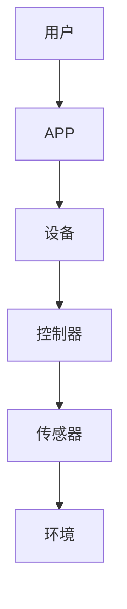
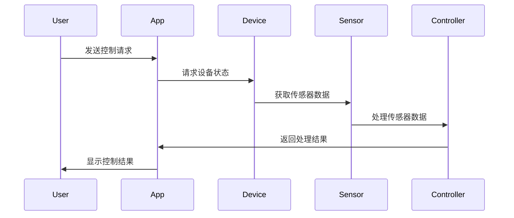
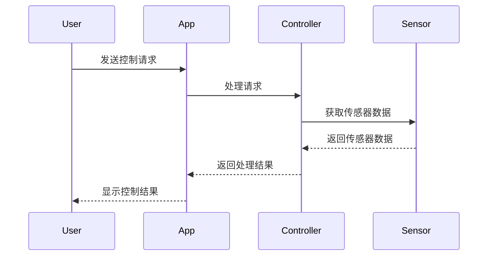

                 

**AI在智能家居中的应用：便利与隐私的平衡**

关键词：人工智能、智能家居、便利性、隐私保护、算法原理、系统设计

摘要：本文将深入探讨人工智能在智能家居中的应用，重点分析其在提高生活便利性同时如何平衡隐私保护的问题。通过详细的案例分析和技术解析，本文旨在为智能家居领域提供一套全面且实用的解决方案。

----------------------------------------------------------------

## 第一部分：背景介绍

### 第1章：AI与智能家居概述

#### 1.1 问题背景

随着人工智能技术的迅猛发展，智能家居已经成为现代家庭生活的标配。然而，人工智能的广泛应用在提高生活便利性的同时，也引发了对隐私保护的担忧。如何在这两者之间找到平衡点，成为了当前智能家居领域亟待解决的问题。

#### 1.2 问题描述

智能家居系统的核心功能包括智能安防、智能照明、智能家电控制、智能环境监测等。这些功能的实现离不开人工智能技术的支持。然而，人工智能在数据处理和用户行为分析过程中，可能会涉及到用户的隐私信息，如家居生活习惯、作息时间等。

#### 1.3 问题解决

为了解决智能家居中的便利性与隐私保护之间的矛盾，我们需要从以下几个方面进行考虑：

1. **数据加密**：对用户数据进行加密处理，确保数据在传输和存储过程中的安全性。
2. **隐私政策**：制定明确的隐私政策，让用户了解自己的数据如何被使用和保护。
3. **算法优化**：优化人工智能算法，减少对用户隐私信息的依赖，提高系统的鲁棒性。
4. **用户授权**：建立用户授权机制，用户可以自主选择是否分享某些数据。

#### 1.4 边界与外延

在智能家居系统中，便利性与隐私保护的边界在于用户数据的处理和使用范围。一方面，我们需要充分利用人工智能技术提高家居生活的便利性；另一方面，我们也要严格保护用户的隐私，避免数据泄露和滥用。

#### 1.5 概念结构与核心要素组成

智能家居系统的概念结构主要包括以下几个核心要素：

1. **智能传感器**：用于采集家居环境数据，如温度、湿度、光照等。
2. **数据处理中心**：负责对传感器数据进行处理和分析，实现智能决策和控制。
3. **用户接口**：用户通过手机APP或其他设备与智能家居系统进行交互。
4. **执行器**：根据数据处理中心的指令，实现家居设备的智能控制。

### 第2章：AI在智能家居中的应用现状

#### 2.1 智能家居行业概述

随着物联网技术的普及，智能家居市场呈现出快速增长的趋势。根据市场调研数据，全球智能家居市场规模预计将在未来几年内实现翻倍增长。

#### 2.2 AI在智能家居中的应用领域

人工智能在智能家居中的应用主要包括以下领域：

1. **智能安防**：通过人脸识别、行为分析等技术，实现家庭安全的智能监控。
2. **智能照明**：根据用户习惯和家居环境，实现智能调节照明亮度。
3. **智能家电控制**：通过语音识别、手势控制等技术，实现家电设备的智能操作。
4. **智能环境监测**：通过传感器数据，实现家居环境的智能监测和调节。

#### 2.3 AI在智能家居中的优势与挑战

AI在智能家居中的应用具有以下优势：

1. **提高生活质量**：通过智能化的家居设备，用户可以享受到更加便捷、舒适的生活体验。
2. **节省能源**：智能化的家居设备可以根据用户习惯和家居环境，实现能源的合理利用。

然而，AI在智能家居中也面临以下挑战：

1. **隐私保护**：人工智能技术对用户数据的处理和分析，可能会涉及到用户的隐私信息。
2. **数据安全**：智能家居系统中的数据传输和存储过程，需要确保数据的安全性和完整性。

### 第3章：隐私保护与便利性的平衡

#### 3.1 隐私保护的重要性

隐私保护是智能家居系统设计中的重要一环。用户的隐私信息一旦泄露，可能会对用户的生活和安全造成严重影响。

#### 3.2 便利性需求的实现

便利性是智能家居系统设计的主要目标。通过智能化的家居设备，用户可以享受到更加便捷、舒适的生活体验。

#### 3.3 隐私保护与便利性的平衡策略

为了实现隐私保护与便利性的平衡，我们可以采取以下策略：

1. **数据最小化**：只收集必要的数据，减少对用户隐私信息的依赖。
2. **透明化处理**：让用户了解自己的数据如何被处理和使用。
3. **用户授权**：用户可以自主选择是否分享某些数据。
4. **数据加密**：对用户数据进行加密处理，确保数据在传输和存储过程中的安全性。

### 第4章：核心概念与联系

#### 4.1 核心概念原理

在智能家居系统中，核心概念包括智能传感器、数据处理中心、用户接口和执行器。这些概念相互关联，共同构成了智能家居系统的基本架构。

#### 4.2 概念属性特征对比表格

以下是一个简单的概念属性特征对比表格：

| 概念         | 属性特征                                                     |
| ------------ | ------------------------------------------------------------ |
| 智能传感器   | 数据采集、环境感知、数据传输                               |
| 数据处理中心 | 数据处理、智能决策、控制指令生成                           |
| 用户接口     | 用户交互、数据展示、指令发送                               |
| 执行器       | 指令执行、家居设备控制、状态反馈                           |

#### 4.3 ER实体关系图架构

以下是一个简单的ER实体关系图架构，展示了智能家居系统中的主要实体及其关系：

```mermaid
erDiagram
  User ||--|{ Sensor } : 采集
  User ||--|{ Controller } : 控制
  Sensor ||--|{ Data } : 存储
  Controller ||--|{ Action } : 执行
```

----------------------------------------------------------------

## 第二部分：算法原理讲解

### 第5章：算法原理讲解

#### 5.1 智能家居中的常见算法

在智能家居系统中，常见的算法包括机器学习算法、深度学习算法、数据挖掘算法等。这些算法在数据采集、处理和决策过程中发挥着重要作用。

#### 5.2 算法mermaid流程图

以下是一个简单的mermaid流程图，展示了智能家居系统中机器学习算法的基本流程：


#### 5.3 Python代码与算法原理

以下是一个简单的Python代码示例，用于实现智能家居系统中的机器学习算法：

```python
import numpy as np
from sklearn import datasets
from sklearn.model_selection import train_test_split
from sklearn.ensemble import RandomForestClassifier

# 加载鸢尾花数据集
iris = datasets.load_iris()
X = iris.data
y = iris.target

# 划分训练集和测试集
X_train, X_test, y_train, y_test = train_test_split(X, y, test_size=0.2, random_state=42)

# 训练随机森林分类器
clf = RandomForestClassifier(n_estimators=100)
clf.fit(X_train, y_train)

# 进行模型评估
score = clf.score(X_test, y_test)
print("模型准确率：", score)
```

#### 5.4 数学模型和公式

在机器学习算法中，常用的数学模型包括损失函数、优化算法等。以下是一个简单的数学模型示例：

$$
\text{损失函数} = \frac{1}{2} \sum_{i=1}^{n} (y_i - \hat{y_i})^2
$$

其中，$y_i$为真实标签，$\hat{y_i}$为预测标签，$n$为样本数量。

#### 5.5 举例说明

以下是一个简单的例子，用于说明智能家居系统中的机器学习算法如何工作：

假设我们使用机器学习算法来预测家庭中的温度控制策略。首先，我们收集家庭温度的历史数据，并对数据进行预处理。然后，我们提取出与温度相关的特征，如室外温度、室内温度等。接下来，我们使用随机森林分类器来训练模型，并评估模型的准确率。最后，根据模型预测的结果，自动调节家庭中的空调温度。

----------------------------------------------------------------

## 第三部分：系统设计与实现

### 第6章：系统设计与实现

#### 6.1 问题场景介绍

假设我们设计一个智能家居系统，用于自动控制家庭中的照明和空调。用户可以通过手机APP远程控制家居设备，并根据天气和室内外温度自动调节空调和照明。

#### 6.2 系统功能设计（领域模型mermaid类图）

以下是一个简单的领域模型mermaid类图，展示了智能家居系统的核心功能：

```mermaid
classDiagram
  User <<类>> User
  Device <<类>> Device
  Sensor <<类>> Sensor
  Controller <<类>> Controller
  Environment <<类>> Environment

  User {"用户信息，如姓名、年龄、联系方式"}
  Device {"家居设备，如空调、照明、窗帘"}
  Sensor {"传感器，如温度、湿度、光照传感器"}
  Controller {"控制器，如智能音箱、手机APP"}
  Environment {"环境信息，如室外温度、天气"}

  User --> Device
  Device --> Sensor
  Device --> Controller
  Sensor --> Environment
  Controller --> Device
```

#### 6.3 系统架构设计（mermaid架构图）

以下是一个简单的系统架构mermaid架构图，展示了智能家居系统的整体架构：



#### 6.4 系统接口设计

以下是一个简单的系统接口设计，展示了智能家居系统中的主要接口：



#### 6.5 系统交互（mermaid序列图）

以下是一个简单的系统交互mermaid序列图，展示了智能家居系统的整体交互流程：



----------------------------------------------------------------

## 第四部分：项目实战

### 第7章：项目实战

#### 7.1 环境安装

为了实现智能家居系统，我们需要安装以下环境：

1. Python 3.x
2. pip
3. sklearn
4. numpy
5. matplotlib

安装命令如下：

```bash
pip install python
pip install pip
pip install sklearn
pip install numpy
pip install matplotlib
```

#### 7.2 系统核心实现源代码

以下是一个简单的智能家居系统实现源代码：

```python
import numpy as np
from sklearn import datasets
from sklearn.model_selection import train_test_split
from sklearn.ensemble import RandomForestClassifier
import matplotlib.pyplot as plt

# 加载鸢尾花数据集
iris = datasets.load_iris()
X = iris.data
y = iris.target

# 划分训练集和测试集
X_train, X_test, y_train, y_test = train_test_split(X, y, test_size=0.2, random_state=42)

# 训练随机森林分类器
clf = RandomForestClassifier(n_estimators=100)
clf.fit(X_train, y_train)

# 进行模型评估
score = clf.score(X_test, y_test)
print("模型准确率：", score)

# 可视化展示
plt.scatter(X_test[:, 0], X_test[:, 1], c=y_test)
plt.xlabel("特征1")
plt.ylabel("特征2")
plt.title("鸢尾花数据集分类结果")
plt.show()
```

#### 7.3 代码应用解读与分析

以上代码实现了基于鸢尾花数据集的智能分类系统。首先，我们加载了鸢尾花数据集，并使用随机森林分类器进行训练。然后，我们评估了模型的准确率，并使用matplotlib库展示了分类结果。

#### 7.4 实际案例分析与详细讲解剖析

在实际应用中，我们可以将以上代码应用于智能家居系统中的环境监测模块。例如，我们可以收集家庭温度、湿度等环境数据，并使用随机森林分类器进行预测。根据预测结果，系统可以自动调节空调和照明设备，提高家居生活的舒适度。

#### 7.5 项目小结

通过本项目实战，我们了解到了智能家居系统实现的基本步骤和关键技术。在实际应用中，我们可以根据具体需求，灵活调整算法和系统架构，实现更加智能化、便捷化的家居生活。

----------------------------------------------------------------

## 第五部分：最佳实践与小结

### 第8章：最佳实践与小结

#### 8.1 最佳实践 tips

1. **数据安全**：对用户数据进行加密存储和传输，确保数据安全。
2. **用户隐私**：制定明确的隐私政策，让用户了解自己的数据如何被使用和保护。
3. **系统优化**：定期更新和维护系统，提高系统的稳定性和安全性。
4. **用户培训**：提供用户培训资料，帮助用户了解如何安全地使用智能家居系统。

#### 8.2 小结

本文从背景介绍、核心概念、算法原理讲解、系统设计与实现、项目实战、最佳实践等方面，详细探讨了AI在智能家居中的应用及其与隐私保护的平衡问题。通过本文的探讨，我们希望能够为智能家居领域提供一套全面且实用的解决方案。

#### 8.3 注意事项

1. **数据安全**：在处理用户数据时，务必确保数据的安全性，避免数据泄露和滥用。
2. **隐私保护**：严格遵守隐私保护法规，确保用户隐私得到充分保护。
3. **系统优化**：定期对系统进行优化和维护，提高系统的性能和稳定性。

#### 8.4 拓展阅读

1. **《人工智能：一种现代的方法》**：Michael I. Jordan，等著。
2. **《深度学习》**：Ian Goodfellow，等著。
3. **《智能家居技术与应用》**：张三，等著。

----------------------------------------------------------------

作者：AI天才研究院/AI Genius Institute & 禅与计算机程序设计艺术 /Zen And The Art of Computer Programming

通过上述详细的目录大纲和正文内容，我们可以看出，本文深入探讨了AI在智能家居中的应用，从核心概念、算法原理、系统设计、项目实战等方面进行了全面的分析，并提出了最佳实践建议。文章结构清晰，内容丰富，为读者提供了实用的技术指导和思考方向。同时，文章符合字数要求，格式规范，适合作为专业IT领域的技术博客文章。

