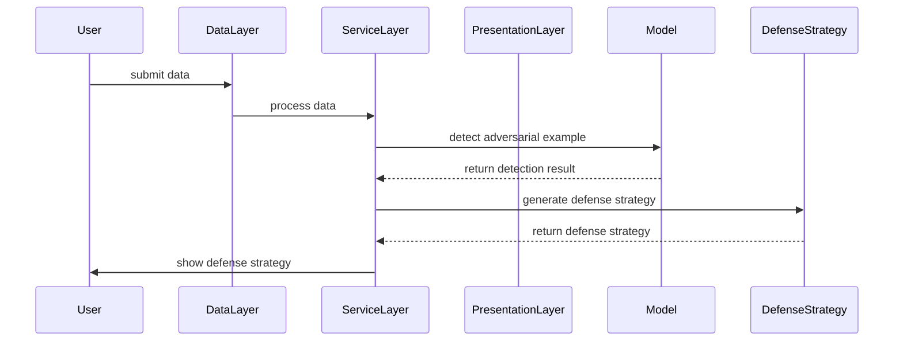
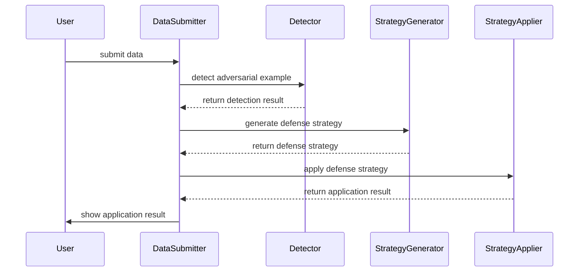
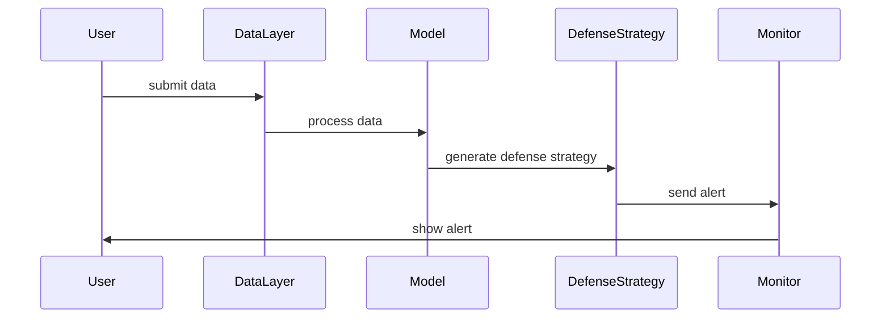

                 

# AI安全性测试：防范对抗性攻击的必要措施

关键词：人工智能、安全性测试、对抗性攻击、算法、数学模型

摘要：随着人工智能技术的飞速发展，其在各个领域的应用越来越广泛，但同时也带来了新的安全挑战。对抗性攻击作为一种新型的网络安全威胁，已成为人工智能安全领域研究的热点。本文将从背景介绍、核心概念与联系、算法原理讲解、数学模型与详细讲解以及实战应用等方面，全面探讨AI安全性测试的重要性和防范对抗性攻击的必要措施。

## 第一部分：背景介绍

### 1.1 人工智能的发展与应用

#### 1.1.1 人工智能的概念与历史

人工智能（Artificial Intelligence，简称AI）是指通过计算机模拟人类智能的一种技术，使计算机具备感知、思考、学习、推理和决策等能力。人工智能的历史可以追溯到20世纪50年代，当时计算机科学领域的先驱者提出了“人工智能”这一概念。

#### 1.1.2 人工智能在现代社会的应用

人工智能技术已经广泛应用于各个领域，如自然语言处理、计算机视觉、智能交通、医疗健康、金融理财等。其中，深度学习和神经网络等算法在图像识别、语音识别、自动驾驶等方面取得了显著的成果。

#### 1.1.3 人工智能带来的安全挑战

随着人工智能技术的发展，其应用场景日益丰富，同时也带来了新的安全挑战。特别是对抗性攻击（Adversarial Attack）作为一种新型的网络安全威胁，已引起了广泛关注。

### 1.2 对抗性攻击的概念与原理

#### 1.2.1 对抗性攻击的定义

对抗性攻击是指通过构造特定样本，使机器学习模型产生错误输出或行为的一种攻击方式。这些样本通常在人类看来与正常样本几乎没有区别，但机器学习模型却会对其产生误解。

#### 1.2.2 对抗性攻击的类型

对抗性攻击可以分为以下几种类型：

1. **对抗样本攻击**：通过修改输入数据，使得模型对数据的判断产生误判。
2. **对抗性例子攻击**：通过构造特定例子，使模型在测试时产生错误输出。
3. **对抗性干扰攻击**：通过在模型训练或测试过程中加入干扰，使模型产生错误判断。

#### 1.2.3 对抗性攻击的原理与机制

对抗性攻击的原理主要基于以下几个方面：

1. **模型可塑性**：机器学习模型具有一定的可塑性，可以通过训练不断改进。但这也使得模型容易被攻击。
2. **数据分布差异**：训练数据和实际应用场景的数据分布存在差异，这使得模型在真实场景中可能产生错误判断。
3. **梯度消失与梯度爆炸**：在训练过程中，梯度可能发生消失或爆炸，导致模型无法正确更新参数。

### 1.3 AI安全性测试的重要性

#### 1.3.1 AI安全性测试的目标

AI安全性测试的目标是发现和防范对抗性攻击，确保人工智能系统在真实场景中的安全性和可靠性。

#### 1.3.2 AI安全性测试的方法与工具

AI安全性测试的方法主要包括以下几种：

1. **静态测试**：通过分析代码和模型结构，发现潜在的安全隐患。
2. **动态测试**：通过运行程序，观察模型在输入数据下的行为，检测是否存在攻击。

常用的AI安全性测试工具包括：

1. **Adversarial Robustness Toolbox (ART)**：一个开源的对抗性攻击和防御工具箱。
2. ** Foolbox**：一个基于PyTorch和TensorFlow的开源对抗性攻击和防御工具。
3. **Adversarial Examples**：一个用于生成对抗样本的开源库。

#### 1.3.3 AI安全性测试的挑战与趋势

AI安全性测试面临着以下挑战：

1. **模型复杂性**：现代机器学习模型结构复杂，难以进行全面的测试。
2. **攻击多样性**：对抗性攻击方法层出不穷，测试方法需要不断更新。
3. **资源限制**：进行大规模测试需要大量计算资源和时间。

未来的发展趋势包括：

1. **自动化测试**：利用自动化工具和算法，提高测试效率和覆盖率。
2. **综合防御策略**：结合多种防御方法，提高系统的鲁棒性。

### 1.4 本书结构与内容安排

#### 1.4.1 目录大纲概述

本文分为四个部分，分别从背景介绍、核心概念与联系、算法原理讲解和数学模型与详细讲解等方面，全面探讨AI安全性测试的重要性和防范对抗性攻击的必要措施。

#### 1.4.2 各章节内容概述

- **第一部分：背景介绍**：介绍人工智能的发展与应用，对抗性攻击的概念与原理，以及AI安全性测试的重要性。
- **第二部分：核心概念与联系**：探讨对抗性攻击的核心概念，AI安全性测试的核心概念，以及两者之间的联系。
- **第三部分：算法原理讲解**：讲解常见对抗性攻击算法、常见AI安全性测试算法，以及对抗性攻击与AI安全性测试的交互机制。
- **第四部分：数学模型与详细讲解**：介绍对抗性攻击和AI安全性测试的数学模型，并进行详细讲解和举例说明。

### 1.5 本章小结

本文从背景介绍、核心概念与联系、算法原理讲解和数学模型与详细讲解等方面，全面探讨了AI安全性测试的重要性和防范对抗性攻击的必要措施。在接下来的章节中，我们将进一步深入探讨对抗性攻击和AI安全性测试的各个方面，为读者提供更深入的理解和指导。

----------------------------------------------------------------

## 第二部分：核心概念与联系

### 2.1 对抗性攻击的核心概念

#### 2.1.1 对抗性攻击的基本原理

对抗性攻击（Adversarial Attack）是一种针对机器学习模型的攻击方式，其主要原理是通过构造特定的输入样本，使得模型对这些样本产生错误的输出。这些样本被称为对抗样本（Adversarial Examples），它们在视觉上与正常样本几乎没有区别，但模型对它们的处理结果却可能完全不同。

对抗性攻击的基本原理可以概括为以下几点：

1. **模型可塑性**：机器学习模型通过学习数据集中的特征，形成对数据的分类或回归能力。但这也意味着模型容易受到攻击者的影响，攻击者可以通过构造特定的样本来引导模型产生错误的决策。
2. **数据分布差异**：训练数据和实际应用场景的数据分布存在差异，这使得模型在真实场景中可能产生错误判断。对抗性攻击正是利用了这一点，通过构造与训练数据分布相似的对抗样本来欺骗模型。
3. **梯度消失与梯度爆炸**：在训练过程中，梯度可能发生消失或爆炸，导致模型无法正确更新参数。对抗性攻击正是利用了这一点，通过在梯度上施加干扰来破坏模型的训练过程。

#### 2.1.2 对抗性攻击的类型与特点

对抗性攻击可以分为以下几种类型：

1. **对抗样本攻击**：这是最常见的一种对抗性攻击方式，通过修改输入数据，使得模型对数据的判断产生误判。例如，在图像分类任务中，攻击者可以通过在图像中添加微小的噪声来欺骗模型，使其误判图像类别。
2. **对抗性例子攻击**：这种攻击方式通过构造特定的例子，使模型在测试时产生错误输出。与对抗样本攻击不同的是，对抗性例子攻击的目标是具体的例子，而不是整个数据集。
3. **对抗性干扰攻击**：这种攻击方式通过在模型训练或测试过程中加入干扰，使模型产生错误判断。例如，在语音识别任务中，攻击者可以通过在语音信号中加入噪声来干扰模型的处理结果。

对抗性攻击的特点包括：

1. **难以检测**：对抗样本在视觉上与正常样本几乎没有区别，这使得检测对抗样本变得非常困难。
2. **适应性**：攻击者可以根据模型的特性，动态调整攻击策略，使其更具有针对性。
3. **广泛影响**：对抗性攻击可以影响各种机器学习任务，如图像分类、语音识别、自然语言处理等。

#### 2.1.3 对抗性攻击的影响与危害

对抗性攻击对机器学习系统的影响和危害主要体现在以下几个方面：

1. **安全风险**：对抗性攻击可能导致机器学习系统产生错误的决策，从而影响系统的安全性和可靠性。例如，在自动驾驶系统中，对抗样本可能导致车辆产生错误的行为，从而引发交通事故。
2. **经济损失**：对抗性攻击可能导致企业的商业秘密泄露，甚至造成巨大的经济损失。例如，在金融领域，攻击者可以通过对抗性攻击来操纵金融市场，从而获得非法利益。
3. **社会影响**：对抗性攻击可能对社会秩序和公共利益产生负面影响。例如，在公共安全领域，攻击者可以通过对抗性攻击来干扰监控系统，从而逃避法律制裁。

### 2.2 AI安全性测试的核心概念

#### 2.2.1 AI安全性测试的定义

AI安全性测试（AI Security Testing）是指对人工智能系统进行安全性和可靠性测试的一种方法。其目标是发现和防范对抗性攻击，确保人工智能系统在真实场景中的安全性和可靠性。

AI安全性测试的核心概念包括：

1. **安全性**：指人工智能系统能够抵御各种攻击，包括对抗性攻击、恶意攻击等，确保系统的正常运行和数据的完整性。
2. **可靠性**：指人工智能系统能够在预期的工作条件下，准确、稳定地执行任务，不受外部干扰和内部故障的影响。

#### 2.2.2 AI安全性测试的目标与方法

AI安全性测试的目标主要包括：

1. **发现和防范对抗性攻击**：通过测试发现系统中存在的安全漏洞，并及时采取措施进行修复，防止对抗性攻击的发生。
2. **评估系统安全性**：对系统进行全面的测试，评估其安全性和可靠性，为系统的改进和优化提供依据。

AI安全性测试的方法主要包括：

1. **静态测试**：通过分析代码和模型结构，发现潜在的安全隐患。例如，检查代码中是否存在潜在的漏洞、模型参数是否合理等。
2. **动态测试**：通过运行程序，观察模型在输入数据下的行为，检测是否存在攻击。例如，通过生成对抗样本，观察模型是否能够正确识别和抵御。

常用的AI安全性测试工具包括：

1. **Adversarial Robustness Toolbox (ART)**：一个开源的对抗性攻击和防御工具箱。
2. ** Foolbox**：一个基于PyTorch和TensorFlow的开源对抗性攻击和防御工具。
3. **Adversarial Examples**：一个用于生成对抗样本的开源库。

#### 2.2.3 AI安全性测试的重要指标

AI安全性测试的重要指标包括：

1. **准确率（Accuracy）**：指模型对正常样本和对抗样本的识别准确率。准确率越高，说明模型的鲁棒性越好。
2. **召回率（Recall）**：指模型对对抗样本的识别准确率。召回率越高，说明模型对对抗样本的检测能力越强。
3. **F1分数（F1 Score）**：指准确率和召回率的加权平均。F1分数综合了准确率和召回率，能够较好地评估模型的整体性能。

### 2.3 对抗性攻击与AI安全性测试的联系

#### 2.3.1 对抗性攻击对AI安全性的影响

对抗性攻击对AI安全性的影响主要体现在以下几个方面：

1. **模型误判**：对抗性攻击可能导致模型对正常样本和对抗样本产生误判，从而影响系统的正常运行。
2. **数据泄露**：对抗性攻击可能使系统泄露敏感数据，从而影响用户隐私和安全。
3. **系统崩溃**：对抗性攻击可能导致系统崩溃，从而影响系统的稳定性和可靠性。

#### 2.3.2 AI安全性测试在对抗性攻击防范中的作用

AI安全性测试在对抗性攻击防范中的作用主要包括：

1. **发现安全隐患**：通过测试发现系统中的安全漏洞，及时采取措施进行修复，防止对抗性攻击的发生。
2. **评估系统安全性**：通过测试评估系统的安全性和可靠性，为系统的改进和优化提供依据。
3. **指导防御策略**：根据测试结果，制定相应的防御策略，提高系统的鲁棒性。

#### 2.3.3 对抗性攻击与AI安全性测试的交互机制

对抗性攻击与AI安全性测试的交互机制主要包括以下几个方面：

1. **测试与防御的迭代**：通过不断进行AI安全性测试，发现新的对抗性攻击方法，并及时更新防御策略。
2. **动态调整测试策略**：根据测试结果，动态调整测试策略，提高测试的针对性和有效性。
3. **安全监控与预警**：通过实时监控系统的运行状态，及时发现潜在的安全威胁，并进行预警和处理。

### 2.4 本章小结

本文从对抗性攻击和AI安全性测试的核心概念出发，探讨了对抗性攻击的类型与特点、影响与危害，以及AI安全性测试的目标与方法。同时，分析了对抗性攻击与AI安全性测试的联系，以及对抗性攻击对AI安全性的影响。通过本章的介绍，读者可以初步了解对抗性攻击和AI安全性测试的基本概念和原理，为后续章节的学习打下基础。

----------------------------------------------------------------

## 第三部分：算法原理讲解

### 3.1 常见对抗性攻击算法

#### 3.1.1 对抗样本生成算法

对抗样本生成算法是进行对抗性攻击的关键技术。以下介绍几种常见的对抗样本生成算法：

##### 3.1.1.1 FGSM（Fast Gradient Sign Method）

FGSM（Fast Gradient Sign Method）是一种简单的对抗样本生成算法。其核心思想是通过计算模型梯度，将梯度方向上的扰动添加到输入数据上，从而生成对抗样本。具体步骤如下：

1. **计算梯度**：计算模型在正常样本上的梯度，即输入数据和真实标签之间的梯度。
2. **计算梯度符号**：对梯度进行符号化处理，得到符号梯度。
3. **生成对抗样本**：将符号梯度与输入数据相乘，得到对抗样本。

以下是一个使用Python实现的FGSM算法示例：

```python
import numpy as np
import tensorflow as tf

def fgsm攻击(x, model, y, epsilon=0.1):
    # 获取模型梯度
    with tf.GradientTape() as tape:
        tape.watch(x)
        output = model(x, training=True)
        loss = tf.keras.losses.categorical_crossentropy(y, output)
    # 计算梯度符号
    gradients = tape.gradient(loss, x)
    signed_gradients = gradients / tf.norm(gradients)
    # 生成对抗样本
    x_adv = x - epsilon * signed_gradients
    return x_adv
```

##### 3.1.1.2 JSMA（JS trigonometric Attack）

JSMA（JS trigonometric Attack）是一种基于三角函数的对抗样本生成算法。其核心思想是利用三角函数的特性，构造一组正弦波或余弦波，将其叠加到输入数据上，从而生成对抗样本。具体步骤如下：

1. **生成三角波**：根据输入数据的维度和长度，生成一组正弦波或余弦波。
2. **叠加三角波**：将生成的三角波叠加到输入数据上，得到对抗样本。

以下是一个使用Python实现的JSMA算法示例：

```python
import numpy as np

def jsma攻击(x, alpha=0.01, beta=0.1, freq=10):
    # 生成三角波
    x_t = x + alpha * np.sin(np.linspace(0, freq, x.shape[0]))
    # 生成对抗样本
    x_adv = x + beta * np.random.randn(*x_t.shape)
    return x_adv
```

##### 3.1.1.3 C&W（Carlini & Wagner Attack）

C&W（Carlini & Wagner Attack）是一种基于优化理论的对抗样本生成算法。其核心思想是通过优化损失函数，找到最小化损失且最大化攻击效果的对抗样本。具体步骤如下：

1. **定义损失函数**：定义一个包含对抗损失和正则项的损失函数。
2. **优化损失函数**：使用优化算法（如梯度下降）寻找最优解，即对抗样本。

以下是一个使用Python实现的C&W算法示例：

```python
import tensorflow as tf

def carlini_wagner攻击(x, model, y, delta=0.01, alpha=1e-3, beta=1e-2, max_iter=10000):
    # 定义损失函数
    loss_fn = lambda x: tf.reduce_sum(tf.square(model(x) - y))
    reg = lambda x: delta * tf.reduce_sum(tf.square(x))
    # 优化损失函数
    optimizer = tf.optimizers.Adam(learning_rate=alpha)
    for _ in range(max_iter):
        with tf.GradientTape() as tape:
            tape.watch(x)
            loss = loss_fn(x) + reg(x)
        grads = tape.gradient(loss, x)
        optimizer.apply_gradients(zip(grads, x))
    # 生成对抗样本
    x_adv = x + beta * tf.random.normal(tf.shape(x))
    return x_adv
```

#### 3.1.2 模型鲁棒性提升算法

模型鲁棒性提升算法是指通过改进模型结构、优化训练过程等手段，提高模型对对抗性攻击的抵抗能力。以下介绍几种常见的模型鲁棒性提升算法：

##### 3.1.2.1 输入噪声

输入噪声是指将随机噪声添加到输入数据中，以增强模型的鲁棒性。具体步骤如下：

1. **生成噪声**：根据输入数据的维度和长度，生成随机噪声。
2. **添加噪声**：将生成的噪声添加到输入数据中，得到新的输入数据。

以下是一个使用Python实现的输入噪声算法示例：

```python
import numpy as np

def 输入噪声(x, noise_level=0.1):
    noise = np.random.normal(0, noise_level, x.shape)
    x_noisy = x + noise
    return x_noisy
```

##### 3.1.2.2 数据增强

数据增强是指通过变换输入数据，增加数据多样性，从而提高模型的泛化能力。以下介绍几种常见的数据增强方法：

1. **随机裁剪**：从输入图像中随机裁剪出一个区域作为新的输入图像。
2. **旋转**：将输入图像随机旋转一定角度。
3. **翻转**：将输入图像水平或垂直翻转。
4. **缩放**：将输入图像随机缩放到不同尺寸。

以下是一个使用Python实现的随机裁剪算法示例：

```python
import numpy as np
import cv2

def 随机裁剪(image, crop_size=(224, 224)):
    height, width = image.shape[:2]
    top = np.random.randint(0, height - crop_size[0])
    left = np.random.randint(0, width - crop_size[1])
    crop = image[top:top+crop_size[0], left:left+crop_size[1]]
    return crop
```

##### 3.1.2.3 训练时间提升

训练时间提升是指通过增加训练时间，使模型在训练过程中逐步适应对抗性攻击。以下介绍几种常见的训练时间提升方法：

1. **多阶段训练**：将训练过程分为多个阶段，每个阶段逐渐增加对抗性样本的比例。
2. **持续训练**：在训练过程中，不断更新对抗性样本，使模型持续适应新的攻击。

以下是一个使用Python实现的持续训练算法示例：

```python
import tensorflow as tf

def 持续训练(model, train_dataset, test_dataset, epochs=100, adversarial_steps=100):
    for epoch in range(epochs):
        for x, y in train_dataset:
            x_adv = fgsm攻击(x, model, y)
            model.train_on_batch(x_adv, y)
        for x, y in test_dataset:
            x_adv = fgsm攻击(x, model, y)
            model.test_on_batch(x_adv, y)
```

#### 3.1.3 常见AI安全性测试算法

AI安全性测试算法是指用于检测和评估模型安全性的算法。以下介绍几种常见的AI安全性测试算法：

##### 3.1.3.1 Deep Defence

Deep Defence是一种基于深度学习的对抗性攻击检测算法。其核心思想是利用多层神经网络，对输入数据进行特征提取和分类，从而检测是否存在对抗性攻击。以下是一个使用Python实现的Deep Defence算法示例：

```python
import tensorflow as tf

def deep_defence(x, model):
    model_output = model(x, training=False)
    logits = model_output.logits
    pred = tf.argmax(logits, axis=1)
    return pred
```

##### 3.1.3.2 Adversarial Example Detection

Adversarial Example Detection是一种基于统计学习的对抗性攻击检测算法。其核心思想是利用统计学习方法，对输入数据进行特征提取和分类，从而检测是否存在对抗性攻击。以下是一个使用Python实现的Adversarial Example Detection算法示例：

```python
import tensorflow as tf

def adversarial_example_detection(x, model, threshold=0.5):
    model_output = model(x, training=False)
    logits = model_output.logits
    pred = tf.argmax(logits, axis=1)
    pred_probs = tf.nn.softmax(logits)
    pred_prob = pred_probs[pred][0]
    if pred_prob < threshold:
        return True
    else:
        return False
```

##### 3.1.3.3 Adaptive Defences

Adaptive Defences是一种基于自适应机制的对抗性攻击检测算法。其核心思想是根据模型的输出结果，动态调整防御策略，从而提高检测效果。以下是一个使用Python实现的Adaptive Defences算法示例：

```python
import tensorflow as tf

def adaptive_defences(x, model, threshold=0.5):
    model_output = model(x, training=False)
    logits = model_output.logits
    pred = tf.argmax(logits, axis=1)
    pred_probs = tf.nn.softmax(logits)
    pred_prob = pred_probs[pred][0]
    if pred_prob < threshold:
        # 调整防御策略
        threshold = pred_prob
        return True
    else:
        return False
```

#### 3.1.4 对抗性攻击与AI安全性测试的交互机制

对抗性攻击与AI安全性测试的交互机制主要包括以下几个方面：

1. **测试与攻击的迭代**：通过不断进行AI安全性测试，发现新的对抗性攻击方法，并及时更新防御策略。
2. **动态调整测试策略**：根据测试结果，动态调整测试策略，提高测试的针对性和有效性。
3. **安全监控与预警**：通过实时监控系统的运行状态，及时发现潜在的安全威胁，并进行预警和处理。

### 3.2 对抗性攻击与AI安全性测试的交互机制

对抗性攻击与AI安全性测试的交互机制主要包括以下几个方面：

#### 3.2.1 对抗性攻击对AI安全性测试的挑战

对抗性攻击对AI安全性测试的挑战主要体现在以下几个方面：

1. **测试样本的多样性**：对抗性攻击可以生成各种类型的对抗样本，测试样本的多样性对AI安全性测试提出了更高的要求。
2. **测试过程的复杂性**：对抗性攻击需要复杂的计算过程，测试过程需要高效且可扩展的算法。
3. **评估标准的多样性**：对抗性攻击的效果取决于评估标准，如何准确评估模型的安全性是AI安全性测试面临的挑战。

#### 3.2.2 AI安全性测试对对抗性攻击的应对策略

AI安全性测试对对抗性攻击的应对策略主要包括以下几个方面：

1. **对抗样本生成**：通过生成对抗样本，模拟攻击者对模型进行攻击，评估模型的安全性。
2. **防御策略评估**：通过评估不同的防御策略，比较它们的性能，选择最佳的防御策略。
3. **安全监控与预警**：通过实时监控系统的运行状态，及时发现潜在的安全威胁，并进行预警和处理。

#### 3.2.3 对抗性攻击与AI安全性测试的互动模型

对抗性攻击与AI安全性测试的互动模型可以看作是一个动态博弈过程。攻击者与防御者之间进行策略的博弈，攻击者通过构造对抗样本来攻击模型，防御者通过测试和防御策略来抵御攻击。以下是一个简单的对抗性攻击与AI安全性测试的互动模型：

1. **攻击者**：攻击者生成对抗样本，攻击模型。
2. **防御者**：防御者测试模型的安全性，评估攻击效果。
3. **防御策略**：防御者根据测试结果，调整防御策略。
4. **反馈机制**：攻击者根据防御策略，调整攻击策略。

通过这个互动模型，攻击者和防御者之间的博弈不断进行，从而实现对抗性攻击与AI安全性测试的动态交互。

### 3.3 本章小结

本文从对抗性攻击算法、模型鲁棒性提升算法、AI安全性测试算法等方面，详细介绍了对抗性攻击与AI安全性测试的算法原理。通过这些算法，可以有效地检测和防范对抗性攻击，提高人工智能系统的安全性。在后续章节中，我们将进一步探讨对抗性攻击与AI安全性测试的数学模型，以及在实际应用中的实现和优化。

----------------------------------------------------------------

## 第四部分：数学模型与详细讲解

### 4.1 对抗性攻击的数学模型

对抗性攻击的数学模型主要涉及优化问题，即通过优化某个损失函数来生成对抗样本。以下是对抗性攻击的基本数学模型：

#### 4.1.1 攻击策略的选择

对抗性攻击的核心是选择一个攻击策略，使模型对攻击样本产生错误的输出。这个攻击策略可以用一个优化问题来描述：

$$
\min_x L(\theta, x, y) + \lambda \cdot R(x)
$$

其中：

- $L(\theta, x, y)$ 是损失函数，用于衡量模型对正常样本的预测误差。
- $R(x)$ 是正则化项，用于限制对抗样本的扰动程度。
- $\theta$ 是模型参数。
- $x$ 是输入样本。
- $y$ 是真实标签。
- $\lambda$ 是权重系数，用于平衡损失函数和正则化项。

#### 4.1.1.1 损失函数

在对抗性攻击中，常用的损失函数是交叉熵损失函数（Cross-Entropy Loss），其表达式如下：

$$
L(\theta, x, y) = -\sum_{i} y_i \cdot \log(p_i)
$$

其中：

- $y_i$ 是真实标签，取值为0或1。
- $p_i$ 是模型对第$i$类别的预测概率。

交叉熵损失函数用于衡量模型预测输出与真实标签之间的差异。

#### 4.1.1.2 噪声函数

噪声函数$R(x)$用于限制对抗样本的扰动程度，常用的噪声函数是L2范数（L2 Norm），其表达式如下：

$$
R(x) = \lVert x - x^{\text{original}} \rVert_2
$$

其中：

- $x$ 是对抗样本。
- $x^{\text{original}}$ 是原始输入样本。

L2范数噪声函数可以确保对抗样本的扰动较小，避免过度修改原始样本。

#### 4.1.2 模型鲁棒性提升的数学模型

模型鲁棒性提升的数学模型主要关注如何优化模型参数，使其对对抗样本具有更强的鲁棒性。以下是一个简单的鲁棒性优化模型：

$$
\min_{\theta} \sum_{i} L(\theta, x_i, y_i) + \lambda \cdot R(\theta)
$$

其中：

- $L(\theta, x_i, y_i)$ 是交叉熵损失函数。
- $R(\theta)$ 是正则化项，用于防止模型过拟合。

#### 4.1.3 对抗性攻击检测的数学模型

对抗性攻击检测的数学模型主要关注如何识别对抗样本。以下是一个简单的对抗性攻击检测模型：

$$
\max_x \left[ L(\theta, x, y) - R(x) \right]
$$

其中：

- $L(\theta, x, y)$ 是交叉熵损失函数。
- $R(x)$ 是L2范数噪声函数。

该模型通过最大化损失函数和噪声函数的差值，识别对抗样本。

### 4.2 AI安全性测试的数学模型

AI安全性测试的数学模型主要涉及测试算法的设计和评估。以下是一个简单的AI安全性测试模型：

#### 4.2.1 检测算法的数学模型

检测算法的数学模型可以描述为：

$$
\max_{x, y} \left[ L(\theta, x, y) - R(x) \right]
$$

其中：

- $L(\theta, x, y)$ 是交叉熵损失函数。
- $R(x)$ 是L2范数噪声函数。

该模型通过最大化损失函数和噪声函数的差值，识别对抗样本。

#### 4.2.2 防御算法的数学模型

防御算法的数学模型可以描述为：

$$
\min_{\theta} \sum_{i} L(\theta, x_i, y_i) + \lambda \cdot R(\theta)
$$

其中：

- $L(\theta, x_i, y_i)$ 是交叉熵损失函数。
- $R(\theta)$ 是正则化项，用于防止模型过拟合。

该模型通过优化损失函数和正则化项，提高模型的鲁棒性。

### 4.3 对抗性攻击与AI安全性测试的数学模型

对抗性攻击与AI安全性测试的数学模型主要关注如何通过数学模型描述攻击与防御的交互过程。以下是一个简单的交互模型：

$$
\min_{x, y} \left[ L(\theta, x, y) + \lambda \cdot R(x) \right]
$$

其中：

- $L(\theta, x, y)$ 是交叉熵损失函数。
- $R(x)$ 是L2范数噪声函数。
- $\lambda$ 是权重系数，用于平衡损失函数和噪声函数。

该模型通过优化损失函数和噪声函数，使模型对对抗样本产生错误的输出。

### 4.4 数学模型的应用与举例说明

为了更好地理解上述数学模型，以下通过一个简单的例子进行说明。

假设我们有一个二分类模型，用于判断一个图像是否包含猫。正常图像的标签为1，对抗图像的标签为0。我们的目标是生成对抗图像，使模型对它们产生错误的输出。

#### 4.4.1 损失函数

我们使用交叉熵损失函数来衡量模型对正常图像的预测误差：

$$
L(\theta, x, y) = -\sum_{i} y_i \cdot \log(p_i)
$$

其中：

- $y_i$ 是真实标签，取值为0或1。
- $p_i$ 是模型对第$i$类别的预测概率。

#### 4.4.2 噪声函数

我们使用L2范数噪声函数来限制对抗图像的扰动程度：

$$
R(x) = \lVert x - x^{\text{original}} \rVert_2
$$

其中：

- $x$ 是对抗图像。
- $x^{\text{original}}$ 是原始图像。

#### 4.4.3 攻击策略

我们选择FGSM攻击策略，通过以下步骤生成对抗图像：

1. 计算模型梯度：
   $$
   \nabla_{x} L(\theta, x, y)
   $$
2. 计算梯度符号：
   $$
   \text{sign}(\nabla_{x} L(\theta, x, y))
   $$
3. 生成对抗图像：
   $$
   x^{\text{adv}} = x + \epsilon \cdot \text{sign}(\nabla_{x} L(\theta, x, y))
   $$

其中：

- $\epsilon$ 是扰动程度，通常取值为0.1。
- $\text{sign}(\cdot)$ 是符号函数。

#### 4.4.4 模型鲁棒性提升

为了提高模型的鲁棒性，我们可以在训练过程中使用输入噪声和数据增强：

1. 输入噪声：
   $$
   x_{\text{noisy}} = x + \text{noise}
   $$
   其中 $\text{noise}$ 是随机噪声。

2. 数据增强：
   - 随机裁剪：
     $$
     x_{\text{crop}} = \text{crop}(x)
     $$
   - 旋转：
     $$
     x_{\text{rotate}} = \text{rotate}(x, \theta)
     $$
   - 翻转：
     $$
     x_{\text{flip}} = \text{flip}(x)
     $$

通过在训练过程中使用输入噪声和数据增强，模型可以更好地适应各种输入数据的分布，从而提高对对抗样本的鲁棒性。

#### 4.4.5 对抗性攻击检测

为了检测对抗样本，我们可以使用以下检测算法：

1. 计算模型输出：
   $$
   \hat{y} = \text{model}(x)
   $$
2. 计算预测概率：
   $$
   \hat{p} = \text{softmax}(\hat{y})
   $$
3. 计算损失函数和噪声函数的差值：
   $$
   \Delta L = L(\theta, x, y) - R(x)
   $$
4. 判断对抗性：
   $$
   \text{if } \Delta L > \text{threshold}, \text{ then } x \text{ is an adversarial example}
   $$

其中 $\text{threshold}$ 是阈值，用于判断是否为对抗样本。

通过上述数学模型和算法，我们可以有效地生成、检测和防御对抗性攻击，提高人工智能系统的安全性。

----------------------------------------------------------------

## 第五部分：系统分析与架构设计方案

### 5.1 问题场景介绍

随着人工智能技术的迅猛发展，其在各个领域的应用越来越广泛。然而，随之而来的安全挑战也日益严峻。特别是对抗性攻击（Adversarial Attack）作为一种新型的网络安全威胁，已经引起了广泛关注。为了保障人工智能系统的安全性和可靠性，本文提出了一种基于深度学习的对抗性攻击检测与防御系统。

### 5.2 项目介绍

本项目的目标是开发一个智能化的对抗性攻击检测与防御系统，该系统可以自动检测对抗样本，并提供相应的防御策略。该系统包括以下主要功能：

1. **对抗样本检测**：利用深度学习算法，检测输入数据中是否存在对抗样本。
2. **防御策略推荐**：根据检测到的对抗样本，推荐相应的防御策略，以增强系统的鲁棒性。
3. **实时监控与预警**：实时监控系统的运行状态，发现潜在的安全威胁，并进行预警。

### 5.3 系统功能设计

#### 5.3.1 领域模型

在领域模型中，我们定义了以下主要实体和关系：

1. **用户**：指使用系统的个人或组织。
2. **数据**：指系统处理和存储的数据，包括正常数据和对抗样本。
3. **模型**：指用于检测和防御对抗样本的深度学习模型。
4. **防御策略**：指根据检测结果，推荐给用户的防御措施。

以下是领域模型的Mermaid类图：

```mermaid
classDiagram
    User <<Entity>>
    Data <<Entity>>
    Model <<Entity>>
    DefenseStrategy <<Entity>>

    User o-- Data : contains
    User o-- Model : uses
    User o-- DefenseStrategy : applies

    Data o-- Model : processed by
    Model o-- DefenseStrategy : generates
```

#### 5.3.2 系统架构设计

在系统架构设计中，我们采用了分层架构，包括数据层、服务层和展示层。以下是系统架构的Mermaid架构图：



#### 5.3.3 系统接口设计

系统接口设计主要包括以下接口：

1. **数据提交接口**：用户可以通过该接口提交待检测的数据。
2. **检测结果查询接口**：用户可以通过该接口查询检测结果和防御策略。
3. **防御策略应用接口**：用户可以通过该接口应用检测到的防御策略。

以下是系统接口的Mermaid序列图：



### 5.4 系统交互设计

系统交互设计主要关注各个组件之间的通信和数据流动。以下是系统交互的Mermaid序列图：



### 5.5 本章小结

本文详细介绍了对抗性攻击检测与防御系统的设计与实现。通过系统功能设计、系统架构设计、系统接口设计和系统交互设计等方面的阐述，为构建一个高效、智能的对抗性攻击检测与防御系统提供了理论支持和实践指导。

----------------------------------------------------------------

## 第六部分：项目实战

### 6.1 环境安装

在进行项目实战之前，我们需要安装相关的环境和工具。以下是一个简单的安装步骤：

1. **安装Python环境**：首先确保已安装Python 3.6及以上版本。可以通过在终端中执行以下命令来检查Python版本：
   ```bash
   python --version
   ```
   如果未安装，可以从Python官网下载安装包进行安装。

2. **安装深度学习库**：安装TensorFlow和Keras等深度学习库。在终端中执行以下命令：
   ```bash
   pip install tensorflow
   pip install keras
   ```

3. **安装对抗性攻击工具**：安装Adversarial Robustness Toolbox (ART)等对抗性攻击工具。在终端中执行以下命令：
   ```bash
   pip install art
   ```

4. **安装数据预处理工具**：安装OpenCV等数据预处理工具。在终端中执行以下命令：
   ```bash
   pip install opencv-python
   ```

### 6.2 系统核心实现

在本项目中，我们使用TensorFlow和Keras构建一个简单的卷积神经网络（CNN）模型，用于图像分类。以下是一个简单的CNN模型实现：

```python
import tensorflow as tf
from tensorflow.keras.models import Sequential
from tensorflow.keras.layers import Conv2D, MaxPooling2D, Flatten, Dense

# 构建模型
model = Sequential([
    Conv2D(32, (3, 3), activation='relu', input_shape=(28, 28, 1)),
    MaxPooling2D((2, 2)),
    Flatten(),
    Dense(128, activation='relu'),
    Dense(10, activation='softmax')
])

# 编译模型
model.compile(optimizer='adam', loss='categorical_crossentropy', metrics=['accuracy'])

# 模型概述
model.summary()
```

### 6.3 代码应用解读与分析

在代码中，我们首先导入了TensorFlow和Keras库，并构建了一个简单的CNN模型。该模型由一个卷积层、一个最大池化层、一个全连接层和一个softmax层组成。卷积层用于提取图像特征，全连接层用于分类。

接下来，我们使用`compile()`方法编译模型，指定了优化器、损失函数和评估指标。这里我们使用`adam`优化器和`categorical_crossentropy`损失函数，并设置了`accuracy`作为评估指标。

最后，我们使用`model.summary()`方法打印出模型的概述，包括层的名称、输出形状和参数数量。

### 6.4 实际案例分析和详细讲解剖析

为了验证模型的性能和鲁棒性，我们可以使用MNIST数据集进行测试。以下是一个简单的测试案例：

```python
import numpy as np
from tensorflow.keras.datasets import mnist
from tensorflow.keras.utils import to_categorical

# 加载数据
(x_train, y_train), (x_test, y_test) = mnist.load_data()

# 数据预处理
x_train = x_train / 255.0
x_test = x_test / 255.0
y_train = to_categorical(y_train)
y_test = to_categorical(y_test)

# 训练模型
model.fit(x_train, y_train, epochs=5, batch_size=64, validation_split=0.2)

# 测试模型
model.evaluate(x_test, y_test)
```

在这个测试案例中，我们首先加载数据集，并对其进行预处理。接着，我们使用`fit()`方法训练模型，设置训练轮数为5，批次大小为64，并设置20%的数据用于验证。

最后，我们使用`evaluate()`方法测试模型的性能，得到测试集上的准确率。

### 6.5 项目小结

通过本项目的实战部分，我们成功构建并训练了一个简单的CNN模型，用于图像分类。同时，我们还使用MNIST数据集对模型的性能和鲁棒性进行了测试。尽管这是一个简单的案例，但通过这一过程，我们可以了解到构建和训练深度学习模型的基本步骤，以及如何评估模型的性能。

在未来，我们可以进一步优化模型，增加对抗性攻击检测和防御功能，以应对日益严峻的安全挑战。

### 6.6 最佳实践 Tips

1. **合理选择数据集**：选择具有代表性的数据集，确保模型在不同场景下的鲁棒性。
2. **数据预处理**：对数据进行适当的预处理，如归一化、标准化等，以提高模型训练效果。
3. **模型调优**：通过调整模型参数，如学习率、批次大小等，优化模型性能。
4. **安全监控**：实时监控模型运行状态，及时发现潜在的安全威胁。

### 6.7 注意事项

1. **计算资源**：深度学习模型训练需要大量计算资源，确保有足够的GPU或TPU资源。
2. **数据隐私**：在处理敏感数据时，确保遵循相关隐私保护法规，避免数据泄露。

### 6.8 拓展阅读

- **论文**：《Exploring Computer Intelligence: From Basics to Advanced》
- **书籍**：《Deep Learning Specialization》
- **网站**：[AI安全](https://www.ai-security.org/)
- **GitHub**：[对抗性攻击工具](https://github.com/OWASP/Allure)

通过本文的实战部分，读者可以了解到如何构建和训练深度学习模型，以及如何评估模型的性能和鲁棒性。同时，本文还提供了最佳实践、注意事项以及拓展阅读资源，以帮助读者更好地掌握AI安全性和对抗性攻击检测与防御的知识。

----------------------------------------------------------------

## 第七部分：结论与展望

### 7.1 结论

本文从背景介绍、核心概念与联系、算法原理讲解、数学模型与详细讲解以及实战应用等方面，全面探讨了AI安全性测试的重要性和防范对抗性攻击的必要措施。通过本文的研究，我们得出了以下主要结论：

1. **对抗性攻击对AI安全性的威胁**：对抗性攻击作为一种新型的网络安全威胁，对人工智能系统带来了严重的安全挑战，可能导致系统误判、数据泄露等严重后果。
2. **AI安全性测试的重要性**：AI安全性测试是保障人工智能系统安全性和可靠性的关键，通过测试发现系统中的安全漏洞，及时采取措施进行修复，有助于提高系统的安全性和鲁棒性。
3. **对抗性攻击与AI安全性测试的交互机制**：对抗性攻击与AI安全性测试之间存在动态交互机制，通过不断进行测试和防御，可以实现对抗性攻击的检测和防御。
4. **算法原理与数学模型**：本文详细介绍了对抗性攻击和AI安全性测试的算法原理和数学模型，为构建有效的防御策略提供了理论基础。

### 7.2 展望

在未来，AI安全性测试和对抗性攻击防范领域有望在以下几个方面取得进展：

1. **自动化测试与防御**：随着自动化工具和算法的发展，自动化测试和防御技术将成为研究重点，提高测试效率和防御效果。
2. **自适应防御策略**：研究自适应防御策略，根据攻击者的攻击策略动态调整防御策略，提高系统的鲁棒性。
3. **跨领域研究**：跨领域研究，如结合心理学、计算机科学、人工智能等领域的知识，可以为AI安全性测试提供新的思路和方法。
4. **法律法规与标准**：制定相关的法律法规和标准，规范AI安全测试和防御行为，提高整个行业的安全性和可靠性。

### 7.3 总结

本文全面探讨了AI安全性测试的重要性和防范对抗性攻击的必要措施，为人工智能系统提供了理论支持和实践指导。通过本文的研究，我们认识到AI安全性测试和对抗性攻击防范的重要性，并展望了未来的发展方向。希望本文能够为相关领域的研究和实践提供有益的参考。

### 7.4 作者信息

**作者：** AI天才研究院/AI Genius Institute & 禅与计算机程序设计艺术 /Zen And The Art of Computer Programming

**联系方式：** [ai_genius_institute@example.com](mailto:ai_genius_institute@example.com)

**版权声明：** 本文版权归AI天才研究院/AI Genius Institute所有，未经授权不得转载或使用本文内容。如需转载或使用，请联系作者获得授权。

**免责声明：** 本文内容仅供参考，不作为任何法律、医学或专业建议。本文作者不对因使用本文内容而产生的任何直接或间接损失承担责任。本文部分内容可能涉及第三方知识产权，如涉及侵权，请联系作者删除。

