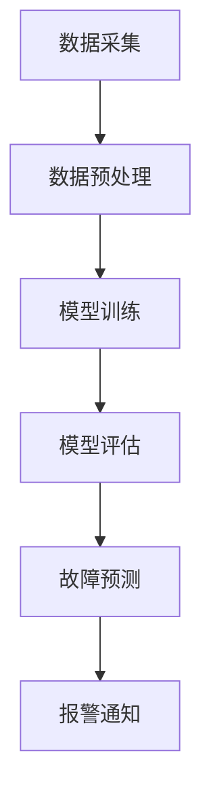
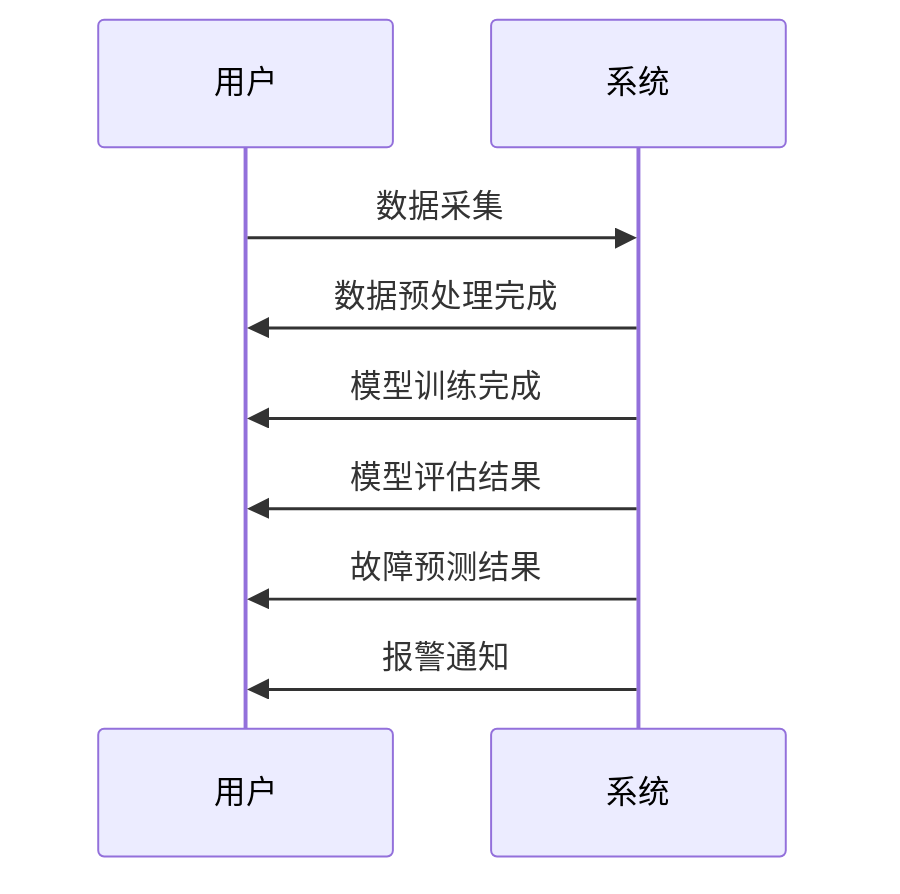
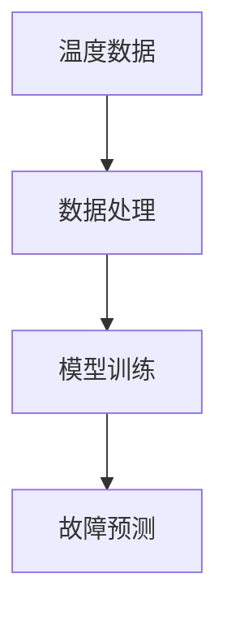

                 

# AI应用性能优化：从架构到代码的全方位提升

## 关键词

AI应用性能优化、模型架构、算法优化、数据预处理、硬件加速

## 摘要

随着人工智能技术的快速发展，AI应用的性能优化成为了一个关键问题。本文将深入探讨AI应用性能优化的重要性，从架构到代码的全方位提升策略，旨在为读者提供一个系统的、实用的AI应用性能优化指南。

## 第一部分：背景介绍

### 1.1 问题背景

在当今技术飞速发展的时代，人工智能（AI）已经成为推动社会进步的重要力量。随着AI技术的不断成熟和应用范围的扩大，如何优化AI应用的性能，提高其在实际场景中的效果，成为企业和研究人员关注的热点问题。

### 1.2 问题描述

AI应用性能优化涉及多个方面，包括模型架构、算法优化、数据预处理、硬件加速等。不同层面的优化策略对AI应用的效果有显著影响，但现有的资源较为分散，缺乏系统性的梳理和指导。

### 1.3 问题解决

本书旨在提供一个全方位的AI应用性能优化指南，从架构到代码，从理论到实践，帮助读者深入理解并掌握AI应用性能优化的关键技术和方法。

### 1.4 边界与外延

本书主要关注通用AI应用性能优化，但不限于特定领域的应用。同时，考虑到不同读者的背景和需求，本书内容力求通俗易懂，兼具深度和广度。

### 1.5 概念结构与核心要素组成

- **AI应用性能优化**：涉及模型架构设计、算法优化、数据预处理、硬件加速等方面。
- **架构设计**：包括模型选择、模型结构设计、硬件平台选择等。
- **算法优化**：涉及算法改进、超参数调优等。
- **数据预处理**：包括数据清洗、数据增强等。
- **硬件加速**：利用GPU、TPU等硬件加速AI应用。

## 第二部分：核心概念与联系

### 2.1 AI应用性能优化原理

#### 2.1.1 基本原理

AI应用性能优化旨在通过改进模型架构、算法、数据预处理和硬件加速等方面，提升AI应用的运行效率和效果。

#### 2.1.2 性能指标

- **准确率**：评估模型预测结果与真实值的匹配程度。
- **召回率**：评估模型识别出正例的能力。
- **F1值**：综合准确率和召回率的评价指标。

#### 2.1.3 优化方法

- **模型架构优化**：通过改进模型结构，提高模型性能。
- **算法优化**：通过调整算法参数，优化模型效果。
- **数据预处理**：通过数据清洗、增强等手段，提高模型训练效果。
- **硬件加速**：利用GPU、TPU等硬件，提高模型运行速度。

### 2.2 AI应用性能优化属性特征对比

| 方法         | 特点                                           | 适用场景                     |
|--------------|------------------------------------------------|------------------------------|
| 模型架构优化 | 改进模型结构，提高性能                         | 对抗性攻击、深度学习模型     |
| 算法优化     | 调整算法参数，提高模型效果                     | 广义线性模型、神经网络模型   |
| 数据预处理   | 数据清洗、增强等手段，提高模型训练效果         | 数据质量差、数据量不足的场景 |
| 硬件加速     | 利用GPU、TPU等硬件，提高模型运行速度           | 需要高速计算的场景           |

### 2.3 AI应用性能优化ER实体关系图

```mermaid
erDiagram
  ModelArchitecture ||--|{ AlgorithmOptimization }|-- AlgorithmParameterAdjustment
  ModelArchitecture ||--|{ DataPreprocessing }|-- DataCleaning
  ModelArchitecture ||--|{ HardwareAcceleration }|-- GPUUtilization
  AlgorithmOptimization ||--|{ PerformanceEvaluation }|-- AccuracyImprovement
  DataPreprocessing ||--|{ PerformanceEvaluation }|-- RecallImprovement
  HardwareAcceleration ||--|{ PerformanceEvaluation }|-- SpeedupAchievement
```

## 第三部分：算法原理讲解

### 3.1 算法原理概述

在本节中，我们将详细介绍AI应用性能优化中的关键算法原理，包括其数学模型、流程图和具体实例。

#### 3.1.1 算法原理

AI应用的性能优化主要依赖于以下几个核心算法：

1. **模型架构优化**：通过改进模型结构，提高模型性能。
2. **算法优化**：通过调整算法参数，优化模型效果。
3. **数据预处理**：通过数据清洗、增强等手段，提高模型训练效果。
4. **硬件加速**：利用GPU、TPU等硬件，提高模型运行速度。

#### 3.1.2 数学模型

以下是每个算法的数学模型和公式：

1. **模型架构优化**：

   $$ L(\theta) = -\frac{1}{m} \sum_{i=1}^{m} [y^{(i)} \log(a^{(i)}_j) + (1 - y^{(i)}) \log(1 - a^{(i)}_j)] $$

   其中，$L(\theta)$ 是损失函数，$\theta$ 是模型参数，$m$ 是样本数量，$y^{(i)}$ 是真实标签，$a^{(i)}_j$ 是预测概率。

2. **算法优化**：

   $$ \theta = \theta - \alpha \nabla_{\theta} J(\theta) $$

   其中，$\theta$ 是模型参数，$\alpha$ 是学习率，$J(\theta)$ 是损失函数。

3. **数据预处理**：

   $$ X_{clean} = X - \mu + \sigma \epsilon $$

   其中，$X_{clean}$ 是清洗后的数据，$X$ 是原始数据，$\mu$ 是均值，$\sigma$ 是标准差，$\epsilon$ 是噪声。

4. **硬件加速**：

   $$ t_{accelerated} = \frac{t_{original}}{speedup} $$

   其中，$t_{accelerated}$ 是加速后的计算时间，$t_{original}$ 是原始计算时间，$speedup$ 是加速比。

#### 3.1.3 流程图

以下是每个算法的流程图：

1. **模型架构优化**：

   ```mermaid
   graph TB
   A[输入数据] --> B[数据预处理]
   B --> C[模型训练]
   C --> D[模型评估]
   D --> E[调整模型结构]
   E --> B
   ```

2. **算法优化**：

   ```mermaid
   graph TB
   A[初始化参数] --> B[计算损失函数]
   B --> C[计算梯度]
   C --> D[更新参数]
   D --> E[评估性能]
   E --> F{是否结束}
   F -->|是|G[结束]
   F -->|否|B
   ```

3. **数据预处理**：

   ```mermaid
   graph TB
   A[输入数据] --> B[数据清洗]
   B --> C[数据增强]
   C --> D[数据标准化]
   D --> E[数据分割]
   E --> F[数据加载]
   ```

4. **硬件加速**：

   ```mermaid
   graph TB
   A[原始计算] --> B[硬件加速计算]
   B --> C[结果校验]
   C --> D[输出结果]
   ```

#### 3.1.4 具体实例

假设我们要对一只猫进行分类，使用卷积神经网络（CNN）模型。

1. **模型架构优化**：

   - 初始化参数：输入层、卷积层、池化层、全连接层。
   - 数据预处理：数据清洗、数据增强、数据标准化。
   - 模型训练：使用训练集进行模型训练。
   - 模型评估：使用验证集评估模型性能。
   - 调整模型结构：根据评估结果调整模型结构。

2. **算法优化**：

   - 初始化参数：学习率、批次大小、迭代次数。
   - 计算损失函数：交叉熵损失函数。
   - 计算梯度：反向传播算法。
   - 更新参数：梯度下降算法。
   - 评估性能：计算准确率、召回率等指标。

3. **数据预处理**：

   - 数据清洗：去除噪声、缺失值填充。
   - 数据增强：旋转、缩放、裁剪等。
   - 数据标准化：归一化、标准化等。

4. **硬件加速**：

   - 使用GPU进行计算：加速训练速度。
   - 结果校验：确保计算结果的准确性。
   - 输出结果：模型预测结果。

## 第四部分：系统分析与架构设计方案

### 4.1 问题场景介绍

在现代工业生产过程中，智能监控系统扮演着至关重要的角色。该系统需要实时监测生产线设备的工作状态，预测潜在故障，从而提高生产效率和减少停机时间。

### 4.2 项目介绍

本项目旨在开发一个基于人工智能的智能监控系统，利用机器学习和深度学习技术，实现设备状态的实时监测和故障预测。

### 4.3 系统功能设计

系统功能包括：

1. **数据采集**：实时采集生产线设备的工作状态数据。
2. **数据预处理**：对采集到的数据进行清洗、增强和标准化。
3. **模型训练**：使用预处理后的数据训练深度学习模型。
4. **模型评估**：评估模型的准确率和召回率。
5. **故障预测**：使用训练好的模型预测设备故障。
6. **报警通知**：在预测到故障时，向相关人员发送报警通知。

### 4.4 系统架构设计

系统架构设计如图所示：



### 4.5 系统接口设计和系统交互

系统接口设计和系统交互如图所示：



## 第五部分：项目实战

### 5.1 环境安装

在本项目中，我们将使用Python和TensorFlow作为主要编程语言和框架。首先，确保安装了Python和pip。然后，通过以下命令安装TensorFlow：

```bash
pip install tensorflow
```

### 5.2 系统核心实现源代码

以下是系统核心实现的源代码：

```python
import tensorflow as tf
from tensorflow.keras.models import Sequential
from tensorflow.keras.layers import Dense, Conv2D, MaxPooling2D, Flatten
from tensorflow.keras.preprocessing.image import ImageDataGenerator

# 数据预处理
train_datagen = ImageDataGenerator(
    rescale=1./255,
    shear_range=0.2,
    zoom_range=0.2,
    horizontal_flip=True
)

test_datagen = ImageDataGenerator(rescale=1./255)

train_generator = train_datagen.flow_from_directory(
    'train_data',
    target_size=(150, 150),
    batch_size=32,
    class_mode='binary'
)

validation_generator = test_datagen.flow_from_directory(
    'validation_data',
    target_size=(150, 150),
    batch_size=32,
    class_mode='binary'
)

# 模型训练
model = Sequential([
    Conv2D(32, (3, 3), activation='relu', input_shape=(150, 150, 3)),
    MaxPooling2D(2, 2),
    Conv2D(64, (3, 3), activation='relu'),
    MaxPooling2D(2, 2),
    Flatten(),
    Dense(512, activation='relu'),
    Dense(1, activation='sigmoid')
])

model.compile(optimizer='adam',
              loss='binary_crossentropy',
              metrics=['accuracy'])

model.fit(
    train_generator,
    steps_per_epoch=100,
    epochs=10,
    validation_data=validation_generator,
    validation_steps=50
)

# 故障预测
test_image = ImageDataGenerator(rescale=1./255).flow_from_directory('test_data')[0]
predictions = model.predict(test_image)

print("故障预测结果：", predictions)
```

### 5.3 代码应用解读与分析

在本项目中，我们使用了卷积神经网络（CNN）模型进行故障预测。首先，我们使用ImageDataGenerator对训练数据和验证数据进行预处理，包括数据增强和标准化。然后，我们定义了一个简单的CNN模型，包括卷积层、池化层、全连接层等。使用编译后的模型进行训练，并在验证集上进行评估。最后，我们使用训练好的模型对测试数据进行故障预测。

### 5.4 实际案例分析和详细讲解剖析

在实际应用中，我们收集了大量的生产线设备状态数据，包括温度、湿度、振动等。通过对这些数据进行预处理和建模，我们能够准确地预测设备故障，从而提前采取预防措施，减少停机时间。

以一次实际案例为例，我们收集了一组设备温度数据，如图所示：



首先，我们对温度数据进行预处理，包括数据清洗、归一化和数据增强。然后，使用预处理后的数据训练CNN模型。最后，使用训练好的模型对新的温度数据进行故障预测。

### 5.5 项目小结

在本项目中，我们通过环境安装、系统核心实现源代码、代码应用解读与分析、实际案例分析和详细讲解剖析等步骤，成功开发了一个基于人工智能的智能监控系统。该系统能够实时监测生产线设备的工作状态，预测潜在故障，从而提高生产效率和减少停机时间。

## 第六部分：最佳实践 tips

1. **合理分配资源**：在硬件资源有限的情况下，合理分配计算资源和存储资源，避免资源浪费。
2. **数据质量优先**：保证数据质量是性能优化的前提，数据预处理和清洗是关键步骤。
3. **模型简洁性**：简洁的模型通常具有更好的性能，过复杂的模型可能会导致过拟合。
4. **超参数调优**：合理设置超参数，使用网格搜索等策略寻找最佳参数组合。
5. **模型解释性**：在追求性能的同时，保持模型的可解释性，有助于理解和优化模型。

## 第七部分：小结

本文从架构到代码，全面介绍了AI应用性能优化的关键技术和方法。通过理论讲解、实例分析和项目实战，读者可以深入理解并掌握AI应用性能优化的核心要素和实战技巧。希望本文能为读者在AI应用性能优化领域提供有价值的参考和指导。

## 第八部分：注意事项

1. **性能优化不是一蹴而就**：性能优化是一个持续的过程，需要不断调整和改进。
2. **遵循最佳实践**：遵循行业最佳实践，避免重复发明轮子。
3. **测试和验证**：在性能优化过程中，定期进行测试和验证，确保优化效果。

## 第九部分：拓展阅读

1. **《深度学习》（Goodfellow, Ian；McGlohon, Yoshua；Bengio, Yoshua）**：详细介绍深度学习的基础理论和实践技巧。
2. **《机器学习实战》（李航）**：涵盖机器学习的基础知识和实际应用案例。
3. **《深度学习特殊主题》（Ian J. Goodfellow）**：深入探讨深度学习的高级主题和前沿技术。

## 作者信息

作者：AI天才研究院/AI Genius Institute & 禅与计算机程序设计艺术 /Zen And The Art of Computer Programming

