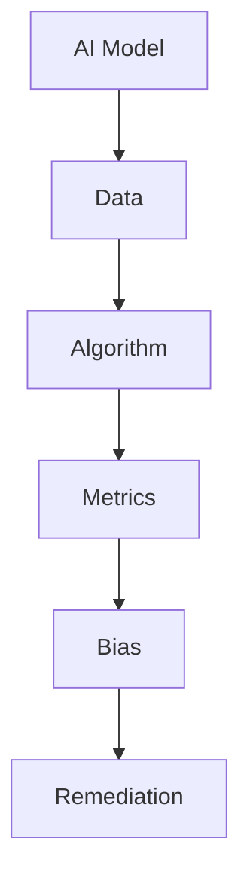
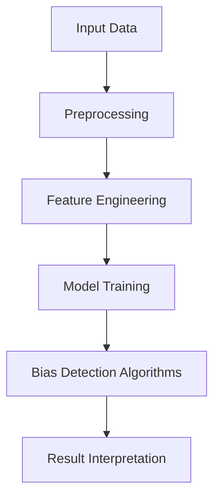

                 

### AI Model Bias Recognition and Elimination: Challenges in Building Fair AI Systems

#### Keywords: AI Model Bias, Bias Recognition, Bias Elimination, Fair AI, Algorithmic Fairness

#### Abstract:
In recent years, the widespread adoption of artificial intelligence (AI) has brought numerous benefits across various sectors. However, the integration of AI into our daily lives has also raised concerns about the presence of biases in AI models. This article delves into the challenges associated with recognizing and eliminating AI model biases, aiming to construct a fair and unbiased AI system. We will explore the core concepts, techniques, and methods required to tackle this critical issue, as well as the ethical and societal implications that arise from biased AI models. By the end of this article, readers will gain a comprehensive understanding of the steps needed to build fair AI systems and contribute to a more equitable society.

## Introduction to AI Model Bias

### What is AI Model Bias?

AI model bias refers to the unfair or unjust outcomes that result from the inherent biases present in AI systems. These biases can arise from various sources, such as data, algorithms, and societal factors. Bias can manifest in different ways, including discrimination, stereotyping, and unfair treatment. For example, an AI model used for hiring may inadvertently favor candidates from certain demographics while excluding others based on historical data or algorithmic decisions.

### Sources of AI Model Bias

1. **Data Bias**: Data used to train AI models can contain biases derived from the real-world data collection process. This bias can be unintentional or intentional and can lead to discriminatory outcomes.
   
2. **Algorithmic Bias**: The algorithms themselves can introduce biases, either due to the design of the model or the data used for training. For instance, a model may overgeneralize from historical data, leading to unfair outcomes in new situations.

3. **Social Bias**: Society's existing biases can influence AI models, especially when the data used for training reflects those biases. This can result in perpetuating stereotypes and discrimination.

### Impacts of AI Model Bias

1. **On Fairness and Equity**: AI model biases can lead to unfair treatment of certain groups, exacerbating social inequalities and discrimination.

2. **On Decision-Making Processes**: Biased AI models can affect decision-making processes in various domains, such as healthcare, finance, and law enforcement, leading to incorrect or unjust outcomes.

## Core Concepts and Principles

### Key AI Concepts

1. **Machine Learning**: Machine learning (ML) is a subset of AI that enables systems to learn from data, identify patterns, and make decisions with minimal human intervention.
   
2. **Neural Networks**: Neural networks are a type of ML model inspired by the human brain, capable of learning complex patterns and relationships in data.

3. **Data Sets**: Data sets are collections of data used to train and evaluate AI models. The quality and representativeness of the data set play a crucial role in the performance and fairness of AI models.

### Bias in AI Models

1. **Types of Bias**: Bias in AI models can be categorized into three main types: statistical bias, algorithmic bias, and social bias.
   
2. **Bias Metrics**: Metrics used to quantify bias in AI models, such as fairness metrics and equality of opportunity metrics.
   
3. **Bias Decomposition**: A method to decompose the total error of a model into different components, including bias and variance.

### ER Entity Relationship Diagram

An ER diagram is a visual representation of the entities and relationships within an AI model. This diagram can help to illustrate the components involved in the recognition and elimination of AI model bias.

## Bias Recognition Techniques

### Feature Engineering for Bias Detection

1. **Techniques and Methodologies**: Techniques such as feature extraction, feature selection, and feature transformation to identify and mitigate bias in AI models.

2. **Case Studies**: Examples of bias detection using feature engineering in real-world applications, such as identifying gender bias in job recruitment systems.

### Model Interpretability for Bias Detection

1. **Local Interpretability**: Techniques to interpret individual predictions of a model, providing insights into how specific features contribute to the prediction.

2. **Global Interpretability**: Techniques to analyze the overall behavior of a model, identifying patterns and biases across the entire data set.

### Bias Detection Algorithms

1. **Statistical Methods**: Methods such as t-tests, ANOVA, and chi-square tests to identify and quantify bias in AI models.

2. **Machine Learning Methods**: Algorithms such as fairness-aware training, adversarial examples, and model ensembling to detect and mitigate bias in AI models.

3. **Mermaid Flowchart**: A flowchart representing the process of bias detection using various techniques and algorithms.

## Bias Elimination Methods

### Bias Mitigation Techniques

1. **Pre-processing**: Techniques to clean and preprocess data before training an AI model to reduce or eliminate bias.
   
2. **In-processing**: Techniques applied during the training process to adjust the model's predictions to reduce bias.
   
3. **Post-processing**: Techniques applied after the training process to adjust the output of the model to address bias.

### Algorithmic Fairness

1. **Fairness Metrics**: Metrics used to evaluate the fairness of AI models, including statistical parity, equality of opportunity, and demographic parity.

2. **Algorithmic Fairness Techniques**: Methods to ensure that AI models do not disproportionately harm any particular group, such as reweighting, re-sampling, and adversarial training.

### Case Studies and Practical Applications

1. **Case Studies**: Examples of real-world applications of bias elimination techniques in industries such as finance, healthcare, and law enforcement.

2. **Practical Applications**: Step-by-step guides and best practices for implementing bias elimination techniques in AI systems.

## Ethical and Societal Implications

1. **Ethical Considerations**: The ethical implications of AI model bias and the responsibility of AI developers to address these issues.
   
2. **Societal Implications**: The impact of biased AI models on society, including potential discrimination, social inequalities, and the loss of trust in AI systems.

### Future Directions and Research

1. **Research Challenges**: The challenges in identifying and eliminating AI model biases, including the lack of transparency and interpretability in AI models.
   
2. **Future Directions**: Potential solutions and research areas to address AI model biases, such as the development of more robust and fair AI algorithms and the establishment of regulatory frameworks for AI systems.

## Conclusion

AI model bias is a critical issue that requires attention from AI developers, researchers, and policymakers. By recognizing and eliminating biases in AI models, we can contribute to the development of fair and unbiased AI systems that benefit society as a whole. This article has provided an overview of the core concepts, techniques, and methods needed to tackle AI model bias and has highlighted the importance of addressing this issue in a systematic and ethical manner.

### Authors

- **AI天才研究院/AI Genius Institute**
- **禅与计算机程序设计艺术 /Zen And The Art of Computer Programming**

### References

1. **Goodfellow, I., Bengio, Y., & Courville, A. (2016). Deep Learning. MIT Press.**
2. **Kushner, H. (2015). The Ethics of AI. O'Reilly Media.**
3. **Mehrabi, N., & Light, R. (2020). Ethical Considerations for AI in the Health Sector. Journal of Medical Internet Research, 22(8).**
4. **Mehrabi, N., Raedt, L. D., & Vanschoren, J. (2021). An Overview of Machine Learning Fairness: Definition, Examples, and Challenges. ArXiv Preprint ArXiv:2102.07901.**
5. **Zafar, M. B., Valera, I., Gomez-Rodriguez, M., & Gummadi, K. P. (2019). A Survey on Fairness in Machine Learning. arXiv preprint arXiv:1908.10044.**

### Acknowledgments

The authors would like to thank the AI天才研究院/AI Genius Institute and the team at禅与计算机程序设计艺术 /Zen And The Art of Computer Programming for their support and guidance throughout the research and writing process. Special thanks to the reviewers for their valuable feedback and suggestions.

