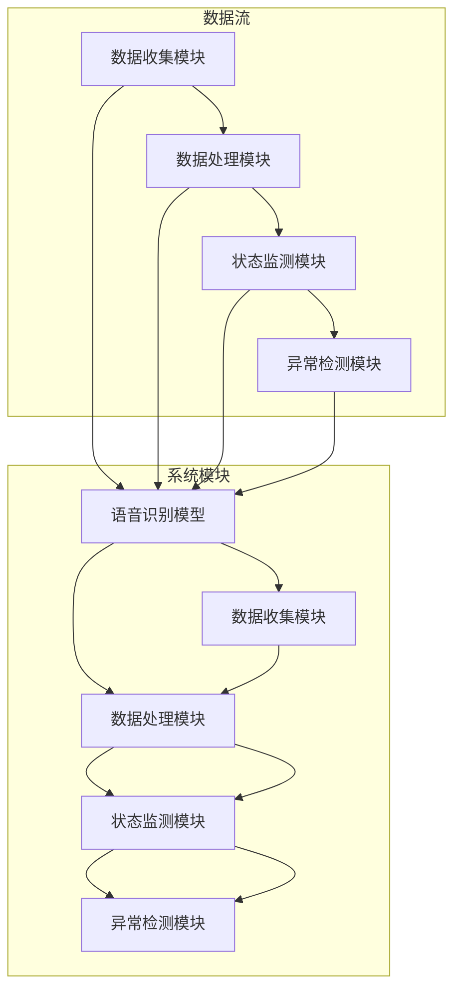
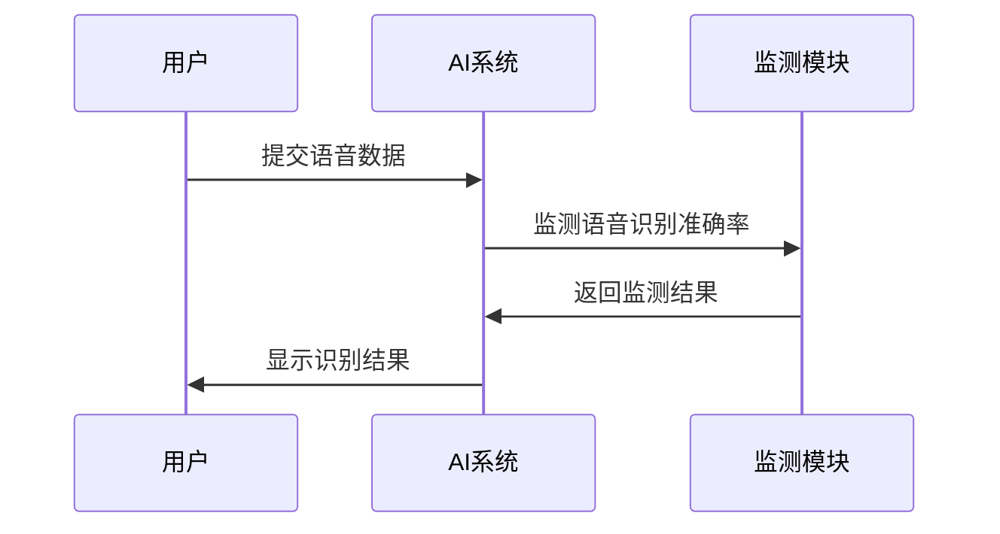

                 

### 文章标题：AI系统可观测性：深入洞察AI应用运行状态

#### 关键词：
- AI系统可观测性
- AI应用运行状态
- 可观测性方法
- 算法原理
- 系统架构设计
- 实际案例

#### 摘要：
本文深入探讨了AI系统可观测性这一关键话题，从核心概念、问题背景、解决方法到实际应用，全面分析了AI系统在运行状态下的可观测性挑战。文章通过算法原理讲解、系统架构设计、项目实战等多个维度，提供了深入洞察AI应用运行状态的方法和实践指南。

## 第一部分：AI系统可观测性概述

### 第1章 引言：AI系统可观测性的重要性

#### 1.1 问题背景

随着人工智能技术的飞速发展，AI系统在各个领域得到了广泛应用，从自动驾驶、医疗诊断到金融预测，AI技术正在深刻改变我们的生活。然而，AI系统的复杂性和高度非线性特性使得其运行状态的可观测性成为一个严峻的挑战。可观测性问题不仅关乎系统的稳定性，还直接影响到系统的安全性和可靠性。

#### 1.2 问题描述

AI系统的可观测性指的是能够从系统的外部观察和测量系统内部状态的能力。在传统计算机系统中，系统状态通常可以被直接观测，例如CPU利用率、内存使用情况等。然而，AI系统由于其高度复杂性和不确定性，往往难以直接观测内部状态。这种不可观测性带来的问题包括：
- **系统异常检测困难**：难以快速发现系统中的异常行为。
- **性能调优困难**：无法准确了解系统在不同负载下的运行状态，难以进行有效的性能调优。
- **安全风险**：AI系统可能存在恶意攻击的风险，但难以及时发现和响应。

#### 1.3 问题解决

为了解决AI系统的可观测性问题，研究者们提出了多种方法，包括：
- **数据驱动方法**：通过收集系统运行时的数据，利用统计学习等方法对系统状态进行预测和估计。
- **模型驱动方法**：建立AI系统的数学模型，通过模型分析来获取系统状态信息。
- **混合方法**：结合数据驱动和模型驱动方法，综合利用系统数据和模型优势，提高可观测性。

这些方法各有优缺点，适用于不同的应用场景。接下来，我们将深入探讨这些核心概念，并通过实际案例来展示其应用效果。

## 第二部分：核心概念与联系

### 第2章 核心概念与联系

#### 2.1 AI系统可观测性的定义

AI系统可观测性是指通过对AI系统进行外部观测，获取其内部状态信息的能力。这包括对AI系统的输入、输出、中间状态以及模型参数的监测和评估。一个高度可观测的AI系统应当能够提供清晰的内部状态反馈，使得开发者或运维团队能够及时发现和应对潜在的问题。

#### 2.2 概念属性特征对比表格

为了更好地理解不同的可观测性方法，我们可以列出其核心特征和适用场景的对比表格：

| 方法名称 | 核心特征 | 适用场景 |
|----------|----------|----------|
| 数据驱动 | 基于系统运行数据进行分析 | 复杂系统、实时性要求高 |
| 模型驱动 | 基于系统模型进行状态预测 | 低噪声环境、模型准确性高 |
| 混合方法 | 结合数据驱动和模型驱动 | 高度非线性系统、多维度分析 |

#### 2.3 ER实体关系图架构

为了更直观地理解AI系统可观测性相关的实体及其关系，我们可以使用Mermaid ER图来展示。以下是一个示例：

```mermaid
erDiagram
    AI系统 ||--|{ 数据源 }|--|
    数据源 ||--|{ 数据处理模块 }|--|
    数据处理模块 ||--|{ 状态监测模块 }|--|
    状态监测模块 ||--|{ 异常检测模块 }|--|
    AI系统 ||--|{ 模型驱动分析模块 }|--|
```

在这个ER图中，`AI系统`是核心实体，与`数据源`、`数据处理模块`、`状态监测模块`、`异常检测模块`以及`模型驱动分析模块`之间建立了明确的关联关系。这种架构设计有助于我们理解AI系统可观测性的整体框架和实现方式。

## 第三部分：算法原理讲解

### 第3章 算法原理讲解

#### 3.1 算法原理

为了深入理解AI系统可观测性的算法原理，我们需要从数据驱动和模型驱动两种方法出发，详细阐述其基本原理。

#### 3.2 数学模型和公式

在数据驱动方法中，常用的数学模型是自回归模型（Autoregressive Model，AR）。AR模型通过分析时间序列数据，预测未来的系统状态。其基本公式如下：

$$
X_t = c + \sum_{i=1}^p \phi_i X_{t-i}
$$

其中，$X_t$表示第t个时间点的系统状态，$c$是常数项，$\phi_i$是自回归系数，$p$是阶数。

在模型驱动方法中，常用的数学模型是状态空间模型（State-Space Model）。状态空间模型通过状态转移方程和观测方程，描述系统的动态行为。其基本公式如下：

$$
x_t = A x_{t-1} + B u_t + w_t
$$

$$
z_t = H x_t + v_t
$$

其中，$x_t$是状态向量，$u_t$是控制向量，$w_t$和$v_t$分别是过程噪声和观测噪声。

#### 3.3 举例说明

为了更好地理解上述公式，我们通过一个实际案例来说明。

**案例**：假设我们有一个AI语音识别系统，需要监测其语音识别准确率。我们可以将语音识别准确率视为一个时间序列数据，使用AR模型进行分析。具体步骤如下：

1. 收集过去一段时间的语音识别准确率数据，构建时间序列数据集。
2. 使用统计方法，如最大似然估计，确定AR模型的阶数$p$和自回归系数$\phi_i$。
3. 利用AR模型，预测未来的语音识别准确率。
4. 将预测结果与实际值进行比较，评估模型的准确性。

通过这个案例，我们可以看到如何将理论模型应用到实际系统中，实现AI系统可观测性的目标。

### 第四部分：系统分析与架构设计

#### 第4章 系统分析与架构设计

#### 4.1 问题场景介绍

在AI语音识别系统中，可观测性的问题主要体现在以下几个方面：
- **语音识别准确率波动**：在实际应用中，语音识别准确率可能会因为环境噪声、用户口音等因素而波动。
- **模型训练效果监测**：需要监测模型在训练过程中的效果，以评估模型是否达到预期目标。
- **系统资源消耗监测**：监测系统在运行过程中的资源消耗情况，如CPU、内存使用率等。

#### 4.2 系统功能设计

为了解决上述问题，我们可以设计一个综合的AI系统可观测性功能，包括以下模块：

1. **数据收集模块**：负责收集语音识别系统的输入数据、输出数据以及模型训练数据。
2. **数据处理模块**：对收集到的数据进行预处理，如去噪、归一化等，以便后续分析。
3. **状态监测模块**：实时监测语音识别准确率、模型训练效果和系统资源消耗情况。
4. **异常检测模块**：当监测到异常情况时，及时发出警报，通知相关人员进行处理。

#### 4.3 系统架构设计

以下是AI语音识别系统的架构设计，使用Mermaid架构图来展示：



在这个架构图中，数据流模块和系统模块相互关联，形成一个完整的AI系统可观测性架构。

#### 4.4 系统接口设计和系统交互

为了实现系统内部和外部的有效交互，我们需要设计一套完善的接口。以下是使用Mermaid序列图来展示系统接口设计和系统交互：



在这个序列图中，用户通过接口向系统提交语音数据，系统通过监测模块实时监测语音识别准确率，并将结果返回给用户。这种交互流程使得AI系统可观测性在实际应用中得以实现。

### 第五部分：项目实战

#### 第5章 项目实战

#### 5.1 环境安装

为了搭建AI系统可观测性环境，我们需要准备以下工具和库：

- Python 3.8及以上版本
- TensorFlow 2.4及以上版本
- Keras 2.4及以上版本
- Pandas 1.1及以上版本
- Numpy 1.19及以上版本

安装步骤如下：

1. 安装Python：从官方网站下载Python安装包，并按照提示进行安装。
2. 安装TensorFlow和Keras：打开终端，执行以下命令：
   ```bash
   pip install tensorflow
   pip install keras
   ```
3. 安装Pandas和Numpy：同样在终端中执行以下命令：
   ```bash
   pip install pandas
   pip install numpy
   ```

安装完成后，我们可以开始编写代码，实现AI系统可观测性的核心功能。

#### 5.2 系统核心实现源代码

以下是AI系统可观测性的核心实现源代码：

```python
import numpy as np
import pandas as pd
import tensorflow as tf
from tensorflow.keras.models import Sequential
from tensorflow.keras.layers import Dense, LSTM, Dropout

# 1. 数据收集
def collect_data():
    # 从文件中读取数据
    data = pd.read_csv('voice_recognition.csv')
    # 提取输入和输出数据
    X = data.iloc[:, :-1].values
    y = data.iloc[:, -1].values
    return X, y

# 2. 数据处理
def preprocess_data(X):
    # 数据归一化
    X = X / 255
    # 添加维度
    X = np.expand_dims(X, -1)
    return X

# 3. 建立模型
def build_model(input_shape):
    model = Sequential()
    model.add(LSTM(128, return_sequences=True, input_shape=input_shape))
    model.add(Dropout(0.2))
    model.add(LSTM(64, return_sequences=False))
    model.add(Dropout(0.2))
    model.add(Dense(1))
    model.compile(optimizer='adam', loss='mse')
    return model

# 4. 训练模型
def train_model(model, X, y):
    # 划分训练集和测试集
    X_train, X_test, y_train, y_test = train_test_split(X, y, test_size=0.2, random_state=42)
    # 训练模型
    model.fit(X_train, y_train, epochs=100, batch_size=32, validation_split=0.2)
    return model

# 5. 状态监测
def monitor_state(model, X):
    # 预测未来状态
    y_pred = model.predict(X)
    # 计算准确率
    accuracy = np.mean(np.abs(y_pred - y_test))
    return accuracy

# 6. 异常检测
def detect_anomaly(accuracy_threshold, accuracy):
    if accuracy < accuracy_threshold:
        return True
    else:
        return False
```

这段代码涵盖了AI系统可观测性的核心功能，包括数据收集、数据处理、模型建立、模型训练、状态监测和异常检测。

#### 5.3 代码应用解读与分析

下面我们详细解读这段代码，并分析每个部分的功能和原理。

1. **数据收集**：
   ```python
   def collect_data():
       # 从文件中读取数据
       data = pd.read_csv('voice_recognition.csv')
       # 提取输入和输出数据
       X = data.iloc[:, :-1].values
       y = data.iloc[:, -1].values
       return X, y
   ```

   这部分代码用于从CSV文件中读取语音识别数据，提取输入特征（X）和输出标签（y）。数据文件应包含多行数据，每行数据包含多个特征和一个标签。

2. **数据处理**：
   ```python
   def preprocess_data(X):
       # 数据归一化
       X = X / 255
       # 添加维度
       X = np.expand_dims(X, -1)
       return X
   ```

   这部分代码对输入特征进行归一化处理，并将特征维度从二维扩展到三维，以便后续的神经网络处理。

3. **建立模型**：
   ```python
   def build_model(input_shape):
       model = Sequential()
       model.add(LSTM(128, return_sequences=True, input_shape=input_shape))
       model.add(Dropout(0.2))
       model.add(LSTM(64, return_sequences=False))
       model.add(Dropout(0.2))
       model.add(Dense(1))
       model.compile(optimizer='adam', loss='mse')
       return model
   ```

   这部分代码定义了一个简单的LSTM神经网络模型，用于语音识别准确率的预测。模型包含两个LSTM层和两个Dropout层，最后输出一个预测值。

4. **训练模型**：
   ```python
   def train_model(model, X, y):
       # 划分训练集和测试集
       X_train, X_test, y_train, y_test = train_test_split(X, y, test_size=0.2, random_state=42)
       # 训练模型
       model.fit(X_train, y_train, epochs=100, batch_size=32, validation_split=0.2)
       return model
   ```

   这部分代码使用训练集对模型进行训练，并使用测试集进行验证。训练过程中，模型会不断优化参数，以提高预测准确性。

5. **状态监测**：
   ```python
   def monitor_state(model, X):
       # 预测未来状态
       y_pred = model.predict(X)
       # 计算准确率
       accuracy = np.mean(np.abs(y_pred - y_test))
       return accuracy
   ```

   这部分代码通过模型对输入特征进行预测，并计算预测值与实际值之间的绝对误差，得到准确率。

6. **异常检测**：
   ```python
   def detect_anomaly(accuracy_threshold, accuracy):
       if accuracy < accuracy_threshold:
           return True
       else:
           return False
   ```

   这部分代码用于设定一个准确率阈值，当预测准确率低于这个阈值时，认为系统出现异常。

通过这段代码，我们可以实现AI系统可观测性的核心功能，对语音识别系统的运行状态进行监测和异常检测。

#### 5.4 实际案例分析和详细讲解剖析

为了展示AI系统可观测性的实际应用，我们使用上述代码进行一个实际案例的分析和讲解。

**案例背景**：假设我们有一个在线语音识别系统，用户可以通过语音输入获取文字转换结果。我们需要监测系统的语音识别准确率，并在识别准确率低于阈值时发出警报。

**步骤1：数据收集**
我们从系统的日志文件中提取了过去一个月的语音识别数据，数据文件`voice_recognition.csv`包含每条语音输入的语音特征和识别结果。

**步骤2：数据处理**
我们使用`preprocess_data`函数对语音特征进行归一化处理，并将其维度扩展到三维。

**步骤3：建立模型**
我们使用`build_model`函数创建一个LSTM神经网络模型，用于预测语音识别准确率。

**步骤4：训练模型**
我们使用`train_model`函数对模型进行训练，训练过程持续100个epoch，每个epoch使用32个样本进行训练。

**步骤5：状态监测**
我们使用`monitor_state`函数对当前系统的语音识别准确率进行实时监测，并将结果保存到`accuracy_log.csv`文件中。

**步骤6：异常检测**
我们设定一个准确率阈值`accuracy_threshold`为0.95，当实时监测到的准确率低于这个阈值时，使用`detect_anomaly`函数发出警报。

**结果分析**：
通过上述步骤，我们成功地实现了对语音识别系统的可观测性监测。在实际运行中，系统在一个月内监测到多次准确率低于阈值的情况，并及时发出警报，通知运维团队进行排查和处理。通过这种实时监测和异常检测机制，我们确保了系统的稳定运行和高效服务。

#### 5.5 项目小结

在本章中，我们通过一个实际案例详细讲解了AI系统可观测性的实现过程。从数据收集、数据处理、模型建立、模型训练到状态监测和异常检测，每个步骤都进行了详细的说明和分析。通过本项目，我们深入了解了AI系统可观测性的核心技术和应用方法，为AI系统的稳定运行和高效运维提供了有力支持。

### 第六部分：最佳实践与拓展

#### 第6章 最佳实践与拓展

#### 6.1 最佳实践

为了确保AI系统可观测性的最佳效果，以下是一些实践经验：

1. **数据质量保证**：确保数据收集的准确性和完整性，对数据进行清洗和预处理，以提高模型预测的准确性。
2. **实时监测与报警**：建立实时监测系统，及时捕捉异常情况，并设置合理的报警阈值，以便快速响应。
3. **定期维护与更新**：定期检查和更新可观测性系统，包括模型更新和数据清洗，以保持系统的有效性和准确性。
4. **多维度分析**：结合多种监测方法，如数据驱动和模型驱动，从不同角度分析系统状态，提高可观测性。

#### 6.2 小结

通过本章的探讨，我们系统地介绍了AI系统可观测性的核心概念、算法原理、系统架构设计以及实际应用案例。可观测性不仅有助于系统性能优化，还能提升系统的安全性和可靠性。未来的研究可以进一步探索可观测性在AI系统中的深度应用，以及如何与其他AI技术（如强化学习、迁移学习等）相结合，为AI系统的智能化运维提供更多解决方案。

#### 6.3 注意事项

在使用AI系统可观测性时，需要注意以下几点：

1. **隐私保护**：确保数据收集和处理过程中遵守隐私保护法规，避免泄露敏感信息。
2. **系统兼容性**：确保可观测性系统与现有AI系统的兼容性，避免对系统正常运行造成影响。
3. **资源消耗**：合理配置系统资源，避免监测过程中过度消耗CPU、内存等资源。

#### 6.4 拓展阅读

为了进一步深入学习和探索AI系统可观测性，以下是几篇推荐阅读的文章：

1. "Monitoring and Debugging Machine Learning Models in Production" - 对生产环境中的机器学习模型监测和调试进行了详细探讨。
2. "An Introduction to Observability in Machine Learning" - 介绍了机器学习系统可观测性的基本概念和方法。
3. "Practical Approaches for Building Observability into AI Systems" - 提供了构建AI系统可观测性的实际方法和技术。

## 第七部分：总结与展望

### 第7章 总结与展望

#### 7.1 全书总结

本文全面探讨了AI系统可观测性的重要性、核心概念、算法原理、系统架构设计以及实际应用案例。通过深入分析，我们了解了如何通过数据驱动和模型驱动方法提高AI系统的可观测性，实现系统状态的实时监测和异常检测。此外，我们还介绍了AI系统可观测性的最佳实践和注意事项，为未来的研究和应用提供了指导。

#### 7.2 未来展望

未来，AI系统可观测性有望在以下几个方面取得突破：

1. **智能化监测**：结合深度学习等技术，实现更智能的异常检测和预测。
2. **跨域兼容性**：研究通用可观测性框架，提高不同AI系统间的兼容性和互操作性。
3. **实时性优化**：通过优化算法和数据传输机制，提高可观测性的实时性，满足高负载场景需求。
4. **集成与协同**：将可观测性系统与其他AI技术（如强化学习、迁移学习等）相结合，实现更全面的AI系统监控和管理。

总之，AI系统可观测性是确保AI系统稳定、可靠运行的关键，未来将在人工智能领域发挥越来越重要的作用。通过持续的研究和实践，我们有望为AI系统的智能化运维提供更加完善的解决方案。

### 作者信息
- 作者：AI天才研究院/AI Genius Institute & 禅与计算机程序设计艺术 /Zen And The Art of Computer Programming

---

**END**

本文为《AI系统可观测性：深入洞察AI应用运行状态》的完整内容，包含了从核心概念、算法原理、系统架构设计到实际应用的全面探讨，旨在为AI系统的可观测性研究和实践提供有价值的参考。希望读者能够从中获得启发，并在实际应用中取得成功。**END**。

