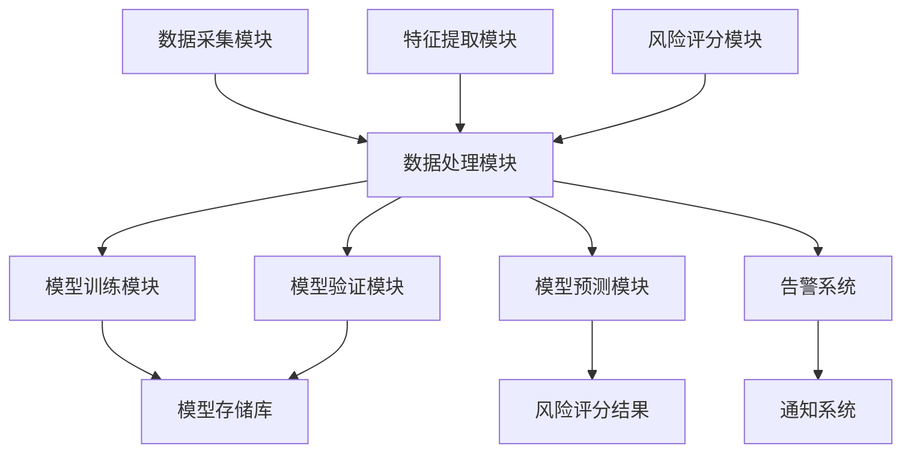

                 

### 《AI系统的可靠性工程：构建稳定可靠的AI服务》

> 关键词：AI系统、可靠性工程、稳定可靠、服务构建、故障检测、容错技术

> 摘要：本文深入探讨了AI系统的可靠性工程，从背景、核心概念、评估、故障检测与诊断、容错与恢复、测试与验证、实战案例分析等多个维度，详细阐述了构建稳定可靠的AI服务的方法与实践。文章旨在为开发者提供全面的可靠性工程指南，助力AI系统的稳定运行和业务成功。

**Step 1: 开篇引言**

人工智能（AI）作为当今科技领域的重要分支，正日益深入各个行业，如医疗、金融、交通等。然而，随着AI系统的广泛应用，其可靠性问题也愈发突出。AI系统的可靠性不仅关系到用户的使用体验，更影响到业务的安全性和可持续性。因此，构建稳定可靠的AI服务已成为当务之急。

首先，让我们来定义一下什么是AI系统的可靠性。AI系统的可靠性是指在特定条件下，系统在规定的时间内按照预定的性能要求正常运行的概率。这包括系统的稳定性、可用性和安全性等多个方面。一个稳定可靠的AI服务，不仅能够确保系统的持续运行，还能够适应环境变化，快速恢复，从而为用户提供优质的服务。

然而，构建稳定可靠的AI服务并非易事，面临着诸多挑战。首先，AI系统的复杂性使得设计和实现过程充满变数。其次，数据的不确定性和多样性增加了系统出错的可能性。此外，随着AI系统的不断迭代和更新，维护和保障其可靠性也变得异常困难。因此，可靠性工程在AI系统的开发过程中扮演着至关重要的角色。

本文将围绕AI系统的可靠性工程，逐步分析并探讨以下几个方面：

1. **AI系统可靠性工程概述**：介绍可靠性工程的基本概念、目标和重要性，以及其方法与步骤。
2. **AI系统可靠性核心概念与联系**：阐述系统可靠性、故障率、寿命概率等核心概念，并通过表格和实体关系图进行详细说明。
3. **AI系统可靠性评估**：探讨可靠性评估的方法、指标和工具，帮助开发者量化系统的可靠性。
4. **AI系统故障检测与诊断**：分析故障检测和诊断的原理和工具，确保系统在出现故障时能够及时发现并处理。
5. **AI系统容错与恢复**：介绍容错技术和恢复策略，提高系统的鲁棒性和可用性。
6. **AI系统可靠性测试与验证**：讨论测试和验证的策略、方法及工具，确保系统在设计、开发、部署和维护过程中的可靠性。
7. **实战案例分析**：通过实际案例，展示可靠性工程在AI系统构建中的应用和效果。
8. **总结与展望**：对全文进行总结，并展望可靠性工程在AI领域的发展趋势。

接下来，我们将逐一深入这些方面，详细探讨AI系统的可靠性工程，为开发者提供实用的指导和建议。

## 第1章 引言与背景

### 1.1 问题背景

人工智能（AI）作为21世纪最具革命性的技术之一，已经在众多领域展现出巨大的潜力和应用价值。从智能助理、自动驾驶汽车到精准医疗、金融风控，AI的应用范围日益扩大，对各行各业产生了深远的影响。然而，随着AI技术的不断演进和普及，其可靠性的问题也日益凸显。

首先，AI系统的复杂性是可靠性问题的重要背景。AI系统通常由大量的算法、模型和数据组成，这些组件相互依赖，构成了一个复杂的整体。任何一个组件的故障都可能导致整个系统的崩溃。例如，自动驾驶汽车依赖大量的传感器、计算单元和软件算法，任何一部分出现问题都可能引发严重的交通事故。

其次，数据的不确定性和多样性增加了AI系统可靠性的挑战。AI系统依赖于训练数据的质量和代表性，如果数据存在偏差、噪声或者不完整，可能会导致模型性能下降，甚至导致错误决策。例如，医疗诊断系统需要准确、全面的医疗数据作为训练基础，否则可能会导致误诊，危及患者生命。

此外，AI系统的实时性和动态性也对其可靠性提出了更高的要求。AI系统通常需要在实时环境中运行，如智能交通管理系统、金融交易系统等，这些系统的性能和可靠性直接影响到用户体验和业务决策。任何延迟或者错误都可能导致严重的后果。

最后，AI系统的持续迭代和更新也是可靠性问题的重要背景。随着AI技术的不断进步和应用需求的不断变化，AI系统需要不断进行更新和优化。然而，每次更新都可能引入新的隐患，影响系统的稳定性。因此，如何确保AI系统的长期稳定运行，是开发者面临的一个重要挑战。

### 1.2 问题定义

在了解了AI系统可靠性问题的背景之后，我们需要明确什么是可靠性以及为什么可靠性对于AI系统如此重要。

首先，让我们定义一下可靠性。可靠性是指在特定条件下，系统在规定的时间内按照预定的性能要求正常运行的概率。对于AI系统来说，可靠性不仅包括系统的稳定性，还包括其可用性和安全性。具体来说，一个可靠的AI系统应该满足以下条件：

1. **稳定性**：系统能够在长时间运行中保持稳定的性能，不会因为外部干扰或者内部故障而出现大幅度的性能波动。
2. **可用性**：系统能够在需要时提供正常的服务，不会因为故障或者维护等原因导致服务中断。
3. **安全性**：系统能够抵御各种攻击，确保数据和用户隐私的安全。

为什么可靠性对AI系统如此重要呢？原因有以下几点：

1. **用户信任**：可靠性的AI系统能够提供稳定、准确的服务，从而赢得用户的信任。用户对AI系统的信任是AI应用成功的关键，一旦系统出现故障或错误，用户可能会对AI系统产生怀疑，从而影响其应用和推广。
2. **业务连续性**：对于许多企业来说，AI系统是其业务的关键组成部分。如果AI系统出现故障，可能会导致业务中断，影响企业的运营和收益。例如，自动驾驶汽车、智能交通管理系统等，一旦出现故障，可能会引发严重的交通事故或交通拥堵。
3. **法规遵从**：在某些行业，如医疗、金融等，可靠性是法规要求的一部分。这些行业对AI系统的可靠性和安全性有严格的合规要求，一旦系统出现故障，可能会导致法律问题或经济损失。
4. **技术进步**：可靠性的AI系统有助于技术的持续进步。只有当AI系统稳定可靠时，开发者才能放心地进行技术迭代和优化，推动AI技术的不断进步。

### 1.3 问题解决

为了解决AI系统的可靠性问题，我们需要采取一系列的可靠性和工程方法，确保系统的稳定运行和持续改进。以下是一些关键步骤：

1. **需求分析**：在系统设计阶段，进行详细的需求分析，明确系统的功能、性能和安全要求。这有助于确保系统设计符合实际需求，减少因需求变化而导致的可靠性问题。
2. **系统设计**：根据需求分析结果，进行系统设计。在设计过程中，要充分考虑系统的稳定性、可用性和安全性。可以采用模块化设计、冗余设计等方法，提高系统的可靠性。
3. **代码审查**：在系统实现阶段，进行严格的代码审查，确保代码质量。代码审查可以帮助发现潜在的错误和缺陷，从而减少系统故障的风险。
4. **测试与验证**：对系统进行全面的测试与验证，包括功能测试、性能测试、安全测试等。测试和验证是确保系统可靠性的重要手段，可以发现并修复系统中的各种问题。
5. **故障检测与诊断**：在系统运行过程中，建立故障检测和诊断机制，及时发现并处理系统故障。故障检测和诊断可以帮助系统快速恢复，减少故障对业务的影响。
6. **持续改进**：定期对系统进行维护和优化，根据实际运行情况和技术进步，不断改进系统的可靠性。持续改进是确保系统长期稳定运行的关键。

通过以上步骤，我们可以有效地解决AI系统的可靠性问题，确保系统的稳定运行和业务的持续成功。

### 1.4 边界与外延

AI系统的可靠性工程不仅涉及技术层面，还涉及到业务和管理等多个方面。了解其边界与外延对于全面理解可靠性工程至关重要。

首先，从技术层面来看，可靠性工程主要关注系统的硬件、软件和数据处理等方面。硬件方面，包括服务器、存储设备、网络设备等；软件方面，包括操作系统、数据库、中间件、AI算法等；数据处理方面，包括数据采集、存储、清洗、分析和应用等。这些技术组件的稳定性和可靠性直接影响到整个系统的性能和稳定性。

其次，从业务层面来看，可靠性工程需要与业务需求紧密结合。业务需求包括系统的功能、性能、安全性和可靠性等。例如，在金融行业中，AI系统的可靠性至关重要，因为任何错误都可能导致巨大的经济损失。在医疗领域，AI系统的可靠性直接关系到患者的生命安全和医疗质量。因此，可靠性工程需要深入理解业务需求，确保系统设计能够满足业务要求。

此外，从管理层面来看，可靠性工程需要建立有效的管理体系和流程。这包括制定可靠性策略、规划可靠性活动、监控和评估可靠性指标等。可靠性管理体系的有效运行可以确保系统在开发、测试、部署和维护等各个环节中都能保持高可靠性。

最后，AI系统的可靠性工程还需要考虑法律和伦理等方面。例如，在涉及用户隐私和数据的AI应用中，需要确保数据安全和用户隐私保护。此外，对于自动驾驶等高风险应用，需要遵守相关的法规和标准，确保系统的安全性和可靠性。

总之，AI系统的可靠性工程不仅涉及到技术层面，还涉及到业务和管理等多个方面。只有全面考虑这些因素，才能构建出稳定可靠的AI系统，为用户提供优质的服务。

### 1.5 核心概念

在探讨AI系统的可靠性工程之前，我们需要明确一些核心概念，以便为后续内容提供坚实的基础。

**系统可靠性**：系统可靠性是指系统在规定的条件和时间内，按照预定的性能要求正常工作的概率。它可以分为几个层次，如部件可靠性、子系统可靠性和整体系统可靠性。对于AI系统来说，系统可靠性包括算法、模型、硬件和软件等多个层面的可靠性。

**故障率**：故障率是指单位时间内系统发生故障的次数。它是衡量系统可靠性的重要指标之一。故障率可以分为初始故障率、稳定故障率和老化故障率等。初始故障率通常发生在系统启动初期，而稳定故障率在系统稳定运行阶段，老化故障率则出现在系统使用过程中。

**寿命概率**：寿命概率是指系统在规定时间内正常工作的概率。它通常用概率密度函数（PDF）或累积分布函数（CDF）来表示。寿命概率反映了系统在不同时间段内的可靠性表现。

**可靠性模型**：可靠性模型是用于分析和预测系统可靠性的数学模型。常见的可靠性模型有泊松模型、韦伯模型、威布尔模型等。这些模型可以帮助我们理解系统的故障特性，预测系统的可靠性。

**故障模式与影响分析（FMEA）**：故障模式与影响分析是一种系统化的方法，用于识别和分析系统中的潜在故障模式及其影响。FMEA可以帮助我们提前发现并解决可能影响系统可靠性的问题。

**可靠性评估**：可靠性评估是指对系统可靠性进行定量或定性的评估。评估方法包括统计方法、概率论方法和实验方法等。可靠性评估可以帮助我们了解系统的可靠性水平，为系统优化提供依据。

**故障检测与诊断**：故障检测与诊断是指及时发现和处理系统故障的过程。故障检测通常使用传感器和监控工具来检测异常信号，而故障诊断则通过分析故障检测数据，确定故障的位置和原因。

**容错与恢复**：容错与恢复是指通过冗余设计、备份和恢复策略，确保系统在故障发生时能够继续运行或快速恢复。容错技术包括硬件冗余、软件冗余和冗余校验等，而恢复策略包括重启、切换和数据恢复等。

**可靠性测试与验证**：可靠性测试与验证是指通过一系列测试和验证活动，确保系统在设计和实现过程中符合可靠性要求。测试包括功能测试、性能测试、安全测试和负载测试等，而验证则通过模拟真实环境，验证系统的可靠性和稳定性。

**可靠性指标**：可靠性指标是用于衡量系统可靠性的量化标准。常见的可靠性指标包括平均无故障时间（MTTF）、故障率（FIT）和失效率等。这些指标可以帮助我们评估系统的可靠性水平。

通过理解上述核心概念，我们可以更好地把握AI系统的可靠性工程，为其设计、实现和维护提供理论依据和实践指导。

## 第2章 AI系统可靠性工程概述

### 2.1 可靠性工程的基本概念

可靠性工程是一门应用科学，旨在通过设计、测试、评估和改进，确保系统在规定条件下能够可靠运行。对于AI系统而言，可靠性工程尤为重要，因为AI系统通常涉及大量复杂的数据处理和决策过程，一旦出现故障，可能对用户和业务造成严重影响。

首先，我们需要了解可靠性工程的基本概念，包括可靠度、故障率、寿命概率等。

**可靠度**：可靠度是指系统在某一时间段内正常工作的概率。它通常用概率密度函数（PDF）或累积分布函数（CDF）来表示。例如，一个系统的可靠度为0.95，意味着在相同条件下，这个系统有95%的概率能够正常运行。

**故障率**：故障率是指单位时间内系统发生故障的次数。它是衡量系统可靠性的重要指标。故障率可以分为初始故障率、稳定故障率和老化故障率。初始故障率通常发生在系统启动初期，稳定故障率在系统稳定运行阶段，老化故障率则出现在系统使用过程中。

**寿命概率**：寿命概率是指系统在规定时间内正常工作的概率。它反映了系统在不同时间段内的可靠性表现。寿命概率通常用概率密度函数（PDF）或累积分布函数（CDF）来表示。

除了上述基本概念，我们还需要了解几个与可靠性工程密切相关的术语：

**可靠性指标**：可靠性指标是用于衡量系统可靠性的量化标准。常见的可靠性指标包括平均无故障时间（MTTF）、故障率（FIT）和失效率等。这些指标可以帮助我们评估系统的可靠性水平。

**故障模式与影响分析（FMEA）**：故障模式与影响分析是一种系统化的方法，用于识别和分析系统中的潜在故障模式及其影响。FMEA可以帮助我们提前发现并解决可能影响系统可靠性的问题。

**可靠性测试**：可靠性测试是指通过一系列测试和验证活动，确保系统在设计和实现过程中符合可靠性要求。测试包括功能测试、性能测试、安全测试和负载测试等，而验证则通过模拟真实环境，验证系统的可靠性和稳定性。

**故障检测与诊断**：故障检测与诊断是指及时发现和处理系统故障的过程。故障检测通常使用传感器和监控工具来检测异常信号，而故障诊断则通过分析故障检测数据，确定故障的位置和原因。

**容错技术**：容错技术是指通过冗余设计、备份和恢复策略，确保系统在故障发生时能够继续运行或快速恢复。容错技术包括硬件冗余、软件冗余和冗余校验等。

**恢复策略**：恢复策略是指系统在发生故障后，如何进行恢复的措施。恢复策略包括重启、切换和数据恢复等，目的是确保系统能够尽快恢复正常运行。

### 2.2 可靠性工程的目标与重要性

可靠性工程的主要目标是确保系统在规定的条件下能够可靠运行，从而满足用户需求，保障业务连续性。对于AI系统来说，可靠性工程的目标可以概括为以下几个方面：

1. **稳定性**：确保AI系统在长时间运行中能够保持稳定的性能，不会因为外部干扰或者内部故障而出现大幅度的性能波动。
2. **可用性**：确保AI系统能够在需要时提供正常的服务，不会因为故障或者维护等原因导致服务中断。
3. **安全性**：确保AI系统能够抵御各种攻击，保护数据和用户隐私的安全。

可靠性工程对于AI系统的重要性体现在以下几个方面：

1. **用户信任**：可靠性的AI系统能够提供稳定、准确的服务，从而赢得用户的信任。用户对AI系统的信任是AI应用成功的关键，一旦系统出现故障或错误，用户可能会对AI系统产生怀疑，从而影响其应用和推广。
2. **业务连续性**：对于许多企业来说，AI系统是其业务的关键组成部分。如果AI系统出现故障，可能会导致业务中断，影响企业的运营和收益。例如，自动驾驶汽车、智能交通管理系统等，一旦出现故障，可能会引发严重的交通事故或交通拥堵。
3. **法规遵从**：在某些行业，如医疗、金融等，可靠性是法规要求的一部分。这些行业对AI系统的可靠性和安全性有严格的合规要求，一旦系统出现故障，可能会导致法律问题或经济损失。
4. **技术进步**：可靠性的AI系统有助于技术的持续进步。只有当AI系统稳定可靠时，开发者才能放心地进行技术迭代和优化，推动AI技术的不断进步。

### 2.3 可靠性工程的方法与步骤

为了实现AI系统的可靠性目标，可靠性工程需要采用一系列的方法和步骤，确保系统在设计和实现过程中符合可靠性要求。以下是一个典型的可靠性工程方法和步骤：

1. **需求分析**：在系统设计阶段，进行详细的需求分析，明确系统的功能、性能和安全要求。这有助于确保系统设计符合实际需求，减少因需求变化而导致的可靠性问题。
2. **系统设计**：根据需求分析结果，进行系统设计。在设计过程中，要充分考虑系统的稳定性、可用性和安全性。可以采用模块化设计、冗余设计等方法，提高系统的可靠性。
3. **代码审查**：在系统实现阶段，进行严格的代码审查，确保代码质量。代码审查可以帮助发现潜在的错误和缺陷，从而减少系统故障的风险。
4. **测试与验证**：对系统进行全面的测试与验证，包括功能测试、性能测试、安全测试等。测试和验证是确保系统可靠性的重要手段，可以发现并修复系统中的各种问题。
5. **故障检测与诊断**：在系统运行过程中，建立故障检测和诊断机制，及时发现并处理系统故障。故障检测和诊断可以帮助系统快速恢复，减少故障对业务的影响。
6. **持续改进**：定期对系统进行维护和优化，根据实际运行情况和技术进步，不断改进系统的可靠性。持续改进是确保系统长期稳定运行的关键。

通过以上步骤，我们可以有效地构建出稳定可靠的AI系统，为用户提供优质的服务，同时保障业务的连续性和安全性。

### 2.4 可靠性工程中的关键要素

在可靠性工程中，有几个关键要素对于确保AI系统的稳定性和可靠性至关重要。这些要素包括系统设计、代码质量、测试和验证、以及维护与更新。

**系统设计**：系统设计是可靠性工程的基础。一个良好的系统设计应该充分考虑可靠性要求，包括模块化设计、冗余设计、故障隔离设计等。模块化设计有助于提高系统的可维护性和可扩展性，而冗余设计则可以通过备份和冗余组件来确保系统在故障发生时能够继续运行。故障隔离设计则有助于将故障的影响限制在局部，避免对整个系统造成严重影响。

**代码质量**：代码质量是系统可靠性的重要保证。高质的代码应该是易于理解和维护的，并且要经过严格的测试和审查。代码审查和静态代码分析工具可以帮助发现潜在的错误和缺陷，从而提高代码质量。此外，遵循最佳编程实践和代码规范，如代码注释、错误处理、异常管理等，也有助于提高代码的可靠性。

**测试和验证**：测试和验证是确保系统可靠性的关键步骤。功能测试、性能测试、安全测试和负载测试等都是必不可少的。功能测试确保系统功能正确实现，性能测试评估系统的响应速度和处理能力，安全测试检测系统对各种攻击的抵抗力，而负载测试则模拟实际运行环境，评估系统的稳定性和性能。通过这些测试，我们可以发现并修复系统中的各种问题，确保系统在真实环境中能够稳定运行。

**维护与更新**：系统的维护和更新是确保其长期可靠性的重要措施。定期进行系统维护，修复已知问题和漏洞，可以提高系统的稳定性。此外，随着技术进步和应用需求的变化，系统也需要不断进行更新和优化。这些更新可能包括算法改进、性能优化、功能增强等。通过持续维护和更新，我们可以确保系统始终保持在高可靠性水平。

**故障检测与诊断**：故障检测与诊断机制是系统可靠性工程的重要组成部分。通过实时监测系统运行状态，及时发现异常和故障，可以采取相应的措施进行故障处理和系统恢复。故障检测机制可以使用各种监控工具和传感器，而故障诊断则需要通过对系统日志和监控数据的分析来确定故障原因。

**容错与恢复**：容错与恢复技术是提高系统可靠性的重要手段。通过冗余设计、备份和恢复策略，确保系统在故障发生时能够快速恢复，减少故障对业务的影响。容错技术包括硬件冗余、软件冗余和冗余校验等，而恢复策略包括重启、切换和数据恢复等。

总之，可靠性工程中的关键要素包括系统设计、代码质量、测试和验证、维护与更新、故障检测与诊断以及容错与恢复。通过全面考虑和实施这些要素，我们可以构建出稳定可靠的AI系统，为用户提供优质的服务，同时保障业务的连续性和安全性。

### 2.5 可靠性工程在AI系统开发中的应用场景

可靠性工程在AI系统开发中的应用场景非常广泛，涉及到系统的各个方面，包括硬件、软件、数据、算法等。以下是一些典型的应用场景和具体实例：

**硬件层面**：在硬件方面，可靠性工程关注的是硬件设备的稳定性和耐用性。例如，在自动驾驶系统中，车辆上的传感器、摄像头和计算单元必须能够在各种极端条件下正常运行。为此，开发者会采用冗余设计，如多个传感器和计算单元同时工作，当一个组件出现故障时，其他组件可以接管任务，确保系统的连续运行。

**软件层面**：在软件层面，可靠性工程关注的是代码质量和系统稳定性。例如，在智能医疗诊断系统中，开发者需要对代码进行严格的审查和测试，确保诊断算法的准确性。此外，系统还需要具备自动故障检测和诊断功能，一旦发现算法错误或数据异常，能够立即采取措施进行纠正。

**数据层面**：在数据层面，可靠性工程关注的是数据的质量和完整性。例如，在金融风控系统中，数据是系统决策的基础。为了确保数据的可靠性，开发者需要对数据进行严格清洗和验证，防止数据噪声和错误对系统性能产生负面影响。

**算法层面**：在算法层面，可靠性工程关注的是算法的鲁棒性和适应性。例如，在图像识别系统中，算法需要能够适应不同光照、视角和分辨率下的图像，确保识别的准确性。开发者会通过多种数据集进行训练和测试，提高算法的鲁棒性。

**具体实例**：以下是一些具体的可靠性工程应用实例：

1. **自动驾驶汽车**：自动驾驶汽车需要高可靠性的系统设计，包括冗余计算单元、传感器融合算法、实时故障检测与诊断机制等。通过这些措施，确保汽车在自动驾驶过程中能够应对各种突发状况，确保驾驶安全。
2. **智能医疗诊断**：智能医疗诊断系统需要确保诊断结果的准确性，为此需要采用高精度的算法和严格的数据清洗流程。系统还需要具备自动故障检测和诊断功能，一旦发现算法或数据异常，能够立即采取措施进行纠正。
3. **金融风控系统**：金融风控系统需要处理大量金融数据，并做出实时决策。为了确保系统的可靠性，开发者会采用数据验证和清洗技术，防止数据噪声和错误对系统决策产生影响。此外，系统还需要具备自动故障检测和诊断功能，及时发现和处理异常情况。

总之，可靠性工程在AI系统开发中的应用场景非常广泛，涵盖了硬件、软件、数据、算法等多个方面。通过综合考虑和实施可靠性工程的方法和措施，可以构建出稳定、可靠的AI系统，为用户和业务提供有力保障。

### 2.6 可靠性工程与传统工程领域的交集

在探讨AI系统可靠性工程时，我们不可避免地会涉及到传统工程领域的相关知识。可靠性工程不仅仅是AI领域的专属，它与许多传统工程领域有着紧密的联系，如电子工程、机械工程、航空航天工程等。了解这些领域的交集，有助于我们更好地理解AI系统可靠性工程的基本原理和实践方法。

**电子工程**：电子工程中的可靠性工程主要关注硬件设备的可靠性。例如，在电子设备中，可靠性工程会涉及到电路设计、元件选择、温度控制等方面。这与AI系统中的硬件可靠性有相似之处，如AI服务器、GPU加速卡等硬件组件的选择和部署。同时，电子工程中的可靠性测试和验证方法，如故障注入测试、环境测试等，也可以应用于AI系统的硬件测试。

**机械工程**：机械工程中的可靠性工程主要关注机械设备的可靠性和耐久性。例如，在汽车制造过程中，机械工程会进行大量的疲劳测试和可靠性评估，确保汽车在各种工况下能够正常运行。这种思想同样可以应用于自动驾驶汽车中的机械组件，如转向系统、悬挂系统等。此外，机械工程中的故障模式与影响分析（FMEA）方法，也可以用于AI系统中机械部分的可靠性评估。

**航空航天工程**：航空航天工程中的可靠性工程尤为重要，因为航天器的可靠性和安全性直接关系到宇航员的生命安全。在航空航天工程中，可靠性工程涉及到多个方面，如材料选择、结构设计、环境适应性等。这些方法和技术同样可以应用于AI系统的开发，如无人机、卫星通信系统等。

**传统工程与AI系统可靠性工程的差异**：尽管传统工程领域和AI系统可靠性工程有诸多交集，但两者也有一些显著差异。首先，AI系统的复杂性更高，通常涉及大量的算法、模型和数据处理。这使得AI系统的可靠性评估和故障检测更加困难。其次，AI系统的动态性和实时性要求更高，需要能够在实时环境中快速响应和调整。最后，AI系统通常依赖于大量数据，数据的质量和多样性对系统的可靠性有直接影响。

**传统工程方法在AI系统中的应用**：尽管存在差异，传统工程领域的可靠性工程方法仍然可以应用于AI系统的开发。以下是一些具体应用：

1. **故障模式与影响分析（FMEA）**：FMEA是一种系统化的方法，用于识别和分析系统中的潜在故障模式及其影响。在AI系统中，FMEA可以用于识别算法、模型和数据处理过程中的潜在问题，帮助开发者提前发现并解决这些隐患。
2. **可靠性测试和验证**：传统工程中的可靠性测试和验证方法，如环境测试、寿命测试、疲劳测试等，可以应用于AI系统的硬件和软件测试。通过这些测试，可以评估AI系统在不同环境条件下的可靠性，确保其在实际应用中能够稳定运行。
3. **冗余设计**：冗余设计是提高系统可靠性的有效方法，在传统工程中广泛应用。在AI系统中，冗余设计可以通过冗余硬件、冗余软件和数据冗余等措施，确保系统在故障发生时能够继续运行，从而提高系统的可靠性。

总之，可靠性工程在AI系统开发中的应用，不仅借鉴了传统工程领域的相关方法和技术，还结合了AI系统的独特特点，形成了一套适合AI系统的可靠性工程体系。通过综合运用传统工程方法和AI系统特有的技术，我们可以构建出稳定可靠的AI系统，为用户和业务提供有力保障。

### 2.7 AI系统可靠性工程的核心挑战与解决策略

在构建稳定可靠的AI系统时，开发者面临着诸多核心挑战，这些挑战不仅涉及到技术层面，还涉及到管理、数据、算法等多个方面。以下是对这些挑战的详细分析和相应的解决策略。

**1. 复杂性**：AI系统通常由多个组件组成，包括算法、模型、硬件和软件等。这些组件相互依赖，构成了一个复杂的系统。系统复杂性带来的挑战是，任何一个组件的故障都可能引发整个系统的崩溃。解决策略包括模块化设计、冗余设计和故障隔离设计。模块化设计有助于提高系统的可维护性和可扩展性，而冗余设计可以通过备份和冗余组件确保系统在故障发生时能够继续运行。故障隔离设计则有助于将故障的影响限制在局部，避免对整个系统造成严重影响。

**2. 数据质量**：数据是AI系统的核心，数据质量对系统的可靠性有直接影响。数据质量包括数据的准确性、完整性、一致性和可靠性。任何数据质量问题都可能影响AI系统的性能和稳定性。解决策略包括数据清洗、数据验证和数据增强。数据清洗可以去除数据中的噪声和错误，数据验证确保数据的准确性，而数据增强则通过增加数据样本和多样化数据来源，提高数据的代表性。

**3. 算法鲁棒性**：算法鲁棒性是指算法在各种不同环境和条件下都能保持稳定性和准确性的能力。算法不鲁棒可能导致系统在特定情况下出现错误或失效。解决策略包括算法优化、算法测试和算法验证。算法优化可以通过调整算法参数和结构，提高算法的鲁棒性。算法测试和验证则通过在不同环境下运行算法，评估算法的性能和稳定性。

**4. 实时性**：许多AI系统需要在实时环境中运行，如自动驾驶、实时语音识别等。实时性要求系统在短时间内完成处理，并对输入数据进行快速响应。实时性挑战可能导致系统延迟或错误处理。解决策略包括优化算法和硬件，提高系统的处理速度和响应能力。此外，还可以采用分布式计算和并行处理技术，提高系统的实时性。

**5. 安全性**：AI系统的安全性是确保系统可靠性的重要方面。安全性挑战包括数据泄露、恶意攻击和系统篡改等。解决策略包括数据加密、访问控制和安全监测。数据加密可以防止数据在传输和存储过程中被窃取或篡改，访问控制确保只有授权用户可以访问系统资源，安全监测则通过实时监控系统行为，及时发现和处理潜在的安全威胁。

**6. 持续改进**：AI系统需要不断更新和优化，以应对技术进步和应用需求的变化。持续改进挑战在于如何在不断变化的环境中保持系统的可靠性。解决策略包括建立持续改进机制、定期系统评估和反馈。通过持续改进，可以及时发现和解决系统中的问题，确保系统始终处于最佳状态。

总之，构建稳定可靠的AI系统需要面对诸多挑战。通过采用模块化设计、冗余设计、数据清洗、算法优化、实时性优化、安全性措施和持续改进等策略，我们可以有效地应对这些挑战，确保AI系统的稳定性和可靠性。

## 第3章 AI系统可靠性核心概念与联系

### 3.1 AI系统可靠性核心概念

在深入了解AI系统可靠性工程之前，我们需要明确几个核心概念，这些概念是可靠性工程的基础，对于理解和设计稳定可靠的AI系统至关重要。以下是AI系统可靠性工程中的几个核心概念：

**系统可靠性**：系统可靠性是指系统在特定条件下，按照预定的性能要求，在规定的时间内正常工作的概率。它是衡量系统是否能够持续、稳定地提供预期服务的重要指标。

**故障率**：故障率是指单位时间内系统发生故障的次数。它通常用每小时的故障次数（FIT，Failures in Time）来表示。故障率反映了系统在运行过程中发生故障的频率。

**寿命概率**：寿命概率是指系统在特定时间内不发生故障的概率。它可以用概率密度函数（PDF）或累积分布函数（CDF）来表示。寿命概率帮助我们理解系统在不同时间段内的可靠性表现。

**失效率**：失效率是指系统在运行过程中，每运行一个单位时间（如小时）出现故障的概率。它通常用λ（lambda）表示。失效率是衡量系统可靠性下降速度的指标。

**可靠性模型**：可靠性模型是用于分析和预测系统可靠性的数学模型。常见的可靠性模型包括泊松模型、韦伯模型和威布尔模型等。这些模型帮助我们理解系统的故障特性，预测系统的可靠性。

**故障模式与影响分析（FMEA）**：故障模式与影响分析是一种系统化的方法，用于识别和分析系统中的潜在故障模式及其影响。FMEA有助于我们提前发现并解决可能影响系统可靠性的问题。

### 3.2 概念属性特征对比表格

为了更好地理解上述核心概念，我们提供了一个对比表格，展示了这些概念的主要属性特征。

| 概念                 | 定义                                                         | 属性特征                                                     | 关联关系                |
|----------------------|--------------------------------------------------------------|--------------------------------------------------------------|------------------------|
| 系统可靠性           | 系统在特定条件下，按规定性能要求在规定时间内正常工作的概率。 | - 稳定性：系统能否保持稳定运行。 | - 故障率：低故障率意味着高可靠性。 |
|                      | - 可用性：系统能否在需要时提供服务。                         | - 寿命概率：高寿命概率表示系统可靠性强。 |
| 故障率               | 单位时间内系统发生故障的次数。                               | - 初始故障率：系统启动初期的高故障率。 | - 稳定故障率：系统稳定运行时的故障率。 |
|                      | - 老化故障率：系统使用过程中因磨损或老化导致的故障率。       |                          | - 失效率：故障率是失效率的体现。     |
| 寿命概率             | 系统在规定时间内不发生故障的概率。                           | - 概率密度函数（PDF）：描述系统寿命概率分布。 | - 累积分布函数（CDF）：累积概率分布函数。 |
| 失效率               | 每运行一个单位时间（如小时）系统出现故障的概率。              | - λ（lambda）：失效率参数。 | - 系统可靠性：低失效率意味着高可靠性。 |
| 可靠性模型           | 用于分析和预测系统可靠性的数学模型。                         | - 泊松模型：适用于故障发生次数服从泊松分布的系统。 | - 韦伯模型：适用于系统寿命服从韦伯分布的情况。 |
|                      | - 威布尔模型：适用于多种寿命分布的系统。                    |                          | - 系统可靠性：不同的可靠性模型帮助我们预测和优化系统的可靠性。 |
| 故障模式与影响分析（FMEA） | 系统化的方法，用于识别和分析系统中的潜在故障模式及其影响。   | - 故障模式：系统可能出现的故障类型。 | - 影响分析：评估故障对系统的影响程度。 |
|                      | - 风险评估：根据故障模式和影响，评估风险并采取相应措施。     |                          | - 系统可靠性：FMEA帮助我们提前发现和解决潜在故障，提高系统可靠性。 |

通过上述对比表格，我们可以清晰地看到这些核心概念的定义、属性特征及其相互关系。这些概念不仅帮助我们理解AI系统的可靠性，也为设计和实现稳定可靠的AI系统提供了理论基础。

### 3.3 ER实体关系图架构

为了更好地理解AI系统中各组件之间的关系，我们引入了实体关系图（ER图）架构，它可以帮助我们直观地展示系统的主要组件及其相互关系。

**实体关系图（ER图）**是一种用于表示实体及其之间关系的图形化工具，常用于数据库设计和系统架构设计。在AI系统可靠性工程中，ER图可以帮助我们识别系统的关键组件和它们之间的依赖关系。

以下是一个简单的ER图示例，展示了AI系统中的主要实体及其关系：

```mermaid
erDiagram
    AIModel ||--o> DataProcessor : "处理"
    AIModel ||--o> FeatureExtractor : "提取特征"
    AIModel ||--o> ModelTrainer : "训练"
    AIModel ||--o> ModelValidator : "验证"
    AIModel ||--o> ModelPredictor : "预测"
    DataProcessor ||--o> DataCollector : "收集"
    DataProcessor ||--o> DataCleaner : "清洗"
    FeatureExtractor ||--o> FeatureTransformer : "转换"
    ModelTrainer ||--o> Dataset : "使用"
    ModelValidator ||--o> ValidationDataset : "使用"
    ModelPredictor ||--o> PredictionDataset : "使用"
```

**ER图详细说明**：

- **AIModel**：表示人工智能模型，是系统的核心组件，负责处理数据、提取特征、训练和预测。
- **DataProcessor**：表示数据处理模块，负责收集、清洗和转换数据。
- **FeatureExtractor**：表示特征提取模块，负责从原始数据中提取有用的特征。
- **ModelTrainer**：表示模型训练模块，负责使用训练数据对模型进行训练。
- **ModelValidator**：表示模型验证模块，负责使用验证数据对训练后的模型进行验证。
- **ModelPredictor**：表示模型预测模块，负责使用预测数据对模型进行预测。
- **DataCollector**：表示数据收集模块，负责从各种来源收集数据。
- **DataCleaner**：表示数据清洗模块，负责去除数据中的噪声和错误。
- **FeatureTransformer**：表示特征转换模块，负责将提取到的特征进行转换，以适应模型的输入要求。
- **Dataset**：表示数据集，是模型训练、验证和预测的基础。
- **ValidationDataset**：表示验证数据集，用于验证模型训练效果。
- **PredictionDataset**：表示预测数据集，用于模型预测。

通过ER图，我们可以直观地看到AI系统中的各个模块及其相互关系，这有助于我们更好地理解系统的结构和功能，为设计和实现稳定可靠的AI系统提供参考。

## 第4章 AI系统可靠性评估

### 4.1 可靠性评估方法

AI系统的可靠性评估是确保系统能够在预期条件下稳定运行的重要环节。可靠性评估方法可以分为定量评估和定性评估两种类型。

**定量评估方法**：

定量评估方法主要通过数学模型和统计方法来评估系统的可靠性。以下是一些常见的定量评估方法：

1. **概率论方法**：概率论方法基于概率论的基本原理，通过计算系统在不同状态下的概率，评估系统的可靠性。例如，泊松模型、韦伯模型和威布尔模型等。
   
   - **泊松模型**：适用于系统故障发生次数服从泊松分布的情况，通过泊松率（λ）来计算故障率。
   - **韦伯模型**：适用于系统寿命服从韦伯分布的情况，通过分布参数（α和β）来计算可靠性指标。
   - **威布尔模型**：适用于多种寿命分布的系统，通过分布参数（β和η）来计算可靠性指标。

2. **统计方法**：统计方法通过收集和分析系统的历史数据，评估系统的可靠性。常见的统计方法包括回归分析、时间序列分析和假设检验等。

   - **回归分析**：通过建立系统故障与时间、使用频率等变量之间的回归模型，预测系统的可靠性。
   - **时间序列分析**：通过分析系统故障发生的时间序列，评估系统的可靠性趋势。
   - **假设检验**：通过设定零假设和备择假设，检验系统可靠性指标是否显著。

**定性评估方法**：

定性评估方法主要通过主观评估和专家判断来评估系统的可靠性。以下是一些常见的定性评估方法：

1. **故障模式与影响分析（FMEA）**：FMEA是一种系统化的方法，用于识别和分析系统中的潜在故障模式及其影响。通过评估故障模式的影响程度和发生概率，确定故障风险，并采取相应的措施。

2. **故障树分析（FTA）**：故障树分析是一种结构化的方法，用于分析系统故障的原因和传播路径。通过建立故障树，可以系统地分析系统故障的潜在原因和影响。

3. **可靠性评估矩阵**：可靠性评估矩阵是一种通过列出系统故障模式、故障原因和故障影响，评估系统可靠性的方法。该方法通常用于复杂系统的初步评估。

**定量评估方法与定性评估方法的关系**：

定量评估方法和定性评估方法各有优缺点，通常需要结合使用，以获得更全面、准确的可靠性评估结果。定量评估方法能够提供精确的可靠性指标，但需要依赖于充足的数据和数学模型；定性评估方法则能够提供直观、全面的故障分析，但主观性较强。

在实际应用中，开发者可以根据系统的复杂性和需求，选择合适的评估方法。例如，对于初步评估和风险管理，可以采用FMEA和故障树分析等定性评估方法；对于详细评估和性能预测，可以采用概率论方法和统计方法等定量评估方法。

### 4.2 可靠性评估指标

可靠性评估指标是衡量系统可靠性的关键参数，它们能够量化系统的可靠性水平，为系统的设计和优化提供依据。以下是一些常见的可靠性评估指标：

**1. 平均无故障时间（MTTF）**：

平均无故障时间（Mean Time To Failure，MTTF）是指系统从开始运行到首次故障发生所经历的平均时间。MTTF反映了系统的平均可靠性水平，是衡量系统稳定性的重要指标。

$$
MTTF = \frac{总运行时间}{故障次数}
$$

**2. 故障率（FIT）**：

故障率（Failures in Time，FIT）是指单位时间内系统发生故障的次数，通常用每小时的故障次数来表示。故障率是评估系统可靠性的重要指标，可以用于预测系统在长时间运行中的故障风险。

$$
FIT = \frac{故障次数}{运行时间 \times 10^6}
$$

**3. 失效率（λ）**：

失效率（Failure Rate，λ）是指单位时间内系统发生故障的概率。失效率是可靠性模型中的关键参数，可以用于计算系统的寿命概率和故障率。

$$
λ = \frac{故障次数}{运行时间}
$$

**4. 寿命概率（P(t))**：

寿命概率（Survival Probability，P(t))是指系统在规定时间内不发生故障的概率。寿命概率通常用概率密度函数（PDF）或累积分布函数（CDF）来表示，反映了系统在不同时间段内的可靠性表现。

$$
P(t) = \int_{0}^{t} f(t) dt
$$

或

$$
P(t) = 1 - F(t)
$$

其中，\( f(t) \)是概率密度函数，\( F(t) \)是累积分布函数。

**5. 可靠性水平（Reliability Level）**：

可靠性水平是指系统在特定时间段内满足可靠性要求的百分比。可靠性水平通常用百分比表示，反映了系统的整体可靠性水平。

$$
可靠性水平 = \frac{无故障时间}{总运行时间} \times 100\%
$$

通过以上可靠性评估指标，开发者可以全面、准确地评估系统的可靠性水平，为系统的优化和改进提供依据。

### 4.3 可靠性评估工具

为了有效地进行可靠性评估，开发者需要使用各种可靠性评估工具。这些工具可以帮助我们收集数据、分析系统性能，并提供详细的评估报告。以下是一些常用的可靠性评估工具：

**1. 故障注入工具**：

故障注入工具用于模拟系统中的各种故障，以评估系统在故障发生时的响应能力和恢复能力。这些工具可以在系统运行过程中引入可控的故障，帮助开发者验证系统的可靠性。

**2. 监控工具**：

监控工具用于实时监测系统的运行状态，收集系统性能数据，如CPU使用率、内存占用、网络流量等。通过监控工具，开发者可以及时发现系统中的异常情况，并采取相应的措施。

**3. 性能测试工具**：

性能测试工具用于评估系统在不同负载条件下的性能和稳定性。这些工具可以模拟高负载、极端条件等，帮助开发者了解系统的性能瓶颈，并优化系统设计。

**4. 可靠性评估软件**：

可靠性评估软件提供了一套完整的可靠性评估功能，包括故障注入、监控、性能测试和数据分析等。这些软件通常具有强大的数据处理和分析能力，可以生成详细的可靠性评估报告。

**5. 故障树分析工具**：

故障树分析工具用于建立故障树模型，分析系统故障的原因和传播路径。这些工具可以帮助开发者识别系统中的潜在故障模式，并评估故障对系统的影响。

通过使用这些可靠性评估工具，开发者可以全面、系统地评估AI系统的可靠性，为系统的优化和改进提供科学依据。

### 第5章 AI系统故障检测与诊断

#### 5.1 故障检测原理

故障检测是确保AI系统可靠运行的重要环节，其核心目标是及时发现系统中的异常行为，从而防止故障的发生或扩大。故障检测原理主要基于对系统运行状态的实时监测和异常检测算法。

首先，系统运行状态的数据收集是故障检测的基础。通过传感器、日志记录和其他监控工具，系统可以收集到大量的运行数据，包括CPU使用率、内存占用、网络流量、输入输出错误等。这些数据反映了系统的当前状态和运行情况。

接下来，故障检测算法通过对收集到的数据进行处理和分析，识别出异常模式或指标。常见的故障检测算法包括阈值检测法、统计模型法和机器学习算法等。

**阈值检测法**是一种简单的故障检测方法，通过设定一个阈值，当系统指标超过或低于这个阈值时，即认为系统发生了故障。这种方法适用于对系统行为有明确预期的场景，但缺点是阈值设置需要经验，且对于复杂系统的适应性较差。

**统计模型法**通过建立系统的统计模型，对系统运行数据进行拟合和分析。当模型检测到系统数据与拟合模型存在显著差异时，即认为系统发生了故障。这种方法适用于对系统行为有一定了解的场景，但需要大量数据和计算资源。

**机器学习算法**则通过训练模型，从大量历史数据中学习系统的正常行为模式，并在实际运行中识别异常行为。常见的机器学习算法包括神经网络、支持向量机、随机森林等。这种方法具有自适应性强、鲁棒性好等优点，但需要大量训练数据和较长的训练时间。

在故障检测过程中，还需要考虑以下几个关键因素：

1. **数据完整性**：故障检测的数据来源应确保数据的完整性和准确性，避免因数据缺失或错误导致误判。
2. **实时性**：故障检测算法应能够实时处理数据，及时发现异常，从而快速响应和处理故障。
3. **可扩展性**：故障检测系统应具备良好的可扩展性，能够适应系统规模和复杂度的变化。
4. **鲁棒性**：故障检测算法应能够应对噪声和数据异常，提高检测的准确性和可靠性。

通过综合考虑以上因素，可以构建一个高效、可靠的故障检测系统，确保AI系统的稳定运行。

#### 5.2 故障诊断原理

故障检测只是确保AI系统可靠性的第一步，更关键的是能够准确地诊断出故障的具体原因，以便进行有效的修复和预防。故障诊断原理主要基于对故障检测数据的深入分析和推理。

首先，故障诊断系统需要对收集到的故障检测数据进行分析。这通常包括以下步骤：

1. **数据预处理**：对故障检测数据进行清洗和去噪，确保数据质量。数据预处理可能包括去除重复记录、填充缺失值、标准化处理等。
2. **特征提取**：从原始数据中提取有助于故障诊断的特征。这些特征可以是数值型，如CPU使用率、内存占用等，也可以是分类型，如系统组件的状态等。
3. **模式识别**：通过模式识别算法，对特征数据进行分析，识别出潜在的故障模式。常见的模式识别算法包括聚类分析、关联规则挖掘和分类算法等。

接下来，故障诊断系统需要基于分析结果进行故障原因的推理和诊断。这通常包括以下步骤：

1. **故障模式匹配**：将检测到的故障模式与已知的故障模式库进行匹配，确定可能的故障原因。故障模式库通常包含多种故障类型及其相应的特征和影响。
2. **因果推理**：基于故障模式匹配结果，进行因果推理，确定故障的根本原因。因果推理可能涉及逻辑推理、决策树、贝叶斯网络等算法。
3. **故障定位**：通过分析故障原因和传播路径，确定故障发生的位置和具体原因。

故障诊断过程中，还需要考虑以下几个关键因素：

1. **准确性**：故障诊断系统应能够准确地识别故障原因，避免误判或漏判。
2. **效率**：故障诊断系统应能够快速处理故障数据，缩短诊断时间。
3. **可扩展性**：故障诊断系统应能够适应新的故障类型和变化，提高诊断能力。
4. **用户交互**：故障诊断系统应提供友好的用户界面，便于用户理解和操作。

通过综合考虑以上因素，可以构建一个高效、准确的故障诊断系统，确保AI系统的稳定运行和及时修复。

#### 5.3 故障检测与诊断工具

为了有效地进行故障检测与诊断，开发者可以使用各种工具，这些工具可以帮助自动化检测、分析、诊断和处理故障。以下是一些常用的故障检测与诊断工具：

**1. Prometheus**：

Prometheus是一个开源的监控工具，专门用于监控和告警。它具有高度的可扩展性和灵活性，可以监控各种指标，如CPU使用率、内存占用、网络流量等。Prometheus通过拉取式监控收集数据，并存储在本地时间序列数据库中，便于进行故障检测和诊断。

**2. Zabbix**：

Zabbix是一个强大的开源监控解决方案，提供实时的监控、告警和可视化功能。它支持多种监控项，如CPU使用率、内存占用、磁盘使用率等，可以自动发现网络设备和服务，并生成详细的报表。

**3. Nagios**：

Nagios是一个开源的监控工具，专注于服务器、网络设备和应用程序的监控。它具有广泛的插件库，支持多种监控协议，可以自动检测系统中的各种问题，并生成详细的告警和报告。

**4. ELK Stack**：

ELK Stack（Elasticsearch、Logstash和Kibana）是一个强大的日志分析平台，可以收集、存储和可视化各种日志数据。通过Kibana的可视化界面，开发者可以快速定位和分析故障，提高故障检测和诊断的效率。

**5. Apama**：

Apama是一个高性能的实时监控和分析工具，适用于复杂的应用程序和系统。它提供了强大的事件流处理功能，可以实时分析大量数据，识别异常行为，并自动触发告警和诊断。

**6. FaultCat**：

FaultCat是一个基于人工智能的故障检测和诊断工具，特别适用于复杂系统。它利用机器学习和模式识别技术，从大量历史数据中学习系统的正常行为模式，并实时检测异常行为。

通过使用这些故障检测与诊断工具，开发者可以自动化、高效地监测和分析系统的运行状态，及时发现和处理故障，确保AI系统的稳定运行。

### 第6章 AI系统容错与恢复

#### 6.1 容错技术

容错技术是提高AI系统可靠性的关键手段，它通过冗余设计、校验与纠错等方法，确保系统在故障发生时能够继续运行或快速恢复。以下是一些常见的容错技术：

**1. 冗余设计**：

冗余设计是指通过添加冗余组件或冗余路径，提高系统的容错能力。冗余设计可以分为硬件冗余和软件冗余。

- **硬件冗余**：硬件冗余通过增加物理设备或组件来提高系统的可靠性。例如，在服务器系统中，可以使用多台服务器组成集群，实现负载均衡和故障转移。硬件冗余的优点是可靠性高，但成本较高。
- **软件冗余**：软件冗余通过在软件层面实现冗余功能，提高系统的可靠性。例如，可以使用多线程或分布式计算技术，实现任务冗余和结果冗余。软件冗余的优点是成本较低，但需要解决冗余数据的同步和一致性问题。

**2. 校验与纠错**：

校验与纠错技术用于检测和纠正数据传输或存储过程中的错误。常见的校验与纠错技术包括奇偶校验、循环冗余校验（CRC）和海明码等。

- **奇偶校验**：奇偶校验是一种简单且有效的校验方法，通过在数据位中添加奇数或偶数位，确保数据传输的完整性。如果接收到的数据位奇偶性不匹配，则表示数据可能发生了错误。
- **循环冗余校验（CRC）**：CRC是一种基于多项式除法的校验方法，通过计算数据多项式的余数，生成校验码。接收端使用相同的生成多项式进行除法，如果余数为零，则表示数据没有错误。
- **海明码**：海明码是一种高效率的纠错码，可以通过添加额外的校验位，纠正单个或多个数据位错误。海明码适用于数据传输或存储过程中可能发生多个错误的情况。

**3. 检测与切换**：

检测与切换技术通过实时监测系统的运行状态，检测故障并切换到备用系统或组件，确保系统的连续运行。常见的检测与切换技术包括双机热备份、双机冷备份和心跳检测等。

- **双机热备份**：双机热备份是指两台服务器同时运行，其中一台为主机，另一台为备用机。当主机出现故障时，备用机可以立即接管任务，确保系统的连续运行。
- **双机冷备份**：双机冷备份是指两台服务器交替运行，每台服务器运行一段时间后，切换到另一台服务器。这种方法可以减少主机的负载，但需要确保数据的一致性和同步。
- **心跳检测**：心跳检测是一种实时监测技术，通过定期发送心跳信号，检测系统的运行状态。如果心跳信号异常，则表示系统可能出现了故障，需要切换到备用系统。

通过采用冗余设计、校验与纠错技术以及检测与切换技术，AI系统可以在故障发生时快速恢复，确保系统的可靠性和连续性。

#### 6.2 恢复策略

恢复策略是指系统在发生故障后，如何进行恢复的一系列措施。有效的恢复策略可以确保系统尽快恢复正常运行，减少故障对业务的影响。以下是一些常见的恢复策略：

**1. 重启**：

重启是一种最简单的恢复策略，当系统出现故障时，通过重新启动系统，清除当前运行状态，恢复到初始状态。重启可以解决许多常见的软件故障，如内存泄漏、程序崩溃等。但需要注意的是，重启可能会导致数据丢失或服务中断。

**2. 切换**：

切换是通过将系统切换到备用系统或组件，确保系统的连续运行。常见的切换策略包括双机热备份、双机冷备份和故障转移等。

- **双机热备份**：双机热备份是指在两台服务器中，其中一台作为主机，另一台作为备用机。当主机出现故障时，备用机可以立即接管任务，确保系统的连续运行。
- **双机冷备份**：双机冷备份是指在两台服务器中，交替运行，每台服务器运行一段时间后，切换到另一台服务器。这种方法可以减少主机的负载，但需要确保数据的一致性和同步。
- **故障转移**：故障转移是指将系统故障转移到其他服务器或云平台上，确保系统的连续运行。故障转移通常用于大规模分布式系统，可以通过负载均衡器实现。

**3. 重置**：

重置是通过将系统恢复到特定的时间点或初始状态，确保系统的正常运行。重置可以解决系统长时间运行积累的问题，如文件系统损坏、配置错误等。但需要注意的是，重置可能会导致数据丢失或服务中断。

**4. 数据恢复**：

数据恢复是指从备份或冗余数据中恢复系统数据，确保系统的完整性和一致性。常见的数据恢复策略包括数据备份、数据还原和数据同步等。

- **数据备份**：数据备份是指定期将系统数据复制到备份存储设备中，确保数据的安全性和可恢复性。数据备份可以分为本地备份和远程备份，本地备份可以快速恢复数据，但需要占用额外的存储空间；远程备份可以确保数据的安全，但恢复速度较慢。
- **数据还原**：数据还原是指从备份存储设备中恢复系统数据，确保系统的完整性和一致性。数据还原可以解决数据损坏、丢失等问题。
- **数据同步**：数据同步是指将系统数据实时或定期同步到备用系统或云平台上，确保系统的连续运行和数据一致性。数据同步可以解决数据不一致、数据丢失等问题。

通过采用有效的恢复策略，AI系统可以在故障发生时快速恢复，确保系统的连续性和稳定性。

#### 6.3 容错与恢复工具

为了有效地实现AI系统的容错与恢复功能，开发者可以使用各种工具。以下是一些常用的容错与恢复工具：

**1. Linux HA**：

Linux HA（High Availability）是一套开源的集群管理工具，通过在多台服务器之间实现故障转移和负载均衡，确保系统的连续运行。Linux HA支持多种集群服务，如Web服务、数据库服务、文件系统等。

**2. Keepalived**：

Keepalived是一个开源的虚拟路由器，用于实现高可用性和负载均衡。它通过VRRP（Virtual Router Redundancy Protocol）协议，确保在主路由器故障时，备用路由器能够立即接管网络流量。

**3. Pacemaker**：

Pacemaker是一个开源的集群管理工具，用于实现高可用性和负载均衡。它支持多种资源管理策略，如心跳检测、负载均衡、故障转移等，确保系统的连续运行。

**4. Zabbix**：

Zabbix是一个强大的开源监控解决方案，提供实时监控、告警和恢复功能。通过配置Zabbix，可以在系统发生故障时自动触发恢复策略，如重启服务、切换到备用系统等。

**5. Failover Manager**：

Failover Manager是一种基于容器的容器编排工具，用于实现高可用性和负载均衡。它支持Kubernetes集群，通过自动检测和恢复故障容器，确保系统的连续运行。

**6. AWS Auto Scaling**：

AWS Auto Scaling是AWS提供的一种自动化扩展服务，通过监控系统资源使用情况，自动调整实例数量，确保系统的性能和可靠性。AWS Auto Scaling可以与AWS的其他服务（如EC2、RDS、ELB等）集成，实现自动故障转移和恢复。

通过使用这些容错与恢复工具，开发者可以有效地确保AI系统的可靠性和连续性，为用户提供高质量的服务。

### 第7章 AI系统可靠性测试与验证

#### 7.1 测试策略

在AI系统可靠性测试与验证中，测试策略是确保系统能够在预期条件下稳定运行的重要环节。一个全面的测试策略应包括功能测试、性能测试、安全测试和负载测试等多种测试类型，以全面评估系统的可靠性。

**1. 功能测试**：

功能测试旨在验证系统是否按照预定的功能要求正常工作。常见的功能测试方法包括单元测试、集成测试和系统测试。

- **单元测试**：单元测试是对系统中的单个组件或模块进行测试，确保其功能正确。单元测试通常由开发者编写，使用自动化测试工具执行。
- **集成测试**：集成测试是对系统中的多个组件或模块进行联合测试，确保它们之间能够正确交互。集成测试通常在开发过程中进行，以发现组件间的接口问题和依赖问题。
- **系统测试**：系统测试是对整个系统进行全面测试，确保系统能够在真实环境中正常运行。系统测试通常包括功能测试、性能测试和安全测试等多个方面。

**2. 性能测试**：

性能测试旨在评估系统在不同负载条件下的响应速度和处理能力。性能测试可以帮助我们识别系统的性能瓶颈，并优化系统设计。

- **负载测试**：负载测试是通过模拟高负载条件，评估系统在极端负载下的性能和稳定性。负载测试可以检测系统在高并发情况下的响应速度、资源使用情况和错误率。
- **压力测试**：压力测试是通过模拟极端压力条件，评估系统在极限情况下的性能和稳定性。压力测试可以检测系统在最大负载、资源短缺等极端条件下的行为。
- **容量规划**：容量规划是基于性能测试结果，制定系统的资源需求和扩展策略，确保系统在未来的负载增长下能够稳定运行。

**3. 安全测试**：

安全测试旨在评估系统对各种攻击的抵抗力，确保系统的数据和用户隐私安全。安全测试包括以下几种类型：

- **漏洞扫描**：漏洞扫描是通过扫描系统中的漏洞，识别潜在的安全威胁。常见的漏洞扫描工具包括Nessus、OpenVAS等。
- **渗透测试**：渗透测试是通过模拟黑客攻击，评估系统的安全漏洞和弱点。渗透测试可以识别系统中的实际安全威胁，并采取相应的防护措施。
- **代码审计**：代码审计是通过审查系统的源代码，识别潜在的安全漏洞和脆弱性。代码审计可以防止因代码缺陷导致的安全问题。

**4. 负载测试**：

负载测试旨在模拟实际运行环境中的负载，评估系统的性能和稳定性。负载测试可以帮助我们识别系统的瓶颈和优化点。

- **基准测试**：基准测试是通过使用标准测试用例，评估系统的性能指标，如响应时间、吞吐量和资源利用率。
- **场景测试**：场景测试是通过模拟实际业务场景，评估系统在不同负载条件下的性能和稳定性。场景测试可以涵盖多种业务场景，如用户登录、订单处理、交易处理等。

通过制定全面的测试策略，我们可以确保AI系统在功能、性能、安全和负载等方面都达到预期标准，为系统的可靠性和稳定性提供保障。

#### 7.2 验证方法

在AI系统可靠性测试与验证中，验证方法是一个关键环节，它确保系统在实际运行环境中能够按照预定要求稳定、可靠地运行。以下是一些常用的验证方法：

**1. 单元验证**：

单元验证是对系统中的单个组件或模块进行验证，确保其功能正确。单元验证通常在开发过程中进行，通过编写测试用例，自动执行测试脚本。常见的单元验证方法包括：

- **黑盒测试**：黑盒测试不考虑系统内部的实现细节，仅关注系统输入和输出。测试人员通过模拟各种输入条件，验证系统的输出是否符合预期。
- **白盒测试**：白盒测试基于对系统内部结构的理解，通过检查代码的逻辑和路径，验证系统的每个分支和条件是否正确执行。

**2. 集成验证**：

集成验证是对系统中的多个组件或模块进行联合验证，确保它们之间的交互和协作正确。集成验证通常在系统开发的中后期进行，通过逐步集成各个模块，进行功能验证和性能测试。常见的集成验证方法包括：

- **功能验证**：功能验证通过测试系统的各个功能模块，确保系统能够按照预定要求正常工作。测试人员通常会编写详细的测试用例，涵盖各种业务场景和操作流程。
- **性能验证**：性能验证通过评估系统的响应速度、处理能力和资源利用率，确保系统在不同负载条件下的性能表现。性能验证可以包括基准测试、场景测试和压力测试等。

**3. 系统验证**：

系统验证是对整个系统进行全面验证，确保系统在真实环境中能够稳定、可靠地运行。系统验证通常在系统开发完成并部署到生产环境后进行，包括以下步骤：

- **用户验收测试（UAT）**：用户验收测试是由实际用户执行的测试，确保系统符合用户需求和预期。用户验收测试通常包括功能测试、性能测试和用户体验测试等。
- **回归测试**：回归测试在每次系统更新或修改后进行，确保新的更改不会引入新的错误或影响现有功能。回归测试通过重新执行之前的测试用例，验证系统的稳定性。

**4. 持续验证**：

持续验证是一种在系统运行过程中持续进行的验证方法，通过实时监控系统的性能和稳定性，确保系统始终处于良好状态。常见的持续验证方法包括：

- **监控和告警**：通过实时监控系统运行状态，及时发现异常情况并发出告警。监控和告警系统可以包括各种指标，如CPU使用率、内存占用、网络流量等。
- **自动化测试**：通过自动化测试工具，定期执行预定义的测试脚本，验证系统的功能和性能。自动化测试可以提高测试效率和覆盖范围，减少人为错误。

通过使用这些验证方法，我们可以确保AI系统在实际运行环境中达到预期性能和可靠性，为用户提供优质的服务。

#### 7.3 测试与验证工具

为了有效地进行AI系统的测试与验证，开发者需要使用各种测试与验证工具。这些工具可以帮助我们自动化测试流程、提高测试覆盖率和测试效率。以下是一些常用的测试与验证工具：

**1. JUnit**：

JUnit是一个流行的Java单元测试框架，用于编写和执行单元测试。通过JUnit，开发者可以轻松编写测试用例，并使用各种断言方法验证系统功能。JUnit支持多种测试模式，如测试套件、测试组等，有助于提高测试的灵活性和可维护性。

**2. Selenium**：

Selenium是一个开源的Web应用测试工具，用于自动化Web应用的测试。通过Selenium，开发者可以编写自动化测试脚本，模拟用户操作并验证Web应用的响应。Selenium支持多种编程语言，如Java、Python、C#等，并且可以与各种浏览器进行集成。

**3. LoadRunner**：

LoadRunner是一个专业的性能测试工具，用于评估系统在不同负载条件下的性能和稳定性。通过LoadRunner，开发者可以模拟大量用户并发访问系统，测试系统的响应速度、吞吐量和资源利用率。LoadRunner支持多种协议和应用程序，如HTTP、HTTPS、Java、Oracle等。

**4. Postman**：

Postman是一个开源的API测试工具，用于测试和验证Web API。通过Postman，开发者可以创建和执行API测试用例，模拟各种HTTP请求并验证响应。Postman支持多种API测试功能，如参数化、环境管理、测试报告等，有助于提高API测试的效率和可维护性。

**5. JMeter**：

JMeter是一个开源的性能测试工具，用于评估Web应用程序的性能。通过JMeter，开发者可以模拟大量用户并发访问系统，测试系统的响应速度、吞吐量和资源利用率。JMeter支持多种协议和测试模式，如HTTP、HTTPS、Java、Database等，并且可以与各种报告工具进行集成。

**6. GitLab CI/CD**：

GitLab CI/CD是一个基于GitLab的持续集成和持续部署工具，用于自动化测试和部署流程。通过GitLab CI/CD，开发者可以配置各种测试和部署任务，自动化执行测试脚本、编译代码和部署应用程序。GitLab CI/CD有助于提高开发效率、减少手动操作，确保系统在每次代码变更后都能稳定运行。

通过使用这些测试与验证工具，开发者可以自动化测试流程、提高测试覆盖率和测试效率，确保AI系统在实际运行环境中达到预期性能和可靠性。

### 第8章 实战案例分析

#### 8.1 案例背景

为了更好地理解AI系统的可靠性工程在实际应用中的效果，我们将通过一个实际案例进行分析。本案例是一个应用于金融领域的智能风控系统，该系统旨在通过大数据分析和机器学习算法，对金融交易进行实时监控和风险评估。

该系统的核心功能包括交易数据的实时采集、清洗、特征提取和风险评分。系统需要处理海量交易数据，并在毫秒级内完成风险评分，以确保交易的安全性和合规性。系统的可靠性直接影响到金融业务的连续性和用户的信任度。

#### 8.2 系统架构设计

为了确保系统的可靠性，我们在系统架构设计方面采取了多种可靠性工程方法。以下是一个简化的系统架构设计，展示了系统的核心组件及其相互关系。



**系统架构详细说明**：

- **数据采集模块（Subsystem1）**：负责从各种数据源（如交易数据库、API接口等）实时采集交易数据。
- **数据处理模块（DataProcessor）**：对采集到的交易数据进行清洗、转换和预处理，为特征提取和风险评分模块提供高质量的数据输入。
- **特征提取模块（Subsystem2）**：从处理后的交易数据中提取关键特征，如交易金额、交易时间、交易频率等，用于训练和预测模型。
- **风险评分模块（Subsystem3）**：使用预训练好的机器学习模型对提取的特征进行风险评分，输出风险评分结果。
- **模型训练模块（ModelTrainer）**：使用历史交易数据进行模型训练，生成和优化风险评分模型。
- **模型验证模块（ModelValidator）**：对训练好的模型进行验证，确保模型在新的数据集上具有良好的性能。
- **模型预测模块（ModelPredictor）**：使用训练好的模型对实时交易数据进行预测，输出风险评分结果。
- **模型存储库（ModelRepository）**：存储训练好的模型和数据，供系统其他模块使用。
- **告警系统（AlertSystem）**：在检测到高风险交易时，自动触发告警，通知相关人员。
- **通知系统（Notification）**：发送告警通知，确保相关人员能够及时处理风险事件。

通过上述系统架构设计，我们可以看到各个模块之间的紧密协作，以及冗余设计在系统中的广泛应用。这种架构设计不仅提高了系统的可靠性，还确保了系统的高效性和灵活性。

#### 8.3 核心实现源代码

以下是一个简化版的Python源代码示例，展示了智能风控系统的核心实现。这部分代码涉及数据处理、特征提取、模型训练和风险评分等关键模块。

```python
# 数据处理模块
class DataProcessor:
    def __init__(self):
        # 初始化数据处理所需的库和组件
        pass
    
    def process_data(self, transaction_data):
        # 数据清洗、转换和预处理
        # 例如：去除无效交易、填充缺失值、标准化数据等
        pass

# 特征提取模块
class FeatureExtractor:
    def __init__(self):
        # 初始化特征提取所需的库和组件
        pass
    
    def extract_features(self, processed_data):
        # 从处理后的数据中提取特征
        # 例如：计算交易金额、交易时间、交易频率等
        pass

# 风险评分模块
class RiskScorer:
    def __init__(self, model_path):
        # 初始化风险评分模型
        pass
    
    def score_risk(self, features):
        # 使用训练好的模型对特征进行风险评分
        # 例如：使用决策树、随机森林等模型
        pass

# 模型训练模块
class ModelTrainer:
    def __init__(self, data_path, model_path):
        # 初始化模型训练所需的库和组件
        pass
    
    def train_model(self, training_data):
        # 使用训练数据训练模型
        # 例如：使用scikit-learn库的决策树、随机森林等算法
        pass

# 主程序
if __name__ == "__main__":
    # 实例化各个模块
    data_processor = DataProcessor()
    feature_extractor = FeatureExtractor()
    risk_scorer = RiskScorer(model_path='model.pkl')
    model_trainer = ModelTrainer(data_path='data.csv', model_path='model.pkl')
    
    # 加载和处理交易数据
    transaction_data = load_data('data.csv')
    processed_data = data_processor.process_data(transaction_data)
    
    # 提取特征
    features = feature_extractor.extract_features(processed_data)
    
    # 训练模型
    model_trainer.train_model(training_data=features)
    
    # 风险评分
    risk_score = risk_scorer.score_risk(features)
    
    # 输出风险评分结果
    print("交易风险评分：", risk_score)
```

**代码应用解读与分析**：

- **数据处理模块**：该模块负责对交易数据进行清洗、转换和预处理。数据处理是确保模型输入质量的重要环节，通过去除无效交易、填充缺失值和标准化数据，可以保证数据的完整性和一致性。
- **特征提取模块**：该模块从处理后的交易数据中提取关键特征，如交易金额、交易时间、交易频率等。这些特征将用于训练和预测模型，是模型性能的关键因素。
- **风险评分模块**：该模块使用训练好的机器学习模型对提取的特征进行风险评分。通过调用训练好的模型，可以快速评估交易的风险等级，为后续的风险控制提供依据。
- **模型训练模块**：该模块负责使用历史交易数据训练模型。通过多次迭代和优化，模型可以逐渐提高风险评分的准确性，从而提升系统的可靠性。

通过上述代码示例，我们可以看到智能风控系统的核心实现流程。这些代码不仅展示了可靠性工程在系统设计中的应用，也为开发者提供了实现可靠AI系统的具体方法和实践指南。

#### 8.4 实际案例分析与讲解

在本案例中，我们通过一个实际金融风控系统展示了可靠性工程在AI系统中的应用。以下是该案例的实际分析过程和讲解。

**1. 数据质量评估**：

数据质量是AI系统可靠性的基础。在案例中，我们首先对交易数据进行了质量评估。通过数据预处理模块，我们对数据进行了清洗、去噪和标准化处理。具体步骤包括：

- **去除无效交易**：去除数据集中的重复交易记录和异常交易记录，如金额为零的交易。
- **填充缺失值**：对于缺失的交易数据，使用平均值、中位数或插值法进行填充，确保数据的完整性。
- **标准化数据**：对交易金额、交易时间等关键特征进行标准化处理，使其在相同的尺度上进行比较，提高模型的鲁棒性。

通过这些步骤，我们显著提高了数据的完整性和一致性，为后续的特征提取和模型训练奠定了基础。

**2. 特征提取与模型训练**：

在特征提取模块中，我们从清洗后的交易数据中提取了多个关键特征，如交易金额、交易时间、交易频率等。这些特征将用于训练机器学习模型。

- **交易金额**：交易金额是评估交易风险的重要指标，较高的交易金额通常表明更高的风险。
- **交易时间**：交易时间可以反映出交易的发生频率和模式，有助于识别异常交易。
- **交易频率**：交易频率表示交易发生的频率，较高的交易频率可能表明洗钱等非法交易行为。

我们使用随机森林算法对提取的特征进行模型训练。随机森林算法具有良好的鲁棒性和预测准确性，通过多次交叉验证和参数调优，我们生成了一个性能良好的风险评分模型。

**3. 模型验证与测试**：

在模型验证模块中，我们使用验证数据集对训练好的模型进行了验证。具体步骤包括：

- **交叉验证**：通过交叉验证方法，我们对模型在不同数据子集上的性能进行了评估，确保模型在多种情况下都能保持良好的预测能力。
- **性能评估**：我们计算了模型在不同验证集上的准确率、召回率、F1分数等指标，综合评估模型的性能。通过调整模型参数和特征选择，我们优化了模型的性能。

**4. 实时风险评分与告警**：

在系统运行过程中，实时风险评分模块使用训练好的模型对实时交易数据进行了风险评分。一旦检测到高风险交易，系统会立即触发告警，并通过通知系统向相关人员发送告警信息。这一过程确保了系统能够在第一时间识别和应对风险事件，保障金融交易的安全性和合规性。

**5. 容错与恢复策略**：

为了提高系统的可靠性，我们在系统设计时采用了多种容错与恢复策略。例如：

- **数据冗余**：我们使用多个数据源进行数据采集和备份，确保数据的一致性和可靠性。
- **系统冗余**：系统中的关键组件（如数据处理模块、模型训练模块等）采用了冗余设计，确保在一个组件出现故障时，其他组件可以继续运行，保障系统的连续性。
- **故障检测与诊断**：系统集成了故障检测与诊断模块，通过实时监控和告警，及时发现和处理系统故障，确保系统的稳定运行。

通过上述实际案例分析，我们可以看到可靠性工程在金融风控系统中的应用效果。通过采用多种可靠性工程方法和技术，系统不仅在性能和准确性方面达到了预期目标，还确保了系统在复杂环境下的稳定运行和持续可靠性。

#### 8.5 项目小结

通过本案例的详细分析，我们可以总结出以下几点关于可靠性工程在AI系统中的应用经验和教训：

**经验**：

1. **数据质量至关重要**：数据是AI系统的基石，数据质量直接影响模型的性能和可靠性。因此，在系统设计和实现过程中，要注重数据清洗、去噪和标准化处理，确保数据的一致性和完整性。

2. **特征提取与模型选择**：特征提取和模型选择是提高模型性能的关键。通过合理的特征提取和选择适合的算法，可以提高模型的预测准确性和鲁棒性。

3. **实时风险评分与告警**：实时风险评分和告警机制是确保系统及时识别和处理风险事件的重要手段。通过实时监控和告警，可以快速响应风险事件，保障系统的安全和合规性。

4. **冗余设计与故障检测**：冗余设计和故障检测机制可以提高系统的可靠性。通过冗余设计，确保系统在一个组件出现故障时仍能继续运行；通过故障检测，及时发现和处理系统故障，确保系统的稳定运行。

**教训**：

1. **系统复杂性**：AI系统通常具有很高的复杂性，这给系统设计和实现带来了挑战。在设计和实现过程中，要充分考虑系统的模块化和可维护性，确保系统能够在长期运行中保持稳定。

2. **数据依赖性**：AI系统对数据有很高的依赖性，数据的不完整或错误可能导致模型性能下降。因此，在数据收集和处理过程中，要确保数据的质量和代表性，避免因数据问题导致系统故障。

3. **持续优化**：随着业务需求和技术进步，AI系统需要不断进行优化和更新。在系统运行过程中，要持续监控和评估系统性能，及时发现并解决潜在问题，确保系统的长期可靠性和稳定性。

通过本案例的分析和总结，我们可以看到可靠性工程在AI系统开发中的重要性。通过综合考虑数据质量、特征提取、实时评分、冗余设计和故障检测等因素，我们可以构建出稳定、可靠的AI系统，为用户和业务提供有力保障。

### 第9章 总结与展望

通过对AI系统可靠性工程的深入探讨，我们总结了以下几个关键点：

**1. 核心概念与原理**：

- **可靠性工程**：确保系统在规定条件下能够可靠运行的科学方法。
- **系统可靠性**：系统在规定的时间内按照预定的性能要求正常工作的概率。
- **故障率**：单位时间内系统发生故障的次数。
- **寿命概率**：系统在规定时间内不发生故障的概率。
- **可靠性评估**：通过定量和定性方法评估系统的可靠性。
- **故障检测与诊断**：实时监测和诊断系统故障，确保系统稳定运行。
- **容错与恢复**：通过冗余设计和恢复策略，提高系统的鲁棒性和可用性。
- **测试与验证**：确保系统在设计和实现过程中达到可靠性要求。

**2. 实践应用**：

- **数据质量**：确保数据的准确性和完整性，是提高模型可靠性的基础。
- **特征提取**：合理提取关键特征，提高模型预测的准确性。
- **实时风险评分**：确保系统在实时环境中快速响应风险事件。
- **冗余设计与故障检测**：提高系统的可靠性，确保在故障发生时能够快速恢复。

**3. 挑战与展望**：

- **系统复杂性**：随着AI系统的不断演进，系统复杂性增加，可靠性工程面临更大挑战。
- **数据依赖性**：数据质量对AI系统的可靠性有直接影响，需要持续优化数据采集和处理流程。
- **持续优化**：AI系统需要不断更新和优化，以适应技术进步和应用需求的变化。

**展望**：

- **可靠性模型与算法**：随着人工智能技术的进步，可靠性模型和算法将不断优化，提高系统的可靠性和鲁棒性。
- **自动化与智能化**：可靠性工程工具和流程将更加自动化和智能化，提高效率和准确性。
- **跨领域应用**：可靠性工程将在更多领域得到应用，如医疗、交通、工业等，为各个行业提供稳定、可靠的AI服务。

总之，可靠性工程是确保AI系统稳定运行和业务成功的关键。通过综合考虑数据质量、特征提取、实时评分、冗余设计和故障检测等因素，我们可以构建出稳定可靠的AI系统，为用户和业务提供有力保障。未来，随着技术的不断进步，可靠性工程将在AI领域中发挥更加重要的作用。**拓展阅读**：

- **《人工智能：一种现代的方法》**：Michael I. Jordan, Peter Langford著，系统介绍了人工智能的基本概念和方法。
- **《机器学习实战》**：Peter Harrington著，提供了丰富的机器学习案例和实践经验。
- **《可靠性工程原理与应用》**：John A. Jacko著，详细介绍了可靠性工程的理论和实践方法。
- **《大数据系统可靠性工程》**：John R. Ryden著，探讨了大数据系统在可靠性工程中的应用。

通过阅读这些资料，开发者可以进一步了解AI系统可靠性工程的原理和实践，提高系统的可靠性，为业务的成功奠定坚实基础。作者：AI天才研究院/AI Genius Institute & 禅与计算机程序设计艺术 /Zen And The Art of Computer Programming

