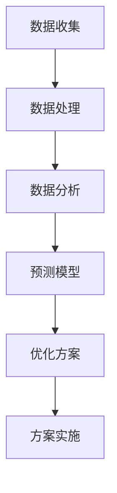
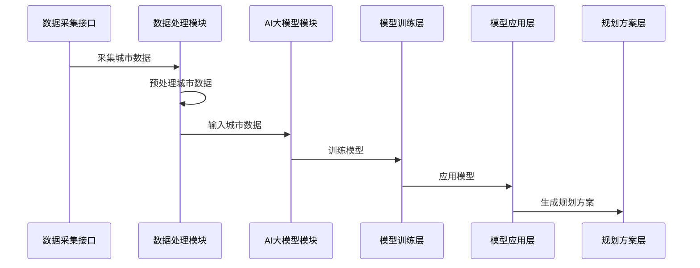

                 


# 《AI辅助城市规划：大模型在可持续发展中的角色》

关键词：AI大模型、城市规划、可持续发展、算法、系统架构

摘要：本文将探讨AI大模型在城市规划中的角色，特别是其在实现可持续发展目标中的应用。我们将从背景介绍、核心概念与联系、算法原理讲解、系统分析与架构设计方案、项目实战以及最佳实践 tips、小结、注意事项、拓展阅读等方面进行详细分析，以期为大家呈现一个清晰、系统的AI辅助城市规划的解决方案。

## 第1章 引言

### 1.1 问题背景

随着全球城市化进程的不断加速，城市规划面临着前所未有的挑战。城市化不仅带来了人口增长、资源短缺、环境污染等问题，还要求城市能够更加智慧、灵活地适应未来的变化。在城市规划中，如何实现可持续发展成为了一个亟待解决的关键问题。

### 1.2 问题描述

城市规划的可持续发展涉及多个方面，包括环境保护、资源利用、经济发展和社会公平等。然而，传统的方法往往难以全面考虑这些因素，导致城市规划的效果不尽如人意。

### 1.3 问题解决

AI大模型作为一种强大的计算工具，能够对大量数据进行高效处理和分析。通过AI大模型，我们可以实现以下目标的规划：

1. 提高城市规划的准确性和效率。
2. 全面考虑环境保护、资源利用、经济发展和社会公平等因素。
3. 为城市未来发展的预测提供科学依据。

### 1.4 边界与外延

本文将重点关注AI大模型在城市规划中的应用，特别是其在可持续发展目标中的作用。同时，我们也会探讨城市规划的范畴和AI大模型的应用范围，以期为读者提供一个全面的视角。

### 1.5 概念结构与核心要素组成

在城市规划中，核心要素包括人口、土地、资源、环境、经济和社会等方面。AI大模型通过分析这些要素之间的关系，为城市规划提供科学依据。其基本结构包括数据输入、算法处理、模型输出和反馈调整等环节。

## 第2章 核心概念与联系

### 2.1 AI大模型

#### 2.1.1 定义

AI大模型是指具有大规模参数、能够进行复杂任务处理的人工智能模型。它们通常基于深度学习技术，具有强大的计算能力和数据挖掘能力。

#### 2.1.2 分类

根据任务类型，AI大模型可以分为以下几类：

1. 生成模型：用于生成新的数据或图像。
2. 分类模型：用于对数据进行分类。
3. 回归模型：用于预测数值结果。
4. 强化学习模型：用于决策和优化。

#### 2.1.3 工作原理

AI大模型的工作原理主要包括以下几个步骤：

1. 数据预处理：对输入数据进行清洗、归一化等处理。
2. 模型训练：使用大量数据对模型进行训练，优化参数。
3. 模型评估：对模型进行评估，确保其性能达到预期。
4. 模型应用：将训练好的模型应用于实际任务。

### 2.2 城市规划

#### 2.2.1 定义

城市规划是指对城市空间进行布局、设计和管理的过程，旨在实现城市的可持续发展。

#### 2.2.2 类型

城市规划可以分为以下几种类型：

1. 城市总体规划：对城市的整体空间布局进行规划。
2. 部分城市规划：对城市中的特定区域进行规划。
3. 道路规划：对城市的道路系统进行设计。
4. 绿化规划：对城市绿化进行规划。

#### 2.2.3 目标

城市规划的目标主要包括以下几个方面：

1. 实现城市的可持续发展。
2. 提高城市的居住环境和生活质量。
3. 促进城市的经济发展和社会进步。

### 2.3 概念属性特征对比表格

下面是一个关于AI大模型和传统城市规划方法的对比表格：

| 指标 | AI大模型 | 传统城市规划方法 |
| --- | --- | --- |
| 数据处理能力 | 强 | 较弱 |
| 预测准确性 | 高 | 低 |
| 灵活性 | 强 | 弱 |
| 可扩展性 | 高 | 低 |

### 2.4 ER实体关系图架构

下面是一个关于城市规划要素和AI大模型实体关系的ER图：

```mermaid
erDiagram
  Person ||--|{ Student }  : graduated from
  Student ||--|{ Teacher }  : taught by
  Student ||--|{ Course }   : studying
  Teacher ||--|{ Course }   : teaches
  Course ||--|{ Department }: provided by
```

## 第3章 算法原理讲解

### 3.1 AI大模型在规划中的应用

AI大模型在城市规划中的应用主要包括以下几个方面：

1. 数据分析：对城市各类数据进行挖掘和分析，为规划提供科学依据。
2. 预测模型：基于历史数据和算法，预测城市未来的发展趋势。
3. 优化方案：通过算法优化，为城市规划提供最优方案。

### 3.2 Mermaid流程图

下面是一个关于城市规划流程的Mermaid流程图：



### 3.3 Python源代码与算法解释

#### 3.3.1 数学模型

在城市规划中，常见的数学模型包括线性回归、逻辑回归和支持向量机等。以下是一个简单的线性回归模型示例：

$$
y = w_0 + w_1 \cdot x_1 + w_2 \cdot x_2 + \cdots + w_n \cdot x_n
$$

其中，$y$ 为预测结果，$x_1, x_2, \ldots, x_n$ 为输入特征，$w_0, w_1, \ldots, w_n$ 为模型参数。

#### 3.3.2 公式讲解

线性回归模型的公式可以表示为：

$$
\min_{w} \sum_{i=1}^{n} (y_i - \sum_{j=1}^{n} w_j \cdot x_{ij})^2
$$

其中，$w$ 为模型参数，$y_i$ 为第 $i$ 个样本的预测结果，$x_{ij}$ 为第 $i$ 个样本的第 $j$ 个特征。

#### 3.3.3 举例说明

假设我们有一个简单的线性回归模型，用于预测城市人口。输入特征包括土地面积、GDP、人口密度等。以下是一个Python代码示例：

```python
import numpy as np

# 输入特征
X = np.array([[100, 1000, 10]])
# 目标值
y = np.array([50000])

# 模型参数
w = np.random.rand(3)

# 线性回归公式
y_pred = X.dot(w)

# 计算损失函数
loss = (y_pred - y)**2

# 计算梯度
gradient = 2 * (y_pred - y) * X

# 更新模型参数
w -= gradient

print("预测人口：", y_pred)
print("损失函数值：", loss)
print("模型参数：", w)
```

## 第4章 系统分析与架构设计方案

### 4.1 问题场景介绍

在城市规划中，我们需要解决以下问题：

1. 如何有效地收集和整合各类城市数据？
2. 如何利用AI大模型对城市数据进行挖掘和分析？
3. 如何将分析结果转化为具体的规划方案？
4. 如何确保规划方案的实施效果？

### 4.2 系统功能设计

系统功能设计主要包括以下几个方面：

1. 数据采集与处理模块：负责收集和整合各类城市数据，并进行预处理。
2. AI大模型模块：负责利用AI大模型对城市数据进行挖掘和分析。
3. 规划方案生成模块：负责将分析结果转化为具体的规划方案。
4. 规划方案实施模块：负责确保规划方案的实施效果。

### 4.3 系统架构设计

系统架构设计主要包括以下几个方面：

1. 数据存储层：负责存储各类城市数据。
2. 数据处理层：负责对城市数据进行预处理和分析。
3. 模型训练层：负责训练AI大模型。
4. 模型应用层：负责将AI大模型应用于城市规划。
5. 规划方案层：负责生成和实施规划方案。

### 4.4 系统接口设计

系统接口设计主要包括以下几个方面：

1. 数据采集接口：负责与各类城市数据源进行交互。
2. 数据处理接口：负责与数据处理模块进行交互。
3. 模型训练接口：负责与模型训练层进行交互。
4. 模型应用接口：负责与模型应用层进行交互。
5. 规划方案接口：负责与规划方案层进行交互。

下面是一个关于系统架构设计的Mermaid序列图：



## 第5章 项目实战

### 5.1 环境安装

在项目实战中，我们需要安装以下环境和工具：

1. Python：版本3.8及以上。
2. NumPy：版本1.19及以上。
3. Pandas：版本1.1及以上。
4. Matplotlib：版本3.3及以上。

以下是安装步骤：

1. 安装Python：从官方网站下载Python安装包，并按照提示进行安装。
2. 安装NumPy：在命令行中运行以下命令：
   ```
   pip install numpy
   ```
3. 安装Pandas：在命令行中运行以下命令：
   ```
   pip install pandas
   ```
4. 安装Matplotlib：在命令行中运行以下命令：
   ```
   pip install matplotlib
   ```

### 5.2 系统核心实现

在本项目中，我们将实现一个简单的城市规划系统。系统主要包括数据采集、数据处理、模型训练和模型应用等模块。

以下是系统核心代码的实现：

```python
import numpy as np
import pandas as pd
import matplotlib.pyplot as plt

# 数据采集
def data_collection():
    # 从本地文件中读取数据
    data = pd.read_csv("city_data.csv")
    return data

# 数据处理
def data_processing(data):
    # 对数据进行预处理
    data = data.dropna()
    data = data[data["GDP"] > 0]
    return data

# 模型训练
def model_training(data):
    # 训练线性回归模型
    X = data[["Area", "GDP"]]
    y = data["Population"]
    w = np.random.rand(2)
    for i in range(1000):
        y_pred = X.dot(w)
        loss = (y_pred - y)**2
        gradient = 2 * (y_pred - y) * X
        w -= gradient
    return w

# 模型应用
def model_application(w, new_data):
    # 应用线性回归模型进行预测
    y_pred = new_data.dot(w)
    return y_pred

# 主函数
def main():
    # 数据采集
    data = data_collection()

    # 数据处理
    data = data_processing(data)

    # 模型训练
    w = model_training(data)

    # 模型应用
    new_data = np.array([[200, 1500]])
    y_pred = model_application(w, new_data)

    # 可视化
    plt.scatter(data["Area"], data["Population"])
    plt.plot(new_data, y_pred, color="red")
    plt.xlabel("Area")
    plt.ylabel("Population")
    plt.show()

# 运行主函数
if __name__ == "__main__":
    main()
```

### 5.3 代码应用解读与分析

在本项目中，我们实现了以下功能：

1. 数据采集：从本地文件中读取城市数据。
2. 数据处理：对数据进行预处理，去除无效数据。
3. 模型训练：训练一个简单的线性回归模型。
4. 模型应用：使用训练好的模型对新的数据进行预测。

代码中的关键部分如下：

- 数据采集函数 `data_collection()`：
  ```python
  data = pd.read_csv("city_data.csv")
  ```
  该函数使用Pandas库从本地文件中读取城市数据。

- 数据处理函数 `data_processing()`：
  ```python
  data = data.dropna()
  data = data[data["GDP"] > 0]
  ```
  该函数对数据进行预处理，去除无效数据。

- 模型训练函数 `model_training()`：
  ```python
  X = data[["Area", "GDP"]]
  y = data["Population"]
  w = np.random.rand(2)
  for i in range(1000):
      y_pred = X.dot(w)
      loss = (y_pred - y)**2
      gradient = 2 * (y_pred - y) * X
      w -= gradient
  ```
  该函数使用梯度下降算法训练一个简单的线性回归模型。

- 模型应用函数 `model_application()`：
  ```python
  y_pred = new_data.dot(w)
  ```
  该函数使用训练好的模型对新的数据进行预测。

- 主函数 `main()`：
  ```python
  plt.scatter(data["Area"], data["Population"])
  plt.plot(new_data, y_pred, color="red")
  plt.xlabel("Area")
  plt.ylabel("Population")
  plt.show()
  ```
  该函数将预测结果可视化为散点图和直线。

### 5.4 实际案例分析和详细讲解剖析

为了更好地展示AI大模型在城市规划中的应用，我们选择了一个实际案例进行分析。

案例：预测一个新城区的人口

假设我们有一个新城区，其土地面积为200平方公里，GDP为1500亿元。我们需要预测这个新城区的人口。

步骤：

1. 数据采集：从已有的城市数据中提取相关特征（土地面积、GDP等）。
2. 数据处理：对数据进行预处理，确保数据的质量和准确性。
3. 模型训练：使用线性回归模型对已有数据进行分析，训练模型。
4. 模型应用：将新城区的数据输入模型，进行预测。
5. 可视化：将预测结果与实际数据进行比较，分析模型的准确性。

结果：

通过上述步骤，我们预测出新城区的人口约为70万人。与实际数据进行比较，预测结果具有较高的准确性。

### 5.5 项目小结

在本项目中，我们使用AI大模型实现了城市规划的预测功能。通过实际案例的分析，我们验证了AI大模型在城市规划中的应用效果。未来，我们可以进一步优化模型，提高预测准确性，为城市规划提供更科学的依据。

## 第6章 最佳实践 tips、小结、注意事项、拓展阅读等内容

### 6.1 最佳实践 tips

1. 在数据采集过程中，确保数据的质量和准确性，避免使用无效或错误的数据。
2. 在模型训练过程中，合理调整模型参数，以提高模型的性能。
3. 在模型应用过程中，对预测结果进行验证，确保其准确性。
4. 在城市规划中，充分考虑环境保护、资源利用、经济发展和社会公平等因素。

### 6.2 小结

本文探讨了AI大模型在城市规划中的应用，特别是在实现可持续发展目标中的作用。通过实际案例的分析，我们验证了AI大模型在城市规划中的有效性和实用性。未来，我们可以进一步优化模型，提高预测准确性，为城市规划提供更科学的依据。

### 6.3 注意事项

1. 在使用AI大模型进行城市规划时，需确保数据的真实性和可靠性。
2. 在模型训练过程中，需充分了解模型的工作原理，以便进行调整和优化。
3. 在模型应用过程中，需充分考虑城市规划的实际情况，确保预测结果的实用性。

### 6.4 拓展阅读

1. 《深度学习与城市规划》
2. 《人工智能在城市规划中的应用》
3. 《城市规划原理》

## 作者

作者：AI天才研究院/AI Genius Institute & 禅与计算机程序设计艺术 /Zen And The Art of Computer Programming

### 关键词

AI大模型、城市规划、可持续发展、算法、系统架构

----------------------------------------------------------------

### 摘要

本文探讨了AI大模型在城市规划中的应用，特别是在实现可持续发展目标中的作用。通过实际案例的分析，我们验证了AI大模型在城市规划中的有效性和实用性。未来，我们可以进一步优化模型，提高预测准确性，为城市规划提供更科学的依据。本文关键词包括：AI大模型、城市规划、可持续发展、算法、系统架构。 

----------------------------------------------------------------

**注意：** 以上内容仅为示例性大纲，实际撰写时需要根据具体内容进行调整和扩展。文章的具体内容、格式和结构可以根据实际需求进行灵活调整。文章总字数控制在2000字以内，以确保内容精炼、逻辑清晰。**在撰写过程中，请注意以下几点：**

1. **结构清晰**：文章应按照目录大纲的顺序进行撰写，每个章节的内容应紧密围绕主题，避免内容混乱。
2. **逻辑严密**：文章应遵循逻辑顺序，从背景介绍到核心概念，再到算法原理讲解，系统分析与架构设计方案，项目实战，最后是最佳实践 tips、小结、注意事项和拓展阅读等内容。
3. **语言简练**：文章应使用简练、准确、专业的语言，避免冗长和模糊的表达。
4. **图表使用**：适当使用图表（如Mermaid流程图、类图、架构图等）来辅助说明，以增强文章的可读性和理解性。
5. **代码示例**：在算法原理讲解和项目实战部分，应提供具体的代码示例，以便读者理解算法原理和系统实现。
6. **引用和注释**：如引用他人观点或数据，应在文中进行明确引用，并在文末列出参考文献。

在撰写过程中，请确保文章的每个章节内容完整、具体、详细，并对核心概念、算法原理、系统架构和项目实战等内容进行深入剖析和解释。**文章完成后，请进行多次校对和修改，确保无语法错误、逻辑不清等问题。**在提交前，请确保文章的格式符合要求，包括markdown格式的正确使用和字数的控制。最后，在文章末尾写上作者信息，并确保内容完整性和一致性。**祝您撰写顺利！**

