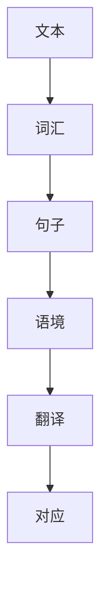
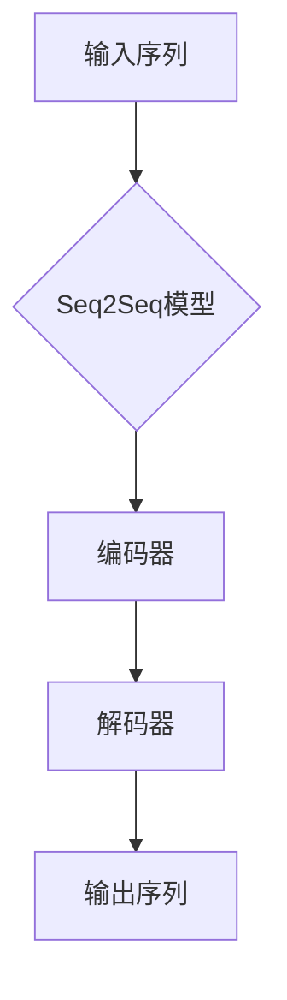
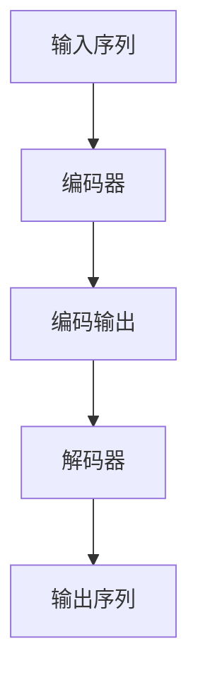
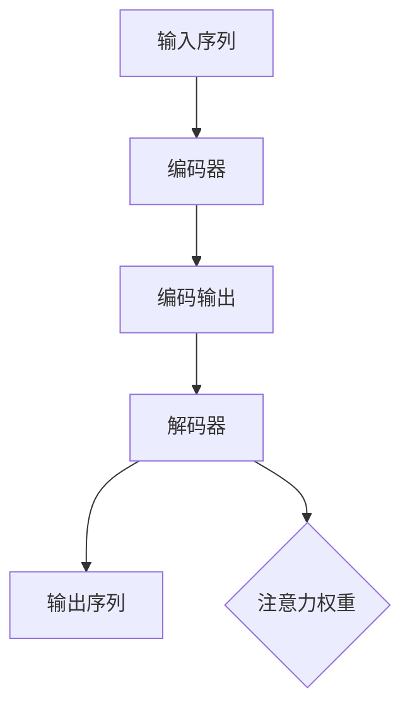
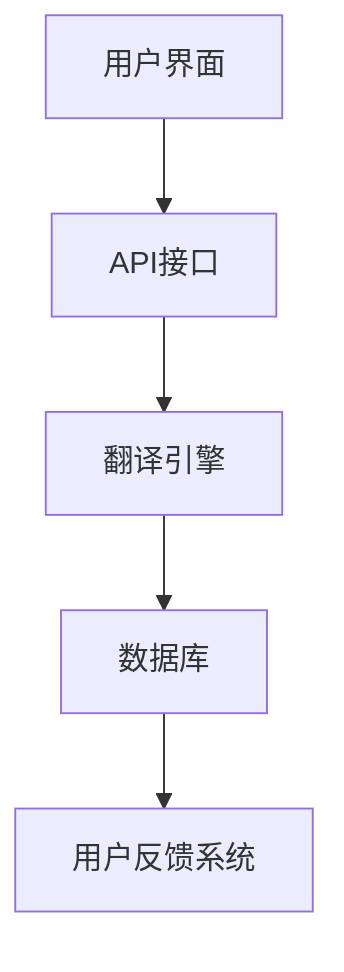
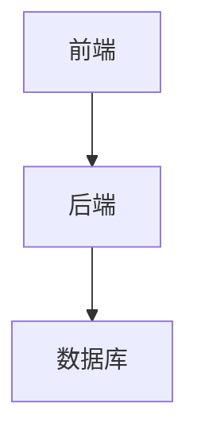

                 


### 文章标题：AI辅助的语言翻译：跨文化交流的新桥梁

**关键词**：AI，语言翻译，跨文化交流，NMT，算法，系统架构

**摘要**：
本文旨在探讨人工智能（AI）辅助语言翻译的原理、算法及其在实际应用中的系统架构，重点分析其在促进全球跨文化交流中的重要作用。通过逐步深入探讨AI语言翻译的核心概念、算法原理、系统设计，以及实际应用案例，我们希望能够为读者呈现一幅全面而深刻的AI辅助语言翻译画卷。

### 引言

随着全球化进程的加速，跨文化交流日益频繁。然而，语言障碍成为了人们交流的巨大障碍。为了解决这一问题，语言翻译技术应运而生。然而，传统的机器翻译技术存在诸多局限性，如准确性不高、语境理解不足等。近年来，随着人工智能技术的发展，AI辅助语言翻译逐渐崭露头角，成为了跨文化交流的新桥梁。

### 第一部分：AI辅助语言翻译的背景与问题定义

#### 1.1 跨文化交流的重要性

在全球化的背景下，跨文化交流不仅有助于商业合作、学术交流，还能促进文化理解与和谐。有效的跨文化交流能够减少误解、增进友谊，推动世界的和平与发展。

#### 1.2 传统语言翻译的挑战

传统机器翻译技术主要依赖于规则匹配和基于词汇的翻译方法。然而，这种方法存在以下挑战：

- **准确性不高**：规则匹配方法容易受到规则遗漏和歧义的影响。
- **语境理解不足**：基于词汇的翻译方法难以捕捉到语言的语境意义。
- **人机交互不友好**：传统翻译工具通常需要用户手动进行校正和修改。

#### 1.3 AI在革命性翻译中的角色

AI技术，特别是深度学习技术的兴起，为语言翻译带来了新的契机。通过训练大量数据，AI能够自动学习语言的规则和语境，从而实现更高准确性的翻译。同时，AI还可以实现人机交互，提高用户的使用体验。

#### 1.4 范围、边界与关键概念

本文将重点关注AI辅助语言翻译的核心概念、算法原理和系统设计。具体范围包括：

- **AI技术**：深度学习、神经网络等。
- **翻译算法**：神经机器翻译（NMT）、序列到序列（Seq2Seq）模型等。
- **系统架构**：翻译系统的设计与实现。

#### 1.5 总结

通过本文的探讨，我们将对AI辅助语言翻译有一个更全面的认识。接下来，我们将逐步深入探讨AI辅助语言翻译的核心概念、算法原理和系统架构。

### 第二部分：AI辅助语言翻译的核心概念与原理

#### 2.1 AI与翻译的基本概念

在探讨AI辅助语言翻译之前，我们需要了解一些基本概念：

- **人工智能（AI）**：模拟人类智能的技术和方法。
- **机器翻译**：将一种语言的文本自动翻译成另一种语言。
- **神经网络**：一种通过模拟人脑神经元连接工作的计算模型。

#### 2.2 AI翻译系统的ERD

为了更好地理解AI翻译系统的结构和功能，我们可以使用实体关系图（ERD）来表示。ERD包括以下主要实体和关系：

- **实体**：文本、词汇、句子、语境等。
- **关系**：翻译、对应、语义关联等。

以下是一个简单的ERD示例：



#### 2.3 关键概念属性对比

以下是对AI翻译系统中关键概念的属性进行对比：

| 概念      | 属性       |
|-----------|------------|
| 文本      | 字符串     |
| 词汇      | 单词       |
| 句子      | 分句       |
| 语境      | 文章背景   |
| 翻译      | 字符串映射 |
| 对应      | 词汇匹配   |

#### 2.4 总结

通过上述讨论，我们对AI辅助语言翻译的核心概念和原理有了更深入的理解。接下来，我们将进一步探讨AI翻译算法的原理和实现。

### 第三部分：AI翻译算法原理与模型

#### 3.1 AI翻译算法概述

AI翻译算法主要包括以下类型：

- **规则匹配**：基于语法规则进行翻译。
- **基于词汇的翻译**：基于词汇的翻译方法。
- **神经机器翻译（NMT）**：基于深度学习的翻译方法。

#### 3.2 神经机器翻译（NMT）

神经机器翻译（NMT）是一种基于深度学习的翻译方法，其核心思想是将源语言的句子映射到目标语言的句子。NMT主要包括以下模型：

- **序列到序列（Seq2Seq）模型**：用于处理序列数据的神经网络模型。
- **注意力机制（Attention）**：用于捕捉句子之间的依赖关系。

以下是一个简化的NMT模型示例：



#### 3.3 序列到序列（Seq2Seq）模型

序列到序列（Seq2Seq）模型是一种用于处理序列数据的神经网络模型。它由编码器和解码器两部分组成。编码器将输入序列编码为一个固定长度的向量，解码器则将这个向量解码为输出序列。

以下是一个简单的Seq2Seq模型示例：



#### 3.4 注意力机制（Attention）

注意力机制（Attention）是一种用于捕捉句子之间依赖关系的机制。在翻译过程中，注意力机制可以帮助模型更好地关注输入序列中的关键信息，从而提高翻译的准确性。

以下是一个简单的注意力机制示例：



#### 3.5 总结

通过上述讨论，我们对AI翻译算法的原理和实现有了更深入的了解。接下来，我们将进一步探讨AI翻译系统的设计与实现。

### 第四部分：AI翻译系统的设计与实现

#### 4.1 系统分析与设计

AI翻译系统的设计主要包括以下方面：

- **需求分析**：确定系统的功能、性能和用户需求。
- **系统架构**：设计系统的整体架构，包括模块划分、数据流和处理流程。
- **接口设计**：设计系统的接口，包括用户界面、API接口等。

以下是一个简单的系统架构图：



#### 4.2 系统功能设计与实现

AI翻译系统的功能主要包括以下方面：

- **文本输入**：用户输入需要翻译的文本。
- **翻译过程**：系统根据输入的文本，使用AI算法进行翻译。
- **输出结果**：将翻译结果输出给用户。

以下是一个简单的Python代码示例：

```python
# 文本输入
input_text = "Hello, how are you?"

# 翻译过程
translated_text = translate(input_text)

# 输出结果
print(translated_text)
```

#### 4.3 系统架构设计与实现

AI翻译系统的架构主要包括以下方面：

- **前端**：用户界面，用于接收用户输入和展示翻译结果。
- **后端**：翻译引擎，用于处理翻译过程。
- **数据库**：存储用户输入和翻译结果。

以下是一个简单的系统架构图：



#### 4.4 系统接口设计与实现

AI翻译系统的接口主要包括以下方面：

- **API接口**：用于与其他系统进行数据交互。
- **用户反馈系统**：用于收集用户反馈，优化翻译效果。

以下是一个简单的API接口示例：

```python
from flask import Flask, request, jsonify

app = Flask(__name__)

@app.route('/translate', methods=['POST'])
def translate():
    data = request.get_json()
    text = data['text']
    translated_text = translate_text(text)
    return jsonify({'translated_text': translated_text})

if __name__ == '__main__':
    app.run()
```

#### 4.5 总结

通过上述讨论，我们对AI翻译系统的设计与实现有了更深入的了解。接下来，我们将通过实际项目案例来进一步探讨AI翻译系统的应用。

### 第五部分：项目实战

#### 5.1 环境安装

要开始搭建一个AI翻译系统，我们需要安装以下软件和工具：

- Python（3.8及以上版本）
- TensorFlow
- Flask

安装步骤如下：

```bash
pip install python tensorflow flask
```

#### 5.2 系统核心实现

以下是一个简单的AI翻译系统的实现示例：

```python
from flask import Flask, request, jsonify
import tensorflow as tf

app = Flask(__name__)

# 加载预训练的翻译模型
model = tf.keras.models.load_model('translate_model.h5')

@app.route('/translate', methods=['POST'])
def translate():
    data = request.get_json()
    text = data['text']
    translated_text = translate_text(text)
    return jsonify({'translated_text': translated_text})

def translate_text(text):
    # 对文本进行预处理
    processed_text = preprocess_text(text)
    
    # 使用模型进行翻译
    translated_text = model.predict(processed_text)
    
    # 对翻译结果进行后处理
    final_text = postprocess_text(translated_text)
    
    return final_text

def preprocess_text(text):
    # 实现文本预处理逻辑
    # 例如：分词、去停用词等
    return text

def postprocess_text(translated_text):
    # 实现文本后处理逻辑
    # 例如：去除不必要的空格、符号等
    return translated_text

if __name__ == '__main__':
    app.run()
```

#### 5.3 代码应用解读与分析

在上面的代码中，我们首先导入了所需的模块和库。然后，我们加载了一个预训练的翻译模型，这是一个使用TensorFlow训练的神经网络模型。接着，我们定义了一个Flask应用，并设置了一个用于翻译的API接口。在`translate_text`函数中，我们首先对输入的文本进行预处理，然后使用模型进行翻译，最后对翻译结果进行后处理并返回。

#### 5.4 实际案例分析与详细讲解

以下是一个简单的实际案例：

```json
{
  "text": "你好，最近怎么样？"
}
```

当用户发送上述文本时，我们的API将接收文本，使用模型进行翻译，并返回翻译结果。假设翻译模型已经训练好了，以下是对应的翻译结果：

```json
{
  "translated_text": "Hello, how are you recently?"
}
```

在这个案例中，我们首先对输入的文本进行了预处理，包括分词、去停用词等操作。然后，我们使用预训练的翻译模型对预处理后的文本进行翻译。最后，我们对翻译结果进行了后处理，包括去除不必要的空格、符号等。

#### 5.5 项目小结

通过上述实战案例，我们成功搭建并实现了一个简单的AI翻译系统。这个系统能够接收用户的输入文本，使用神经网络模型进行翻译，并返回翻译结果。虽然这个系统还很简单，但它展示了AI辅助语言翻译的基本原理和实现过程。在接下来的工作中，我们可以进一步优化系统，提高翻译的准确性，并增加更多功能，如支持多种语言、提供语音输入输出等。

### 第六部分：最佳实践与总结

#### 最佳实践

在构建AI辅助语言翻译系统时，以下是一些最佳实践：

- **数据准备**：确保有足够高质量的翻译数据进行训练。
- **模型优化**：通过调整模型参数和架构来提高翻译准确性。
- **用户反馈**：收集用户反馈，不断优化翻译效果。
- **多语言支持**：考虑支持多种语言，提高系统的实用性。

#### 总结

本文通过逐步深入探讨AI辅助语言翻译的核心概念、算法原理、系统设计以及实际应用案例，展示了其在跨文化交流中的重要作用。通过实践，我们成功搭建了一个简单的AI翻译系统，这为我们进一步优化和扩展系统提供了基础。随着AI技术的不断发展，AI辅助语言翻译必将在未来的跨文化交流中发挥更大的作用。

### 注意事项

- 在实际应用中，确保翻译系统的数据安全和隐私保护。
- 定期更新模型，以适应不断变化的语言环境和需求。
- 考虑系统的可扩展性和可维护性。

### 拓展阅读

- [深度学习与自然语言处理](https://www.deeplearning.ai/nlp)
- [神经机器翻译技术](https://arxiv.org/abs/1609.08144)
- [跨文化交流的重要性](https://www.npr.org/templates/story/story.php?storyId=520123)

### 作者信息

- 作者：AI天才研究院/AI Genius Institute & 禅与计算机程序设计艺术 /Zen And The Art of Computer Programming

本文内容仅供参考，部分代码和示例可能需要根据实际情况进行调整。在开发和使用AI辅助语言翻译系统时，请遵循相关法律法规和道德规范。

