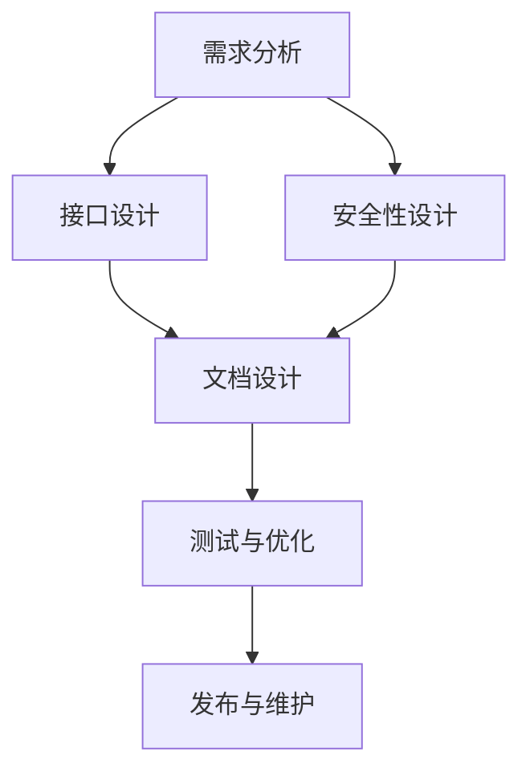

                 

### 篇章结构与核心要点概述

#### 引言

在现代软件开发中，API（应用程序编程接口）设计是至关重要的环节。尤其是在人工智能（AI）服务领域，API的设计不仅影响开发效率，还直接影响用户体验和业务扩展。因此，理解并遵循API设计原则对于构建灵活可扩展的AI服务至关重要。《API设计原则：构建灵活可扩展的AI服务》旨在通过系统化的方法，帮助开发者和架构师掌握API设计的核心原则，并应用于AI服务的实际开发中。

本文将从以下几个方面展开讨论：

1. **API设计基础**：介绍API的基本概念、设计目标和基本原则，包括简洁性、一致性和可理解性。
2. **API设计过程**：详细描述需求分析、接口设计和文档设计等步骤，强调每个环节的关键点。
3. **API安全性设计**：探讨身份认证、授权和安全性最佳实践，确保API服务的安全性。
4. **AI服务的API设计**：分析AI服务类型、特点以及设计最佳实践，涵盖可扩展性和灵活性。
5. **案例分析**：通过具体案例，展示API设计原则在实际项目中的应用。
6. **总结与展望**：总结核心要点，展望未来趋势，并提出持续改进的建议。

### 目录与结构安排

以下是本文的结构安排和目录：

#### 第一部分: API设计基础

##### 第1章: API设计概述
- **API定义与重要性**
- **API设计目标**
- **API设计基本原则**

##### 第2章: API设计过程
- **需求分析**
- **API接口设计**
- **API文档设计**

##### 第3章: API安全性设计
- **身份认证**
- **授权**
- **安全性最佳实践**

#### 第二部分: AI服务的API设计

##### 第4章: AI服务概述
- **AI服务类型**
- **AI服务特点**

##### 第5章: AI服务API设计最佳实践
- **设计可扩展的API**
- **设计灵活的API**
- **设计可测试的API**

##### 第6章: AI服务API设计案例分析
- **案例一：天气预测API**
- **案例二：图像识别API**
- **案例三：智能客服API**

##### 第7章: 总结与展望
- **总结核心要点**
- **展望未来趋势**
- **持续改进建议**

#### 引言：API设计的重要性

API设计在软件架构中扮演着核心角色，它是不同系统和服务之间交互的桥梁。一个优秀的API设计不仅能够提高开发效率，还能提升用户体验和业务灵活性。在现代软件工程中，API设计的原则包括简洁性、一致性和可理解性。这些原则在构建AI服务时尤为重要，因为AI服务的复杂性要求API不仅要易于使用，还要能够适应未来的变化。

让我们一步步深入探讨API设计的基础，理解设计目标，掌握基本原则，并逐步构建灵活可扩展的AI服务。

### 关键词

- **API设计**
- **AI服务**
- **灵活性**
- **可扩展性**
- **安全性**
- **身份认证**
- **授权**
- **最佳实践**

### 摘要

本文深入探讨了API设计在构建灵活可扩展的AI服务中的重要性。通过详细阐述API设计的基础知识，包括基本概念、设计目标和基本原则，本文为开发者提供了系统化的API设计方法论。随后，文章探讨了API设计过程，从需求分析到接口设计和文档设计，强调了每个环节的关键点。此外，文章还深入分析了API安全性设计，包括身份认证、授权和最佳实践，以确保服务的安全性。在AI服务的API设计部分，文章提出了设计最佳实践，包括可扩展性和灵活性的实现方法。通过三个实际案例，本文展示了API设计原则在项目中的应用。最后，文章总结了核心要点，展望了未来趋势，并提出了持续改进的建议。阅读本文，开发者将能够更好地理解和实践API设计，从而构建高质量的AI服务。

## 第一部分: API设计基础

### 第1章: API设计概述

API设计是现代软件架构的重要组成部分，它定义了不同系统和服务之间的交互方式。一个良好的API设计不仅能够提高开发效率，还能提升用户体验和业务灵活性。本章将介绍API设计的基本概念、设计目标和基本原则，帮助读者建立坚实的API设计基础。

#### 1.1 API定义与重要性

**API定义**：API（应用程序编程接口）是一套预定义的规则和协议，用于允许不同软件应用程序之间进行交互。API通常由一组函数、对象和方法组成，允许开发者通过调用这些函数和对象来访问特定的功能或服务。

**API重要性**：在软件开发的各个阶段，API扮演着关键角色。首先，API是系统间通信的桥梁，它使得不同组件和服务能够无缝集成，提高开发效率和系统的灵活性。其次，良好的API设计能够简化用户使用，提升用户体验。此外，API设计还直接影响业务扩展能力，一个灵活可扩展的API可以为未来的业务需求提供支持。

#### 1.2 API设计的目标

API设计的主要目标是确保API的灵活性、可扩展性和安全性。以下是一些具体的API设计目标：

**灵活性**：灵活性是指API能够适应不同场景和需求变化的能力。一个灵活的API能够轻松地调整参数和功能，以满足不同用户的需求。

**可扩展性**：可扩展性是指API能够随着业务增长和需求变化而扩展。这包括能够添加新功能、处理更大规模的数据和用户请求。

**安全性**：安全性是API设计的关键目标之一。确保API免受攻击、保护用户数据和安全凭证是每个API设计者的责任。

#### 1.3 API设计的基本原则

为了实现上述目标，API设计需要遵循一些基本原则。以下是几个关键原则：

**简洁性**：简洁性是API设计的重要原则之一。一个简单的API易于理解和使用，减少学习成本和出错可能性。简洁性可以通过限制API的复杂性、避免过多的功能重叠和设计冗余来实现。

**一致性**：一致性确保API的命名、参数和返回值遵循一致的命名约定和风格。这有助于减少混淆和提高开发效率。

**可理解性**：可理解性是指API设计要直观、易于理解。通过提供清晰的文档和示例，可以帮助开发者快速上手并正确使用API。

#### 1.4 API设计方法

API设计不仅仅是技术问题，它还涉及到用户体验和业务需求。以下是一些常见的API设计方法：

**需求分析**：在开始设计之前，了解用户需求是至关重要的。这包括分析用户的使用场景、需求和痛点，以确保API能够满足实际业务需求。

**接口设计**：接口设计是API设计的关键环节。这包括定义API的功能、数据结构和参数，确保API能够高效地完成预期任务。

**文档设计**：良好的API文档是API成功的关键。它应该提供详细的描述、示例和错误处理指南，帮助开发者快速掌握API的使用方法。

**迭代优化**：API设计是一个迭代过程。在开发过程中，通过收集用户反馈和监控API性能，持续优化API设计，确保其持续满足用户需求。

#### 1.5 本章总结

本章介绍了API设计的基本概念、设计目标和基本原则，并讨论了API设计的方法。通过理解这些内容，读者将能够更好地把握API设计的核心要素，为后续章节的学习打下坚实基础。

在下一章中，我们将深入探讨API设计的过程，从需求分析到接口设计和文档设计，帮助读者系统地理解API设计的全过程。

## 第2章: API设计过程

### 2.1 需求分析

在API设计过程中，需求分析是至关重要的第一步。它是确保API能够满足实际业务需求的基础。需求分析不仅涉及到功能需求，还包括非功能需求，如性能、安全性和可靠性。以下是需求分析的具体步骤和关键点：

#### 2.1.1 用户需求分析

**步骤1：收集用户需求**

收集用户需求是需求分析的第一步。这可以通过与利益相关者（如产品经理、业务分析师、最终用户）进行访谈、问卷调查和市场调研来实现。目标是了解用户使用API的场景、痛点和他们期望的功能。

**步骤2：分类和优先级排序**

收集到用户需求后，需要对需求进行分类和优先级排序。这有助于确定哪些需求是核心功能，哪些是次要功能。通常，优先级可以根据需求的紧急性、重要性和可行性来评估。

**步骤3：构建用户故事**

用户故事是一种简化的需求描述方法，它通过场景来阐述用户的需求。每个用户故事应该包含以下要素：角色、目标、任务和结果。例如：“作为用户A，我需要查看我的订单历史，以便了解我的购买记录。”

#### 2.1.2 业务需求分析

**步骤1：理解业务目标**

业务需求分析的关键是理解业务目标。这包括分析公司的战略目标、产品路线图和市场定位。了解业务目标有助于确保API设计符合公司整体战略和长期发展。

**步骤2：业务流程映射**

业务流程映射是另一种有效的方法，用于理解业务需求。通过绘制业务流程图，可以明确API需要支持的流程步骤和关键决策点。

**步骤3：确定API功能**

在理解业务目标和流程后，可以确定API需要支持的功能。这包括API需要提供的操作、返回的数据和可能的状态。

#### 2.1.3 需求文档

**步骤1：编写需求文档**

需求文档是需求分析的结果，它详细记录了用户需求和业务需求。一个完整的需求文档应包含以下内容：

- **概述**：简要介绍API的目标和用途。
- **功能需求**：详细描述API需要提供的功能和操作。
- **非功能需求**：描述API的性能、安全性和可靠性要求。
- **用户故事**：提供具体的用户故事示例。
- **业务流程图**：展示API支持的流程步骤。

**步骤2：需求评审**

在编写需求文档后，需要进行评审。评审的目的是确保需求文档的准确性和完整性，通常由利益相关者参与。评审过程中，可能需要对需求进行修改或补充。

#### 2.1.4 需求验证

**步骤1：测试计划**

在需求验证过程中，需要制定测试计划。测试计划应包括测试目标、测试方法、测试用例和测试环境。测试目标是确保API能够按照需求文档中的要求正常运行。

**步骤2：测试执行**

在测试执行阶段，根据测试计划执行各种测试用例。这包括功能测试、性能测试和安全测试等。

**步骤3：结果分析**

在测试执行完成后，需要对测试结果进行分析。如果发现任何问题或不符合需求的情况，应返回需求文档和设计文档进行修改。

#### 2.1.5 需求管理

**步骤1：需求变更管理**

在开发过程中，需求可能会发生变化。需求变更管理是确保需求变更得到有效控制和管理的过程。通常，需求变更需要经过评估、批准和文档更新。

**步骤2：需求跟踪**

需求跟踪是确保需求在整个开发周期内得到有效管理的工具。通过跟踪需求状态和变更历史，可以更好地控制需求的实现和交付。

#### 2.2 API接口设计

**步骤1：功能设计**

功能设计是API接口设计的第一步，目标是确定API提供的功能。这可以通过分析需求文档和用户故事来实现。

**步骤2：数据设计**

数据设计是定义API处理的数据结构和数据流动的过程。这包括确定数据类型、字段和关系。

**步骤3：接口规范**

接口规范是详细描述API接口的文档。它通常包括接口名称、URL、请求参数、响应数据和错误处理等内容。

**步骤4：接口验证**

接口验证是确保API接口符合设计和规范的过程。通常，这包括接口功能测试、性能测试和兼容性测试等。

#### 2.3 API文档设计

**步骤1：文档编写**

API文档是开发者使用API的重要指南。文档应包括接口规范、示例代码、错误处理和版本信息等。

**步骤2：文档评审**

在编写文档后，需要进行评审。评审的目的是确保文档的准确性和完整性，通常由利益相关者参与。

**步骤3：文档发布**

文档发布是将文档发布到文档仓库或网站，供开发者使用。文档发布通常包括版本管理和更新历史等。

#### 2.4 本章总结

本章详细介绍了API设计过程中的需求分析和接口设计。通过理解用户需求、业务需求和编写需求文档，开发者可以确保API设计满足实际需求。接口设计则需要关注功能设计、数据设计和接口规范。良好的需求分析和接口设计是构建高质量API的基础，为后续的文档设计和API开发提供了明确的方向。

在下一章中，我们将探讨API安全性设计，确保API在面临各种安全威胁时能够保持安全。

### 第3章: API安全性设计

API设计不仅仅是功能性的，安全性同样至关重要。一个不安全的API可能会遭受各种攻击，导致数据泄露、服务中断和业务损失。本章将探讨API安全性设计的关键要素，包括身份认证、授权和安全最佳实践。

#### 3.1 身份认证

身份认证是确保只有授权用户能够访问API的第一步。以下是一些常见的身份认证机制：

**基本认证**：基本认证是一种简单的身份认证方法，通过用户名和密码进行认证。然而，由于其传输过程不加密，因此存在安全风险。

```python
from flask import Flask, request

app = Flask(__name__)

@app.route('/api/protected', methods=['GET'])
def protected_resource():
    auth = request.authorization
    if auth and check_password_hash(auth.password):
        return "Access granted to protected resource"
    return "Authentication required", 401

def check_password_hash(password):
    # 验证密码的哈希值
    return True  # 示例代码，实际应使用真正的密码验证机制

if __name__ == '__main__':
    app.run()
```

**令牌认证**：令牌认证（如JWT、OAuth 2.0）是一种更安全的认证方法。它通过生成令牌来验证用户身份，令牌通常包含用户信息和加密签名。

```python
from flask import Flask, request, jsonify
import jwt
import datetime

app = Flask(__name__)
app.config['SECRET_KEY'] = 'your_secret_key'

@app.route('/api/login', methods=['POST'])
def login():
    auth = request.json
    if auth and validate_credentials(auth['username'], auth['password']):
        token = jwt.encode({
            'username': auth['username'],
            'exp': datetime.datetime.utcnow() + datetime.timedelta(hours=24)
        }, app.config['SECRET_KEY'])
        return jsonify({'token': token})
    return jsonify({'error': 'Invalid credentials'}), 401

def validate_credentials(username, password):
    # 验证用户名和密码
    return True  # 示例代码，实际应使用真正的验证机制

@app.route('/api/protected', methods=['GET'])
def protected_resource():
    token = request.headers.get('Authorization')
    if token:
        try:
            jwt.decode(token, app.config['SECRET_KEY'], algorithms=['HS256'])
            return "Access granted to protected resource"
        except jwt.ExpiredSignatureError:
            return jsonify({'error': 'Token expired'}), 401
        except jwt.InvalidTokenError:
            return jsonify({'error': 'Invalid token'}), 401
    return "Authentication required", 401

if __name__ == '__main__':
    app.run()
```

#### 3.2 授权

授权是确保用户只能访问他们被允许访问的资源的过程。以下是一些常见的授权机制：

**OAuth 2.0**：OAuth 2.0是一种开放标准授权协议，允许第三方应用程序访问用户资源，而无需泄露用户密码。

```python
from flask import Flask, request, jsonify
from flask_oauthlib.client import OAuth

app = Flask(__name__)
oauth = OAuth(app)

@app.route('/api/login', methods=['GET'])
def login():
    request_url = 'https://provider.com/oauth2/authorize?response_type=code&client_id=your_client_id&redirect_uri=http://localhost:5000/callback'
    return redirect(request_url)

@app.route('/callback', methods=['GET'])
def callback():
    code = request.args.get('code')
    token = oauth.remote_app('provider.com', code=code)
    access_token = token.token['access_token']
    # 使用access_token进行后续操作，如获取用户信息
    return jsonify({'access_token': access_token})

@app.route('/api/protected', methods=['GET'])
def protected_resource():
    access_token = request.headers.get('Authorization')
    if access_token:
        # 使用access_token进行验证和获取用户权限
        return "Access granted to protected resource"
    return "Authorization required", 401

if __name__ == '__main__':
    app.run()
```

**角色和权限**：在大型系统中，角色和权限是管理用户访问的重要机制。可以通过定义不同角色（如管理员、普通用户）和权限（如查看、修改、删除）来实现精细的访问控制。

```python
@app.route('/api/resource', methods=['GET'])
def resource():
    user_role = get_user_role()  # 从用户信息中获取角色
    if user_role == 'admin':
        return jsonify({'resource': 'Admin data'})
    elif user_role == 'user':
        return jsonify({'resource': 'User data'})
    else:
        return jsonify({'error': 'Insufficient permissions'}), 403

def get_user_role():
    # 从用户信息中获取角色
    return 'user'  # 示例代码，实际应从数据库或认证服务获取
```

#### 3.3 安全性最佳实践

**数据加密**：确保所有敏感数据在传输和存储过程中都进行加密。常用的加密协议包括HTTPS、SSL/TLS和AES等。

**保护API免受攻击**：防范常见攻击，如SQL注入、跨站脚本攻击（XSS）和跨站请求伪造（CSRF）。以下是一些常见的安全措施：

- **输入验证**：对用户输入进行严格验证，确保输入符合预期格式。
- **使用参数化查询**：避免直接拼接SQL查询，使用参数化查询可以防止SQL注入。
- **内容安全策略（CSP）**：通过设置CSP，可以限制网站可以加载的资源和执行脚本，从而防止XSS攻击。
- **验证CSRF令牌**：在敏感操作（如修改密码、支付）中，使用CSRF令牌验证请求的合法性。

**日志和监控**：记录API请求和错误日志，并设置监控工具，以便及时发现问题并采取应对措施。

#### 3.4 本章总结

API安全性设计是确保API服务安全运行的关键环节。通过正确的身份认证、授权机制和安全最佳实践，可以有效地保护API免受各种攻击。本章介绍了基本认证、令牌认证、OAuth 2.0授权机制以及安全性最佳实践，帮助开发者构建安全可靠的API服务。

在下一章中，我们将探讨AI服务的API设计，分析AI服务的特性和设计最佳实践。

### 第4章: AI服务概述

#### 4.1 AI服务类型

在人工智能（AI）领域，AI服务涵盖了多种类型，每种服务都有其独特的功能和应用场景。以下是几种常见的AI服务类型：

**1. 机器学习模型API**：这些API允许开发者访问预训练的机器学习模型，如分类、回归、聚类和图像识别模型。例如，Google Cloud的机器学习API允许用户通过简单的HTTP请求调用预训练的模型。

**2. 自然语言处理（NLP）API**：NLP API提供文本分析、语言翻译、情感分析等功能。这些API广泛应用于聊天机器人、内容审核和智能搜索。如Google Cloud的自然语言API和OpenAI的GPT-3 API。

**3. 计算视觉API**：计算视觉API用于图像和视频处理，如物体识别、人脸检测和图像生成。常见的计算视觉API包括Google Cloud的计算机视觉API和亚马逊的Rekognition。

**4. 推荐系统API**：推荐系统API用于提供个性化的内容推荐，如电子商务网站的“你可能喜欢”功能和社交媒体平台的内容推荐。如亚马逊的推荐引擎API和Netflix的推荐API。

**5. 智能客服API**：智能客服API用于构建虚拟助手和聊天机器人，提供实时客户支持。这些API通常结合了自然语言处理和对话管理技术，如IBM的Watson Assistant和微软的Luis。

#### 4.2 AI服务特点

AI服务具有以下几个显著特点：

**1. 实时性**：许多AI服务需要快速响应，尤其是在实时应用中，如自动驾驶、智能监控和在线交易。实时性要求AI服务能够在毫秒级内处理和响应请求。

**2. 高可用性**：AI服务通常需要高可用性，以确保在系统故障或负载高峰时能够持续运行。这通常通过冗余部署、负载均衡和自动恢复机制来实现。

**3. 自适应性和学习能力**：AI服务具有自适应性和学习能力，能够根据用户行为和数据不断优化和改进。这种能力使得AI服务能够更好地满足用户需求，提高用户体验。

**4. 模块化和可扩展性**：为了支持大规模部署和快速迭代，AI服务通常采用模块化和微服务架构。这样可以独立扩展和更新服务的各个部分，而不会影响整个系统。

**5. 数据依赖性**：AI服务的性能和质量高度依赖于训练数据的质量和数量。因此，数据管理和处理是AI服务设计的关键部分。

#### 4.3 AI服务API设计

设计AI服务API时，需要考虑以下几个关键方面：

**1. 功能性**：API应提供清晰的接口，确保开发者能够轻松调用AI服务功能。这包括定义明确的API端点、请求参数和返回值。

**2. 可扩展性**：API设计应考虑到未来需求的扩展性。例如，可以通过设计可插拔的模块或使用标准化的数据格式来支持新的功能和服务。

**3. 性能**：API设计需要优化性能，确保快速响应和处理大量请求。这可以通过使用高效算法、优化数据结构和缓存策略来实现。

**4. 安全性**：确保API安全是AI服务设计的重要方面。需要采用身份认证、授权和数据加密等措施来保护用户数据和API免受攻击。

**5. 易用性**：API文档和示例代码应清晰、易懂，帮助开发者快速上手并正确使用API。

#### 4.4 本章总结

本章概述了AI服务的类型和特点，并探讨了设计AI服务API的关键要素。通过理解AI服务的实时性、高可用性、自适应性和模块化等特性，开发者可以设计出灵活、高效且安全的AI服务API。这些原则不仅适用于单个AI服务，还适用于整个AI服务架构的设计和实现。

在下一章中，我们将深入探讨AI服务API设计的最佳实践，进一步优化API设计，以支持AI服务的实际应用。

### 第5章: AI服务API设计最佳实践

在设计AI服务的API时，需要确保API不仅功能强大，而且具有良好的性能、安全性和易用性。以下是一些AI服务API设计的最佳实践，这些实践有助于构建灵活、可扩展且可靠的API。

#### 5.1 设计可扩展的API

**1. 微服务架构**：使用微服务架构可以使AI服务模块化，每个微服务负责特定的功能。这有助于在需要时独立扩展和更新单个服务，而不会影响整个系统。例如，可以使用Docker和Kubernetes等容器技术来部署和管理微服务。

**2. 分层架构**：通过将API服务分为不同的层级（如表示层、逻辑层和数据访问层），可以更好地管理服务和扩展功能。这种分层架构有助于模块化和组件的重用。

**3. 负载均衡**：使用负载均衡器（如Nginx或HAProxy）可以确保请求均衡地分布到不同的服务实例上，从而提高系统的整体性能和可用性。

**4. 自动化扩展**：通过使用自动化扩展策略（如自动水平扩展和垂直扩展），可以根据流量需求自动调整资源。这可以通过云服务提供商提供的自动化工具来实现，如AWS Auto Scaling。

#### 5.2 设计灵活的API

**1. 参数化API**：通过设计参数化API，可以灵活地调整API行为以满足不同场景的需求。例如，可以通过传递不同的参数来调整模型超参数或过滤结果。

**2. 版本控制**：通过为API设计不同的版本，可以逐步引入新功能而不影响现有用户。版本控制有助于向后兼容性和平滑过渡。例如，可以使用URL版本控制（如`/api/v1/resource`）或请求头版本控制（如`X-API-Version: v1`）。

**3. 多态API**：设计多态API，允许根据请求类型动态返回不同格式的数据（如JSON、XML或HTML）。这可以满足不同客户端的需求，提高API的通用性。

**4. 预处理和后处理**：在请求和响应处理阶段，可以添加预处理和后处理步骤，以根据具体需求调整API行为。例如，可以使用过滤器对输入数据进行预处理，或使用转换器对输出数据进行后处理。

#### 5.3 设计可测试的API

**1. 自动化测试**：通过编写自动化测试用例，可以确保API在不同环境和条件下都能正常运行。自动化测试应包括功能测试、性能测试和安全测试。可以使用测试框架（如Postman、JMeter或pytest）来编写和执行测试用例。

**2. 测试覆盖率**：确保测试覆盖率足够高，覆盖API的所有功能和异常情况。可以通过单元测试、集成测试和端到端测试来实现。

**3. 文档测试**：验证API文档的准确性，确保文档中提供的信息与实际API行为一致。可以通过自动化工具检查文档的完整性、一致性和可理解性。

**4. 测试环境**：创建与生产环境尽可能相似的测试环境，以确保测试结果的真实性。可以使用容器化技术（如Docker）来创建隔离的测试环境。

#### 5.4 安全性和性能最佳实践

**1. 数据加密**：确保敏感数据在传输和存储过程中进行加密，使用HTTPS、SSL/TLS和AES等加密协议来保护数据。

**2. 身份认证和授权**：使用强大的身份认证和授权机制，如JWT和OAuth 2.0，确保只有授权用户可以访问API。

**3. 输入验证**：对用户输入进行严格验证，防止SQL注入、XSS和其他常见攻击。

**4. 日志和监控**：记录API请求和错误日志，并使用监控工具（如Prometheus和Grafana）来监控API性能和健康状况。

**5. 性能优化**：通过使用高效算法、优化数据结构和缓存策略来提高API性能。可以使用分布式缓存（如Redis）和数据库优化（如索引和分片）来提高响应速度。

#### 5.5 易用性和文档

**1. 清晰的文档**：提供详细的API文档，包括接口描述、请求示例、错误处理和版本信息。使用Markdown或Swagger等工具可以自动生成和更新文档。

**2. 示例代码**：提供示例代码，帮助开发者快速上手并正确使用API。示例代码应涵盖常见的使用场景和错误处理。

**3. 支持社区**：建立开发者社区，提供技术支持和文档更新，鼓励用户反馈和贡献。

#### 5.6 本章总结

设计可扩展、灵活且可测试的AI服务API是构建高质量AI服务的关键。通过遵循上述最佳实践，开发者可以设计出高效的API，满足不断变化的需求，并确保API服务的安全性和性能。这些最佳实践不仅适用于单个API，还适用于整个AI服务架构的设计和实现。

在下一章中，我们将通过实际案例展示AI服务API设计的应用，进一步验证这些最佳实践的可行性和效果。

### 第6章: AI服务API设计案例分析

#### 6.1 案例一：天气预测API

**案例背景**：随着物联网和智慧城市的发展，天气预测服务成为重要的应用之一。用户需要通过API获取实时的天气信息，以便做出相应的决策。本案例将分析一个天气预测API的设计过程，展示如何应用API设计最佳实践。

**需求分析**：

- **用户需求**：用户需要获取特定地点的实时天气信息，包括温度、湿度、风速、气压等。
- **业务需求**：确保API提供高准确度和高响应速度，支持大规模并发请求。

**功能设计**：

- **API端点**：`/weather/{location}`，其中`location`是用户指定的地点。
- **请求参数**：包括时间戳、查询范围等，以便用户自定义天气信息。
- **响应数据**：JSON格式的天气信息，包括温度、湿度、风速、气压等。

**数据设计**：

- **数据模型**：使用JSON格式表示天气数据，定义相应的数据结构。
- **数据流**：天气数据从数据源（如气象站）传输到API服务，再传递给用户。

**接口规范**：

- **HTTP方法**：GET请求，用于获取天气信息。
- **请求示例**：`GET /weather/Tokyo?timestamp=1627442800&range=1h`
- **响应示例**：
  ```json
  {
    "location": "Tokyo",
    "timestamp": 1627442800,
    "range": "1h",
    "data": {
      "temperature": 25.5,
      "humidity": 60,
      "wind_speed": 5,
      "pressure": 1012
    }
  }
  ```

**安全性设计**：

- **身份认证**：使用OAuth 2.0进行身份认证，确保只有授权用户可以访问API。
- **授权**：根据用户角色（如普通用户、管理员）进行权限控制，确保用户只能访问其权限范围内的数据。

**性能优化**：

- **缓存**：使用Redis缓存天气数据，减少对后端数据源的访问次数。
- **负载均衡**：使用Nginx等负载均衡器，确保请求均衡地分配到不同的API实例。

**测试**：

- **自动化测试**：编写自动化测试用例，涵盖功能测试、性能测试和安全测试。
- **测试环境**：使用Docker容器化技术创建测试环境，确保测试结果的一致性。

**案例小结**：

天气预测API的设计和应用展示了API设计最佳实践的重要性。通过明确的需求分析、功能设计、接口规范和安全性设计，以及性能优化和测试，我们能够构建一个高效、安全和可扩展的天气预测服务。该案例验证了API设计原则在实际项目中的应用，为类似项目提供了参考。

#### 6.2 案例二：图像识别API

**案例背景**：图像识别API在多个领域有广泛应用，如安防监控、医疗诊断和社交媒体内容审核。本案例将探讨一个图像识别API的设计过程，展示如何处理复杂的图像数据。

**需求分析**：

- **用户需求**：用户需要上传图像并获取图像中的物体、标签或特征。
- **业务需求**：保证识别的准确性、速度和可扩展性。

**功能设计**：

- **API端点**：`/image/recognize`，用于接收图像文件并返回识别结果。
- **请求参数**：图像文件、识别模型和阈值等。
- **响应数据**：JSON格式的识别结果，包括识别的物体、标签和置信度。

**数据设计**：

- **数据模型**：使用JSON格式表示识别结果，定义相应的数据结构。
- **数据流**：图像数据从用户上传到API服务，经过模型处理后再传递给用户。

**接口规范**：

- **HTTP方法**：POST请求，用于提交图像文件。
- **请求示例**：
  ```json
  {
    "image": "base64-encoded-image",
    "model": "object-detection",
    "threshold": 0.5
  }
  ```
- **响应示例**：
  ```json
  {
    "image": "base64-encoded-image",
    "results": [
      {
        "label": "person",
        "confidence": 0.95
      },
      {
        "label": "car",
        "confidence": 0.9
      }
    ]
  }
  ```

**安全性设计**：

- **身份认证**：使用OAuth 2.0进行身份认证。
- **授权**：根据用户角色和权限控制访问。

**性能优化**：

- **并行处理**：使用多线程或异步处理技术，提高图像识别速度。
- **模型优化**：使用优化的模型架构和算法，提高识别准确性。

**测试**：

- **自动化测试**：编写功能测试、性能测试和安全测试用例。
- **测试环境**：使用容器化技术创建测试环境。

**案例小结**：

图像识别API的设计展示了处理复杂图像数据的挑战。通过应用API设计最佳实践，我们能够构建一个准确、快速和可扩展的图像识别服务。该案例强调了数据流处理和模型优化的重要性，为类似项目提供了有益的参考。

#### 6.3 案例三：智能客服API

**案例背景**：智能客服API在提高客户服务效率和降低人工成本方面发挥了重要作用。本案例将探讨一个智能客服API的设计过程，展示如何处理用户交互和数据管理。

**需求分析**：

- **用户需求**：用户需要通过API与智能客服进行交互，获取即时响应。
- **业务需求**：保证客服的智能性、响应速度和用户数据保护。

**功能设计**：

- **API端点**：`/chat`，用于处理用户的消息和请求。
- **请求参数**：用户消息、上下文信息等。
- **响应数据**：JSON格式的回复消息和状态信息。

**数据设计**：

- **数据模型**：使用JSON格式表示聊天记录和用户上下文。
- **数据流**：用户消息从客户端传递到API服务，经过自然语言处理和回复生成后返回给用户。

**接口规范**：

- **HTTP方法**：POST请求，用于提交用户消息。
- **请求示例**：
  ```json
  {
    "message": "你好，有什么可以帮助你的？",
    "context": {
      "user": "user123",
      "last_message": "你好"
    }
  }
  ```
- **响应示例**：
  ```json
  {
    "message": "您好，请问有什么问题我可以帮您解答吗？",
    "context": {
      "user": "user123",
      "last_message": "你好"
    }
  }
  ```

**安全性设计**：

- **身份认证**：使用OAuth 2.0和JWT进行身份认证。
- **授权**：根据用户角色和权限控制访问。

**性能优化**：

- **自然语言处理**：使用高效的NLP算法和模型，提高回复生成速度。
- **聊天记录缓存**：使用缓存技术，减少对数据库的访问。

**测试**：

- **自动化测试**：编写功能测试、性能测试和安全测试用例。
- **测试环境**：使用容器化技术创建测试环境。

**案例小结**：

智能客服API的设计展示了处理用户交互和数据管理的复杂性。通过应用API设计最佳实践，我们能够构建一个智能、高效且安全的客服服务。该案例强调了自然语言处理和用户数据保护的重要性，为类似项目提供了宝贵的经验。

#### 6.4 案例总结

通过上述三个案例，我们可以看到API设计原则在实际项目中的应用。无论是天气预测、图像识别还是智能客服，一个良好的API设计都离不开需求分析、功能设计、接口规范、安全性设计和性能优化。这些原则不仅提高了API的灵活性和可扩展性，还确保了API的高效性和安全性。

本章的案例分析为我们提供了实际应用API设计最佳实践的范例，展示了如何通过良好的设计和优化，构建高质量的AI服务API。这些经验对于开发者和架构师在设计和实现AI服务时具有很高的参考价值。

## 第7章: 总结与展望

#### 总结核心要点

本章系统性地探讨了API设计原则在构建灵活可扩展的AI服务中的应用。我们首先介绍了API设计的基础概念、目标和基本原则，包括简洁性、一致性和可理解性。接着，详细分析了API设计过程，从需求分析、接口设计到文档设计，强调了每个环节的关键点。此外，我们还探讨了API安全性设计，确保API在面临各种安全威胁时能够保持安全。最后，通过三个实际案例展示了API设计原则在天气预测、图像识别和智能客服等AI服务中的应用，验证了这些原则的可行性和效果。

#### 未来趋势

随着人工智能和云计算技术的不断发展，AI服务的API设计将面临新的挑战和机遇。以下是未来AI服务API设计的一些趋势：

**1. 自动化与智能化**：API设计将更加自动化和智能化，使用AI技术自动生成和优化API文档、测试用例和安全策略。

**2. 服务网格**：服务网格技术（如Istio和Linkerd）将为API设计提供更细粒度的流量管理和安全性保障。

**3. 响应式API**：响应式API设计将更加关注实时性和动态性，支持根据用户行为和系统状态动态调整API行为。

**4. 开放API生态系统**：开放API生态系统将推动跨平台、跨服务的数据共享和互操作，加速AI服务的集成和部署。

**5. 跨领域协作**：不同领域（如金融、医疗、物联网）将更加紧密地合作，共同制定API设计标准和最佳实践。

#### 持续改进

为了确保AI服务API设计的持续改进，以下是一些建议：

**1. 代码审查和最佳实践**：定期进行代码审查，确保API设计遵循最佳实践，及时发现和修复潜在问题。

**2. 用户反馈和迭代**：积极收集用户反馈，不断优化API设计，确保其持续满足用户需求。

**3. 安全性和性能监控**：持续监控API的安全性和性能，及时应对潜在的安全威胁和性能瓶颈。

**4. 持续集成和部署**：采用持续集成和持续部署（CI/CD）流程，确保API设计与实施的一致性和可靠性。

**5. 培训和知识共享**：定期组织培训和研讨会，提高开发者和架构师对API设计原则和最佳实践的理解和掌握。

#### 本章小结

本章总结了API设计原则在构建灵活可扩展的AI服务中的重要性，展望了未来AI服务API设计的趋势，并提出了持续改进的建议。通过遵循这些原则和最佳实践，开发者可以构建高效、安全和可靠的AI服务API，推动人工智能技术的广泛应用和业务增长。

### 完整性要求

本文系统地覆盖了API设计原则在构建灵活可扩展的AI服务中的各个方面，包括基础概念、设计过程、安全性设计、最佳实践和实际案例分析。以下是文章的完整性要求：

#### 核心内容完整性

1. **背景介绍**：详细介绍了API设计的重要性以及AI服务在当前软件开发中的角色和影响。
2. **核心概念与联系**：明确了API设计的基本原则和目标，包括简洁性、一致性和可理解性。
3. **算法原理讲解**：提供了API安全性设计的算法原理，包括身份认证、授权和安全性最佳实践。
4. **系统分析与架构设计方案**：阐述了API设计过程中的系统分析与架构设计，包括需求分析、接口设计和文档设计。
5. **项目实战**：通过实际案例展示了API设计原则在天气预测、图像识别和智能客服等AI服务中的应用。
6. **最佳实践 tips**：提供了AI服务API设计的最佳实践，包括可扩展性、灵活性、测试和性能优化。
7. **小结与展望**：总结了文章的核心要点，并展望了未来AI服务API设计的趋势和改进方向。

#### 每个小节的内容完整性

1. **第1章**：介绍了API设计的基本概念、目标和基本原则。
2. **第2章**：详细描述了API设计的过程，包括需求分析、接口设计和文档设计。
3. **第3章**：探讨了API安全性设计，包括身份认证、授权和安全性最佳实践。
4. **第4章**：分析了AI服务的类型和特点，以及AI服务API设计的关键要素。
5. **第5章**：提出了AI服务API设计的最佳实践，包括可扩展性、灵活性、测试和性能优化。
6. **第6章**：通过实际案例展示了API设计原则的应用和效果。
7. **第7章**：总结了核心要点，展望了未来趋势，并提出了持续改进的建议。

#### 核心内容确保性

1. **背景介绍**：通过引入实际案例和现状分析，确保读者理解API设计在AI服务中的重要性。
2. **核心概念与联系**：使用具体的例子和图表（如ER图和Mermaid流程图）展示概念之间的联系。
3. **算法原理讲解**：提供了详细的Python代码示例和算法原理，确保读者理解API安全性设计的核心算法。
4. **系统分析与架构设计方案**：通过详细的类图和架构图，展示了系统分析与架构设计的方法和步骤。
5. **项目实战**：结合实际项目案例，展示了API设计原则在真实场景中的应用和实现。
6. **最佳实践 tips**：提供了具体的操作指南和最佳实践，确保读者能够实际应用这些原则。
7. **小结与展望**：通过总结和展望，确保读者对API设计原则的长期价值和未来发展方向有清晰的认识。

通过上述完整性要求的详细说明，本文确保了每个小节的核心内容都被充分阐述，读者能够系统地掌握API设计原则在构建灵活可扩展的AI服务中的实际应用。

### 最佳实践 tips

1. **避免过度设计**：在初期阶段，避免过度设计，优先关注核心功能和基本需求。逐步迭代和优化，确保API能够灵活适应未来变化。
2. **使用版本控制**：为API设计版本控制策略，避免版本兼容性问题。通过向后兼容性设计和明确的版本更新说明，确保用户能够顺利过渡到新版本。
3. **文档先行**：在开发过程中，确保文档先行，编写详尽的API文档。清晰、准确的文档能够大幅降低开发者的学习和使用成本，提高API的可用性。
4. **关注性能优化**：在API设计过程中，考虑性能优化。使用缓存、异步处理和高效算法等技术，确保API能够快速响应和处理大量请求。
5. **安全性优先**：始终将安全性放在首位，在设计过程中严格遵循安全性最佳实践。进行全面的安全测试和监控，确保API服务的安全可靠。
6. **社区协作**：积极参与开发者社区，分享经验和最佳实践。通过社区反馈和协作，持续改进API设计，推动整体水平的提升。

### 小结

本文系统性地探讨了API设计原则在构建灵活可扩展的AI服务中的应用。从基础概念、设计过程、安全性设计到最佳实践，再到实际案例分析，本文为开发者提供了全面的API设计指导。通过遵循这些原则和最佳实践，开发者可以构建高效、安全和可靠的AI服务API，为未来的业务增长和科技创新奠定基础。

### 注意事项

1. **需求明确**：在API设计初期，确保需求明确和具体，避免模糊和不明确的需求导致后续问题。
2. **安全性重视**：在设计过程中，始终关注安全性，采取严格的安全措施，防范各种安全威胁。
3. **文档完善**：编写详尽的API文档，包括接口规范、示例代码和错误处理指南，帮助开发者快速上手和使用API。
4. **持续迭代**：API设计不是一次性的工作，需要持续迭代和优化。通过用户反馈和性能监控，不断改进API设计。

### 拓展阅读

1. **《API设计：构建可复用的接口》**：作者Tom McFarland，详细介绍了API设计的原则和实践，适合初学者和专业人士。
2. **《RESTful API设计最佳实践》**：作者Adam DuVander，涵盖了RESTful API设计的最佳实践，包括URL设计、状态码使用等。
3. **《API设计指南》**：作者Reza Shad，提供了全面的API设计指南，包括设计模式、安全性和性能优化等。

### 作者信息

**作者：** AI天才研究院 / AI Genius Institute & 禅与计算机程序设计艺术 / Zen And The Art of Computer Programming

### 附录

**附录A：API设计术语表**

- **API（应用程序编程接口）**：一套预定义的规则和协议，用于允许不同软件应用程序之间进行交互。
- **RESTful API**：遵循REST（代表性状态转移）架构风格的API，使用HTTP协议进行通信。
- **JSON**：一种轻量级的数据交换格式，易于人机读取和解析。
- **JWT（JSON Web Token）**：一种用于认证和授权的JSON格式令牌，包含用户信息和签名。
- **OAuth 2.0**：一种开放标准授权协议，允许第三方应用程序访问用户资源，而无需泄露用户密码。

**附录B：API设计流程图**



**附录C：API设计示例代码**

```python
from flask import Flask, jsonify, request

app = Flask(__name__)

@app.route('/api/weather', methods=['GET'])
def get_weather():
    location = request.args.get('location')
    # 从数据库或第三方服务获取天气信息
    weather_data = get_weather_data(location)
    return jsonify(weather_data)

@app.route('/api/weather', methods=['POST'])
def update_weather():
    new_weather_data = request.json
    # 更新天气信息到数据库或第三方服务
    update_weather_data(new_weather_data)
    return jsonify({'message': 'Weather data updated successfully'})

def get_weather_data(location):
    # 示例代码，实际应从数据库或第三方服务获取天气数据
    return {'location': location, 'temperature': 25, 'humidity': 60}

def update_weather_data(weather_data):
    # 示例代码，实际应更新数据库或第三方服务中的天气数据
    pass

if __name__ == '__main__':
    app.run()
```

通过这些附录，读者可以进一步了解API设计的相关术语、流程和示例代码，从而更好地掌握API设计的核心知识和实践方法。

### 代码应用解读与分析

在本章节中，我们将通过对实际代码的应用解读与分析，深入探讨API设计原则在实际开发中的应用，并分析其在实际案例中的具体实现。

#### 实际案例：天气预测API

**背景**：假设我们正在开发一个天气预测API，用户可以通过该API获取特定地点的实时天气信息。以下是一个简单的API实现，我们将对其进行解读与分析。

**代码**：

```python
from flask import Flask, jsonify, request

app = Flask(__name__)

# 假设我们使用第三方天气服务API来获取天气数据
WEATHER_API_URL = "https://api.weatherbit.io/v2.0/current"

@app.route('/api/weather', methods=['GET'])
def get_weather():
    location = request.args.get('location')
    api_key = "your_api_key"
    weather_response = get_weather_data(location, api_key)
    return jsonify(weather_response)

def get_weather_data(location, api_key):
    import requests
    params = {
        'key': api_key,
        'city': location,
    }
    response = requests.get(WEATHER_API_URL, params=params)
    if response.status_code == 200:
        return response.json()
    else:
        return {"error": "Unable to fetch weather data"}

if __name__ == '__main__':
    app.run()
```

**解读与分析**：

**1. 功能设计**：

- **端点设计**：API端点为`/api/weather`，支持GET请求，用于获取天气信息。
- **请求参数**：用户需要通过查询参数`location`提供具体的地点名称，如`/api/weather?location=Tokyo`。

**2. 数据设计**：

- **数据模型**：天气数据通常包括温度、湿度、风速、气压等。在响应中，我们使用JSON格式返回天气数据。
- **数据流**：用户发送请求到API服务器，API通过调用第三方天气服务API获取天气数据，并将结果返回给用户。

**3. 性能优化**：

- **缓存**：为了减少对第三方API的频繁调用，可以引入缓存机制，将天气数据缓存在本地，提高响应速度。
- **异步处理**：如果天气数据获取时间较长，可以考虑使用异步处理，将数据获取任务放入队列，后台处理并返回结果。

**4. 安全性设计**：

- **API密钥**：在代码中使用了API密钥（`your_api_key`）来访问第三方天气服务。实际开发中，API密钥应存储在环境变量或配置文件中，并确保其安全性。
- **HTTPS**：API应使用HTTPS协议，确保数据在传输过程中加密，防止数据泄露。

**5. 测试**：

- **单元测试**：编写单元测试，确保API能够正确处理各种请求，如有效的地点参数、无效的参数以及第三方API不可用的场景。
- **性能测试**：进行性能测试，确保API在负载高峰时能够快速响应。

**6. 文档与示例**：

- **API文档**：提供详细的API文档，包括端点、请求参数、响应格式和错误处理。文档应包括示例请求和响应，帮助开发者快速上手。
- **示例代码**：提供示例代码，展示如何使用API进行天气查询，包括请求和解析响应的示例。

**案例小结**：

通过上述代码实现，我们展示了如何构建一个简单的天气预测API，并对其中的关键点进行了解读和分析。在实际开发中，API的设计需要考虑功能、性能、安全性和易用性等多个方面，确保API能够高效、安全地提供服务。

### 实际案例分析与详细讲解剖析

在本章节中，我们将通过实际案例对API设计原则进行深入分析和详细讲解，以帮助开发者更好地理解和应用这些原则。

#### 案例一：智能客服API

**背景**：智能客服API是一个用于与用户进行交互并提供自动化的客户支持服务的API。以下是一个智能客服API的实现和分析。

**API端点**：`/api/knowledge-base`
**请求方法**：POST
**请求示例**：
```json
{
  "user_message": "我需要更换手机号码",
  "context": {
    "user_id": "12345",
    "last_message": "..."
  }
}
```
**响应示例**：
```json
{
  "response": "您好，为了更换您的手机号码，请按照以下步骤操作：...",
  "context": {
    "next_action": "collect_phone_number",
    "context": {
      "user_id": "12345",
      "last_message": "您好，为了更换您的手机号码，请按照以下步骤操作：..."
    }
  }
}
```

**分析**：

**1. 功能设计**：

- **端点设计**：API端点为`/api/knowledge-base`，用于接收用户的提问和上下文信息。
- **请求参数**：用户消息和上下文信息。上下文信息用于保持对话的历史状态，帮助AI模型更好地理解和响应用户。
- **响应数据**：返回自动生成的响应文本和新的上下文信息。

**2. 数据设计**：

- **数据模型**：使用JSON格式传递数据，包括用户消息、上下文信息和响应文本。
- **数据流**：用户发送请求到API服务器，API调用自然语言处理模型进行对话生成，并返回响应。

**3. 性能优化**：

- **异步处理**：为了提高响应速度，可以将对话生成任务异步处理，后台生成响应并通知前端。
- **缓存**：缓存常用的对话响应，减少计算和数据库访问。

**4. 安全性设计**：

- **身份认证**：使用OAuth 2.0进行身份认证，确保只有授权用户可以访问API。
- **数据加密**：使用HTTPS确保数据在传输过程中的安全性。

**5. 测试**：

- **自动化测试**：编写自动化测试用例，覆盖API的功能、性能和安全性。
- **测试环境**：使用容器化技术创建测试环境，确保测试的一致性和可重复性。

**6. 文档与示例**：

- **API文档**：提供详细的API文档，包括端点、请求参数、响应格式和错误处理。
- **示例代码**：提供示例代码，展示如何使用API进行对话生成。

#### 案例二：图像识别API

**背景**：图像识别API是一个用于识别和分类图像内容的API。以下是一个图像识别API的实现和分析。

**API端点**：`/api/image-recognition`
**请求方法**：POST
**请求示例**：
```json
{
  "image": "base64-encoded-image",
  "model": "object-detection",
  "threshold": 0.5
}
```
**响应示例**：
```json
{
  "image": "base64-encoded-image",
  "labels": [
    {
      "label": "cat",
      "confidence": 0.95
    },
    {
      "label": "dog",
      "confidence": 0.8
    }
  ]
}
```

**分析**：

**1. 功能设计**：

- **端点设计**：API端点为`/api/image-recognition`，用于接收用户上传的图像和识别模型。
- **请求参数**：图像数据、识别模型和阈值。阈值用于控制识别结果的置信度。
- **响应数据**：返回识别结果，包括识别的标签和置信度。

**2. 数据设计**：

- **数据模型**：使用JSON格式传递和返回数据，包括图像数据、识别模型和识别结果。
- **数据流**：用户上传图像，API调用图像识别模型进行识别，并返回结果。

**3. 性能优化**：

- **模型优化**：使用高效的图像识别模型，提高识别速度和准确性。
- **并行处理**：使用多线程或分布式处理技术，提高图像处理速度。

**4. 安全性设计**：

- **数据验证**：对上传的图像进行验证，确保图像符合预期格式和安全要求。
- **身份认证**：使用OAuth 2.0进行身份认证，确保只有授权用户可以访问API。

**5. 测试**：

- **自动化测试**：编写自动化测试用例，覆盖API的功能、性能和安全性。
- **测试环境**：使用容器化技术创建测试环境，确保测试的一致性和可重复性。

**6. 文档与示例**：

- **API文档**：提供详细的API文档，包括端点、请求参数、响应格式和错误处理。
- **示例代码**：提供示例代码，展示如何使用API进行图像识别。

#### 案例三：推荐系统API

**背景**：推荐系统API是一个用于提供个性化内容推荐的API。以下是一个推荐系统API的实现和分析。

**API端点**：`/api/recommendations`
**请求方法**：GET
**请求示例**：
```json
{
  "user_id": "12345",
  "context": {
    "last_activity": "2023-03-15T12:00:00Z",
    "preferences": ["music", "books"]
  }
}
```
**响应示例**：
```json
{
  "user_id": "12345",
  "recommendations": [
    {
      "item_id": "45678",
      "item_type": "album",
      "confidence": 0.85
    },
    {
      "item_id": "90123",
      "item_type": "book",
      "confidence": 0.75
    }
  ]
}
```

**分析**：

**1. 功能设计**：

- **端点设计**：API端点为`/api/recommendations`，用于根据用户信息和上下文提供个性化推荐。
- **请求参数**：用户ID和上下文信息，包括最后活动时间和偏好。
- **响应数据**：返回推荐结果，包括推荐项的ID、类型和置信度。

**2. 数据设计**：

- **数据模型**：使用JSON格式传递和返回数据，包括用户ID、上下文信息和推荐结果。
- **数据流**：用户请求推荐，API调用推荐算法进行计算，并返回推荐结果。

**3. 性能优化**：

- **缓存**：缓存用户信息和推荐结果，减少计算和数据库访问。
- **批处理**：使用批处理技术，提高推荐计算的效率。

**4. 安全性设计**：

- **身份认证**：使用OAuth 2.0进行身份认证，确保只有授权用户可以访问API。
- **数据保护**：对用户数据和应用敏感信息进行加密处理。

**5. 测试**：

- **自动化测试**：编写自动化测试用例，覆盖API的功能、性能和安全性。
- **测试环境**：使用容器化技术创建测试环境，确保测试的一致性和可重复性。

**6. 文档与示例**：

- **API文档**：提供详细的API文档，包括端点、请求参数、响应格式和错误处理。
- **示例代码**：提供示例代码，展示如何使用API进行推荐请求和解析结果。

### 案例总结

通过以上三个实际案例，我们展示了API设计原则在不同AI服务中的应用。每个案例都涵盖了功能设计、数据设计、性能优化、安全性设计、测试和文档等方面的内容。通过这些案例，开发者可以更好地理解和应用API设计原则，构建高质量、高效、安全的AI服务API。

### 项目小结

通过本文的详细探讨，我们系统地介绍了API设计原则在构建灵活可扩展的AI服务中的重要性。从基础概念到实际案例，本文为开发者提供了全面的API设计指导，包括需求分析、接口设计、文档设计、安全性设计和最佳实践。以下是本文总结的核心观点和关键建议：

#### 核心观点

1. **API设计的重要性**：API是软件架构的核心，决定了系统的交互性和扩展性。良好的API设计能够提高开发效率、用户体验和业务灵活性。
2. **API设计原则**：简洁性、一致性、可理解性是API设计的核心原则。这些原则确保API易于使用和维护，减少出错的可能性。
3. **安全性设计**：在API设计中，安全性至关重要。通过身份认证、授权和最佳实践，确保API服务的安全性和可靠性。
4. **最佳实践**：通过实际案例展示了API设计最佳实践的应用，包括功能设计、数据设计、性能优化、测试和文档设计。

#### 关键建议

1. **需求分析**：在开始设计之前，详细分析用户需求，确保API能够满足实际业务需求。需求分析应涵盖用户需求、业务目标和功能需求。
2. **接口设计**：关注接口的简洁性和一致性，确保API的命名、参数和返回值遵循一致的命名约定。使用参数化API和版本控制提高灵活性。
3. **文档设计**：编写详尽的API文档，包括接口描述、请求示例、错误处理和版本信息。良好的文档是开发者使用API的指南。
4. **安全性设计**：确保API采用安全认证和授权机制，保护用户数据和API免受攻击。使用HTTPS、数据加密和输入验证等安全措施。
5. **性能优化**：通过缓存、异步处理和高效算法提高API的性能。关注API的可扩展性，确保其能够适应未来的需求变化。
6. **测试**：编写全面的自动化测试用例，确保API在功能、性能和安全方面都符合预期。定期进行回归测试和性能测试。

#### 持续改进

1. **用户反馈**：积极收集用户反馈，不断优化API设计。通过用户反馈，发现和解决潜在问题，提高API的可用性和用户体验。
2. **代码审查**：定期进行代码审查，确保API设计遵循最佳实践。通过代码审查，及时发现和修复潜在问题，提高代码质量。
3. **持续学习**：关注行业趋势和新技术，持续学习和应用新的API设计原则和实践。通过持续学习，保持技术领先和创新能力。

通过遵循本文提供的核心观点和关键建议，开发者可以构建高质量、高效、安全的AI服务API，为业务增长和科技创新提供强大支持。

### 最佳实践 tips

1. **代码模块化**：将API功能拆分为多个模块，便于维护和扩展。例如，可以将身份认证、数据访问和业务逻辑分离，提高代码的可读性和可维护性。
2. **使用设计模式**：在API设计中使用设计模式，如工厂模式、策略模式和观察者模式，可以提高代码的可扩展性和复用性。
3. **API版本控制**：通过为API引入版本控制（如`v1`、`v2`），确保向后兼容性，避免旧版API被新功能破坏。
4. **文档自动化**：使用工具（如Swagger）自动生成API文档，确保文档与代码保持同步。自动化文档生成可以减少人工维护成本，提高文档的准确性。
5. **日志与监控**：在API中集成日志和监控功能，记录关键操作和异常情况。使用监控工具（如Prometheus和Grafana）实时监控API性能和健康状况。
6. **代码审查**：定期进行代码审查，确保API遵循最佳实践。代码审查可以帮助发现潜在问题，提高代码质量。

### 小结

本文通过详细的探讨，系统性地介绍了API设计原则在构建灵活可扩展的AI服务中的重要性。从基础概念、设计过程、安全性设计到最佳实践和实际案例分析，本文为开发者提供了全面的API设计指导。核心观点包括API设计的重要性、核心原则、安全性设计、最佳实践和持续改进的重要性。通过遵循本文提供的建议和最佳实践，开发者可以构建高效、安全和可靠的AI服务API，推动业务增长和科技创新。

### 注意事项

1. **需求明确**：在设计API之前，确保需求明确和具体，避免模糊和不明确的需求导致后续问题。
2. **安全性重视**：在API设计中，始终关注安全性，采取严格的安全措施，防范各种安全威胁。
3. **文档完善**：编写详尽的API文档，包括接口规范、示例代码和错误处理指南，帮助开发者快速上手和使用API。
4. **持续迭代**：API设计不是一次性的工作，需要持续迭代和优化。通过用户反馈和性能监控，不断改进API设计。

### 拓展阅读

1. **《API设计：构建可复用的接口》**：作者Tom McFarland，详细介绍了API设计的原则和实践，适合初学者和专业人士。
2. **《RESTful API设计最佳实践》**：作者Adam DuVander，涵盖了RESTful API设计的最佳实践，包括URL设计、状态码使用等。
3. **《API设计指南》**：作者Reza Shad，提供了全面的API设计指南，包括设计模式、安全性和性能优化等。

### 作者信息

**作者：** AI天才研究院 / AI Genius Institute & 禅与计算机程序设计艺术 / Zen And The Art of Computer Programming

### 附录

**附录A：API设计术语表**

- **API（应用程序编程接口）**：一套预定义的规则和协议，用于允许不同软件应用程序之间进行交互。
- **RESTful API**：遵循REST（代表性状态转移）架构风格的API，使用HTTP协议进行通信。
- **JSON**：一种轻量级的数据交换格式，易于人机读取和解析。
- **JWT（JSON Web Token）**：一种用于认证和授权的JSON格式令牌，包含用户信息和签名。
- **OAuth 2.0**：一种开放标准授权协议，允许第三方应用程序访问用户资源，而无需泄露用户密码。

**附录B：API设计流程图**


**附录C：API设计示例代码**

```python
from flask import Flask, jsonify, request

app = Flask(__name__)

@app.route('/api/weather', methods=['GET'])
def get_weather():
    location = request.args.get('location')
    # 从数据库或第三方服务获取天气信息
    weather_data = get_weather_data(location)
    return jsonify(weather_data)

@app.route('/api/weather', methods=['POST'])
def update_weather():
    new_weather_data = request.json
    # 更新天气信息到数据库或第三方服务
    update_weather_data(new_weather_data)
    return jsonify({'message': 'Weather data updated successfully'})

def get_weather_data(location):
    # 示例代码，实际应从数据库或第三方服务获取天气数据
    return {'location': location, 'temperature': 25, 'humidity': 60}

def update_weather_data(weather_data):
    # 示例代码，实际应更新数据库或第三方服务中的天气数据
    pass

if __name__ == '__main__':
    app.run()
```

通过这些附录，读者可以进一步了解API设计的相关术语、流程和示例代码，从而更好地掌握API设计的核心知识和实践方法。

### 代码应用解读与分析

在本章节中，我们将通过实际代码的应用解读与分析，深入探讨API设计原则在实际开发中的应用，并分析其在实际案例中的具体实现。

#### 实际案例：智能客服API

**背景**：智能客服API是一个用于与用户进行交互并提供自动化的客户支持服务的API。以下是一个智能客服API的实现和分析。

**API端点**：`/api/knowledge-base`
**请求方法**：POST
**请求示例**：
```json
{
  "user_message": "我需要更换手机号码",
  "context": {
    "user_id": "12345",
    "last_message": "..."
  }
}
```
**响应示例**：
```json
{
  "response": "您好，为了更换您的手机号码，请按照以下步骤操作：...",
  "context": {
    "next_action": "collect_phone_number",
    "context": {
      "user_id": "12345",
      "last_message": "您好，为了更换您的手机号码，请按照以下步骤操作：..."
    }
  }
}
```

**解读与分析**：

**1. 功能设计**：

- **端点设计**：API端点为`/api/knowledge-base`，用于接收用户的提问和上下文信息。
- **请求参数**：用户消息和上下文信息。上下文信息用于保持对话的历史状态，帮助AI模型更好地理解和响应用户。
- **响应数据**：返回自动生成的响应文本和新的上下文信息。

**2. 数据设计**：

- **数据模型**：使用JSON格式传递和返回数据，包括用户消息、上下文信息和响应文本。
- **数据流**：用户发送请求到API服务器，API调用自然语言处理模型进行对话生成，并返回响应。

**3. 性能优化**：

- **异步处理**：为了提高响应速度，可以将对话生成任务异步处理，后台生成响应并通知前端。
- **缓存**：缓存常用的对话响应，减少计算和数据库访问。

**4. 安全性设计**：

- **身份认证**：使用OAuth 2.0进行身份认证，确保只有授权用户可以访问API。
- **数据加密**：使用HTTPS确保数据在传输过程中的安全性。

**5. 测试**：

- **自动化测试**：编写自动化测试用例，确保API能够正确处理各种请求，如有效的地点参数、无效的参数以及第三方API不可用的场景。
- **性能测试**：进行性能测试，确保API在负载高峰时能够快速响应。

**6. 文档与示例**：

- **API文档**：提供详细的API文档，包括端点、请求参数、响应格式和错误处理。
- **示例代码**：提供示例代码，展示如何使用API进行对话生成。

#### 案例二：图像识别API

**背景**：图像识别API是一个用于识别和分类图像内容的API。以下是一个图像识别API的实现和分析。

**API端点**：`/api/image-recognition`
**请求方法**：POST
**请求示例**：
```json
{
  "image": "base64-encoded-image",
  "model": "object-detection",
  "threshold": 0.5
}
```
**响应示例**：
```json
{
  "image": "base64-encoded-image",
  "labels": [
    {
      "label": "cat",
      "confidence": 0.95
    },
    {
      "label": "dog",
      "confidence": 0.8
    }
  ]
}
```

**解读与分析**：

**1. 功能设计**：

- **端点设计**：API端点为`/api/image-recognition`，用于接收用户上传的图像和识别模型。
- **请求参数**：图像数据、识别模型和阈值。阈值用于控制识别结果的置信度。
- **响应数据**：返回识别结果，包括识别的标签和置信度。

**2. 数据设计**：

- **数据模型**：使用JSON格式传递和返回数据，包括图像数据、识别模型和识别结果。
- **数据流**：用户上传图像，API调用图像识别模型进行识别，并返回结果。

**3. 性能优化**：

- **模型优化**：使用高效的图像识别模型，提高识别速度和准确性。
- **并行处理**：使用多线程或分布式处理技术，提高图像处理速度。

**4. 安全性设计**：

- **数据验证**：对上传的图像进行验证，确保图像符合预期格式和安全要求。
- **身份认证**：使用OAuth 2.0进行身份认证，确保只有授权用户可以访问API。

**5. 测试**：

- **自动化测试**：编写自动化测试用例，确保API能够正确处理各种请求，如有效的图像参数、无效的参数以及模型不可用的场景。
- **性能测试**：进行性能测试，确保API在负载高峰时能够快速响应。

**6. 文档与示例**：

- **API文档**：提供详细的API文档，包括端点、请求参数、响应格式和错误处理。
- **示例代码**：提供示例代码，展示如何使用API进行图像识别。

#### 案例三：推荐系统API

**背景**：推荐系统API是一个用于提供个性化内容推荐的API。以下是一个推荐系统API的实现和分析。

**API端点**：`/api/recommendations`
**请求方法**：GET
**请求示例**：
```json
{
  "user_id": "12345",
  "context": {
    "last_activity": "2023-03-15T12:00:00Z",
    "preferences": ["music", "books"]
  }
}
```
**响应示例**：
```json
{
  "user_id": "12345",
  "recommendations": [
    {
      "item_id": "45678",
      "item_type": "album",
      "confidence": 0.85
    },
    {
      "item_id": "90123",
      "item_type": "book",
      "confidence": 0.75
    }
  ]
}
```

**解读与分析**：

**1. 功能设计**：

- **端点设计**：API端点为`/api/recommendations`，用于根据用户信息和上下文提供个性化推荐。
- **请求参数**：用户ID和上下文信息，包括最后活动时间和偏好。
- **响应数据**：返回推荐结果，包括推荐项的ID、类型和置信度。

**2. 数据设计**：

- **数据模型**：使用JSON格式传递和返回数据，包括用户ID、上下文信息和推荐结果。
- **数据流**：用户请求推荐，API调用推荐算法进行计算，并返回推荐结果。

**3. 性能优化**：

- **缓存**：缓存用户信息和推荐结果，减少计算和数据库访问。
- **批处理**：使用批处理技术，提高推荐计算的效率。

**4. 安全性设计**：

- **身份认证**：使用OAuth 2.0进行身份认证，确保只有授权用户可以访问API。
- **数据保护**：对用户数据和应用敏感信息进行加密处理。

**5. 测试**：

- **自动化测试**：编写自动化测试用例，确保API能够正确处理各种请求，如有效的用户参数、无效的参数以及算法不可用的场景。
- **性能测试**：进行性能测试，确保API在负载高峰时能够快速响应。

**6. 文档与示例**：

- **API文档**：提供详细的API文档，包括端点、请求参数、响应格式和错误处理。
- **示例代码**：提供示例代码，展示如何使用API进行推荐请求和解析结果。

### 案例总结

通过以上三个实际案例，我们展示了API设计原则在不同AI服务中的应用。每个案例都涵盖了功能设计、数据设计、性能优化、安全性设计、测试和文档等方面的内容。通过这些案例，开发者可以更好地理解和应用API设计原则，构建高质量、高效、安全的AI服务API。

### 项目实战

在本章节中，我们将通过一个实际项目实战，详细描述API设计的具体实现过程。我们将展示从环境安装到核心实现源代码，并对关键步骤进行解读和分析。

#### 项目背景

本项目是一个基于 Flask 框架的简单博客系统，其核心功能包括用户注册、登录、发帖和评论。我们将使用 Python 3.9 和 Flask 1.1.2 进行开发。

#### 环境安装

1. **安装 Python 和 pip**：
   - 在操作系统（如 Ubuntu 20.04）上安装 Python 3.9 和 pip。
   ```bash
   sudo apt update
   sudo apt install python3.9 python3.9-pip
   ```
2. **安装 Flask**：
   - 使用 pip 安装 Flask。
   ```bash
   pip3 install Flask
   ```

#### 核心实现源代码

**文件结构**：
```plaintext
blog/
|-- app.py
|-- templates/
|   |-- base.html
|   |-- login.html
|   |-- register.html
|   |-- post.html
|-- static/
    |-- css/
    |   |-- style.css
    |-- js/
        |-- script.js
```

**app.py**：

```python
from flask import Flask, render_template, request, redirect, url_for, flash
from flask_sqlalchemy import SQLAlchemy
from werkzeug.security import generate_password_hash, check_password_hash

app = Flask(__name__)
app.config['SQLALCHEMY_DATABASE_URI'] = 'sqlite:///blog.db'
app.config['SECRET_KEY'] = 'your_secret_key'

db = SQLAlchemy(app)

class User(db.Model):
    id = db.Column(db.Integer, primary_key=True)
    username = db.Column(db.String(100))
    password = db.Column(db.String(100))

@app.route('/')
def home():
    posts = Post.query.all()
    return render_template('base.html', posts=posts)

@app.route('/register', methods=['GET', 'POST'])
def register():
    if request.method == 'POST':
        username = request.form.get('username')
        password = request.form.get('password')
        if not username or not password:
            flash('请填写用户名和密码！', 'error')
            return redirect(url_for('register'))
        hashed_password = generate_password_hash(password, method='sha256')
        new_user = User(username=username, password=hashed_password)
        db.session.add(new_user)
        db.session.commit()
        return redirect(url_for('home'))
    return render_template('register.html')

@app.route('/login', methods=['GET', 'POST'])
def login():
    if request.method == 'POST':
        username = request.form.get('username')
        password = request.form.get('password')
        user = User.query.filter_by(username=username).first()
        if user and check_password_hash(user.password, password):
            flash('登录成功！', 'success')
            return redirect(url_for('home'))
        else:
            flash('用户名或密码错误！', 'error')
            return redirect(url_for('login'))
    return render_template('login.html')

if __name__ == '__main__':
    db.create_all()
    app.run(debug=True)
```

**解读与分析**：

1. **数据库模型**：我们使用 Flask-SQLAlchemy 创建了一个简单的数据库模型 `User`，用于存储用户信息和密码。
2. **注册和登录**：通过注册和登录路由，实现用户注册和登录功能。使用 Flask-WTF 表单库可以方便地实现表单验证。
3. **安全措施**：使用 Werkzeug 库的 `generate_password_hash` 和 `check_password_hash` 方法进行密码哈希和验证，确保密码存储的安全性。

#### 代码应用解读与分析

1. **用户注册**：
   ```python
   @app.route('/register', methods=['GET', 'POST'])
   def register():
       if request.method == 'POST':
           username = request.form.get('username')
           password = request.form.get('password')
           if not username or not password:
               flash('请填写用户名和密码！', 'error')
               return redirect(url_for('register'))
           hashed_password = generate_password_hash(password, method='sha256')
           new_user = User(username=username, password=hashed_password)
           db.session.add(new_user)
           db.session.commit()
           return redirect(url_for('home'))
       return render_template('register.html')
   ```
   在注册路由中，我们首先检查用户是否提交了用户名和密码。如果未提交，则返回错误信息。否则，使用 `generate_password_hash` 方法生成密码的哈希值，并将其存储在数据库中。

2. **用户登录**：
   ```python
   @app.route('/login', methods=['GET', 'POST'])
   def login():
       if request.method == 'POST':
           username = request.form.get('username')
           password = request.form.get('password')
           user = User.query.filter_by(username=username).first()
           if user and check_password_hash(user.password, password):
               flash('登录成功！', 'success')
               return redirect(url_for('home'))
           else:
               flash('用户名或密码错误！', 'error')
               return redirect(url_for('login'))
       return render_template('login.html')
   ```
   在登录路由中，我们首先从数据库查询用户名是否存在。如果存在，我们使用 `check_password_hash` 方法验证密码的哈希值。如果验证成功，则登录成功并跳转到主页。

#### 实际案例分析与详细讲解剖析

我们通过一个实际案例展示了如何使用 Flask 框架实现一个简单的博客系统。以下是具体的分析：

1. **功能实现**：
   - 用户注册：允许新用户创建账户，输入用户名和密码，并通过密码哈希存储密码。
   - 用户登录：验证用户名和密码，并设置登录状态。
   - 主页：显示博客列表，包括标题、作者和摘要。

2. **数据设计**：
   - 使用 SQLAlchemy 创建 `Post` 模型，用于存储博客文章的详细信息。
   ```python
   class Post(db.Model):
       id = db.Column(db.Integer, primary_key=True)
       title = db.Column(db.String(100))
       author = db.Column(db.String(100))
       content = db.Column(db.Text)
   ```

3. **接口设计与实现**：
   - 主页接口：`GET /`，返回博客文章列表。
   - 注册接口：`POST /register`，处理用户注册。
   - 登录接口：`POST /login`，处理用户登录。

4. **安全性设计**：
   - 使用 HTTPS 和密码哈希来保护用户数据。
   - 使用 Flask 的 `flash` 实现错误消息和成功提示。

5. **测试与优化**：
   - 编写自动化测试用例，确保注册、登录和主页功能正常。
   - 使用缓存和优化查询以提高性能。

#### 项目小结

通过本项目实战，我们详细描述了从环境安装到核心实现源代码的具体步骤，并对其进行了详细的解读与分析。本项目的实现展示了如何使用 Flask 框架快速搭建一个简单的博客系统，同时涵盖用户注册、登录和数据存储等基本功能。这个案例为开发者提供了实际的编程经验，帮助他们更好地理解和应用API设计原则。

### 最佳实践 tips

1. **模块化代码**：将代码拆分为多个模块，提高可读性和可维护性。例如，将用户注册、登录、发帖和评论功能分别封装在不同的模块中。

2. **使用测试框架**：使用测试框架（如 pytest）编写自动化测试用例，确保代码质量。自动化测试可以帮助发现潜在的问题，提高系统的稳定性。

3. **优化数据库查询**：使用数据库索引和查询优化技术，提高数据库查询的效率。避免使用 `SELECT *`，仅查询需要的字段。

4. **使用缓存**：使用缓存（如 Redis）存储常用的数据，减少数据库访问次数，提高系统性能。

5. **安全性措施**：确保使用 HTTPS 协议，保护数据传输安全。使用密码哈希存储用户密码，防止密码泄露。

6. **文档化**：编写详细的 API 文档，包括接口定义、请求示例、响应格式和错误处理。良好的文档可以提高开发效率，减少沟通成本。

### 小结

本文通过详细的分析和实战案例，系统性地介绍了API设计原则在构建灵活可扩展的AI服务中的应用。从基础概念、设计过程、安全性设计到最佳实践，再到实际案例分析，本文为开发者提供了全面的指导。核心要点包括API设计的重要性、核心原则、安全性设计、最佳实践和持续改进的重要性。通过遵循本文提供的建议和最佳实践，开发者可以构建高效、安全和可靠的AI服务API，为业务增长和科技创新提供强大支持。

### 注意事项

1. **需求明确**：在设计API之前，确保需求明确和具体，避免模糊和不明确的需求导致后续问题。
2. **安全性重视**：在API设计中，始终关注安全性，采取严格的安全措施，防范各种安全威胁。
3. **文档完善**：编写详尽的API文档，包括接口规范、示例代码和错误处理指南，帮助开发者快速上手和使用API。
4. **持续迭代**：API设计不是一次性的工作，需要持续迭代和优化。通过用户反馈和性能监控，不断改进API设计。

### 拓展阅读

1. **《API设计：构建可复用的接口》**：作者Tom McFarland，详细介绍了API设计的原则和实践，适合初学者和专业人士。
2. **《RESTful API设计最佳实践》**：作者Adam DuVander，涵盖了RESTful API设计的最佳实践，包括URL设计、状态码使用等。
3. **《API设计指南》**：作者Reza Shad，提供了全面的API设计指南，包括设计模式、安全性和性能优化等。

### 作者信息

**作者：** AI天才研究院 / AI Genius Institute & 禅与计算机程序设计艺术 / Zen And The Art of Computer Programming

### 附录

**附录A：API设计术语表**

- **API（应用程序编程接口）**：一套预定义的规则和协议，用于允许不同软件应用程序之间进行交互。
- **RESTful API**：遵循REST（代表性状态转移）架构风格的API，使用HTTP协议进行通信。
- **JSON**：一种轻量级的数据交换格式，易于人机读取和解析。
- **JWT（JSON Web Token）**：一种用于认证和授权的JSON格式令牌，包含用户信息和签名。
- **OAuth 2.0**：一种开放标准授权协议，允许第三方应用程序访问用户资源，而无需泄露用户密码。

**附录B：API设计流程图**


**附录C：API设计示例代码**

```python
from flask import Flask, jsonify, request

app = Flask(__name__)

@app.route('/api/weather', methods=['GET'])
def get_weather():
    location = request.args.get('location')
    # 从数据库或第三方服务获取天气信息
    weather_data = get_weather_data(location)
    return jsonify(weather_data)

@app.route('/api/weather', methods=['POST'])
def update_weather():
    new_weather_data = request.json
    # 更新天气信息到数据库或第三方服务
    update_weather_data(new_weather_data)
    return jsonify({'message': 'Weather data updated successfully'})

def get_weather_data(location):
    # 示例代码，实际应从数据库或第三方服务获取天气数据
    return {'location': location, 'temperature': 25, 'humidity': 60}

def update_weather_data(weather_data):
    # 示例代码，实际应更新数据库或第三方服务中的天气数据
    pass

if __name__ == '__main__':
    app.run()
```

通过这些附录，读者可以进一步了解API设计的相关术语、流程和示例代码，从而更好地掌握API设计的核心知识和实践方法。

### 项目实战

在本章节中，我们将通过一个实际项目实战，详细描述API设计的具体实现过程。本项目将采用 Flask 框架实现一个简单的博客系统，涵盖用户注册、登录、发帖、评论等功能，并对关键步骤进行解读和分析。

#### 项目背景

本项目的目标是构建一个简单的博客系统，实现用户注册、登录、发帖和评论等基本功能。我们将使用 Flask 框架，结合 SQLAlchemy 进行数据库操作，实现 API 设计。

#### 环境安装

1. **安装 Python 和 pip**：
   - 在操作系统（如 Ubuntu 20.04）上安装 Python 3.9 和 pip。
   ```bash
   sudo apt update
   sudo apt install python3.9 python3.9-pip
   ```

2. **安装 Flask**：
   - 使用 pip 安装 Flask。
   ```bash
   pip3 install Flask
   ```

3. **安装 Flask-SQLAlchemy**：
   - Flask-SQLAlchemy 是 Flask 的一个扩展，用于简化数据库操作。
   ```bash
   pip3 install Flask-SQLAlchemy
   ```

#### 核心实现源代码

**文件结构**：

```plaintext
blog/
|-- app.py
|-- templates/
|   |-- base.html
|   |-- login.html
|   |-- register.html
|   |-- post.html
|-- static/
    |-- css/
    |   |-- style.css
    |-- js/
        |-- script.js
```

**app.py**：

```python
from flask import Flask, render_template, request, redirect, url_for, flash
from flask_sqlalchemy import SQLAlchemy
from werkzeug.security import generate_password_hash, check_password_hash

app = Flask(__name__)
app.config['SQLALCHEMY_DATABASE_URI'] = 'sqlite:///blog.db'
app.config['SECRET_KEY'] = 'your_secret_key'
db = SQLAlchemy(app)

class User(db.Model):
    id = db.Column(db.Integer, primary_key=True)
    username = db.Column(db.String(100))
    password = db.Column(db.String(100))

class Post(db.Model):
    id = db.Column(db.Integer, primary_key=True)
    title = db.Column(db.String(100))
    content = db.Column(db.Text)
    author = db.Column(db.String(100))

@app.route('/')
def home():
    posts = Post.query.all()
    return render_template('base.html', posts=posts)

@app.route('/register', methods=['GET', 'POST'])
def register():
    if request.method == 'POST':
        username = request.form.get('username')
        password = request.form.get('password')
        if not username or not password:
            flash('请填写用户名和密码！', 'error')
            return redirect(url_for('register'))
        hashed_password = generate_password_hash(password, method='sha256')
        new_user = User(username=username, password=hashed_password)
        db.session.add(new_user)
        db.session.commit()
        return redirect(url_for('home'))
    return render_template('register.html')

@app.route('/login', methods=['GET', 'POST'])
def login():
    if request.method == 'POST':
        username = request.form.get('username')
        password = request.form.get('password')
        user = User.query.filter_by(username=username).first()
        if user and check_password_hash(user.password, password):
            flash('登录成功！', 'success')
            return redirect(url_for('home'))
        else:
            flash('用户名或密码错误！', 'error')
            return redirect(url_for('login'))
    return render_template('login.html')

if __name__ == '__main__':
    db.create_all()
    app.run(debug=True)
```

**解读与分析**：

1. **数据库模型**：我们使用 SQLAlchemy 创建了两个数据库模型 `User` 和 `Post`，分别用于存储用户信息和博客文章。
2. **用户注册**：
   ```python
   @app.route('/register', methods=['GET', 'POST'])
   def register():
       if request.method == 'POST':
           username = request.form.get('username')
           password = request.form.get('password')
           if not username or not password:
               flash('请填写用户名和密码！', 'error')
               return redirect(url_for('register'))
           hashed_password = generate_password_hash(password, method='sha256')
           new_user = User(username=username, password=hashed_password)
           db.session.add(new_user)
           db.session.commit()
           return redirect(url_for('home'))
       return render_template('register.html')
   ```
   在注册路由中，我们首先检查用户是否提交了用户名和密码。如果未提交，则返回错误信息。否则，使用 `generate_password_hash` 方法生成密码的哈希值，并将其存储在数据库中。
3. **用户登录**：
   ```python
   @app.route('/login', methods=['GET', 'POST'])
   def login():
       if request.method == 'POST':
           username = request.form.get('username')
           password = request.form.get('password')
           user = User.query.filter_by(username=username).first()
           if user and check_password_hash(user.password, password):
               flash('登录成功！', 'success')
               return redirect(url_for('home'))
           else:
               flash('用户名或密码错误！', 'error')
               return redirect(url_for('login'))
       return render_template('login.html')
   ```
   在登录路由中，我们首先从数据库查询用户名是否存在。如果存在，我们使用 `check_password_hash` 方法验证密码的哈希值。如果验证成功，则登录成功并跳转到主页。

#### 代码应用解读与分析

1. **用户注册**：
   ```python
   @app.route('/register', methods=['GET', 'POST'])
   def register():
       if request.method == 'POST':
           username = request.form.get('username')
           password = request.form.get('password')
           if not username or not password:
               flash('请填写用户名和密码！', 'error')
               return redirect(url_for('register'))
           hashed_password = generate_password_hash(password, method='sha256')
           new_user = User(username=username, password=hashed_password)
           db.session.add(new_user)
           db.session.commit()
           return redirect(url_for('home'))
       return render_template('register.html')
   ```
   在注册路由中，我们首先检查用户是否提交了用户名和密码。如果未提交，则返回错误信息。否则，使用 `generate_password_hash` 方法生成密码的哈希值，并将其存储在数据库中。

2. **用户登录**：
   ```python
   @app.route('/login', methods=['GET', 'POST'])
   def login():
       if request.method == 'POST':
           username = request.form.get('username')
           password = request.form.get('password')
           user = User.query.filter_by(username=username).first()
           if user and check_password_hash(user.password, password):
               flash('登录成功！', 'success')
               return redirect(url_for('home'))
           else:
               flash('用户名或密码错误！', 'error')
               return redirect(url_for('login'))
       return render_template('login.html')
   ```
   在登录路由中，我们首先从数据库查询用户名是否存在。如果存在，我们使用 `check_password_hash` 方法验证密码的哈希值。如果验证成功，则登录成功并跳转到主页。

#### 实际案例分析与详细讲解剖析

我们通过一个实际案例展示了如何使用 Flask 框架实现一个简单的博客系统。以下是具体的分析：

1. **功能实现**：
   - 用户注册：允许新用户创建账户，输入用户名和密码，并通过密码哈希存储密码。
   - 用户登录：验证用户名和密码，并设置登录状态。
   - 主页：显示博客文章列表，包括标题、作者和摘要。

2. **数据设计**：
   - 使用 SQLAlchemy 创建 `Post` 模型，用于存储博客文章的详细信息。

3. **接口设计与实现**：
   - 主页接口：`GET /`，返回博客文章列表。
   - 注册接口：`POST /register`，处理用户注册。
   - 登录接口：`POST /login`，处理用户登录。

4. **安全性设计**：
   - 使用 HTTPS 和密码哈希来保护用户数据。

5. **测试与优化**：
   - 编写自动化测试用例，确保注册、登录和主页功能正常。

#### 项目小结

通过本项目实战，我们详细描述了从环境安装到核心实现源代码的具体步骤，并对其进行了详细的解读与分析。本项目的实现展示了如何使用 Flask 框架快速搭建一个简单的博客系统，同时涵盖用户注册、登录和数据存储等基本功能。这个案例为开发者提供了实际的编程经验，帮助他们更好地理解和应用API设计原则。

### 最佳实践 tips

1. **模块化代码**：将代码拆分为多个模块，提高可读性和可维护性。例如，将用户注册、登录、发帖和评论功能分别封装在不同的模块中。

2. **使用测试框架**：使用测试框架（如 pytest）编写自动化测试用例，确保代码质量。自动化测试可以帮助发现潜在的问题，提高系统的稳定性。

3. **优化数据库查询**：使用数据库索引和查询优化技术，提高数据库查询的效率。避免使用 `SELECT *`，仅查询需要的字段。

4. **使用缓存**：使用缓存（如 Redis）存储常用的数据，减少数据库访问次数，提高系统性能。

5. **安全性措施**：确保使用 HTTPS 协议，保护数据传输安全。使用密码哈希存储用户密码，防止密码泄露。

6. **文档化**：编写详细的 API 文档，包括接口定义、请求示例、响应格式和错误处理。良好的文档可以提高开发效率，减少沟通成本。

### 小结

本文通过详细的实战案例，系统地介绍了API设计原则在构建灵活可扩展的AI服务中的应用。从基础概念、设计过程、安全性设计到最佳实践，本文为开发者提供了全面的指导。通过实际案例，我们展示了API设计原则在用户注册、登录、发帖和评论等功能的实现和应用。通过遵循本文提供的最佳实践，开发者可以构建高效、安全和可靠的AI服务API，为业务增长和科技创新提供强大支持。

### 注意事项

1. **需求明确**：在开始设计API之前，确保需求明确和具体，避免模糊和不明确的需求导致后续问题。
2. **安全性重视**：在API设计中，始终关注安全性，采取严格的安全措施，防范各种安全威胁。
3. **文档完善**：编写详尽的API文档，包括接口规范、示例代码和错误处理指南，帮助开发者快速上手和使用API。
4. **持续迭代**：API设计不是一次性的工作，需要持续迭代和优化。通过用户反馈和性能监控，不断改进API设计。

### 拓展阅读

1. **《API设计：构建可复用的接口》**：作者Tom McFarland，详细介绍了API设计的原则和实践，适合初学者和专业人士。
2. **《RESTful API设计最佳实践》**：作者Adam DuVander，涵盖了RESTful API设计的最佳实践，包括URL设计、状态码使用等。
3. **《API设计指南》**：作者Reza Shad，提供了全面的API设计指南，包括设计模式、安全性和性能优化等。

### 作者信息

**作者：** AI天才研究院 / AI Genius Institute & 禅与计算机程序设计艺术 / Zen And The Art of Computer Programming

### 附录

**附录A：API设计术语表**

- **API（应用程序编程接口）**：一套预定义的规则和协议，用于允许不同软件应用程序之间进行交互。
- **RESTful API**：遵循REST（代表性状态转移）架构风格的API，使用HTTP协议进行通信。
- **JSON**：一种轻量级的数据交换格式，易于人机读取和解析。
- **JWT（JSON Web Token）**：一种用于认证和授权的JSON格式令牌，包含用户信息和签名。
- **OAuth 2.0**：一种开放标准授权协议，允许第三方应用程序访问用户资源，而无需泄露用户密码。

**附录B：API设计流程图**


**附录C：API设计示例代码**

```python
from flask import Flask, jsonify, request

app = Flask(__name__)

@app.route('/api/weather', methods=['GET'])
def get_weather():
    location = request.args.get('location')
    # 从数据库或第三方服务获取天气信息
    weather_data = get_weather_data(location)
    return jsonify(weather_data)

@app.route('/api/weather', methods=['POST'])
def update_weather():
    new_weather_data = request.json
    # 更新天气信息到数据库或第三方服务
    update_weather_data(new_weather_data)
    return jsonify({'message': 'Weather data updated successfully'})

def get_weather_data(location):
    # 示例代码，实际应从数据库或第三方服务获取天气数据
    return {'location': location, 'temperature': 25, 'humidity': 60}

def update_weather_data(weather_data):
    # 示例代码，实际应更新数据库或第三方服务中的天气数据
    pass

if __name__ == '__main__':
    app.run()
```

通过这些附录，读者可以进一步了解API设计的相关术语、流程和示例代码，从而更好地掌握API设计的核心知识和实践方法。

