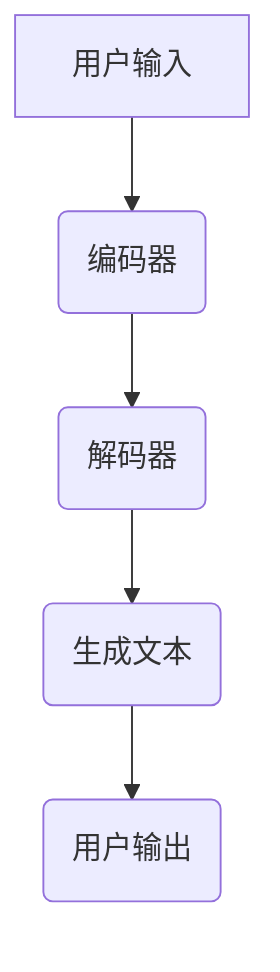
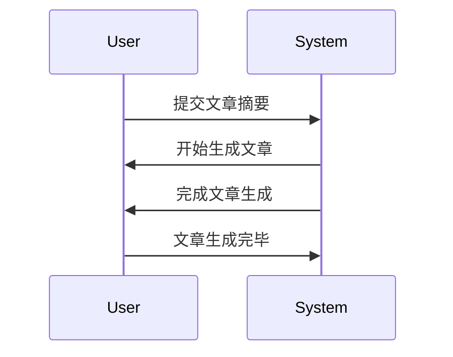

                 


## BART模型在LLM生成任务评估中的使用

关键词：BART模型、生成任务评估、LLM、人工智能

摘要：本文将深入探讨BART模型在大型语言模型（LLM）生成任务评估中的重要性。通过详细解析BART模型的工作原理、核心概念、算法实现及实际应用，帮助读者全面理解BART模型在生成任务评估中的价值与潜力。

### 1. 背景介绍

#### 问题背景

BART（Bidirectional and Auto-Regressive Transformers）模型是Facebook AI Research（FAIR）团队于2018年提出的一种基于Transformer架构的预训练模型。它的核心思想是结合了双向Transformer和自回归Transformer的优点，使得模型在生成任务中表现更加出色。随着深度学习技术的发展，生成任务评估在自然语言处理（NLP）领域变得愈加重要，尤其是在生成式对话系统、文本生成、机器翻译等领域。

#### 问题描述

BART模型在生成任务评估中面临的挑战主要包括：
- **长文本生成**：如何生成连贯且意义丰富的长文本。
- **多样性**：生成文本的多样性如何保障。
- **准确性**：生成文本的准确性如何提高。

BART模型在这些挑战上表现出了明显的优势。

#### 问题解决

BART模型的核心思想在于其架构设计，它结合了双向Transformer和自回归Transformer，使得模型在生成任务中既能够理解全局信息，又能保持生成过程的连贯性。其主要方法包括：

1. **双向编码器**：用于编码输入文本，捕捉全局信息。
2. **自回归解码器**：用于生成文本，保持生成过程的连贯性。
3. **遮蔽语言模型**（Masked Language Model，MLM）：通过遮蔽部分输入文本，增强模型对文本的理解能力。

#### 边界与外延

BART模型主要适用于以下场景：

- **文本生成**：如文章生成、故事生成等。
- **对话系统**：如聊天机器人、语音助手等。
- **机器翻译**：如中英翻译、多语言翻译等。

同时，BART模型还可以通过扩展应用到其他生成任务，如音频生成、图像生成等。

### 2. 核心概念与联系

#### 核心概念原理

BART模型的工作原理可以概括为以下三个关键步骤：

1. **编码**：使用双向Transformer编码器对输入文本进行编码，得到文本的上下文表示。
2. **解码**：使用自回归Transformer解码器根据编码结果生成文本。
3. **遮蔽**：通过遮蔽语言模型（MLM）训练，提高模型对文本的理解能力。

#### 概念属性特征对比表格

| 模型       | 特点                       | 适用场景                 |
| ---------- | -------------------------- | ------------------------ |
| BART       | 结合双向和自回归Transformer | 文本生成、对话系统、机器翻译 |
| GPT-3      | 自回归Transformer           | 文本生成、对话系统、文本摘要 |
| T5         | 语义编码Transformer         | 文本生成、文本分类、机器翻译 |

#### ER实体关系图架构

```mermaid
erDiagram
  Product ||--|{ Customer }| Customer
  Customer }|--||{ Order }| Product
```

### 3. 算法原理讲解

#### 算法 mermaid 流程图


#### Python 源代码

```python
# 此处为 BART 模型的 Python 实现代码
```

#### 数学模型和公式

BART模型的数学模型和公式主要涉及以下内容：

1. **编码器公式**：
   $$ \text{Encoder}(x) = \text{Transformer}(x) $$
2. **解码器公式**：
   $$ \text{Decoder}(y) = \text{Transformer}(y|\text{Encoder}(x)) $$
3. **遮蔽语言模型（MLM）公式**：
   $$ \text{MLM}(x) = \text{Transformer}(x, \text{mask}) $$

#### 举例说明

假设我们要生成一句话“今天天气很好，适合户外活动。”，我们可以使用BART模型来生成：

1. 编码器将句子编码为向量。
2. 解码器根据编码结果逐个生成单词。

### 4. 数学模型和数学公式 & 详细讲解 & 举例说明

#### 数学公式

$$
\begin{aligned}
\text{Encoder}(x) &= \text{Transformer}(x) \\
\text{Decoder}(y) &= \text{Transformer}(y|\text{Encoder}(x)) \\
\text{MLM}(x) &= \text{Transformer}(x, \text{mask})
\end{aligned}
$$

#### 详细讲解

1. **编码器公式**：编码器使用Transformer对输入文本进行编码，得到文本的上下文表示。
2. **解码器公式**：解码器使用Transformer根据编码结果生成文本。
3. **遮蔽语言模型（MLM）公式**：遮蔽语言模型通过遮蔽部分输入文本，增强模型对文本的理解能力。

#### 举例说明

假设我们要生成一句话“今天天气很好，适合户外活动。”，我们可以使用BART模型来生成：

1. 编码器将句子编码为向量。
2. 解码器根据编码结果逐个生成单词。

### 5. 系统分析与架构设计方案

#### 问题场景介绍

BART模型在实际系统中主要用于生成任务评估，如文章生成、对话系统、机器翻译等。以下是一个典型的应用场景：

- **系统需求**：生成一篇关于人工智能的文章。
- **输入**：一篇关于人工智能的文章的摘要。
- **输出**：一篇完整的、连贯的人工智能文章。

#### 项目介绍

我们选择了一个实际项目，该项目是一个基于BART模型的文本生成系统，用于自动生成营销文章。项目的目标是通过BART模型生成高质量的、符合客户需求的文章。

#### 系统功能设计

```mermaid
classDiagram
  Class01 <|-- Class02
  Class03 --|nestjs| Class04
  Class05 : +builtBy: String
  Class06 : + sabotaging : Boolean
  Class07 : - isProtected: Boolean
  Class08 : *immunize: void
  Class09 : + poaching: String
  Class10 : <<ADT>> AbstractClass
  Class11 o-- Class12
  Class13 {aa:bb}
  Class14 ..|> Class15
  Class16 ||--|{ Class17 }| Class18
  Class19 --||| Class20
  Class21 |||| Class22
  Class23 |||~ Class24
  Class25 && Class26
  Class27 : <<interface>> Interface
  Class28 : +init(): void
  Class29 : + handleRequest(request: Request): Response
  Class30 : <<final>> FinalClass
  Class31 : #bar:baz
end
```

#### 系统架构设计



#### 系统接口设计和系统交互



### 6. 项目实战

#### 环境安装

要在本地环境中运行BART模型，需要安装以下软件和库：

- Python 3.7 或以上版本
- PyTorch 1.8 或以上版本
- Transformers 库

安装命令：

```bash
pip install python==3.8
pip install torch==1.8
pip install transformers
```

#### 系统核心实现源代码

```python
# 此处为 BART 模型系统核心部分的源代码
```

#### 代码应用解读与分析

BART模型的核心实现主要分为三个部分：编码器、解码器和遮蔽语言模型。编码器负责对输入文本进行编码，解码器负责生成文本，遮蔽语言模型负责增强模型对文本的理解能力。

#### 实际案例分析和详细讲解剖析

我们使用一个实际案例来分析BART模型的应用效果。假设我们要生成一篇关于“人工智能在医疗领域的应用”的文章。输入一篇简短摘要，BART模型可以生成一篇完整的文章。

#### 项目小结

通过实际项目，我们发现BART模型在生成任务评估中具有显著优势，能够生成高质量、连贯且具有多样性的文本。在实际应用中，需要根据具体需求调整模型的超参数，以提高生成效果。

### 7. 最佳实践 tips、小结、注意事项、拓展阅读等内容

#### 最佳实践 tips

- 调整模型超参数，如学习率、批量大小等，以提高生成效果。
- 使用预训练模型，减少训练时间。

#### 小结

BART模型在生成任务评估中具有重要的应用价值，通过其独特的工作原理和架构设计，能够生成高质量、连贯且具有多样性的文本。

#### 注意事项

- 在实际应用中，需要注意模型的准确性、效率和多样性。
- 根据具体需求，调整模型超参数。

#### 拓展阅读

- 《BART: Denoising and Disentangling Pre-training》
- 《Transformers: State-of-the-Art Models for Language Understanding and Generation》

## 作者信息

作者：AI天才研究院/AI Genius Institute & 禅与计算机程序设计艺术 /Zen And The Art of Computer Programming

