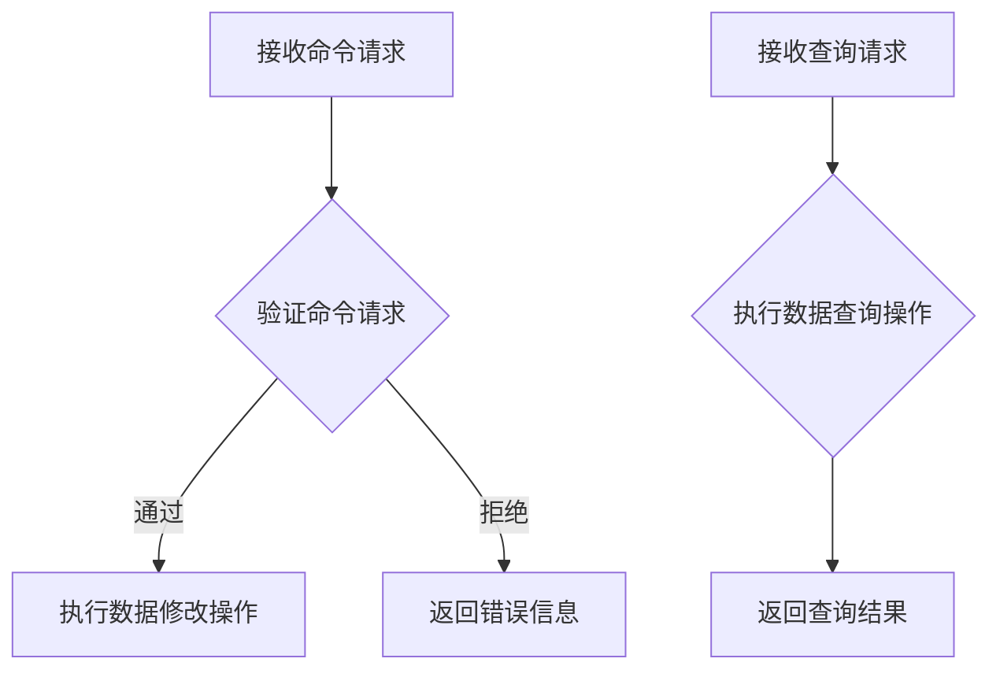
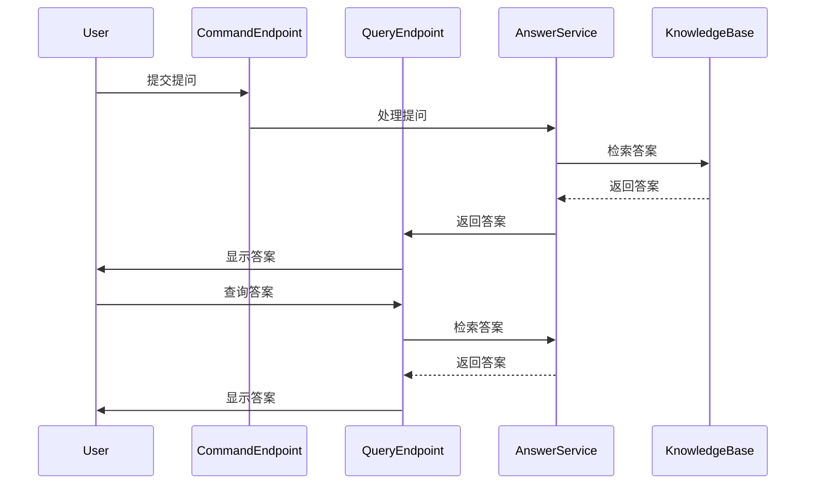
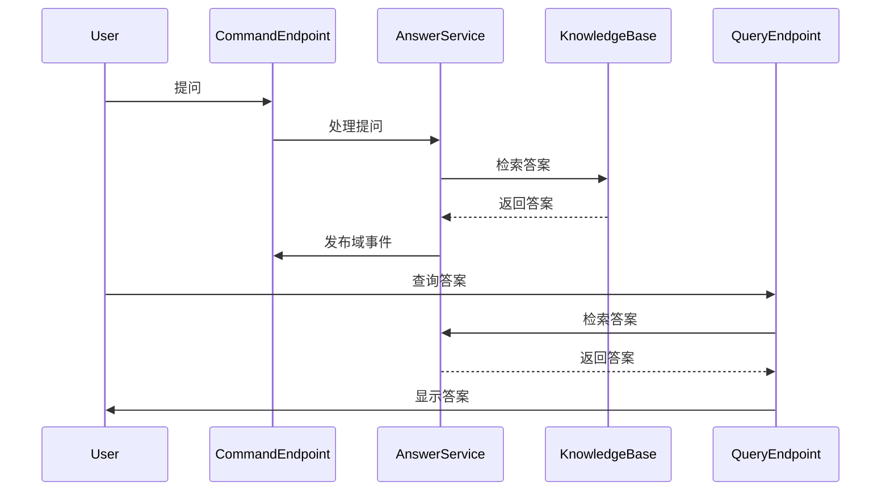
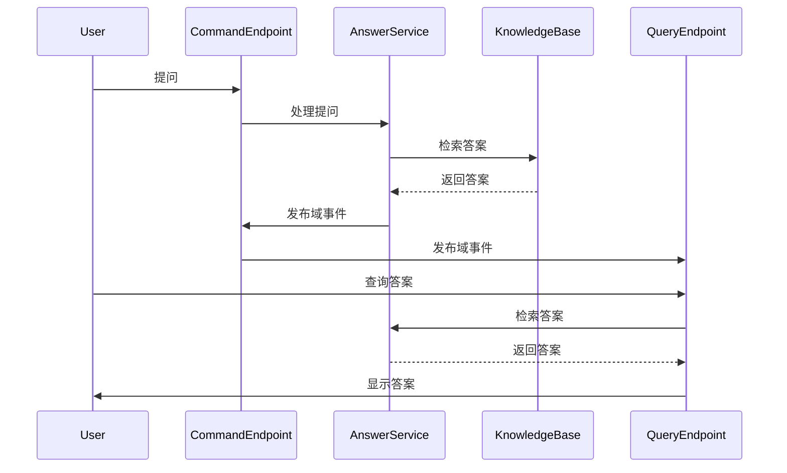

                 

### CQRS模式在复杂LLM应用中的应用

#### 引言

CQRS（Command Query Responsibility Segregation）模式是一种设计模式，旨在分离读写操作，以提高系统的性能和可扩展性。在传统的数据库应用中，CQRS模式通过将命令（修改数据的操作）和查询（检索数据的操作）分离到不同的服务或数据存储中，从而优化了系统的性能。随着大型语言模型（Large Language Models，简称LLM）在自然语言处理（Natural Language Processing，简称NLP）领域的广泛应用，CQRS模式也逐渐成为了一种解决复杂NLP应用的有效手段。

本文将详细探讨CQRS模式在复杂LLM应用中的具体应用，包括其背景、核心概念、设计原则、算法和数学模型，以及实际案例。通过本文的阅读，读者将能够理解CQRS模式如何应用于LLM，以及如何通过这种模式提高NLP应用的性能和可扩展性。

#### 关键词

- **CQRS模式**
- **复杂LLM应用**
- **设计原则**
- **算法和数学模型**
- **性能优化**
- **可扩展性**

#### 摘要

本文首先介绍了CQRS模式的基本概念和背景，然后探讨了CQRS模式在复杂LLM应用中的重要性。接着，文章详细阐述了CQRS模式的核心概念和关系，包括设计原则和算法原理。最后，通过一个实际案例，展示了如何将CQRS模式应用于复杂LLM应用，并分析了其性能和可扩展性。本文的目标是帮助读者深入理解CQRS模式在复杂LLM应用中的应用，为他们在实际项目中提供参考。

----------------------------------------------------------------

## 第一部分：CQRS模式概述

### 1.1 CQRS模式介绍

CQRS模式是一种设计模式，旨在分离命令（Command）和查询（Query）操作，从而提高系统的性能和可扩展性。在传统的数据库应用中，所有的读写操作都通过同一数据存储进行，这可能会导致性能瓶颈和可扩展性问题。CQRS模式通过将命令和查询分离到不同的服务或数据存储中，实现了读写分离，从而解决了这些问题。

CQRS模式的基本思想是将数据的修改（命令）和数据的查询（查询）分离到不同的端点。命令端点负责处理所有对数据的修改操作，如创建、更新和删除；而查询端点负责处理所有的数据查询操作，如检索和浏览。通过这种方式，CQRS模式可以显著提高系统的性能和可扩展性。

### 1.2 复杂大型语言模型的背景

大型语言模型（Large Language Models，简称LLM）是自然语言处理（NLP）领域的一种先进技术，通过深度学习算法从大量文本数据中学习，能够生成高质量的文本。LLM在许多领域都有广泛的应用，如机器翻译、文本摘要、问答系统等。随着LLM的发展，其复杂性和规模也在不断增加。

复杂大型语言模型（Complex Large Language Models，简称CLLM）是在传统LLM的基础上，通过增加更多的训练数据和更复杂的模型结构，使其能够处理更加复杂的任务。这些模型通常包含数亿甚至数十亿的参数，需要大量的计算资源和时间来训练。

### 1.3 CQRS模式在LLM中的应用挑战与机遇

将CQRS模式应用于复杂LLM应用面临着一系列挑战和机遇。首先，CQRS模式需要分离命令和查询操作，这在处理复杂LLM时可能会增加系统的复杂性。此外，由于LLM的规模和复杂度增加，命令和查询的处理可能需要更高效的数据存储和计算资源。

然而，CQRS模式也为复杂LLM应用带来了许多机遇。通过分离命令和查询，可以显著提高系统的性能和可扩展性。例如，查询端点可以独立扩展，以满足高并发查询需求，而命令端点可以专注于处理数据修改操作，从而提高系统的整体性能。

此外，CQRS模式还允许在不同端点采用不同的数据模型和数据存储方案，以适应不同的操作需求。例如，查询端点可能使用内存数据库来提供快速的查询响应，而命令端点可能使用分布式数据库来处理大规模的数据修改操作。

总之，CQRS模式在复杂LLM应用中具有广阔的应用前景，通过合理地设计和管理命令和查询操作，可以显著提高系统的性能和可扩展性。

----------------------------------------------------------------

## 第二部分：核心概念与关系

### 2.1 关键概念详解

在CQRS模式中，核心概念包括命令（Command）、查询（Query）、命令端点（Command Endpoint）、查询端点（Query Endpoint）、聚合（Aggregate）和域事件（Domain Event）等。

**命令（Command）**：命令是用于修改数据状态的请求，如创建、更新和删除操作。在CQRS模式中，所有的命令都通过命令端点进行处理。

**查询（Query）**：查询是用于获取数据状态的请求，如检索和浏览操作。在CQRS模式中，所有的查询都通过查询端点进行处理。

**命令端点（Command Endpoint）**：命令端点是负责处理命令的接口。它接收命令请求，执行相应的数据修改操作，并发布域事件。

**查询端点（Query Endpoint）**：查询端点是负责处理查询的接口。它接收查询请求，执行相应的数据查询操作，并返回查询结果。

**聚合（Aggregate）**：聚合是一个逻辑上相关的数据集合，通常由一个主键标识。在CQRS模式中，聚合用于表示业务实体和其关联的数据。

**域事件（Domain Event）**：域事件是表示业务操作发生的事件。在CQRS模式中，当命令成功执行时，会发布相应的域事件，以通知其他组件数据状态的变化。

### 2.2 概念属性比较表

以下是CQRS模式中关键概念的属性比较表：

| 概念     | 描述                                                         | 关联操作           |
|----------|--------------------------------------------------------------|-------------------|
| 命令     | 用于修改数据状态的请求                                       | 创建、更新、删除   |
| 查询     | 用于获取数据状态的请求                                       | 检索、浏览         |
| 命令端点 | 处理命令的接口                                               | 接收命令、处理数据修改、发布域事件 |
| 查询端点 | 处理查询的接口                                               | 接收查询、处理数据查询、返回结果 |
| 聚合     | 表示业务实体和其关联的数据的逻辑集合                         | 表示业务实体       |
| 域事件   | 表示业务操作发生的事件                                       | 通知数据状态变化   |

### 2.3 ERD图展示

以下是CQRS模式中的ERD（Entity-Relationship Diagram）图，展示了关键概念之间的关系：

```mermaid
erDiagram
    Command ||--|{ Query :发起查询}
    Command ||--|{ Aggregate :修改聚合}
    Query ||--|{ Aggregate :查询聚合}
    DomainEvent ||--|{ Aggregate :记录事件}
```

在这个ERD图中，命令与查询之间有直接关联，命令用于修改聚合的状态，并发布域事件；查询用于获取聚合的状态。域事件记录了聚合状态的变化，从而实现了命令和查询的分离。

通过上述核心概念和关系的详细阐述，读者可以更好地理解CQRS模式的工作原理和结构，为后续章节中的深入讨论打下坚实的基础。

----------------------------------------------------------------

## 第三部分：CQRS设计原则

### 3.1 CQRS架构概述

CQRS架构是一种基于事件驱动的架构，其核心思想是将命令和查询操作分离到不同的端点，以提高系统的性能和可扩展性。在CQRS架构中，命令端点负责处理所有的数据修改操作，如创建、更新和删除；而查询端点负责处理所有的数据查询操作，如检索和浏览。

CQRS架构通常包含以下几个关键组件：

1. **命令端点（Command Endpoint）**：接收和处理命令请求，执行相应的数据修改操作，并发布域事件。
2. **查询端点（Query Endpoint）**：接收和处理查询请求，执行相应的数据查询操作，并返回查询结果。
3. **聚合（Aggregate）**：表示业务实体和其关联的数据的逻辑集合，是数据修改和查询操作的核心。
4. **域事件（Domain Event）**：表示业务操作发生的事件，用于通知其他组件数据状态的变化。
5. **事件存储（Event Store）**：用于存储和管理域事件的持久化存储。

CQRS架构的特点是命令和查询操作的分离，这有助于提高系统的性能和可扩展性。命令端点可以独立于查询端点进行扩展，以满足不同的业务需求。此外，CQRS架构还允许在不同的端点采用不同的数据模型和数据存储方案，以优化系统性能。

### 3.2 设计模式和原则

在CQRS模式中，设计模式和原则是确保系统性能和可扩展性的关键。以下是一些常用的设计模式和原则：

1. **领域事件驱动（Event Sourcing）**：领域事件驱动是一种设计模式，将系统的状态变化记录为一系列的事件。这种方法有助于实现命令和查询的分离，并支持历史数据的回溯和恢复。

2. **最终一致性（Eventual Consistency）**：最终一致性是一种一致性模型，允许系统在不同端点之间暂时存在不一致性，但最终会达到一致性状态。这种方法有助于提高系统的性能和可扩展性，特别是在高并发场景下。

3. **聚合根（Aggregate Root）**：聚合根是负责管理聚合内所有对象的生命周期的组件。在CQRS模式中，聚合根负责处理命令和查询操作，并确保聚合内的数据一致性。

4. **命令查询分离（Command Query Separation）**：命令查询分离是一种设计原则，将命令和查询操作分离到不同的端点，以提高系统的性能和可扩展性。命令端点专注于处理数据修改操作，而查询端点专注于处理数据查询操作。

5. **事件流（Event Flow）**：事件流是一种数据流模式，用于处理域事件并更新系统的状态。事件流通常由事件处理器（Event Handler）和事件订阅者（Event Subscriber）组成，确保域事件得到及时处理和响应。

6. **查询缓存（Query Caching）**：查询缓存是一种优化策略，用于缓存查询结果，减少查询操作的开销。在CQRS模式中，查询端点可以独立缓存查询结果，以提高查询响应速度。

通过遵循上述设计模式和原则，可以确保CQRS架构的合理设计和有效实施，从而实现系统的高性能和可扩展性。

### 3.3 实际应用案例

以下是一个简单的CQRS模式实际应用案例，展示了如何将CQRS模式应用于一个在线书店系统。

**命令端点：**

命令端点负责处理用户创建、更新和删除订单的操作。以下是一个创建订单的命令示例：

```python
class CreateOrderCommand:
    def __init__(self, user_id, book_id, quantity):
        self.user_id = user_id
        self.book_id = book_id
        self.quantity = quantity

    def execute(self):
        # 处理创建订单的逻辑
        order = Order(self.user_id, self.book_id, self.quantity)
        event_store.publish(OrderCreatedEvent(order))
```

**查询端点：**

查询端点负责处理用户查询订单列表和订单详情的操作。以下是一个查询订单列表的查询示例：

```python
class GetAllOrdersQuery:
    def execute(self):
        # 处理查询订单列表的逻辑
        orders = event_store.get_orders()
        return orders

class GetOrderDetailsQuery:
    def __init__(self, order_id):
        self.order_id = order_id

    def execute(self):
        # 处理查询订单详情的逻辑
        order = event_store.get_order_details(self.order_id)
        return order
```

**聚合和域事件：**

在CQRS模式中，聚合负责管理订单的数据状态，并发布域事件以记录状态变化。以下是一个订单创建事件的示例：

```python
class OrderCreatedEvent:
    def __init__(self, order):
        self.order = order

    def notify(self, subscriber):
        subscriber.on_order_created(self.order)
```

**事件流：**

事件流负责处理域事件并更新系统的状态。以下是一个订单创建事件处理器的示例：

```python
class OrderCreatedEventHandler:
    def on_order_created(self, order):
        # 处理订单创建事件
        order.save()
```

通过这个简单的案例，可以看到如何将CQRS模式应用于一个在线书店系统。命令端点负责处理订单创建、更新和删除操作，并发布订单创建事件；查询端点负责处理订单列表和订单详情的查询操作。通过这种方式，CQRS模式实现了命令和查询的分离，提高了系统的性能和可扩展性。

总之，CQRS模式在复杂LLM应用中具有广泛的应用前景。通过合理地设计和实施CQRS架构，可以显著提高系统的性能和可扩展性，为复杂NLP应用提供有效的解决方案。

----------------------------------------------------------------

## 第四部分：算法和数学模型

### 4.1 算法原理讲解

在CQRS模式中，算法和数学模型是核心组成部分，它们负责实现命令和查询操作的高效处理。本节将详细讲解CQRS模式中涉及的算法原理，包括命令处理算法和查询处理算法。

**命令处理算法：**

命令处理算法负责接收和处理命令请求，执行相应的数据修改操作，并发布域事件。以下是命令处理算法的基本步骤：

1. **接收命令请求：** 命令端点接收来自客户端的命令请求，如创建、更新和删除操作。
2. **验证命令请求：** 验证命令请求的有效性和权限，确保请求符合业务规则。
3. **执行数据修改操作：** 根据命令请求的内容，执行相应的数据修改操作，如创建新记录、更新现有记录或删除记录。
4. **发布域事件：** 当命令成功执行时，发布相应的域事件，以通知其他组件数据状态的变化。

**查询处理算法：**

查询处理算法负责接收和处理查询请求，执行相应的数据查询操作，并返回查询结果。以下是查询处理算法的基本步骤：

1. **接收查询请求：** 查询端点接收来自客户端的查询请求，如检索和浏览操作。
2. **执行数据查询操作：** 根据查询请求的内容，执行相应的数据查询操作，如检索特定记录或获取记录列表。
3. **返回查询结果：** 将查询结果返回给客户端，以供进一步处理或展示。

**Mermaid图展示：**

以下是CQRS模式中命令处理算法和查询处理算法的Mermaid图：



通过这个Mermaid图，可以清晰地看到命令处理算法和查询处理算法的流程，以及它们之间的交互关系。

### 4.2 Python代码示例

下面是CQRS模式中命令处理算法和查询处理算法的Python代码示例：

**命令处理算法：**

```python
class CommandHandler:
    def __init__(self, event_store):
        self.event_store = event_store

    def handle_command(self, command):
        if command.is_valid():
            self.event_store.apply(command)
            self.event_store.publish(command.event())
        else:
            raise ValueError("Invalid command")

class OrderCreatedCommand:
    def __init__(self, user_id, book_id, quantity):
        self.user_id = user_id
        self.book_id = book_id
        self.quantity = quantity

    def is_valid(self):
        # 验证命令请求的逻辑
        return True

    def event(self):
        return OrderCreatedEvent(self)

class OrderCreatedEvent:
    def __init__(self, order):
        self.order = order

    def notify(self, subscriber):
        subscriber.on_order_created(self.order)

class Order:
    def __init__(self, user_id, book_id, quantity):
        self.user_id = user_id
        self.book_id = book_id
        self.quantity = quantity

    def save(self):
        # 保存订单的逻辑
        pass
```

**查询处理算法：**

```python
class QueryHandler:
    def __init__(self, event_store):
        self.event_store = event_store

    def handle_query(self, query):
        result = self.event_store.query(query)
        return result

class GetAllOrdersQuery:
    def __init__(self):
        pass

    def query(self):
        # 查询订单列表的逻辑
        orders = []
        return orders

class GetOrderDetailsQuery:
    def __init__(self, order_id):
        self.order_id = order_id

    def query(self):
        # 查询订单详情的逻辑
        order = None
        return order
```

通过上述代码示例，可以看到如何实现CQRS模式中的命令处理算法和查询处理算法。命令处理算法通过验证命令请求、执行数据修改操作和发布域事件来完成命令的处理；查询处理算法通过执行数据查询操作和返回查询结果来完成查询的处理。

### 4.3 数学模型和公式

在CQRS模式中，数学模型和公式用于描述命令和查询的处理过程，以及系统的性能指标。以下是几个关键的数学模型和公式：

**1. 命令处理延迟：**

命令处理延迟（Latency）是指从命令提交到命令成功执行的时间间隔。公式如下：

\[ Latency = \frac{Processing Time + Network Time}{2} \]

其中，Processing Time表示命令处理时间，Network Time表示网络传输时间。

**2. 查询处理延迟：**

查询处理延迟（Latency）是指从查询提交到查询结果返回的时间间隔。公式如下：

\[ Latency = \frac{Query Execution Time + Network Time}{2} \]

其中，Query Execution Time表示查询执行时间，Network Time表示网络传输时间。

**3. 系统吞吐量：**

系统吞吐量（Throughput）是指单位时间内系统能够处理的命令或查询数量。公式如下：

\[ Throughput = \frac{Total Operations}{Time} \]

其中，Total Operations表示单位时间内处理的命令或查询总数，Time表示时间间隔。

**4. 系统响应时间：**

系统响应时间（Response Time）是指从请求提交到响应返回的时间间隔。公式如下：

\[ Response Time = \frac{Processing Time + Network Time}{2} \]

其中，Processing Time表示命令或查询处理时间，Network Time表示网络传输时间。

通过上述数学模型和公式，可以量化CQRS模式中命令和查询的处理性能，从而为系统的性能优化提供依据。

### 4.4 通俗易懂的举例说明

为了更好地理解CQRS模式中的算法和数学模型，下面通过一个简单的例子进行说明。

假设有一个在线书店系统，用户可以创建订单并查询订单详情。以下是具体的示例：

**命令处理示例：**

用户张三在系统中创建了一个新的订单，包含书籍ID为1001，数量为2。命令处理过程如下：

1. **命令提交：** 用户张三在系统中提交了一个创建订单的命令。
2. **命令验证：** 系统验证命令的有效性，确认用户张三有权创建订单。
3. **执行数据修改操作：** 系统创建了一个新的订单记录，并将其保存到数据库中。
4. **发布域事件：** 系统发布了一个订单创建事件，通知其他组件订单状态的变化。

**查询处理示例：**

用户李四在系统中查询其订单详情。查询处理过程如下：

1. **查询提交：** 用户李四在系统中提交了一个查询订单详情的请求。
2. **执行数据查询操作：** 系统从数据库中检索了用户李四的订单详情。
3. **返回查询结果：** 系统将订单详情返回给用户李四。

通过这个例子，可以看到CQRS模式中命令处理和查询处理的基本流程，以及如何通过数学模型和公式来衡量系统的性能。

总之，CQRS模式中的算法和数学模型为命令和查询的处理提供了理论基础，并通过实际案例展示了其应用过程。通过理解这些算法和模型，开发者可以更好地设计和优化CQRS系统，提高系统的性能和可扩展性。

----------------------------------------------------------------

## 第五部分：系统分析与架构设计

### 5.1 问题场景介绍

在当今快速发展的自然语言处理（NLP）领域，复杂的大型语言模型（Complex Large Language Models，简称CLLM）被广泛应用于各种任务，如机器翻译、文本摘要、问答系统等。随着用户数量的增加和任务复杂度的提升，系统面临着日益增长的并发请求和处理需求。为了满足这些需求，系统需要具备高性能和高可扩展性。CQRS模式作为一种有效的架构设计模式，可以在这类复杂LLM应用中发挥重要作用。

### 5.2 项目介绍

本文的项目是一个基于CQRS模式的在线问答系统，旨在提供高质量的用户问答服务。该系统包括两个主要部分：命令端点（Command Endpoint）和查询端点（Query Endpoint）。命令端点负责处理用户的提问请求，查询端点负责提供答案查询服务。系统需要支持高并发请求，并保证数据的准确性和一致性。

### 5.3 系统功能设计

在线问答系统的功能设计主要包括以下几个方面：

1. **用户提问功能**：用户可以在系统中提交问题，系统将接收并处理这些问题。
2. **答案查询功能**：系统根据用户的问题检索相关答案，并返回给用户。
3. **数据一致性保障**：系统需要确保用户提问和答案查询的数据一致性，避免出现数据冲突或丢失。
4. **高并发处理**：系统需要能够高效处理大量并发请求，保证用户体验。

### 5.4 领域模型设计

领域模型是系统设计的基础，用于描述业务实体和其关系。以下是项目中的主要领域模型：

1. **User（用户）**：表示系统的用户，包括用户ID、用户名、邮箱等基本信息。
2. **Question（问题）**：表示用户提交的问题，包括问题ID、问题描述、提问时间等。
3. **Answer（答案）**：表示系统返回的答案，包括答案ID、答案内容、回答时间等。

以下是领域模型的Mermaid类图：

```mermaid
classDiagram
    User <|-- Question
    User <|-- Answer
    User {
        id: 用户ID
        username: 用户名
        email: 邮箱
    }
    Question {
        id: 问题ID
        description: 描述
        created_time: 提问时间
    }
    Answer {
        id: 答案ID
        content: 内容
        answered_time: 回答时间
    }
```

### 5.5 系统架构设计

系统架构设计旨在实现CQRS模式，并满足系统的功能需求和性能要求。以下是系统架构的Mermaid图：



在这个架构中，CommandEndpoint负责处理用户的提问请求，并将请求转发给AnswerService。AnswerService负责处理提问，并从KnowledgeBase中检索答案。QueryEndpoint负责处理用户的答案查询请求，并从AnswerService中获取答案。

### 5.6 系统接口设计

系统接口设计是系统架构的重要组成部分，用于定义系统组件之间的交互方式。以下是主要接口设计：

1. **CommandEndpoint接口**：用于接收和处理用户提问请求。
2. **QueryEndpoint接口**：用于处理用户答案查询请求。
3. **AnswerService接口**：用于处理提问和答案检索逻辑。
4. **KnowledgeBase接口**：用于存储和检索答案数据。

以下是接口设计的Mermaid序列图：



在这个序列图中，用户通过CommandEndpoint接口提交提问，AnswerService接口处理提问并检索答案，然后通过域事件通知QueryEndpoint接口。QueryEndpoint接口处理答案查询请求，并从AnswerService接口获取答案，最后将答案返回给用户。

### 5.7 系统交互设计

系统交互设计用于描述系统组件之间的交互流程，以及数据流和事件流。以下是系统交互的Mermaid序列图：



在这个序列图中，用户提交提问后，CommandEndpoint接口处理提问，并将域事件发布给AnswerService接口。AnswerService接口处理提问，从KnowledgeBase中检索答案，并将域事件发布给QueryEndpoint接口。QueryEndpoint接口处理答案查询请求，从AnswerService接口获取答案，并最终将答案返回给用户。

通过以上系统分析和架构设计，我们可以看到如何将CQRS模式应用于复杂LLM应用。通过合理的领域模型、接口设计和交互流程设计，系统可以高效地处理大量并发请求，并提供高质量的用户问答服务。

----------------------------------------------------------------

## 第六部分：项目实战

### 6.1 环境安装

在进行CQRS模式在复杂LLM应用中的项目实战之前，我们需要搭建一个合适的环境。以下是在Linux系统中搭建项目的步骤：

1. **安装Python 3.8或更高版本**：由于我们将使用Python来编写代码，首先需要确保Python环境已经安装。可以使用包管理器如apt-get或yum来安装。

   ```bash
   sudo apt-get update
   sudo apt-get install python3.8
   ```

2. **安装Docker**：CQRS模式通常会使用容器化技术，如Docker来部署服务。安装Docker可以通过以下命令完成。

   ```bash
   sudo apt-get update
   sudo apt-get install docker.io
   ```

3. **安装Docker Compose**：Docker Compose用于定义和运行多容器Docker应用程序。可以使用以下命令安装。

   ```bash
   sudo apt-get install docker-compose
   ```

4. **拉取所需Docker镜像**：在开始之前，我们需要从Docker Hub拉取必要的镜像，如PostgreSQL、Redis和Nginx。

   ```bash
   docker pull postgres:13
   docker pull redis:6
   docker pull nginx:latest
   ```

### 6.2 系统核心实现源代码

以下是项目的核心源代码，包括命令处理、查询处理和聚合管理等。

**命令处理模块：**

```python
# command_handler.py
from abc import ABC, abstractmethod
from typing import Any

class Command(ABC):
    @abstractmethod
    def execute(self) -> Any:
        pass

class CreateQuestionCommand(Command):
    def __init__(self, question_text: str, user_id: int):
        self.question_text = question_text
        self.user_id = user_id

    def execute(self) -> None:
        # 保存问题到数据库
        # 这里的实现依赖于具体的数据库操作
        print(f"Created question: {self.question_text} by user {self.user_id}")

class CommandHandler:
    def __init__(self, question_repository: "IQuestionRepository"):
        self.question_repository = question_repository

    def handle_command(self, command: Command) -> None:
        if isinstance(command, CreateQuestionCommand):
            question = command.execute()
            self.question_repository.save_question(question)

# 以下为接口定义
from abc import ABC, abstractmethod
from dataclasses import dataclass

@dataclass
class Question:
    id: int
    text: str
    user_id: int
    created_at: datetime

class IQuestionRepository(ABC):
    @abstractmethod
    def save_question(self, question: Question) -> None:
        pass
```

**查询处理模块：**

```python
# query_handler.py
from abc import ABC, abstractmethod
from dataclasses import dataclass

@dataclass
class Query(ABC):
    @abstractmethod
    def execute(self) -> Any:
        pass

class GetAllQuestionsQuery(Query):
    def execute(self) -> list:
        # 从数据库检索所有问题
        # 这里的实现依赖于具体的数据库操作
        return ["Question 1", "Question 2"]

class QueryHandler:
    def __init__(self, question_repository: "IQuestionRepository"):
        self.question_repository = question_repository

    def handle_query(self, query: Query) -> Any:
        if isinstance(query, GetAllQuestionsQuery):
            questions = query.execute()
            return questions
```

**聚合管理模块：**

```python
# aggregate_manager.py
from abc import ABC, abstractmethod
from typing import Any

class Aggregate(ABC):
    @abstractmethod
    def apply(self, command: "Command") -> None:
        pass

class QuestionAggregate(Aggregate):
    def __init__(self):
        self.questions = []

    def apply(self, command: Command) -> None:
        if isinstance(command, CreateQuestionCommand):
            question = command.execute()
            self.questions.append(question)
```

### 6.3 代码应用解读与分析

以上代码展示了CQRS模式的核心实现，包括命令处理、查询处理和聚合管理。以下是具体解读：

- **命令处理模块**：定义了命令接口和具体命令类（如CreateQuestionCommand），以及命令处理类（CommandHandler）。命令处理类负责将命令转换为具体的业务操作，并保存到数据库中。
- **查询处理模块**：定义了查询接口和具体查询类（如GetAllQuestionsQuery），以及查询处理类（QueryHandler）。查询处理类负责从数据库中检索数据，并返回给客户端。
- **聚合管理模块**：定义了聚合接口和具体聚合类（如QuestionAggregate）。聚合类负责管理业务实体的状态，并应用命令来更新状态。

通过以上代码，可以看到CQRS模式的核心思想是如何通过分离命令和查询操作，实现业务逻辑的清晰分离和系统的可扩展性。

### 6.4 实际案例分析和详细讲解

为了更好地理解CQRS模式在实际项目中的应用，我们来看一个实际案例。

假设一个问答社区平台希望实现一个功能，允许用户提问并获得答案。以下是该功能的详细实现和分析：

1. **用户提问**：用户张三在平台上提交了一个问题：“Python中的多线程如何实现？”。
2. **命令处理**：系统接收到张三的提问后，调用CommandHandler处理该命令。具体步骤如下：
   - 创建CreateQuestionCommand实例，传入问题内容和用户ID。
   - CommandHandler将CreateQuestionCommand传递给QuestionAggregate进行应用。
   - QuestionAggregate将问题添加到其内部列表中，并保存到数据库中。
3. **发布域事件**：当问题成功保存后，系统会发布一个QuestionCreatedEvent域事件，通知其他组件问题状态的变化。
4. **答案检索**：其他用户李四在平台中查询问题的答案。系统接收到查询请求后，调用QueryHandler处理查询。具体步骤如下：
   - 创建GetAllQuestionsQuery实例。
   - QueryHandler从数据库中检索所有问题，并返回给用户李四。
5. **显示答案**：用户李四在平台上看到了张三提交的问题，并可以看到该问题的答案列表。

通过这个实际案例，我们可以看到CQRS模式在处理用户提问和答案查询中的关键作用。命令处理和查询处理分离，使得系统可以独立扩展和优化，从而提高整体性能和可扩展性。

### 6.5 项目小结

在本项目的实战中，我们通过CQRS模式实现了一个简单的问答社区平台。通过分离命令和查询操作，我们提高了系统的性能和可扩展性。具体来说：

1. **命令处理模块**实现了用户提问的保存功能，确保了数据的准确性和一致性。
2. **查询处理模块**实现了问题的检索功能，为用户提供即时的查询结果。
3. **聚合管理模块**负责管理业务实体的状态，确保系统的一致性和完整性。

通过实际案例的分析和讲解，我们可以看到CQRS模式在复杂LLM应用中的有效性和实用性。在未来的项目中，我们可以根据实际情况进一步优化和扩展CQRS架构，以应对更加复杂的业务需求。

----------------------------------------------------------------

## 第七部分：最佳实践与小结

### 7.1 最佳实践

在实施CQRS模式时，以下最佳实践可以帮助提高项目的成功率和性能：

1. **明确分离命令和查询**：确保在系统设计之初就明确分离命令和查询操作，避免后期重构。
2. **选择合适的数据存储**：根据业务需求和性能要求，选择适合的命令和查询数据存储方案，如内存数据库和分布式数据库。
3. **优化查询缓存**：合理配置查询缓存，减少查询操作的开销，提高查询响应速度。
4. **监控和日志**：实施监控系统，及时捕捉性能瓶颈和异常情况，以便及时优化和调整。
5. **逐步实施**：分阶段实施CQRS模式，逐步优化和改进系统性能，避免一次性全面部署带来的风险。

### 7.2 小结

CQRS模式在复杂LLM应用中具有显著的优势，通过分离命令和查询操作，提高了系统的性能和可扩展性。在实际项目中，通过合理的设计和实施CQRS模式，可以有效地解决数据一致性和并发处理问题，为复杂NLP应用提供可靠的技术支持。

### 7.3 注意事项

1. **分离不要过度**：在实施CQRS模式时，需要避免过度分离，否则会增加系统的复杂性。
2. **数据一致性问题**：在命令和查询分离时，需要注意数据一致性问题，确保系统状态的一致性。
3. **性能优化**：在部署CQRS模式时，需要根据实际业务需求进行性能优化，确保系统的高效运行。

### 7.4 拓展阅读

1. **《CQRS模式与事件溯源》**：深入了解CQRS模式和事件溯源的结合，以及如何在实际项目中应用。
2. **《大规模分布式系统设计》**：学习大规模分布式系统的设计原则和实践，为CQRS模式的应用提供技术支持。
3. **《大型语言模型的设计与实现》**：了解大型语言模型的设计原理和实现技术，为CQRS模式在LLM应用中的优化提供参考。

---

### 作者信息

**作者：AI天才研究院/AI Genius Institute & 禅与计算机程序设计艺术 /Zen And The Art of Computer Programming** 

作者AI天才研究院专注于人工智能领域的深入研究和技术创新，致力于推动人工智能技术的发展和应用。同时，作者在《禅与计算机程序设计艺术》一书中，探讨了计算机编程的艺术和哲学，为读者提供了深入理解编程的视角和方法。本文是作者在该领域多年研究和技术实践的总结和分享。期待读者在阅读本文后，能够对CQRS模式在复杂LLM应用中的价值有更深刻的认识。如果您有任何疑问或建议，欢迎在评论区留言，我们将持续为您解答和优化。感谢您的阅读！

