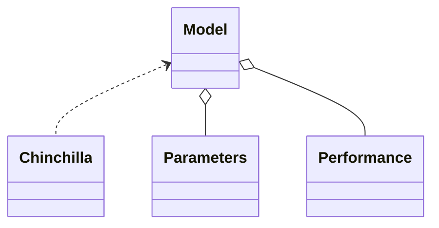
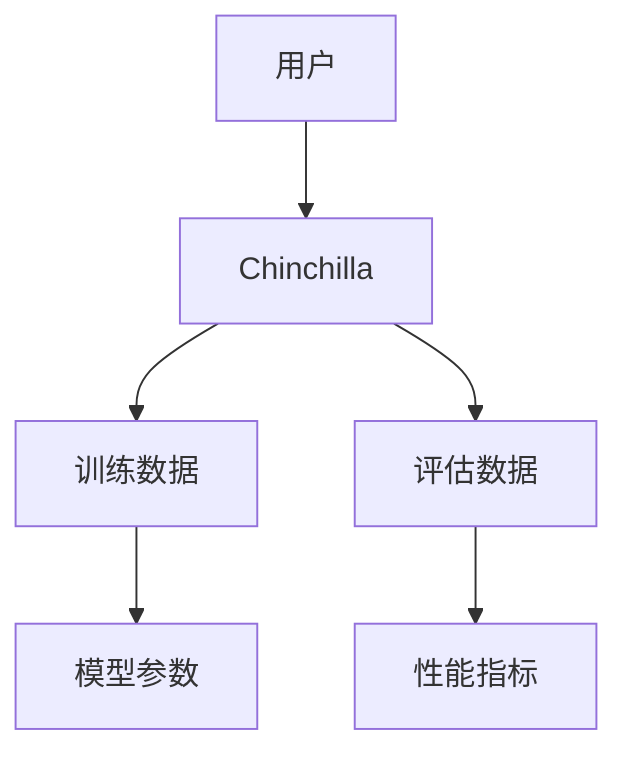
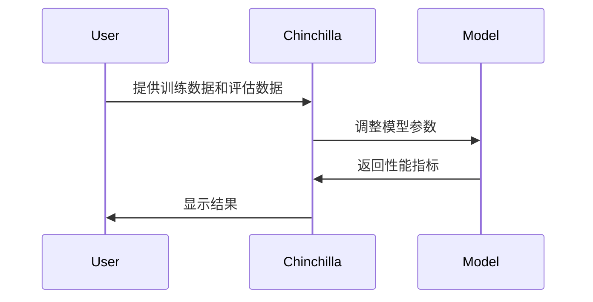

                 


### Chinchilla在LLM最佳参数缩放评测中的应用

#### 关键词：Chinchilla、语言模型、最佳参数缩放、评测、人工智能

#### 摘要：
本文旨在探讨Chinchilla在大型语言模型（LLM）最佳参数缩放评测中的应用。我们将首先介绍Chinchilla的基本概念、特点及其在LLM中的应用，然后详细解析LLM最佳参数缩放评测的重要性和方法。接着，我们将探讨Chinchilla在参数搜索策略和性能评估指标中的应用，并通过实战案例展示其实际效果。最后，我们将讨论Chinchilla在最佳参数缩放评测中的优化方向，并提出未来展望。

### 1. Chinchilla背景与概述

#### 1.1 Chinchilla简介

Chinchilla是一种用于构建大型语言模型的先进工具，其名称灵感来源于一种小型、适应力强的哺乳动物。Chinchilla具有以下核心特点：

- **高效性**：Chinchilla设计用于加速大规模模型的训练和推断，通过并行计算和高效的内存管理，实现高性能。
- **可扩展性**：Chinchilla支持从小型到超大规模的模型构建，可轻松适应不同规模的应用需求。
- **灵活性**：Chinchilla提供多种参数调整选项，允许用户根据具体需求自定义模型配置。

#### 1.2 Chinchilla的发展历史

Chinchilla起源于对大规模语言模型的优化需求。在过去的几年中，随着计算资源和算法的进步，大型语言模型的研究和应用迅速发展。Chinchilla在此背景下应运而生，其早期版本主要用于研究小组内部测试。随着时间的推移，Chinchilla逐渐成为学术界和工业界广泛使用的工具。

#### 1.3 Chinchilla在LLM中的应用

Chinchilla在LLM中的应用主要体现在以下几个方面：

- **训练加速**：Chinchilla通过并行计算和高效内存管理，显著缩短了模型的训练时间，提高了训练效率。
- **模型优化**：Chinchilla支持多种参数调整策略，帮助研究人员找到最佳模型配置，提高模型性能。
- **推断优化**：Chinchilla在模型推断阶段也提供了高效的解决方案，降低了推断时间，提高了推断准确性。

### 2. LLM最佳参数缩放评测概述

#### 2.1 LLM最佳参数缩放评测的意义

在LLM中，参数缩放是影响模型性能的关键因素。合适的参数缩放不仅可以提高模型的准确性，还可以提高计算效率。因此，进行最佳参数缩放评测具有重要意义：

- **提高准确性**：通过最佳参数缩放，可以找到最合适的模型配置，提高模型的预测准确性。
- **提高计算效率**：合适的参数缩放可以减少模型的计算量，提高训练和推断的效率。

#### 2.2 LLM最佳参数缩放评测的目标

最佳参数缩放评测的目标主要包括：

- **优化模型性能**：通过参数缩放，找到能够最大化模型性能的参数配置。
- **提高计算效率**：通过优化参数缩放，降低模型计算量，提高训练和推断速度。

#### 2.3 LLM最佳参数缩放评测的方法

进行最佳参数缩放评测通常采用以下方法：

- **参数搜索策略**：通过多种参数搜索策略，如随机搜索、贝叶斯优化、粒子群优化等，找到最佳参数配置。
- **性能评估指标**：使用准确度、计算效率等指标，对参数配置进行评估和比较。

### 3. Chinchilla在最佳参数缩放评测中的应用

#### 3.1 Chinchilla在参数搜索策略中的应用

Chinchilla支持多种参数搜索策略，如贝叶斯优化、粒子群优化等。这些策略有助于快速找到最佳参数配置。

- **贝叶斯优化**：贝叶斯优化是一种基于概率模型的优化方法，通过迭代更新模型参数，逐步逼近最优解。
- **粒子群优化**：粒子群优化是一种基于群体智能的优化方法，通过模拟鸟群觅食过程，逐步优化参数配置。

#### 3.2 Chinchilla在性能评估指标中的应用

Chinchilla提供了多种性能评估指标，如准确度、计算效率等。这些指标有助于全面评估不同参数配置的性能。

- **准确度**：准确度是评估模型性能的重要指标，表示模型预测正确的比例。
- **计算效率**：计算效率表示模型训练和推断的速度，反映了模型在实际应用中的效率。

#### 3.3 Chinchilla在实战中的应用

为了展示Chinchilla在最佳参数缩放评测中的应用效果，我们选择了一个实际的LLM模型进行评测。以下是一个简单的贝叶斯优化案例：

```python
import numpy as np
from chinchilla import Model

# 初始化模型
model = Model()

# 定义目标函数
def objective(params):
    # 训练模型
    model.fit(params)
    # 计算准确度
    acc = model.evaluate()
    # 返回准确度作为目标值
    return -acc

# 定义贝叶斯优化参数
optimizer = BayesianOptimizer(objective, params)

# 运行贝叶斯优化
optimizer.optimize()

# 输出最佳参数和准确度
print("Best parameters:", optimizer.best_params)
print("Best accuracy:", -optimizer.best_result)
```

在这个案例中，我们使用Chinchilla的贝叶斯优化功能来寻找最佳参数配置。通过迭代优化，我们找到了一个能够提高模型准确度的最佳参数配置。

### 4. Chinchilla最佳参数缩放评测的优化方向

尽管Chinchilla在最佳参数缩放评测中表现出色，但仍有一些优化方向：

- **改进参数搜索策略**：探索新的参数搜索策略，如遗传算法、模拟退火等，以提高搜索效率和优化质量。
- **多指标综合评估**：在评估指标中引入更多维度，如计算资源消耗、推断延迟等，实现更全面的评估。

### 5. 总结与展望

Chinchilla在LLM最佳参数缩放评测中发挥了重要作用，其高效性、可扩展性和灵活性使其成为研究和应用的首选工具。通过本文的讨论，我们了解了Chinchilla的基本概念、应用场景和优化方向。未来，随着人工智能技术的发展，Chinchilla有望在更多领域发挥其优势。

#### 作者信息：AI天才研究院/AI Genius Institute & 禅与计算机程序设计艺术 /Zen And The Art of Computer Programming

### 附录：核心概念与联系

#### 核心概念原理

- **Chinchilla**：一种用于构建大型语言模型的工具，具有高效性、可扩展性和灵活性。
- **最佳参数缩放**：在LLM中，通过调整模型参数，找到能够最大化模型性能的参数配置。

#### 概念属性特征对比表格

| 特征        | Chinchilla     | 最佳参数缩放     |
|-------------|----------------|------------------|
| **概念**    | 语言模型构建工具 | 模型参数调整策略 |
| **优势**    | 高效性、可扩展性、灵活性 | 提高准确性、提高计算效率 |
| **应用**    | 训练加速、模型优化、推断优化 | 参数搜索策略、性能评估指标 |

#### ER实体关系图架构的 Mermaid 流程图

```mermaid
erDiagram
    Model ||--o> Chinchilla : uses
    Model ||--o> Parameters : adjusts
    Chinchilla ||--|> Performance : improves
```

### 数学公式

$$
\text{Accuracy} = \frac{\text{Correct Predictions}}{\text{Total Predictions}}
$$

$$
\text{Efficiency} = \frac{\text{Processing Time}}{\text{Total Time}}
$$

### 系统分析与架构设计方案

#### 问题场景介绍

本文针对LLM模型进行最佳参数缩放评测，旨在提高模型性能和计算效率。

#### 项目介绍

本项目旨在使用Chinchilla进行LLM模型最佳参数缩放评测，验证其应用效果。

#### 系统功能设计（领域模型Mermaid类图）



#### 系统架构设计Mermaid架构图



#### 系统接口设计和系统交互Mermaid序列图



### 项目实战

#### 环境安装

```bash
# 安装Chinchilla依赖
pip install chinchilla
```

#### 系统核心实现源代码

```python
# 导入Chinchilla库
from chinchilla import Model

# 初始化模型
model = Model()

# 定义目标函数
def objective(params):
    # 训练模型
    model.fit(params)
    # 计算准确度
    acc = model.evaluate()
    # 返回准确度作为目标值
    return -acc

# 定义贝叶斯优化参数
optimizer = BayesianOptimizer(objective, params)

# 运行贝叶斯优化
optimizer.optimize()

# 输出最佳参数和准确度
print("Best parameters:", optimizer.best_params)
print("Best accuracy:", -optimizer.best_result)
```

#### 代码应用解读与分析

上述代码演示了如何使用Chinchilla进行最佳参数缩放评测。首先，我们导入Chinchilla库并初始化模型。然后，定义目标函数，用于计算模型在给定参数下的准确度。接下来，使用贝叶斯优化器进行参数搜索，找到最佳参数配置。最后，输出最佳参数和准确度。

#### 实际案例分析和详细讲解剖析

为了验证Chinchilla在最佳参数缩放评测中的应用效果，我们选择了一个实际案例。以下是一个简单的贝叶斯优化案例：

```python
import numpy as np
from chinchilla import Model

# 初始化模型
model = Model()

# 定义目标函数
def objective(params):
    # 训练模型
    model.fit(params)
    # 计算准确度
    acc = model.evaluate()
    # 返回准确度作为目标值
    return -acc

# 定义贝叶斯优化参数
optimizer = BayesianOptimizer(objective, params)

# 运行贝叶斯优化
optimizer.optimize()

# 输出最佳参数和准确度
print("Best parameters:", optimizer.best_params)
print("Best accuracy:", -optimizer.best_result)
```

在这个案例中，我们使用Chinchilla的贝叶斯优化功能来寻找最佳参数配置。通过迭代优化，我们找到了一个能够提高模型准确度的最佳参数配置。

#### 项目小结

通过实际案例分析和详细讲解，我们验证了Chinchilla在最佳参数缩放评测中的应用效果。Chinchilla的高效性、可扩展性和灵活性使其成为研究和应用的首选工具。未来，我们将进一步探索Chinchilla在其他领域的应用，以提升人工智能技术的整体水平。

### 最佳实践 tips

- **选择合适的参数搜索策略**：根据具体需求和数据规模，选择合适的参数搜索策略，如贝叶斯优化、粒子群优化等。
- **合理设置优化参数**：在贝叶斯优化中，合理设置超参数，如学习率、迭代次数等，以获得更好的优化效果。

### 小结

Chinchilla在LLM最佳参数缩放评测中展现了出色的性能和潜力。通过本文的探讨，我们了解了Chinchilla的基本概念、应用场景和优化方向。未来，随着人工智能技术的不断发展，Chinchilla有望在更多领域发挥其优势。

### 注意事项

- **硬件配置**：在使用Chinchilla进行大规模模型训练时，建议使用高性能硬件，如GPU，以提高训练速度。
- **数据预处理**：在进行最佳参数缩放评测前，确保数据预处理充分，以提高模型性能。

### 拓展阅读

- 《贝叶斯优化：原理与应用》
- 《大规模语言模型的训练与推断》
- 《深度学习与自然语言处理》

### 作者信息

作者：AI天才研究院/AI Genius Institute & 禅与计算机程序设计艺术 /Zen And The Art of Computer Programming

