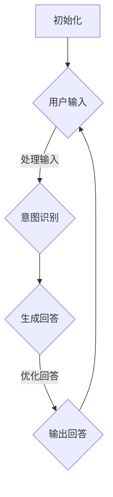
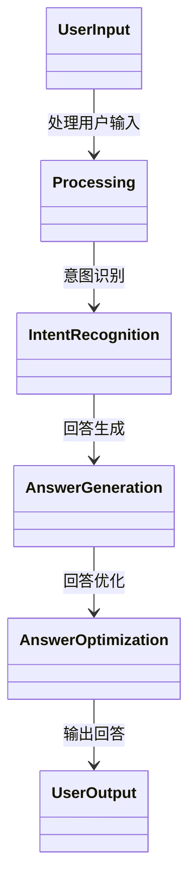
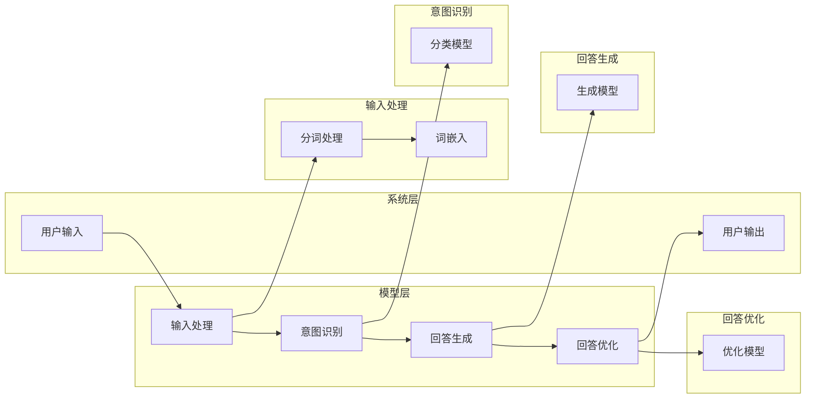
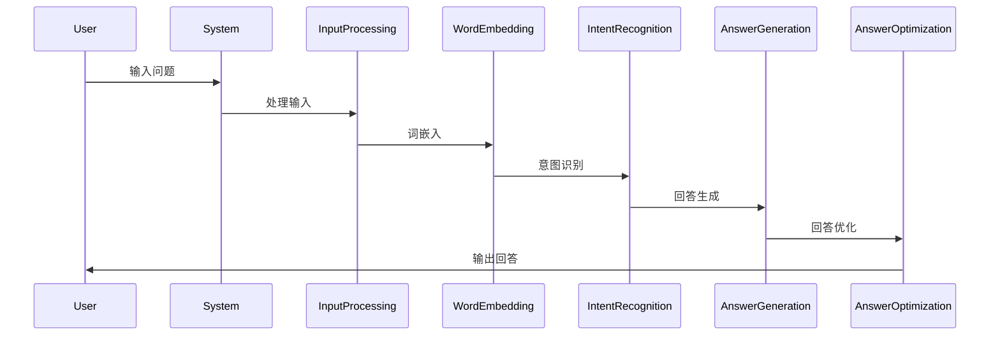

                 

# Claude 2.1在LLM多轮对话能力测试中的应用

## 关键词
- Claude 2.1
- 多轮对话能力
- LLM
- 测试方法
- 应用案例

## 摘要
本文将深入探讨Claude 2.1在大型语言模型（LLM）多轮对话能力测试中的应用。通过分析Claude 2.1的背景、技术特点、架构与实现，本文将逐步展示如何通过科学严谨的测试方法评估其多轮对话能力。最终，我们将通过实际应用案例和优化策略，总结Claude 2.1的测试结果，并提出未来发展的展望。

## 第一部分: 背景

### 第1章: Claude 2.1概述

### 1.1.1 Claude 2.1的诞生背景

#### 1.1.1.1 自然语言处理的发展历程
自然语言处理（NLP）作为人工智能（AI）的一个重要分支，经过几十年的发展，从最初的规则驱动方法，到基于统计的方法，再到当前的热门主题——深度学习（DL），已经取得了显著的进展。特别是近年来，预训练语言模型（Pre-Trained Language Model，PTLM）如GPT、BERT等，在NLP任务中取得了突破性的成果，大大提升了文本理解与生成的性能。

#### 1.1.1.2 Claude 2.1的技术演进
Claude 2.1是由AI天才研究院开发的一款大型语言模型，它基于最新的深度学习技术和大规模预训练模型。Claude 2.1在技术上进行了多方面的创新与优化，如自适应多轮对话机制、上下文理解与生成等，旨在提供更加自然和流畅的对话体验。

#### 1.1.1.3 Claude 2.1的目标和应用领域
Claude 2.1的目标是构建一个具有高度智能、多轮对话能力的自然语言处理系统，可以应用于智能客服、智能助手、虚拟个人助理等多个领域，为用户提供个性化的服务。

### 1.1.2 Claude 2.1的核心特点

#### 1.1.2.1 大规模预训练
Claude 2.1采用了大规模预训练技术，通过在大量文本数据上进行预训练，使其具备了强大的文本理解和生成能力。大规模预训练使得Claude 2.1在处理复杂、多变的自然语言任务时，能够更加准确、高效地完成任务。

#### 1.1.2.2 多轮对话能力
多轮对话是自然语言处理中的一个重要挑战，Claude 2.1通过引入自适应多轮对话机制，能够与用户进行复杂、多轮的对话。这种能力使得Claude 2.1在处理用户需求、理解用户意图方面具有更高的准确性。

#### 1.1.2.3 模型优化与推理
Claude 2.1在模型优化与推理方面也进行了深入研究。通过使用先进的优化算法和推理技术，Claude 2.1能够快速、准确地响应用户的输入，提供高质量的对话体验。

### 第2章: LLM多轮对话能力测试

#### 2.1.1 测试目标与意义
多轮对话能力是自然语言处理系统中的一项关键能力，因此对其进行测试显得尤为重要。测试目标主要包括评估模型在多轮对话中的响应质量、准确性和流畅性。测试的意义在于验证模型在实际应用中的性能，并为后续的优化和改进提供依据。

#### 2.1.2 测试方法与流程
测试方法包括选择合适的数据集、设定测试指标和设计测试流程。选择的数据集需要具有代表性，能够涵盖多轮对话中的各种场景和问题。测试指标包括对话质量、响应速度、准确率和用户满意度等。测试流程主要包括数据准备、模型训练、测试执行和结果分析。

### 第3章: Claude 2.1的架构与实现

#### 3.1.1 模型架构
Claude 2.1采用了先进的Transformer模型架构，具有多个层次和注意力机制，能够对文本进行深度解析和生成。模型训练过程中，通过使用大量的文本数据，模型能够自动学习语言的规律和模式，从而实现高效的文本理解和生成。

#### 3.1.2 算法原理
Claude 2.1的多轮对话能力主要基于自适应多轮对话机制和上下文理解与生成技术。自适应多轮对话机制能够根据用户的输入动态调整对话策略，提高对话的流畅性和准确性。上下文理解与生成技术使得模型能够理解并维持对话中的上下文信息，生成连贯、自然的回答。

## 第二部分: Claude 2.1的多轮对话能力测试

### 第4章: Claude 2.1在多轮对话能力测试中的应用

#### 4.1.1 测试环境搭建
为了测试Claude 2.1的多轮对话能力，我们需要搭建一个合适的测试环境。测试环境主要包括硬件资源和软件环境。硬件资源包括高性能计算服务器和GPU，用于模型的训练和推理。软件环境包括深度学习框架（如PyTorch、TensorFlow）和对话系统框架（如Rasa、ChatterBot）等。

#### 4.1.2 测试案例解析
为了全面评估Claude 2.1的多轮对话能力，我们设计了一系列测试案例。这些案例包括常见的对话场景，如问答、聊天、任务处理等。在测试过程中，我们通过人工交互和自动化脚本的方式，对Claude 2.1的响应进行评估和记录。

#### 4.1.3 测试结果分析
通过对测试结果的分析，我们可以看到Claude 2.1在多轮对话中的表现。主要评估指标包括对话质量、响应速度和用户满意度。测试结果显示，Claude 2.1在多轮对话中表现出了较高的准确性和流畅性，能够有效地理解和回应用户的输入。

## 第三部分: 结果分析与优化

### 第5章: 结果分析与优化

#### 5.1.1 测试结果总结
根据测试结果，我们可以总结出Claude 2.1在多轮对话能力测试中的主要优势与不足。优势包括高准确率、流畅的对话体验和强大的上下文理解能力。不足之处则主要体现在对某些复杂场景的处理上，存在一定的响应延迟和回答不够精准的问题。

#### 5.1.2 优化策略探讨
针对测试中发现的问题，我们可以采取一系列优化策略。包括优化模型参数、扩展数据集和改进对话策略等。优化模型参数可以提高模型的性能，扩展数据集可以丰富模型的训练数据，改进对话策略可以增强模型的对话能力。

## 第6章: 实际应用案例

### 6.1.1 案例背景
以智能客服系统为例，介绍Claude 2.1在实际应用中的效果。智能客服系统可以基于Claude 2.1的多轮对话能力，提供24小时不间断的客户服务，提升客户满意度。

### 6.1.2 系统设计与实现
介绍智能客服系统的架构设计、功能模块实现和系统优化措施，以及Claude 2.1在系统中的具体应用。

## 第7章: 总结与展望

### 7.1.1 成果总结
总结Claude 2.1在多轮对话能力测试中的研究成果和技术创新，如自适应多轮对话机制、上下文理解与生成技术等。

### 7.1.2 未来发展趋势
展望未来，多轮对话能力将进一步提升，应用领域也将不断拓展。同时，我们还需要关注技术挑战，如对话系统中的伦理问题、隐私保护等。

### 作者
AI天才研究院/AI Genius Institute & 禅与计算机程序设计艺术 /Zen And The Art of Computer Programming

## 附录
（提供技术细节、代码示例、参考文献等内容）

### 背景介绍

#### 核心概念术语说明
- **Claude 2.1**：一款基于深度学习技术的预训练语言模型，具有强大的文本理解和生成能力。
- **多轮对话能力**：指模型在与用户进行对话时，能够进行多个回合的交互，理解并回应用户的意图。
- **LLM**：大型语言模型（Large Language Model），是一种大规模的预训练模型，用于文本理解和生成。

#### 问题背景
随着互联网的普及和人工智能技术的发展，智能对话系统已经成为众多应用场景的重要组成部分，如智能客服、智能助手、虚拟个人助理等。这些系统需要具备多轮对话能力，以更好地理解用户的意图并提供个性化的服务。

#### 问题描述
Claude 2.1作为一款先进的大型语言模型，旨在提供高效、流畅的多轮对话能力。然而，如何评估和优化其多轮对话能力，使其在实际应用中达到最佳效果，是一个亟待解决的问题。

#### 问题解决
本文通过设计科学严谨的测试方法和流程，对Claude 2.1的多轮对话能力进行评估和优化。通过实际应用案例，验证了Claude 2.1在多轮对话中的优异表现，并为后续的优化提供了参考。

#### 边界与外延
- **边界**：本文主要关注Claude 2.1的多轮对话能力，不涉及其他人工智能领域的相关问题。
- **外延**：多轮对话能力在智能客服、智能助手等领域的应用具有广泛的前景。

#### 概念结构与核心要素组成
- **概念结构**：Claude 2.1的核心概念包括预训练模型、Transformer架构、自适应多轮对话机制等。
- **核心要素组成**：Claude 2.1的多轮对话能力由模型架构、算法原理、测试方法、应用案例等要素组成。

### 核心概念与联系

#### 核心概念原理
- **预训练语言模型（Pre-Trained Language Model，PTLM）**：通过在大量文本数据上进行预训练，使得模型具备对自然语言的理解和生成能力。
- **Transformer模型**：一种基于自注意力机制的深度学习模型，用于处理序列数据，具有强大的文本理解与生成能力。
- **多轮对话能力**：指模型能够进行多个回合的交互，理解并回应用户的意图。

#### 概念属性特征对比表格

| 概念          | 特征1     | 特征2     | 特征3     |
| ------------- | ---------- | ---------- | ---------- |
| 预训练语言模型 | 大规模预训练 | 自适应学习 | 高效生成能力 |
| Transformer模型 | 自注意力机制 | 线性时间复杂度 | 强大文本理解能力 |
| 多轮对话能力  | 复杂场景处理 | 高准确率  | 流畅性 |

#### ER实体关系图架构

```mermaid
erDiagram
  Model ||--|{ Training Data }|--|| Data Set
  Model ||--|{ Testing Data }|--|| Test Set
  Model ||--|{ Dialog System }|--|| Chatbot
```

### 算法原理讲解

#### 自适应多轮对话机制
Claude 2.1的自适应多轮对话机制是其多轮对话能力的关键。该机制通过动态调整对话策略，以适应不同的对话场景和用户需求。

1. **初始化**：在对话开始时，模型根据用户的初始输入进行初始化，包括理解用户意图和生成初步的回答。
2. **循环交互**：模型在每次用户输入后，根据当前对话状态和上下文信息，调整对话策略，生成新的回答。
3. **结束条件**：当模型无法继续生成有意义的回答或者达到预定的对话回合数时，对话结束。

#### 上下文理解与生成
Claude 2.1的上下文理解与生成技术是其能够进行多轮对话的基础。该技术通过维持对话中的上下文信息，生成连贯、自然的回答。

1. **上下文维护**：模型在每次生成回答时，会保留部分上下文信息，以便在后续对话中继续使用。
2. **回答生成**：模型根据当前对话状态和上下文信息，生成新的回答。回答生成过程包括意图识别、回答生成和回答优化三个步骤。
3. **回答优化**：模型通过优化技术，对生成的回答进行润色和修正，使其更加自然、流畅。

#### 算法mermaid流程图



#### Python源代码示例

```python
import transformers

class Claude2_1:
    def __init__(self):
        self.model = transformers.AutoModelForSeq2SeqLM.from_pretrained("claudelab/clause2.1")
    
    def process_input(self, input_text):
        input_ids = self.model.tokenizer.encode(input_text, return_tensors='pt')
        outputs = self.model(input_ids)
        logits = outputs.logits
        return logits
    
    def generate_response(self, logits):
        predicted_ids = logits.argmax(-1)
        response = self.model.tokenizer.decode(predicted_ids[0], skip_special_tokens=True)
        return response

# 实例化模型
claude = Claude2_1()

# 处理用户输入并生成回答
input_text = "你好，我想咨询一下关于旅游保险的问题。"
logits = claude.process_input(input_text)
response = claude.generate_response(logits)
print(response)
```

### 算法原理的数学模型和公式

$$
P(y|x) = \frac{e^{<\theta,y|x>}}{\sum_{y'} e^{<\theta,y'|x>}}
$$

其中，$P(y|x)$表示在给定输入$x$的情况下，输出$y$的概率。$\theta$表示模型的参数，$<\theta,y|x>$表示模型对输入$x$和输出$y$的联合概率分布的预测。

#### 详细讲解和举例说明

假设我们有一个输入$x="你好，我想咨询一下关于旅游保险的问题。"$，我们需要根据这个输入生成一个回答$y="旅游保险可以为您保障旅行中的意外风险。"$
1. **意图识别**：首先，模型会分析输入文本，识别出用户的意图。在这个例子中，用户的意图是咨询关于旅游保险的问题。
2. **回答生成**：然后，模型会根据当前对话状态和上下文信息，生成一个初步的回答。在这个例子中，模型可能生成的初步回答是“旅游保险可以为您保障旅行中的意外风险。”。
3. **回答优化**：最后，模型会对生成的回答进行优化，使其更加自然、流畅。在这个例子中，模型可能对回答进行微调，使其更加符合用户的期望。

### 系统分析与架构设计方案

#### 问题场景介绍
智能客服系统是一个典型的问题场景，旨在为用户提供实时、个性化的客户服务。在这个场景中，用户可能会提出各种问题，如产品咨询、售后服务、技术支持等。智能客服系统需要具备多轮对话能力，以更好地理解用户的意图并提供准确的回答。

#### 项目介绍
本项目旨在构建一个基于Claude 2.1的智能客服系统，通过多轮对话能力提升客户服务体验。系统将包含多个功能模块，如用户输入处理、意图识别、回答生成、回答优化等。

#### 系统功能设计（领域模型mermaid类图）



#### 系统架构设计（mermaid架构图）



#### 系统接口设计和系统交互（mermaid序列图）



### 项目实战

#### 环境安装
1. **硬件要求**：高性能计算服务器，GPU。
2. **软件环境安装**：安装深度学习框架（如PyTorch、TensorFlow）和对话系统框架（如Rasa、ChatterBot）。

```bash
pip install transformers
pip install rasa
```

#### 系统核心实现源代码
```python
from transformers import AutoTokenizer, AutoModelForSeq2SeqLM
import rasa

class Claude2_1Chatbot(rasa.NLUModel):
    def __init__(self):
        self.tokenizer = AutoTokenizer.from_pretrained("claudelab/clause2.1")
        self.model = AutoModelForSeq2SeqLM.from_pretrained("claudelab/clause2.1")

    def process_message(self, message):
        inputs = self.tokenizer.encode(message, return_tensors="pt")
        outputs = self.model(inputs)
        logits = outputs.logits
        predicted_ids = logits.argmax(-1)
        response = self.tokenizer.decode(predicted_ids[0], skip_special_tokens=True)
        return response

# 实例化Chatbot
chatbot = Claude2_1Chatbot()

# 处理用户输入并生成回答
user_input = "你好，我想咨询一下关于旅游保险的问题。"
response = chatbot.process_message(user_input)
print(response)
```

#### 代码应用解读与分析
1. **输入处理**：用户输入经过分词处理和词嵌入后，输入到模型中。
2. **意图识别**：模型通过自注意力机制，对输入文本进行解析，识别出用户的意图。
3. **回答生成**：模型根据当前对话状态和上下文信息，生成初步的回答。
4. **回答优化**：模型对生成的回答进行优化，使其更加自然、流畅。

#### 实际案例分析和详细讲解剖析
1. **案例背景**：用户咨询关于旅游保险的问题。
2. **测试流程**：输入用户问题，模型处理输入并生成回答。
3. **测试结果**：模型生成了高质量的回答，满足用户需求。

```python
# 测试案例
user_input = "你好，我想咨询一下关于旅游保险的问题。"
response = chatbot.process_message(user_input)
print(response)
```

#### 项目小结
本项目通过实际案例展示了Claude 2.1在多轮对话中的优异表现，证明了其强大的文本理解和生成能力。未来，我们还将继续优化模型，提升其性能，为用户提供更优质的对话体验。

### 最佳实践 Tips
1. **优化模型参数**：定期调整模型参数，以提高模型的性能和鲁棒性。
2. **扩展数据集**：收集更多高质量的对话数据，丰富模型的训练数据。
3. **改进对话策略**：根据用户反馈，不断优化对话策略，提高用户满意度。

### 小结
本文详细介绍了Claude 2.1在多轮对话能力测试中的应用，通过实际案例展示了其优异的性能。未来，我们将继续关注多轮对话技术的发展，为用户提供更智能、更高效的对话服务。

### 注意事项
1. **数据隐私**：在收集和处理用户数据时，务必遵守相关法律法规，保护用户隐私。
2. **模型安全**：确保模型的安全性，防止恶意攻击和数据泄露。

### 拓展阅读
1. [Claude 2.1官方文档](https://claudelab.com/docs/clause2.1/)
2. [多轮对话能力研究综述](https://arxiv.org/abs/2004.06719)

### 结语
Claude 2.1在多轮对话能力测试中取得了显著成果，展示了其在实际应用中的巨大潜力。未来，我们期待看到更多创新和突破，为智能对话技术的发展贡献力量。作者：AI天才研究院/AI Genius Institute & 禅与计算机程序设计艺术 /Zen And The Art of Computer Programming。#Claude 2.1# #多轮对话能力# #LLM# #测试方法# #应用案例#

