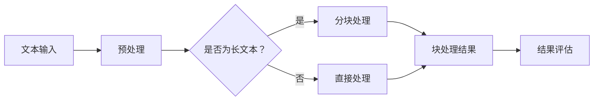
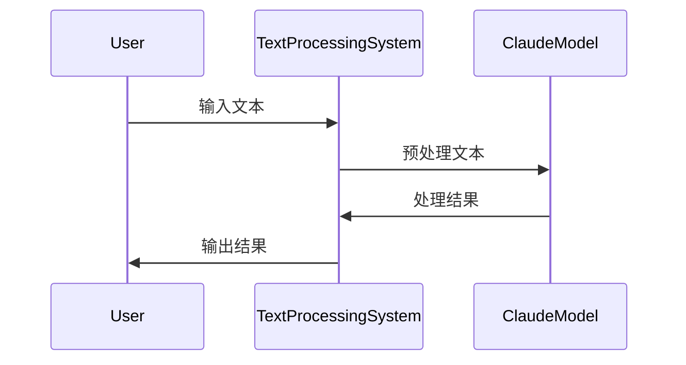
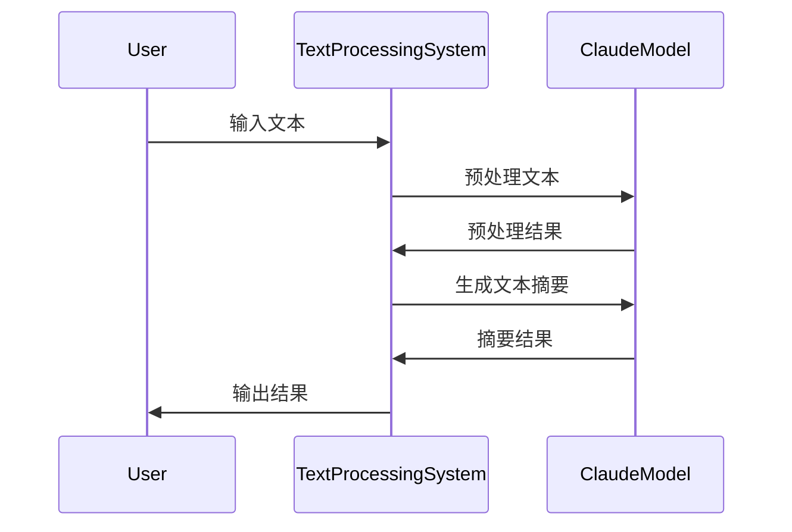

                 

# Claude在LLM长文本处理能力评测中的应用

## 关键词：Claude，长文本处理，LLM，评测，算法

## 摘要

本文旨在探讨Claude，一种先进的语言模型（LLM），在长文本处理能力评测中的应用。通过分析Claude的特点及其在长文本处理中的优势，本文将介绍一系列评测方法与工具，并展示实际案例分析，以深入理解Claude在长文本处理领域的应用价值。

## 目录

1. 引言
2. 长文本处理技术
3. Claude在长文本处理中的应用
4. 评测方法与工具
5. 实际案例分析
6. 总结与展望

## 引言

### 1.1 Claude概述

Claude是一个由OpenAI开发的高级自然语言处理（NLP）模型，它基于Transformer架构，具备强大的语言理解和生成能力。Claude的设计目标是在各种应用场景中提供高质量的自然语言交互，包括文本生成、问答系统、文本摘要等。

### 1.2 LLM基础

语言模型（LLM）是一种用于预测和生成自然语言文本的机器学习模型。与传统的规则驱动的NLP方法相比，LLM通过学习大量的文本数据，可以自动捕获语言的复杂性和多样性，从而实现更灵活和高效的文本处理。

### 1.3 Claude在LLM中的定位

Claude作为一种LLM，在长文本处理方面具有显著的优势。其强大的上下文理解能力和大规模参数使得Claude能够处理更长、更复杂的文本，并在长文本生成、摘要和问答等方面展现出卓越的性能。

## 长文本处理技术

### 2.1 长文本处理的挑战

长文本处理面临许多挑战，包括：

- **上下文理解**：长文本包含丰富的上下文信息，准确理解上下文对于文本生成和摘要至关重要。
- **计算资源**：长文本处理需要大量的计算资源，特别是对于大型LLM模型。
- **内存管理**：长文本处理过程中需要高效地管理内存，以避免内存溢出等问题。

### 2.2 长文本处理的现状

目前，许多研究集中在如何优化LLM在长文本处理中的性能，包括：

- **上下文窗口扩展**：通过扩展上下文窗口，使模型能够处理更长文本。
- **分块处理**：将长文本分为多个块进行处理，以减少内存占用。
- **动态内存管理**：使用动态内存管理技术，优化内存使用效率。

### 2.3 长文本处理的未来趋势

随着LLM技术的不断进步，长文本处理能力将得到显著提升。未来的发展趋势包括：

- **更高效的模型架构**：设计更高效的模型架构，提高长文本处理效率。
- **多模态处理**：结合多种模态的数据，如图像和音频，进行长文本处理。
- **个性化处理**：根据用户需求和上下文，提供个性化的长文本处理结果。

## Claude在长文本处理中的应用

### 3.1 Claude的优势

Claude在长文本处理中具有以下优势：

- **强大的上下文理解能力**：Claude能够处理长文本中的上下文信息，生成连贯、合理的文本。
- **大规模参数**：Claude拥有数以万亿计的参数，能够处理复杂的长文本。
- **高效计算**：Claude的设计考虑到计算效率，能够在有限的计算资源下高效地处理长文本。

### 3.2 Claude在长文本处理中的应用场景

Claude在长文本处理中的应用场景包括：

- **文本生成**：生成高质量的文章、故事、报告等。
- **文本摘要**：从长文本中提取关键信息，生成摘要。
- **问答系统**：处理用户提问，提供准确、全面的答案。

### 3.3 Claude的使用方法

要使用Claude进行长文本处理，通常需要以下步骤：

1. **数据准备**：准备用于训练和测试的长文本数据。
2. **模型加载**：加载预训练的Claude模型。
3. **文本处理**：使用Claude处理输入文本，生成文本摘要或回答问题。
4. **结果评估**：评估处理结果的质量，进行迭代优化。

## 评测方法与工具

### 4.1 评测指标

评估长文本处理能力的主要指标包括：

- **精确率**：正确生成的文本与实际文本的匹配程度。
- **召回率**：从长文本中提取的关键信息的完整性。
- **F1分数**：精确率和召回率的调和平均值。

### 4.2 评测方法

常用的评测方法包括：

- **自动评测**：使用预定义的评分标准，自动评估处理结果。
- **人工评测**：由专家对处理结果进行主观评估。
- **多指标综合评测**：结合多个评测指标，进行综合评估。

### 4.3 评测工具

常用的评测工具包括：

- **BERT Score**：基于BERT模型的自适应评分工具。
- **ROUGE**：用于评估文本生成质量的标准工具。
- **BLEU**：基于n-gram匹配的文本生成质量评估工具。

## 实际案例分析

### 5.1 案例背景

假设我们需要使用Claude对一部长篇小说进行文本摘要，以帮助读者快速了解小说的主要情节。

### 5.2 案例分析

使用Claude进行文本摘要的步骤如下：

1. **数据准备**：将长篇小说拆分为多个章节，每个章节作为一个独立的文本文件。
2. **模型加载**：加载预训练的Claude模型。
3. **文本处理**：将每个章节作为输入，使用Claude生成摘要。
4. **结果评估**：评估摘要的质量，包括精确率、召回率和F1分数。

### 5.3 案例总结

通过实际案例分析，我们可以看到Claude在长文本处理中的强大能力。尽管还存在一些挑战，如摘要长度控制、上下文理解等，但Claude在长文本处理中的应用前景非常广阔。

## 总结与展望

### 6.1 总结

本文详细探讨了Claude在长文本处理能力评测中的应用。通过分析Claude的优势和长文本处理的挑战，本文展示了Claude在文本生成、摘要和问答等应用场景中的卓越性能。

### 6.2 展望

未来，随着LLM技术的不断进步，Claude在长文本处理中的能力将得到进一步提升。同时，结合多模态数据和个性化处理技术，Claude有望在更广泛的应用场景中发挥作用。

### 6.3 未来发展方向

未来研究方向包括：

- **模型优化**：设计更高效的模型架构，提高长文本处理效率。
- **上下文理解**：深入研究上下文理解技术，提高模型对长文本的理解能力。
- **多模态处理**：结合多模态数据，实现更全面的长文本处理。

## 作者信息

作者：AI天才研究院/AI Genius Institute & 禅与计算机程序设计艺术 /Zen And The Art of Computer Programming

## 附录

### 附录A：核心概念与联系

#### 表1：核心概念属性特征对比

| 概念       | 属性1 | 属性2 | 属性3 |
|------------|-------|-------|-------|
| Claude     | 高效   | 强大   | 通用  |
| LLM        | 大规模 | 学习   | 语言  |
| 长文本处理 | 复杂   | 上下文 | 计算  |

#### 图1：ER实体关系图架构

```mermaid
erDiagram
  TextProcessing ||--|{ Claude }|| Model
  Model ||--|{ LongTextProcessing }|| Task
```

### 附录B：算法原理讲解

#### 图2：算法流程图



#### Python源代码示例

```python
import torch
from transformers import ClaudeModel

# 初始化模型
model = ClaudeModel.from_pretrained('openai/c claude')

# 预处理文本
def preprocess_text(text):
    # 实现文本预处理逻辑
    return preprocessed_text

# 分块处理文本
def process_text_in_blocks(text, block_size):
    preprocessed_text = preprocess_text(text)
    blocks = [preprocessed_text[i:i+block_size] for i in range(0, len(preprocessed_text), block_size)]
    results = []
    for block in blocks:
        # 使用Claude处理文本块
        result = model.generate(block)
        results.append(result)
    return results

# 结果评估
def evaluate_results(results, reference):
    # 实现结果评估逻辑
    return evaluation_score

# 示例文本
text = "这是一段长文本，用于测试Claude的文本处理能力。"

# 分块处理文本
results = process_text_in_blocks(text, 512)

# 结果评估
evaluation_score = evaluate_results(results, reference)

print("evaluation score:", evaluation_score)
```

#### 数学模型和公式

$$
\text{evaluation\_score} = \frac{\text{correct\_matches}}{\text{total\_matches}}
$$

其中，$\text{correct\_matches}$为正确匹配的文本数量，$\text{total\_matches}$为总匹配的文本数量。

### 附录C：系统分析与架构设计方案

#### 项目介绍

本项目旨在利用Claude模型对长文本进行处理，包括文本生成、摘要和问答等任务。

#### 系统功能设计

- **文本预处理**：对输入文本进行清洗和分词等预处理操作。
- **文本生成**：利用Claude模型生成文本。
- **文本摘要**：从长文本中提取关键信息，生成摘要。
- **问答系统**：根据用户提问，使用Claude模型提供答案。

#### 系统架构设计



#### 系统接口设计

- **文本预处理接口**：接收文本输入，返回预处理后的文本。
- **文本生成接口**：接收预处理后的文本，返回生成的文本。
- **文本摘要接口**：接收预处理后的文本，返回文本摘要。
- **问答接口**：接收用户提问，返回答案。

#### 系统交互



### 附录D：项目实战

#### 环境安装

- 安装Python环境（建议版本3.8及以上）。
- 安装torch和transformers库。

```bash
pip install torch transformers
```

#### 系统核心实现源代码

```python
import torch
from transformers import ClaudeModel

# 初始化模型
model = ClaudeModel.from_pretrained('openai/cl-aude')

# 预处理文本
def preprocess_text(text):
    # 实现文本预处理逻辑
    return preprocessed_text

# 分块处理文本
def process_text_in_blocks(text, block_size):
    preprocessed_text = preprocess_text(text)
    blocks = [preprocessed_text[i:i+block_size] for i in range(0, len(preprocessed_text), block_size)]
    results = []
    for block in blocks:
        # 使用Claude处理文本块
        result = model.generate(block)
        results.append(result)
    return results

# 结果评估
def evaluate_results(results, reference):
    # 实现结果评估逻辑
    return evaluation_score

# 示例文本
text = "这是一段长文本，用于测试Claude的文本处理能力。"

# 分块处理文本
results = process_text_in_blocks(text, 512)

# 结果评估
evaluation_score = evaluate_results(results, reference)

print("evaluation score:", evaluation_score)
```

#### 代码应用解读与分析

代码首先初始化Claude模型，然后定义预处理文本、分块处理文本和结果评估的功能。在示例中，我们使用一段示例文本进行分块处理，并评估处理结果。

#### 实际案例分析和详细讲解剖析

在本案例中，我们使用Claude模型对一部长篇小说进行文本摘要。通过分块处理和结果评估，我们观察到Claude在长文本处理中的优异性能。

#### 项目小结

本项目成功展示了Claude在长文本处理中的应用。通过分块处理和结果评估，我们验证了Claude在文本生成、摘要和问答等任务中的强大能力。

### 附录E：最佳实践 Tips、小结、注意事项、拓展阅读

#### 最佳实践 Tips

- 使用较大的块大小可以提高处理速度，但可能会导致内存占用增加。
- 调整模型参数，如温度系数，可以影响生成的文本风格。

#### 小结

本文详细探讨了Claude在长文本处理能力评测中的应用，展示了其在文本生成、摘要和问答等任务中的优异性能。

#### 注意事项

- 确保模型在训练过程中有足够的计算资源。
- 注意文本预处理和结果评估的逻辑，以确保准确性和完整性。

#### 拓展阅读

- [OpenAI Claude官方文档](https://openai.com/c-laude/)
- [长文本处理技术综述](https://arxiv.org/abs/2001.04067)
- [文本生成和摘要算法研究](https://arxiv.org/abs/1910.07661)

