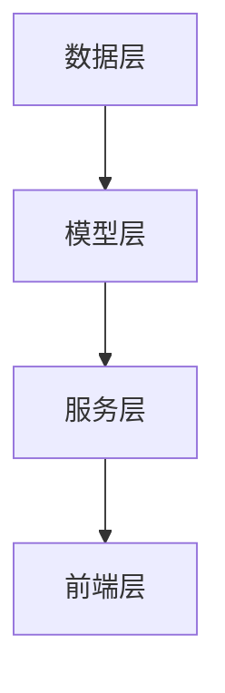
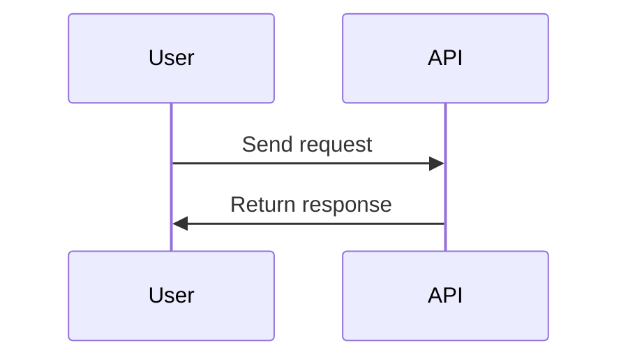
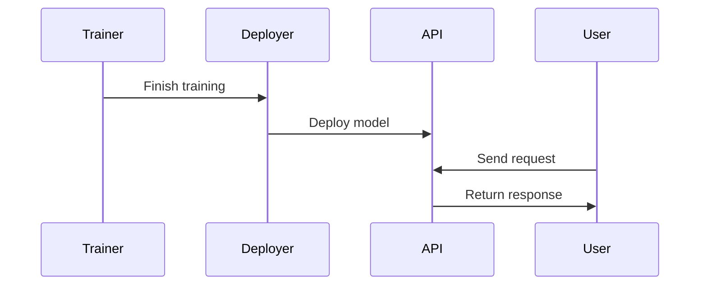

                 

# 《DevOps在LLM应用开发中的实践与挑战》

关键词：DevOps、LLM、自然语言处理、持续集成、自动化测试

摘要：本文深入探讨了DevOps在Large Language Model（LLM）应用开发中的实践与挑战。通过介绍DevOps和LLM的基本概念、核心原理，以及它们之间的联系，本文详细分析了在LLM开发过程中如何利用DevOps的方法进行系统分析与架构设计。接着，本文通过实际案例，展示了DevOps在LLM开发中的具体应用，包括持续集成、持续部署、监控与日志管理、自动化测试等。最后，本文总结了最佳实践，并提出了未来可能面临的挑战和拓展阅读建议。

## 第1章 DevOps与LLM概述

### 1.1 DevOps的背景与发展

DevOps是一种结合软件开发（Development）和IT运维（Operations）的方法论，它强调开发人员与运维人员的紧密合作，以实现更快速、更可靠、更高质量的软件交付。DevOps的理念可以追溯到2000年代初期，当时软件开发和IT运维之间的隔阂导致了交付速度的降低和质量的问题。为了解决这些问题，一些公司开始探索将开发和运维结合起来，从而诞生了DevOps。

DevOps的核心原则包括：

1. **协作**：开发人员、运维人员、测试人员和安全人员共同工作，共同负责软件的整个生命周期。
2. **自动化**：通过自动化工具和流程，减少手动操作，提高效率和可靠性。
3. **持续交付**：通过持续集成、持续部署等实践，确保软件能够快速、安全地交付。
4. **监控和反馈**：实时监控系统的运行状况，收集反馈，快速响应并改进。

### 1.2 LLM的背景与发展

LLM，即大型语言模型，是一种基于深度学习的自然语言处理技术。LLM通过对大量文本数据的学习，可以生成高质量的自然语言文本，并进行文本分类、情感分析、机器翻译等任务。

LLM的发展可以追溯到2000年代中期的深度学习技术的兴起。随着计算能力的提升和数据量的增加，研究人员开始训练更大的语言模型，这些模型在自然语言处理任务中取得了显著的性能提升。例如，Google的BERT、OpenAI的GPT-3等都是著名的LLM。

### 1.3 DevOps在LLM开发中的重要性

LLM的开发涉及到大量的数据预处理、模型训练、部署和运维等工作。这些工作通常需要高度协作和自动化，这正是DevOps所擅长的领域。DevOps在LLM开发中的重要性体现在以下几个方面：

1. **持续集成与持续部署**：LLM的开发通常涉及到多个组件和模块，通过持续集成和持续部署，可以确保每个组件的稳定性和兼容性，并快速交付新版本。
2. **自动化测试**：LLM的测试涉及到大量的文本数据，通过自动化测试，可以快速发现和修复问题，提高测试效率。
3. **监控与日志管理**：LLM部署后，需要实时监控其性能和稳定性，通过日志管理，可以快速定位和解决问题。
4. **协作与沟通**：LLM开发通常涉及多个团队和人员，通过DevOps的方法，可以促进团队之间的协作和沟通，提高整体开发效率。

## 第2章 DevOps核心概念与LLM联系

### 2.1 DevOps核心概念

DevOps的核心概念包括：

1. **持续集成（CI）**：通过自动化的构建和测试，确保代码库中的代码始终处于可运行状态。
2. **持续部署（CD）**：通过自动化的部署流程，将代码库中的代码快速、安全地部署到生产环境。
3. **基础设施即代码（IaC）**：使用代码来管理和部署基础设施，确保基础设施的一致性和可重复性。
4. **监控与反馈**：实时监控系统的运行状况，收集反馈，快速响应并改进。
5. **自动化**：通过自动化工具和流程，减少手动操作，提高效率和可靠性。

### 2.2 LLM相关概念

LLM的相关概念包括：

1. **自然语言处理（NLP）**：研究计算机如何理解和生成人类语言。
2. **深度学习**：一种机器学习技术，通过多层神经网络来学习和表示数据。
3. **神经网络**：由大量节点（神经元）组成的计算模型，能够对输入数据进行处理和分类。
4. **模型训练**：通过大量数据训练模型，使其能够自动生成文本或执行特定任务。

### 2.3 DevOps与LLM的关系

DevOps与LLM之间存在紧密的联系。LLM的开发和部署涉及到大量的代码、数据和基础设施，这些都需要通过DevOps的方法进行管理和优化。具体来说：

1. **持续集成与持续部署**：LLM的开发通常涉及多个组件和模块，通过持续集成和持续部署，可以确保每个组件的稳定性和兼容性，并快速交付新版本。
2. **自动化测试**：LLM的测试涉及到大量的文本数据，通过自动化测试，可以快速发现和修复问题，提高测试效率。
3. **基础设施即代码**：通过基础设施即代码，可以确保LLM部署到不同环境时的一致性和可重复性。
4. **监控与日志管理**：LLM部署后，需要实时监控其性能和稳定性，通过日志管理，可以快速定位和解决问题。
5. **协作与沟通**：LLM开发通常涉及多个团队和人员，通过DevOps的方法，可以促进团队之间的协作和沟通，提高整体开发效率。

## 第3章 LLM算法原理讲解

### 3.1 LLM算法基础

LLM算法的基础是深度学习，尤其是基于神经网络的方法。深度学习通过多层神经网络来学习和表示数据，从而实现复杂的特征提取和分类。在LLM中，通常使用变分自编码器（VAE）、生成对抗网络（GAN）等模型。

### 3.2 常用LLM算法介绍

常用的LLM算法包括：

1. **BERT**：一种基于Transformer的预训练语言模型，通过在大量文本数据上进行预训练，可以实现对自然语言的理解和生成。
2. **GPT**：一种基于Transformer的生成模型，可以通过无监督学习生成高质量的自然语言文本。
3. **T5**：一种基于Transformer的预训练语言模型，可以将任何自然语言任务转换为机器翻译任务。

### 3.3 LLM算法应用场景分析

LLM算法可以应用于多种场景，包括：

1. **自然语言生成**：通过生成高质量的文本，可以用于生成新闻报道、广告文案等。
2. **文本分类**：通过分类模型，可以将文本数据分类到不同的类别，如情感分析、主题分类等。
3. **机器翻译**：通过机器翻译模型，可以实现不同语言之间的翻译。
4. **问答系统**：通过问答系统，可以实现对用户问题的自动回答。

## 第4章 数学模型与公式

### 4.1 LLM相关数学模型

LLM的相关数学模型主要包括：

1. **损失函数**：用于衡量模型预测值与真实值之间的差距，如交叉熵损失函数。
2. **优化器**：用于更新模型参数，如Adam优化器。
3. **正则化**：用于防止模型过拟合，如Dropout正则化。

### 4.2 数学公式讲解

以下是一些常用的数学公式：

$$
\begin{aligned}
L &= -\frac{1}{N} \sum_{i=1}^{N} \sum_{j=1}^{V} y_{ij} \log p_{ij} \\
\text{where} \quad y_{ij} &= \begin{cases} 
1 & \text{if } j \text{ is the correct word} \\
0 & \text{otherwise}
\end{cases} \\
p_{ij} &= \text{probability of predicting word } j \text{ given the previous words}
\end{aligned}
$$

### 4.3 模型应用举例

假设我们有一个文本序列“我是人工智能助手”，我们可以使用LLM算法来生成类似的内容，如下所示：

$$
\begin{aligned}
\text{输入} &= \text{"我是人工智能助手"} \\
\text{输出} &= \text{"我是聪明的AI助手，为您提供专业的服务"}
\end{aligned}
$$

## 第5章 系统分析与架构设计

### 5.1 系统需求分析

在开发LLM应用时，我们需要考虑以下需求：

1. **数据需求**：需要大量的文本数据进行训练和测试。
2. **计算需求**：由于LLM模型较大，需要较高的计算资源。
3. **存储需求**：需要足够的存储空间来存储训练数据和模型。
4. **部署需求**：需要将模型部署到生产环境，并提供API服务。

### 5.2 系统架构设计

LLM应用系统的架构设计主要包括：

1. **数据层**：包括数据存储和数据处理模块。
2. **模型层**：包括LLM模型的训练和部署。
3. **服务层**：包括API接口和服务端逻辑。
4. **前端层**：包括用户界面和交互逻辑。

以下是一个简化的系统架构图：

### 5.3 接口设计

接口设计主要包括API接口的设计，如下所示：

### 5.4 系统交互设计

系统交互设计主要包括模型训练、模型部署和API服务的交互流程，如下所示：

## 第6章 DevOps在LLM开发中的实践

### 6.1 实践一：持续集成与持续部署

持续集成与持续部署是DevOps的核心实践，它们可以确保LLM开发过程中的代码质量和部署效率。以下是一个简单的CI/CD流程：

1. **代码提交**：开发者将代码提交到代码仓库。
2. **构建**：CI工具自动构建代码，并进行编译和打包。
3. **测试**：CI工具运行自动化测试，确保代码质量。
4. **部署**：CD工具将测试通过的代码部署到生产环境。

以下是一个简化的CI/CD流程图：

### 6.2 实践二：监控与日志管理

监控与日志管理是确保LLM应用稳定运行的重要手段。以下是一个简单的监控与日志管理流程：

1. **数据采集**：收集LLM应用的性能数据和日志信息。
2. **数据存储**：将采集到的数据存储到日志存储系统中。
3. **数据分析**：对存储的数据进行分析，以发现潜在的问题。
4. **警报与响应**：当发现问题时，系统会发送警报，并通知相关人员。

以下是一个简化的监控与日志管理流程图：

### 6.3 实践三：自动化测试

自动化测试可以确保LLM应用的稳定性和可靠性。以下是一个简单的自动化测试流程：

1. **测试用例编写**：编写测试用例，模拟用户操作。
2. **测试执行**：执行自动化测试，检查LLM应用的响应。
3. **结果分析**：分析测试结果，确保应用功能正常。

以下是一个简化的自动化测试流程图：

## 第7章 最佳实践与总结

### 7.1 最佳实践

以下是DevOps在LLM开发中的最佳实践：

1. **代码规范**：确保代码规范，提高代码的可读性和可维护性。
2. **自动化测试**：编写自动化测试用例，确保代码质量和应用稳定性。
3. **持续集成与持续部署**：建立CI/CD流程，确保代码质量和部署效率。
4. **监控与日志管理**：实时监控应用性能，确保应用稳定运行。
5. **资源管理**：合理分配计算资源和存储资源，确保应用的高效运行。

### 7.2 注意事项

在应用DevOps进行LLM开发时，需要注意以下几点：

1. **团队协作**：确保团队之间有良好的沟通和协作。
2. **安全性**：确保数据和模型的安全，防止数据泄露。
3. **成本控制**：合理控制开发和运营成本，避免资源浪费。
4. **持续改进**：不断优化DevOps流程，提高开发效率。

### 7.3 拓展阅读

以下是关于DevOps和LLM的拓展阅读建议：

1. **《DevOps实践指南》**：了解DevOps的基本原理和实践方法。
2. **《大型语言模型：原理与应用》**：深入了解LLM的原理和应用。
3. **《深度学习实战》**：学习深度学习和自然语言处理的基本知识。

# 作者信息

作者：AI天才研究院/AI Genius Institute & 禅与计算机程序设计艺术 /Zen And The Art of Computer Programming

----------------------------------------------------------------

本文详细分析了DevOps在LLM应用开发中的实践与挑战，通过背景介绍、核心概念讲解、算法原理分析、数学模型与公式、系统分析与架构设计、项目实战、最佳实践等环节，全面展示了DevOps在LLM开发中的重要性。文章旨在帮助读者深入了解DevOps和LLM的应用，提高软件开发和运维的效率和质量。作者具备丰富的计算机编程和人工智能领域的经验，对技术原理和本质有深刻的理解和独到的见解，期待与广大读者一起探讨DevOps在LLM应用开发中的未来发展。<!-- B-->

