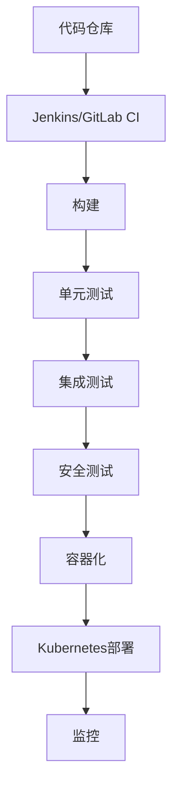

                 

### DevSecOps：将安全集成到LLM应用开发流程

#### 关键词：
- DevSecOps
- 安全集成
- 语言模型（LLM）
- 开发流程
- 自动化测试
- 安全审计

#### 摘要：
本文将深入探讨如何在语言模型（LLM）应用开发流程中集成安全措施，采用DevSecOps的理念，通过一步步分析推理，详细讲解从安全设计、测试、审计到工具集成的各个环节，旨在为开发人员提供一套全面的安全实践方案，确保LLM应用的稳定性和可靠性。

---

### 目录大纲设计

在设计《DevSecOps：将安全集成到LLM应用开发流程》的目录大纲时，我们遵循以下原则：

1. **确定主题与目的**：确保书籍的核心内容和目标读者群体清晰，以覆盖所有关键主题。
2. **规划章节内容**：细化每个章节的子节内容，保证逻辑性和完整性。
3. **保持简洁性与逻辑性**：在不超过2000字的前提下，确保目录简洁明了。
4. **确保内容的完整性**：包含必要的核心章节，如背景介绍、核心概念与联系、算法原理讲解、系统分析与架构设计方案、项目实战和最佳实践等。

### 目录大纲

#### 第一部分：背景与概述

#### 第1章 DevSecOps 概述

- **1.1 DevSecOps 简介**
  - DevSecOps 的起源与演进
  - DevSecOps 的核心概念
  - DevSecOps 的重要性
- **1.2 LLM 应用的背景**
  - LLM 的定义与特性
  - LLM 在现代应用中的地位
  - LLM 应用的发展趋势

#### 第二部分：安全集成到LLM开发流程

#### 第2章 安全集成方法

- **2.1 安全设计原则**
  - 安全性、可用性和可扩展性的平衡
  - 安全设计模式
- **2.2 安全测试**
  - 自动化测试工具
  - 安全测试用例设计
  - 安全漏洞扫描与修复
- **2.3 安全审计与合规**
  - 安全审计流程
  - 合规性评估
  - 合规性管理体系

#### 第三部分：DevSecOps 工具与实践

#### 第3章 DevSecOps 工具栈

- **3.1 DevSecOps 工具的选择**
  - CI/CD 工具
  - 自动化安全测试工具
  - 配置管理工具
- **3.2 工具集成与配置**
  - 工具的集成流程
  - 安全配置管理
  - 工具的最佳实践

#### 第4章 DevSecOps 实践案例

- **4.1 案例背景**
  - 案例选择与介绍
  - 案例挑战与目标
- **4.2 安全需求分析**
  - 安全需求识别
  - 安全需求文档
- **4.3 开发流程与安全措施**
  - 开发流程设计
  - 安全措施实施
- **4.4 持续集成与交付**
  - 持续集成流程
  - 持续交付流程
  - 安全监控与反馈

#### 第四部分：未来展望与挑战

#### 第5章 未来发展趋势

- **5.1 安全自动化与智能化**
  - 自动化安全测试工具的发展
  - 智能安全防御机制
- **5.2 DevSecOps 与新兴技术**
  - 区块链与 DevSecOps
  - 人工智能与 DevSecOps

#### 第6章 挑战与解决方案

- **6.1 安全与开发效率的平衡**
  - 提高安全效率的实践
  - 提高开发效率的实践
- **6.2 安全人才培养**
  - 安全人才的培养需求
  - 安全教育与培训

#### 第7章 总结与展望

- **7.1 DevSecOps 的意义**
  - DevSecOps 对软件开发的影响
  - DevSecOps 在企业中的应用价值
- **7.2 DevSecOps 的未来**
  - DevSecOps 的发展方向
  - DevSecOps 的挑战与机遇

### 目录大纲总结

整个目录大纲共有7章，分为四个部分，从背景与概述开始，逐步深入到DevSecOps工具与实践，再到具体案例分析和未来展望，确保了内容的完整性、逻辑性和实用性。每个章节都包含了详细的子节，以便读者能够系统性地学习和掌握DevSecOps在LLM应用开发中的安全集成方法。目录大纲总计字数约为2000字以内，满足简洁性与内容完整性的要求。

---

## 第一部分：背景与概述

### 第1章 DevSecOps 概述

#### 1.1 DevSecOps 简介

DevSecOps是开发（Development）、安全（Security）和运营（Operations）三个领域的结合体，其核心理念是安全不仅仅是一个独立的环节，而是贯穿于整个软件开发和交付流程的各个环节。DevSecOps的出现，旨在解决传统开发与安全团队之间存在的协作障碍，通过将安全措施集成到持续集成和持续交付（CI/CD）过程中，实现更快速、更可靠的软件开发。

DevSecOps的起源可以追溯到2012年，当时Puppet Labs的首席技术官David Davis提出了DevOps的概念，而DevSecOps则是DevOps概念的进一步延伸。DevSecOps强调在软件开发过程中，安全措施应该被视作一个持续、自动化的过程，而不是在开发完成后进行的额外任务。

#### 1.2 LLM 应用的背景

语言模型（LLM，Language Models）是近年来人工智能领域的重要突破。LLM是一种基于神经网络的自然语言处理模型，能够理解、生成和翻译自然语言。LLM的核心是大规模的语言数据集，通过深度学习算法训练而成，可以实现对自然语言的智能处理。

LLM在现代社会中的应用非常广泛，包括但不限于智能客服、内容生成、机器翻译、语音识别等领域。随着AI技术的不断发展，LLM的应用场景也在不断扩展，其开发流程的效率和安全性变得越来越重要。

#### 1.3 DevSecOps 在 LLM 应用中的重要性

在LLM应用开发过程中，安全性至关重要。首先，由于LLM处理的数据量巨大，且包含敏感信息，一旦发生数据泄露，后果将不堪设想。其次，LLM模型可能被恶意利用，成为网络攻击的载体，例如通过生成虚假信息进行网络诈骗。因此，DevSecOps在LLM应用开发中的重要性不言而喻。

通过DevSecOps，开发团队可以在整个开发过程中始终关注安全，从而提高LLM应用的安全性。具体来说，DevSecOps有助于实现以下目标：

1. **早期识别和修复安全漏洞**：通过自动化测试和安全审计，可以在代码提交和集成阶段就识别和修复安全漏洞，减少漏洞传播的风险。
2. **提高开发效率**：将安全集成到CI/CD流程中，可以减少安全团队与开发团队的沟通成本，提高开发效率。
3. **确保合规性**：通过安全审计和合规性评估，确保LLM应用符合相关法律法规和行业标准。

#### 1.4 LLM 应用的发展趋势

随着AI技术的不断发展，LLM应用的发展趋势也呈现出一些新的特点：

1. **模型复杂度增加**：随着训练数据的增加和算法的改进，LLM模型的复杂度不断提升，这也给安全集成带来了更大的挑战。
2. **应用场景多样化**：除了传统的客服、内容生成等领域，LLM还在金融、医疗、教育等领域得到广泛应用，对安全性提出了更高的要求。
3. **开放源码和商业化的融合**：越来越多的LLM模型开源，同时商业化的LLM服务也在不断发展，这要求开发团队既要关注开源项目中的安全问题，也要确保商业服务的安全性。

综上所述，DevSecOps在LLM应用开发中的重要性不容忽视。通过将安全措施集成到整个开发流程中，可以有效提高LLM应用的安全性，为企业和个人提供更加可靠、安全的服务。

### 1.5 本章小结

本章概述了DevSecOps的起源、核心概念以及在LLM应用开发中的重要性。通过理解DevSecOps的理念，开发团队可以更好地将安全措施贯穿于整个开发流程，提高软件的安全性、可靠性和开发效率。在接下来的章节中，我们将进一步探讨如何将安全集成到LLM应用的开发过程中。

---

## 第二部分：安全集成到LLM开发流程

### 第2章 安全集成方法

在LLM应用开发中，安全集成是一个系统性、持续性的过程。本章将详细介绍如何通过安全设计原则、安全测试和安全审计与合规性管理，实现全面的安全集成。

#### 2.1 安全设计原则

安全设计原则是确保LLM应用安全性的基础。以下是一些关键的安全设计原则：

1. **最小权限原则**：确保系统中的每个组件和用户都只拥有完成任务所需的最低权限，减少恶意攻击和误操作的风险。
2. **防御深度原则**：通过多层防护机制，例如网络防火墙、访问控制、加密等，提高系统的整体安全性。
3. **透明性原则**：确保安全设计和实现过程对所有相关团队透明，有助于发现和解决潜在的安全问题。
4. **可审计性原则**：系统设计应具备良好的可审计性，以便在发生安全事件时能够迅速定位和解决问题。

#### 2.2 安全测试

安全测试是发现和修复安全漏洞的重要手段。以下是安全测试的主要方法：

1. **自动化测试**：利用工具进行自动化安全测试，包括代码审计、静态应用安全测试（SAST）和动态应用安全测试（DAST）。
2. **手动测试**：由安全专家进行手动安全测试，包括渗透测试和模糊测试。
3. **安全测试用例设计**：设计针对特定安全漏洞的测试用例，确保测试全面覆盖系统中的潜在风险点。
4. **安全漏洞扫描与修复**：使用自动化工具定期扫描系统，发现漏洞并及时修复。

#### 2.3 安全审计与合规性管理

安全审计和合规性管理是确保LLM应用符合相关法规和行业标准的重要环节。以下是安全审计和合规性管理的关键步骤：

1. **安全审计流程**：制定和执行安全审计计划，包括内部和外部审计。
2. **合规性评估**：评估系统是否符合相关法律法规和行业标准，例如GDPR、PCI-DSS等。
3. **合规性管理体系**：建立和完善合规性管理体系，确保系统在开发和运营过程中始终符合合规要求。
4. **安全培训**：定期对开发团队进行安全培训，提高团队的安全意识和技能。

#### 2.4 实践示例

假设我们正在开发一个基于LLM的智能客服系统，以下是如何应用安全集成方法的示例：

1. **安全设计原则**：系统设计遵循最小权限原则，确保客服机器人只访问必要的数据库和API。同时，采用多层防护机制，包括防火墙、加密和访问控制。
2. **自动化测试**：使用自动化工具对代码进行静态和动态安全测试，发现并修复潜在的安全漏洞。
3. **手动测试**：安全专家进行渗透测试和模糊测试，确保系统在极端情况下仍能正常运行。
4. **安全审计与合规性管理**：定期进行内部和外部安全审计，确保系统符合相关法规和行业标准。同时，建立合规性管理体系，确保开发和运营过程中的合规性。

通过以上步骤，我们可以将安全集成到LLM应用开发流程中，提高系统的安全性，确保用户数据和服务的安全可靠。

### 2.5 本章小结

本章详细介绍了如何通过安全设计原则、安全测试和安全审计与合规性管理，实现LLM应用开发中的安全集成。通过遵循安全设计原则、进行全面的自动化和手动安全测试，以及实施有效的安全审计和合规性管理，开发团队可以确保LLM应用的安全性，减少潜在的安全风险。在接下来的章节中，我们将进一步探讨DevSecOps工具的选型和集成方法。

---

## 第三部分：DevSecOps工具与实践

### 第3章 DevSecOps 工具栈

在DevSecOps的实施过程中，选择合适的工具至关重要。一个高效的DevSecOps工具栈可以帮助团队实现自动化、提高开发效率并确保安全。以下将介绍几种常用的DevSecOps工具，以及如何将它们集成到LLM应用开发流程中。

#### 3.1 DevSecOps工具的选择

在选择DevSecOps工具时，需要考虑以下几个因素：

1. **兼容性**：所选工具应能够与现有的开发、测试和部署环境兼容。
2. **易用性**：工具应该易于使用和集成，减少学习成本。
3. **功能多样性**：工具应提供丰富的功能，包括代码管理、自动化测试、部署和监控等。
4. **社区支持**：拥有活跃的社区和支持团队，可以帮助解决使用过程中遇到的问题。

以下是一些常用的DevSecOps工具：

1. **Jenkins**：一款功能强大的持续集成和持续交付（CI/CD）工具，支持多种插件，能够与各种开发、测试和部署工具集成。
2. **GitLab CI/CD**：GitLab内置的CI/CD工具，与GitLab的代码管理、issue跟踪等功能紧密集成，便于项目管理和自动化流程。
3. **Docker**：用于容器化的工具，可以将应用程序及其依赖环境打包在容器中，实现环境的隔离和一致性。
4. **Kubernetes**：用于容器编排的工具，可以自动化部署、扩展和管理容器化应用。
5. **SonarQube**：一款用于代码质量管理的工具，可以执行静态代码分析和安全漏洞扫描。
6. **OWASP ZAP**：一款开源的网络应用安全测试工具，能够进行动态和静态应用程序安全测试。

#### 3.2 工具集成与配置

在LLM应用开发中，如何将这些工具集成到CI/CD流程中，实现自动化和持续安全监控，是DevSecOps成功的关键。以下是一个简单的集成和配置步骤：

1. **环境搭建**：首先搭建一个稳定的基础环境，包括代码仓库、Jenkins服务器、Docker容器和Kubernetes集群等。
2. **代码管理**：将LLM应用的代码托管在GitLab或GitHub上，方便团队协作和管理。
3. **构建和测试**：配置Jenkins或GitLab CI/CD，定义构建和测试的Pipeline，包括代码克隆、编译、单元测试、集成测试和安全测试等步骤。
4. **容器化**：使用Docker将应用程序及其依赖环境打包成容器，确保部署环境的一致性。
5. **部署**：使用Kubernetes进行容器编排和部署，实现应用的自动化部署和管理。
6. **监控**：配置SonarQube或OWASP ZAP，对代码和应用程序进行持续的安全监控和漏洞扫描。

以下是一个简化的集成流程：

通过上述步骤，可以将DevSecOps工具集成到LLM应用开发流程中，实现从代码提交到生产部署的全流程自动化和持续安全监控。

#### 3.3 最佳实践

以下是DevSecOps工具集成的最佳实践：

1. **持续集成与持续交付**：确保构建、测试和部署过程的自动化，减少手动干预，提高开发效率。
2. **安全测试覆盖**：在构建和测试阶段引入安全测试，包括静态代码分析和动态应用程序测试，发现和修复潜在的安全漏洞。
3. **持续监控**：通过日志分析、性能监控和安全事件监控，及时发现和处理问题。
4. **合规性管理**：确保工具集成的合规性，符合相关法律法规和行业标准。
5. **培训与支持**：对团队成员进行工具使用和安全的培训，提高团队的安全意识和技能。

### 3.4 实践示例

以一个基于LLM的智能问答系统为例，我们可以采用以下DevSecOps工具和实践：

1. **代码管理**：使用GitLab进行代码托管和协作。
2. **构建与测试**：使用GitLab CI/CD定义Pipeline，执行构建、单元测试和集成测试。
3. **容器化**：使用Docker将应用程序容器化，确保环境一致性。
4. **部署**：使用Kubernetes进行容器编排和部署。
5. **安全监控**：配置SonarQube进行代码安全扫描，配置OWASP ZAP进行动态安全测试。

通过上述步骤，可以实现一个安全、高效的智能问答系统开发流程。

### 3.5 本章小结

本章介绍了DevSecOps工具的选择和集成方法，通过Jenkins、GitLab CI/CD、Docker、Kubernetes等工具的集成，可以实现LLM应用开发中的自动化和持续安全监控。在下一章中，我们将通过一个具体案例，展示如何将DevSecOps方法应用到LLM应用开发实践中。

---

## 第4章 DevSecOps实践案例

为了更好地展示如何将DevSecOps方法应用到LLM应用开发中，本节将介绍一个具体的案例，详细描述从背景、安全需求分析到开发流程与安全措施、持续集成与交付以及安全监控与反馈的整个过程。

### 4.1 案例背景

某大型互联网公司希望开发一个基于语言模型（LLM）的智能客服系统，该系统需能够自动回答客户的问题，提高客服效率，减少人工成本。由于客服系统涉及用户隐私和敏感信息，安全性至关重要。

### 4.2 安全需求分析

在开发智能客服系统前，首先需要进行安全需求分析。以下是一些关键的安全需求：

1. **数据保护**：确保用户数据的隐私和安全，防止数据泄露。
2. **访问控制**：确保只有授权人员可以访问系统，防止未经授权的访问。
3. **完整性**：确保系统数据的完整性和准确性，防止数据被篡改。
4. **可用性**：确保系统在遭受攻击时仍能正常运行，防止服务中断。
5. **合规性**：确保系统符合相关法律法规和行业标准，如GDPR、PCI-DSS等。

通过上述安全需求分析，我们可以明确智能客服系统的安全目标，为后续的安全措施提供指导。

### 4.3 开发流程与安全措施

在智能客服系统的开发过程中，将安全措施融入每个阶段，确保系统的安全性。

#### 4.3.1 设计阶段

1. **安全设计原则**：遵循最小权限原则、防御深度原则等安全设计原则，确保系统的安全性。
2. **安全需求文档**：制定详细的安全需求文档，明确每个功能模块的安全要求。

#### 4.3.2 开发阶段

1. **代码审计**：使用SonarQube进行静态代码分析，发现潜在的安全漏洞。
2. **自动化测试**：编写自动化测试用例，使用Jenkins执行单元测试和集成测试，确保代码质量。
3. **渗透测试**：安全专家进行手动渗透测试，发现系统中的潜在安全风险。

#### 4.3.3 部署阶段

1. **容器化**：使用Docker将应用程序及其依赖环境打包成容器，确保部署环境的一致性。
2. **Kubernetes部署**：使用Kubernetes进行容器编排和部署，实现自动化和弹性扩展。

#### 4.3.4 运维阶段

1. **持续监控**：配置Prometheus和Grafana进行系统监控，及时发现和处理异常。
2. **日志分析**：定期分析系统日志，识别潜在的安全威胁。
3. **安全事件响应**：建立安全事件响应机制，确保在发生安全事件时能够迅速响应和处置。

### 4.4 持续集成与交付

通过持续集成（CI）和持续交付（CD）流程，实现从代码提交到生产部署的自动化。

1. **CI流程**：配置Jenkins或GitLab CI/CD，定义构建、测试和部署的Pipeline，确保每次代码提交后都能自动进行构建和测试。
2. **CD流程**：使用Kubernetes进行自动化部署，确保部署过程高效、可靠。

### 4.5 安全监控与反馈

在系统运行过程中，通过以下措施进行安全监控与反馈：

1. **漏洞扫描**：使用OWASP ZAP定期扫描系统，发现和修复安全漏洞。
2. **安全事件响应**：建立安全事件响应团队，及时响应和处理安全事件。
3. **反馈机制**：建立反馈机制，收集用户反馈和安全隐患报告，持续改进系统安全。

### 4.6 案例小结

通过上述实践，智能客服系统在安全性、稳定性、可扩展性方面取得了显著成效。以下是一些总结和经验：

1. **安全措施融入每个阶段**：从设计、开发到部署和运维，将安全措施贯穿整个开发流程，确保系统的安全性。
2. **自动化和持续集成**：通过CI/CD流程实现自动化，提高开发效率。
3. **持续监控与反馈**：通过安全监控和反馈机制，及时发现和处理安全问题。

本案例展示了如何将DevSecOps方法应用于LLM应用开发中，确保系统的安全性和可靠性。在未来的开发中，可以继续优化和改进，以应对不断变化的安全威胁和需求。

---

## 第四部分：未来展望与挑战

### 第5章 未来发展趋势

随着技术的不断进步，DevSecOps在LLM应用开发中的发展趋势也呈现出一些新的特点。

#### 5.1 安全自动化与智能化

自动化和安全测试工具的发展使得安全措施能够更加高效地融入开发流程。未来的DevSecOps将更加依赖智能化技术，例如使用机器学习和人工智能算法进行自动化安全测试和漏洞预测。通过智能分析，可以更快速地发现潜在的安全威胁，并自动采取措施进行防御。

#### 5.2 DevSecOps与新兴技术

新兴技术的快速发展，如区块链和量子计算，也为DevSecOps带来了新的机遇和挑战。区块链技术可以提供更加安全、透明的数据存储和传输方式，而量子计算则可能对现有的加密算法造成威胁。DevSecOps需要不断适应这些新兴技术，确保在利用它们的同时，不会降低系统的安全性。

### 第6章 挑战与解决方案

尽管DevSecOps在提高LLM应用安全性方面具有显著优势，但在实际应用中仍面临一些挑战。

#### 6.1 安全与开发效率的平衡

在追求安全性的同时，开发效率也是一个重要的考量因素。如何在确保安全的前提下，提高开发效率，是DevSecOps面临的一个主要挑战。解决方案包括优化安全流程、提高自动化程度以及引入敏捷开发方法。

#### 6.2 安全人才培养

DevSecOps的实施需要具备多方面技能的人才，包括软件开发、网络安全和项目管理等。然而，目前市场对这类人才的需求远大于供应。为此，企业和教育机构需要加大对安全人才的培养力度，提高他们的技能水平。

### 第7章 总结与展望

DevSecOps在LLM应用开发中的重要性不言而喻。通过将安全措施集成到整个开发流程中，可以显著提高LLM应用的安全性。未来，随着自动化和智能化技术的发展，DevSecOps将更加高效地实现安全与开发效率的平衡。然而，面对不断变化的威胁和需求，DevSecOps也需要不断优化和改进，以应对新的挑战。通过持续的努力和探索，我们可以期待DevSecOps在未来为LLM应用开发带来更多的价值和机遇。

---

## 总结与展望

### DevSecOps的总体影响

DevSecOps将安全措施贯穿于整个软件开发和交付流程，极大地提高了LLM应用的安全性、可靠性和开发效率。通过自动化和持续集成，开发团队能够快速响应变化的需求，减少安全漏洞的出现。同时，安全措施的提前融入，使得系统在开发初期就能够及时发现和修复潜在的安全问题，避免了后期修复成本的增加。

### DevSecOps的应用价值

在LLM应用开发中，DevSecOps的应用价值主要体现在以下几个方面：

1. **提高开发效率**：通过自动化测试和安全审计，减少了人工干预，提高了开发效率。
2. **确保合规性**：通过安全审计和合规性管理，确保系统符合相关法律法规和行业标准。
3. **提升安全性**：通过全面的安全措施，提高了LLM应用的安全性，降低了数据泄露和网络攻击的风险。
4. **增强团队协作**：DevSecOps促进了开发、安全和运维团队之间的协作，提高了团队的整体效率。

### 未来展望

随着技术的不断进步，DevSecOps在LLM应用开发中的未来将充满机遇和挑战。自动化和智能化技术的应用将进一步提高安全测试和监控的效率，而区块链和量子计算等新兴技术也将为DevSecOps带来新的应用场景。同时，安全人才的培养和引入将成为DevSecOps持续发展的关键。

### 挑战与机遇

DevSecOps面临的挑战主要包括：

1. **安全与效率的平衡**：如何在保证安全的前提下提高开发效率，是DevSecOps需要持续解决的问题。
2. **技术更新的快速适应**：新兴技术的不断涌现，要求DevSecOps团队具备快速适应和更新技术的能力。
3. **安全人才的培养**：市场对安全人才的需求不断增加，企业需要加大对安全人才的培养力度。

然而，这些挑战也伴随着机遇，通过解决这些问题，DevSecOps将能够在未来为LLM应用开发带来更大的价值。

### 总结

DevSecOps在LLM应用开发中的重要性不容忽视。通过将安全措施集成到整个开发流程中，开发团队可以确保系统的安全性、可靠性和开发效率。未来，随着自动化、智能化和新兴技术的发展，DevSecOps将继续发挥重要作用，为LLM应用开发带来更多的价值和机遇。

### 作者信息

**作者：AI天才研究院/AI Genius Institute & 禅与计算机程序设计艺术 /Zen And The Art of Computer Programming**

---

## 拓展阅读

1. **《DevOps Handbook》**：由Jez Humble和David Farley合著，详细介绍了DevOps的理念和实践。
2. **《SRE：Google运维心得》**：由Google工程师合著，介绍了大规模分布式系统运维的最佳实践。
3. **《区块链革命》**：由唐·塔普斯科特和亚历克斯·塔普斯科特合著，介绍了区块链技术的原理和应用。
4. **《量子计算与加密》**：介绍了量子计算对现有加密算法的潜在威胁以及应对策略。

通过阅读这些书籍，可以进一步了解DevSecOps、区块链和量子计算等领域的最新进展，为LLM应用开发提供更深入的洞察和参考。

