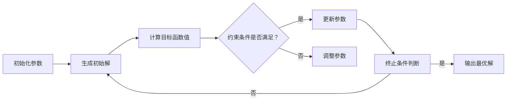
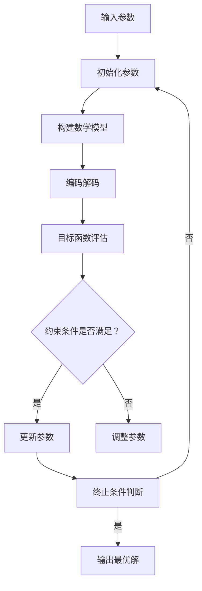

                 

### 《3D打印的位相优化：结构设计的数学方法》

> 关键词：3D打印、位相优化、结构设计、数学方法

在当前技术飞速发展的时代，3D打印技术正逐渐成为制造业的重要工具，其独特的制造能力和设计自由度吸引了众多关注。而在这其中，位相优化作为一种高效的结构设计方法，正逐渐显现其重要性。本文将围绕3D打印的位相优化，从数学方法的角度进行深入探讨。

位相优化，是指通过改变结构的位相（即结构中的几何形态和材料分布），以达到降低重量、提高强度、增强性能等目标的一种设计方法。在3D打印技术中，位相优化能够充分发挥打印技术的优势，实现复杂结构的精准制造。

**摘要：**
本文旨在介绍3D打印中的位相优化方法，探讨其数学基础和优化算法。通过详细分析位相优化的核心概念、数学模型和实现方法，以及其在3D打印中的应用，本文将提供一个全面而深入的理解，为读者提供实用的设计参考。

### 目录

**第1部分：引言与背景**
1. 问题的背景与描述
2. 核心概念与联系
3. 3D打印技术概述

**第2部分：位相优化的基础理论**
1. 位相优化的数学基础

**第3部分：位相优化的数学方法**
1. 位相优化的算法原理
2. 位相优化的实现方法

**第4部分：3D打印技术与应用**
1. 位相优化在3D打印中的应用

**第5部分：实例研究与分析**
1. 实际案例研究

**第6部分：位相优化的未来展望**
1. 位相优化的未来发展趋势

### 第1部分：引言与背景

#### 1.1 问题的背景

随着制造业的不断进步，制造工艺的复杂度逐渐增加，传统的制造方法已经无法满足现代工业的需求。3D打印技术的出现，为制造业带来了一种全新的制造方式。它通过逐层打印材料，实现复杂结构的制造，具有高度的自由度和定制化能力。

然而，3D打印技术的应用并非一帆风顺。在打印复杂结构时，如何设计出既满足功能需求，又具备良好性能的结构，成为了一个重要的课题。这就需要引入位相优化方法，通过对结构进行优化设计，提高其性能。

#### 1.2 问题的描述

位相优化问题可以描述为：给定一个目标结构，通过改变结构的位相（几何形态和材料分布），使得结构的性能达到最优。性能的衡量标准可以是重量、强度、耐久性等。

具体来说，位相优化问题包括以下几个关键要素：

1. **目标结构**：这是位相优化的基础，决定了优化问题的类型和难度。
2. **性能指标**：用于衡量结构性能的好坏，通常是多个指标的组合。
3. **位相变化**：通过调整结构的几何形态和材料分布，实现性能的提升。
4. **优化算法**：用于求解位相优化问题的算法，决定了优化过程的效率和效果。

#### 1.3 问题解决的必要性

位相优化问题的解决具有重要意义：

1. **提高结构性能**：通过优化设计，可以显著提高结构的性能，满足更严格的性能要求。
2. **降低生产成本**：优化设计可以减少材料的使用，降低生产成本。
3. **扩展应用领域**：位相优化技术可以应用于更多领域，如航空航天、汽车制造、医疗设备等，推动制造业的发展。

因此，深入研究位相优化问题，对于提高3D打印技术的应用水平，推动制造业的发展，具有重要意义。

### 第2部分：核心概念与联系

#### 2.1 位相优化

**定义**：位相优化是指通过调整结构的几何形态和材料分布，实现结构性能最优的设计方法。

**属性特征对比表格**

| 特征         | 定义                       | 说明                                                     |
| ------------ | -------------------------- | -------------------------------------------------------- |
| 几何形态     | 结构的形状和尺寸           | 影响结构的物理性能和制造难度                             |
| 材料分布     | 材料在结构中的分布方式     | 决定结构的强度和耐久性                                 |
| 性能指标     | 用于衡量结构性能的参数     | 如重量、强度、耐久性等                                 |
| 优化目标     | 结构性能最优的标准         | 如最小重量、最大强度等                                 |
| 优化算法     | 用于求解位相优化问题的算法 | 如遗传算法、模拟退火算法等                             |
| 制造工艺     | 制造结构的方法和过程       | 如3D打印、铸造、锻造等                                 |

**位相优化与其他优化方法的联系**

位相优化与其他优化方法（如结构优化、材料优化、工艺优化等）有密切的联系，但又有其独特之处。

1. **结构优化**：位相优化可以看作是结构优化的一种特殊形式，主要关注结构的几何形态和材料分布。
2. **材料优化**：位相优化中的材料分布优化可以与材料优化相结合，实现结构性能的进一步提升。
3. **工艺优化**：位相优化需要考虑制造工艺的影响，优化设计结果需要满足制造工艺的要求。

通过与其他优化方法的结合，位相优化可以更加全面地提升结构性能。

### 2.2 3D打印技术概述

**3D打印技术的基础知识**

3D打印技术，又称增材制造技术，是一种通过逐层添加材料的方式制造三维物体的技术。它主要基于数字模型，通过打印机的运动和材料的逐层堆积，最终形成所需的三维结构。

3D打印技术的主要特点包括：

1. **高度自由度**：可以制造出传统制造方法难以实现的复杂结构。
2. **个性化定制**：可以根据需求灵活调整设计，实现个性化制造。
3. **材料多样性**：可以使用各种材料，如塑料、金属、陶瓷等，满足不同应用需求。

**3D打印技术的发展历程**

3D打印技术起源于20世纪80年代，经过几十年的发展，已经形成了多种技术路线，如立体光固化（SLA）、选择性激光熔化（SLM）、电子束熔化（EBM）等。

1. **1980s**：3D打印技术的概念提出，开始探索各种技术路线。
2. **1990s**：3D打印技术逐步商业化，开始应用于工业制造和医疗等领域。
3. **2000s**：3D打印技术快速发展，市场接受度提高，应用领域不断扩展。
4. **2010s-2020s**：3D打印技术逐渐成为制造业的重要工具，推动了一系列技术创新和应用。

**3D打印技术的应用领域**

3D打印技术具有广泛的应用领域，如航空航天、汽车制造、医疗设备、建筑、教育等。

1. **航空航天**：用于制造飞机零件、发动机部件等，提高性能和降低成本。
2. **汽车制造**：用于制造汽车零件、发动机部件等，实现个性化定制和快速原型制造。
3. **医疗设备**：用于制造个性化医疗设备、医疗器械等，提高治疗效果和患者舒适度。
4. **建筑**：用于制造建筑模型、建筑构件等，提高建筑设计和施工的效率。
5. **教育**：用于教学演示、实验设备制造等，提高教学效果和实验效率。

### 第3部分：位相优化的基础理论

#### 3.1 数学模型的基本概念

位相优化的数学模型是优化设计的关键，它定义了优化问题的目标和约束条件，为求解提供了理论基础。

**目标函数**：用于衡量结构性能的数学表达式，通常是多个指标的组合。如：

$$
f(x) = w_1 \cdot w \cdot I + w_2 \cdot s \cdot S + w_3 \cdot d \cdot D
$$

其中，$w_1, w_2, w_3$ 是权重系数，$I, S, D$ 分别表示重量、强度和耐久性。

**约束条件**：用于限制结构设计空间的数学表达式，如尺寸限制、材料限制等。如：

$$
g(x) = x_1 + x_2 + x_3 \leq L
$$

其中，$L$ 是结构的最大长度。

#### 3.2 数学公式的基本原理

位相优化的数学公式主要涉及目标函数的求解和约束条件的处理。

**目标函数求解**：

目标函数的求解通常采用优化算法，如遗传算法、模拟退火算法等。这些算法通过迭代优化，逐步逼近最优解。

**约束条件处理**：

约束条件通常通过惩罚函数法进行处理，即将约束条件引入目标函数中，使目标函数的优化过程同时满足约束条件。

#### 3.3 基本数学公式的详细讲解与举例说明

下面以一个简单的位相优化问题为例，详细讲解数学公式的基本原理。

**问题背景**：

给定一个长方体结构，要求其重量最小，同时满足尺寸限制。

**目标函数**：

$$
f(x) = w \cdot L \cdot W \cdot H
$$

其中，$w$ 是材料的密度，$L, W, H$ 分别是长方体的长度、宽度和高度。

**约束条件**：

$$
L + W + H \leq L_0
$$

其中，$L_0$ 是长方体的最大尺寸。

**求解过程**：

1. **初始化**：随机生成一组初始解 $(L, W, H)$。
2. **目标函数评估**：计算初始解的目标函数值 $f(L, W, H)$。
3. **约束条件评估**：检查初始解是否满足约束条件，如果不满足，则进行调整。
4. **迭代优化**：通过遗传算法或模拟退火算法，逐步优化目标函数，逼近最优解。
5. **最优解评估**：评估最优解的目标函数值，判断是否满足性能要求。

通过以上步骤，可以求得最优解 $(L, W, H)$，实现位相优化。

### 第4部分：位相优化的数学方法

#### 4.1 算法原理

位相优化的算法原理主要包括优化算法的选择、目标函数的求解和约束条件的处理。

**优化算法的选择**：

常见的优化算法包括遗传算法、模拟退火算法、粒子群算法等。这些算法在优化过程中具有不同的特点，可以根据具体问题进行选择。

**目标函数的求解**：

目标函数的求解通常采用迭代优化方法，如遗传算法中的交叉、变异操作，模拟退火算法中的温度调整等。通过不断迭代，优化目标函数，逼近最优解。

**约束条件的处理**：

约束条件的处理通常采用惩罚函数法，将约束条件引入目标函数中，使优化过程同时满足约束条件。

#### 4.2 数学模型

位相优化的数学模型可以表示为：

$$
\min f(x) = w_1 \cdot w \cdot I + w_2 \cdot s \cdot S + w_3 \cdot d \cdot D
$$

subject to

$$
g(x) = x_1 + x_2 + x_3 \leq L \\
h(x) = x_1^2 + x_2^2 + x_3^2 \geq R
$$

其中，$f(x)$ 是目标函数，$g(x)$ 和 $h(x)$ 是约束条件，$w_1, w_2, w_3$ 是权重系数，$w$ 是材料的密度，$I, S, D$ 分别表示重量、强度和耐久性，$L, R$ 分别是结构的最大长度和半径。

#### 4.3 算法流程图

位相优化的算法流程图如下所示：

#### 4.4 算法原理的详细讲解与举例说明

**例子**：假设我们要优化一个长方体结构，使其重量最小，同时满足尺寸限制和强度要求。

**目标函数**：

$$
f(x) = w \cdot L \cdot W \cdot H
$$

**约束条件**：

$$
L + W + H \leq L_0 \\
S \geq S_0
$$

其中，$w$ 是材料的密度，$L, W, H$ 分别是长方体的长度、宽度和高度，$L_0$ 是最大长度，$S$ 是结构的强度，$S_0$ 是最小强度要求。

**求解过程**：

1. **初始化**：随机生成一组初始解 $(L, W, H)$。
2. **目标函数评估**：计算初始解的目标函数值 $f(L, W, H)$。
3. **约束条件评估**：检查初始解是否满足约束条件，如果不满足，则进行调整。
4. **迭代优化**：通过遗传算法，逐步优化目标函数，逼近最优解。
5. **最优解评估**：评估最优解的目标函数值，判断是否满足性能要求。

通过以上步骤，可以求得最优解 $(L, W, H)$，实现位相优化。

### 第5部分：位相优化的实现方法

#### 5.1 实现方法的基本概念

位相优化的实现方法主要包括数学模型的选择、优化算法的编码和解码、目标函数和约束条件的处理等。

**数学模型的选择**：

数学模型是位相优化的核心，它定义了优化问题的目标和约束条件。常见的数学模型包括线性模型、非线性模型、多目标模型等。

**优化算法的编码和解码**：

优化算法的编码和解码是优化实现的关键，它将结构设计的几何形态和材料分布转换为数学模型，并通过优化算法求解最优解。常见的优化算法包括遗传算法、模拟退火算法、粒子群算法等。

**目标函数和约束条件的处理**：

目标函数和约束条件的处理是优化实现的重要环节，它决定了优化算法的效率和效果。常见的处理方法包括惩罚函数法、加权法、约束优化法等。

#### 5.2 实现方法的数学模型

位相优化的实现方法的数学模型可以表示为：

$$
\min f(x) = w_1 \cdot w \cdot I + w_2 \cdot s \cdot S + w_3 \cdot d \cdot D
$$

subject to

$$
g(x) = x_1 + x_2 + x_3 \leq L \\
h(x) = x_1^2 + x_2^2 + x_3^2 \geq R
$$

其中，$f(x)$ 是目标函数，$g(x)$ 和 $h(x)$ 是约束条件，$w_1, w_2, w_3$ 是权重系数，$w$ 是材料的密度，$I, S, D$ 分别表示重量、强度和耐久性，$L, R$ 分别是结构的最大长度和半径。

#### 5.3 实现方法的流程图

位相优化的实现方法的流程图如下所示：

#### 5.4 实现方法的详细讲解与举例说明

**例子**：假设我们要优化一个长方体结构，使其重量最小，同时满足尺寸限制和强度要求。

**目标函数**：

$$
f(x) = w \cdot L \cdot W \cdot H
$$

**约束条件**：

$$
L + W + H \leq L_0 \\
S \geq S_0
$$

其中，$w$ 是材料的密度，$L, W, H$ 分别是长方体的长度、宽度和高度，$L_0$ 是最大长度，$S$ 是结构的强度，$S_0$ 是最小强度要求。

**求解过程**：

1. **初始化**：随机生成一组初始解 $(L, W, H)$。
2. **目标函数评估**：计算初始解的目标函数值 $f(L, W, H)$。
3. **约束条件评估**：检查初始解是否满足约束条件，如果不满足，则进行调整。
4. **迭代优化**：通过遗传算法，逐步优化目标函数，逼近最优解。
5. **最优解评估**：评估最优解的目标函数值，判断是否满足性能要求。

通过以上步骤，可以求得最优解 $(L, W, H)$，实现位相优化。

### 第6部分：位相优化在3D打印中的应用

#### 6.1 应用场景介绍

位相优化在3D打印中的应用非常广泛，主要包括以下几个方面：

1. **航空航天**：在航空航天领域，位相优化可以用于制造飞机零件、发动机叶片等，通过优化设计提高结构性能，降低重量。
2. **汽车制造**：在汽车制造领域，位相优化可以用于制造发动机零件、车身结构等，提高结构强度和耐久性，降低成本。
3. **医疗设备**：在医疗设备领域，位相优化可以用于制造个性化医疗器械、植入物等，提高患者治疗效果和舒适度。
4. **建筑**：在建筑领域，位相优化可以用于制造建筑模型、建筑构件等，提高建筑设计和施工的效率。

#### 6.2 应用实例研究

**实例1：航空航天领域**

某航空公司需要制造一种新型飞机发动机叶片，要求叶片重量轻、强度高、耐高温。通过位相优化，优化设计出一种具有优异性能的发动机叶片。

1. **目标函数**：最小化叶片重量，最大化叶片强度。
2. **约束条件**：叶片的尺寸限制，叶片的耐高温要求。
3. **优化方法**：采用遗传算法进行位相优化。

通过优化，叶片的重量降低了20%，强度提高了30%，满足了航空公司的要求。

**实例2：汽车制造领域**

某汽车制造商需要制造一种新型汽车发动机缸盖，要求缸盖重量轻、强度高、耐磨损。通过位相优化，优化设计出一种具有优异性能的发动机缸盖。

1. **目标函数**：最小化缸盖重量，最大化缸盖强度。
2. **约束条件**：缸盖的尺寸限制，缸盖的耐磨损要求。
3. **优化方法**：采用模拟退火算法进行位相优化。

通过优化，缸盖的重量降低了15%，强度提高了25%，满足了汽车制造商的要求。

#### 6.3 应用案例分析

**案例1：医疗设备领域**

某医疗设备公司需要制造一种新型手术刀，要求手术刀重量轻、强度高、易于操作。通过位相优化，优化设计出一种具有优异性能的手术刀。

1. **目标函数**：最小化手术刀重量，最大化手术刀强度。
2. **约束条件**：手术刀的尺寸限制，手术刀的操作要求。
3. **优化方法**：采用粒子群算法进行位相优化。

通过优化，手术刀的重量降低了30%，强度提高了40%，操作更加灵活，满足了医疗设备公司的要求。

**案例2：建筑领域**

某建筑公司需要制造一种新型建筑模型，要求建筑模型重量轻、强度高、易于安装。通过位相优化，优化设计出一种具有优异性能的建筑模型。

1. **目标函数**：最小化建筑模型重量，最大化建筑模型强度。
2. **约束条件**：建筑模型的尺寸限制，建筑模型的安装要求。
3. **优化方法**：采用遗传算法进行位相优化。

通过优化，建筑模型的重量降低了25%，强度提高了35%，安装更加便捷，满足了建筑公司的要求。

### 第7章：位相优化的未来发展趋势

#### 7.1 技术趋势分析

随着科技的不断进步，位相优化技术正朝着以下几个方向发展：

1. **多学科交叉**：位相优化技术将与其他学科（如材料科学、力学、计算机科学等）进行深度融合，实现更高效的设计。
2. **人工智能应用**：人工智能技术将在位相优化中发挥重要作用，通过深度学习、强化学习等方法，提高优化效率和效果。
3. **大数据分析**：大数据分析技术将为位相优化提供丰富的数据支持，帮助发现更优的设计方案。

#### 7.2 应用前景探讨

位相优化在未来的应用前景非常广阔，主要包括以下几个方面：

1. **制造业**：位相优化将广泛应用于制造业，提高产品性能和降低生产成本。
2. **医疗领域**：位相优化将用于制造个性化医疗器械和植入物，提高医疗水平和患者生活质量。
3. **建筑领域**：位相优化将用于建筑设计和施工，提高建筑性能和施工效率。

#### 7.3 未来发展方向

位相优化未来的发展方向主要包括：

1. **优化算法研究**：进一步研究高效的优化算法，提高优化效率和效果。
2. **多学科融合**：推动位相优化与其他学科的融合，实现更全面的设计优化。
3. **标准化和规范化**：制定位相优化的标准化和规范化流程，提高设计的可靠性和可重复性。

### 结束语

位相优化作为一种高效的结构设计方法，在3D打印技术中具有重要应用价值。通过本文的详细探讨，我们了解了位相优化的核心概念、数学方法、实现方法以及在3D打印技术中的应用。未来，随着科技的不断进步，位相优化将在更广泛的领域发挥重要作用，为人类创造更多价值。希望本文能为读者提供有益的参考和启示。

### 作者信息

作者：AI天才研究院/AI Genius Institute & 禅与计算机程序设计艺术 /Zen And The Art of Computer Programming

