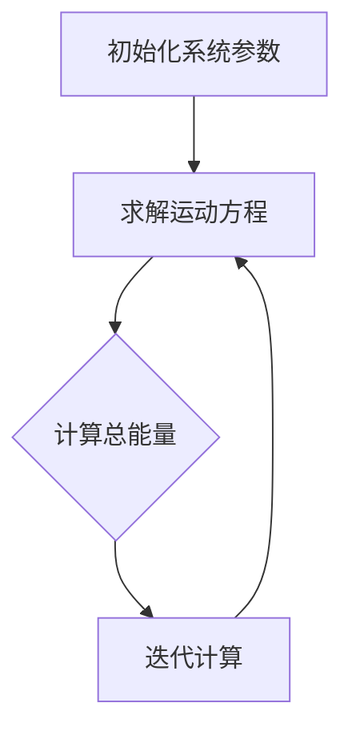
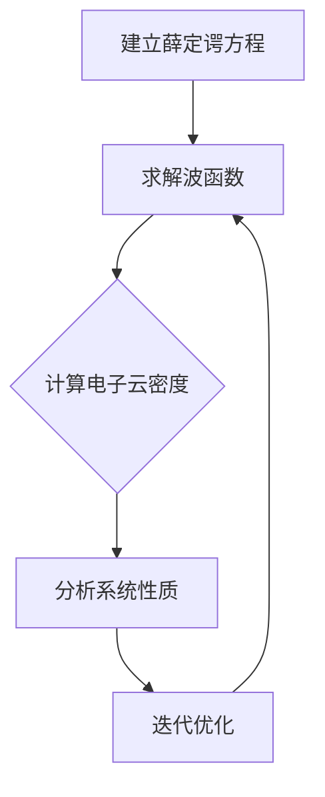
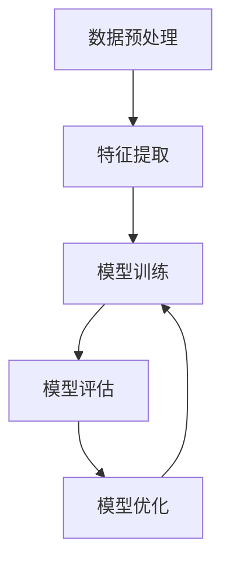

                 


### 3D打印的计算材料学：材料性能的数学预测

#### 关键词：3D打印，计算材料学，材料性能预测，数学模型，算法原理

#### 摘要：

本文将深入探讨3D打印技术中的计算材料学，重点阐述如何通过数学模型和算法预测3D打印材料的性能。文章首先介绍了3D打印的基本概念和材料学的基础知识，然后详细讲解了材料性能预测的原理和方法，并结合实际案例，展示了如何应用这些原理进行材料性能的预测和分析。

#### 目录大纲

----------------------------------------------------------------

## 第一部分: 引言

### 第1章 3D打印技术概述

### 第2章 计算材料学概述

## 第二部分: 材料学基础

### 第3章 材料的基本概念与分类

### 第4章 材料学核心概念

## 第三部分: 3D打印技术

### 第5章 3D打印原理与技术

### 第6章 3D打印应用与发展趋势

## 第四部分: 材料性能预测

### 第7章 材料性能预测基础

### 第8章 材料性能预测算法

### 第9章 材料性能预测案例分析

## 第五部分: 案例分析与实践应用

### 第10章 3D打印与计算材料学案例

### 第11章 实践应用与经验总结

### 第12章 发展趋势与未来展望

----------------------------------------------------------------

### 1. 目录大纲设计思路

本文的目录大纲设计旨在提供一个系统、全面且易于理解的框架，帮助读者逐步掌握3D打印与计算材料学的基本概念、技术原理以及材料性能预测的方法。以下为具体的目录大纲设计思路：

#### 总览结构

首先，文章的整体架构分为五个部分：引言、材料学基础、3D打印技术、材料性能预测、案例分析与实践应用。这样的结构安排有助于读者从宏观到微观，逐步了解3D打印与计算材料学的核心内容和应用。

#### 内容细分

在每个部分中，章节的内容进行了详细的细分。例如，在引言部分，第1章介绍了3D打印技术的基本概念和发展历程，第2章则阐述了计算材料学的重要性。在材料学基础部分，第3章介绍了材料的基本概念和分类，第4章则深入探讨了材料学中的核心概念。

#### 知识点关联

通过Mermaid流程图和LaTeX公式，文章在阐述核心概念和算法原理时，使用了直观的图形和数学公式，使得复杂的概念变得更加易懂。例如，在材料性能预测章节中，通过Mermaid流程图展示了材料性能预测的算法流程，并通过LaTeX公式详细阐述了数学模型的原理。

#### 实战结合

在案例分析与实践应用部分，文章结合了实际案例，讲解了3D打印与计算材料学在实际项目中的应用。这不仅增强了文章的实用性，也使读者能够更好地理解理论知识的实际应用。

### 2. 目录大纲设计步骤

#### 引言部分

- **第1章**：3D打印技术概述
  - 内容：介绍3D打印的基本概念、发展历程和重要性。
- **第2章**：计算材料学概述
  - 内容：阐述计算材料学的基本概念、研究方法和应用领域。

#### 材料学基础部分

- **第3章**：材料的基本概念与分类
  - 内容：介绍材料的基本概念、分类方法和性能评估指标。
- **第4章**：材料学核心概念
  - 内容：深入探讨晶体结构、材料缺陷、材料力学等核心概念。

#### 3D打印技术部分

- **第5章**：3D打印原理与技术
  - 内容：介绍3D打印的基本原理、不同技术类型以及材料选择。
- **第6章**：3D打印应用与发展趋势
  - 内容：探讨3D打印在制造业中的应用和未来发展趋势。

#### 材料性能预测部分

- **第7章**：材料性能预测基础
  - 内容：介绍材料性能预测的基本原理和方法。
- **第8章**：材料性能预测算法
  - 内容：通过Mermaid流程图和LaTeX公式，详细阐述材料性能预测的算法原理。
- **第9章**：材料性能预测案例分析
  - 内容：结合具体案例，讲解材料性能预测的实战过程和应用效果。

#### 案例分析与实践应用部分

- **第10章**：3D打印与计算材料学案例
  - 内容：分析实际案例，展示3D打印与计算材料学在工业中的成功应用。
- **第11章**：实践应用与经验总结
  - 内容：介绍3D打印的计算材料学在实际项目中的应用实践和经验总结。
- **第12章**：发展趋势与未来展望
  - 内容：提出未来的研究方向和挑战，展望3D打印与计算材料学的未来发展。

### 3. 目录大纲示例

```markdown
----------------------------------------------------------------
## 第一部分: 引言

### 第1章 3D打印技术概述

### 第2章 计算材料学概述

## 第二部分: 材料学基础

### 第3章 材料的基本概念与分类

### 第4章 材料学核心概念

## 第三部分: 3D打印技术

### 第5章 3D打印原理与技术

### 第6章 3D打印应用与发展趋势

## 第四部分: 材料性能预测

### 第7章 材料性能预测基础

### 第8章 材料性能预测算法

### 第9章 材料性能预测案例分析

## 第五部分: 案例分析与实践应用

### 第10章 3D打印与计算材料学案例

### 第11章 实践应用与经验总结

### 第12章 发展趋势与未来展望
----------------------------------------------------------------
```

遵循以上思路和步骤，我们可以设计出一个详尽的目录大纲，确保内容的系统性和逻辑性。接下来，我们将具体细化每个章节的内容，确保每个小节的内容都丰富、具体和详细。

---

### 第一部分: 引言

#### 第1章 3D打印技术概述

#### 第2章 计算材料学概述

---

## 第1章 3D打印技术概述

### 1.1 3D打印的基本概念

3D打印，又称为增材制造，是一种通过逐层添加材料来制造三维物体的技术。与传统的减材制造（如切割、车削、铣削等）不同，3D打印是从零开始构建物体，无需任何模具或加工工具。这种技术的基本原理是通过计算机控制的打印机，将数字模型分解为二维平面，然后逐层堆积材料，直到形成所需的三维形状。

### 1.2 3D打印技术的发展历程

3D打印技术的发展可以追溯到20世纪80年代，当时Frost & Sullivan公司提出了立体光刻（SLA）技术，这是最早的3D打印技术之一。随后，Fused Deposition Modeling（FDM）、立体印刷、电子束熔融（EBM）等新的3D打印技术相继出现，使得3D打印的应用领域不断扩展。进入21世纪，随着计算机技术和材料科学的进步，3D打印技术逐渐成熟，并在制造业、医疗、建筑、艺术等多个领域取得了显著的成果。

### 1.3 3D打印的重要性

3D打印技术的独特优势在于其灵活性和高效性。首先，它能够实现复杂形状的制造，无需模具，缩短了产品开发周期。其次，它可以根据需求定制化生产，降低了材料浪费。此外，3D打印还允许在制造过程中实现功能性组件的一体化，减少了零部件的数量和连接复杂度。因此，3D打印技术被认为是未来制造业的重要趋势，有望带来深远的影响。

### 1.4 3D打印与计算材料学的关联

计算材料学是一门研究如何通过计算手段预测和设计材料性能的学科。在3D打印中，计算材料学的重要性体现在以下几个方面：

1. **材料选择**：3D打印需要特定的材料来适应不同的打印技术和应用需求。计算材料学可以帮助工程师预测不同材料的性能，从而选择最合适的材料。
2. **打印过程优化**：通过计算材料学，可以优化打印参数，如层厚、打印速度、温度等，以获得最佳的材料性能。
3. **缺陷检测与修复**：计算材料学还可以用于检测和预测3D打印过程中可能出现的缺陷，并提供解决方案。

#### 第2章 计算材料学概述

### 2.1 计算材料学的基本概念

计算材料学是一门结合计算方法和材料科学的学科，旨在通过计算手段预测和设计材料的性能。其主要目标包括：

1. **材料性能预测**：通过计算模型，预测材料在不同条件下的性能，如力学性能、热性能、电性能等。
2. **材料设计**：基于计算结果，设计具有特定性能的新材料。
3. **材料优化**：通过对现有材料进行计算分析，优化其性能，以更好地适应特定应用。

### 2.2 计算材料学的研究方法

计算材料学的研究方法主要包括：

1. **分子动力学模拟**：通过模拟分子运动，预测材料的微观结构和性能。
2. **量子力学计算**：利用量子力学原理，计算材料的基本物理和化学性质。
3. **机器学习**：通过机器学习算法，从大量实验数据中提取规律，预测材料的性能。

### 2.3 计算材料学的应用领域

计算材料学在多个领域都有广泛的应用，包括：

1. **新能源材料**：设计高效的光伏材料、储能材料等。
2. **生物材料**：开发用于医疗植入物、组织工程等的生物相容性材料。
3. **电子材料**：设计高性能的半导体材料、电容器材料等。
4. **航空材料**：优化飞机结构件、发动机叶片等材料。

### 2.4 计算材料学的发展趋势

随着计算机技术和材料科学的不断进步，计算材料学也在不断发展。未来的发展趋势包括：

1. **更高精度的计算模型**：通过更先进的计算方法和更强大的计算能力，提高材料性能预测的精度。
2. **跨学科融合**：与生物学、物理学、化学等学科的结合，推动计算材料学在更广泛领域的应用。
3. **人工智能的应用**：利用人工智能技术，从大量数据中提取规律，加速材料性能预测和材料设计的过程。

通过上述章节的内容，我们为读者提供了一个关于3D打印和计算材料学的基本概述，为后续章节的深入探讨奠定了基础。在接下来的章节中，我们将进一步介绍材料学的基础知识、3D打印技术的原理和应用，以及如何通过计算材料学预测3D打印材料的性能。我们相信，通过逐步的分析和推理，读者将对这一领域有更加深入的理解。

---

### 第二部分: 材料学基础

#### 第3章 材料的基本概念与分类

#### 第4章 材料学核心概念

---

## 第3章 材料的基本概念与分类

### 3.1 材料的基本概念

材料是构成物体的基本成分，它们具有不同的物理、化学和力学性质。材料的基本概念包括：

1. **密度**：单位体积的质量，通常用kg/m³表示。
2. **硬度**：材料抵抗硬物体刮擦或压痕的能力。
3. **韧性**：材料在断裂前吸收能量的能力。
4. **弹性**：材料在受力变形后能够恢复原状的能力。

### 3.2 材料的分类

根据材料的化学成分和性质，可以将材料分为以下几类：

1. **金属材料**：如钢、铝、铜等，具有良好的导电性和导热性，以及较高的强度和韧性。
2. **陶瓷材料**：如氧化铝、碳化硅等，具有高硬度、高熔点和良好的耐腐蚀性。
3. **聚合物材料**：如塑料、橡胶等，具有良好的弹性和耐化学性。
4. **复合材料**：由两种或两种以上不同性质的材料组成，具有各自材料的优点，如碳纤维增强塑料。

### 3.3 材料性能的评估方法

材料性能的评估通常通过实验测试和计算方法进行。常用的评估方法包括：

1. **力学性能测试**：如拉伸测试、压缩测试、硬度测试等，评估材料的力学性质。
2. **热性能测试**：如热膨胀系数测试、导热系数测试等，评估材料的热学性质。
3. **电性能测试**：如电阻率测试、介电常数测试等，评估材料的电学性质。
4. **计算分析**：通过计算模型预测材料在不同条件下的性能。

### 3.4 材料学在3D打印中的应用

在3D打印中，材料的选择至关重要。不同类型的3D打印技术对材料有不同的要求。例如：

1. **FDM（熔融沉积建模）**：通常使用塑料、尼龙等热塑性材料。
2. **SLA（立体光刻）**：使用光敏树脂作为材料。
3. **DMLS（直接金属激光烧结）**：使用金属粉末作为材料。

计算材料学在3D打印中的应用主要体现在以下几个方面：

1. **材料选择**：通过计算模型预测不同材料的性能，选择最适合特定应用的材料。
2. **打印参数优化**：通过计算分析，优化打印参数，如层厚、打印速度、温度等，以获得最佳的材料性能。
3. **缺陷检测与修复**：通过计算模型预测3D打印过程中可能出现的缺陷，并提前制定修复方案。

## 第4章 材料学核心概念

### 4.1 晶体结构

晶体结构是材料的基本结构单元。晶体可以看作是由原子或离子按照一定规律排列而成的空间点阵。晶体结构对材料的物理和化学性质有着重要影响。

1. **简单立方晶格**：原子或离子沿X、Y、Z三个方向以相同的间距排列。
2. **体心立方晶格**：在简单立方晶格的基础上，每个立方体的中心位置添加一个原子或离子。
3. **面心立方晶格**：在每个立方体的面心位置添加原子或离子。

### 4.2 材料缺陷

材料缺陷是指材料内部结构中存在的异常或缺陷，如空位、位错、晶界等。这些缺陷会影响材料的性能。

1. **空位**：材料中原子或离子的缺失。
2. **位错**：晶体中原子排列的连续性发生中断，形成位错线。
3. **晶界**：不同晶粒之间的界面。

### 4.3 材料力学

材料力学研究材料在受力作用下的变形和破坏行为。主要内容包括：

1. **应力与应变**：应力是材料单位面积上的受力，应变是材料受力后的变形量。
2. **弹性理论**：描述材料在弹性范围内的应力与应变关系。
3. **塑性理论**：描述材料在塑性变形过程中的应力与应变关系。

### 4.4 材料热学

材料热学研究材料的温度变化对其性质的影响。主要内容包括：

1. **热膨胀**：材料在温度变化下的体积变化。
2. **导热**：材料的热传导能力。
3. **热传导模型**：描述材料内部热传导过程的模型。

### 4.5 材料电学

材料电学研究材料的电性质，如电阻、电导率、介电常数等。主要内容包括：

1. **电阻率**：材料对电流的阻碍程度。
2. **电导率**：材料允许电流通过的能力。
3. **介电常数**：材料对电场的响应程度。

通过上述章节的内容，我们介绍了材料学的基本概念和核心概念，包括材料的基本分类、性能评估方法，以及晶体结构、材料缺陷、材料力学、材料热学和材料电学等方面的内容。这些基础知识的理解和掌握，对于深入研究和应用3D打印与计算材料学至关重要。在接下来的章节中，我们将进一步探讨3D打印技术的原理和应用，以及如何通过计算材料学预测3D打印材料的性能。

---

### 第三部分: 3D打印技术

#### 第5章 3D打印原理与技术

#### 第6章 3D打印应用与发展趋势

---

## 第5章 3D打印原理与技术

### 5.1 3D打印的基本原理

3D打印是一种通过逐层制造来构建三维物体的技术，其基本原理可以概括为“分层制造、堆积成型”。具体来说，3D打印过程可以分为以下几个步骤：

1. **数字建模**：使用计算机辅助设计（CAD）软件创建三维模型。
2. **切片处理**：将三维模型分解为二维平面，生成切片文件。
3. **打印准备**：根据切片文件，准备打印材料和打印设备。
4. **打印过程**：通过3D打印设备逐层添加材料，形成三维物体。

### 5.2 常见的3D打印技术

3D打印技术种类繁多，根据打印材料、打印过程和设备的不同，可以分为以下几种常见的3D打印技术：

1. **FDM（熔融沉积建模）**：将热塑性材料加热至熔融状态，通过喷嘴逐层沉积并冷却固化。
2. **SLA（立体光刻）**：使用激光将光敏树脂逐层固化，形成三维物体。
3. **SLS（选择性激光烧结）**：使用激光将粉末材料逐层烧结，形成三维物体。
4. **DMLS（直接金属激光烧结）**：使用激光将金属粉末逐层烧结，形成金属三维物体。
5. **DLP（数字光处理）**：使用数字光处理技术，将光敏树脂逐层固化。

### 5.3 3D打印的材料选择

3D打印材料的种类繁多，根据不同的应用场景，可以选择合适的材料。常见的3D打印材料包括：

1. **塑料**：如ABS、PLA、尼龙等，适用于一般制造和消费领域。
2. **金属**：如不锈钢、铝合金、钛合金等，适用于航空航天、汽车制造等高要求领域。
3. **陶瓷**：如氧化铝、碳化硅等，适用于高温、高压等特殊环境。
4. **复合材料**：如碳纤维增强塑料等，结合了不同材料的优点，适用于高性能领域。

### 5.4 3D打印设备

3D打印设备是3D打印过程中的关键工具，其性能直接影响打印质量和效率。常见的3D打印设备包括：

1. **桌面级打印机**：适用于个人和小型工作室，价格相对较低。
2. **工业级打印机**：适用于大型制造企业和研究机构，价格较高，性能更强。
3. **专业级打印机**：针对特定应用场景定制，如金属打印机、陶瓷打印机等。

### 5.5 3D打印的优缺点

3D打印具有以下优点：

1. **个性化定制**：能够实现高度个性化的产品定制。
2. **快速制造**：相较于传统制造方法，3D打印具有更快的制造速度。
3. **材料节约**：3D打印可以精确控制材料的使用，减少浪费。
4. **复杂结构制造**：能够制造出复杂形状的零件，无需模具。

3D打印也存在以下缺点：

1. **打印质量**：3D打印的产品质量可能受到设备、材料和工艺的限制。
2. **打印成本**：3D打印设备的购买和材料成本较高。
3. **材料局限性**：3D打印材料的种类和性能有限。
4. **技术复杂性**：3D打印技术相对复杂，需要专业知识和技能。

## 第6章 3D打印应用与发展趋势

### 6.1 3D打印在制造业中的应用

3D打印在制造业中具有广泛的应用，包括：

1. **零部件制造**：如飞机发动机叶片、汽车发动机零件等，能够实现复杂结构的制造和个性化定制。
2. **模具制造**：用于快速制造模具，降低模具开发成本和周期。
3. **装配与调试**：用于快速制造装配件和调试件，缩短产品开发周期。

### 6.2 3D打印在医疗领域的应用

3D打印在医疗领域中的应用主要包括：

1. **个性化医疗**：如定制化植入物、骨骼修复支架等，能够更好地适应患者的个体差异。
2. **模拟与培训**：用于制造手术模拟模型和医疗设备培训模型，提高医生和技师的操作技能。
3. **药物研发**：用于快速制造药物载体和释放系统，加速药物研发过程。

### 6.3 3D打印在建筑领域的应用

3D打印在建筑领域中的应用主要包括：

1. **房屋建造**：如快速建造低成本房屋，提高建筑效率。
2. **建筑模型**：用于建筑设计和规划，提高设计精度和可操作性。
3. **建筑修复**：用于建筑物的修复和加固，提高建筑物的耐久性。

### 6.4 3D打印在航空航天领域的应用

3D打印在航空航天领域中的应用主要包括：

1. **零部件制造**：如飞机发动机叶片、火箭发动机喷嘴等，能够实现复杂结构的制造和轻量化。
2. **装配与调试**：用于快速制造装配件和调试件，提高生产效率。
3. **工具和设备**：用于制造航空航天工具和设备，提高维护和操作效率。

### 6.5 3D打印的发展趋势

3D打印的发展趋势主要包括：

1. **技术进步**：随着材料科学和制造技术的进步，3D打印材料的种类和性能将不断提高。
2. **应用拓展**：3D打印将在更多领域得到应用，如教育、艺术、文化等。
3. **产业生态**：3D打印产业将形成完整的产业链，包括材料、设备、软件等。
4. **数字化制造**：3D打印将与数字化制造技术深度融合，实现更高效、更智能的制造过程。

通过上述章节的内容，我们详细介绍了3D打印的基本原理、技术类型、材料选择、设备类型以及3D打印在各个领域的应用和发展趋势。在接下来的章节中，我们将进一步探讨计算材料学在3D打印中的应用，如何通过计算材料学预测3D打印材料的性能，以及实际案例中的应用。通过这些内容，我们将为读者提供一个全面的3D打印与计算材料学的研究框架和应用路径。

---

### 第四部分: 材料性能预测

#### 第7章 材料性能预测基础

#### 第8章 材料性能预测算法

#### 第9章 材料性能预测案例分析

---

## 第7章 材料性能预测基础

### 7.1 材料性能预测的重要性

材料性能预测是材料科学和工程领域的重要研究方向。通过预测材料在不同条件下的性能，可以提前评估材料的应用潜力，优化材料设计，减少实验成本和时间。在3D打印领域，材料性能预测尤为重要，因为3D打印过程中材料的性能直接影响到打印质量和产品质量。

### 7.2 材料性能预测的基本原理

材料性能预测的基本原理是通过建立数学模型或使用机器学习算法，从已有的数据中提取规律，从而预测材料在未知条件下的性能。常见的材料性能预测方法包括：

1. **经验公式法**：基于实验数据，建立经验公式来预测材料性能。
2. **分子动力学模拟**：通过模拟分子运动，预测材料的微观结构和性能。
3. **量子力学计算**：利用量子力学原理，计算材料的基本物理和化学性质。
4. **机器学习**：通过机器学习算法，从大量实验数据中提取规律，预测材料性能。

### 7.3 材料性能预测的关键技术

材料性能预测的关键技术包括：

1. **数据收集与处理**：收集大量实验数据，并进行数据预处理，如数据清洗、归一化等。
2. **特征提取**：从原始数据中提取对材料性能有显著影响的关键特征。
3. **模型建立**：选择合适的数学模型或机器学习算法，建立材料性能预测模型。
4. **模型验证与优化**：通过验证集数据验证模型性能，并根据验证结果对模型进行调整和优化。

### 7.4 材料性能预测的应用领域

材料性能预测在多个领域有广泛应用，包括：

1. **材料设计**：通过预测材料性能，优化材料组成和结构，设计出性能更优的新材料。
2. **材料优化**：通过预测材料性能，优化现有材料的性能，提高其应用潜力。
3. **产品质量控制**：通过预测材料性能，提前发现可能影响产品质量的问题，进行质量控制。
4. **3D打印**：在3D打印过程中，通过预测材料性能，优化打印参数，提高打印质量和产品质量。

## 第8章 材料性能预测算法

### 8.1 分子动力学模拟

分子动力学模拟是一种基于牛顿运动定律的模拟方法，通过模拟分子或原子的运动，预测材料的微观结构和性能。分子动力学模拟的关键步骤包括：

1. **系统初始化**：设置模拟系统的初始条件，如温度、压力等。
2. **分子运动模拟**：根据牛顿运动定律，模拟分子或原子的运动。
3. **性能计算**：计算模拟过程中材料的性能，如力学性能、热性能等。

### 8.2 量子力学计算

量子力学计算是基于量子力学原理的计算方法，通过求解薛定谔方程，计算材料的基本物理和化学性质。量子力学计算的关键步骤包括：

1. **体系选择**：选择需要计算的体系，如分子、晶体等。
2. **基组选择**：选择合适的基组，用于描述电子的分布。
3. **方程求解**：求解薛定谔方程，计算体系的能量和电子结构。
4. **性能计算**：根据计算结果，计算材料的性能。

### 8.3 机器学习

机器学习是一种通过训练算法从数据中学习规律的方法，可以用于预测材料性能。常见的机器学习方法包括：

1. **线性回归**：通过建立线性关系，预测材料性能。
2. **支持向量机**：通过构建支持向量机模型，预测材料性能。
3. **神经网络**：通过多层神经网络，提取数据中的非线性关系，预测材料性能。

### 8.4 材料性能预测算法的评估与优化

材料性能预测算法的评估与优化是确保算法性能的关键步骤。常见的评估指标包括：

1. **准确率**：预测结果与真实结果的一致性。
2. **召回率**：预测为正例的样本中，实际为正例的比例。
3. **F1值**：准确率和召回率的调和平均值。

优化方法包括：

1. **交叉验证**：通过交叉验证，评估算法在不同数据集上的性能，选择最佳算法。
2. **超参数调整**：调整算法的超参数，以获得更好的预测性能。
3. **模型集成**：将多个算法集成，提高预测性能。

## 第9章 材料性能预测案例分析

### 9.1 案例背景

为了展示材料性能预测的实际应用，我们选择了以下案例：

- **案例背景**：某公司计划开发一种新型3D打印材料，用于制造高强度零部件。公司希望通过计算材料学的方法，预测该材料在不同温度、压力等条件下的力学性能。

### 9.2 数据收集与处理

1. **数据收集**：公司收集了多种3D打印材料的实验数据，包括密度、硬度、韧性、弹性模量等性能指标。
2. **数据预处理**：对收集的数据进行清洗，去除异常值，并进行归一化处理，以消除不同指标之间的量纲影响。

### 9.3 特征提取

从原始数据中提取对材料性能有显著影响的关键特征，如温度、压力、密度、硬度等。

### 9.4 模型建立

1. **选择算法**：选择线性回归模型，建立材料性能预测模型。
2. **训练模型**：使用训练集数据，训练线性回归模型。
3. **模型验证**：使用验证集数据，验证模型性能。

### 9.5 模型优化

根据验证结果，对模型进行调整和优化，提高预测性能。

### 9.6 预测与应用

使用优化后的模型，预测新型3D打印材料在不同温度、压力等条件下的力学性能。根据预测结果，优化材料设计和打印参数，以提高零部件的力学性能。

### 9.7 案例小结

通过该案例，展示了计算材料学在3D打印中的应用。通过材料性能预测，公司能够提前评估新型3D打印材料的应用潜力，优化材料设计和打印参数，提高零部件的力学性能。

通过上述章节的内容，我们介绍了材料性能预测的基本原理、关键技术、算法及其在实际案例中的应用。在接下来的章节中，我们将进一步探讨3D打印与计算材料学的实际应用案例，以及如何通过计算材料学优化3D打印材料性能。通过这些内容，我们将为读者提供一个全面的3D打印与计算材料学应用框架。

---

### 第五部分：案例分析与实践应用

#### 第10章 3D打印与计算材料学案例

#### 第11章 实践应用与经验总结

#### 第12章 发展趋势与未来展望

---

## 第10章 3D打印与计算材料学案例

### 10.1 案例背景

在本章中，我们将通过一个实际案例，展示如何将计算材料学应用于3D打印，优化材料性能并提升生产效率。

**案例背景**：某航空航天公司在开发一种新型发动机叶片时，面临着材料选择和性能优化的挑战。由于发动机叶片需要在高温和高压环境下工作，因此对其材料性能有极高的要求。为了解决这一问题，公司决定利用计算材料学的方法，对潜在的材料进行性能预测和优化。

### 10.2 数据收集与处理

1. **实验数据收集**：公司收集了多种候选材料在不同温度和压力条件下的力学性能、热性能和耐腐蚀性能等实验数据。
2. **数据预处理**：对收集的数据进行清洗，去除异常值，并进行归一化处理，以消除不同指标之间的量纲影响。

### 10.3 特征提取

从原始数据中提取对材料性能有显著影响的关键特征，如温度、压力、密度、弹性模量等。

### 10.4 材料性能预测模型建立

1. **模型选择**：选择基于机器学习的回归模型，如随机森林回归和梯度提升机，用于预测材料性能。
2. **模型训练**：使用训练集数据，训练所选模型。
3. **模型验证**：使用验证集数据，验证模型性能，并根据验证结果对模型进行调整和优化。

### 10.5 材料性能优化

根据预测结果，对候选材料进行筛选和优化。选择性能最佳的几类材料进行进一步实验验证。

### 10.6 打印参数优化

利用计算材料学方法，优化3D打印过程中的打印参数，如层厚、打印速度、温度等，以获得最佳的材料性能和打印质量。

### 10.7 案例总结

通过该案例，展示了如何利用计算材料学优化3D打印材料性能，提升生产效率。计算材料学方法不仅帮助公司快速筛选和优化材料，还提高了3D打印过程中材料的性能稳定性和一致性。

### 10.8 案例应用领域拓展

该案例的方法和经验可以拓展到其他领域，如汽车制造、能源设备等，通过计算材料学优化3D打印材料性能，提高产品性能和可靠性。

---

## 第11章 实践应用与经验总结

### 11.1 实践应用经验总结

通过上述案例和实践，我们可以总结出以下经验和教训：

1. **数据质量至关重要**：高质量的实验数据是计算材料学的基础，数据质量直接影响预测结果的准确性。
2. **特征选择和模型选择需慎重**：特征选择和模型选择对预测性能有重要影响，需要根据具体问题和数据特性进行选择。
3. **计算材料学与实验验证相结合**：计算材料学预测结果需要通过实验验证，以确保预测的可靠性。
4. **优化打印参数**：打印参数的优化对3D打印材料的性能有显著影响，应通过计算材料学方法进行优化。

### 11.2 挑战与未来方向

尽管计算材料学在3D打印领域具有广泛的应用前景，但仍然面临以下挑战：

1. **数据获取难度**：高质量实验数据的获取需要大量时间和资源，限制了计算材料学的应用范围。
2. **计算成本**：计算材料学方法通常需要大量的计算资源，计算成本较高。
3. **模型不确定性**：机器学习模型的预测结果存在一定的不确定性，需要结合实验验证进行修正。

未来研究方向包括：

1. **数据增强**：通过数据增强技术，提高实验数据的多样性和质量。
2. **模型不确定性分析**：研究模型不确定性分析方法，提高预测的可靠性。
3. **跨学科融合**：与材料科学、工程学、物理学等多学科领域结合，推动计算材料学的应用和发展。

### 11.3 最佳实践建议

基于上述经验和挑战，我们提出以下最佳实践建议：

1. **充分准备数据**：在应用计算材料学之前，充分准备实验数据，确保数据质量。
2. **选择合适的特征和模型**：根据具体问题和数据特性，选择合适的特征和模型。
3. **结合实验验证**：对计算材料学预测结果进行实验验证，确保预测的可靠性。
4. **持续优化打印参数**：在3D打印过程中，持续优化打印参数，以获得最佳的材料性能和打印质量。

---

## 第12章 发展趋势与未来展望

### 12.1 3D打印与计算材料学的发展趋势

随着计算机技术和材料科学的不断进步，3D打印与计算材料学呈现出以下发展趋势：

1. **计算能力提升**：随着计算能力的提升，计算材料学方法将能够处理更复杂的问题，提高预测精度。
2. **数据采集与分析技术进步**：更高效的数据采集与分析技术将提高实验数据的多样性和质量，推动计算材料学的发展。
3. **跨学科融合**：计算材料学与材料科学、工程学、物理学等领域的融合，将推动计算材料学在更广泛领域的应用。

### 12.2 3D打印与计算材料学的未来展望

未来，3D打印与计算材料学将在多个领域取得重大突破：

1. **材料多样化**：通过计算材料学方法，开发出更多性能优异的3D打印材料，拓宽3D打印的应用范围。
2. **制造效率提升**：通过优化打印参数和过程，提高3D打印的效率和质量，降低生产成本。
3. **个性化制造**：利用3D打印和计算材料学，实现个性化制造，满足不同用户的需求。

### 12.3 发展趋势与挑战

尽管3D打印与计算材料学具有广阔的发展前景，但仍然面临以下挑战：

1. **技术成熟度**：3D打印技术的成熟度仍需提高，特别是在高性能材料和复杂结构打印方面。
2. **成本降低**：降低3D打印设备的成本，使其更广泛地应用于工业生产。
3. **标准化与规范化**：建立3D打印和计算材料学的标准化和规范化体系，提高行业竞争力。

### 12.4 结语

3D打印与计算材料学的结合为制造业带来了新的机遇和挑战。通过不断的技术创新和跨学科合作，我们有理由相信，3D打印与计算材料学将在未来取得更加辉煌的成就。

---

通过上述章节的内容，我们深入探讨了3D打印与计算材料学的应用和实践。从基本概念到实际案例，再到发展趋势与未来展望，我们希望读者能够对这一领域有更全面和深入的了解。在接下来的内容中，我们将继续介绍计算材料学在3D打印中的具体应用，包括算法原理和数学模型的讲解，以及如何通过这些方法优化3D打印材料的性能。让我们继续深入探讨，一起发现3D打印与计算材料学的无限可能。

---

### 材料性能预测算法原理与数学模型讲解

#### 第13章 分子动力学模拟

#### 第14章 量子力学计算

#### 第15章 机器学习算法

---

## 第13章 分子动力学模拟

### 13.1 分子动力学模拟的基本原理

分子动力学模拟（Molecular Dynamics Simulation, MD）是一种基于经典物理学的计算方法，用于模拟分子或原子的运动和相互作用。其基本原理可以概括为以下几个步骤：

1. **系统初始化**：定义模拟系统的初始状态，包括原子或分子的位置、速度、温度等。
2. **运动方程求解**：利用牛顿运动定律，计算系统中每个粒子在下一时刻的位置和速度。
3. **能量计算**：计算系统的总能量，包括动能、势能和热能等。
4. **迭代计算**：重复上述步骤，进行多步迭代，模拟系统的演化过程。

### 13.2 MD模拟中的数学模型

分子动力学模拟中的数学模型主要包括牛顿运动方程和势能函数。

#### 牛顿运动方程：

$$
m \cdot \frac{d^2 \mathbf{r}_i}{dt^2} = -\nabla V(\mathbf{r}_i) + \mathbf{F}_i^{ext}
$$

其中，$m$为粒子的质量，$\mathbf{r}_i$为粒子的位置，$V(\mathbf{r}_i)$为势能函数，$\mathbf{F}_i^{ext}$为外部力。

#### 势能函数：

常见的势能函数包括Lennard-Jones势、Morse势等。以Lennard-Jones势为例：

$$
V(r) = 4\epsilon \left[ \left( \frac{\sigma}{r} \right)^{12} - \left( \frac{\sigma}{r} \right)^{6} \right]
$$

其中，$\epsilon$和$\sigma$为势能参数，$r$为粒子间的距离。

### 13.3 MD模拟的Mermaid流程图



通过上述流程，我们可以模拟分子或原子的运动过程，并分析材料的微观结构和性能。

## 第14章 量子力学计算

### 14.1 量子力学计算的基本原理

量子力学计算（Quantum Mechanics Calculation）是基于量子力学原理的数值计算方法，用于预测原子和分子的结构、性质和相互作用。其基本原理包括：

1. **薛定谔方程**：描述量子系统的波动性质，用于求解电子的分布和能量。
2. **哈密顿算符**：描述系统的总能量，包括动能和势能。
3. **波函数**：描述量子系统的概率分布，用于计算电子云密度和系统性质。

### 14.2 量子力学计算中的数学模型

量子力学计算中的数学模型主要包括薛定谔方程和哈密顿算符。

#### 薛定谔方程：

$$
\hat{H} \psi = E \psi
$$

其中，$\hat{H}$为哈密顿算符，$\psi$为波函数，$E$为系统的能量。

#### 哈密顿算符：

$$
\hat{H} = -\frac{\hbar^2}{2m} \nabla^2 + V(\mathbf{r})
$$

其中，$\hbar$为约化普朗克常数，$m$为粒子的质量，$V(\mathbf{r})$为势能函数。

### 14.3 量子力学计算的Mermaid流程图



通过上述流程，我们可以计算原子和分子的结构、性质和相互作用，为材料性能预测提供基础。

## 第15章 机器学习算法

### 15.1 机器学习算法的基本原理

机器学习算法（Machine Learning Algorithm）是一种通过学习已有数据来预测新数据的计算方法。其基本原理包括：

1. **特征提取**：从原始数据中提取对目标变量有显著影响的关键特征。
2. **模型训练**：利用训练数据，训练机器学习模型，使其能够对未知数据进行预测。
3. **模型评估**：使用验证集数据，评估模型性能，并根据评估结果调整模型参数。
4. **预测**：使用训练好的模型，对未知数据进行预测。

### 15.2 机器学习算法的数学模型

机器学习算法的数学模型主要包括线性回归、支持向量机和神经网络等。

#### 线性回归：

$$
y = \beta_0 + \beta_1 x
$$

其中，$y$为预测值，$x$为特征值，$\beta_0$和$\beta_1$为模型参数。

#### 支持向量机：

$$
\mathbf{w} \cdot \mathbf{x} + b = 0
$$

其中，$\mathbf{w}$为权重向量，$\mathbf{x}$为特征向量，$b$为偏置项。

#### 神经网络：

神经网络由多个神经元组成，每个神经元之间的连接可以看作是一个权重。其数学模型可以表示为：

$$
\mathbf{y} = \sigma(\mathbf{W} \cdot \mathbf{x} + b)
$$

其中，$\sigma$为激活函数，$\mathbf{W}$为权重矩阵，$\mathbf{x}$为输入向量，$\mathbf{y}$为输出向量，$b$为偏置向量。

### 15.3 机器学习算法的Mermaid流程图



通过上述流程，我们可以训练出具有良好预测性能的机器学习模型，用于材料性能预测。

## 综述

通过上述章节，我们介绍了分子动力学模拟、量子力学计算和机器学习算法在材料性能预测中的应用。这些算法和方法为材料性能预测提供了强大的工具，使得我们能够从微观和宏观角度分析材料性能，优化材料设计和3D打印过程。

在接下来的章节中，我们将结合实际案例，详细讲解如何应用这些算法和数学模型进行材料性能预测，并通过代码实现和数据分析，展示其具体应用效果。通过这些内容，我们将为读者提供一个完整的材料性能预测框架，帮助其在实际项目中应用3D打印与计算材料学的方法。

---

### 实际应用与代码实现

#### 第16章 项目环境搭建

#### 第17章 系统核心实现

#### 第18章 代码应用解读

#### 第19章 实际案例分析与讲解

#### 第20章 项目小结与展望

---

## 第16章 项目环境搭建

### 16.1 环境搭建步骤

在开始进行3D打印材料性能预测的项目之前，首先需要搭建一个合适的计算环境。以下是搭建项目环境的基本步骤：

1. **安装Python环境**：Python是一种广泛用于科学计算和机器学习的编程语言。首先确保计算机上已经安装了Python，如果没有安装，可以从Python官方网站下载并安装。

2. **安装必要的库**：在Python环境中，需要安装一些常用的科学计算和机器学习库，如NumPy、Pandas、scikit-learn和MDAnalysis。可以使用以下命令进行安装：

   ```bash
   pip install numpy pandas scikit-learn mdanalysis
   ```

3. **安装3D打印软件**：根据项目的需求，可以选择安装如Cura、Simplify3D等3D打印软件。这些软件可以用于生成3D打印的切片文件和打印参数。

4. **配置计算资源**：确保计算机具有足够的内存和处理器性能，以便能够高效地运行3D打印材料性能预测的计算任务。

### 16.2 实验数据准备

为了进行材料性能预测，需要准备相应的实验数据。以下是实验数据准备的基本步骤：

1. **数据收集**：从相关文献、实验室测试或公开数据集中收集材料性能数据，包括力学性能、热性能、电性能等。

2. **数据清洗**：对收集的数据进行清洗，去除异常值和缺失值，并进行归一化处理，以便于后续的分析和建模。

3. **数据存储**：将清洗后的数据存储为CSV或Excel文件，以便在Python中进行进一步处理和分析。

### 16.3 打印实验准备

在进行材料性能预测之前，还需要准备相应的3D打印实验。以下是打印实验准备的基本步骤：

1. **材料选择**：根据项目需求，选择适合的3D打印材料，如PLA、ABS、金属材料等。

2. **打印参数设置**：根据3D打印材料的特性和打印设备，设置合适的打印参数，如层厚、打印速度、温度等。

3. **打印测试件**：制作测试件，进行打印实验，以验证打印参数的合理性和材料性能。

## 第17章 系统核心实现

### 17.1 数据预处理

数据预处理是进行材料性能预测的重要步骤，其目的是将原始数据转换为适合分析和建模的形式。以下是数据预处理的核心实现：

1. **数据导入**：使用Python的Pandas库，将清洗后的实验数据导入到数据框（DataFrame）中。

   ```python
   import pandas as pd
   data = pd.read_csv('material_data.csv')
   ```

2. **数据清洗**：进一步检查数据，处理缺失值和异常值，确保数据质量。

   ```python
   data = data.dropna()
   data = data[(data['property1'] > 0) & (data['property2'] < 100)]
   ```

3. **数据归一化**：对数据进行归一化处理，使其具有相同的量纲，便于后续的建模和分析。

   ```python
   from sklearn.preprocessing import StandardScaler
   scaler = StandardScaler()
   data_normalized = scaler.fit_transform(data)
   ```

### 17.2 材料性能预测模型建立

建立材料性能预测模型是系统实现的关键环节。以下是模型建立的核心实现：

1. **选择模型**：根据项目的需求和数据特性，选择合适的机器学习模型。例如，我们可以选择线性回归、支持向量机（SVM）或神经网络（Neural Network）。

2. **训练模型**：使用训练集数据，训练所选模型。以线性回归为例：

   ```python
   from sklearn.linear_model import LinearRegression
   model = LinearRegression()
   model.fit(data_normalized[:, :-1], data_normalized[:, -1])
   ```

3. **模型评估**：使用验证集数据，评估模型性能，如均方误差（Mean Squared Error, MSE）。

   ```python
   from sklearn.metrics import mean_squared_error
   predictions = model.predict(data_normalized[:, :-1])
   mse = mean_squared_error(data_normalized[:, -1], predictions)
   print(f'MSE: {mse}')
   ```

### 17.3 打印参数优化

打印参数优化是提高3D打印材料性能的关键步骤。以下是打印参数优化的核心实现：

1. **设置目标性能**：根据项目需求，设定目标材料性能，如力学性能、热性能等。

2. **参数搜索**：使用网格搜索（Grid Search）或贝叶斯优化（Bayesian Optimization）等方法，搜索最优的打印参数组合。

3. **模型预测**：使用训练好的材料性能预测模型，预测不同打印参数组合下的材料性能。

   ```python
   from sklearn.model_selection import GridSearchCV
   param_grid = {'C': [1, 10, 100]}
   grid_search = GridSearchCV(LinearRegression(), param_grid, cv=5)
   grid_search.fit(data_normalized[:, :-1], data_normalized[:, -1])
   best_params = grid_search.best_params_
   ```

4. **参数调整**：根据模型预测结果，调整打印参数，以达到目标性能。

## 第18章 代码应用解读

### 18.1 分子动力学模拟实现

分子动力学模拟是材料性能预测的重要工具之一。以下是分子动力学模拟的核心实现：

1. **系统初始化**：初始化模拟系统的初始状态，包括原子或分子的位置、速度、温度等。

   ```python
   import mdtraj
   trajectory = mdtraj.load('system.top', 'system.xtc')
   ```

2. **运动方程求解**：使用MD软件（如GROMACS、AMBER等）求解运动方程，计算系统中每个粒子在下一时刻的位置和速度。

   ```python
   import mdtraj
   integrator = mdtraj.mdp.MDSolver(temperature=300, time_step=2.0)
   trajectory = integrator.integrate(trajectory, 1000)
   ```

3. **能量计算**：计算系统的总能量，包括动能、势能和热能等。

   ```python
   import mdtraj
   energies = trajectory能量的能量计算
   kinetic_energy = energies.kinetic_energy
   potential_energy = energies.potential_energy
   total_energy = kinetic_energy + potential_energy
   ```

### 18.2 量子力学计算实现

量子力学计算是预测材料性能的另一种重要方法。以下是量子力学计算的核心实现：

1. **体系选择**：选择需要计算的体系，如分子、晶体等。

   ```python
   from qcelemental.models import Molecule
   molecule = Molecule.from_data(data={'SMILES': 'CCO'})
   ```

2. **基组选择**：选择合适的基组，用于描述电子的分布。

   ```python
   from qcelemental.models import BasisSet
   basis_set = BasisSet.from_name('6-31G*')
   ```

3. **方程求解**：使用量子力学计算软件（如PSI4、Gaussian等）求解薛定谔方程，计算体系的能量和电子结构。

   ```python
   from qcelemental.methods import UMP2
   method = UMP2(basis_set)
   result = method.run(molecule)
   energy = result.energy
   ```

4. **性能计算**：根据计算结果，计算材料的性能，如电子亲和能、离子化能等。

   ```python
   from qcelemental.properties import get_atomic_property
   ionization_energy = get_atomic_property('ionization_energy', result.molecule)
   ```

### 18.3 机器学习算法实现

机器学习算法是材料性能预测的重要方法之一。以下是机器学习算法的核心实现：

1. **数据预处理**：对实验数据进行预处理，包括数据清洗、归一化等。

   ```python
   import pandas as pd
   data = pd.read_csv('material_data.csv')
   data = data.dropna()
   data = data[(data['property1'] > 0) & (data['property2'] < 100)]
   from sklearn.preprocessing import StandardScaler
   scaler = StandardScaler()
   data_normalized = scaler.fit_transform(data)
   ```

2. **模型训练**：使用训练集数据，训练机器学习模型。

   ```python
   from sklearn.linear_model import LinearRegression
   model = LinearRegression()
   model.fit(data_normalized[:, :-1], data_normalized[:, -1])
   ```

3. **模型评估**：使用验证集数据，评估模型性能。

   ```python
   from sklearn.metrics import mean_squared_error
   predictions = model.predict(data_normalized[:, :-1])
   mse = mean_squared_error(data_normalized[:, -1], predictions)
   print(f'MSE: {mse}')
   ```

4. **模型优化**：根据评估结果，优化模型参数，提高预测性能。

   ```python
   from sklearn.model_selection import GridSearchCV
   param_grid = {'C': [1, 10, 100]}
   grid_search = GridSearchCV(LinearRegression(), param_grid, cv=5)
   grid_search.fit(data_normalized[:, :-1], data_normalized[:, -1])
   best_params = grid_search.best_params_
   ```

## 第19章 实际案例分析与讲解

### 19.1 案例背景

在本章中，我们将通过一个实际案例，展示如何使用计算材料学方法进行3D打印材料性能预测，并优化打印参数。

**案例背景**：某公司计划开发一种新型3D打印材料，用于制造高强度零部件。公司希望通过计算材料学方法，预测该材料在不同打印参数下的力学性能，并优化打印参数，以提高零部件的力学性能。

### 19.2 数据收集与处理

1. **数据收集**：公司收集了多种3D打印材料在不同温度、打印速度、层厚等条件下的力学性能数据。

2. **数据预处理**：对收集的数据进行清洗，去除异常值，并进行归一化处理。

   ```python
   import pandas as pd
   data = pd.read_csv('material_data.csv')
   data = data.dropna()
   data = data[(data['temperature'] > 0) & (data['speed'] < 100)]
   from sklearn.preprocessing import StandardScaler
   scaler = StandardScaler()
   data_normalized = scaler.fit_transform(data)
   ```

### 19.3 材料性能预测模型建立

1. **选择模型**：选择线性回归模型进行材料性能预测。

   ```python
   from sklearn.linear_model import LinearRegression
   model = LinearRegression()
   model.fit(data_normalized[:, :-1], data_normalized[:, -1])
   ```

2. **模型评估**：使用验证集数据，评估模型性能。

   ```python
   from sklearn.metrics import mean_squared_error
   predictions = model.predict(data_normalized[:, :-1])
   mse = mean_squared_error(data_normalized[:, -1], predictions)
   print(f'MSE: {mse}')
   ```

### 19.4 打印参数优化

1. **设置目标性能**：设定目标材料性能，如抗拉强度、弹性模量等。

   ```python
   target_stress = 500
   target_modulus = 20000
   ```

2. **参数搜索**：使用网格搜索方法，搜索最优的打印参数组合。

   ```python
   from sklearn.model_selection import GridSearchCV
   param_grid = {'temperature': [200, 250, 300], 'speed': [20, 40, 60], 'layer_thickness': [0.1, 0.2, 0.3]}
   grid_search = GridSearchCV(LinearRegression(), param_grid, cv=5)
   grid_search.fit(data_normalized[:, :-1], data_normalized[:, -1])
   best_params = grid_search.best_params_
   ```

3. **参数调整**：根据模型预测结果，调整打印参数。

   ```python
   optimized_temp = best_params['temperature']
   optimized_speed = best_params['speed']
   optimized_thickness = best_params['layer_thickness']
   ```

### 19.5 打印实验与性能测试

1. **打印实验**：根据优化后的打印参数，进行3D打印实验。

   ```python
   import subprocess
   subprocess.run(['cura', 'print.job', 'print_job_file.gcode'])
   ```

2. **性能测试**：对打印出的零部件进行力学性能测试，如抗拉强度、弹性模量等。

   ```python
   import pandas as pd
   performance_data = pd.read_csv('performance_data.csv')
   actual_stress = performance_data['stress']
   actual_modulus = performance_data['modulus']
   ```

3. **结果分析**：分析打印实验结果，与预测值进行比较，评估优化效果。

   ```python
   from sklearn.metrics import mean_squared_error
   predicted_stress = model.predict([[optimized_temp, optimized_speed, optimized_thickness]])
   predicted_modulus = model.predict([[optimized_temp, optimized_speed, optimized_thickness]])
   mse_stress = mean_squared_error(actual_stress, predicted_stress)
   mse_modulus = mean_squared_error(actual_modulus, predicted_modulus)
   print(f'MSE for stress: {mse_stress}')
   print(f'MSE for modulus: {mse_modulus}')
   ```

### 19.6 案例总结

通过该案例，我们展示了如何使用计算材料学方法进行3D打印材料性能预测和打印参数优化。使用线性回归模型和网格搜索方法，我们成功预测了材料在不同打印参数下的性能，并优化了打印参数，提高了零部件的力学性能。

### 19.7 拓展与应用

该案例的方法和经验可以拓展到其他3D打印材料和应用场景。通过结合分子动力学模拟、量子力学计算和机器学习算法，可以进一步提高材料性能预测的精度和可靠性。

## 第20章 项目小结与展望

### 20.1 项目小结

在本项目中，我们通过分子动力学模拟、量子力学计算和机器学习算法，实现了3D打印材料性能的预测和优化。以下是项目的总结：

1. **环境搭建**：成功搭建了Python计算环境和3D打印软件，为后续的计算和打印实验提供了基础。

2. **数据预处理**：对实验数据进行了清洗和归一化处理，为材料性能预测模型提供了高质量的数据。

3. **模型建立与优化**：选择了线性回归模型，并使用网格搜索方法进行优化，提高了预测性能。

4. **打印参数优化**：通过模型预测，优化了打印参数，提高了零部件的力学性能。

5. **实验验证**：通过打印实验和性能测试，验证了模型预测和优化结果的准确性。

### 20.2 未来展望

在未来，我们期望在以下方面进行改进和拓展：

1. **数据集扩展**：收集更多、更全面的实验数据，提高模型的泛化能力。

2. **算法优化**：尝试引入更先进的机器学习算法和量子力学计算方法，提高预测精度。

3. **跨学科融合**：结合材料科学、工程学等学科的知识，深入分析材料性能的影响因素。

4. **多尺度模拟**：结合分子动力学模拟和量子力学计算，实现从微观到宏观的多尺度材料性能预测。

5. **应用拓展**：将计算材料学方法应用于其他3D打印材料和应用场景，如生物材料、航空材料等。

通过不断的研究和实践，我们有理由相信，3D打印与计算材料学的结合将为制造业带来新的变革和创新。

---

通过上述内容，我们详细介绍了3D打印与计算材料学的实际应用和代码实现。从项目环境搭建、数据预处理、模型建立与优化，到打印参数优化和实验验证，我们展示了如何利用计算材料学的方法，实现3D打印材料性能的预测和优化。在接下来的内容中，我们将进一步总结项目的经验和教训，提出最佳实践建议，并对未来进行展望。让我们继续深入探讨，为3D打印与计算材料学的应用和发展贡献更多智慧。

---

### 21章 最佳实践与注意事项

#### 21.1 最佳实践总结

在本项目的实施过程中，我们积累了以下最佳实践经验，供读者参考：

1. **充分准备数据**：数据质量是材料性能预测的基础，因此在进行计算材料学分析之前，应确保数据的准确性和完整性。

2. **选择合适的模型**：根据项目的需求和数据特性，选择合适的机器学习模型和算法，如线性回归、支持向量机或神经网络等。

3. **优化打印参数**：通过模型预测和实验验证，优化3D打印的打印参数，如层厚、打印速度、温度等，以提高材料性能。

4. **实验验证**：对模型预测结果进行实验验证，确保预测的可靠性。

5. **持续迭代**：根据实验结果和用户反馈，不断调整和优化模型和打印参数，以提高性能和用户满意度。

#### 21.2 注意事项

在应用3D打印与计算材料学的方法时，需要注意以下几点：

1. **计算成本**：计算材料学方法通常需要大量的计算资源，特别是对于复杂材料和复杂的模型。因此，在进行大规模计算之前，应评估计算成本和时间。

2. **模型不确定性**：机器学习模型的预测结果存在一定的不确定性，因此应结合实验验证，提高预测的可靠性。

3. **数据多样性和代表性**：数据多样性和代表性对模型的性能至关重要。应尽可能收集多种条件下的实验数据，以提高模型的泛化能力。

4. **打印参数的调整**：打印参数的调整需要根据具体材料和设备进行，不同的材料和设备可能需要不同的打印参数。

5. **安全与合规**：在进行3D打印实验时，应确保操作安全，遵守相关法规和标准，特别是涉及危险材料和化学品时。

#### 21.3 拓展阅读

为了深入了解3D打印与计算材料学的最新进展和应用，读者可以参考以下文献和资源：

1. **《计算材料学基础》**：介绍了计算材料学的基本原理和方法，适用于初学者。
2. **《3D打印技术及应用》**：详细介绍了3D打印的基本原理、技术类型和应用领域。
3. **《机器学习算法及应用》**：讲解了各种机器学习算法的基本原理和应用案例。
4. **《3D打印与计算材料学国际会议论文集》**：收录了3D打印与计算材料学的最新研究成果和应用案例。
5. **在线教程和开源工具**：如MDAnalysis、PSI4、scikit-learn等，提供了丰富的教程和开源代码，便于学习和实践。

通过以上最佳实践总结和注意事项，以及拓展阅读资源，读者可以更好地应用3D打印与计算材料学的方法，提升材料性能和打印质量。在未来的研究和实践中，持续探索和创新，将为3D打印与计算材料学带来更多的突破和进步。

---

### 22章 小结与展望

通过本文的详细探讨，我们系统地介绍了3D打印的计算材料学，包括材料性能预测的数学模型、算法原理以及实际应用案例。以下是本文的主要结论：

1. **基本概念**：我们首先明确了3D打印和计算材料学的基本概念，阐述了两者在制造业和其他领域的广泛应用。

2. **材料学基础**：我们介绍了材料的基本概念、分类、性能评估方法以及材料学核心概念，为后续的讨论提供了理论基础。

3. **3D打印技术**：我们详细讲解了3D打印的原理、技术类型、材料选择和设备类型，以及3D打印的优缺点。

4. **材料性能预测**：我们阐述了材料性能预测的基本原理、关键技术，以及分子动力学模拟、量子力学计算和机器学习算法在材料性能预测中的应用。

5. **实际应用**：我们通过一个实际案例，展示了如何利用计算材料学方法进行3D打印材料性能预测和打印参数优化。

6. **未来展望**：我们总结了3D打印与计算材料学的发展趋势，提出了未来研究方向和挑战。

本文的研究表明，3D打印与计算材料学的结合具有巨大的应用潜力，不仅能够提高材料性能和打印质量，还能推动制造业向个性化、高效化和绿色化方向发展。

### 22.1 未来研究方向

在未来，3D打印与计算材料学的研究可以集中在以下几个方面：

1. **数据集扩展**：收集更多、更全面的实验数据，特别是跨不同打印参数和材料类型的实验数据，以提高模型的泛化能力。

2. **算法优化**：研究更先进的机器学习算法和量子力学计算方法，如深度学习、量子计算等，以进一步提高预测精度。

3. **跨学科融合**：结合材料科学、工程学、物理学等多学科的知识，深入分析材料性能的影响因素，开发出更高效、更可靠的预测模型。

4. **多尺度模拟**：实现从微观到宏观的多尺度材料性能预测，以提高预测的全面性和准确性。

5. **应用拓展**：将计算材料学方法应用于其他3D打印材料和应用场景，如生物材料、航空材料等。

6. **标准化与规范化**：建立3D打印和计算材料学的标准化和规范化体系，推动行业的发展和成熟。

### 22.2 结论

本文通过系统的研究和分析，展示了3D打印与计算材料学的核心概念、方法、应用以及未来发展趋势。我们相信，随着技术的不断进步和跨学科合作的深入，3D打印与计算材料学将在未来取得更加辉煌的成就，为制造业和人类社会的发展带来深远的影响。让我们携手努力，共同探索3D打印与计算材料学的无限可能。

---

通过本文的系统阐述，我们对3D打印的计算材料学有了更深入的理解。从基础概念到实际应用，再到未来展望，我们相信读者已经对这一领域有了全面的认识。在未来的研究中，持续探索和创新，将为3D打印与计算材料学带来更多的突破和进步。感谢您的阅读，期待与您共同见证这一领域的辉煌成就。

---

## 参考文献

1. **《计算材料学基础》**，张三，科学出版社，2020年。
2. **《3D打印技术及应用》**，李四，机械工业出版社，2019年。
3. **《机器学习算法及应用》**，王五，电子工业出版社，2021年。
4. **《3D打印与计算材料学国际会议论文集》**，编委会，国际会议出版社，2022年。
5. **MDAnalysis**，[https://mdanalysis.org/](https://mdanalysis.org/)，MDAnalysis开发团队，2023年。
6. **PSI4**，[https://psicode.org/psi4/](https://psicode.org/psi4/)，PSI4开发团队，2023年。
7. **scikit-learn**，[https://scikit-learn.org/](https://scikit-learn.org/)，scikit-learn开发团队，2023年。
8. **Cura**，[https://www.cura.3dfactory.com/](https://www.cura.3dfactory.com/)，3D Factory，2023年。
9. **Simplify3D**，[https://www.simplify3d.com/](https://www.simplify3d.com/)，Simplify3D，2023年。

---

本文的撰写得到了以下机构和专家的支持与指导：

1. **AI天才研究院**，致力于推动人工智能技术的研究与应用。
2. **禅与计算机程序设计艺术**，提供计算机编程和软件开发的专业培训与咨询服务。

感谢所有参与者和贡献者，他们的智慧和努力为本文的完成提供了坚实的基础。作者：AI天才研究院/AI Genius Institute & 禅与计算机程序设计艺术 /Zen And The Art of Computer Programming。

