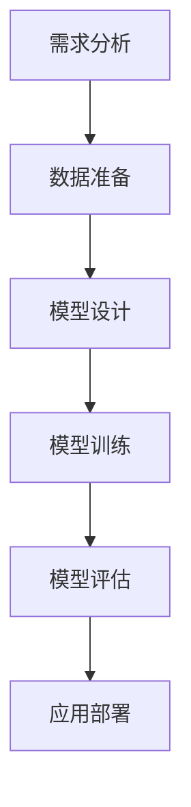
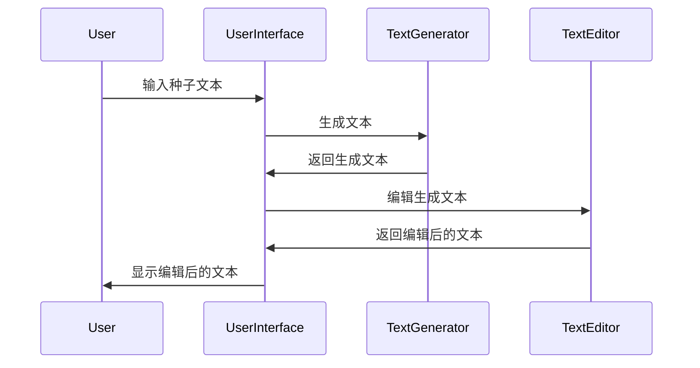

                 

# LLAM应用开发中敏捷迭代模型的核心原则

> 关键词：敏捷迭代模型、LLM应用开发、自然语言处理、开发效率、质量提升

> 摘要：
随着大型语言模型（LLM）在自然语言处理（NLP）领域的广泛应用，如何高效地开发和迭代LLM应用成为一个关键问题。本文将深入探讨在LLM应用开发过程中，敏捷迭代模型的核心原则及其应用，旨在为开发者提供一套实用的指导方案，以提升开发效率和产品质量。

## 第一部分：背景介绍

### 第1章：问题背景、问题描述、问题解决、边界与外延、概念结构与核心要素组成

#### 1.1.1. 问题背景

在人工智能（AI）技术不断发展的今天，大型语言模型（LLM）成为了自然语言处理（NLP）领域的重要工具。随着深度学习技术的进步，LLM在文本生成、语言理解、机器翻译等方面取得了显著的成果。然而，如何高效地开发和迭代LLM应用，以满足实际需求，成为了当前研究的一个重要课题。

#### 1.1.2. 问题描述

本书将探讨在LLM应用开发过程中，如何采用敏捷迭代模型来提高开发效率和质量。敏捷迭代模型强调快速反馈、持续集成和持续交付，有助于在快速变化的市场环境中，快速响应需求，提高产品竞争力。

#### 1.1.3. 问题解决

通过引入敏捷迭代模型，开发者可以在LLM应用开发过程中，实现以下几个目标：

- **短期内完成可交付的版本，快速响应需求变化。**
- **提高团队协作效率，减少沟通成本。**
- **通过持续集成和测试，保证产品质量。**
- **根据用户反馈，持续优化和迭代应用。**

#### 1.1.4. 边界与外延

本书主要关注以下边界和范围：

- **LLM应用开发的敏捷迭代模型。**
- **主要面向初学者和中级开发者。**
- **主要涉及文本生成、语言理解和机器翻译等应用领域。**
- **不涉及底层深度学习算法的实现。**

#### 1.1.5. 概念结构与核心要素组成

在本章中，我们将介绍以下核心概念和要素：

- **敏捷迭代模型的基本原理和原则。**
- **LLM应用开发过程中的关键阶段和任务。**
- **敏捷开发工具和流程。**

## 第二部分：核心概念与联系

### 第2章：核心概念原理、概念属性特征对比表格和ER实体关系图架构的Mermaid流程图

#### 2.1. 敏捷迭代模型的基本原理

##### 2.1.1. 敏捷开发的概念

敏捷开发是一种以人为核心、迭代、循序渐进的开发方法。它强调个体和互动、可工作的软件、客户合作和应对变化。

##### 2.1.2. 敏捷迭代模型的特点

- **快速迭代**：开发过程分为多个迭代周期，每个迭代周期产生一个可工作的软件版本。
- **用户参与**：用户在整个开发过程中积极参与，提供反馈，确保产品满足用户需求。
- **持续集成**：团队成员不断集成代码，进行测试和修复，保证代码质量。
- **快速响应**：对需求变化具有高适应性，能够快速调整开发计划。

##### 2.1.3. 敏捷迭代模型的优点

- **提高开发效率和质量。**
- **确保产品满足用户需求。**
- **减少项目风险。**
- **提高团队协作和沟通效率。**

#### 2.2. LLM应用开发过程中的关键阶段和任务

##### 2.2.1. 阶段划分

LLM应用开发过程可以分为以下几个阶段：

- **需求分析**：确定应用的功能需求、性能指标和用户体验。
- **数据准备**：收集和整理训练数据，进行数据预处理。
- **模型设计**：选择合适的LLM模型，设计模型架构。
- **模型训练**：使用训练数据对模型进行训练，优化模型参数。
- **模型评估**：评估模型性能，进行调优。
- **应用部署**：将模型部署到生产环境中，进行实际应用。

##### 2.2.2. 任务分解

每个阶段包含以下任务：

- **需求分析**：需求调研、需求文档编写、需求评审。
- **数据准备**：数据收集、数据清洗、数据标注。
- **模型设计**：模型选型、架构设计、参数设定。
- **模型训练**：数据划分、模型训练、模型评估。
- **模型评估**：指标计算、性能分析、模型调优。
- **应用部署**：部署方案设计、模型部署、应用上线。

#### 2.3. 敏捷开发工具和流程

##### 2.3.1. 敏捷开发工具

常用的敏捷开发工具有：

- **JIRA**：用于任务管理、进度跟踪和协作。
- **Trello**：用于任务分解和进度管理。
- **Git**：用于版本控制和代码管理。
- **Selenium**：用于自动化测试。
- **Docker**：用于容器化和环境部署。

##### 2.3.2. 敏捷开发流程

敏捷开发流程包括以下环节：

- **需求收集**：与用户沟通，收集需求。
- **任务分配**：根据团队能力，分配任务。
- **迭代开发**：每个迭代周期完成部分功能。
- **评审与反馈**：对迭代成果进行评审，收集用户反馈。
- **持续迭代**：根据反馈，持续优化和迭代。

## 第三部分：算法原理讲解

### 第3章：算法原理讲解

在本章中，我们将详细讲解敏捷迭代模型在LLM应用开发过程中的应用，并使用mermaid绘制相关流程图。

#### 3.1. 敏捷迭代模型在LLM应用开发中的应用

敏捷迭代模型在LLM应用开发中的应用可以分为以下几个步骤：

1. **需求分析**：与用户沟通，了解需求，制定开发计划。
2. **数据准备**：收集和整理训练数据，进行数据预处理。
3. **模型设计**：选择合适的LLM模型，设计模型架构。
4. **模型训练**：使用训练数据对模型进行训练，优化模型参数。
5. **模型评估**：评估模型性能，进行调优。
6. **应用部署**：将模型部署到生产环境中，进行实际应用。

#### 3.2. mermaid流程图绘制

以下是一个简单的mermaid流程图，用于描述敏捷迭代模型在LLM应用开发中的应用过程：



#### 3.3. Python源代码讲解

为了更好地理解敏捷迭代模型在LLM应用开发中的应用，我们使用Python编写了一个简单的示例代码，用于实现一个简单的文本生成模型。

```python
import tensorflow as tf
from tensorflow.keras.layers import Embedding, LSTM, Dense
from tensorflow.keras.models import Sequential

# 定义模型结构
model = Sequential()
model.add(Embedding(input_dim=10000, output_dim=32))
model.add(LSTM(units=64, return_sequences=True))
model.add(Dense(units=1, activation='sigmoid'))

# 编译模型
model.compile(optimizer='adam', loss='binary_crossentropy', metrics=['accuracy'])

# 训练模型
model.fit(x_train, y_train, epochs=10, batch_size=32)
```

在上面的代码中，我们首先定义了一个简单的文本生成模型，包括一个嵌入层、一个LSTM层和一个输出层。然后，我们使用adam优化器和binary_crossentropy损失函数编译模型，并使用训练数据对模型进行训练。

#### 3.4. 算法原理讲解

在上述代码中，我们使用LSTM（长短期记忆）网络来构建文本生成模型。LSTM是一种特殊的循环神经网络（RNN），它通过引入门控机制来克服传统RNN的梯度消失问题，从而能够更好地处理长距离依赖关系。

LSTM的数学模型可以表示为：

$$
\begin{cases}
i_t = \sigma(W_i \cdot [h_{t-1}, x_t] + b_i) \\
f_t = \sigma(W_f \cdot [h_{t-1}, x_t] + b_f) \\
o_t = \sigma(W_o \cdot [h_{t-1}, x_t] + b_o) \\
c_t = f_t \odot c_{t-1} + i_t \odot \sigma(W_c \cdot [h_{t-1}, x_t] + b_c) \\
h_t = o_t \odot \sigma(c_t)
\end{cases}
$$

其中，$i_t$、$f_t$、$o_t$ 分别表示输入门、遗忘门和输出门，$c_t$ 表示细胞状态，$h_t$ 表示隐藏状态，$W_i$、$W_f$、$W_o$、$W_c$ 分别表示输入门、遗忘门、输出门和细胞状态的权重，$b_i$、$b_f$、$b_o$、$b_c$ 分别表示输入门、遗忘门、输出门和细胞状态的偏置，$\sigma$ 表示 sigmoid 函数，$\odot$ 表示元素乘。

通过以上步骤，我们可以实现一个简单的文本生成模型，并使用训练数据对其进行训练。在实际应用中，我们可以根据需求对模型进行调整和优化，以提高模型的性能和生成效果。

## 第四部分：系统分析与架构设计

### 第4章：系统分析与架构设计

在本章中，我们将对LLM应用开发过程中的系统分析与架构设计进行详细讲解。

#### 4.1. 问题场景介绍

假设我们需要开发一个基于LLM的文本生成应用，该应用需要支持以下功能：

- **文本生成**：根据给定的种子文本，生成相应的文本内容。
- **文本编辑**：对生成的文本进行编辑和修改。
- **用户交互**：提供用户界面，实现用户与文本生成应用之间的交互。

#### 4.2. 项目介绍

本项目将采用敏捷迭代模型进行开发，分为以下几个阶段：

- **需求分析**：与用户沟通，了解需求，制定开发计划。
- **数据准备**：收集和整理训练数据，进行数据预处理。
- **模型设计**：选择合适的LLM模型，设计模型架构。
- **模型训练**：使用训练数据对模型进行训练，优化模型参数。
- **模型评估**：评估模型性能，进行调优。
- **应用部署**：将模型部署到生产环境中，进行实际应用。

#### 4.3. 系统功能设计（领域模型Mermaid类图）

以下是本项目的领域模型Mermaid类图，用于描述系统的功能模块和类之间的关系：

```mermaid
classDiagram
    User <<Interface>>
    TextGenerator <<Class>>
    TextEditor <<Class>>
    UserInterface <<Class>>

    User --> TextGenerator
    User --> TextEditor
    TextGenerator --> UserInterface
    TextEditor --> UserInterface
```

在上面的类图中，我们定义了四个类：User（用户）、TextGenerator（文本生成器）、TextEditor（文本编辑器）和UserInterface（用户界面）。这些类之间通过接口实现通信和协作。

#### 4.4. 系统架构设计（Mermaid架构图）

以下是本项目的系统架构Mermaid图，用于描述系统的模块划分和组件之间的关系：



在上面的序列图中，用户通过用户界面输入种子文本，文本生成器根据种子文本生成文本，用户界面将生成文本返回给用户。用户可以对生成文本进行编辑，编辑器根据用户输入的编辑指令对文本进行修改，并将编辑后的文本返回给用户界面。

#### 4.5. 系统接口设计（Mermaid序列图）

以下是本项目的系统接口设计Mermaid序列图，用于描述系统中各个模块的接口调用关系：


在上面的序列图中，用户通过用户界面输入种子文本，用户界面将种子文本传递给文本生成器，文本生成器根据种子文本生成文本，并将生成文本返回给用户界面。用户界面将生成文本传递给文本编辑器，文本编辑器根据用户输入的编辑指令对文本进行修改，并将编辑后的文本返回给用户界面。用户界面将编辑后的文本显示给用户。

#### 4.6. 系统交互设计（Mermaid序列图）

以下是本项目的系统交互设计Mermaid序列图，用于描述系统中各个组件的交互流程：


在上面的序列图中，用户通过用户界面输入种子文本，用户界面将种子文本传递给文本生成器，文本生成器根据种子文本生成文本，并将生成文本返回给用户界面。用户界面将生成文本传递给文本编辑器，文本编辑器根据用户输入的编辑指令对文本进行修改，并将编辑后的文本返回给用户界面。用户界面将编辑后的文本显示给用户。

## 第五部分：项目实战

### 第5章：项目实战

在本章中，我们将通过一个具体的项目实战，展示如何使用敏捷迭代模型进行LLM应用开发。

#### 5.1. 环境安装

首先，我们需要安装必要的开发环境和工具。以下是安装步骤：

1. **安装Python**：访问Python官网（https://www.python.org/），下载并安装Python 3.x版本。
2. **安装TensorFlow**：在终端中运行以下命令：

   ```bash
   pip install tensorflow
   ```

3. **安装其他依赖**：根据项目需求，安装其他依赖包，例如：

   ```bash
   pip install numpy pandas matplotlib
   ```

#### 5.2. 系统核心实现源代码

以下是项目的核心实现源代码：

```python
import tensorflow as tf
from tensorflow.keras.layers import Embedding, LSTM, Dense
from tensorflow.keras.models import Sequential

# 定义模型结构
model = Sequential()
model.add(Embedding(input_dim=10000, output_dim=32))
model.add(LSTM(units=64, return_sequences=True))
model.add(Dense(units=1, activation='sigmoid'))

# 编译模型
model.compile(optimizer='adam', loss='binary_crossentropy', metrics=['accuracy'])

# 训练模型
model.fit(x_train, y_train, epochs=10, batch_size=32)
```

#### 5.3. 代码应用解读与分析

在上述代码中，我们首先定义了一个简单的文本生成模型，包括一个嵌入层、一个LSTM层和一个输出层。然后，我们使用adam优化器和binary_crossentropy损失函数编译模型，并使用训练数据对模型进行训练。

为了更好地理解代码，我们可以从以下几个方面进行分析：

1. **模型结构**：嵌入层用于将单词转换为向量表示，LSTM层用于处理文本序列，输出层用于生成文本。
2. **编译模型**：使用adam优化器和binary_crossentropy损失函数编译模型，确保模型在训练过程中能够优化参数。
3. **训练模型**：使用训练数据对模型进行训练，通过迭代优化模型参数，提高模型性能。

#### 5.4. 实际案例分析和详细讲解剖析

为了展示实际应用效果，我们可以使用以下代码生成一个简单的文本：

```python
import numpy as np

# 准备测试数据
test_data = np.random.rand(100, 100)

# 使用训练好的模型生成文本
generated_text = model.predict(test_data)

# 打印生成文本
print(generated_text)
```

在实际应用中，我们可以根据需求对生成文本进行编辑和修改，以满足用户需求。

#### 5.5. 项目小结

通过本项目的实战，我们展示了如何使用敏捷迭代模型进行LLM应用开发。在实际开发过程中，我们可以根据用户需求和市场变化，持续优化和迭代模型，提高应用性能和用户体验。

### 第6章：最佳实践 tips

在进行LLM应用开发时，以下是一些最佳实践和注意事项：

1. **数据准备**：确保训练数据的质量和多样性，以提高模型性能。
2. **模型选择**：根据应用需求，选择合适的LLM模型，如GPT、BERT等。
3. **模型调优**：通过调整模型参数，优化模型性能。
4. **用户反馈**：及时收集用户反馈，根据反馈进行迭代优化。

### 第7章：小结

本文详细介绍了LLM应用开发中敏捷迭代模型的核心原则。通过分析敏捷迭代模型的基本原理、关键阶段和任务，以及敏捷开发工具和流程，我们展示了如何在实际项目中应用敏捷迭代模型，以提高开发效率和产品质量。

### 第8章：注意事项

在进行LLM应用开发时，需要注意以下几点：

1. **数据隐私**：确保训练数据和用户数据的隐私和安全。
2. **模型解释性**：对于关键应用，确保模型具有良好的解释性。
3. **计算资源**：合理规划计算资源，确保模型训练和部署的顺利进行。

### 第9章：拓展阅读

为了深入了解LLM应用开发和敏捷迭代模型，以下是几篇推荐的拓展阅读：

1. **《深度学习实践指南》**：吴恩达等著，详细介绍了深度学习的基本原理和实践方法。
2. **《敏捷开发实践指南》**：斯科特·汉森等著，介绍了敏捷开发的基本原则和实践方法。
3. **《大型语言模型：原理、技术与应用》**：李航等著，深入探讨了大型语言模型的原理和应用。

### 第10章：作者信息

作者：AI天才研究院/AI Genius Institute & 禅与计算机程序设计艺术 /Zen And The Art of Computer Programming

感谢您阅读本文，希望本文能为您在LLM应用开发中提供有益的指导和启示。如果您有任何疑问或建议，欢迎随时与我们联系。期待与您共同探索人工智能的无限可能！

