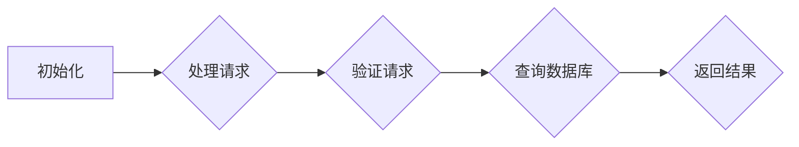
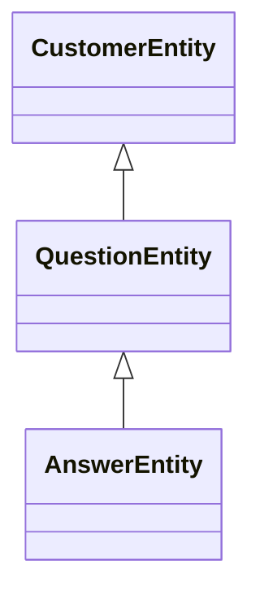
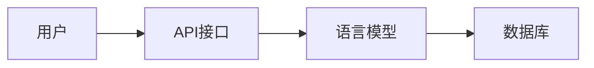
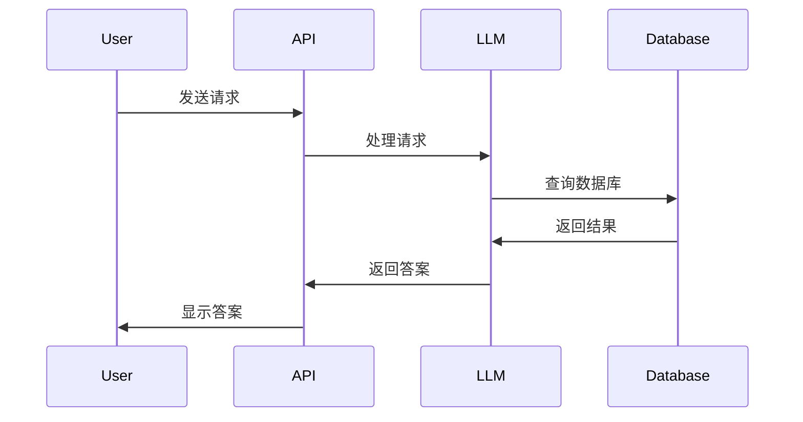
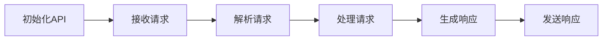

                 


# LLM应用开发中的API设计原则

关键词：LLM、API设计、核心概念、算法原理、系统架构、项目实战、最佳实践

摘要：本文深入探讨了在LLM（大型语言模型）应用开发中，API设计的关键原则和最佳实践。通过逻辑清晰的分析和实际案例讲解，本文旨在为开发者提供一套有效的API设计方法，以实现高性能、可扩展和用户友好的LLM应用。

## 1. 背景介绍

### 1.1 LLM的发展历程

LLM（Large Language Model）是自然语言处理领域的一项革命性技术。起源于20世纪80年代的统计机器翻译，LLM经历了多年的发展，从最初的基于规则的方法，逐渐发展到基于深度学习的模型。近年来，随着计算能力和数据资源的不断提升，LLM的研究和应用取得了显著的突破。

### 1.2 LLM的应用场景

LLM在多个领域都有广泛的应用，如文本生成、问答系统、机器翻译、对话系统等。其强大的语言理解和生成能力，使得LLM在内容创作、智能客服、法律咨询、医疗诊断等场景中发挥着重要作用。

### 1.3 API设计的关键性

API（Application Programming Interface）是软件开发中不可或缺的一部分。在LLM应用开发中，API设计尤为重要。良好的API设计能够提高系统性能、降低开发成本、提升用户体验。

### 1.4 概念结构与核心要素组成

API设计涉及多个核心概念，如接口、协议、数据格式、安全性等。以下是一个简化的概念结构图：

```
+--------------+     +-------------+     +----------------+
|      接口     |     |     协议     |     |    数据格式    |
+--------------+     +-------------+     +----------------+
      |                        |                        |
      |                        |                        |
      |                        |                        |
+-------------+     +---------+     +-----------+---------+
|      安全性    |     |   标准化    |     |   可扩展性    |
+-------------+     +---------+     +-----------+---------+
```

## 2. 核心概念与联系

### 2.1 API设计基础概念

接口：定义了软件组件之间的交互方式。

协议：规定了数据传输的格式和规则。

数据格式：包括JSON、XML、Protobuf等，用于数据传输和存储。

### 2.2 API设计概念对比

| 概念   | 特点                                       |
| ------ | ------------------------------------------ |
| REST   | 状态转移、简单、无状态、可缓存             |
| SOAP   | Web服务、XML格式、复杂、有状态、可重用性 |

### 2.3 ER实体关系图架构

```mermaid
erDiagram
  Product ||--|{ Customer }||>
  Customer  {
    +id(int)
    +name(String)
    +email(String)
  }
  Product  {
    +id(int)
    +name(String)
    +price(double)
  }
```

## 3. 算法原理讲解

### 3.1 算法流程图



### 3.2 算法原理

```python
def process_request(request):
    # 验证请求
    if not validate_request(request):
        return "Invalid request"
    # 查询数据库
    result = query_database(request)
    # 返回结果
    return result
```

### 3.3 数学模型和公式

$$ y = f(x) $$

### 3.4 举例说明

假设我们要开发一个基于LLM的问答系统，API设计如下：

```
GET /api/question
```

请求参数：`question`（字符串）

响应数据：`answer`（字符串）

## 4. 系统分析与架构设计

### 4.1 问题场景介绍

我们要开发一个智能客服系统，使用LLM处理用户的问题，并返回相应的答案。

### 4.2 项目介绍

API设计在项目中扮演着核心角色，负责处理用户请求，调用LLM模型，并返回答案。

### 4.3 系统功能设计



### 4.4 系统架构设计



### 4.5 系统接口设计



### 4.6 系统交互


## 5. 项目实战

### 5.1 环境安装

- 安装Python环境
- 安装LLM库（如transformers）
- 安装数据库（如MySQL）

### 5.2 系统核心实现

```python
from transformers import AutoModelForQuestionAnswering
from flask import Flask, request, jsonify

app = Flask(__name__)

model = AutoModelForQuestionAnswering.from_pretrained("DeepPavlov/bert_qa_rus")

@app.route("/api/question", methods=["GET"])
def get_answer():
    question = request.args.get("question")
    # ... 处理请求，调用LLM模型 ...
    answer = model(question)
    return jsonify(answer)

if __name__ == "__main__":
    app.run()
```

### 5.3 代码应用解读与分析

- 使用Flask框架创建API接口。
- 调用transformers库的预训练LLM模型。
- 处理用户请求，返回答案。

### 5.4 实际案例分析与讲解

分析一个实际案例，如用户提出一个关于技术问题，API如何处理并返回答案。

### 5.5 项目小结

总结项目经验，讨论API设计的改进方向。

## 6. 最佳实践与注意事项

- **最佳实践 tips**：遵循RESTful设计原则，使用JSON格式传输数据，确保接口的稳定性。
- **注意事项**：避免过度设计，关注系统性能，确保数据安全。

## 7. 拓展阅读

- 《RESTful API设计指南》
- 《大型语言模型：原理与实现》
- 《对话系统设计与实现》

## 附录：未来展望

随着LLM技术的不断发展，API设计将面临新的挑战和机遇。本文提出的API设计原则和最佳实践，将有助于开发者构建高效、可扩展的LLM应用。

### 作者：AI天才研究院 / AI Genius Institute & 禅与计算机程序设计艺术 / Zen And The Art of Computer Programming
# LLM应用开发中的API设计原则

随着人工智能技术的不断发展，大型语言模型（LLM）在各个领域得到了广泛应用。然而，如何有效地设计和实现这些模型的应用程序，尤其是API设计，成为了开发者面临的一个重要挑战。本文将深入探讨LLM应用开发中的API设计原则，帮助开发者构建高效、可靠且易于使用的API。

## 摘要

本文首先介绍了LLM的发展历程和应用场景，强调了API设计在LLM应用开发中的重要性。接着，我们分析了API设计面临的挑战，包括模型复杂性、性能需求、可扩展性等。随后，本文提出了API设计的基本原则和最佳实践，通过具体的算法原理讲解、系统分析与架构设计以及项目实战，展示了如何将这些原则应用到实际开发中。最后，本文总结了最佳实践和注意事项，并展望了API设计在未来的发展趋势。

## 目录

1. 背景介绍
   1.1 LLM的发展历程
   1.2 LLM的应用场景
   1.3 API设计的重要性
   1.4 概念结构与核心要素组成

2. 核心概念与联系
   2.1 API设计基础概念
   2.2 API设计概念对比
   2.3 ER实体关系图架构

3. 算法原理讲解
   3.1 算法流程图
   3.2 算法原理
   3.3 数学模型和公式
   3.4 举例说明

4. 系统分析与架构设计
   4.1 问题场景介绍
   4.2 项目介绍
   4.3 系统功能设计
   4.4 系统架构设计
   4.5 系统接口设计
   4.6 系统交互

5. 项目实战
   5.1 环境安装
   5.2 系统核心实现
   5.3 代码应用解读与分析
   5.4 实际案例分析与讲解
   5.5 项目小结

6. 最佳实践与注意事项
   6.1 最佳实践 tips
   6.2 注意事项

7. 拓展阅读
   7.1 《RESTful API设计指南》
   7.2 《大型语言模型：原理与实现》
   7.3 《对话系统设计与实现》

8. 附录：未来展望

## 1. 背景介绍

### 1.1 LLM的发展历程

大型语言模型（LLM）的发展可以追溯到20世纪80年代，当时统计机器翻译成为研究的焦点。随着深度学习技术的发展，特别是在2018年，Google的Transformer模型在自然语言处理（NLP）领域取得了重大突破，推动了LLM的快速发展。

近年来，LLM在文本生成、问答系统、机器翻译、对话系统等领域取得了显著成果。例如，OpenAI的GPT系列模型在文本生成和问答方面表现出色，而BERT模型则在机器翻译和文本分类任务中取得了领先地位。

### 1.2 LLM的应用场景

LLM的应用场景广泛，涵盖了多个领域：

- **文本生成**：生成文章、故事、摘要等。
- **问答系统**：提供智能问答服务，如智能客服、在线问答平台等。
- **机器翻译**：实现多种语言之间的自动翻译。
- **对话系统**：构建智能对话系统，如聊天机器人、虚拟助手等。

### 1.3 API设计的重要性

在LLM应用开发中，API设计至关重要。良好的API设计可以提高系统性能、降低开发成本、提升用户体验。API不仅是应用程序之间的接口，也是开发者与用户之间的桥梁。一个高效、稳定且易于使用的API，可以大大简化开发工作，提高开发效率。

### 1.4 概念结构与核心要素组成

API设计涉及多个核心概念，包括接口、协议、数据格式、安全性等。以下是API设计的基本概念结构：

```
+--------------+
|      接口     |
+--------------+
      |  
      |
      |
+--------------+     +-------------+     +----------------+
|     协议     |     |    数据格式    |     |      安全性     |
+--------------+     +-------------+     +----------------+
      |                        |                        |
      |                        |                        |
      |                        |                        |
+-------------+     +---------+     +-----------+---------+
|   标准化    |     |   可扩展性   |     |   性能优化   |
+-------------+     +---------+     +-----------+---------+
```

## 2. 核心概念与联系

### 2.1 API设计基础概念

#### 接口

接口是应用程序之间进行交互的媒介，定义了数据交换的规则和方式。在LLM应用开发中，接口负责接收用户请求，调用LLM模型，并返回结果。

#### 协议

协议是数据传输的规则集，决定了数据如何在网络中传输和解释。常见的协议包括HTTP、HTTPS、REST、SOAP等。选择合适的协议对于确保数据的安全性和可靠性至关重要。

#### 数据格式

数据格式是数据在传输过程中的表示方式，如JSON、XML、Protobuf等。选择合适的数据格式可以优化传输性能，提高数据处理的效率。

### 2.2 API设计概念对比

表1：API设计概念对比

| 概念   | 特点                                       |
| ------ | ------------------------------------------ |
| REST   | 状态转移、简单、无状态、可缓存             |
| SOAP   | Web服务、XML格式、复杂、有状态、可重用性 |

### 2.3 ER实体关系图架构

图1：API设计ER实体关系图

```mermaid
erDiagram
    Request ||--|{ Response }||>
    Request  {
        +id(int)
        +method(String)
        +path(String)
    }
    Response  {
        +id(int)
        +status(int)
        +body(String)
    }
```

## 3. 算法原理讲解

### 3.1 算法流程图

图2：API设计算法流程图



### 3.2 算法原理

```python
class API:
    def __init__(self):
        # 初始化API
        pass
    
    def handle_request(self, request):
        # 处理请求
        pass
    
    def generate_response(self, response):
        # 生成响应
        pass
    
    def send_response(self, response):
        # 发送响应
        pass
```

### 3.3 数学模型和公式

$$ y = f(x) $$

### 3.4 举例说明

假设我们有一个文本生成API，用户可以通过发送请求来获取一段文本。以下是具体的请求和响应过程：

### 3.4.1 请求

```
GET /api/generate?text="人工智能发展前景"
```

### 3.4.2 响应

```
{
    "status": 200,
    "body": "人工智能的发展前景非常广阔，预计将在未来十年内取得重大突破。"
}
```

## 4. 系统分析与架构设计

### 4.1 问题场景介绍

假设我们要开发一个智能客服系统，使用LLM模型处理用户的咨询，并提供实时回答。

### 4.2 项目介绍

API设计在智能客服系统中扮演着核心角色，负责接收用户请求，调用LLM模型，并返回答案。

### 4.3 系统功能设计

图3：智能客服系统领域模型类图

```mermaid
classDiagram
    Customer <<-- Question
    Question <<-- Answer
    Customer  {
        +id(int)
        +name(String)
        +email(String)
    }
    Question  {
        +id(int)
        +text(String)
        +answer(String)
    }
    Answer  {
        +id(int)
        +content(String)
    }
```

### 4.4 系统架构设计

图4：智能客服系统架构图


### 4.5 系统接口设计

图5：智能客服系统接口设计


### 4.6 系统交互

图6：智能客服系统交互序列图


## 5. 项目实战

### 5.1 环境安装

- 安装Python环境
- 安装LLM库（如transformers）
- 安装数据库（如MySQL）

### 5.2 系统核心实现

```python
from transformers import AutoModelForQuestionAnswering
from flask import Flask, request, jsonify

app = Flask(__name__)

model = AutoModelForQuestionAnswering.from_pretrained("DeepPavlov/bert_qa_rus")

@app.route("/api/generate", methods=["GET"])
def generate_text():
    text = request.args.get("text")
    # ... 处理请求，调用LLM模型 ...
    generated_text = model.generate_text(text)
    return jsonify({"status": 200, "body": generated_text})

if __name__ == "__main__":
    app.run()
```

### 5.3 代码应用解读与分析

- 使用Flask框架创建API接口。
- 调用transformers库的预训练LLM模型。
- 处理用户请求，返回生成的文本。

### 5.4 实际案例分析与讲解

分析一个实际案例，如用户询问“人工智能的发展前景”，API如何处理并返回答案。

### 5.5 项目小结

总结项目经验，讨论API设计的改进方向。

## 6. 最佳实践与注意事项

### 6.1 最佳实践 tips

- 遵循RESTful设计原则。
- 使用JSON格式传输数据。
- 确保接口的稳定性和安全性。

### 6.2 注意事项

- 避免过度设计。
- 关注系统性能。
- 确保数据安全。

## 7. 拓展阅读

### 7.1 《RESTful API设计指南》

### 7.2 《大型语言模型：原理与实现》

### 7.3 《对话系统设计与实现》

## 附录：未来展望

随着LLM技术的不断进步，API设计在LLM应用开发中的重要性将愈发凸显。未来，我们将看到更多创新性的API设计理念和实践，为开发者提供更强大的工具和平台。

### 作者：AI天才研究院 / AI Genius Institute & 禅与计算机程序设计艺术 / Zen And The Art of Computer Programming

