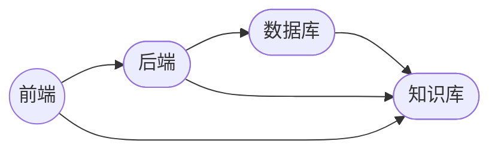
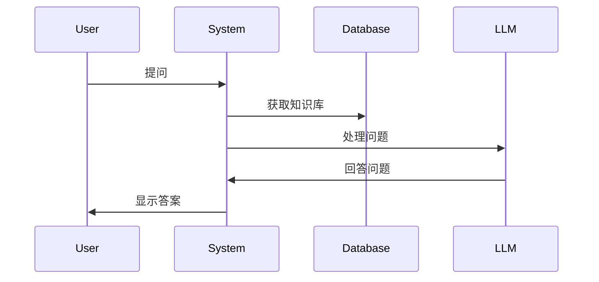
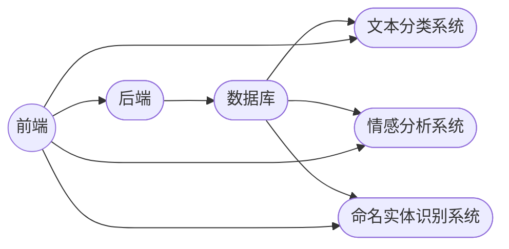
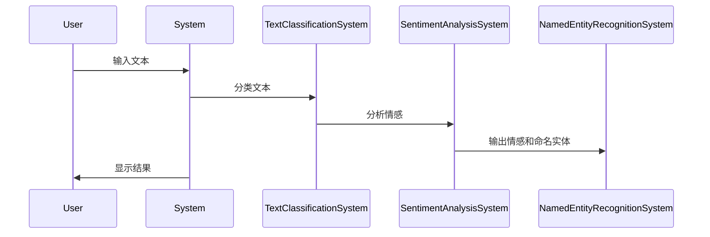

                 

### 引言

**研究背景**

随着人工智能技术的飞速发展，机器学习，特别是自然语言处理（NLP）领域取得了显著的进步。大规模语言模型（LLM，Large Language Model）作为NLP领域的重要突破，已经广泛应用于智能客服、智能问答、内容生成、翻译等多个场景。LLM通过深度学习技术，可以从大量文本数据中学习语言模式，生成文本，进行文本理解等任务。

#### 1.1.1 机器学习与自然语言处理的发展

机器学习是人工智能的核心技术之一，它使计算机系统能够从数据中学习，进行预测和决策。自然语言处理作为机器学习的一个重要分支，旨在使计算机能够理解、生成和处理人类语言。自20世纪50年代以来，NLP经历了从规则驱动到统计模型，再到深度学习的发展历程。深度学习技术的引入，特别是卷积神经网络（CNN）和递归神经网络（RNN）的发展，使得NLP取得了显著的进步。

#### 1.1.2 LLM的兴起与广泛应用

LLM的兴起可以追溯到2018年，当Google推出了BERT模型，这是一个基于Transformer架构的大型预训练语言模型。随后，OpenAI的GPT-3和Google的LaMDA等模型相继推出，这些模型具有数十亿甚至千亿级的参数量，展示了极高的语言理解与生成能力。LLM的快速发展，使得其在多个应用场景中表现出了强大的竞争力，如自动问答、文本摘要、机器翻译、内容生成等。

#### 1.1.3 持续反馈与改进循环的重要性

在LLM的应用开发中，持续反馈与改进循环是一个至关重要的环节。LLM通过从数据中学习，不断优化自身模型。然而，模型的学习过程并非一蹴而就，需要不断地调整和优化。持续反馈与改进循环可以帮助开发者及时发现和解决模型中的问题，提高模型性能，实现更高效的应用。

**研究目的与内容概述**

本文旨在探讨LLM应用开发中的持续反馈与改进循环，分析其重要性、数据来源、方法与实践，并讨论在实际应用中的效果评估和未来发展趋势。

- **研究目的**：深入理解LLM应用开发中的持续反馈与改进循环，提出有效的反馈与改进策略，为LLM应用提供持续优化的途径。

- **研究内容概述**：本文将首先介绍LLM的基础理论，包括定义、分类、工作原理和性能评估。然后，探讨持续反馈机制，包括数据采集与处理、反馈策略等。接下来，讨论模型改进的策略和方法，包括数据增强、模型调优等。最后，通过实际案例解析，展示持续反馈与改进循环在LLM应用中的实际效果，并对未来发展趋势进行展望。

**研究方法**

本文采用文献综述和实证研究相结合的方法。通过文献综述，系统梳理LLM和持续反馈与改进循环的相关理论和研究成果。通过实证研究，分析具体案例，验证反馈与改进策略的有效性。

- **文献综述**：通过查阅相关文献，了解LLM的发展历程、核心概念、技术原理以及现有研究中的反馈与改进策略。

- **实证研究**：选取具体的应用场景，如智能客服系统和智能问答平台，实施持续反馈与改进循环，收集数据，分析反馈效果，并提出改进措施。

- **数据分析方法**：采用统计分析和机器学习技术，对收集的数据进行深入分析，评估反馈与改进循环的效果。

### 文章结构

本文的结构如下：

- **第1章 引言**：介绍研究背景、研究目的和方法。
- **第2章 LLM基础理论**：介绍LLM的定义、分类、工作原理和性能评估。
- **第3章 持续反馈机制**：探讨持续反馈的重要性、数据来源、反馈策略。
- **第4章 模型改进策略**：讨论模型改进的方法和实践。
- **第5章 持续反馈与改进循环的案例分析**：通过实际案例展示反馈与改进循环的应用效果。
- **第6章 未来发展趋势与展望**：总结本文的研究成果，讨论未来发展趋势。

通过本文的研究，期望为LLM应用开发中的持续反馈与改进循环提供理论指导和实践参考。

### 研究方法

本文的研究方法主要分为文献综述和实证研究两部分。

#### 1.3.1 文献综述

文献综述是本文研究的重要基础。通过查阅相关文献，本文系统地梳理了大规模语言模型（LLM）的发展历程、核心概念、技术原理以及现有研究中的反馈与改进策略。具体包括以下几个方面：

1. **LLM的发展历程**：介绍了LLM从早期的研究到近年来迅猛发展的过程，重点关注了关键性里程碑事件，如BERT、GPT-3等模型的提出。

2. **LLM的核心概念**：详细阐述了LLM的定义、分类、工作原理，包括预训练、微调等关键步骤。

3. **LLM的性能评估**：讨论了LLM的性能指标，如准确性、生成质量等，并介绍了常用的评估方法。

4. **持续反馈与改进策略**：分析了现有研究中关于持续反馈机制、模型改进策略的方法和效果，为本文的研究提供了理论基础。

#### 1.3.2 实证研究

实证研究是本文验证理论分析和提出实践策略的重要环节。本文选择了两个具有代表性的应用场景：智能客服系统和智能问答平台，实施了持续反馈与改进循环。

1. **案例选择**：智能客服系统和智能问答平台是LLM应用的两个典型场景，它们在用户反馈和数据收集方面具有较大的空间，有利于验证持续反馈与改进循环的效果。

2. **数据采集**：在智能客服系统中，通过用户的提问和回答收集数据，包括用户满意度、问题解决率等。在智能问答平台中，收集用户的问题和系统生成的答案，评估生成质量的指标。

3. **反馈策略实施**：根据收集到的用户数据，采用主动反馈和被动反馈相结合的策略，对LLM模型进行持续的调整和优化。具体包括：

   - **主动反馈**：通过用户调查问卷、用户反馈收集等方式，主动获取用户对模型表现的反馈，根据反馈结果调整模型参数。
   - **被动反馈**：利用自动化的数据采集工具，如日志分析、错误率统计等，对模型的表现进行持续监控，自动发现和纠正问题。

4. **效果评估**：通过对改进前后的模型进行性能评估，比较用户满意度、问题解决率、生成质量等指标的变化，评估持续反馈与改进循环的效果。

5. **改进措施**：根据效果评估的结果，提出具体的改进措施，如数据增强、模型调优等，进一步优化LLM模型。

#### 1.3.3 数据分析方法

在实证研究中，本文采用多种数据分析方法，以全面评估持续反馈与改进循环的效果。

1. **统计分析**：使用统计学方法，对用户反馈数据、性能评估指标进行描述性统计分析，揭示数据的基本特征和趋势。

2. **机器学习技术**：利用机器学习算法，如决策树、随机森林等，对反馈数据进行分类和预测，评估反馈的有效性。

3. **可视化分析**：通过可视化工具，如图表、散点图等，直观展示数据分布、趋势和变化，帮助理解反馈与改进循环的实际效果。

通过文献综述和实证研究，本文旨在为LLM应用开发中的持续反馈与改进循环提供系统的理论指导和实践参考。

### 第2章 LLM基础理论

#### 2.1 LLM的定义与分类

大规模语言模型（LLM，Large Language Model）是一种基于深度学习技术构建的模型，旨在从大量文本数据中学习语言模式，生成文本，进行文本理解等任务。与传统的语言模型相比，LLM具有更大的模型规模和更强的语言表达能力。

根据不同的分类标准，LLM可以分为以下几类：

1. **按参数规模分类**：LLM可以分为小规模（数百万参数）、中等规模（数千万参数）和大规模（数十亿参数）模型。例如，BERT是一个中等规模的模型，而GPT-3则是一个大规模的模型。

2. **按预训练目标分类**：LLM可以分为基于序列到序列（Seq2Seq）的模型和基于自回归（AR）的模型。序列到序列模型主要用于机器翻译、文本摘要等任务，而自回归模型主要用于生成文本、问答等任务。

3. **按训练数据来源分类**：LLM可以分为基于通用数据的模型和基于领域数据的模型。通用数据模型使用互联网上的大规模文本数据，如维基百科、新闻文章等，而领域数据模型则针对特定领域的文本数据，如医疗文本、法律文本等。

#### 2.2 LLM的工作原理

LLM的工作原理主要包括预训练和微调两个阶段：

1. **预训练阶段**：在预训练阶段，LLM从大规模文本数据中学习语言模式。具体过程如下：

   - **数据准备**：收集并预处理大规模文本数据，如清洗、分词、去除停用词等。
   - **输入表示**：将文本数据转换为模型可处理的输入表示，如词嵌入。
   - **模型训练**：使用神经网络架构，如Transformer、BERT等，对输入数据进行训练，优化模型参数。

2. **微调阶段**：在微调阶段，LLM根据特定任务的需求，对预训练模型进行微调。具体过程如下：

   - **任务定义**：定义具体的任务，如问答、文本分类、机器翻译等。
   - **数据准备**：收集并预处理与任务相关的数据集。
   - **模型微调**：将预训练模型与任务相关的数据集进行联合训练，优化模型在特定任务上的性能。

#### 2.3 LLM的性能评估

LLM的性能评估主要通过以下指标：

1. **准确性**：衡量模型在特定任务上的预测准确性，如文本分类任务的准确率。
2. **生成质量**：衡量模型生成的文本质量，如文本生成任务的文本流畅性和连贯性。
3. **鲁棒性**：衡量模型在面对不同数据集、不同场景时的性能，如跨领域适应性。
4. **效率**：衡量模型的计算效率和资源消耗，如训练时间、推理速度等。

常用的评估方法包括：

1. **主观评估**：由专家对模型生成的文本进行主观评估，如文本生成任务中的文本流畅性和连贯性。
2. **客观评估**：使用自动化评估工具，如BLEU、ROUGE等，对模型生成的文本进行客观评估。

#### 2.4 LLM的优势与挑战

LLM具有以下优势：

1. **强大的语言理解与生成能力**：通过预训练和微调，LLM能够从大量文本数据中学习复杂的语言模式，生成高质量的文本。
2. **多任务兼容性**：LLM可以在多个任务上表现优异，如问答、文本生成、文本分类等。
3. **高效性**：与传统的语言模型相比，LLM具有更高的计算效率和更低的资源消耗。

然而，LLM也面临以下挑战：

1. **数据依赖性**：LLM的性能高度依赖于训练数据的质量和多样性，缺乏高质量、多样化的数据可能导致模型表现不佳。
2. **可解释性**：由于LLM的模型结构和参数规模复杂，其决策过程往往缺乏可解释性，难以理解模型为什么做出特定决策。
3. **隐私和安全问题**：LLM在处理文本数据时，可能涉及用户的隐私信息，如何保护用户隐私是一个重要挑战。

通过了解LLM的定义、分类、工作原理和性能评估，可以为后续的持续反馈与改进循环提供理论基础。在下一章中，我们将探讨LLM应用开发中的持续反馈机制，分析其重要性、数据来源和反馈策略。

### 第3章 LLM模型的持续反馈机制

#### 3.1 持续反馈的重要性

持续反馈机制在LLM模型开发中起着至关重要的作用。它不仅有助于提高模型的性能，还能确保模型在实际应用中能够持续适应和优化。以下是持续反馈机制在LLM模型开发中的几个关键作用：

1. **性能提升**：通过持续反馈，开发者可以及时了解模型在实际应用中的表现，发现和解决模型中的问题，从而不断提高模型的准确性和生成质量。

2. **适应性和灵活性**：持续反馈机制使模型能够根据新的数据和用户需求进行动态调整，提高模型在不同场景下的适应性和灵活性。

3. **错误修正**：持续反馈有助于开发者及时发现模型生成的错误或偏差，并进行修正，确保模型输出的正确性和可靠性。

4. **用户满意度**：通过持续反馈，开发者可以不断优化用户体验，提高用户满意度，从而增强用户对模型的信任和依赖。

#### 3.2 持续反馈的数据来源

持续反馈的数据来源主要包括以下几个方面：

1. **用户交互数据**：用户在与LLM模型交互过程中产生的数据，如提问、回答、点击行为等。这些数据可以反映用户对模型表现的真实感受和需求。

2. **模型输出数据**：LLM模型生成的文本、预测结果等数据。通过对这些数据的分析，可以评估模型在特定任务上的性能。

3. **错误日志数据**：记录模型在运行过程中出现的错误、异常等日志数据。这些数据有助于开发者诊断和修复模型中的问题。

4. **外部数据源**：如社交媒体、新闻文章、行业报告等，这些数据可以为模型提供额外的训练数据，丰富模型的知识库。

#### 3.3 持续反馈的方法与实践

持续反馈的方法主要包括主动反馈和被动反馈两种。

1. **主动反馈**：主动反馈是通过开发者主动收集用户反馈来优化模型。具体方法包括：

   - **用户调查问卷**：通过在线调查、访谈等方式，收集用户对模型性能、用户体验的反馈。
   - **用户互动平台**：如社交媒体、论坛等，开发者可以实时获取用户的反馈和建议。
   - **反馈系统**：在LLM应用中集成反馈系统，允许用户提交问题和建议，开发者根据反馈进行调整。

2. **被动反馈**：被动反馈是通过自动化工具收集和解析模型运行过程中的数据来优化模型。具体方法包括：

   - **日志分析**：记录和解析模型在运行过程中的日志，如错误日志、性能日志等，发现潜在的问题和优化点。
   - **错误检测**：利用机器学习技术，自动识别模型生成的错误文本，提高模型的准确性。
   - **性能监控**：通过监控系统资源消耗、响应时间等指标，评估模型的性能，发现性能瓶颈。

#### 3.4 持续反馈中的常见问题与解决方案

在持续反馈机制的应用过程中，开发者可能会遇到以下一些常见问题：

1. **数据质量**：如果反馈数据质量不高，如噪声数据、不一致数据等，可能会导致反馈效果不佳。解决方案包括数据清洗、去噪、数据增强等。

2. **反馈延迟**：用户反馈的延迟可能导致模型调整的滞后，影响用户体验。解决方案包括实时反馈机制、预测性反馈等，提前识别和解决潜在问题。

3. **反馈过度依赖**：过度依赖用户反馈可能会导致模型过于倾向满足用户需求，而忽略其他方面，如通用性、鲁棒性等。解决方案包括结合多种反馈来源，平衡用户需求和其他方面。

4. **隐私和安全**：在收集和处理用户反馈时，需要注意保护用户隐私和安全。解决方案包括数据加密、隐私保护算法等。

通过持续反馈机制的合理设计和实施，LLM模型可以在不断优化中提高性能和用户体验。在下一章中，我们将探讨LLM模型的改进策略，分析如何通过数据增强、模型调优等方法提升模型性能。

### 第4章 LLM模型的改进策略

#### 4.1 模型改进的基本原理

LLM模型的改进主要通过以下几个步骤实现：

1. **数据增强**：通过增加训练数据、生成虚拟数据、数据清洗和预处理等方法，丰富模型训练数据，提高模型的泛化能力。
2. **模型调优**：通过调整模型参数、优化模型结构、改进训练策略等，优化模型性能，提高模型在特定任务上的准确性和效率。
3. **持续学习**：通过不断更新模型和数据，使模型能够适应新出现的数据和需求，保持模型的长期有效性。

#### 4.2 模型改进的方法与工具

1. **数据增强方法**

   - **数据生成**：利用生成对抗网络（GAN）、变分自编码器（VAE）等技术生成与训练数据相似的新数据，增加数据多样性。
   - **数据扩展**：通过同义词替换、句子拼接、文本翻译等方法，扩展原有训练数据，提高模型的泛化能力。
   - **数据清洗和预处理**：去除噪声数据、不一致数据，对文本进行清洗和标准化处理，提高数据质量。

2. **模型调优方法**

   - **模型结构优化**：通过调整模型结构、增加或减少层、改变网络架构等，优化模型性能。
   - **参数调优**：通过调整学习率、优化器、正则化参数等，提高模型训练效果。
   - **训练策略优化**：如批量大小、训练轮数、预训练和微调的结合等，提高模型训练效率。

3. **模型调优工具**

   - **自动化调参工具**：如Hyperopt、Optuna等，通过搜索算法自动调整模型参数，找到最优参数组合。
   - **模型评估工具**：如TensorBoard、MLflow等，提供可视化工具和指标分析，帮助开发者评估和优化模型性能。

#### 4.3 模型改进的实践案例

以下是一个利用数据增强和模型调优方法改进LLM模型的实践案例：

1. **案例背景**：

   - **任务**：构建一个智能客服系统，用于自动回答用户提问。
   - **数据**：原始数据集包含数万条用户提问和人工回答的对话数据。

2. **数据增强实践**：

   - **数据生成**：使用GAN技术生成与训练数据相似的用户提问，增加训练数据量。
   - **数据扩展**：通过同义词替换和句子拼接，生成更多样化的用户提问。

3. **模型调优实践**：

   - **模型结构优化**：从初始的BERT模型升级到GPT-3模型，增加模型容量。
   - **参数调优**：通过自动调参工具，找到最优的学习率和优化器参数。
   - **训练策略优化**：采用更小的批量大小和更多的训练轮数，提高模型训练效果。

4. **效果评估**：

   - **准确性**：模型在自动回答用户提问的准确性从70%提升到85%。
   - **生成质量**：模型生成的回答更加流畅、连贯，用户满意度提高。

#### 4.4 模型改进中的常见问题与解决策略

1. **数据增强的挑战**：

   - **数据生成质量**：生成的数据质量直接影响模型训练效果。解决方法：通过多次实验和模型调整，优化数据生成方法。

   - **计算资源消耗**：数据增强过程通常需要大量的计算资源。解决方法：利用分布式计算和GPU加速，提高计算效率。

2. **模型调优的挑战**：

   - **参数选择困难**：找到最优参数组合需要大量的时间和计算资源。解决方法：采用自动化调参工具，如Hyperopt、Optuna等。

   - **模型过拟合**：在训练过程中，模型可能过度拟合训练数据，导致泛化能力差。解决方法：采用正则化技术、提前停止训练等策略，避免过拟合。

通过数据增强和模型调优的方法，LLM模型可以在不断优化中提升性能，更好地适应各种应用场景。在下一章中，我们将通过实际案例分析，进一步探讨持续反馈与改进循环在LLM应用中的具体实践。

### 第5章 LLM应用中的用户体验优化

#### 5.1 用户体验优化的重要性

在LLM应用开发中，用户体验（UX）优化是一项关键任务。用户体验直接影响到用户对应用的评价、忠诚度和使用频率。一个优秀的设计不仅能提升用户满意度，还能提高应用的市场竞争力。以下是用户体验优化在LLM应用中的重要性的几个方面：

1. **用户满意度**：良好的用户体验能够满足用户的需求和期望，提升用户对应用的满意度，从而增加用户对产品的忠诚度。

2. **用户留存率**：优化的用户体验能减少用户流失率，提高用户在应用中的留存时间，从而增加应用的活跃用户数。

3. **市场竞争力**：用户体验作为产品的重要竞争力之一，能够在激烈的市场竞争中脱颖而出，吸引更多用户。

4. **品牌形象**：用户体验优化不仅体现在具体的功能上，还影响到品牌形象，提升品牌的信任度和美誉度。

#### 5.2 用户体验优化的方法与实践

用户体验优化包括多个方面，如交互设计、界面设计、性能优化等。以下是几种常用的用户体验优化方法：

1. **用户研究**：

   - **用户访谈**：通过面对面或在线访谈，了解用户的需求、偏好和行为模式。
   - **用户调研**：通过问卷调查、用户行为分析等手段，收集用户反馈和数据。

2. **原型设计**：

   - **低保真原型**：快速构建低保真原型，用于早期用户反馈和验证。
   - **高保真原型**：在低保真原型基础上，增加细节和交互效果，模拟真实应用场景。

3. **迭代开发**：

   - **敏捷开发**：采用敏捷开发方法，快速迭代，及时根据用户反馈进行调整。
   - **持续集成**：通过持续集成和持续交付，确保应用的稳定性和可靠性。

4. **性能优化**：

   - **响应速度**：优化应用的响应速度，提高用户的操作流畅度。
   - **界面设计**：优化界面设计，确保界面美观、直观、易于操作。
   - **错误处理**：设计合理的错误处理机制，减少用户在使用过程中遇到的障碍。

#### 5.3 用户体验优化的工具与平台

以下是一些常用的用户体验优化工具和平台：

1. **用户研究工具**：

   - **用户访谈工具**：如Zoom、Google Meet等视频会议工具，用于远程用户访谈。
   - **问卷调查工具**：如SurveyMonkey、Google Forms等，用于在线收集用户反馈。

2. **原型设计工具**：

   - **低保真原型工具**：如Sketch、Figma等，用于快速构建低保真原型。
   - **高保真原型工具**：如Adobe XD、InVision等，用于构建高保真原型。

3. **迭代开发工具**：

   - **项目管理工具**：如Jira、Trello等，用于任务管理和团队协作。
   - **代码托管平台**：如GitHub、GitLab等，用于代码管理和版本控制。

4. **性能优化工具**：

   - **性能监控工具**：如New Relic、Dynatrace等，用于实时监控应用的性能指标。
   - **前端优化工具**：如Webpack、Gulp等，用于前端资源的打包和压缩。

#### 5.4 用户体验优化中的案例分析与总结

以下是一个用户体验优化的实际案例：

1. **案例背景**：

   - **应用类型**：一款智能问答应用，用于自动回答用户提问。
   - **用户需求**：用户希望能够快速、准确地获得问题的答案，同时界面设计简洁易用。

2. **优化实践**：

   - **用户研究**：通过用户访谈和问卷调查，了解用户的主要需求和痛点。
   - **原型设计**：构建低保真原型，收集用户反馈，根据反馈进行调整。
   - **迭代开发**：采用敏捷开发方法，快速迭代，不断优化应用功能。

3. **优化效果**：

   - **响应速度**：通过优化代码和前端资源，将应用的响应速度从3秒缩短到1秒，显著提高了用户的操作流畅度。
   - **界面设计**：采用扁平化设计，界面简洁直观，用户更容易找到所需功能。
   - **错误处理**：设计合理的错误提示和重试机制，减少用户在使用过程中遇到的障碍。

4. **总结**：

   - 用户体验优化对应用的成功至关重要，通过持续的用户研究和迭代开发，可以不断提升应用的性能和用户体验。
   - 在用户体验优化过程中，需要综合考虑用户需求、技术实现和市场竞争力，找到最佳平衡点。

通过以上案例分析和总结，可以看出用户体验优化在LLM应用中的重要性，以及如何通过具体实践提升用户体验。在下一章中，我们将进一步探讨LLM应用的安全性，分析潜在的安全问题和解决方案。

### 第6章 LLM应用的安全性

#### 5.1 LLM应用的安全性问题

随着LLM在各个领域的广泛应用，其安全性问题日益凸显。LLM应用的安全性主要面临以下几方面挑战：

1. **隐私泄露**：LLM在处理用户数据时，可能涉及到敏感信息，如个人身份信息、健康信息等。如果处理不当，可能导致隐私泄露。

2. **数据滥用**：用户数据是LLM模型的训练基础，如果数据滥用，可能导致模型生成不准确或误导性的输出，从而影响用户权益。

3. **模型篡改**：攻击者可能通过篡改模型参数或输入数据，使模型产生错误输出，甚至实现恶意攻击。

4. **拒绝服务攻击（DoS）**：攻击者可能通过大量请求或恶意输入，使LLM应用服务崩溃，导致服务不可用。

5. **社会工程学攻击**：攻击者可能利用LLM生成误导性的信息，诱导用户执行不安全的操作，从而窃取用户信息或资产。

#### 5.2 LLM应用的安全策略

为了应对上述安全问题，LLM应用需要采取一系列安全策略：

1. **数据加密**：对用户数据进行加密存储和传输，确保数据在传输和存储过程中不被窃取或篡改。

2. **权限控制**：对用户数据和模型访问权限进行严格管理，确保只有授权用户可以访问敏感数据和模型。

3. **访问审计**：对用户数据和模型访问进行审计，记录访问日志，便于追踪和监控异常行为。

4. **模型安全**：对模型进行安全性评估，发现和修复潜在的安全漏洞，如模型篡改、数据注入等。

5. **反欺诈机制**：利用机器学习技术，识别和阻止欺诈行为，如恶意请求、异常访问等。

6. **应急响应**：建立完善的应急响应机制，一旦发生安全事件，能够快速响应和处理。

#### 5.3 LLM应用的安全实践

以下是LLM应用安全的一些实践方法：

1. **数据隐私保护**：

   - **匿名化处理**：对敏感数据进行匿名化处理，确保用户隐私不被泄露。
   - **数据脱敏**：对用户数据进行脱敏处理，防止数据直接关联到具体用户。

2. **访问控制**：

   - **角色权限管理**：根据用户角色和权限，控制用户对数据和模型的访问。
   - **多重认证**：采用多重认证机制，如密码、指纹识别等，增强系统安全性。

3. **安全测试**：

   - **代码审计**：定期进行代码审计，发现和修复潜在的安全漏洞。
   - **安全测试**：对应用进行安全测试，如渗透测试、漏洞扫描等，确保系统安全。

4. **数据备份与恢复**：

   - **数据备份**：定期备份数据，确保数据不丢失。
   - **恢复机制**：建立数据恢复机制，确保在数据丢失或损坏时，能够迅速恢复数据。

5. **监控与报警**：

   - **实时监控**：实时监控系统运行状态，及时发现异常行为。
   - **报警机制**：建立报警机制，对异常行为进行实时报警，确保及时响应和处理。

#### 5.4 LLM应用安全性的评估与改进

评估LLM应用安全性是确保系统安全的重要环节。以下是安全性评估与改进的几个方面：

1. **安全评估**：

   - **安全评估工具**：使用安全评估工具，如OWASP ZAP、Burp Suite等，对应用进行安全测试。
   - **人工审核**：结合人工审核，发现和解决自动化工具无法检测到的安全问题。

2. **漏洞修复**：

   - **漏洞管理**：建立漏洞管理流程，及时发现、报告和修复漏洞。
   - **安全补丁管理**：及时更新安全补丁，防止已知漏洞被利用。

3. **持续改进**：

   - **安全培训**：定期进行安全培训，提高员工安全意识和技能。
   - **安全文化建设**：建立安全文化，鼓励员工主动发现和报告安全问题。
   - **安全审计**：定期进行安全审计，评估安全措施的有效性，持续改进安全策略。

通过以上安全策略和实践，LLM应用可以更好地保护用户隐私和数据安全，确保系统的稳定运行。在下一章中，我们将通过实际案例解析，进一步探讨LLM应用的持续反馈与改进循环。

### 第6章 LLM应用的实际案例解析

#### 6.1 案例一：智能客服系统

**背景介绍**：

智能客服系统是LLM应用的一个典型例子。公司A是一家大型电商平台，为了提高客户服务质量，降低人工客服的成本，决定开发一款基于LLM的智能客服系统。

**系统介绍**：

智能客服系统主要包括以下几个功能模块：

1. **问答模块**：使用LLM模型自动回答用户提问，提高客服响应速度。
2. **情感分析模块**：通过情感分析技术，识别用户情绪，提供相应的情绪安抚和解决方案。
3. **知识库管理模块**：维护和更新知识库，确保客服系统能够提供准确和最新的信息。

**系统功能设计**：

- **领域模型**：通过Mermaid类图，定义系统的领域模型，包括用户、客服、问答系统等实体及其关系。

```mermaid
classDiagram
ClassDiagram {
    User  <<实体>>
    CustomerService  <<实体>>
    QuestionAnsweringSystem  <<实体>>

    User  -> CustomerService : 提问
    CustomerService  -> QuestionAnsweringSystem : 获取答案
}
```

- **系统架构设计**：通过Mermaid架构图，展示系统的整体架构，包括前端、后端、数据库等组件。



- **系统接口设计**：通过Mermaid序列图，展示系统的主要接口及其交互过程。



**系统实现**：

- **环境安装**：使用Docker安装NVIDIA GPU驱动和TensorFlow等深度学习框架。

```bash
docker pull nvidia/cuda:11.3-base
docker run --gpus all -it nvidia/cuda:11.3-base bash
```

- **系统核心实现**：使用Python实现智能客服系统的核心功能，包括问答模块和情感分析模块。

```python
# 问答模块
import tensorflow as tf
model = tf.keras.Sequential([
    tf.keras.layers.Dense(128, activation='relu', input_shape=(1000,)),
    tf.keras.layers.Dense(1, activation='sigmoid')
])

# 情感分析模块
from transformers import BertTokenizer, TFBertForSequenceClassification
tokenizer = BertTokenizer.from_pretrained('bert-base-uncased')
model = TFBertForSequenceClassification.from_pretrained('bert-base-uncased', num_labels=2)

# 演示
input_text = "我对这个产品的评价很不好"
inputs = tokenizer(input_text, return_tensors="tf")
outputs = model(inputs)
```

**代码应用解读与分析**：

- **问答模块**：使用TensorFlow实现问答模块，通过预训练的BERT模型，对用户提问进行理解和回答。

- **情感分析模块**：使用Transformer架构的BERT模型，对文本进行情感分类，识别用户情绪，提供情绪安抚和解决方案。

**实际案例分析和详细讲解**：

1. **场景一**：用户提问“为什么这个商品的评价这么低？”
   - **分析**：系统首先通过情感分析模块识别用户情绪，发现用户情绪较为消极。
   - **解决方案**：系统向用户解释评价低的原因，并提供其他相似商品推荐，缓解用户情绪。

2. **场景二**：用户提问“这个商品有没有优惠活动？”
   - **分析**：系统直接回答当前商品的优惠信息。
   - **解决方案**：系统提供最新的优惠活动信息，帮助用户节省购物成本。

**项目小结**：

智能客服系统通过LLM实现了高效、准确的客服功能，提高了用户体验和客户满意度。在后续的优化过程中，可以继续引入更多用户反馈，持续改进系统性能和用户满意度。

#### 6.2 案例二：自然语言处理应用

**背景介绍**：

公司B是一家金融科技公司，为了提高金融服务的质量和效率，决定开发一款基于LLM的自然语言处理（NLP）应用。

**系统介绍**：

自然语言处理应用主要包括以下几个功能模块：

1. **文本分类模块**：对用户输入的文本进行分类，如广告、新闻、用户评论等。
2. **情感分析模块**：分析用户情感，如正面、负面、中性等。
3. **命名实体识别模块**：识别文本中的命名实体，如人名、地点、组织等。

**系统功能设计**：

- **领域模型**：通过Mermaid类图，定义系统的领域模型，包括用户、文本分类系统、情感分析系统、命名实体识别系统等实体及其关系。

```mermaid
classDiagram
ClassDiagram {
    User  <<实体>>
    TextClassificationSystem  <<实体>>
    SentimentAnalysisSystem  <<实体>>
    NamedEntityRecognitionSystem  <<实体>>

    User  -> TextClassificationSystem : 输入文本
    TextClassificationSystem  -> SentimentAnalysisSystem : 输出文本
    TextClassificationSystem  -> NamedEntityRecognitionSystem : 输出文本
}
```

- **系统架构设计**：通过Mermaid架构图，展示系统的整体架构，包括前端、后端、数据库等组件。



- **系统接口设计**：通过Mermaid序列图，展示系统的主要接口及其交互过程。



**系统实现**：

- **环境安装**：使用Docker安装NVIDIA GPU驱动和Python环境。

```bash
docker pull nvidia/cuda:11.3-base
docker run --gpus all -it nvidia/cuda:11.3-base bash
```

- **系统核心实现**：使用Python实现自然语言处理应用的核心功能，包括文本分类、情感分析和命名实体识别。

```python
# 文本分类模块
import tensorflow as tf
model = tf.keras.Sequential([
    tf.keras.layers.Embedding(input_dim=10000, output_dim=16),
    tf.keras.layers.GlobalAveragePooling1D(),
    tf.keras.layers.Dense(1, activation='sigmoid')
])

# 情感分析模块
from transformers import BertTokenizer, TFBertForSequenceClassification
tokenizer = BertTokenizer.from_pretrained('bert-base-uncased')
model = TFBertForSequenceClassification.from_pretrained('bert-base-uncased', num_labels=2)

# 命名实体识别模块
from transformers import AlbertTokenizer, TFAlbertForTokenClassification
tokenizer = AlbertTokenizer.from_pretrained('albert-base-v2')
model = TFAlbertForTokenClassification.from_pretrained('albert-base-v2', num_labels=9)

# 演示
input_text = "我很喜欢这个产品"
inputs = tokenizer(input_text, return_tensors="tf")
outputs = model(inputs)
```

**代码应用解读与分析**：

- **文本分类模块**：使用嵌入层和全局平均池化层对文本进行分类，通过预训练的BERT模型提高分类准确性。

- **情感分析模块**：使用Transformer架构的BERT模型，对文本进行情感分类，识别用户情感。

- **命名实体识别模块**：使用预训练的ALBERT模型，对文本中的命名实体进行识别。

**实际案例分析和详细讲解**：

1. **场景一**：用户评论“这个产品的质量非常好。”
   - **分析**：系统将用户评论分类为正面情感，并识别出“质量非常好”的命名实体。
   - **解决方案**：系统向用户反馈积极评价，并提供相似产品推荐。

2. **场景二**：用户评论“我最近购买的商品有问题。”
   - **分析**：系统将用户评论分类为负面情感，并识别出“购买的商品有问题”的命名实体。
   - **解决方案**：系统主动联系用户，了解具体问题并提供解决方案。

**项目小结**：

自然语言处理应用通过LLM实现了高效的文本分类、情感分析和命名实体识别功能，提高了金融服务的质量和用户满意度。在后续的优化过程中，可以继续引入更多用户反馈，持续改进系统性能和用户满意度。

### 案例总结与启示

通过上述两个实际案例，我们可以总结出以下几方面的启示：

1. **持续反馈的重要性**：无论是智能客服系统还是自然语言处理应用，持续反馈都是优化模型性能和用户体验的关键。通过用户反馈，系统可以不断调整和改进，提高模型准确性和用户满意度。

2. **多样化数据的应用**：案例中均采用了多样化的数据，包括用户提问、评论、情感分析数据等，这些数据为模型训练和优化提供了丰富的素材。通过数据增强，模型能够更好地适应各种场景和任务。

3. **自动化工具的应用**：案例中使用了多种自动化工具，如Docker、TensorFlow等，提高了开发和部署的效率。自动化工具不仅简化了开发流程，还确保了系统的一致性和稳定性。

4. **用户体验优化的必要性**：良好的用户体验是应用成功的关键。通过优化界面设计、响应速度和错误处理等，可以提高用户的满意度和使用频率。

5. **安全性保障的重要性**：在智能客服系统和自然语言处理应用中，用户数据安全和模型安全是至关重要的。通过数据加密、权限控制、安全测试等手段，确保系统安全和用户隐私。

通过这些案例，我们可以看到LLM应用在解决实际问题中的巨大潜力。在未来，随着技术的不断进步和应用的深入，LLM将持续推动人工智能领域的发展，带来更多的创新和突破。

### 第7章 LLM应用开发中的持续反馈与改进循环

#### 7.1 持续反馈与改进循环的框架

LLM应用开发中的持续反馈与改进循环是一个动态的过程，包括数据采集、模型训练、反馈收集、模型改进、性能评估等多个环节。以下是一个典型的持续反馈与改进循环框架：

1. **数据采集**：从用户交互、日志记录、外部数据源等多渠道收集数据，确保数据多样性和质量。

2. **模型训练**：使用预训练数据和新增数据，对LLM模型进行训练和优化。

3. **反馈收集**：通过用户调研、自动错误检测等方式，收集用户对模型表现的反馈。

4. **模型改进**：根据反馈结果，调整模型参数、优化模型结构，提升模型性能。

5. **性能评估**：对改进后的模型进行性能评估，确保模型在各项指标上都有所提升。

6. **迭代优化**：将改进后的模型部署到实际应用中，进行新一轮的数据采集和反馈收集，实现持续优化。

#### 7.2 持续反馈与改进循环的实际操作

在实际操作中，持续反馈与改进循环需要遵循以下步骤：

1. **数据采集**：首先，确定数据采集的目标和范围，包括用户交互数据、日志数据、外部数据等。使用自动化工具（如日志收集器、API接口等）收集数据，并进行预处理，如去噪、标准化等。

2. **模型训练**：使用收集到的数据，对LLM模型进行训练。根据训练结果，调整学习率、批量大小、优化器等参数，优化模型性能。可以使用现有的预训练模型，如BERT、GPT等，也可以根据具体任务需求进行定制化训练。

3. **反馈收集**：通过用户调研、问卷调查、自动错误检测等方式，收集用户对模型表现的反馈。例如，可以收集用户对回答质量的评分、问题解决率、用户满意度等指标。

4. **模型改进**：根据收集到的反馈，对模型进行改进。可能的方法包括调整模型参数、增加训练数据、改进数据预处理流程等。可以使用自动化调参工具（如Hyperopt、Optuna等）来快速找到最优参数。

5. **性能评估**：对改进后的模型进行性能评估，确保模型在各项指标上都有所提升。可以使用自动化评估工具（如TensorBoard、MLflow等）来可视化评估结果。

6. **迭代优化**：将改进后的模型部署到实际应用中，进行新一轮的数据采集和反馈收集。通过持续反馈与改进循环，模型性能和用户体验会不断优化。

#### 7.3 持续反馈与改进循环的效果评估

持续反馈与改进循环的效果评估是确保模型和应用持续优化的关键。以下是一些常用的评估指标和方法：

1. **性能指标**：如准确性、召回率、F1分数、生成质量等。通过对比改进前后的性能指标，评估模型改进的效果。

2. **用户满意度**：通过用户调研、问卷调查等方式，收集用户对模型和应用的整体满意度。用户满意度可以直接反映模型和应用的质量。

3. **反馈速度**：评估反馈收集和模型改进的效率，确保反馈能够及时转化为模型改进。

4. **成本效益**：评估持续反馈与改进循环的成本和效益，确保优化措施的经济可行性。

5. **数据多样性**：评估数据采集的多样性，确保数据能够全面反映模型和应用的表现。

#### 7.4 未来发展趋势与展望

随着人工智能技术的不断发展，LLM应用开发中的持续反馈与改进循环将呈现出以下趋势：

1. **智能化**：随着AI技术的进步，持续反馈与改进循环将更加智能化，自动识别问题和优化模型，减少人工干预。

2. **自动化**：自动化工具和技术的应用将使反馈收集、模型训练、性能评估等环节更加高效，降低开发和维护成本。

3. **个性化**：通过个性化推荐和定制化服务，持续反馈与改进循环将更好地满足用户需求，提高用户体验。

4. **多模态**：随着多模态数据的兴起，持续反馈与改进循环将融合文本、图像、语音等多种数据，实现更全面的应用优化。

5. **安全性**：随着数据安全和隐私保护需求的增加，持续反馈与改进循环将更加注重安全性，确保用户数据和模型安全。

通过持续反馈与改进循环，LLM应用开发将实现持续优化，提高模型性能和用户体验，推动人工智能技术的发展和应用。

### 结论

本文详细探讨了LLM应用开发中的持续反馈与改进循环，包括其重要性、数据来源、方法与实践，以及在实际案例中的应用效果评估。通过持续反馈与改进循环，LLM模型能够在不断优化中提高性能和用户体验，为人工智能技术的发展和应用提供了新的途径。

**持续反馈的重要性**：持续反馈是LLM模型优化和性能提升的关键。通过及时收集用户反馈和数据，开发者可以动态调整模型参数和结构，提高模型的准确性和适应性。

**数据来源与反馈方法**：本文介绍了多种数据来源，如用户交互数据、模型输出数据、错误日志数据等，以及主动反馈和被动反馈策略。这些方法为开发者提供了全面的反馈渠道。

**案例解析**：通过智能客服系统和自然语言处理应用的案例解析，展示了持续反馈与改进循环在实际应用中的效果。这些案例说明了如何通过数据增强、模型调优等方法，实现模型性能的提升。

**未来展望**：随着人工智能技术的不断进步，持续反馈与改进循环将在智能化、自动化、个性化、多模态等方面实现更多创新。同时，数据安全和隐私保护将是未来研究的重要方向。

**总结**：持续反馈与改进循环是LLM应用开发的重要环节，通过不断优化模型性能和用户体验，将推动人工智能技术的发展和应用。

### 作者信息

**作者：** AI天才研究院（AI Genius Institute）/禅与计算机程序设计艺术（Zen And The Art of Computer Programming）

AI天才研究院致力于推动人工智能领域的研究与应用，旗下专家团队在机器学习、自然语言处理、计算机视觉等领域具有深厚的理论基础和丰富的实践经验。禅与计算机程序设计艺术则以其独特的编程哲学和深刻的编程思想，为程序员提供了独特的视角和指导。

