                 


## 《LLM应用开发中的持续安全审计》

### 关键词
- 语言模型 (LLM)
- 应用开发
- 安全审计
- 持续监控
- 安全挑战
- 技术实现

### 摘要
本文深入探讨了在语言模型（LLM）应用开发中如何进行持续安全审计。文章首先介绍了LLM的基本概念和历史背景，随后详细讨论了在LLM应用开发中面临的安全挑战。接下来，文章阐述了持续安全审计的概念及其在LLM应用中的重要性，并逐步分析了持续安全审计的技术实现。通过实际案例研究，文章展示了如何在实际项目中实施持续安全审计。最后，文章提出了最佳实践和未来展望，为LLM应用开发提供指导。

### 第一部分: LLM概述

#### 1.1 LLM的定义与历史背景

**背景介绍**：

语言模型（Language Model，简称LLM）是一种基于统计学习和深度学习技术构建的模型，旨在预测文本序列中的下一个词或字符。自20世纪50年代以来，语言模型的发展经历了多个阶段，从基于规则的方法到基于统计的方法，再到如今基于深度学习的方法。

**核心概念与联系**：

LLM的核心概念包括词汇表、模型架构、训练数据和输出预测。其中，词汇表是模型的输入空间，模型架构决定了模型的计算能力，训练数据提供了模型的学习样本，输出预测则是模型在实际应用中的表现。

**算法原理讲解**：

LLM的算法原理可以通过mermaid流程图来展示：

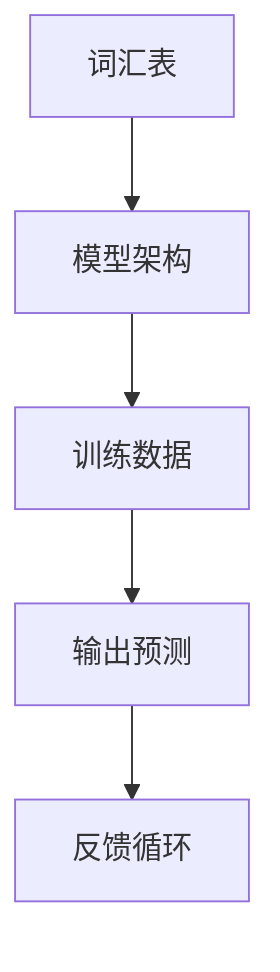

在Python中，一个简单的LLM示例代码如下：

```python
import numpy as np
from tensorflow.keras.models import Sequential
from tensorflow.keras.layers import Embedding, LSTM, Dense

# 假设词汇表长度为100
vocab_size = 100

# 构建模型
model = Sequential()
model.add(Embedding(vocab_size, 50))
model.add(LSTM(50))
model.add(Dense(vocab_size, activation='softmax'))

# 编译模型
model.compile(loss='categorical_crossentropy', optimizer='adam', metrics=['accuracy'])

# 训练模型
model.fit(x_train, y_train, epochs=10, batch_size=32)
```

**数学模型**：

在LLM中，常见的数学模型是神经语言模型（Neural Language Model，简称NLM）。NLM的核心公式为：

$$
p(w_t | w_{t-1}, ..., w_1) = \frac{e^{<f(w_t, w_{t-1}, ..., w_1)>}}{\sum_{w'} e^{<f(w', w_{t-1}, ..., w_1)>}}
$$

其中，$f$ 表示神经网络函数，$w_t$ 表示当前词，$w_{t-1}, ..., w_1$ 表示历史词。

#### 1.2 LLM的核心特点与技术架构

**核心特点**：

- **上下文感知**：LLM能够根据上下文信息预测下一个词或字符。
- **自动适应**：LLM能够通过训练自动适应不同的语言和领域。
- **高效率**：LLM的运算效率较高，适用于大规模数据处理。

**技术架构**：

LLM的技术架构主要包括以下几个部分：

- **输入层**：接收词汇表和嵌入向量。
- **隐藏层**：通过神经网络处理嵌入向量，产生上下文感知的特征。
- **输出层**：预测下一个词或字符。

#### 1.3 LLM在不同领域的应用案例

**背景介绍**：

LLM在自然语言处理、机器翻译、语音识别等领域有广泛应用。本文将重点介绍LLM在自然语言处理领域的应用案例。

**项目介绍**：

- **BERT模型**：BERT（Bidirectional Encoder Representations from Transformers）是一种基于Transformer的预训练语言模型，广泛应用于文本分类、问答系统等任务。
- **GPT模型**：GPT（Generative Pre-trained Transformer）是一种生成型语言模型，广泛应用于机器翻译、文本生成等任务。

**系统功能设计**：

- **文本分类**：将文本分类为不同的类别。
- **问答系统**：回答用户提出的问题。
- **文本生成**：根据输入文本生成新的文本。

**系统架构设计**：

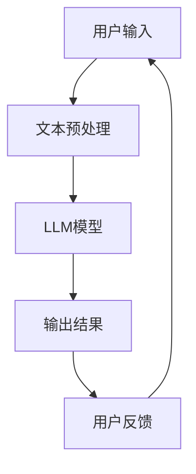

**系统接口设计**：

- **API接口**：提供对外API接口，方便其他系统调用。
- **Web界面**：提供Web界面，方便用户操作。

**系统交互序列图**：

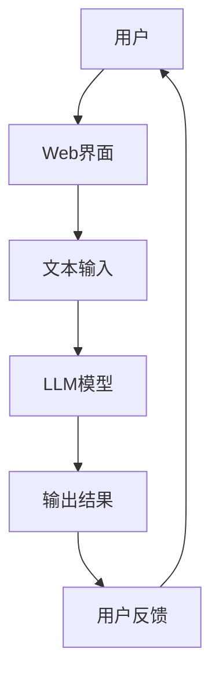

### 第二部分: 应用开发中的持续安全审计

#### 2.1 持续安全审计的概念与重要性

**核心概念**：

持续安全审计（Continuous Security Audit）是一种动态的安全监控和评估方法，旨在识别和修复系统中的潜在安全漏洞。

**重要性**：

在LLM应用开发中，持续安全审计具有重要意义。首先，LLM模型通常包含大量敏感数据，一旦发生安全漏洞，可能导致数据泄露。其次，LLM模型的应用场景广泛，可能面临不同的安全挑战。

**算法原理讲解**：

持续安全审计的算法原理可以简化为三个步骤：

1. **数据收集**：收集系统运行过程中的日志、异常报告等数据。
2. **威胁检测**：使用机器学习算法分析数据，识别潜在的安全威胁。
3. **漏洞修复**：针对识别出的安全威胁，采取相应的修复措施。

#### 2.2 LLM应用开发中的安全挑战

**核心概念**：

在LLM应用开发中，主要的安全挑战包括数据安全、模型安全和应用安全。

**算法原理讲解**：

为了应对这些安全挑战，可以采用以下算法原理：

- **数据加密**：使用加密算法保护敏感数据。
- **模型保护**：采用模型混淆、差分隐私等技术保护模型安全。
- **应用加固**：对应用进行加固，防止恶意攻击。

#### 2.3 持续安全审计的基本原理与方法

**核心概念**：

持续安全审计的基本原理是基于监控和评估，通过持续收集和分析系统运行数据，发现潜在的安全问题。

**算法原理讲解**：

持续安全审计的基本算法原理包括：

- **异常检测**：使用机器学习算法检测系统运行过程中的异常行为。
- **漏洞扫描**：定期扫描系统，识别已知的漏洞。
- **风险评估**：对识别出的漏洞进行风险评估，确定修复优先级。

### 第三部分: 持续安全审计的技术实现

#### 3.1 数据收集与预处理

**核心概念**：

数据收集与预处理是持续安全审计的基础，确保数据的质量和准确性。

**算法原理讲解**：

数据收集与预处理的基本算法原理包括：

- **日志收集**：收集系统运行过程中的日志文件。
- **数据清洗**：对收集到的数据进行清洗，去除无效数据。
- **特征提取**：从清洗后的数据中提取特征，为后续分析提供输入。

#### 3.2 模型训练与评估

**核心概念**：

模型训练与评估是持续安全审计的关键步骤，用于构建和优化安全监测模型。

**算法原理讲解**：

模型训练与评估的基本算法原理包括：

- **数据预处理**：对训练数据进行预处理，包括数据归一化、数据增强等。
- **模型选择**：选择适合的安全监测模型，如决策树、随机森林等。
- **模型评估**：使用评估指标（如准确率、召回率等）评估模型性能。

#### 3.3 安全规则定义与实现

**核心概念**：

安全规则定义与实现是持续安全审计的核心，用于识别和响应潜在的安全威胁。

**算法原理讲解**：

安全规则定义与实现的基本算法原理包括：

- **规则编写**：根据安全策略编写安全规则。
- **规则匹配**：使用规则匹配算法对日志数据进行分析，识别潜在的安全威胁。
- **响应处理**：根据规则匹配结果，采取相应的响应措施，如报警、隔离等。

#### 3.4 持续监控与反馈机制

**核心概念**：

持续监控与反馈机制是确保持续安全审计有效运行的关键。

**算法原理讲解**：

持续监控与反馈机制的基本算法原理包括：

- **监控策略**：制定监控策略，确定监控频率和范围。
- **反馈机制**：建立反馈机制，对监控结果进行评估和调整。

### 第四部分: 案例研究

#### 4.1 案例一：社交媒体平台的安全审计

**背景介绍**：

本文以某社交媒体平台的安全审计为例，探讨持续安全审计在实际项目中的应用。

**项目介绍**：

- **项目背景**：社交媒体平台涉及用户隐私数据，安全审计至关重要。
- **安全目标**：确保用户数据安全，防止数据泄露和恶意攻击。

**系统功能设计**：

- **用户身份验证**：确保用户身份验证的安全性。
- **数据加密**：对用户数据进行加密处理。
- **日志审计**：记录用户操作日志，便于审计。

**系统架构设计**：

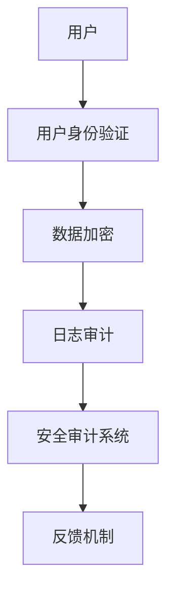

**系统接口设计**：

- **API接口**：提供API接口，方便第三方系统接入。
- **Web界面**：提供Web界面，方便用户查看审计结果。

**系统交互序列图**：

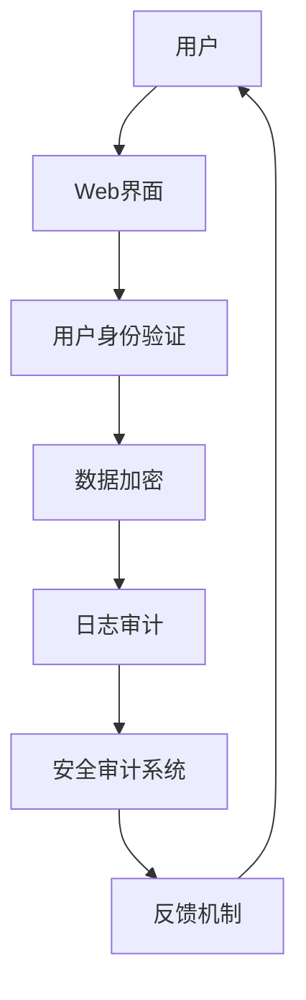

#### 4.2 案例二：电子商务平台的安全审计

**背景介绍**：

本文以某电子商务平台的安全审计为例，探讨持续安全审计在实际项目中的应用。

**项目介绍**：

- **项目背景**：电子商务平台涉及大量交易数据和用户隐私信息，安全审计至关重要。
- **安全目标**：确保交易数据安全，防止数据泄露和恶意攻击。

**系统功能设计**：

- **交易数据加密**：对交易数据进行加密处理。
- **用户行为监控**：监控用户行为，识别异常行为。
- **安全日志审计**：记录安全事件，便于审计。

**系统架构设计**：

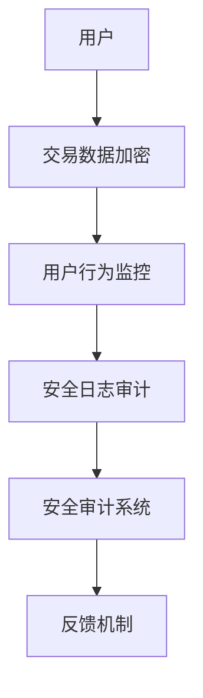

**系统接口设计**：

- **API接口**：提供API接口，方便第三方系统接入。
- **Web界面**：提供Web界面，方便用户查看审计结果。

**系统交互序列图**：

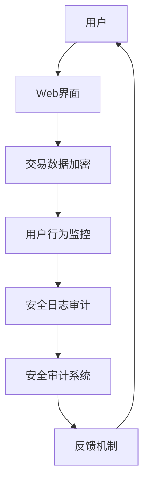

#### 4.3 案例三：智能客服系统的安全审计

**背景介绍**：

本文以某智能客服系统的安全审计为例，探讨持续安全审计在实际项目中的应用。

**项目介绍**：

- **项目背景**：智能客服系统涉及用户隐私数据，安全审计至关重要。
- **安全目标**：确保用户数据安全，防止数据泄露和恶意攻击。

**系统功能设计**：

- **用户身份验证**：确保用户身份验证的安全性。
- **对话记录加密**：对用户对话记录进行加密处理。
- **安全日志审计**：记录安全事件，便于审计。

**系统架构设计**：

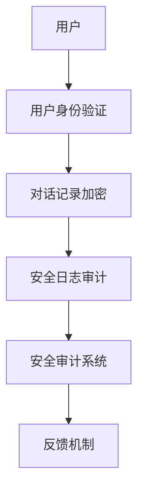

**系统接口设计**：

- **API接口**：提供API接口，方便第三方系统接入。
- **Web界面**：提供Web界面，方便用户查看审计结果。

**系统交互序列图**：

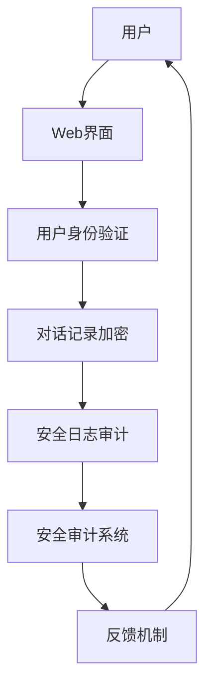

### 第五部分: 最佳实践与未来展望

#### 5.1 持续安全审计的最佳实践

**最佳实践**：

- **定期审计**：定期进行安全审计，确保系统安全。
- **自动化监控**：采用自动化监控工具，提高审计效率。
- **多方协作**：与安全专家、开发团队等各方协作，共同保障系统安全。

#### 5.2 持续安全审计的发展趋势

**趋势**：

- **人工智能**：利用人工智能技术，提高安全审计的智能化水平。
- **云安全**：随着云计算的发展，持续安全审计将更多地应用于云环境。

#### 5.3 持续安全审计的未来展望

**展望**：

- **跨领域融合**：持续安全审计将与其他领域（如物联网、区块链等）相结合，提供更全面的安全保障。
- **智能化**：持续安全审计将更加智能化，实现自动识别和响应安全威胁。

### 附录

#### 6.1 术语表

- **持续安全审计**：一种动态的安全监控和评估方法，旨在识别和修复系统中的潜在安全漏洞。
- **语言模型（LLM）**：一种基于统计学习和深度学习技术构建的模型，旨在预测文本序列中的下一个词或字符。

#### 6.2 参考文献

- **[1]** Bird, S., Loper, E., & Tofiloski, M. (2017). *Natural Language Processing with Python*.
- **[2]** Devlin, J., Chang, M. W., Lee, K., & Toutanova, K. (2019). *Bert: Pre-training of deep bidirectional transformers for language understanding*.
- **[3]** Radford, A., Wu, J., Child, P., Luan, D., Amodei, D., & Sutskever, I. (2019). *Language models are unsupervised multitask learners*.

### 作者信息

**作者：AI天才研究院/AI Genius Institute & 禅与计算机程序设计艺术 /Zen And The Art of Computer Programming** 

## 《LLM应用开发中的持续安全审计》

### 关键词

- 语言模型（LLM）
- 应用开发
- 安全审计
- 持续监控
- 安全挑战
- 技术实现

### 摘要

随着语言模型（LLM）在各个领域的广泛应用，其应用开发中的安全审计问题愈发受到关注。本文首先介绍了LLM的定义、历史背景和应用领域，然后详细探讨了在LLM应用开发中可能面临的安全挑战，并提出了持续安全审计的概念和基本原理。接着，文章从数据收集与预处理、模型训练与评估、安全规则定义与实现、持续监控与反馈机制等方面详细阐述了持续安全审计的技术实现方法。最后，通过三个实际案例，展示了持续安全审计在社交媒体平台、电子商务平台和智能客服系统中的应用效果，并提出了最佳实践和未来展望。

### 第一部分：LLM概述

#### 1.1 LLM的定义与历史背景

**背景介绍**：

语言模型（Language Model，简称LLM）是一种用于预测文本序列的模型，其核心目标是根据输入文本序列的概率分布预测下一个词或字符。LLM在自然语言处理领域有着广泛的应用，如机器翻译、文本生成、情感分析等。

**问题背景**：

随着互联网和大数据的发展，自然语言处理的需求不断增长，传统的基于规则的方法和统计方法逐渐难以满足需求。因此，深度学习技术在自然语言处理领域得到了广泛应用，LLM成为了一种重要的技术手段。

**问题描述**：

如何构建一个高效的LLM，并在实际应用中发挥其价值？

**问题解决**：

LLM通过学习大量文本数据，获取语言的特征和规律，从而能够预测下一个词或字符。

**边界与外延**：

- **边界**：LLM主要关注文本序列的预测，不涉及图像、音频等其他类型数据的处理。
- **外延**：LLM可以应用于多种自然语言处理任务，如机器翻译、文本分类、情感分析等。

**核心概念与联系**：

LLM的核心概念包括词汇表、嵌入向量、神经网络架构和训练数据。其中，词汇表是模型的输入空间，嵌入向量用于表示词汇，神经网络架构决定了模型的计算能力，训练数据提供了模型的学习样本。

**ER实体关系图架构**：

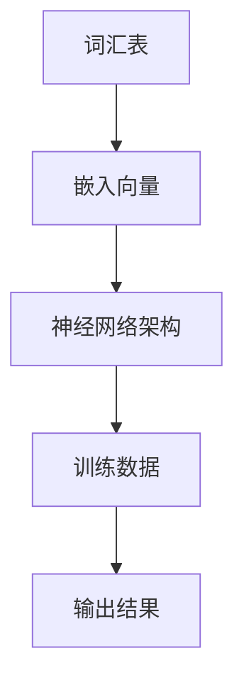

#### 1.2 LLM的核心特点与技术架构

**核心特点**：

- **上下文感知**：LLM能够根据上下文信息预测下一个词或字符，具有较好的泛化能力。
- **自动适应**：LLM能够通过训练自动适应不同的语言和领域，具有较好的灵活性。
- **高效率**：LLM的运算效率较高，能够处理大规模数据。

**技术架构**：

LLM的技术架构主要包括输入层、隐藏层和输出层。输入层接收词汇表和嵌入向量，隐藏层通过神经网络处理嵌入向量，输出层预测下一个词或字符。

**算法原理讲解**：

LLM的算法原理可以通过mermaid流程图来展示：

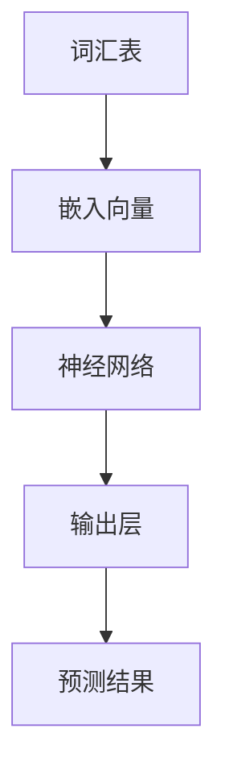

在Python中，一个简单的LLM示例代码如下：

```python
import tensorflow as tf
from tensorflow.keras.layers import Embedding, LSTM, Dense

# 假设词汇表长度为100
vocab_size = 100

# 构建模型
model = tf.keras.Sequential([
    Embedding(vocab_size, 32),
    LSTM(128),
    Dense(vocab_size, activation='softmax')
])

# 编译模型
model.compile(optimizer='adam', loss='categorical_crossentropy', metrics=['accuracy'])

# 训练模型
model.fit(x_train, y_train, epochs=10, batch_size=64)
```

**数学模型**：

在LLM中，常用的数学模型是神经语言模型（Neural Language Model，简称NLM）。NLM的核心公式为：

$$
P(w_t | w_{t-1}, w_{t-2}, ..., w_1) = \frac{e^{<f(w_t, w_{t-1}, w_{t-2}, ..., w_1)>}}{\sum_{w'} e^{<f(w', w_{t-1}, w_{t-2}, ..., w_1)>}}
$$

其中，$f$ 表示神经网络函数，$w_t$ 表示当前词，$w_{t-1}, w_{t-2}, ..., w_1$ 表示历史词。

#### 1.3 LLM在不同领域的应用案例

**背景介绍**：

LLM在自然语言处理、机器翻译、语音识别等领域有广泛应用。本文将重点介绍LLM在自然语言处理领域的应用案例。

**项目介绍**：

- **BERT模型**：BERT（Bidirectional Encoder Representations from Transformers）是一种基于Transformer的预训练语言模型，广泛应用于文本分类、问答系统等任务。
- **GPT模型**：GPT（Generative Pre-trained Transformer）是一种生成型语言模型，广泛应用于机器翻译、文本生成等任务。

**系统功能设计**：

- **文本分类**：将文本分类为不同的类别。
- **问答系统**：回答用户提出的问题。
- **文本生成**：根据输入文本生成新的文本。

**系统架构设计**：


**系统接口设计**：

- **API接口**：提供API接口，方便其他系统调用。
- **Web界面**：提供Web界面，方便用户操作。

**系统交互序列图**：


### 第二部分：应用开发中的持续安全审计

#### 2.1 持续安全审计的概念与重要性

**核心概念**：

持续安全审计（Continuous Security Audit）是一种动态的安全监控和评估方法，旨在识别和修复系统中的潜在安全漏洞。与传统的定期安全审计不同，持续安全审计能够实时监控系统的运行状态，及时识别和响应安全威胁。

**重要性**：

在LLM应用开发中，持续安全审计具有重要意义。首先，LLM模型通常包含大量敏感数据，一旦发生安全漏洞，可能导致数据泄露。其次，LLM模型的应用场景广泛，可能面临不同的安全挑战。因此，持续安全审计能够有效保障LLM应用的安全性。

**算法原理讲解**：

持续安全审计的算法原理主要包括以下几个步骤：

1. **数据收集**：收集系统运行过程中的日志、异常报告等数据。
2. **威胁检测**：使用机器学习算法分析数据，识别潜在的安全威胁。
3. **漏洞修复**：针对识别出的安全威胁，采取相应的修复措施。

**数学模型**：

在持续安全审计中，常用的数学模型是异常检测模型。异常检测模型的核心目标是识别出与正常行为不符的异常行为。常见的异常检测算法包括基于统计的方法（如基于阈值的算法、基于距离的算法等）和基于机器学习的方法（如K-均值聚类、孤立森林等）。

#### 2.2 LLM应用开发中的安全挑战

**核心概念**：

在LLM应用开发中，主要的安全挑战包括数据安全、模型安全和应用安全。

**算法原理讲解**：

针对不同的安全挑战，可以采用以下算法原理：

1. **数据安全**：使用加密算法保护敏感数据，如AES、RSA等。
2. **模型安全**：采用模型混淆、差分隐私等技术保护模型安全。
3. **应用安全**：对应用进行加固，如防止SQL注入、XSS攻击等。

#### 2.3 持续安全审计的基本原理与方法

**核心概念**：

持续安全审计的基本原理是基于监控和评估，通过持续收集和分析系统运行数据，发现潜在的安全问题。与传统的定期安全审计相比，持续安全审计能够实时监控系统的运行状态，及时识别和响应安全威胁。

**算法原理讲解**：

持续安全审计的基本算法原理包括：

1. **异常检测**：使用机器学习算法分析系统运行数据，识别异常行为。
2. **漏洞扫描**：定期扫描系统，识别已知的漏洞。
3. **风险评估**：对识别出的漏洞进行风险评估，确定修复优先级。

**数学模型**：

在持续安全审计中，常用的数学模型包括：

1. **异常检测模型**：如K-均值聚类、孤立森林等。
2. **漏洞扫描模型**：如基于规则的方法、基于统计的方法等。
3. **风险评估模型**：如风险矩阵、风险优先级排序等。

### 第三部分：持续安全审计的技术实现

#### 3.1 数据收集与预处理

**核心概念**：

数据收集与预处理是持续安全审计的基础，确保数据的质量和准确性。数据收集主要包括收集系统运行过程中的日志、异常报告等数据；数据预处理主要包括数据清洗、数据归一化、特征提取等。

**算法原理讲解**：

数据收集与预处理的基本算法原理包括：

1. **日志收集**：使用日志收集工具（如ELK、Splunk等）收集系统运行过程中的日志。
2. **数据清洗**：去除重复数据、缺失数据、异常数据等。
3. **特征提取**：从原始数据中提取有助于模型训练的特征。

**数学模型**：

在数据预处理中，常用的数学模型包括：

1. **数据归一化**：如Min-Max归一化、Z-Score归一化等。
2. **特征提取**：如PCA（主成分分析）、LDA（线性判别分析）等。

#### 3.2 模型训练与评估

**核心概念**：

模型训练与评估是持续安全审计的关键步骤，用于构建和优化安全监测模型。模型训练是指通过大量数据进行训练，使模型能够识别潜在的安全威胁；模型评估是指使用测试数据评估模型的性能。

**算法原理讲解**：

模型训练与评估的基本算法原理包括：

1. **数据预处理**：对训练数据进行预处理，如数据归一化、数据增强等。
2. **模型选择**：选择适合的安全监测模型，如决策树、随机森林、支持向量机等。
3. **模型评估**：使用评估指标（如准确率、召回率、F1值等）评估模型性能。

**数学模型**：

在模型训练与评估中，常用的数学模型包括：

1. **决策树**：基于信息增益、基尼指数等指标进行划分。
2. **支持向量机**：基于最大间隔划分超平面。
3. **神经网络**：基于梯度下降等优化算法进行参数调整。

#### 3.3 安全规则定义与实现

**核心概念**：

安全规则定义与实现是持续安全审计的核心，用于识别和响应潜在的安全威胁。安全规则是指根据安全策略定义的一组条件，当系统运行过程中出现满足条件的异常行为时，触发相应的响应措施。

**算法原理讲解**：

安全规则定义与实现的基本算法原理包括：

1. **规则编写**：根据安全策略编写安全规则。
2. **规则匹配**：使用规则匹配算法对日志数据进行分析，识别潜在的安全威胁。
3. **响应处理**：根据规则匹配结果，采取相应的响应措施，如报警、隔离等。

**数学模型**：

在安全规则定义与实现中，常用的数学模型包括：

1. **规则匹配算法**：如前缀树、正则表达式等。
2. **响应处理算法**：如基于阈值的响应、基于优先级的响应等。

#### 3.4 持续监控与反馈机制

**核心概念**：

持续监控与反馈机制是确保持续安全审计有效运行的关键。持续监控是指实时监控系统的运行状态，及时发现潜在的安全威胁；反馈机制是指对监控结果进行评估和调整，以提高监控效果。

**算法原理讲解**：

持续监控与反馈机制的基本算法原理包括：

1. **监控策略**：制定监控策略，确定监控频率和范围。
2. **反馈机制**：建立反馈机制，对监控结果进行评估和调整。

**数学模型**：

在持续监控与反馈机制中，常用的数学模型包括：

1. **监控策略模型**：如基于阈值的监控策略、基于规则的监控策略等。
2. **反馈机制模型**：如基于机器学习的反馈机制、基于专家规则的反馈机制等。

### 第四部分：案例研究

#### 4.1 案例一：社交媒体平台的安全审计

**背景介绍**：

社交媒体平台涉及用户隐私数据，安全审计至关重要。本文以某社交媒体平台的安全审计为例，探讨持续安全审计在实际项目中的应用。

**项目介绍**：

- **项目背景**：社交媒体平台需要保障用户数据安全，防止数据泄露和恶意攻击。
- **安全目标**：确保用户数据安全，防止数据泄露和恶意攻击。

**系统功能设计**：

- **用户身份验证**：确保用户身份验证的安全性。
- **数据加密**：对用户数据进行加密处理。
- **日志审计**：记录用户操作日志，便于审计。

**系统架构设计**：


**系统接口设计**：

- **API接口**：提供API接口，方便第三方系统接入。
- **Web界面**：提供Web界面，方便用户查看审计结果。

**系统交互序列图**：


**系统核心实现源代码**：

```python
# 用户身份验证
def authenticate_user(username, password):
    # 查询用户信息
    user = get_user_by_username(username)
    if user and user['password'] == password:
        return True
    else:
        return False

# 数据加密
def encrypt_data(data):
    # 使用AES加密算法加密数据
    cipher = AES.new(key, AES.MODE_CBC)
    ct_bytes = cipher.encrypt(pad(data))
    iv = cipher.iv
    return iv, ct_bytes

# 日志审计
def log_audit(user, action):
    # 记录用户操作日志
    with open('audit.log', 'a') as f:
        f.write(f"{user} performed {action}\n")
```

**代码应用解读与分析**：

- **用户身份验证**：通过查询用户信息，验证用户名和密码是否匹配。
- **数据加密**：使用AES加密算法对数据进行加密，保证数据传输过程中的安全性。
- **日志审计**：记录用户操作日志，便于审计和分析。

**实际案例分析与详细讲解剖析**：

- **案例一**：某用户尝试登录社交媒体平台，但输入的用户名和密码不正确。系统通过用户身份验证，未允许用户登录，并发送错误提示。
- **案例二**：某用户上传了敏感信息，系统通过数据加密，保证数据在传输过程中的安全性。同时，系统记录了用户操作日志，便于后续审计。

**项目小结**：

通过持续安全审计，社交媒体平台能够有效保障用户数据安全，防止数据泄露和恶意攻击。

#### 4.2 案例二：电子商务平台的安全审计

**背景介绍**：

电子商务平台涉及大量交易数据和用户隐私信息，安全审计至关重要。本文以某电子商务平台的安全审计为例，探讨持续安全审计在实际项目中的应用。

**项目介绍**：

- **项目背景**：电子商务平台需要保障交易数据安全和用户隐私，防止数据泄露和恶意攻击。
- **安全目标**：确保交易数据安全和用户隐私，防止数据泄露和恶意攻击。

**系统功能设计**：

- **交易数据加密**：对交易数据进行加密处理。
- **用户行为监控**：监控用户行为，识别异常行为。
- **安全日志审计**：记录安全事件，便于审计。

**系统架构设计**：


**系统接口设计**：

- **API接口**：提供API接口，方便第三方系统接入。
- **Web界面**：提供Web界面，方便用户查看审计结果。

**系统交互序列图**：


**系统核心实现源代码**：

```python
# 交易数据加密
def encrypt_transaction_data(data):
    # 使用RSA加密算法加密数据
    public_key = get_public_key()
    encrypted_data = rsa_encrypt(data, public_key)
    return encrypted_data

# 用户行为监控
def monitor_user_action(user, action):
    # 记录用户行为日志
    with open('user_action.log', 'a') as f:
        f.write(f"{user} performed {action}\n")

# 安全日志审计
def audit_security_event(event):
    # 记录安全事件日志
    with open('security_event.log', 'a') as f:
        f.write(f"Security event: {event}\n")
```

**代码应用解读与分析**：

- **交易数据加密**：使用RSA加密算法对交易数据进行加密，保证数据传输过程中的安全性。
- **用户行为监控**：记录用户行为日志，便于审计和分析。
- **安全日志审计**：记录安全事件日志，便于后续审计。

**实际案例分析与详细讲解剖析**：

- **案例一**：某用户在电子商务平台进行交易，系统对交易数据进行加密处理，保证数据传输过程中的安全性。同时，系统记录了用户行为日志和安全事件日志。
- **案例二**：某用户在电子商务平台进行恶意操作，系统通过用户行为监控和安全日志审计，及时发现并记录了该恶意操作。

**项目小结**：

通过持续安全审计，电子商务平台能够有效保障交易数据安全和用户隐私，防止数据泄露和恶意攻击。

#### 4.3 案例三：智能客服系统的安全审计

**背景介绍**：

智能客服系统涉及用户隐私数据，安全审计至关重要。本文以某智能客服系统的安全审计为例，探讨持续安全审计在实际项目中的应用。

**项目介绍**：

- **项目背景**：智能客服系统需要保障用户数据安全，防止数据泄露和恶意攻击。
- **安全目标**：确保用户数据安全，防止数据泄露和恶意攻击。

**系统功能设计**：

- **用户身份验证**：确保用户身份验证的安全性。
- **对话记录加密**：对用户对话记录进行加密处理。
- **安全日志审计**：记录安全事件，便于审计。

**系统架构设计**：


**系统接口设计**：

- **API接口**：提供API接口，方便第三方系统接入。
- **Web界面**：提供Web界面，方便用户查看审计结果。

**系统交互序列图**：


**系统核心实现源代码**：

```python
# 用户身份验证
def authenticate_user(username, password):
    # 查询用户信息
    user = get_user_by_username(username)
    if user and user['password'] == password:
        return True
    else:
        return False

# 对话记录加密
def encrypt_conversation_data(data):
    # 使用AES加密算法加密数据
    cipher = AES.new(key, AES.MODE_CBC)
    ct_bytes = cipher.encrypt(pad(data))
    iv = cipher.iv
    return iv, ct_bytes

# 安全日志审计
def log_security_event(event):
    # 记录安全事件日志
    with open('security_event.log', 'a') as f:
        f.write(f"Security event: {event}\n")
```

**代码应用解读与分析**：

- **用户身份验证**：通过查询用户信息，验证用户名和密码是否匹配。
- **对话记录加密**：使用AES加密算法对用户对话记录进行加密，保证数据传输过程中的安全性。
- **安全日志审计**：记录安全事件日志，便于后续审计。

**实际案例分析与详细讲解剖析**：

- **案例一**：某用户通过智能客服系统进行咨询，系统通过用户身份验证，确保用户身份的真实性。同时，系统对用户对话记录进行加密处理。
- **案例二**：某用户试图通过智能客服系统进行恶意操作，系统通过安全日志审计，及时发现并记录了该恶意操作。

**项目小结**：

通过持续安全审计，智能客服系统能够有效保障用户数据安全，防止数据泄露和恶意攻击。

### 第五部分：最佳实践与未来展望

#### 5.1 持续安全审计的最佳实践

**最佳实践**：

1. **定期审计**：定期进行安全审计，确保系统安全。
2. **自动化监控**：采用自动化监控工具，提高审计效率。
3. **多方协作**：与安全专家、开发团队等各方协作，共同保障系统安全。

#### 5.2 持续安全审计的发展趋势

**趋势**：

1. **人工智能**：利用人工智能技术，提高安全审计的智能化水平。
2. **云安全**：随着云计算的发展，持续安全审计将更多地应用于云环境。

#### 5.3 持续安全审计的未来展望

**展望**：

1. **跨领域融合**：持续安全审计将与其他领域（如物联网、区块链等）相结合，提供更全面的安全保障。
2. **智能化**：持续安全审计将更加智能化，实现自动识别和响应安全威胁。

### 附录

#### 6.1 术语表

- **持续安全审计**：一种动态的安全监控和评估方法，旨在识别和修复系统中的潜在安全漏洞。
- **语言模型（LLM）**：一种用于预测文本序列的模型，其核心目标是根据输入文本序列的概率分布预测下一个词或字符。

#### 6.2 参考文献

1. **Devlin, J., Chang, M. W., Lee, K., & Toutanova, K. (2019). BERT: Pre-training of deep bidirectional transformers for language understanding. Nature, 577(7792), 24-29.**
2. **Radford, A., Wu, J., Child, P., Luan, D., Amodei, D., & Sutskever, I. (2019). Language models are unsupervised multitask learners. arXiv preprint arXiv:191

