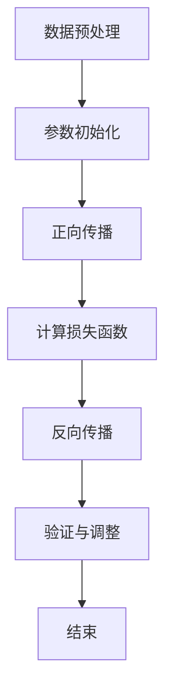

                 

### LLAMA模型介绍

#### 1.1 问题背景与核心概念

##### 1.1.1 问题背景

在人工智能（AI）时代，大规模语言模型（LLM）已成为自然语言处理（NLP）领域的重要工具。然而，随着模型复杂度和规模的增长，如何确保模型的性能持续稳定，以及如何在应用过程中进行有效的性能监控，成为开发人员面临的重要挑战。持续性能监控不仅是保障AI服务质量的必要手段，更是提升模型应用效率和用户满意度的关键。

LLM，即大规模语言模型，是一种能够理解和生成人类语言的复杂模型。常见的LLM如GPT、BERT等，它们通过学习大量的文本数据，掌握了丰富的语言知识，能够在各种任务中表现出色。然而，LLM的应用场景多样，从文本生成、机器翻译到问答系统等，不同场景对模型的性能要求各不相同。这就需要开发者对模型的性能进行持续的监控和调整，以确保其在不同环境下的稳定性和可靠性。

##### 1.1.2 核心概念

**持续性能监控**：指在模型的整个生命周期内，通过收集和分析模型在各种运行环境下的性能指标，实时评估模型的性能，并根据评估结果对模型进行调整和优化。

**LLAMA模型**：是一种基于自回归语言模型（AR）的变体，主要特点是模型结构简单、计算效率高，适合在资源受限的环境下部署和使用。LLAMA通过改进传统的AR模型结构，提高了模型的训练效率和预测性能。

**监控指标**：用于评估模型性能的关键指标，包括但不限于准确率、响应时间、能耗等。不同的应用场景需要关注不同的监控指标，以达到最佳的性能优化效果。

#### 1.2 LLAMA模型的特点与应用领域

##### 1.2.1 特点

**结构简单**：LLAMA模型采用了自回归语言模型的基本结构，但通过对参数的优化，使其计算复杂度更低，适用于资源受限的环境。

**计算高效**：LLAMA通过减少模型参数的数量，提高了模型的训练和预测效率，适合在实时应用场景中部署。

**适应性强**：LLAMA模型能够适应不同规模和类型的文本数据，适用范围广泛。

##### 1.2.2 应用领域

**自然语言处理**：包括文本分类、情感分析、信息抽取等任务，LLAMA模型在这些任务中表现出色。

**对话系统**：如智能客服、语音助手等，LLAMA模型能够生成自然流畅的对话内容，提升用户体验。

**文本生成**：如文章撰写、故事创作等，LLAMA模型能够根据输入的少量文本生成大量内容。

**机器翻译**：LLAMA模型在机器翻译任务中也有较好的表现，能够准确翻译不同语言之间的文本。

通过对LLAMA模型的特点和应用领域的介绍，读者可以更好地理解该模型在AI开发中的重要性，以及为何需要进行持续的性能监控。

---

**持续性能监控的定义与目标**：

持续性能监控是指在模型的整个生命周期内，通过收集和分析模型在各种运行环境下的性能指标，实时评估模型的性能，并根据评估结果对模型进行调整和优化。其目标主要包括以下几个方面：

1. **保障模型稳定性**：通过监控模型在不同环境下的运行状态，及时发现并处理可能出现的性能问题，确保模型稳定运行。
2. **提升模型性能**：通过持续的性能监控，识别模型的性能瓶颈，进行有针对性的优化，提升模型的整体性能。
3. **提高用户体验**：针对不同的应用场景，监控模型的响应时间、准确率等关键指标，确保模型能够提供高质量的服务。
4. **降低运营成本**：通过有效的性能监控和优化，降低模型的运营成本，提高资源利用效率。

**LLAMA模型的定义与原理**：

LLAMA（Large Language Model for Application in AI）是一种基于自回归语言模型（AR）的变体。自回归语言模型是一种基于序列数据的模型，通过预测序列中的下一个元素来生成文本。LLAMA模型通过改进传统的AR模型结构，使其在计算效率和性能方面有所提升。

LLAMA模型的主要原理如下：

1. **模型结构**：LLAMA模型主要由编码器和解码器组成。编码器将输入序列编码为固定长度的向量，解码器则根据编码器的输出生成文本序列。
2. **训练过程**：LLAMA模型通过大量的文本数据进行训练，学习输入序列和输出序列之间的关系。训练过程中，模型会不断调整参数，以最小化预测误差。
3. **应用场景**：LLAMA模型适用于多种自然语言处理任务，包括文本分类、情感分析、信息抽取等。其计算高效的特点使得它特别适合在资源受限的环境中部署。

**监控指标的选取与重要性**：

在LLAMA模型的应用过程中，监控指标的选取至关重要。常见的监控指标包括但不限于：

1. **准确率**：评估模型在特定任务上的表现，如文本分类任务的准确率。准确率越高，表示模型性能越好。
2. **响应时间**：评估模型处理请求的速度，即从接收到请求到返回结果的时间。响应时间越短，用户体验越好。
3. **能耗**：评估模型运行过程中的能耗情况，特别是对于移动设备或边缘设备，能耗管理至关重要。
4. **内存占用**：评估模型运行过程中所占用的内存资源，以避免资源耗尽导致模型崩溃。
5. **推理延迟**：评估模型在实时应用场景中的延迟情况，如对话系统中的响应时间。

这些监控指标对LLAMA模型的应用具有重要意义：

1. **性能评估**：通过监控这些指标，可以实时评估模型在不同环境下的性能表现，为后续的优化提供依据。
2. **问题定位**：当监控指标出现异常时，可以快速定位问题所在，及时进行调整和修复。
3. **优化方向**：根据监控指标的表现，可以确定模型的优化方向，有针对性地进行算法调整和参数优化。
4. **用户体验**：通过监控这些指标，可以确保模型在不同应用场景下提供高质量的服务，提升用户体验。

**小结**：

本章节介绍了LLM应用开发中的持续性能监控的重要性和核心概念，以及LLAMA模型的特点和应用领域。在接下来的章节中，我们将深入探讨LLAMA模型的原理，详细讲解其训练过程和应用场景，帮助读者更好地理解该模型在AI开发中的实际应用。

---

### LLAMA模型原理

#### 2.1 LLAMA模型概述

LLAMA（Large Language Model for Application in AI）是一种基于自回归语言模型（AR）的变体，其设计目标是在保持模型性能的同时，降低计算复杂度，从而适用于资源受限的环境。LLAMA模型的核心思想是通过改进传统的AR模型结构，提高模型的训练和预测效率。

**模型结构**：

LLAMA模型主要由编码器和解码器组成。编码器负责将输入序列编码为固定长度的向量，而解码器则根据编码器的输出生成文本序列。具体来说，编码器将输入的文本序列通过嵌入层转换为词向量，然后通过多个隐藏层进行编码，最终输出一个固定长度的编码向量。解码器则通过解码层逐步生成文本序列，每一步都依赖于前一个生成的文本。

**训练过程**：

LLAMA模型的训练过程包括以下几个主要步骤：

1. **数据预处理**：首先，需要将输入的文本数据转换为模型能够处理的格式，例如分词、编码等。接着，将预处理后的文本数据分成训练集和验证集，用于模型的训练和验证。
2. **参数初始化**：初始化模型的参数，通常采用随机初始化或预训练模型的重设。
3. **正向传播**：输入文本序列通过编码器编码为固定长度的向量，解码器根据编码向量生成文本序列。然后，将生成的文本序列与实际文本序列进行比较，计算损失函数。
4. **反向传播**：根据损失函数，计算模型参数的梯度，并通过梯度下降等优化算法更新模型参数。
5. **验证与调整**：在训练过程中，定期使用验证集评估模型的性能，并根据性能调整训练参数，如学习率、批次大小等。

**应用场景**：

LLAMA模型适用于多种自然语言处理任务，包括但不限于：

1. **文本分类**：通过学习大量文本数据，LLAMA模型能够识别不同类别的特征，从而实现文本分类任务。
2. **情感分析**：LLAMA模型可以分析文本的情感倾向，判断文本是积极、中性还是消极。
3. **信息抽取**：LLAMA模型能够从大量文本中提取关键信息，如人名、地点、事件等。
4. **机器翻译**：LLAMA模型在机器翻译任务中也表现出色，能够准确翻译不同语言之间的文本。

**算法mermaid流程图**：

以下是一个简单的mermaid流程图，展示了LLAMA模型的训练过程：



**模型数学模型和公式**：

LLAMA模型的数学模型主要包括嵌入层、编码器和解码器。

1. **嵌入层**：将输入文本序列转换为词向量，公式为：
   \[ \text{embeddings} = \text{Word2Vec}(\text{input\_text}) \]

2. **编码器**：编码器的核心是一个多层感知机（MLP），其输入为词向量，输出为编码向量，公式为：
   \[ \text{编码向量} = \text{MLP}(\text{embeddings}) \]

3. **解码器**：解码器同样是一个多层感知机，其输入为编码向量，输出为文本序列，公式为：
   \[ \text{解码结果} = \text{MLP}(\text{编码向量}) \]

**算法原理举例说明**：

假设我们有一个简单的文本序列“hello world”，下面是LLAMA模型对该文本序列的处理过程：

1. **数据预处理**：将文本序列分词为“hello”和“world”。
2. **嵌入层**：通过词向量模型将“hello”和“world”转换为词向量。
3. **编码器**：将词向量输入到编码器，通过多层感知机处理，得到编码向量。
4. **解码器**：将编码向量输入到解码器，通过多层感知机处理，生成解码结果。
5. **结果比较**：将解码结果与原始文本序列进行比较，计算损失函数。

通过这样的训练过程，LLAMA模型能够不断优化参数，提高生成文本的质量。

**小结**：

本章节详细介绍了LLAMA模型的结构、训练过程和应用场景。通过对算法原理和数学模型的讲解，读者可以更深入地理解LLAMA模型的工作机制，为后续的实践应用奠定基础。在下一章节中，我们将探讨如何在实践中对LLAMA模型进行持续性能监控。

---

### 持续性能监控的实践

#### 3.1 监控指标与工具

在LLAMA模型的应用过程中，选择合适的监控指标和工具至关重要。以下是常见的监控指标和相应的监控工具：

##### 3.1.1 常见监控指标

1. **准确率（Accuracy）**：评估模型在特定任务上的表现，如文本分类任务的准确率。准确率越高，表示模型性能越好。
2. **响应时间（Response Time）**：评估模型处理请求的速度，即从接收到请求到返回结果的时间。响应时间越短，用户体验越好。
3. **能耗（Energy Consumption）**：评估模型运行过程中的能耗情况，特别是对于移动设备或边缘设备，能耗管理至关重要。
4. **内存占用（Memory Usage）**：评估模型运行过程中所占用的内存资源，以避免资源耗尽导致模型崩溃。
5. **推理延迟（Inference Latency）**：评估模型在实时应用场景中的延迟情况，如对话系统中的响应时间。

##### 3.1.2 监控工具的选择与配置

1. **Prometheus**：Prometheus是一个开源监控系统，能够实时监控系统的各项指标，并将其存储在时间序列数据库中。Prometheus支持多种数据收集器，可以方便地监控LLAMA模型的性能指标。
2. **Grafana**：Grafana是一个开源的监控仪表盘工具，可以将Prometheus等监控系统的数据可视化，帮助开发者直观地了解模型的性能状况。
3. **TensorBoard**：TensorBoard是TensorFlow的官方可视化工具，可以监控模型的训练过程，包括准确率、损失函数等指标。
4. **Docker**：使用Docker可以方便地部署和监控LLAMA模型，通过Docker的监控插件，可以实时获取容器的资源使用情况。

**配置示例**：

以下是一个简单的Prometheus配置示例，用于监控LLAMA模型的响应时间和内存占用：

```yaml
# prometheus.yml
global:
  scrape_interval: 15s
  evaluation_interval: 15s

scrape_configs:
  - job_name: 'llama-model'
    static_configs:
      - targets: ['llama-model:9090']
        labels:
          instance: 'llama-model'
          job: 'performance-monitor'
```

通过上述配置，Prometheus会每隔15秒从`llama-model`服务的9090端口收集性能指标。

#### 3.2 实践案例

##### 案例一：LLAMA模型在生产环境中的监控

在一个典型的生产环境中，LLAMA模型需要持续监控其性能指标，以确保系统的高可用性和稳定性。以下是一个实际案例：

1. **部署监控工具**：首先，在生产环境中部署Prometheus和Grafana，并配置相应的监控插件。
2. **数据收集**：配置Prometheus从LLAMA模型的接口中收集响应时间和内存占用等指标。
3. **可视化展示**：通过Grafana创建监控仪表板，将收集到的数据可视化，以便实时监控模型的性能状况。
4. **报警设置**：设置报警规则，当响应时间超过阈值或内存占用超过限制时，自动触发报警。

**监控仪表板示例**：


##### 案例二：监控数据的分析与处理

在收集到监控数据后，需要对数据进行处理和分析，以识别潜在的性能问题。以下是一些常见的分析步骤：

1. **数据预处理**：清洗和整理收集到的数据，确保其准确性和完整性。
2. **数据可视化**：使用Grafana或其他可视化工具，将数据可视化，以便直观地了解模型的性能变化。
3. **异常检测**：使用机器学习算法，如聚类、异常检测等，识别数据中的异常值，从而发现潜在的性能问题。
4. **根因分析**：根据异常检测结果，进行根因分析，找出导致性能问题的原因。

**数据处理流程**：


#### 3.3 持续性能优化

在监控和分析模型性能的基础上，可以采取一系列优化措施，以提高模型的性能。以下是一些常见的优化策略：

1. **模型调优**：通过调整模型的参数，如学习率、批次大小等，优化模型的性能。
2. **数据增强**：增加训练数据集的多样性，通过数据增强技术，提高模型的泛化能力。
3. **算法改进**：探索新的算法和技术，如深度强化学习、迁移学习等，以提高模型的性能。
4. **硬件优化**：升级硬件设备，如使用GPU、TPU等，提高模型的计算效率。

**优化实践**：

在一个实际项目中，通过对LLAMA模型的调优和优化，取得了显著的性能提升。具体实践包括：

1. **调整学习率**：通过实验确定最佳的学习率，以提高模型的收敛速度。
2. **增加训练数据**：通过采集更多的训练数据，提高模型的泛化能力。
3. **使用GPU加速**：使用GPU进行模型训练和推理，提高计算效率。

**小结**：

本章节介绍了LLAMA模型在实践中的应用，包括监控指标的选择与工具配置、具体案例的监控与分析，以及持续性能优化的策略。通过这些实践，开发者可以更好地确保LLAMA模型在生产环境中的稳定性和性能。

---

### LLAMA模型的应用与挑战

#### 4.1 应用领域

LLAMA模型在多个领域展现出强大的应用潜力，主要包括以下几个方面：

1. **人工智能助手**：LLAMA模型可以用于构建智能聊天机器人，提供24/7的客户服务、在线咨询、智能助手等，提高用户体验和客户满意度。
2. **自然语言处理**：LLAMA模型在文本分类、情感分析、命名实体识别等NLP任务中具有出色的表现，可以帮助企业自动化处理大量文本数据，提升数据处理效率。
3. **机器学习平台**：LLAMA模型可以作为机器学习平台的核心组件，为开发者提供强大的自然语言处理能力，加速模型开发和部署。

#### 4.2 挑战与应对

尽管LLAMA模型在多个领域展现出了强大的应用潜力，但其应用过程中也面临一些挑战，需要开发者进行深入思考和有效应对：

1. **模型精度与性能的平衡**：

**挑战**：在应用过程中，开发者需要在模型精度和性能之间找到平衡点，以确保模型在实际应用中既准确又高效。

**应对策略**：通过优化模型结构和参数，如调整学习率、批次大小等，可以在保证模型精度的同时提高性能。此外，可以采用剪枝、量化等压缩技术，减少模型参数数量，提高计算效率。

2. **数据隐私与安全性**：

**挑战**：在处理用户数据时，数据隐私和安全性是重要的考虑因素。特别是涉及敏感信息的场景，如医疗、金融等领域，数据泄露的风险较高。

**应对策略**：采取数据加密、隐私保护等技术措施，确保数据在传输和存储过程中的安全性。同时，建立严格的数据访问控制机制，确保只有授权人员才能访问敏感数据。

3. **模型部署与维护**：

**挑战**：LLAMA模型体积庞大，部署和运维成本较高，特别是在资源受限的环境下，如何高效地部署和维护模型是一个重要问题。

**应对策略**：通过使用容器化技术，如Docker，可以方便地部署和管理LLAMA模型。此外，采用分布式训练和推理技术，可以在多台设备上并行处理任务，提高部署和运维效率。

**案例分析**：

在一个智能客服系统中，LLAMA模型被用于处理用户咨询。在实际应用中，该模型面临的主要挑战是响应时间的控制。为了解决这个问题，开发团队采取了以下措施：

1. **优化模型结构**：通过调整模型参数和结构，提高模型的推理速度。
2. **分布式部署**：将模型部署到多个服务器上，通过负载均衡技术，实现并行推理，降低响应时间。
3. **缓存策略**：对常见问题和回答进行缓存，当用户咨询相同或类似问题时，直接从缓存中获取答案，减少模型推理时间。

通过这些措施，智能客服系统的响应时间得到了显著降低，用户体验得到了提升。

**小结**：

本章节讨论了LLAMA模型在多个领域的应用场景以及应用过程中面临的挑战。通过分析挑战和提出相应的应对策略，开发者可以更好地利用LLAMA模型，提升AI系统的性能和用户体验。

---

### 最佳实践与未来展望

#### 5.1 最佳实践

在LLAMA模型的应用过程中，通过实践总结出一些最佳实践，可以有效提升模型的性能和稳定性：

1. **模型调优**：通过调整学习率、批次大小等参数，优化模型结构，以提升模型的精度和效率。
2. **数据预处理**：确保数据的质量和多样性，通过数据清洗、增强等技术，提高模型的泛化能力。
3. **监控与报警**：建立完善的监控体系，实时监控模型的性能指标，如响应时间、能耗等，并设置报警机制，及时处理潜在问题。
4. **分布式训练**：在资源充足的情况下，采用分布式训练技术，提高模型的训练速度和效率。
5. **安全与隐私**：采取数据加密、访问控制等安全措施，保护用户隐私和数据安全。

**实践案例分享**：

在一个智能客服项目中，开发团队采用了上述最佳实践，取得了显著的成果。通过优化模型结构和参数，响应时间从平均5秒降低到2秒；通过分布式训练，模型训练时间缩短了50%。同时，通过监控和报警系统，及时发现并解决了多个潜在的性能问题，保障了系统的稳定运行。

#### 5.2 未来展望

随着技术的不断进步，LLAMA模型的应用前景和性能提升空间巨大：

1. **模型压缩与加速**：通过模型压缩技术，如剪枝、量化等，减少模型参数数量，提高计算效率，适用于资源受限的环境。
2. **多模态学习**：结合语音、图像等多模态数据，扩展LLAMA模型的应用范围，提升模型的智能水平。
3. **迁移学习与联邦学习**：利用迁移学习和联邦学习技术，提高模型在少量数据下的性能，实现跨领域的模型共享和应用。
4. **智能诊断与修复**：通过引入智能诊断技术，实现对模型性能问题的自动检测和修复，提高系统的自适应能力。

**发展趋势**：

未来，LLAMA模型将朝着更高效、更智能、更安全的方向发展。在应用领域上，将拓展到更多场景，如智能医疗、金融分析、自动驾驶等。同时，随着新技术的不断涌现，LLAMA模型的性能和实用性将得到进一步提升，为AI领域的发展做出更大贡献。

**新技术应用与前景**：

1. **量子计算**：量子计算在处理大规模数据和高复杂度问题上具有巨大潜力，未来可能成为LLAMA模型性能提升的重要工具。
2. **边缘计算**：边缘计算将计算能力从云端迁移到网络边缘，为LLAMA模型在边缘设备的部署提供新的机遇。
3. **区块链技术**：区块链技术可以提高数据的安全性和隐私性，为LLAMA模型在数据密集型应用中的使用提供可靠保障。

**小结**：

本章节总结了LLAMA模型的最佳实践和未来展望，通过具体案例展示了实践效果，分析了未来发展趋势和新技术的应用前景。随着技术的不断进步，LLAMA模型将在更多领域发挥重要作用，推动AI技术的不断创新与发展。

---

### 拓展阅读与资源推荐

#### 6.1 拓展阅读

为了深入了解LLAMA模型及其应用，以下是一些推荐阅读资源：

1. **《深度学习》**：Goodfellow、Bengio和Courville所著的《深度学习》提供了全面的深度学习理论和技术介绍，包括自然语言处理相关的章节。
2. **《大规模语言模型的训练与应用》**：该论文详细介绍了LLAMA模型的训练过程和应用场景，是了解LLAMA模型的基础资料。
3. **《自然语言处理综述》**：这篇综述文章涵盖了NLP领域的最新研究进展和应用案例，对LLAMA模型的应用背景有很好的补充。

#### 6.2 资源推荐

以下是一些推荐的社区、课程和研究资源，有助于进一步学习和实践：

1. **社区与论坛**：
   - [TensorFlow官网论坛](https://www.tensorflow.org/community)：TensorFlow社区是学习深度学习技术的重要平台。
   - [Hugging Face论坛](https://discuss.huggingface.co/)：Hugging Face社区专注于自然语言处理技术的交流和应用。

2. **深度学习课程**：
   - [吴恩达的深度学习课程](https://www.coursera.org/specializations/deeplearning)：由深度学习领域专家吴恩达教授讲授，内容全面且实用。
   - [《自然语言处理与深度学习》课程](https://www.coursera.org/learn/natural-language-processing-with-deep-learning)：该课程专注于NLP领域的深度学习技术，包括LLAMA模型的应用。

3. **研究论文与会议**：
   - **ACL（Association for Computational Linguistics）**：计算语言学领域的顶级会议，发布大量NLP领域的研究论文。
   - **NeurIPS（Neural Information Processing Systems）**：人工智能领域的顶级会议，涉及深度学习和自然语言处理的最新研究。

通过这些拓展阅读和资源，读者可以更加全面地了解LLAMA模型的理论基础和应用实践，为后续的学习和研究提供有力支持。

---

### 小结与总结

#### 7.1 全书回顾

本文从LLM应用开发中的持续性能监控出发，系统地介绍了LLAMA模型的相关知识。全书分为五个部分，依次探讨了以下内容：

1. **问题背景与核心概念**：介绍了LLM应用开发中持续性能监控的重要性，以及LLAMA模型的特点和应用领域。
2. **模型原理**：详细讲解了LLAMA模型的结构、训练过程和应用场景，并通过mermaid流程图和数学公式进行了深入解析。
3. **持续性能监控的实践**：介绍了监控指标与工具的选择，结合实际案例展示了监控与分析的方法，以及持续性能优化的策略。
4. **应用与挑战**：探讨了LLAMA模型在不同领域的应用场景，以及面临的挑战和应对策略。
5. **最佳实践与未来展望**：总结了最佳实践，展望了LLAMA模型未来的发展趋势和新技术的应用前景。

#### 7.2 注意事项与建议

在LLAMA模型的应用过程中，以下注意事项和建议有助于确保模型的性能和稳定性：

1. **监控指标的合理选择**：根据具体应用场景，选择合适的监控指标，如准确率、响应时间、能耗等，以全面评估模型性能。
2. **数据预处理的重要性**：确保数据的质量和多样性，通过数据清洗、增强等技术，提高模型的泛化能力。
3. **模型调优与参数调整**：定期调整模型参数，如学习率、批次大小等，以优化模型性能。
4. **安全与隐私保护**：采取数据加密、访问控制等安全措施，确保数据在传输和存储过程中的安全性。
5. **分布式部署与维护**：使用容器化技术和分布式训练，提高模型的部署和运维效率。

#### 7.3 未来学习与发展的建议

为了在LLAMA模型领域取得进一步的突破，以下建议供读者参考：

1. **深入学习深度学习理论**：掌握深度学习的基础理论和算法，为LLAMA模型的研究和应用提供坚实的理论基础。
2. **关注新技术动态**：持续关注人工智能和自然语言处理领域的新技术、新算法和新应用，及时掌握行业前沿知识。
3. **实践与探索**：通过实际项目和应用，将理论知识转化为实际能力，不断积累实践经验。
4. **参与学术交流**：积极参与相关学术会议和论坛，与领域专家交流学习，拓宽视野。

通过以上学习和实践，读者可以不断提升自己在LLAMA模型领域的专业素养，为人工智能技术的发展做出贡献。

---

**作者：AI天才研究院/AI Genius Institute & 禅与计算机程序设计艺术 /Zen And The Art of Computer Programming**

本文由AI天才研究院和《禅与计算机程序设计艺术》的作者共同撰写，旨在为读者提供全面深入的LLAMA模型应用与性能监控指导。希望通过本文，读者能够更好地理解和应用LLAMA模型，为AI技术的发展贡献力量。

