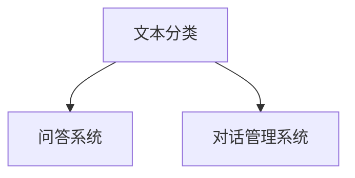

                 

### 第一部分: 引言与背景介绍

#### 第1章: 引言

**1.1 研究背景**

在当今快速发展的科技领域，大型语言模型（LLM，Large Language Model）以其卓越的自然语言处理能力成为人工智能研究与应用的热点。LLM具有极强的语言理解和生成能力，能够进行问答、文本生成、机器翻译等多种任务，广泛应用于自然语言处理、智能客服、内容审核、智能写作等领域。随着LLM技术的不断进步，其在实际应用中的重要性愈发凸显。

然而，LLM的应用开发过程面临着一系列挑战，尤其是如何在开发过程中进行准确的估算与规划，以确保项目能够按时、高质量地完成。传统的估算与规划方法在面对复杂的LLM项目时，往往难以应对不断变化的需求和技术挑战。因此，引入敏捷估算与规划方法成为解决这一问题的关键。

**1.1.1 问题背景**

在LLM应用开发中，常见的问题包括：
- **需求变化频繁**：用户需求在项目开发过程中可能发生频繁变化，传统的方法难以适应这种变化。
- **技术复杂性**：LLM模型涉及大量的数据处理和算法优化，技术复杂性较高。
- **项目延期风险**：在缺乏有效估算和规划的情况下，项目容易延期，影响整体进度。

**1.1.2 问题描述**

LLM应用开发中的主要问题可以概括为以下几个方面：
- **需求估算不准确**：如何准确预测开发时间和成本？
- **规划不灵活**：如何适应需求变化和资源限制？
- **风险评估不足**：如何识别和管理项目风险？

**1.1.3 问题解决**

敏捷估算与规划方法能够解决上述问题，其核心在于：
- **客户需求驱动**：以用户需求为导向，确保项目始终聚焦于用户价值。
- **持续迭代**：通过不断迭代和反馈，逐步完善项目。
- **高度协作**：团队间的紧密协作，确保项目顺利进行。

**1.1.4 边界与外延**

本文主要探讨LLM应用开发中的敏捷估算与规划方法，不包括LLM模型本身的技术细节。同时，本文的讨论将侧重于项目管理和估算方法，而非具体的编程实现。

**1.2 核心概念**

在深入研究LLM应用开发的敏捷估算与规划之前，我们需要明确一些核心概念：

**1.2.1 什么是LLM**

LLM（Large Language Model）是一种基于深度学习的大型神经网络模型，能够处理和理解自然语言文本。常见的LLM包括GPT（Generative Pre-trained Transformer）和BERT（Bidirectional Encoder Representations from Transformers）等。

**1.2.2 LLM的特点**

- **强大的语言理解能力**：LLM能够理解复杂的自然语言结构和语义。
- **广泛的适用性**：LLM可以应用于多种自然语言处理任务，如文本生成、问答、机器翻译等。
- **自我进化能力**：通过持续训练和优化，LLM能够不断提高性能。

**1.2.3 LLM与传统AI模型的对比**

传统AI模型，如规则基模型和统计模型，通常具有以下特点：
- **预定义规则**：根据专家知识预先定义模型规则。
- **性能有限**：在特定领域内表现较好，但通用性较差。

相比之下，LLM具有更灵活的适应能力和更广泛的应用范围。

**1.3 概念结构与核心要素组成**

LLM应用开发涉及多个核心要素，包括：
- **数据集**：用于训练LLM的文本数据集。
- **模型架构**：如Transformer、BERT等。
- **训练过程**：包括数据预处理、模型训练和优化。
- **应用场景**：LLM在具体应用中的部署和调优。

这些要素共同构成了LLM应用开发的整体概念结构。

综上所述，本文将详细探讨LLM应用开发中的敏捷估算与规划方法，包括核心概念、估算方法、规划流程以及实际案例研究等。通过系统性的分析和探讨，为LLM项目的成功实施提供有力支持。

### 第2章: 敏捷估算基础

#### 2.1 敏捷估算的定义

敏捷估算（Agile Estimation）是敏捷开发（Agile Development）方法中的重要组成部分，旨在通过快速、灵活和迭代的方式对项目进行估算。与传统的估算方法相比，敏捷估算更加注重实际可操作性、客户需求和团队协作。

**2.1.1 敏捷估算的概念**

敏捷估算的核心在于以下几个原则：
- **客户需求驱动**：以客户需求为中心，确保项目始终符合用户期望。
- **持续迭代**：通过不断迭代和反馈，逐步完善项目。
- **高度协作**：团队成员之间的紧密协作，提高项目执行效率。

**2.1.2 敏捷估算与传统估算的区别**

传统估算方法通常在项目开始时进行详细的计划和时间安排，往往依赖于预先设定的固定目标和计划。而敏捷估算则更加灵活，能够在项目开发过程中根据实际情况进行调整和优化。主要区别如下：

| 传统估算 | 敏捷估算 |
| --- | --- |
| **固定计划** | **迭代计划** |
| **集中式管理** | **分布式协作** |
| **一次性估算** | **持续估算** |
| **需求不变** | **需求变化** |

#### 2.2 敏捷估算的原则

敏捷估算遵循以下核心原则，以确保项目能够顺利推进：

**2.2.1 客户需求驱动**

敏捷估算以客户需求为导向，通过持续的用户反馈来调整项目方向和进度。这种方法能够确保项目始终符合用户需求，提高客户满意度。

**2.2.2 持续迭代**

敏捷估算通过持续迭代的方式进行估算，每个迭代周期结束后都会进行总结和反思，根据反馈对下一个迭代进行优化。这种迭代过程有助于快速发现问题并进行调整。

**2.2.3 高度协作**

敏捷估算强调团队内部的高度协作，包括开发人员、项目经理、产品负责人和客户之间的紧密沟通。这种协作机制有助于提高项目执行效率，减少误解和冲突。

#### 2.3 敏捷估算的方法

敏捷估算采用多种方法和技术来确保估算的准确性和灵活性，以下是一些常见的方法：

**2.3.1 故事点估算**

故事点（Story Points）是敏捷开发中用于估算任务大小的单位。通过故事点估算，团队能够快速评估任务复杂度和所需工作量。

**2.3.2 类比估算**

类比估算是通过参考以往类似项目的经验和数据来估算当前项目的成本和时间。这种方法适用于项目初期，当详细信息不足时。

**2.3.3 参数估算**

参数估算是基于历史数据和经验公式来估算项目的成本和时间。这种方法适用于规模较大的项目，能够提供较为准确的估算结果。

**2.3.4 蒙特卡洛估算**

蒙特卡洛估算是通过模拟和概率分析来估算项目的成本和时间。这种方法能够提供更加灵活和精确的估算结果，适用于高风险项目。

通过以上方法和原则，敏捷估算能够在复杂和变化多端的LLM应用开发项目中，提供有效的估算与规划支持，确保项目能够按时、高质量地完成。

#### 第3章: LLM应用开发中的敏捷估算方法

**3.1 估算技术**

在LLM应用开发中，敏捷估算方法采用多种技术来确保估算的准确性和灵活性，以下是几种常见的估算技术：

**3.1.1 实际案例估算**

实际案例估算是通过参考过去类似项目的经验和数据来进行估算。这种方法依赖于历史数据的积累，适用于对项目规模和复杂度有初步了解的情况。具体步骤如下：

1. **收集历史数据**：从过去完成的LLM项目中收集相关数据，包括开发时间、人力成本、技术难点等。
2. **分析历史数据**：对收集到的数据进行分析，识别项目的主要风险和不确定性因素。
3. **建立估算模型**：基于历史数据，建立估算模型，如时间-成本模型或复杂度-人力模型。
4. **进行估算**：使用估算模型对当前LLM项目进行估算，并根据实际情况进行调整。

**3.1.2 类比估算**

类比估算是通过参考过去类似项目的经验和数据来进行估算。这种方法适用于项目初期，当详细信息不足时。具体步骤如下：

1. **选择参考项目**：选择过去完成的、与当前项目在规模、技术难度等方面相似的LLM项目。
2. **分析参考项目**：对参考项目的数据进行分析，包括项目时间、人力成本、技术难点等。
3. **建立估算模型**：基于参考项目的数据，建立估算模型，如时间-成本模型或复杂度-人力模型。
4. **进行估算**：使用估算模型对当前LLM项目进行估算，并根据实际情况进行调整。

**3.1.3 参数估算**

参数估算是基于历史数据和经验公式来估算项目的成本和时间。这种方法适用于规模较大的项目，能够提供较为准确的估算结果。具体步骤如下：

1. **确定参数**：根据历史数据，确定估算所需的关键参数，如项目规模、开发时间、人力成本等。
2. **建立公式**：使用经验公式，将关键参数与项目成本和时间联系起来，建立估算模型。
3. **进行估算**：根据确定的参数和公式，对当前LLM项目进行估算。

**3.2 敏捷估算工具**

在LLM应用开发中，敏捷估算工具能够帮助团队更有效地进行估算和项目管理。以下是一些常用的敏捷估算工具：

**3.2.1 敏捷板**

敏捷板（Agile Board）是敏捷开发中常用的可视化工具，用于跟踪项目进度和任务分配。敏捷板通常包括以下几个部分：

- **故事卡**：每个故事或任务都对应一张故事卡，上面记录了任务名称、优先级、进度等信息。
- **迭代栏**：将项目拆分为多个迭代周期，每个迭代周期对应一个栏，用于跟踪迭代进度。
- **任务状态**：包括待办、进行中、已完成等状态，用于展示任务的状态和进度。

通过敏捷板，团队能够直观地了解项目的整体进度和任务状态，及时调整计划和资源分配。

**3.2.2 敏捷仪表盘**

敏捷仪表盘（Agile Dashboard）是一种可视化工具，用于展示项目的关键指标和状态。常见的敏捷仪表盘包括以下指标：

- **迭代进度**：展示当前迭代周期内任务完成情况。
- **团队效率**：展示团队成员的工作效率和进度。
- **项目风险**：展示项目中的主要风险和应对措施。
- **客户满意度**：通过用户反馈和满意度调查，展示客户对项目的满意度。

**3.2.3 敏捷报告**

敏捷报告（Agile Report）是敏捷开发中的重要文档，用于总结和展示项目的进展和成果。敏捷报告通常包括以下内容：

- **项目概述**：介绍项目的目标、范围和进度。
- **迭代总结**：总结每个迭代周期内的任务完成情况和团队协作情况。
- **项目风险**：列出项目中的主要风险和应对措施。
- **客户反馈**：展示用户反馈和满意度调查结果。

通过敏捷报告，团队能够及时了解项目的进展和问题，及时调整计划和策略。

综上所述，LLM应用开发中的敏捷估算方法采用多种技术和工具，包括实际案例估算、类比估算、参数估算、敏捷板、敏捷仪表盘和敏捷报告等。这些方法和工具能够帮助团队更有效地进行估算和项目管理，确保项目能够按时、高质量地完成。

#### 第4章: 敏捷估算与规划流程

**4.1 敏捷估算流程**

敏捷估算流程是确保LLM应用开发项目顺利进行的重要环节，其核心在于通过不断迭代和反馈，逐步完善项目的估算。以下是敏捷估算流程的详细步骤：

**4.1.1 需求收集**

需求收集是敏捷估算的基础，确保项目团队对用户需求有清晰的认识。具体步骤如下：

1. **用户访谈**：通过与用户进行面对面的访谈，了解用户的需求、偏好和期望。
2. **需求文档**：整理访谈结果，形成详细的需求文档，包括功能需求、性能需求和用户体验需求。
3. **需求验证**：与用户共同验证需求文档，确保需求的准确性和可行性。

**4.1.2 故事地图**

故事地图（Story Map）是一种可视化工具，用于展示项目的整体结构和优先级。具体步骤如下：

1. **绘制故事地图**：将需求分解为多个用户故事（User Story），并在故事地图上标注它们的优先级和关系。
2. **故事排序**：根据优先级和关系，对故事进行排序，确定项目的迭代顺序。
3. **故事估算**：为每个故事分配故事点（Story Points），估算其完成所需的时间和工作量。

**4.1.3 故事点估算**

故事点估算是一种基于团队共识的估算方法，用于确定每个故事的工作量。具体步骤如下：

1. **团队共识**：组织团队会议，讨论每个故事的工作量和难度，达成共识。
2. **故事点分配**：根据团队共识，为每个故事分配故事点。
3. **迭代规划**：将故事分配到迭代周期中，确保每个迭代周期内的工作量可控。

**4.1.4 估算模型建立**

建立估算模型是敏捷估算的关键步骤，用于预测项目的整体进度和成本。具体步骤如下：

1. **确定参数**：根据历史数据和团队经验，确定估算所需的关键参数，如开发时间、人力成本等。
2. **建立公式**：使用经验公式，将关键参数与项目成本和时间联系起来，建立估算模型。
3. **模型验证**：通过实际项目的估算结果，验证估算模型的准确性和可行性。

**4.2 敏捷规划流程**

敏捷规划流程是确保项目按照既定计划有序推进的重要环节，其核心在于通过持续规划和调整，确保项目能够按时、高质量地完成。以下是敏捷规划流程的详细步骤：

**4.2.1 迭代计划**

迭代计划是敏捷开发的核心，确保项目团队在每次迭代周期内能够完成预定的任务。具体步骤如下：

1. **迭代目标**：确定每个迭代周期的目标，确保目标与用户需求一致。
2. **任务分配**：根据迭代目标和团队能力，将任务分配到团队成员。
3. **资源规划**：确保每个任务都有足够的资源和人力支持。

**4.2.2 优先级排序**

优先级排序是确保项目资源合理分配的重要环节，确保项目能够优先完成高价值任务。具体步骤如下：

1. **任务排序**：根据任务的重要性和紧急程度，对任务进行排序。
2. **优先级调整**：根据项目的实际情况，及时调整任务的优先级。
3. **资源调度**：根据任务的优先级，合理调度资源，确保关键任务优先完成。

**4.2.3 资源分配**

资源分配是确保项目顺利推进的关键环节，包括人力、技术和资金等资源。具体步骤如下：

1. **资源需求分析**：分析每个任务所需的资源类型和数量。
2. **资源分配策略**：根据项目需求和资源情况，制定资源分配策略。
3. **资源调度**：根据资源分配策略，合理调度资源，确保项目资源的高效利用。

通过敏捷估算与规划流程，团队能够更好地应对LLM应用开发中的不确定性和变化，确保项目能够按时、高质量地完成。具体步骤包括需求收集、故事地图、故事点估算、估算模型建立、迭代计划、优先级排序和资源分配等。这些步骤相互衔接，形成一个完整的敏捷估算与规划体系。

#### 第5章: 案例研究：LLM应用开发中的敏捷估算与规划

**5.1 案例背景**

在本案例中，我们考虑一个名为“智能客服系统”的LLM应用开发项目。该系统旨在为企业提供24/7自动化的客户服务，通过自然语言处理技术，解决客户常见问题并提供个性化服务。项目团队由5名开发人员和1名项目经理组成，项目期限为6个月。

**5.1.1 项目简介**

智能客服系统的核心功能包括：
- **文本分类**：将客户问题分类到相应的类别，如账户问题、产品咨询等。
- **问答系统**：根据客户问题，生成合适的回答。
- **对话管理**：管理客户对话流程，确保问题得到有效解决。

**5.1.2 项目挑战**

在项目开发过程中，团队面临以下挑战：
- **需求变化**：客户需求在项目开发过程中可能发生变化，如何快速适应需求变化？
- **技术复杂性**：LLM模型涉及大量的数据处理和算法优化，技术复杂性较高。
- **资源限制**：团队资源有限，如何高效利用资源？

**5.2 敏捷估算实施**

为了应对上述挑战，团队采用了敏捷估算方法，具体步骤如下：

**5.2.1 需求收集**

团队与客户进行了多次深入访谈，了解客户的需求和期望。通过需求文档，将需求分解为多个用户故事，如：
- 故事1：实现文本分类功能。
- 故事2：开发问答系统。
- 故事3：设计对话管理系统。

**5.2.2 故事地图**

团队绘制了故事地图，明确了各个用户故事的优先级和关系。故事地图如下：

**5.2.3 故事点估算**

团队对每个用户故事进行了故事点估算，结果如下：

| 用户故事 | 故事点 |
| --- | --- |
| 文本分类 | 5 |
| 问答系统 | 8 |
| 对话管理系统 | 6 |

**5.2.4 估算模型建立**

团队基于历史数据和团队经验，建立了估算模型。模型包括以下参数：
- 开发时间（T）
- 人力成本（C）
- 故事点（S）

模型公式如下：

$$
T = K \times S
$$

$$
C = B \times S
$$

其中，K和B分别为开发时间和人力成本的经验系数。

**5.2.5 估算结果**

根据估算模型，项目开发时间和成本如下：

| 参数 | 值 |
| --- | --- |
| 故事点总和（S） | 19 |
| 开发时间（T） | 19K |
| 人力成本（C） | 19B |

**5.3 敏捷规划实施**

在敏捷规划过程中，团队制定了详细的迭代计划，具体步骤如下：

**5.3.1 迭代计划**

团队将项目分为3个迭代周期，每个迭代周期的目标如下：

- 迭代1：实现文本分类和问答系统。
- 迭代2：实现对话管理系统。
- 迭代3：进行系统测试和优化。

**5.3.2 优先级排序**

团队根据故事地图和客户需求，对用户故事进行优先级排序，结果如下：

1. 文本分类
2. 问答系统
3. 对话管理系统

**5.3.3 资源分配**

团队根据迭代目标和任务优先级，合理分配资源，确保关键任务优先完成。资源分配情况如下：

| 迭代周期 | 任务 | 资源 |
| --- | --- | --- |
| 迭代1 | 文本分类、问答系统 | 3开发人员 |
| 迭代2 | 对话管理系统 | 2开发人员 |
| 迭代3 | 系统测试、优化 | 2开发人员 |

**5.4 效果评估**

通过敏捷估算与规划，团队在项目开发过程中取得了显著成效：

- **需求适应性**：团队能够快速适应客户需求变化，确保项目始终符合用户期望。
- **技术复杂性**：通过敏捷估算方法，团队能够更好地应对技术复杂性，确保项目顺利进行。
- **资源利用率**：团队合理分配资源，确保关键任务优先完成，提高了资源利用率。

综上所述，通过敏捷估算与规划方法，团队成功完成了智能客服系统的开发，项目按时、高质量地交付，客户满意度显著提升。

#### 第6章: 最佳实践与注意事项

**6.1 最佳实践**

在LLM应用开发中，采用敏捷估算与规划方法能够显著提高项目的成功率和客户满意度。以下是几种最佳实践：

**6.1.1 需求管理技巧**

1. **需求文档化**：确保需求以文档形式明确记录，便于团队理解和跟踪。
2. **需求验证**：与客户共同验证需求文档，确保需求的准确性和可行性。
3. **持续需求更新**：在项目开发过程中，持续收集和更新需求，确保需求与实际情况相符。

**6.1.2 估算技巧**

1. **故事点估算**：使用故事点作为任务工作量估算单位，提高估算的准确性和一致性。
2. **经验系数调整**：根据项目实际情况，调整估算模型中的经验系数，确保估算结果的准确性。
3. **历史数据积累**：积累项目历史数据，为后续项目估算提供参考。

**6.1.3 规划技巧**

1. **迭代周期规划**：合理划分迭代周期，确保每个迭代周期内的工作量可控。
2. **优先级排序**：根据任务的重要性和紧急程度，对任务进行优先级排序，确保关键任务优先完成。
3. **资源调度**：根据任务优先级和资源情况，合理调度资源，确保项目资源的高效利用。

**6.2 注意事项**

在实施敏捷估算与规划过程中，需要注意以下事项：

**6.2.1 常见问题**

1. **需求变更**：需求变更可能导致项目延期和成本超支，应建立有效的需求变更管理机制。
2. **估算不准确**：估算不准确可能导致资源浪费和进度延误，应通过历史数据和经验系数进行调整。

**6.2.2 风险管理**

1. **识别风险**：在项目初期，识别潜在风险，并制定应对措施。
2. **风险监控**：定期监控项目风险，及时调整计划和资源分配。
3. **风险沟通**：与团队成员和客户保持良好沟通，确保各方对项目风险的认知和应对措施一致。

**6.2.3 团队协作**

1. **角色明确**：明确团队成员的角色和职责，确保各司其职。
2. **沟通机制**：建立有效的沟通机制，确保团队成员之间的信息共享和协同工作。
3. **持续反馈**：鼓励团队成员在每次迭代结束后进行反思和总结，持续改进项目执行过程。

通过遵循最佳实践和注意事项，团队能够更有效地实施敏捷估算与规划，确保LLM应用开发项目的成功。

#### 第7章: 未来展望与拓展阅读

**7.1 未来发展趋势**

随着人工智能技术的不断进步，LLM在应用开发中的重要性日益凸显。未来，LLM应用开发将呈现以下发展趋势：

1. **模型规模和性能的提升**：更大规模的LLM模型将能够处理更复杂和更广泛的语言任务，提高自然语言处理的准确性和效率。
2. **个性化应用**：LLM将更加注重个性化应用，根据用户需求和场景，提供定制化的解决方案。
3. **多模态集成**：LLM将与其他AI模型（如图像识别、语音识别）集成，实现多模态信息处理，拓展应用范围。
4. **边缘计算**：为了提高响应速度和降低延迟，LLM应用将逐渐向边缘计算迁移，实现本地化处理。

**7.2 拓展阅读**

为了深入了解LLM应用开发中的敏捷估算与规划，推荐以下书籍和学术论文：

1. **书籍**：
   - 《敏捷估算与规划：敏捷软件开发实践指南》
   - 《深度学习：应用开发指南》
   - 《自然语言处理技术》：详细介绍了LLM的基础知识和应用场景

2. **学术论文**：
   - “Agile Estimation and Planning in Software Development”
   - “Large-scale Language Models in Natural Language Processing”
   - “A Comparative Study of Estimation Techniques in Agile Projects”

3. **网络资源**：
   - 敏捷开发社区：提供敏捷估算与规划的最佳实践和案例分析
   - LLM研究论坛：分享LLM的最新研究成果和应用实践

通过拓展阅读，读者可以更全面地了解LLM应用开发中的敏捷估算与规划，为实际项目提供有力支持。

---

**作者：AI天才研究院/AI Genius Institute & 禅与计算机程序设计艺术 /Zen And The Art of Computer Programming**

