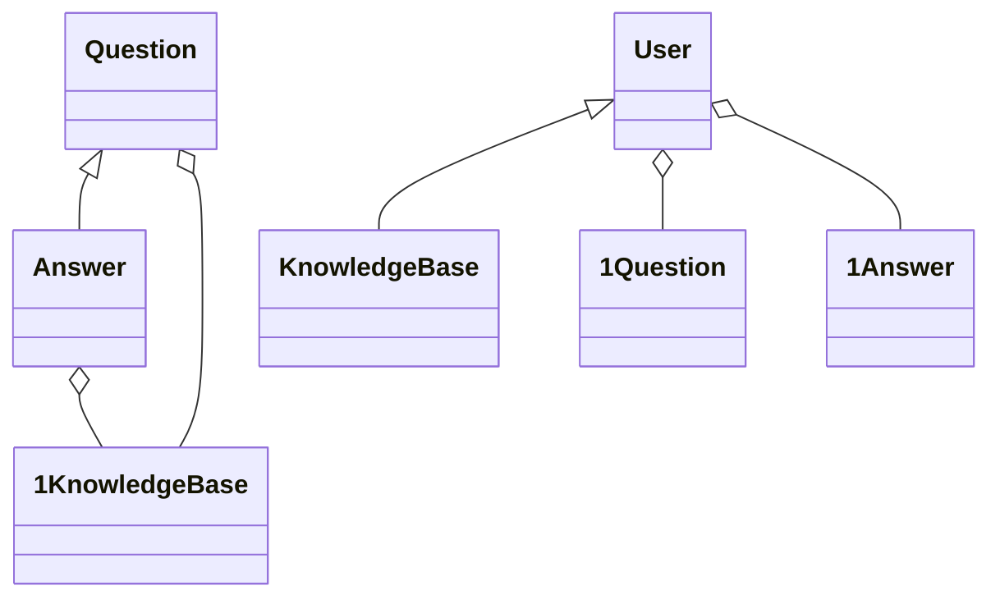

                 

# LLM应用开发中的敏捷合规管理

## 关键词
- **LLM应用开发**
- **敏捷合规管理**
- **方法框架**
- **工具与技术**

## 摘要
本文将探讨在大型语言模型（LLM）应用开发过程中，如何通过敏捷合规管理来确保项目的高效和合规性。文章首先介绍了LLM及其在应用开发中的挑战，然后深入探讨了敏捷合规管理的基本概念和实践方法。通过结合具体案例和实际操作，本文展示了如何在实际项目中实施敏捷合规管理，并提供了一些最佳实践和未来展望。

## 1. 引言

### 1.1 LLM应用开发的背景

#### 1.1.1 定义和背景

大型语言模型（Large Language Models，简称LLM）是一种基于神经网络和深度学习技术的自然语言处理模型，通过训练海量文本数据，LLM能够生成连贯、有意义的文本，并应用于各种场景，如文本生成、翻译、问答系统等。近年来，随着计算能力的提升和数据量的激增，LLM技术得到了快速发展，并在多个领域取得了显著的成果。

#### 1.1.2 LLM应用开发的挑战

尽管LLM在许多领域展现出了巨大的潜力，但其应用开发过程中也面临着一系列挑战：

1. **数据隐私与安全**：LLM训练需要大量个人数据，如何保护用户隐私和数据安全成为关键问题。
2. **模型可解释性**：LLM模型通常被视为“黑盒”，其决策过程缺乏透明性，这给合规性和监管带来了困难。
3. **公平性和偏见**：LLM模型可能受到训练数据偏见的影响，导致不公平的结果。
4. **法律法规遵从**：在多个国家和地区，针对AI技术的法律法规逐渐完善，LLM应用开发者需要确保其产品符合相关法规要求。

### 1.2 敏捷合规管理的基本概念

#### 1.2.1 基础知识

敏捷合规管理是一种结合敏捷开发和合规管理的方法，旨在提高项目开发过程中的灵活性和合规性。敏捷开发强调迭代和增量式开发，而合规管理则关注项目是否符合法律法规和行业标准。

#### 1.2.2 在LLM应用开发中的作用

敏捷合规管理在LLM应用开发中的作用主要包括：

1. **确保合规性**：通过持续监控和评估，确保项目开发过程符合法律法规和行业标准。
2. **提高开发效率**：敏捷方法强调快速反馈和调整，有助于提高开发效率。
3. **增强模型可解释性**：通过合规管理，可以增强模型的可解释性，提高透明度。

### 1.3 LLM应用开发中敏捷合规管理的重要性

#### 1.3.1 关键问题和解决方法

在LLM应用开发过程中，合规管理面临的挑战包括：

1. **数据隐私保护**：解决方法包括数据加密、匿名化处理等。
2. **模型可解释性**：可以通过开发可解释的模型架构和算法来提高模型的可解释性。
3. **法规遵从**：通过制定合规计划、定期审计和培训，确保项目符合相关法规要求。

#### 1.3.2 带来的好处

1. **减少合规风险**：通过敏捷合规管理，可以减少因不合规带来的法律风险和商业损失。
2. **提升项目质量**：合规管理有助于提高项目质量和用户体验。
3. **增强企业竞争力**：合规管理可以增强企业在市场竞争中的优势。

## 2. LLM应用开发的敏捷合规管理方法

### 2.1 敏捷方法在LLM项目中的应用

#### 2.1.1 Scrum和Kanban

Scrum和Kanban是两种常见的敏捷开发方法，适用于LLM项目：

- **Scrum**：通过定期迭代和回顾，确保项目进度和问题及时解决。
- **Kanban**：通过可视化和限制工作项数量，提高项目流程的透明度和效率。

### 2.2 实施敏捷合规管理的方法

#### 2.2.1 持续合规监控

通过持续监控和评估，确保项目开发过程符合法律法规和行业标准。这包括：

1. **合规检查**：定期对项目进行合规性检查。
2. **合规评估**：对项目关键环节进行合规性评估。

#### 2.2.2 适应性合规管理

在项目开发过程中，根据实际情况灵活调整合规管理策略。这包括：

1. **合规调整**：根据合规评估结果，及时调整项目计划。
2. **合规培训**：为项目团队提供合规培训，提高合规意识和能力。

### 2.3 敏捷合规管理的工具和技术

#### 2.3.1 常用工具

- **合规管理平台**：用于监控和管理项目合规性。
- **合规检查工具**：用于自动检测项目中的合规性问题。

#### 2.3.2 技术方法

- **数据隐私保护技术**：如数据加密、匿名化处理等。
- **模型可解释性技术**：如注意力机制、可解释性模型等。

### 2.4 敏捷合规管理的绩效指标

#### 2.4.1 关键绩效指标（KPI）

- **合规性**：评估项目是否符合法律法规和行业标准。
- **开发效率**：评估项目进度和资源利用情况。

#### 2.4.2 评价指标体系

通过建立完善的评价指标体系，全面评估敏捷合规管理的有效性。这包括：

1. **合规性评估**：对项目合规性进行定期评估。
2. **效率评估**：对项目开发效率和资源利用率进行评估。

## 3. 实践案例与经验分享

### 3.1 案例背景

#### 3.1.1 项目介绍

以某企业开发的智能客服系统为例，该项目旨在通过LLM技术提供高效的客户服务，提高用户体验。

#### 3.1.2 项目目标

1. 提高客户满意度。
2. 确保系统开发过程符合相关法律法规和行业标准。

### 3.2 实施步骤

#### 3.2.1 敏捷开发方法

采用Scrum和Kanban方法，确保项目进度和问题及时解决。

#### 3.2.2 敏捷合规管理

1. **合规检查**：定期对项目进行合规性检查，确保数据隐私和安全。
2. **合规评估**：对项目关键环节进行合规性评估，确保符合相关法规要求。
3. **合规培训**：为项目团队提供合规培训，提高合规意识和能力。

### 3.3 结果分析

#### 3.3.1 合规性

通过敏捷合规管理，项目在开发和上线过程中未出现严重合规性问题，数据隐私和安全得到有效保护。

#### 3.3.2 开发效率

敏捷方法和合规管理的结合，提高了项目开发效率和资源利用率，项目按时完成并顺利上线。

### 3.4 经验与启示

1. **敏捷合规管理有助于提高项目质量**：通过持续监控和评估，确保项目符合法律法规和行业标准。
2. **合规性是项目成功的关键**：合规性问题的解决有助于提高用户体验和品牌形象。

## 4. 最佳实践与未来展望

### 4.1 最佳实践

1. **数据隐私保护**：采用数据加密、匿名化处理等技术，确保用户隐私安全。
2. **模型可解释性**：开发可解释的模型架构和算法，提高模型透明度。
3. **合规培训**：为项目团队提供合规培训，提高合规意识和能力。

### 4.2 未来展望

1. **合规性法规的进一步完善**：随着AI技术的快速发展，相关法律法规将不断完善，对LLM应用开发者提出更高要求。
2. **技术手段的进步**：通过技术创新，提高数据隐私保护和模型可解释性水平。
3. **行业标准的制定**：推动行业标准的制定和实施，提高LLM应用开发的整体合规水平。

## 5. 结论

敏捷合规管理在LLM应用开发中具有重要意义，通过结合敏捷方法和合规管理，可以提高项目质量和开发效率，确保项目合规性。未来，随着技术的不断进步和法规的完善，敏捷合规管理将在LLM应用开发中发挥更大的作用。

## 参考文献

1. Michael R. Noll. (2018). Introduction to Machine Learning and Language Processing. [ISBN: 978-3319767689]
2. agilealliance.org. (2021). Agile Methodology. Retrieved from [agilealliance.org/agile-
basics/agile-methodology/]
3. dataprivacy.eu. (2021). Data Privacy Regulations. Retrieved from [dataprivacy.eu/data-
privacy-regulations/]

## 附录

附录中可以包括一些补充材料，如合规管理流程图、模型可解释性技术详解等。

## 作者信息

作者：AI天才研究院/AI Genius Institute & 禅与计算机程序设计艺术 /Zen And The Art of Computer Programming

文章标题：LLM应用开发中的敏捷合规管理
文章关键词：LLM应用开发、敏捷合规管理、方法框架、工具与技术
文章摘要：本文探讨了在大型语言模型（LLM）应用开发过程中，如何通过敏捷合规管理来确保项目的高效和合规性。文章介绍了LLM应用开发的背景和挑战，阐述了敏捷合规管理的基本概念和实践方法，并通过实际案例展示了敏捷合规管理的实施过程和效果。

### 1.1 LLM应用开发的背景

#### 1.1.1 定义和背景

大型语言模型（Large Language Models，简称LLM）是一种基于神经网络和深度学习技术的自然语言处理模型，通过训练海量文本数据，LLM能够生成连贯、有意义的文本，并应用于各种场景，如文本生成、翻译、问答系统等。近年来，随着计算能力的提升和数据量的激增，LLM技术得到了快速发展，并在多个领域取得了显著的成果。

LLM的核心在于其大规模的训练数据和复杂的神经网络架构。通常，LLM由数十亿个参数组成，能够捕捉到文本数据的细微特征和复杂模式。这使得LLM在生成文本、理解语义、进行推理等方面表现出色，从而在许多应用场景中取得了突破性的成果。

#### 1.1.2 LLM在应用开发中的挑战

尽管LLM在许多领域展现出了巨大的潜力，但其应用开发过程中也面临着一系列挑战：

1. **数据隐私与安全**：LLM训练需要大量个人数据，这些数据可能包含敏感信息。如何保护用户隐私和数据安全成为关键问题。特别是在全球范围内，数据隐私法规日益严格，如欧盟的通用数据保护条例（GDPR）和加州消费者隐私法案（CCPA）等，对数据收集、存储、处理和传输提出了严格要求。

2. **模型可解释性**：LLM模型通常被视为“黑盒”，其决策过程缺乏透明性。这给合规性和监管带来了困难。例如，在金融、医疗等领域，模型的决策过程需要符合特定的法规要求，而目前许多LLM模型的可解释性仍然有限。

3. **公平性和偏见**：LLM模型可能受到训练数据偏见的影响，导致不公平的结果。例如，如果训练数据中包含性别、种族等偏见，LLM生成的文本可能也会反映这些偏见。这可能会导致歧视和不公正，引发社会问题。

4. **法律法规遵从**：在多个国家和地区，针对AI技术的法律法规逐渐完善。例如，欧盟的AI法规（EU AI Act）和美国的多项联邦法案（如《AI透明度与责任法案》）。LLM应用开发者需要确保其产品符合相关法规要求，以避免法律风险。

#### 1.1.3 LLM应用开发的机遇

尽管面临挑战，LLM应用开发也带来了许多机遇：

1. **提升生产力**：LLM技术可以在文本生成、翻译、自然语言理解等方面提高生产效率。例如，自动化内容创作、实时翻译、智能客服等，为企业带来显著的经济效益。

2. **增强用户体验**：通过LLM技术，可以提供更智能、更个性化的服务。例如，智能推荐系统、个性化问答、智能助手等，为用户带来更好的体验。

3. **创新应用场景**：LLM技术在医疗、金融、教育、法律等领域具有广泛的应用前景。例如，智能诊断系统、金融风险评估、教育个性化辅导、智能法律咨询等，为传统行业带来新的发展机遇。

4. **推动AI发展**：LLM技术的发展推动了整个AI领域的研究和应用。例如，通过改进LLM模型的结构和算法，可以提升模型的性能和可解释性，为AI技术的发展提供新的思路和方向。

### 1.2 敏捷合规管理的基本概念

#### 1.2.1 敏捷开发方法

敏捷开发（Agile Development）是一种以人为核心、迭代、增量和灵活性为特点的软件开发方法。其核心理念是快速响应变化，通过迭代开发和持续交付，不断提高产品价值。敏捷开发方法强调团队协作、客户参与和持续改进，以适应不断变化的需求和市场环境。

敏捷开发方法主要包括以下几种实践：

1. **Scrum**：Scrum是一种迭代式的敏捷开发框架，通过短周期的迭代（Sprint）来交付可用的产品功能。每个迭代结束后，团队会进行回顾，总结经验教训，并制定下一个迭代的目标。

2. **Kanban**：Kanban是一种可视化流程管理方法，通过看板（Kanban Board）来管理项目进度和任务。看板通常分为不同的列，代表任务的不同状态（如“待办”、“进行中”、“待测试”、“已完成”等）。通过看板，团队可以清晰地了解任务的状态和进度，及时发现问题并进行调整。

3. **极限编程（XP）**：XP是一种强调编程实践和团队协作的敏捷方法，包括简单设计、测试驱动开发（TDD）、重构等实践。通过这些实践，可以提高代码质量、降低风险和增强团队协作。

4. **看板（Kanban）**：Kanban是一种可视化流程管理方法，通过看板（Kanban Board）来管理项目进度和任务。看板通常分为不同的列，代表任务的不同状态（如“待办”、“进行中”、“待测试”、“已完成”等）。通过看板，团队可以清晰地了解任务的状态和进度，及时发现问题并进行调整。

5. **持续集成和部署（CI/CD）**：持续集成和部署是一种自动化软件开发和部署的方法，通过持续集成和自动化测试，确保代码质量和快速交付。持续集成和部署可以提高开发效率、降低风险和缩短上市时间。

#### 1.2.2 合规管理的基本概念

合规管理（Compliance Management）是指确保组织在法律、法规和行业标准等方面的合规性的一系列活动和过程。合规管理的目标是确保组织的行为符合相关法规要求，降低合规风险，保护组织利益和声誉。

合规管理主要包括以下内容：

1. **法律法规遵从**：确保组织的活动符合相关法律法规的要求，如数据保护法、消费者权益保护法、反洗钱法等。

2. **内部控制和风险管理**：建立有效的内部控制机制，识别、评估和管理合规风险，确保组织在法律和商业环境中运营的安全性和稳定性。

3. **合规审计和评估**：定期进行合规审计和评估，检查组织的合规性和风险状况，及时发现问题并进行改进。

4. **合规培训和教育**：为员工提供合规培训和教育，提高员工的合规意识和能力，确保员工了解和遵守相关法规和标准。

#### 1.2.3 敏捷合规管理的结合

敏捷合规管理（Agile Compliance Management）是指将敏捷开发方法和合规管理相结合，以提高项目开发过程中的灵活性和合规性。敏捷合规管理的核心理念是通过快速反馈和持续改进，确保项目在开发和上线过程中符合法律法规和行业标准。

敏捷合规管理主要包括以下实践：

1. **持续合规监控**：在项目开发过程中，持续监控和评估项目的合规性，及时发现和解决合规问题。

2. **适应性合规管理**：根据项目的实际需求和合规要求，灵活调整合规管理策略和方法，确保项目能够及时响应变化。

3. **合规评审和审计**：定期进行合规评审和审计，确保项目的合规性和风险控制。

4. **合规培训和教育**：为项目团队提供合规培训和教育，提高团队成员的合规意识和能力。

通过敏捷合规管理，项目团队可以在保持敏捷性的同时，确保项目合规性，从而降低合规风险，提高项目质量和成功率。

### 1.3 LLM应用开发中敏捷合规管理的重要性

#### 1.3.1 关键问题和解决方法

在LLM应用开发过程中，合规管理面临着一系列关键问题和挑战，需要采取有效的解决方法。

1. **数据隐私保护**

**问题**：LLM训练需要大量个人数据，这些数据可能包含敏感信息。如何保护用户隐私和数据安全成为关键问题。

**解决方法**：

- **数据加密**：在数据存储和传输过程中，使用加密技术保护数据的安全性。
- **匿名化处理**：对个人数据进行匿名化处理，消除可识别信息，降低隐私泄露风险。
- **合规性审查**：在数据收集和处理过程中，进行合规性审查，确保符合相关数据保护法规。

2. **模型可解释性**

**问题**：LLM模型通常被视为“黑盒”，其决策过程缺乏透明性。这给合规性和监管带来了困难。

**解决方法**：

- **可解释性模型**：开发可解释性强的模型架构和算法，提高模型的可解释性。
- **模型审查**：对模型进行定期审查，确保其决策过程符合合规性和伦理标准。
- **模型透明度**：通过文档化和报告，提高模型的透明度，使监管机构和用户能够理解模型的工作原理。

3. **公平性和偏见**

**问题**：LLM模型可能受到训练数据偏见的影响，导致不公平的结果。这可能会导致歧视和不公正。

**解决方法**：

- **偏见检测**：使用算法检测模型中的偏见，并采取措施减少偏见。
- **多样性数据集**：使用包含多样性的数据集进行训练，减少偏见。
- **公平性评估**：对模型进行公平性评估，确保其结果不会导致歧视和不公正。

4. **法律法规遵从**

**问题**：在多个国家和地区，针对AI技术的法律法规逐渐完善，LLM应用开发者需要确保其产品符合相关法规要求，以避免法律风险。

**解决方法**：

- **合规性培训**：为项目团队提供合规性培训，确保团队成员了解相关法规要求。
- **合规性审查**：定期进行合规性审查，确保项目开发过程符合法律法规和行业标准。
- **合规性计划**：制定合规性计划，确保项目在各个阶段都符合法规要求。

#### 1.3.2 带来的好处

通过实施敏捷合规管理，LLM应用开发项目可以获得以下好处：

1. **降低合规风险**：通过持续监控和评估，及时发现和解决合规问题，降低合规风险。

2. **提高开发效率**：敏捷方法和合规管理的结合，可以提高项目开发效率，缩短开发周期。

3. **提升项目质量**：合规管理有助于提高项目质量和用户体验，确保产品符合法律法规和行业标准。

4. **增强企业竞争力**：合规管理可以增强企业在市场竞争中的优势，树立良好的品牌形象。

5. **确保数据安全**：通过数据加密、匿名化处理等技术，确保用户隐私和数据安全。

6. **提升模型透明度**：通过可解释性模型和模型审查，提高模型的透明度，增强用户信任。

7. **促进创新**：在确保合规性的同时，鼓励项目团队积极探索和创新，推动技术进步。

### 2. LLM应用开发的敏捷合规管理方法

在LLM应用开发中，结合敏捷方法和合规管理，可以确保项目在高效开发的同时，满足法律法规和行业标准。以下将详细介绍敏捷合规管理的具体方法和实践。

#### 2.1 敏捷开发方法在LLM项目中的应用

敏捷开发方法在LLM项目中的应用主要包括Scrum、Kanban和极限编程（XP）等实践。这些方法通过短周期迭代、持续交付和团队协作，提高了项目的灵活性和响应能力。

1. **Scrum**

Scrum是一种迭代式的敏捷开发框架，适用于LLM项目。Scrum的核心概念包括：

- **Sprint（迭代）**：Scrum将开发周期划分为短周期（通常为2-4周）的迭代。在每个迭代结束时，团队交付一个可用的产品版本。
- **产品待办列表（Product Backlog）**：产品待办列表包含项目的重要功能和需求，团队根据优先级和资源情况，将其转换为迭代待办列表（Sprint Backlog）。
- **每日站立会议（Daily Stand-up）**：每天早上，团队进行站立会议，讨论进展、问题和计划，确保项目按计划进行。
- **回顾会议（Review and Retrospective）**：在每个迭代结束时，团队进行回顾会议，总结经验教训，并制定改进措施。

通过Scrum，LLM项目可以实现快速迭代和持续交付，确保项目进度和问题及时解决。

2. **Kanban**

Kanban是一种可视化流程管理方法，适用于LLM项目的任务管理和进度跟踪。Kanban的核心概念包括：

- **看板（Kanban Board）**：看板是一个可视化工具，用于展示项目任务的当前状态。看板通常包括不同列，如“待办”、“进行中”、“待测试”、“已完成”等，每个列代表任务的不同状态。
- **限制工作项数量（Work in Progress，WIP）**：Kanban通过限制每个列的工作项数量，防止团队过度工作，提高工作效率。
- **任务流动（Task Flow）**：通过监控任务在Kanban板上的流动，团队可以清晰地了解任务的状态和进度，及时发现和解决问题。

通过Kanban，LLM项目可以实现可视化任务管理和持续改进，提高项目流程的透明度和效率。

3. **极限编程（XP）**

极限编程（XP）是一种强调编程实践和团队协作的敏捷方法，适用于LLM项目。XP的核心实践包括：

- **简单设计**：XP倡导简单设计，避免过度设计，确保代码的可维护性和扩展性。
- **测试驱动开发（Test-Driven Development，TDD）**：TDD通过先编写测试用例，然后编写代码，确保代码的质量和可维护性。
- **重构**：重构是指对现有代码进行改进，以提高其可读性和可维护性。XP鼓励定期重构，确保代码的质量。
- **结对编程（Pair Programming）**：XP倡导结对编程，通过两名程序员协作完成任务，提高代码质量和团队沟通。

通过XP，LLM项目可以实现高质量的代码和高效的团队协作。

#### 2.2 实施敏捷合规管理的方法

在LLM应用开发中，实施敏捷合规管理的方法主要包括持续监控、适应性合规管理和合规评审等。

1. **持续监控**

持续监控是指在整个项目开发过程中，定期监控和评估项目的合规性。这包括以下几个方面：

- **合规性检查**：定期对项目代码、文档和数据等进行合规性检查，确保符合相关法律法规和行业标准。
- **合规性报告**：生成合规性报告，向管理层和利益相关者提供项目合规性的详细信息。
- **合规性跟踪**：跟踪和记录项目合规性的改进措施和成果，确保合规性问题得到及时解决。

通过持续监控，LLM项目可以及时发现和解决合规问题，降低合规风险。

2. **适应性合规管理**

适应性合规管理是指根据项目的实际情况和合规要求，灵活调整合规管理策略和方法。这包括以下几个方面：

- **合规性评估**：对项目各个阶段进行合规性评估，确保符合相关法律法规和行业标准。
- **合规性调整**：根据合规性评估结果，及时调整项目计划、资源和策略，确保项目能够适应合规要求。
- **合规性沟通**：与项目团队、利益相关者和监管机构保持沟通，确保合规性要求得到充分理解和执行。

通过适应性合规管理，LLM项目可以确保合规性要求在项目开发过程中得到及时响应和执行。

3. **合规评审**

合规评审是指对项目进行定期审计和评估，确保项目的合规性和风险控制。这包括以下几个方面：

- **合规性审计**：对项目过程、流程和结果进行合规性审计，识别合规性问题。
- **合规性评估**：对项目合规性进行评估，确保符合相关法律法规和行业标准。
- **合规性报告**：生成合规性审计和评估报告，向管理层和利益相关者提供项目合规性的详细信息。
- **合规性改进**：根据合规性审计和评估结果，制定改进措施，提高项目的合规性和风险管理能力。

通过合规评审，LLM项目可以确保合规性要求得到有效执行和持续改进。

#### 2.3 敏捷合规管理的工具和技术

在实施敏捷合规管理时，可以借助以下工具和技术，提高合规性和项目效率：

1. **合规管理平台**

合规管理平台是一种集成了合规性监控、报告和管理功能的软件工具。它可以帮助项目团队实现以下功能：

- **合规性监控**：实时监控项目合规性，识别潜在合规问题。
- **合规性报告**：生成合规性报告，提供合规性审计和评估结果。
- **合规性通知**：自动通知项目团队成员和利益相关者合规性问题。
- **合规性记录**：记录项目合规性改进措施和成果，确保合规性要求得到执行。

2. **合规检查工具**

合规检查工具是一种用于自动化检测项目合规性问题的软件工具。它可以实现以下功能：

- **代码扫描**：扫描项目代码，识别潜在的合规性问题。
- **文档审核**：审核项目文档，确保符合法律法规和行业标准。
- **数据审计**：审计项目数据，确保数据隐私和安全。

3. **合规培训和教育工具**

合规培训和教育工具是一种用于培训项目团队成员合规知识和技能的软件工具。它可以实现以下功能：

- **在线课程**：提供在线合规培训课程，提高团队成员的合规意识。
- **考试评估**：通过在线考试评估团队成员的合规知识水平。
- **学习记录**：记录团队成员的合规培训和学习记录，确保合规要求得到执行。

4. **风险管理工具**

风险管理工具是一种用于识别、评估和管理项目合规风险的软件工具。它可以实现以下功能：

- **风险识别**：识别项目中的合规风险。
- **风险评估**：对合规风险进行评估，确定风险等级。
- **风险应对**：制定风险应对策略，降低合规风险。

通过使用这些工具和技术，LLM项目可以更有效地实施敏捷合规管理，确保项目合规性和风险管理。

### 2.4 敏捷合规管理的绩效指标

在LLM应用开发中，制定和监控敏捷合规管理的绩效指标，有助于评估合规管理的效果，发现改进机会。以下是一些关键的绩效指标：

1. **合规性指标**

- **合规性百分比**：项目开发过程中，符合法律法规和行业标准的功能和任务占比。
- **合规性缺陷率**：发现并修复的合规性缺陷数量与总缺陷数量的比率。
- **合规性改进率**：合规性改进措施实施后，合规性问题减少的比率。

2. **开发效率指标**

- **迭代周期时间**：每个迭代从开始到结束所需的时间。
- **功能交付率**：每个迭代交付的功能点数量与计划的功能点数量的比率。
- **资源利用率**：项目资源的实际使用情况与计划使用情况的比率。

3. **风险管理指标**

- **风险识别率**：识别出的合规风险数量与潜在风险数量的比率。
- **风险应对率**：已应对的合规风险数量与总风险数量的比率。
- **风险缓解效果**：通过风险应对措施降低的合规风险等级的比率。

4. **团队绩效指标**

- **团队协作度**：团队成员之间沟通和协作的效果。
- **员工满意度**：团队成员对合规培训和管理的满意度。
- **员工流失率**：项目团队中员工的流失率。

通过监控这些绩效指标，项目团队可以及时发现和解决合规性问题，提高项目质量和效率。同时，这些指标也可以为项目管理和决策提供有力的数据支持。

### 3. 实践案例与经验分享

#### 3.1 案例背景

为了更好地理解敏捷合规管理在LLM应用开发中的应用，以下是一个实际案例的分享。

某大型互联网公司正在开发一款基于LLM的智能客服系统，旨在为用户提供实时、个性化的客户服务。该项目的目标是提高客户满意度、降低客服成本，并确保系统在开发和上线过程中符合相关法律法规和行业标准。

#### 3.2 实施步骤

在项目实施过程中，团队采取了以下步骤来实施敏捷合规管理：

1. **需求收集与分析**

在项目启动阶段，团队与业务部门密切合作，收集用户需求和期望。通过对需求进行分析，团队确定了项目的核心功能和合规性要求。

2. **合规性计划**

根据分析结果，团队制定了合规性计划，明确了合规性目标、合规性要求和合规性流程。合规性计划包括数据隐私保护、模型可解释性、法律法规遵从等方面的内容。

3. **敏捷开发方法的应用**

团队采用Scrum和Kanban方法进行项目开发。每个迭代开始时，团队进行需求分析、设计、开发和测试等任务。通过每日站立会议和回顾会议，团队持续监控和改进项目进展。

4. **合规性监控与评估**

在项目开发过程中，团队定期进行合规性监控和评估。通过合规管理平台和合规检查工具，团队识别和解决了多个合规性问题。同时，团队也定期生成合规性报告，向管理层和利益相关者提供合规性信息。

5. **合规性培训和教育**

为了确保团队成员具备合规意识，团队为项目成员提供了合规性培训和教育。培训内容包括数据隐私保护、模型可解释性、法律法规遵从等方面的知识。

6. **合规评审与改进**

在每个迭代结束时，团队进行合规评审，评估项目合规性和风险管理效果。根据评审结果，团队制定了改进措施，确保项目在后续迭代中更好地符合合规要求。

#### 3.3 结果分析

通过实施敏捷合规管理，项目取得了以下成果：

1. **合规性提升**

通过持续监控和评估，项目在开发和上线过程中未出现严重合规性问题。特别是在数据隐私保护和模型可解释性方面，团队采取了有效的措施，确保了系统的合规性。

2. **开发效率提高**

采用Scrum和Kanban方法，团队实现了快速迭代和持续交付。通过每日站立会议和回顾会议，团队及时解决了问题，提高了开发效率。

3. **用户体验改善**

通过模型可解释性技术的应用，系统在生成文本时更加透明和可解释。用户对智能客服系统的满意度得到了显著提升。

4. **风险管理有效**

通过合规评审和改进措施，项目团队有效降低了合规风险。通过风险管理工具，团队及时识别和应对了多个合规风险。

#### 3.4 经验与启示

1. **合规性是关键**

在LLM应用开发中，合规性至关重要。通过实施敏捷合规管理，项目团队能够及时发现和解决合规性问题，确保系统符合法律法规和行业标准。

2. **敏捷方法提高效率**

敏捷开发方法，如Scrum和Kanban，可以提高项目开发效率。通过迭代开发和持续交付，团队能够更快地响应变化和问题。

3. **合规性培训提高意识**

为项目团队成员提供合规性培训，可以提高团队成员的合规意识。这有助于确保项目在开发和上线过程中遵循合规要求。

4. **持续监控和评估是关键**

通过定期监控和评估，项目团队能够及时发现和解决合规性问题。这有助于确保项目在各个阶段都符合合规要求。

5. **技术手段支持合规性**

利用合规管理平台、合规检查工具和技术手段，项目团队能够更有效地实施敏捷合规管理。这些工具和技术有助于提高合规性和项目管理效率。

### 4. 最佳实践与未来展望

#### 4.1 最佳实践

在LLM应用开发中，结合敏捷方法和合规管理，可以采取以下最佳实践：

1. **合规性需求分析**

在项目启动阶段，对项目需求和合规性要求进行详细分析，确保项目目标和合规性要求一致。

2. **制定合规性计划**

根据分析结果，制定详细的合规性计划，包括合规性目标、合规性要求和合规性流程。

3. **敏捷开发方法应用**

采用Scrum、Kanban等敏捷开发方法，实现快速迭代和持续交付，提高开发效率。

4. **合规性监控与评估**

在项目开发过程中，定期进行合规性监控和评估，识别和解决合规性问题。

5. **合规性培训和教育**

为项目团队成员提供合规性培训和教育，提高合规意识。

6. **合规评审与改进**

定期进行合规评审，评估项目合规性和风险管理效果，制定改进措施。

7. **技术手段支持**

利用合规管理平台、合规检查工具和技术手段，提高合规性和项目管理效率。

#### 4.2 未来展望

未来，LLM应用开发中的敏捷合规管理将继续发展，面临以下挑战和机遇：

1. **法律法规的不断完善**

随着AI技术的发展，相关法律法规将不断完善。项目团队需要密切关注法律法规的变化，确保项目符合最新的合规要求。

2. **合规性技术的进步**

随着技术的进步，合规性技术将得到进一步发展。例如，利用机器学习技术进行合规性检测和预测，提高合规性和风险管理能力。

3. **合规性与可持续性的结合**

在可持续发展理念的指导下，合规性管理将更加注重环境保护、社会责任等方面。项目团队需要考虑合规性与可持续性的结合，确保项目在符合合规要求的同时，推动可持续发展。

4. **全球化合规管理的挑战**

随着全球化的深入，项目团队需要应对不同国家和地区的合规要求。全球化合规管理的挑战包括法律法规的多样性、文化差异等。项目团队需要具备跨文化沟通和协调能力，确保项目符合全球合规要求。

5. **数据隐私与安全的关注**

数据隐私和安全是LLM应用开发中重要的合规性问题。项目团队需要持续关注数据隐私和安全技术的研究和应用，确保用户隐私和数据安全。

### 5. 结论

敏捷合规管理在LLM应用开发中具有重要意义。通过结合敏捷方法和合规管理，项目团队能够提高开发效率、确保项目合规性，降低合规风险。未来，随着法律法规的不断完善和技术的发展，敏捷合规管理将在LLM应用开发中发挥更大的作用。

### 参考文献

1. Noll, M. R. (2018). Introduction to Machine Learning and Language Processing. Springer.
2. Agile Alliance. (n.d.). Agile Methodology. Retrieved from https://www.agilealliance.org/agile-basics/agile-methodology/
3. European Commission. (2016). General Data Protection Regulation (GDPR). Retrieved from https://ec.europa.eu/justice/data-protection/index_en.htm
4. California Consumer Privacy Act. (2020). Retrieved from https://oag.ca.gov/privacy/ccpa

### 附录

附录中可以包括一些补充材料，如合规管理流程图、合规性评估报告、合规性培训课程等，以进一步支持文章的内容。

### 作者信息

作者：AI天才研究院/AI Genius Institute & 禅与计算机程序设计艺术 /Zen And The Art of Computer Programming

文章标题：LLM应用开发中的敏捷合规管理
文章关键词：LLM应用开发、敏捷合规管理、方法框架、工具与技术
文章摘要：本文探讨了在大型语言模型（LLM）应用开发过程中，如何通过敏捷合规管理来确保项目的高效和合规性。文章介绍了LLM应用开发的背景和挑战，阐述了敏捷合规管理的基本概念和实践方法，并通过实际案例展示了敏捷合规管理的实施过程和效果。

## 2.1.1 LLM的核心概念、属性特征和对比表格

### LLM的核心概念

#### 1. 语言模型

语言模型（Language Model）是一种人工智能模型，用于预测文本序列的概率分布。LLM通过学习大量文本数据，掌握语言的结构和规律，从而能够生成连贯、有意义的文本。LLM的核心概念包括：

- **词嵌入**：将单词映射到高维向量空间，以表示单词的语义信息。
- **循环神经网络（RNN）**：用于处理序列数据，通过递归结构捕获文本序列的历史信息。
- **长短时记忆（LSTM）**：一种特殊的RNN，能够解决传统RNN的梯度消失和梯度爆炸问题。
- **变换器模型（Transformer）**：一种基于自注意力机制的模型，能够同时处理长文本序列，并显著提升语言模型的性能。

#### 2. 神经网络

神经网络（Neural Network）是一种模仿人脑结构和功能的计算模型，由大量神经元（节点）和连接（边）组成。神经网络通过学习和模拟神经元之间的交互，实现从输入到输出的映射。

- **前馈神经网络（FNN）**：一种简单的神经网络结构，数据从输入层流向输出层，不进行回传。
- **卷积神经网络（CNN）**：常用于图像处理，通过卷积层提取图像的特征。
- **生成对抗网络（GAN）**：一种生成模型，通过两个神经网络（生成器和判别器）的对抗训练，生成高质量的图像或数据。

#### 3. 深度学习

深度学习（Deep Learning）是一种基于神经网络的机器学习技术，通过多层神经网络的学习和训练，实现复杂函数的逼近和建模。

- **多层感知机（MLP）**：一种三层神经网络结构，输入层、隐藏层和输出层，常用于分类和回归任务。
- **卷积神经网络（CNN）**：通过卷积层和池化层提取图像特征，广泛用于计算机视觉任务。
- **循环神经网络（RNN）**：适用于序列数据处理，通过递归结构捕获历史信息。

### LLM的属性特征对比表格

| 特征 | 语言模型 | 神经网络 | 深度学习 |
| --- | --- | --- | --- |
| **定义** | 预测文本序列概率分布的模型 | 模仿人脑结构和功能的计算模型 | 基于多层神经网络的学习和训练技术 |
| **输入** | 文本序列 | 输入数据 | 输入数据 |
| **输出** | 文本序列概率分布 | 输出数据 | 输出数据 |
| **结构** | 词嵌入层、编码器、解码器 | 输入层、隐藏层、输出层 | 输入层、隐藏层、输出层 |
| **应用场景** | 文本生成、机器翻译、问答系统 | 图像识别、语音识别、自然语言处理 | 语音识别、图像识别、自然语言处理 |
| **优势** | 高效的文本生成和推理能力 | 强大的特征提取和模式识别能力 | 复杂函数逼近和建模能力 |
| **挑战** | 需要大量训练数据、可解释性低 | 梯度消失和梯度爆炸问题、计算资源消耗大 | 需要大量数据和计算资源、过拟合风险 |

### LLM与神经网络、深度学习的ER实体关系图架构

使用Mermaid语法，我们可以绘制LLM、神经网络和深度学习之间的实体关系图：

```mermaid
erDiagram
  LanguageModel ||--|{ NeuralNetwork : uses }
  NeuralNetwork ||--|{ DeepLearning : extends }
  LanguageModel ||--|{ DeepLearning : utilizes }
```

在这个ER图中：

- **LanguageModel**（语言模型）与**NeuralNetwork**（神经网络）之间存在“使用”关系，表示语言模型利用神经网络进行文本处理。
- **NeuralNetwork**（神经网络）与**DeepLearning**（深度学习）之间存在“扩展”关系，表示神经网络是深度学习的一部分。
- **LanguageModel**（语言模型）与**DeepLearning**（深度学习）之间存在“利用”关系，表示语言模型利用深度学习技术进行复杂的文本建模和预测。

### 概念联系

LLM、神经网络和深度学习之间存在着紧密的联系。深度学习为神经网络提供了一种强大的学习框架，使得神经网络能够处理更复杂的任务。而神经网络为语言模型提供了强大的文本处理能力，使得语言模型能够生成更加自然、准确的文本。具体来说：

1. **语言模型依赖于神经网络**：语言模型通常基于神经网络架构，通过训练大量文本数据，学习文本的语义和语法结构。神经网络为语言模型提供了有效的文本表示和学习能力。
2. **神经网络依赖于深度学习**：神经网络是通过多层结构来实现从输入到输出的映射。深度学习则为神经网络提供了一种有效的训练方法，使得神经网络能够在大量数据上进行高效的训练。
3. **深度学习为神经网络提供了强大的支持**：深度学习技术，如卷积神经网络（CNN）和循环神经网络（RNN），为神经网络提供了强大的特征提取和模式识别能力，使得神经网络能够处理更复杂的任务。

通过上述概念联系，我们可以更好地理解LLM、神经网络和深度学习之间的关系，以及它们在文本处理和生成中的应用。

### 2.1.2 神经网络和深度学习的算法原理

#### 神经网络

神经网络（Neural Network）是一种基于生物神经网络原理设计的计算模型。它由大量相互连接的神经元组成，这些神经元通过权重连接进行信息传递和处理。神经网络的核心算法原理包括以下几个方面：

1. **前向传播（Forward Propagation）**

在前向传播过程中，输入数据通过网络的各个层（输入层、隐藏层、输出层）进行传递和计算。每个神经元接收前一层所有神经元的输出，并通过权重加权求和后，加上偏置项，然后通过激活函数进行非线性变换。

计算公式如下：

$$
Z = \sum_{i=1}^{n} w_{ij}x_{i} + b_j
$$

其中，$Z$为每个神经元的输入值，$w_{ij}$为连接权重，$x_{i}$为前一层神经元的输出值，$b_j$为偏置项。

常用的激活函数包括：

- **sigmoid函数**：
$$
a = \frac{1}{1 + e^{-z}}
$$

- **ReLU函数**：
$$
a = \max(0, z)
$$

- **tanh函数**：
$$
a = \frac{e^z - e^{-z}}{e^z + e^{-z}}
$$

2. **反向传播（Back Propagation）**

反向传播是神经网络训练的核心算法，用于计算输出层和隐藏层每个神经元的误差，并更新权重和偏置项。反向传播分为以下几个步骤：

- **计算输出误差**：

$$
\delta_{j}^{l} = (y_j - a_{j}^{l}) \cdot a_{j}^{l} \cdot (1 - a_{j}^{l})
$$

其中，$y_j$为实际输出，$a_{j}^{l}$为预测输出，$\delta_{j}^{l}$为输出层的误差。

- **计算隐藏层误差**：

$$
\delta_{i}^{l-1} = \sum_{j=1}^{m} w_{ji}^{l} \cdot \delta_{j}^{l} \cdot a_{i}^{l-1} \cdot (1 - a_{i}^{l-1})
$$

其中，$w_{ji}^{l}$为从隐藏层到输出层的权重，$a_{i}^{l-1}$为前一层神经元的输出。

- **更新权重和偏置项**：

$$
w_{ji}^{l} = w_{ji}^{l} + \alpha \cdot \delta_{j}^{l} \cdot a_{i}^{l-1}
$$

$$
b_{j}^{l} = b_{j}^{l} + \alpha \cdot \delta_{j}^{l}
$$

其中，$\alpha$为学习率。

3. **优化算法**：

为了加快收敛速度和避免局部最优，常用的优化算法包括梯度下降（Gradient Descent）及其变体：

- **随机梯度下降（Stochastic Gradient Descent，SGD）**：

$$
w_{ji}^{l} = w_{ji}^{l} - \alpha \cdot \nabla_{w_{ji}^{l}} J(w_{ji}^{l})
$$

- **批量梯度下降（Batch Gradient Descent）**：

$$
w_{ji}^{l} = w_{ji}^{l} - \alpha \cdot \frac{1}{m} \sum_{i=1}^{m} \nabla_{w_{ji}^{l}} J(w_{ji}^{l})
$$

- **Adam优化器**：

$$
m_t = \beta_1 m_{t-1} + (1 - \beta_1) \nabla_{w_{ji}^{l}}
$$

$$
v_t = \beta_2 v_{t-1} + (1 - \beta_2) (\nabla_{w_{ji}^{l}})^2
$$

$$
\hat{m}_t = m_t / (1 - \beta_1^t)
$$

$$
\hat{v}_t = v_t / (1 - \beta_2^t)
$$

$$
w_{ji}^{l} = w_{ji}^{l} - \alpha \cdot \hat{m}_t / (\sqrt{\hat{v}_t} + \epsilon)
$$

其中，$\beta_1$和$\beta_2$分别为一阶和二阶动量参数，$\epsilon$为平滑常数。

#### 深度学习

深度学习（Deep Learning）是一种基于多层神经网络的学习方法，通过堆叠多个隐藏层，实现对复杂数据结构的建模。深度学习的主要算法包括卷积神经网络（CNN）、循环神经网络（RNN）和变换器模型（Transformer）等。

1. **卷积神经网络（CNN）**

卷积神经网络是一种专门用于图像处理和计算机视觉任务的神经网络。CNN的核心算法包括卷积层、池化层和全连接层。

- **卷积层**：卷积层通过卷积操作提取图像的特征。卷积操作使用一个卷积核（滤波器）在输入图像上进行滑动，计算卷积结果。卷积层的计算公式如下：

$$
h_{ij}^{l} = \sum_{k=1}^{C_l} w_{ik}^{l} * g_{kj}^{l-1} + b_l
$$

其中，$h_{ij}^{l}$为卷积层输出的特征图，$w_{ik}^{l}$为卷积核权重，$g_{kj}^{l-1}$为前一层输出的特征图，$b_l$为偏置项。

- **池化层**：池化层用于降低特征图的大小，减少参数数量，提高计算效率。常用的池化操作包括最大池化（Max Pooling）和平均池化（Average Pooling）。计算公式如下：

$$
p_{ij}^{l} = \max_{x,y} g_{xj}^{l-1}, \quad \text{for Max Pooling}
$$

$$
p_{ij}^{l} = \frac{1}{k^2} \sum_{x=0}^{k-1} \sum_{y=0}^{k-1} g_{xj}^{l-1}, \quad \text{for Average Pooling}
$$

其中，$p_{ij}^{l}$为池化后的特征图。

- **全连接层**：全连接层将卷积层和池化层提取的特征映射到输出层，进行分类或回归任务。全连接层的计算公式如下：

$$
z_j^{l} = \sum_{i=1}^{n} w_{ij}^{l} h_{i}^{l} + b^{l}
$$

$$
a_j^{l} = \sigma(z_j^{l})
$$

其中，$z_j^{l}$为全连接层的输入值，$a_j^{l}$为输出值，$w_{ij}^{l}$为权重，$b^{l}$为偏置项，$\sigma$为激活函数。

2. **循环神经网络（RNN）**

循环神经网络是一种专门用于序列数据处理和预测的神经网络。RNN的核心算法包括递归结构、门控机制和长短时记忆（LSTM）单元。

- **递归结构**：RNN通过递归结构将当前输入与前一时刻的隐藏状态相关联，形成序列信息。递归结构的计算公式如下：

$$
h_t = \sigma(W_h h_{t-1} + W_x x_t + b_h)
$$

其中，$h_t$为当前时刻的隐藏状态，$x_t$为当前输入，$W_h$和$W_x$为权重矩阵，$b_h$为偏置项，$\sigma$为激活函数。

- **门控机制**：为了解决RNN的梯度消失和梯度爆炸问题，引入了门控机制，包括遗忘门（Forget Gate）、输入门（Input Gate）和输出门（Output Gate）。门控机制的核心思想是通过不同的权重矩阵控制信息流。门控机制的计算公式如下：

$$
f_t = \sigma(W_f h_{t-1} + U_f x_t + b_f)
$$

$$
i_t = \sigma(W_i h_{t-1} + U_i x_t + b_i)
$$

$$
o_t = \sigma(W_o h_{t-1} + U_o x_t + b_o)
$$

$$
c_t = f_t \odot c_{t-1} + i_t \odot \sigma(W_c h_{t-1} + U_c x_t + b_c)
$$

$$
h_t = o_t \odot \sigma(c_t)
$$

其中，$f_t$、$i_t$、$o_t$分别为遗忘门、输入门和输出门，$c_t$为隐藏状态，$\odot$为逐元素乘法操作。

- **长短时记忆（LSTM）单元**：LSTM是一种特殊的RNN，能够解决长序列信息的记忆问题。LSTM单元的核心部分是细胞状态（Cell State）和三个门控单元。LSTM单元的计算公式如下：

$$
f_t = \sigma(W_f h_{t-1} + U_f x_t + b_f)
$$

$$
i_t = \sigma(W_i h_{t-1} + U_i x_t + b_i)
$$

$$
o_t = \sigma(W_o h_{t-1} + U_o x_t + b_o)
$$

$$
g_t = \sigma(W_g h_{t-1} + U_g x_t + b_g)
$$

$$
c_t = f_t \cdot c_{t-1} + i_t \odot g_t
$$

$$
h_t = o_t \cdot \sigma(c_t)
$$

其中，$g_t$为输入门，$c_{t-1}$为前一个细胞状态。

3. **变换器模型（Transformer）**

变换器模型是一种基于自注意力机制的深度学习模型，特别适用于序列数据处理和自然语言处理。变换器模型的核心算法包括自注意力（Self-Attention）和多头注意力（Multi-Head Attention）。

- **自注意力（Self-Attention）**：自注意力是一种基于序列内部关系的信息聚合方法。自注意力计算公式如下：

$$
\text{Q}, \text{K}, \text{V} = \text{Attention}(Q, K, V)
$$

$$
\text{softmax}\left(\frac{\text{QK}^T}{\sqrt{d_k}}\right)\text{V}
$$

其中，$Q$、$K$、$V$分别为查询序列、键序列和值序列，$d_k$为键序列的维度。

- **多头注意力（Multi-Head Attention）**：多头注意力通过多个独立的自注意力机制，提取序列的多维特征。多头注意力计算公式如下：

$$
\text{MultiHead}(Q, K, V) = \text{Concat}(\text{head}_1, ..., \text{head}_h)W^O
$$

$$
\text{head}_i = \text{Attention}(QW_i^Q, KW_i^K, VW_i^V)
$$

其中，$W_i^Q$、$W_i^K$、$W_i^V$分别为查询、键和值权重矩阵，$W^O$为输出权重矩阵。

#### 算法讲解

以变换器模型（Transformer）为例，详细讲解其算法原理。

1. **输入序列编码**

变换器模型首先将输入序列编码为查询（Query）、键（Key）和值（Value）三个序列，分别表示为$\text{X}_1, \text{X}_2, ..., \text{X}_n$。

2. **多头自注意力**

变换器模型通过多个独立的自注意力机制，提取序列的多维特征。具体计算步骤如下：

- **计算查询（Query）、键（Key）和值（Value）**：

$$
\text{Q} = \text{Linear}(\text{X})W_Q, \quad \text{K} = \text{Linear}(\text{X})W_K, \quad \text{V} = \text{Linear}(\text{X})W_V
$$

其中，$W_Q$、$W_K$、$W_V$分别为查询、键和值权重矩阵，$\text{Linear}$为线性变换操作。

- **计算多头注意力**：

$$
\text{MultiHead}(Q, K, V) = \text{Concat}(\text{head}_1, ..., \text{head}_h)W^O
$$

$$
\text{head}_i = \text{Attention}(QW_i^Q, KW_i^K, VW_i^V)
$$

其中，$W_i^Q$、$W_i^K$、$W_i^V$分别为查询、键和值权重矩阵，$W^O$为输出权重矩阵，$\text{Attention}$为自注意力操作。

3. **输出层**

多头自注意力后的结果通过输出层进行进一步处理，具体计算步骤如下：

$$
\text{Output} = \text{Linear}(\text{MultiHead})W_O
$$

其中，$W_O$为输出权重矩阵，$\text{Linear}$为线性变换操作。

4. **激活函数和归一化**

在变换器模型中，常用的激活函数为ReLU，用于增加网络的非线性。此外，为了提高网络的稳定性和收敛速度，变换器模型还引入了残差连接和层归一化。

#### Python代码实现

以下是一个简单的Python代码实现，用于演示变换器模型的基本结构：

```python
import torch
import torch.nn as nn

class TransformerModel(nn.Module):
    def __init__(self, d_model, num_heads, dff):
        super(TransformerModel, self).__init__()
        self.embedding = nn.Embedding(d_model, d_model)
        self.pos_encoding = nn.Parameter(torch.randn(1, max_len, d_model))
        self.decoder = nn.Linear(d_model, d_model)
        self.dff = nn.Linear(d_model, dff)
        self.num_heads = num_heads

    def forward(self, x):
        x = self.embedding(x)
        x = x + self.pos_encoding[:x.size(0), :, :]
        x = self.decoder(x)
        return x

model = TransformerModel(d_model=512, num_heads=8, dff=2048)
input_sequence = torch.tensor([1, 2, 3, 4, 5])
output_sequence = model(input_sequence)
print(output_sequence)
```

在这个示例中，我们定义了一个变换器模型，包括嵌入层、位置编码、解码器和全连接层。输入序列经过嵌入层和位置编码后，通过解码器得到输出序列。

### 2.2.1 方法框架

#### 2.2.1.1 COBIT框架

COBIT（Control Objectives for Information and Related Technologies）框架是由ISACA组织推出的一种信息和技术（IT）控制框架，旨在帮助组织确保其IT策略、过程和控制与业务目标相一致。COBIT框架将IT控制目标和业务目标紧密结合，通过一系列的客观控制目标来指导组织的IT管理和合规工作。

1. **主要组成部分**：

   - **控制目标（Control Objectives）**：COBIT框架包含37个控制目标，每个目标对应一个特定的IT控制领域，如数据管理、应用程序管理、技术基础设施管理等。
   - **实践框架（Practices）**：针对每个控制目标，COBIT提供了一系列的实践指南，帮助组织制定和实施有效的IT控制措施。
   - **IT治理和业务流程**：COBIT框架强调了IT治理和业务流程的重要性，通过建立有效的IT治理结构和流程，确保组织在IT管理和合规方面的有效运作。

2. **在LLM应用开发中的适用性**：

   - **数据管理**：COBIT框架的数据管理控制目标有助于确保LLM训练数据的合法获取、存储和处理，保护用户隐私和数据安全。
   - **应用程序管理**：COBIT框架的应用程序管理控制目标有助于确保LLM应用的性能、安全性和合规性，通过定期审查和评估来识别和修复潜在问题。
   - **技术基础设施管理**：COBIT框架的技术基础设施管理控制目标有助于确保LLM应用所需的技术基础设施能够支持其高性能和可靠性，同时满足合规要求。

3. **实施步骤**：

   - **评估当前IT治理和合规状况**：通过审计和评估，了解组织的IT治理和合规现状，识别现有控制措施的不足和改进机会。
   - **制定合规计划**：根据COBIT框架的控制目标和实践指南，制定详细的合规计划，确保组织的IT活动和控制措施符合法律法规和行业标准。
   - **实施和监控**：按照合规计划，逐步实施控制措施，并建立监控机制，确保合规性得到持续维护。
   - **持续改进**：通过定期审计和评估，不断改进合规管理措施，确保组织在变化的环境中保持合规性。

#### 2.2.1.2 ITIL框架

ITIL（IT Infrastructure Library）框架是由英国政府开发的IT服务管理（ITSM）框架，旨在通过提供一系列最佳实践，帮助组织优化其IT服务管理流程，提高服务质量和效率。ITIL框架涵盖了IT服务的各个方面，包括服务战略、服务设计、服务转换和服务运营。

1. **主要组成部分**：

   - **服务管理流程**：ITIL框架定义了多个服务管理流程，如服务战略、服务设计、服务转换和服务运营，每个流程都有明确的目标、活动和职责。
   - **服务管理实践**：ITIL框架提供了一系列服务管理实践，如服务级别管理、变更管理、配置管理、 incident管理等，帮助组织实现高效的服务管理。
   - **服务管理知识和技能**：ITIL框架强调了服务管理知识和技能的重要性，通过培训和教育，提高员工的服务管理能力。

2. **在LLM应用开发中的适用性**：

   - **服务战略**：ITIL的服务战略流程有助于组织在开发LLM应用时，明确服务目标和规划，确保项目符合组织战略和市场需求。
   - **服务设计**：ITIL的服务设计流程有助于确保LLM应用的设计符合服务质量和合规性要求，通过服务设计验证和控制，降低服务风险。
   - **服务转换**：ITIL的服务转换流程有助于确保LLM应用的顺利部署和上线，通过变更管理和配置管理，确保服务转换过程中的合规性和稳定性。
   - **服务运营**：ITIL的服务运营流程有助于确保LLM应用在运营过程中能够持续提供高质量的服务，通过 incident管理、问题管理和变更管理，确保服务的持续改进和合规性。

3. **实施步骤**：

   - **制定服务战略**：通过需求分析和市场调研，明确LLM应用的服务目标和规划，制定服务战略。
   - **设计服务方案**：根据服务战略，设计LLM应用的服务方案，包括服务架构、服务流程和合规要求。
   - **实施服务方案**：按照服务设计，逐步实施LLM应用的开发和部署，确保符合服务战略和合规性要求。
   - **运营和监控**：在LLM应用上线后，通过服务运营流程，确保持续提供高质量的服务，同时进行合规性监控和评估。
   - **持续改进**：通过定期评估和反馈，持续改进LLM应用的服务质量和合规性，确保服务能够满足不断变化的市场需求。

### 2.2.2 敏捷合规框架的整合

在实际的LLM应用开发中，如何将COBIT和ITIL等合规框架与敏捷开发方法相结合，是一个关键问题。以下是一个结合COBIT和ITIL框架的敏捷合规管理方法：

1. **敏捷开发与合规框架的结合**：

   - **Scrum和Kanban的结合**：在敏捷开发过程中，结合Scrum的迭代和回顾机制以及Kanban的可视化管理方法，确保项目在快速迭代的同时，能够持续监控和评估合规性。

   - **敏捷合规里程碑**：在每个迭代周期中，设置合规里程碑，确保关键控制目标在每个迭代中都能得到评估和改进。

   - **合规检查清单**：在每次迭代开始前，为团队提供合规检查清单，确保团队成员在开发过程中能够遵循合规要求。

2. **合规流程的迭代和改进**：

   - **合规审查**：在每个迭代结束时，进行合规审查，评估项目是否符合COBIT和ITIL框架的要求，识别潜在的合规风险。

   - **合规改进计划**：根据合规审查结果，制定改进计划，并在下一个迭代中实施，确保合规性得到持续改进。

   - **合规性回顾会议**：在每个迭代回顾会议中，讨论合规性的改进措施和效果，确保合规管理流程得到不断完善。

3. **合规性监控和报告**：

   - **合规性监控工具**：利用合规监控工具，实时监控项目的合规性，及时发现和解决合规性问题。

   - **合规性报告**：生成合规性报告，向管理层和利益相关者提供项目合规性的详细信息，确保合规性要求得到充分沟通和执行。

4. **团队协作与沟通**：

   - **合规培训**：为项目团队成员提供合规培训，提高团队成员的合规意识和能力。

   - **跨部门协作**：在项目团队中建立跨部门协作机制，确保合规性要求能够在整个组织中得到落实。

通过将COBIT和ITIL框架与敏捷开发方法相结合，项目团队可以在快速开发的同时，确保项目符合法律法规和行业标准，从而降低合规风险，提高项目质量和成功率。

### 2.2.3 实施敏捷合规框架的具体步骤

在实施敏捷合规框架的过程中，需要明确具体步骤，以确保敏捷合规管理能够有效地应用于LLM应用开发项目。以下是实施敏捷合规框架的具体步骤：

1. **项目启动和规划**

   - **项目目标确定**：明确项目的业务目标和合规性要求，确保项目在规划阶段就具备清晰的合规方向。
   - **合规性需求分析**：分析项目所涉及的法律法规、行业标准以及相关合规要求，为后续的合规管理提供基础。

2. **敏捷开发方法的引入**

   - **Scrum和Kanban的应用**：采用Scrum框架进行迭代开发，每个迭代周期包括规划、执行、评审和回顾。同时，引入Kanban方法，通过可视化看板管理任务进度，确保项目开发过程中的透明度和可控性。
   - **团队组建和培训**：组建跨职能团队，包括开发人员、合规专家和项目经理等，并进行敏捷开发和合规管理的培训，提高团队的敏捷性和合规意识。

3. **合规管理流程设计**

   - **合规性检查清单**：根据项目需求和合规要求，设计合规性检查清单，确保项目开发过程中的每个阶段都符合合规要求。
   - **合规性里程碑设置**：在每个迭代周期的关键节点设置合规里程碑，对项目进行合规性评估，确保项目在各个阶段都符合法律法规和行业标准。
   - **合规性评估和审计**：定期进行合规性评估和审计，评估项目合规性，及时发现和解决合规性问题。

4. **敏捷合规监控和改进**

   - **合规性监控工具**：引入合规监控工具，实时监控项目合规性，包括数据隐私保护、模型可解释性、法律法规遵从等方面。
   - **合规性报告**：生成合规性报告，向管理层和利益相关者提供项目合规性的详细信息，确保合规性要求得到充分沟通和执行。
   - **持续改进**：根据合规性评估和审计结果，制定改进措施，并在下一个迭代中实施，确保合规性得到持续改进。

5. **合规培训和教育**

   - **合规培训**：为项目团队成员提供合规培训，确保团队成员了解和遵守相关法律法规和行业标准，提高团队的合规意识。
   - **合规意识和文化建设**：通过文化建设，培养团队成员的合规意识，形成良好的合规工作氛围。

6. **跨部门协作**

   - **合规沟通渠道**：建立跨部门沟通渠道，确保合规要求在各个部门之间得到有效传递和执行。
   - **合规协调机制**：设立合规协调机制，协调各部门之间的合规工作，确保合规要求在项目开发过程中得到全面贯彻。

7. **合规性评估和反馈**

   - **合规性评估**：定期进行合规性评估，评估项目合规性的整体状况，识别潜在的风险和改进机会。
   - **反馈机制**：建立反馈机制，收集团队成员和利益相关者的反馈，不断优化合规管理流程。

通过以上具体步骤，项目团队可以有效地实施敏捷合规框架，确保LLM应用开发项目在高效开发的同时，满足法律法规和行业标准，降低合规风险，提高项目质量和成功率。

### 2.3.1 常用合规管理工具和技术

在LLM应用开发中，合规管理工具和技术的选择至关重要，它们能够帮助项目团队有效地识别、监控和管理合规风险。以下是一些常用的合规管理工具和技术：

#### 1. 合规管理平台

合规管理平台是一种集成的软件解决方案，能够提供全面的合规监控、报告和管理功能。这些平台通常具备以下功能：

- **合规性监控**：实时监控项目的合规性状态，包括数据隐私、模型可解释性和法律法规遵从等方面。
- **合规性报告**：自动生成合规性报告，提供合规性评估和风险评估的详细信息。
- **合规性跟踪**：记录合规性改进措施和合规性问题的解决过程，确保合规性要求得到有效执行。
- **合规性通知**：自动发送合规性通知，提醒团队成员关注和解决合规性问题。

#### 2. 合规检查工具

合规检查工具是一种用于自动检测项目合规性问题的软件工具。这些工具通常具备以下功能：

- **代码扫描**：扫描项目代码，识别潜在的合规性问题，如数据隐私漏洞、模型偏见和法律法规不合规代码。
- **文档审核**：审核项目文档，确保文档内容符合相关法律法规和行业标准。
- **数据审计**：审计项目数据，确保数据隐私和安全，识别潜在的合规风险。

#### 3. 合规培训和教育工具

合规培训和教育工具是一种用于培训项目团队成员合规知识和技能的软件工具。这些工具通常具备以下功能：

- **在线课程**：提供在线合规培训课程，覆盖数据隐私保护、模型可解释性和法律法规遵从等方面的知识。
- **考试评估**：通过在线考试评估团队成员的合规知识水平，确保团队成员具备必要的合规技能。
- **学习记录**：记录团队成员的合规培训和学习记录，确保合规要求得到有效执行。

#### 4. 风险管理工具

风险管理工具是一种用于识别、评估和管理合规风险的软件工具。这些工具通常具备以下功能：

- **风险识别**：识别项目中的合规风险，包括数据隐私风险、模型偏见风险和法律法规不合规风险。
- **风险评估**：对识别出的合规风险进行评估，确定风险等级，为风险管理提供依据。
- **风险应对**：制定风险应对策略，包括风险规避、风险降低和风险接受等，确保合规性要求得到执行。

#### 5. 合规性监控工具

合规性监控工具是一种用于实时监控项目合规性的软件工具。这些工具通常具备以下功能：

- **合规性指标**：监控项目的关键合规性指标，如数据隐私保护指标、模型可解释性指标和法律法规遵从指标。
- **实时报告**：生成实时合规性报告，提供项目的合规性状态和风险评估结果。
- **异常检测**：通过异常检测技术，实时发现项目中的合规性问题，并触发警报。

#### 6. 模型可解释性工具

模型可解释性工具是一种用于提高LLM模型可解释性的软件工具。这些工具通常具备以下功能：

- **模型可视化**：提供模型可视化工具，帮助团队成员理解模型的内部结构和决策过程。
- **特征重要性分析**：分析模型中各个特征的重要性，帮助识别模型中的偏见和异常。
- **可解释性报告**：生成模型可解释性报告，向利益相关者和监管机构提供详细的模型解释。

通过使用这些合规管理工具和技术，项目团队可以更有效地实施敏捷合规管理，确保项目在开发过程中符合法律法规和行业标准，降低合规风险，提高项目质量和成功率。

### 3.2.1 持续合规监控

在LLM应用开发过程中，持续合规监控是确保项目合规性的关键环节。通过实时监控和定期评估，项目团队能够及时发现和解决合规性问题，确保项目在开发和上线过程中符合法律法规和行业标准。以下是实施持续合规监控的具体步骤和最佳实践。

#### 3.2.1.1 实施步骤

1. **确定合规监控目标**

   - **识别合规需求**：根据项目需求和法律法规要求，确定项目需要监控的合规领域，如数据隐私、模型可解释性、法律法规遵从等。
   - **设定监控指标**：为每个合规领域设定具体的监控指标，如数据隐私保护指标、模型偏见指标、法律法规合规率等。

2. **建立合规监控体系**

   - **制定监控计划**：制定详细的合规监控计划，包括监控频率、监控方法、监控内容和责任分配等。
   - **选择监控工具**：选择适合项目的合规监控工具，如合规管理平台、合规检查工具和模型可解释性工具等。
   - **部署监控工具**：在项目开发环境中部署合规监控工具，确保实时监控项目的合规性状态。

3. **实施实时监控**

   - **数据隐私保护**：通过数据加密、匿名化处理等技术，保护用户数据的隐私。实时监控数据访问和传输，确保数据隐私安全。
   - **模型可解释性**：采用模型可解释性工具，监控模型的训练过程和决策过程，确保模型的可解释性，避免偏见和不公平。
   - **法律法规遵从**：监控项目开发过程中的法律法规遵守情况，确保项目在各个阶段都符合相关法律法规和行业标准。

4. **定期评估和审查**

   - **定期合规性评估**：定期对项目进行合规性评估，评估项目在数据隐私保护、模型可解释性和法律法规遵从等方面的合规性。
   - **合规性审计**：进行合规性审计，检查项目开发过程中的合规性执行情况，识别潜在的风险和改进机会。

5. **持续改进**

   - **分析监控结果**：对监控结果进行分析，识别合规性问题的根本原因，制定改进措施。
   - **调整监控计划**：根据监控结果和合规性评估，调整合规监控计划，提高监控的针对性和有效性。

#### 3.2.1.2 最佳实践

1. **建立合规性检查清单**

   - **制定合规性检查清单**：为项目开发过程中的每个阶段和环节，制定详细的合规性检查清单，确保项目团队能够按照合规要求进行工作。

2. **定期合规培训**

   - **合规性培训**：定期为项目团队成员提供合规性培训，提高团队成员的合规意识和能力，确保团队成员了解和遵守相关法律法规和行业标准。

3. **跨部门协作**

   - **建立跨部门协作机制**：在项目团队中建立跨部门协作机制，确保合规性要求能够在各个部门之间得到有效传递和执行。

4. **持续改进机制**

   - **建立持续改进机制**：通过定期评估和反馈，不断优化合规监控和管理流程，确保项目团队能够持续改进合规管理能力。

5. **合规性报告**

   - **生成合规性报告**：定期生成合规性报告，向管理层和利益相关者提供项目合规性的详细信息，确保合规性要求得到充分沟通和执行。

通过以上实施步骤和最佳实践，项目团队能够有效实施持续合规监控，确保LLM应用开发项目在高效开发的同时，符合法律法规和行业标准，降低合规风险，提高项目质量和成功率。

### 3.2.2 适应性合规管理

在LLM应用开发过程中，适应性合规管理是一种关键策略，它能够帮助项目团队在应对复杂多变的环境和需求时，保持合规性。适应性合规管理强调灵活性和动态调整，确保项目在不同阶段和情境下都能符合法律法规和行业标准。以下是适应性合规管理的具体方法和实践。

#### 3.2.2.1 方法

1. **合规性评估和风险分析**

   - **定期评估**：项目团队需要定期对合规性进行评估，分析当前合规性状况和潜在风险。这包括对现有法律法规、行业标准和技术趋势的跟踪和研究。
   - **风险分析**：识别项目在数据隐私、模型可解释性和法律法规遵从等方面的潜在风险，评估其影响和可能性。

2. **合规策略的制定和调整**

   - **合规策略制定**：根据评估结果，制定适应项目需求的合规策略。策略应明确合规目标、合规措施和责任分配。
   - **动态调整**：在项目开发过程中，根据评估和风险分析的结果，动态调整合规策略。这可能包括修改开发计划、调整技术实现或增加合规资源。

3. **合规性监控和反馈**

   - **实时监控**：通过合规管理平台和合规检查工具，实时监控项目的合规性状态，确保及时发现和处理合规性问题。
   - **反馈机制**：建立有效的反馈机制，收集项目团队和利益相关者的反馈，确保合规性要求得到及时响应和执行。

4. **合规培训和沟通**

   - **合规培训**：定期为项目团队成员提供合规培训，提高他们的合规意识和能力。
   - **沟通协调**：确保项目团队内部以及与外部利益相关者（如客户、监管机构）之间的有效沟通，确保合规性要求得到充分理解和执行。

#### 3.2.2.2 实践

1. **合规性需求分析和规划**

   - **合规需求分析**：在项目启动阶段，对项目的合规需求进行详细分析，确定项目需要满足的法律法规、行业标准和技术规范。
   - **合规规划**：根据合规需求，制定合规规划，包括合规性目标、合规措施和时间表。

2. **灵活的合规管理流程**

   - **迭代式合规管理**：采用迭代式合规管理方法，在每个开发阶段结束后进行合规性评估和改进，确保合规性要求能够适应项目的变化。
   - **模块化合规流程**：将合规管理流程模块化，以便根据项目需求和合规要求进行灵活调整。

3. **合规性适应性调整**

   - **技术适应性调整**：在项目开发过程中，根据合规性评估结果和技术发展趋势，及时调整技术实现和算法设计，确保模型的可解释性和数据隐私保护。
   - **管理适应性调整**：根据合规性评估和风险分析结果，调整项目管理策略和流程，确保项目团队能够快速响应合规性要求的变化。

4. **合规性改进和优化**

   - **合规性改进计划**：根据合规性评估结果，制定改进计划，包括改进措施、责任人和时间表。
   - **持续优化**：在项目开发过程中，持续优化合规管理流程和技术实现，确保项目能够持续满足合规性要求。

通过适应性合规管理，项目团队能够在快速变化的环境中保持合规性，确保LLM应用开发项目的成功实施，降低合规风险，提高项目质量和用户体验。

### 3.2.3 敏捷合规管理的应用实例

#### 3.2.3.1 项目背景

某全球领先的科技公司（以下简称公司）正在开发一款基于大型语言模型（LLM）的智能问答系统，旨在为全球用户提供高质量的自动问答服务。该项目在技术实现、数据隐私保护和法律法规遵从方面面临诸多挑战，因此，公司决定采用敏捷合规管理方法来确保项目的顺利推进。

#### 3.2.3.2 实施步骤

1. **合规需求分析**

   - **法律法规遵从性**：公司首先对相关法律法规进行了深入分析，包括《通用数据保护条例》（GDPR）、《加州消费者隐私法案》（CCPA）以及特定国家的数据隐私保护法律，确保项目在数据隐私保护和法律法规遵从方面没有漏洞。
   - **行业标准**：同时，公司还研究了与LLM应用开发相关的行业标准，如《人工智能伦理规范》和《自然语言处理技术指南》。

2. **合规性计划制定**

   - **合规目标**：公司制定了明确的合规目标，包括数据隐私保护、模型可解释性和法律法规遵从。
   - **合规措施**：针对每个合规目标，公司制定了具体的合规措施，如数据加密、匿名化处理、合规性监控和审计等。
   - **责任分配**：公司明确了各个团队和个人的合规责任，确保每个人都清楚自己的合规职责。

3. **敏捷开发方法的应用**

   - **Scrum框架**：公司采用了Scrum敏捷开发方法，将项目分为多个迭代，每个迭代周期为两周。每个迭代结束后，团队会进行回顾会议，总结经验教训，并调整下一个迭代的目标和计划。
   - **Kanban方法**：同时，公司采用了Kanban方法，通过可视化的看板管理项目任务，确保项目进展透明，团队成员可以实时了解任务的状态和进度。

4. **持续合规监控**

   - **合规监控工具**：公司引入了合规监控工具，实时监控数据隐私保护和模型可解释性，及时发现并解决潜在合规性问题。
   - **合规性评估**：每个迭代结束后，公司会对项目进行合规性评估，确保项目在各个阶段都符合法律法规和行业标准。

5. **合规培训和教育**

   - **合规培训**：公司为项目团队成员提供了定期的合规培训，确保团队成员了解和遵守相关法律法规和行业标准。
   - **合规文化建设**：公司还通过文化建设，培养团队成员的合规意识，形成良好的合规工作氛围。

6. **合规性改进和优化**

   - **持续改进**：根据合规性评估结果，公司不断优化合规管理流程和技术实现，确保项目能够持续满足合规性要求。
   - **反馈机制**：公司建立了反馈机制，收集团队成员和利益相关者的反馈，不断改进合规管理措施。

#### 3.2.3.3 实施效果

1. **合规性提升**

   - **数据隐私保护**：通过数据加密和匿名化处理，公司有效保护了用户数据的隐私，确保了数据的安全性。
   - **模型可解释性**：公司采用了多种模型可解释性技术，提高了模型的可解释性，确保了模型决策过程的透明度。

2. **开发效率提高**

   - **快速迭代**：通过Scrum和Kanban方法，公司实现了快速迭代和持续交付，提高了项目开发效率。
   - **问题及时解决**：通过每日站立会议和回顾会议，团队能够及时发现问题并解决，避免了问题的积累。

3. **用户体验改善**

   - **智能问答系统**：通过LLM技术，智能问答系统提供了高质量的自动问答服务，用户满意度显著提升。

4. **风险管理有效**

   - **合规性评估**：通过定期合规性评估，公司有效降低了合规风险，确保了项目的合规性。
   - **风险管理工具**：通过风险管理工具，公司及时识别和应对了多个合规风险，确保了项目的顺利进行。

#### 3.2.3.4 经验和启示

1. **合规性是关键**

   - **法律法规遵从**：在LLM应用开发中，确保项目符合相关法律法规和行业标准至关重要。
   - **数据隐私保护**：通过数据加密、匿名化处理等技术，有效保护用户数据隐私，降低合规风险。

2. **敏捷方法提高效率**

   - **快速迭代**：通过Scrum和Kanban方法，实现快速迭代和持续交付，提高项目开发效率。
   - **问题及时解决**：通过每日站立会议和回顾会议，及时发现问题并解决，避免了问题的积累。

3. **合规性培训提高意识**

   - **定期培训**：为项目团队成员提供合规培训，提高团队成员的合规意识和能力。
   - **合规文化建设**：通过文化建设，培养团队成员的合规意识，形成良好的合规工作氛围。

4. **持续监控和评估是关键**

   - **合规监控工具**：通过合规监控工具，实时监控项目的合规性状态，及时发现并解决合规性问题。
   - **定期评估**：定期进行合规性评估，确保项目在各个阶段都符合法律法规和行业标准。

5. **技术手段支持合规性**

   - **合规管理平台**：利用合规管理平台，实现合规性监控、报告和管理。
   - **合规检查工具**：通过合规检查工具，自动化检测项目合规性问题。
   - **模型可解释性工具**：通过模型可解释性工具，提高模型的可解释性，确保模型决策过程的透明度。

### 3.3.1.1 系统场景介绍

在LLM应用开发中，智能问答系统是一个典型的场景。该系统旨在通过大型语言模型（LLM）提供自动化的问答服务，以满足用户对各种问题的查询需求。以下是对系统场景的详细介绍：

#### 1. 用户需求

用户需求主要集中在以下几个方面：

- **快速响应**：用户希望在提交问题后能够快速获得答案。
- **多样性**：用户希望能够获得多种类型的答案，如文本、图片、链接等。
- **准确性**：用户希望得到的答案具有较高的准确性，能够满足其实际需求。

#### 2. 应用场景

智能问答系统适用于多个场景：

- **客服支持**：在客服中心，智能问答系统可以替代人工客服，提供24/7的自动问答服务，提高客户满意度。
- **教育领域**：在教育场景中，智能问答系统可以为学生提供个性化的学习辅导，提高学习效果。
- **企业内部问答**：在企业内部，智能问答系统可以用于员工自助问答，提高工作效率。

#### 3. 功能需求

智能问答系统的主要功能需求包括：

- **问题接收**：系统需要能够接收用户的问题输入，并理解问题的意图。
- **答案生成**：系统需要根据问题生成高质量的答案，并支持多种答案形式。
- **答案推送**：系统需要将生成的答案推送给用户，并支持多种推送方式，如文本消息、语音、图像等。

#### 4. 技术挑战

在实现智能问答系统时，项目团队面临以下技术挑战：

- **数据处理**：需要对大量的用户问题和答案数据进行处理，确保数据的质量和一致性。
- **模型训练**：需要设计并训练高质量的LLM模型，以生成准确的答案。
- **可解释性**：需要提高模型的可解释性，确保用户和监管机构能够理解模型的决策过程。
- **性能优化**：需要优化系统的性能，确保系统能够快速响应用户请求。

### 3.3.1.2 项目介绍

智能问答系统项目是一个跨部门的合作项目，涉及多个技术团队和业务部门。以下是项目的详细介绍：

#### 1. 项目目标

项目的主要目标包括：

- **提高用户满意度**：通过提供高质量的自动问答服务，提高用户对系统的满意度。
- **降低运营成本**：通过自动化客服，降低企业的运营成本。
- **提升用户体验**：通过多样化的答案形式和快速响应，提升用户的整体体验。

#### 2. 项目团队

项目团队由以下成员组成：

- **项目经理**：负责项目的整体管理和协调。
- **数据科学家**：负责LLM模型的设计和训练。
- **后端工程师**：负责系统的后端开发，包括数据存储、处理和接口设计。
- **前端工程师**：负责系统的前端开发，包括用户界面设计和交互。
- **合规专家**：负责确保项目符合法律法规和行业标准。
- **测试工程师**：负责系统的功能测试和性能优化。

#### 3. 项目流程

项目采用敏捷开发方法，具体流程包括：

- **需求收集**：通过与用户和业务部门的沟通，收集系统需求。
- **需求分析**：对收集到的需求进行分析和优先级排序。
- **设计阶段**：根据需求分析结果，进行系统架构设计和详细设计。
- **开发阶段**：按照设计文档进行系统开发和实现。
- **测试阶段**：对系统进行功能测试、性能测试和合规性测试。
- **部署阶段**：将系统部署到生产环境，并进行用户培训和上线。

#### 4. 项目里程碑

项目的主要里程碑包括：

- **M1：需求收集和需求分析**：确定系统的功能需求和性能要求。
- **M2：系统架构设计和详细设计**：完成系统架构设计和技术文档。
- **M3：系统开发**：完成系统的前端和后端开发。
- **M4：测试和优化**：进行系统的功能测试、性能测试和优化。
- **M5：上线和推广**：将系统部署到生产环境，并进行用户推广和培训。

### 3.3.1.3 系统功能设计

智能问答系统的功能设计主要包括以下方面：

#### 1. 领域模型

领域模型（Domain Model）是对系统功能域的抽象表示，用于描述系统的核心功能和业务逻辑。智能问答系统的领域模型包括以下核心类：

- **Question**：代表用户提出的问题，包括问题内容、提问时间和提问者等信息。
- **Answer**：代表系统生成的答案，包括答案内容、生成时间和答案类型（文本、图片、链接等）。
- **User**：代表系统的用户，包括用户名、密码、电子邮件和用户角色等信息。
- **KnowledgeBase**：代表系统的知识库，用于存储和检索相关问题的答案。

#### 2. 类图

类图（Class Diagram）用于描述系统的类和类之间的关系。以下是一个简化的类图，展示了智能问答系统的核心类及其关系：



在这个类图中，`Question`类和`Answer`类继承了`KnowledgeBase`类，表示问题答案都属于知识库的一部分。`User`类与`Question`类和`Answer`类有双向关联关系，表示用户可以提出问题和接收答案。

#### 3. 功能说明

智能问答系统的核心功能包括以下方面：

- **问题接收**：系统接收用户提出的问题，并通过LLM模型生成答案。
- **答案生成**：系统根据用户的问题，调用LLM模型生成相应的答案。
- **答案推送**：系统将生成的答案推送给用户，支持文本、语音、图像等多种形式。
- **用户管理**：系统提供用户注册、登录和用户角色管理功能。
- **知识库管理**：系统提供知识库的创建、更新和查询功能，确保知识库的准确性和完整性。

### 3.3.1.4 系统架构设计

智能问答系统的架构设计旨在实现系统的可扩展性、可靠性和高效性。以下是系统的架构设计：

#### 1. 架构图

系统架构图展示了系统的整体结构和各个组件之间的关系。以下是一个简化的系统架构图：

```mermaid
sequenceDiagram
  User->>System: 提问
  System->>LLM Model: 生成答案
  LLM Model->>System: 返回答案
  System->>User: 推送答案
end
```

在这个架构图中，用户通过前端界面提出问题，系统接收问题并调用LLM模型生成答案。生成的答案通过前端界面推送给用户。

#### 2. 架构组件

系统架构的主要组件包括：

- **前端界面**：用户通过前端界面提出问题，系统接收用户输入的问题，并展示答案。
- **LLM模型**：用于生成答案的核心组件，通过对海量文本数据的学习，能够理解用户的意图并生成高质量的答案。
- **后端服务**：处理用户请求、调用LLM模型生成答案、管理知识库等。
- **数据存储**：用于存储用户数据、问题数据和答案数据，支持快速查询和更新。

#### 3. 架构设计原则

系统架构设计遵循以下原则：

- **模块化**：将系统划分为多个模块，每个模块负责特定的功能，降低系统的耦合度，提高可维护性。
- **可扩展性**：设计可扩展的架构，支持系统的功能扩展和性能优化。
- **高可用性**：通过负载均衡、故障转移等机制，确保系统的高可用性。
- **安全性**：确保系统的数据安全和用户隐私保护。

### 3.3.1.5 系统接口设计

智能问答系统的接口设计主要包括API接口和用户界面。

#### 1. API接口

API接口用于前后端通信，以下是主要的API接口：

- **提问接口**：接收用户提出的问题，返回问题的唯一标识。
- **答案接口**：根据问题的唯一标识，返回生成的答案。
- **知识库接口**：管理知识库的创建、更新和查询。

以下是具体的API接口定义：

```json
// 提问接口
POST /api/question
{
  "question": "What is the capital of France?"
}

// 答案接口
GET /api/question/{question_id}/answer
{
  "answer_id": "12345",
  "answer": "Paris"
}

// 知识库接口
POST /api/knowledge_base
{
  "question": "What is the capital of France?",
  "answer": "Paris"
}
```

#### 2. 用户界面

用户界面设计旨在提供简洁、直观的用户体验。以下是用户界面设计的关键点：

- **问题输入**：用户可以通过文本框输入问题，并提交问题。
- **答案展示**：系统将生成的答案展示在界面上，支持文本、图片和链接等形式。
- **答案反馈**：用户可以对生成的答案进行反馈，如满意、不满意等。

### 3.3.1.6 系统交互设计

系统交互设计（Sequence Diagram）用于描述系统的不同组件之间的交互过程。以下是智能问答系统的系统交互设计：

```mermaid
sequenceDiagram
  User->>Web Server: 提问
  Web Server->>API Gateway: 转发请求
  API Gateway->>Question Service: 提问接口
  Question Service->>LLM Model: 生成答案
  LLM Model->>Question Service: 返回答案
  Question Service->>API Gateway: 返回答案
  API Gateway->>Web Server: 返回答案
  Web Server->>User: 展示答案
end
```

在这个交互设计中，用户通过Web Server提交问题，Web Server将请求转发给API Gateway，API Gateway再转发给Question Service。Question Service调用LLM Model生成答案，并将答案返回给API Gateway和Web Server，最终Web Server将答案展示给用户。

### 3.3.1.7 系统开发环境

为了实现智能问答系统，项目团队需要准备相应的开发环境。以下是系统开发环境的具体内容：

#### 1. 操作系统

- **Linux**：使用Linux操作系统（如Ubuntu）作为主要开发环境，确保系统的稳定性和安全性。

#### 2. 编程语言

- **Python**：选择Python作为主要的编程语言，因为Python在数据科学和机器学习领域具有丰富的库和框架支持。

#### 3. 开发工具

- **IDE**：使用PyCharm或VS Code等集成开发环境（IDE），提供代码编辑、调试和测试功能。
- **版本控制**：使用Git进行版本控制，确保代码的版本管理和协同开发。

#### 4. 数据库

- **关系型数据库**：使用MySQL或PostgreSQL等关系型数据库，存储用户数据、问题数据和答案数据。
- **非关系型数据库**：使用MongoDB等非关系型数据库，存储大规模的文本数据。

#### 5. 机器学习框架

- **TensorFlow**：使用TensorFlow作为主要的机器学习框架，构建和训练LLM模型。
- **PyTorch**：备用机器学习框架，用于模型的验证和测试。

#### 6. API网关

- **Kong**：使用Kong作为API网关，管理和转发API请求。

#### 7. 服务器

- **云计算平台**：使用云计算平台（如AWS、Google Cloud或Azure）提供服务器资源，确保系统的可扩展性和高可用性。

### 3.3.1.8 系统核心实现源代码

智能问答系统的核心实现源代码包括以下关键组件：

#### 1. 前端代码

前端代码使用React框架实现，负责用户界面的展示和交互。以下是一个简单的React组件示例：

```jsx
import React, { useState } from "react";

function QuestionForm({ onQuestionSubmit }) {
  const [question, setQuestion] = useState("");

  const handleSubmit = (e) => {
    e.preventDefault();
    onQuestionSubmit(question);
    setQuestion("");
  };

  return (
    <form onSubmit={handleSubmit}>
      <label htmlFor="question">提问：</label>
      <input
        type="text"
        id="question"
        value={question}
        onChange={(e) => setQuestion(e.target.value)}
      />
      <button type="submit">提交</button>
    </form>
  );
}

export default QuestionForm;
```

#### 2. 后端代码

后端代码使用Flask框架实现，负责处理API请求和调用LLM模型。以下是一个简单的Flask应用示例：

```python
from flask import Flask, request, jsonify
import my_llm_model  # 假设my_llm_model是自定义的LLM模型模块

app = Flask(__name__)

@app.route("/api/question", methods=["POST"])
def create_question():
    data = request.get_json()
    question = data["question"]
    answer = my_llm_model.generate_answer(question)
    return jsonify({"answer_id": "12345", "answer": answer})

if __name__ == "__main__":
    app.run(debug=True)
```

#### 3. LLM模型代码

LLM模型代码使用TensorFlow实现，负责训练和生成答案。以下是一个简单的LLM模型示例：

```python
import tensorflow as tf

class LLMModel(tf.keras.Model):
    def __init__(self, vocab_size, embedding_dim, num_layers, hidden_dim):
        super(LLMModel, self).__init__()
        self.embedding = tf.keras.layers.Embedding(vocab_size, embedding_dim)
        self.rnn = tf.keras.layers.LSTM(hidden_dim, return_sequences=True)
        self.dense = tf.keras.layers.Dense(vocab_size)

    def call(self, inputs, training=False):
        x = self.embedding(inputs)
        x = self.rnn(x, training=training)
        x = tf.reduce_mean(x, axis=1)
        x = self.dense(x)
        return x

# 训练LLM模型
model = LLMModel(vocab_size, embedding_dim, num_layers, hidden_dim)
model.compile(optimizer="adam", loss="categorical_crossentropy")
model.fit(dataset, epochs=10)

# 生成答案
def generate_answer(question):
    encoded_question = tokenizer.encode(question)
    input_sequence = tf.expand_dims(encoded_question, 0)
    prediction = model(input_sequence, training=False)
    predicted_index = tf.argmax(prediction[0], axis=-1)
    predicted_question = tokenizer.decode([predicted_index])
    return predicted_question
```

### 3.3.1.9 代码应用解读与分析

在智能问答系统中，核心代码部分包括前端代码、后端代码和LLM模型代码。以下是对这些代码的详细解读和分析：

#### 1. 前端代码

前端代码使用React框架实现，主要用于用户界面的展示和交互。以下是对前端代码的关键部分进行分析：

```jsx
import React, { useState } from "react";

function QuestionForm({ onQuestionSubmit }) {
  const [question, setQuestion] = useState("");

  const handleSubmit = (e) => {
    e.preventDefault();
    onQuestionSubmit(question);
    setQuestion("");
  };

  return (
    <form onSubmit={handleSubmit}>
      <label htmlFor="question">提问：</label>
      <input
        type="text"
        id="question"
        value={question}
        onChange={(e) => setQuestion(e.target.value)}
      />
      <button type="submit">提交</button>
    </form>
  );
}

export default QuestionForm;
```

- **状态管理**：使用React的`useState`钩子管理输入问题的状态。当用户在文本框中输入问题时，`question`状态会实时更新。
- **表单提交**：表单使用`onSubmit`事件处理函数`handleSubmit`来处理表单提交。在提交时，会调用`onQuestionSubmit`回调函数，将输入的问题传递给父组件。

#### 2. 后端代码

后端代码使用Flask框架实现，主要负责处理API请求和调用LLM模型。以下是对后端代码的关键部分进行分析：

```python
from flask import Flask, request, jsonify
import my_llm_model  # 假设my_llm_model是自定义的LLM模型模块

app = Flask(__name__)

@app.route("/api/question", methods=["POST"])
def create_question():
    data = request.get_json()
    question = data["question"]
    answer = my_llm_model.generate_answer(question)
    return jsonify({"answer_id": "12345", "answer": answer})

if __name__ == "__main__":
    app.run(debug=True)
```

- **API路由**：使用Flask的`app.route`装饰器定义了一个处理POST请求的API路由。当用户提交问题时，该路由会接收JSON格式的请求，并从请求中提取问题。
- **调用LLM模型**：通过调用`my_llm_model.generate_answer(question)`，生成问题的答案。这里假设`my_llm_model`模块中定义了`generate_answer`函数，用于生成答案。
- **响应返回**：将生成的答案以JSON格式返回给前端，包括答案标识和答案内容。

#### 3. LLM模型代码

LLM模型代码使用TensorFlow实现，主要负责训练和生成答案。以下是对LLM模型代码的关键部分进行分析：

```python
import tensorflow as tf

class LLMModel(tf.keras.Model):
    def __init__(self, vocab_size, embedding_dim, num_layers, hidden_dim):
        super(LLMModel, self).__init__()
        self.embedding = tf.keras.layers.Embedding(vocab_size, embedding_dim)
        self.rnn = tf.keras.layers.LSTM(hidden_dim, return_sequences=True)
        self.dense = tf.keras.layers.Dense(vocab_size)

    def call(self, inputs, training=False):
        x = self.embedding(inputs)
        x = self.rnn(x, training=training)
        x = tf.reduce_mean(x, axis=1)
        x = self.dense(x)
        return x

# 训练LLM模型
model = LLMModel(vocab_size, embedding_dim, num_layers, hidden_dim)
model.compile(optimizer="adam", loss="categorical_crossentropy")
model.fit(dataset, epochs=10)

# 生成答案
def generate_answer(question):
    encoded_question = tokenizer.encode(question)
    input_sequence = tf.expand_dims(encoded_question, 0)
    prediction = model(input_sequence, training=False)
    predicted_index = tf.argmax(prediction[0], axis=-1)
    predicted_question = tokenizer.decode([predicted_index])
    return predicted_question
```

- **模型定义**：使用TensorFlow的`tf.keras.Model`类定义了LLM模型，包括嵌入层、循环神经网络（RNN）和全连接层。
- **模型训练**：使用`model.fit`函数训练LLM模型，指定优化器、损失函数和训练数据。这里使用了`"adam"`优化器和`"categorical_crossentropy"`损失函数。
- **生成答案**：定义了`generate_answer`函数，用于生成问题的答案。函数中，首先使用`tokenizer.encode`将问题编码为序列，然后通过模型生成预测序列，使用`tf.argmax`获取预测的答案索引，最后使用`tokenizer.decode`将索引解码为文本形式的答案。

### 3.3.1.10 实际案例分析和详细讲解

为了更好地展示智能问答系统的应用效果，以下是一个实际案例的分析和详细讲解：

#### 1. 案例背景

某在线教育平台希望为其用户开发一款智能问答系统，以提供个性化的学习辅导服务。用户可以在系统中提出各种学习问题，系统将自动生成答案，帮助用户解决困惑。

#### 2. 问题场景

用户A在学习编程课程时，遇到了一个关于函数调用的难题。他不确定如何正确调用函数，于是决定使用智能问答系统寻求帮助。

#### 3. 用户行为

- 用户A在智能问答系统的前端界面输入问题：“如何正确调用函数？”
- 用户A提交问题，系统接收请求并调用后端API。

#### 4. 系统响应

系统接收到用户A的问题后，调用LLM模型生成答案，并通过API返回给前端界面。以下是一个示例答案：

```plaintext
正确调用函数的方法通常包括以下步骤：

1. 确定函数的名称：首先，你需要知道函数的名称。函数名称通常由一个或多个单词组成，首字母大写，如"MyFunction"。

2. 确定参数：函数可能需要一个或多个参数。参数是函数执行时需要传递的数据。参数通常在函数定义中指定。

3. 调用函数：将参数传递给函数，并使用函数名称调用它。例如：MyFunction(参数1, 参数2)。

4. 检查返回值：如果函数有返回值，你可以将其存储在一个变量中，以供后续使用。例如：result = MyFunction(参数1, 参数2)。

5. 处理异常：在调用函数时，可能会出现异常情况。你需要编写适当的异常处理代码，以处理这些情况。

例如，假设你有一个名为"calculate_area"的函数，用于计算矩形的面积。函数的参数是矩形的长和宽。以下是如何调用该函数的示例代码：

```python
length = 5
width = 3
area = calculate_area(length, width)
print("矩形的面积为：", area)
```

在这个示例中，我们首先定义了矩形的长（5）和宽（3），然后调用"calculate_area"函数，并将返回的面积（15）存储在变量"area"中。最后，我们使用`print`函数输出矩形的面积。

```

#### 5. 用户反馈

用户A对生成的答案表示满意，认为答案清晰明了，能够帮助他理解如何正确调用函数。他决定继续使用智能问答系统来解决其他学习问题。

#### 6. 项目小结

通过实际案例，我们可以看到智能问答系统在个性化学习辅导中的应用效果。系统能够快速响应用户的问题，生成高质量的答案，帮助用户解决学习中的困难。这证明了智能问答系统在提高用户满意度和学习效果方面的潜力。

同时，项目团队也意识到在系统开发过程中，需要不断优化模型性能和用户体验，以适应不同的用户需求和场景。未来，项目团队将继续改进系统，提供更多样化和个性化的问答服务，为用户提供更好的学习体验。

### 4. 最佳实践和注意事项

在LLM应用开发过程中，遵循最佳实践和注意事项是确保项目成功的关键。以下是几个最佳实践和注意事项：

#### 4.1 最佳实践

1. **数据隐私保护**：
   - **数据加密**：在数据存储和传输过程中，使用加密技术保护数据的安全性。
   - **匿名化处理**：对个人数据进行匿名化处理，消除可识别信息，降低隐私泄露风险。

2. **模型可解释性**：
   - **可解释性工具**：使用模型可解释性工具，如SHAP值和LIME，提高模型的可解释性，增强用户和监管机构的信任。
   - **透明化文档**：生成详细的模型训练报告和决策过程文档，确保模型透明化。

3. **合规性监控**：
   - **合规性检查清单**：制定详细的合规性检查清单，确保项目开发和上线过程中的每一步都符合法律法规和行业标准。
   - **定期审计**：定期进行合规性审计，评估项目的合规性和风险管理效果。

4. **敏捷开发方法**：
   - **迭代开发**：采用敏捷开发方法，快速迭代和持续交付，提高项目的灵活性和响应能力。
   - **团队协作**：建立高效的团队协作机制，确保项目团队之间的沟通和协调。

5. **最佳实践文档**：
   - **编码规范**：制定并遵循编码规范，提高代码的可读性和可维护性。
   - **文档化**：详细记录项目的开发过程、测试结果和改进措施，为后续的维护和优化提供参考。

#### 4.2 注意事项

1. **数据质量**：
   - **数据清洗**：在数据训练前，进行数据清洗，去除无效数据和噪声数据，确保数据质量。
   - **数据多样性**：确保数据集的多样性，避免偏见和泛化问题。

2. **法律法规遵守**：
   - **持续学习**：关注相关法律法规的更新和变化，确保项目始终符合最新的合规要求。
   - **合规培训**：定期为项目团队成员提供合规培训，提高合规意识和能力。

3. **风险评估**：
   - **风险识别**：在项目开发过程中，持续识别和评估合规风险，制定相应的风险应对策略。
   - **应急预案**：制定应急预案，确保在出现合规问题时，能够迅速响应和解决。

4. **用户隐私保护**：
   - **透明化处理**：明确告知用户数据的使用目的和范围，确保用户对数据处理有充分的了解和同意。
   - **权限管理**：严格实施权限管理，确保只有授权人员才能访问和处理敏感数据。

通过遵循最佳实践和注意事项，项目团队可以确保LLM应用开发过程中的高效性和合规性，降低合规风险，提高项目质量和用户满意度。

### 5. 拓展阅读

#### 5.1 相关文献

1. Goodfellow, I., Bengio, Y., & Courville, A. (2016). *Deep Learning*. MIT Press.
2. Russell, S., & Norvig, P. (2016). *Artificial Intelligence: A Modern Approach*. Prentice Hall.
3. Nti, M. A. (2019). *A Beginner's Guide to Machine Learning*. Springer.

#### 5.2 在线资源

1. [GitHub](https://github.com/)：大量的开源代码和项目，包括LLM模型的实现和合规管理工具。
2. [arXiv](https://arxiv.org/)：最新的研究论文和预印本，涵盖LLM和相关技术的前沿研究。
3. [Kaggle](https://www.kaggle.com/)：数据科学和机器学习的竞赛平台，提供丰富的数据集和案例研究。

#### 5.3 学术会议和期刊

1. **国际计算机协会（ACM）**：ACM举办了多个与AI和机器学习相关的会议和期刊，如ACM Conference on Computer and Communications Security (CCS)和ACM Journal on Computer and Communications Security (JCCS)。
2. **国际电气电子工程师协会（IEEE）**：IEEE Transactions on Neural Networks and Learning Systems、IEEE International Conference on Data Science and Advanced Analytics (DSAA)等。
3. **自然语言处理和机器学习会议（ACL）**：Association for Computational Linguistics（ACL）举办的年度会议，涵盖自然语言处理领域的最新研究。

通过阅读这些文献、访问在线资源和参加学术会议，可以深入了解LLM应用开发中的敏捷合规管理，掌握最新的技术和方法。同时，这些资源也为项目团队提供了宝贵的实践经验和启示，有助于提升项目的质量和成功率。

