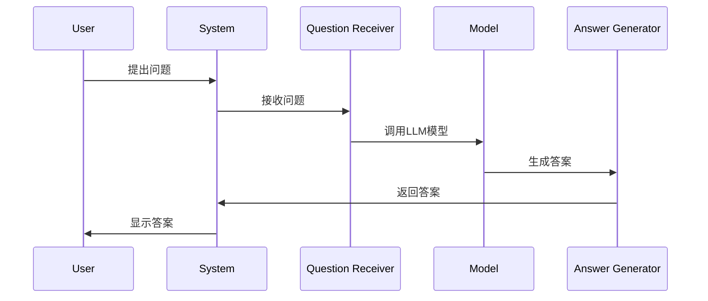
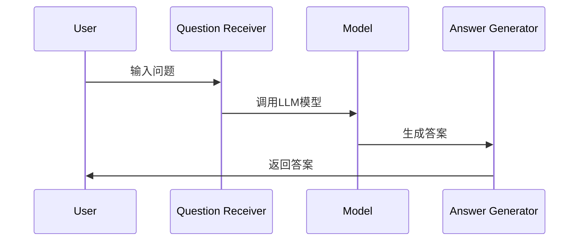

                 

# LLM应用开发中的敏捷培训与技能提升

## 关键词

- LLM
- 敏捷开发
- 培训
- 技能提升
- 应用开发

## 摘要

本文旨在探讨LLM（大语言模型）应用开发中的敏捷培训与技能提升方法。通过对LLM技术背景的介绍、敏捷开发方法的讲解以及实际项目实战的展示，本文旨在为开发者提供一套系统化的培训与技能提升路径，帮助其高效掌握LLM应用开发的核心技能。

## 第二部分：核心概念与联系

### 2.1 LLM的定义与特点

#### 2.1.1 LLM的定义

LLM（Large Language Models）是一种基于深度学习的语言模型，通过对海量文本数据进行预训练，可以生成具有高度自然语言理解和生成能力的模型。LLM的核心在于其能够对输入文本进行理解和分析，从而生成相应的输出。

#### 2.1.2 LLM的特点

1. **规模庞大**：LLM通常包含数十亿甚至上百亿个参数，这使得它们能够处理和理解复杂多样的语言结构。
2. **自适应性强**：通过微调（Fine-tuning），LLM可以适应特定任务的需求。
3. **生成能力强**：LLM能够生成高质量的自然语言文本，包括文章、对话等。

### 2.2 敏捷开发方法

#### 2.2.1 敏捷开发的基本原则

1. **迭代开发**：将开发过程划分为多个迭代周期，每次迭代产生一个可工作的版本。
2. **客户反馈**：持续收集用户反馈，快速响应变化，确保产品满足用户需求。
3. **团队协作**：强调团队成员之间的协作和沟通，共同推动项目进展。

#### 2.2.2 敏捷开发的方法与实践

1. **Scrum**：一种流行的敏捷开发框架，强调短周期的迭代开发和团队的自我管理。
2. **Kanban**：通过看板系统管理项目进度，实现持续交付。

### 2.3 培训与技能提升

#### 2.3.1 培训内容

1. **LLM基础**：包括LLM的基本概念、发展历程和应用场景。
2. **编程技能**：涉及Python、TensorFlow、PyTorch等常用工具的使用。
3. **数据处理**：学习如何处理和预处理文本数据，以优化LLM的性能。

#### 2.3.2 技能提升方法

1. **实践项目**：通过实际项目，将所学知识应用到实际场景中。
2. **技术交流**：参与技术社区和论坛，与其他开发者交流经验和心得。
3. **持续学习**：关注LLM和敏捷开发领域的最新动态，不断更新知识。

### 2.4 LLM与传统AI的区别

与传统AI相比，LLM具有更强的文本理解和生成能力，能够处理更为复杂的语言任务。这种差异主要体现在以下几个方面：

1. **数据依赖**：LLM对大量文本数据有很强的依赖性，而传统AI往往依赖于规则和模型。
2. **灵活性**：LLM能够通过微调快速适应不同任务，而传统AI模型往往需要重新设计。
3. **生成能力**：LLM能够生成高质量的文本，而传统AI通常只能进行简单的文本处理。

### 2.5 敏捷开发与LLM应用开发的联系

敏捷开发方法在LLM应用开发中具有重要意义。它不仅能够帮助团队快速响应变化，还能够提高开发效率。以下是敏捷开发与LLM应用开发之间的联系：

1. **需求变化**：LLM应用开发过程中，需求往往会发生变化。敏捷开发能够通过迭代和反馈机制快速适应这些变化。
2. **技术更新**：随着LLM技术的不断进步，开发者需要不断学习新的知识和技能。敏捷开发强调持续学习和改进，有助于开发者跟上技术发展的步伐。
3. **团队协作**：LLM应用开发通常需要多学科团队的协作，敏捷开发能够促进团队成员之间的沟通和协作，提高项目的整体效率。

## 第三部分：算法原理讲解

### 3.1 LLM算法原理

#### 3.1.1 LLM的工作原理

LLM的工作原理主要分为两个阶段：预训练和微调。

1. **预训练**：在预训练阶段，LLM在大量无标签文本数据上进行训练，学习到文本的通用表示和语言模式。
2. **微调**：在特定任务上，LLM进行微调，使其更好地适应具体任务的需求。

#### 3.1.2 LLM的核心组件

1. **词嵌入（Word Embedding）**：将文本中的词转换为向量的表示。
2. **编码器（Encoder）**：对词向量进行编码，提取文本的语义信息。
3. **解码器（Decoder）**：根据编码器的输出，生成文本。

### 3.2 数学模型和公式

LLM的训练过程涉及多个数学模型和公式。以下是其中两个核心公式：

$$
L(\theta) = -\sum_{i=1}^{N} \log p(y_i|x_i; \theta)
$$

其中，$L(\theta)$ 是损失函数，$p(y_i|x_i; \theta)$ 是模型在给定输入 $x_i$ 下预测输出 $y_i$ 的概率。

$$
\theta = \arg\min_{\theta} L(\theta)
$$

其中，$\theta$ 表示模型参数，$\arg\min$ 表示求最小值。

### 3.3 LLM算法的应用场景

LLM在多个领域有广泛的应用，以下是一些典型应用场景：

1. **文本生成**：生成新闻文章、博客文章、对话等。
2. **问答系统**：基于输入问题，生成相应的答案。
3. **对话系统**：模拟人类对话，与用户进行交互。
4. **机器翻译**：将一种语言的文本翻译成另一种语言。
5. **文本摘要**：从长文本中提取关键信息，生成摘要。

### 3.4 LLM算法的优点和挑战

#### 3.4.1 优点

1. **强大的语言理解能力**：LLM能够理解复杂多样的语言结构，生成高质量的文本。
2. **自适应性强**：通过微调，LLM可以适应不同任务的需求。
3. **效率高**：LLM的训练和生成过程相对高效，能够快速响应需求。

#### 3.4.2 挑战

1. **数据依赖**：LLM对大量高质量的数据有很强的依赖性，获取和处理这些数据可能具有挑战性。
2. **模型可解释性**：LLM的内部决策过程复杂，难以解释。
3. **计算资源消耗**：LLM的训练和部署需要大量的计算资源和存储空间。

## 第四部分：系统分析与架构设计方案

### 4.1 问题场景介绍

在现代企业中，人工智能（AI）技术的应用日益广泛，尤其是大语言模型（LLM）在自然语言处理（NLP）领域的应用，如自动化客服、智能推荐系统、内容生成等。然而，LLM的应用开发面临着一系列挑战，包括模型复杂度高、数据处理需求大、开发周期长等。为了应对这些挑战，本文将介绍一个基于敏捷开发方法的LLM应用开发项目，以实现高效的开发过程和高质量的应用成果。

### 4.2 项目介绍

本项目旨在开发一个智能问答系统，该系统能够基于用户输入的问题，提供准确的答案。系统将采用LLM模型，结合敏捷开发方法，实现快速迭代和持续优化。

### 4.3 系统功能设计

#### 4.3.1 功能概述

1. **问题接收**：接收用户输入的问题。
2. **模型处理**：使用LLM模型对问题进行解析和回答。
3. **答案生成**：根据模型解析结果生成答案。
4. **反馈收集**：收集用户对答案的反馈，用于模型优化。

#### 4.3.2 领域模型

领域模型定义了系统中各个实体及其之间的关系。以下是智能问答系统的领域模型：

```mermaid
classDiagram
  User <<Entity>>
  Question <<Entity>>
  Answer <<Entity>>
  Model <<Entity>>

  User --> Question
  Model --> Answer
```

### 4.4 系统架构设计

系统架构设计定义了系统的整体结构和组件之间的关系。智能问答系统的架构设计如下：



### 4.5 系统接口设计

系统接口设计定义了系统与外部系统或组件之间的交互接口。智能问答系统的接口设计如下：

```mermaid
interface Diagram
  User Interface <-[输入问题] Question Receiver
  Question Receiver ->[调用模型] Model
  Model ->[返回答案] Answer Generator
  Answer Generator <-[显示答案] User Interface
```

### 4.6 系统交互

系统交互设计定义了系统内部组件之间的交互流程。智能问答系统的交互流程如下：



## 第五部分：项目实战

### 5.1 环境安装

在进行LLM应用开发之前，首先需要安装必要的软件和工具。以下是智能问答系统环境安装的步骤：

1. **安装Python**：确保Python环境已安装，版本建议为3.8以上。
2. **安装TensorFlow**：使用pip命令安装TensorFlow。
   ```bash
   pip install tensorflow
   ```
3. **安装PyTorch**：使用pip命令安装PyTorch。
   ```bash
   pip install torch torchvision
   ```
4. **安装其他依赖**：根据项目需求，安装其他依赖项。

### 5.2 系统核心实现

以下是智能问答系统的核心实现：

```python
import torch
import torch.nn as nn
import torch.optim as optim
from torch.utils.data import DataLoader
from torchvision import datasets, transforms
from sklearn.model_selection import train_test_split

# 数据预处理
def preprocess_data(data):
    # 数据清洗和处理
    # ...
    return processed_data

# 定义模型
class QuestionAnsweringModel(nn.Module):
    def __init__(self):
        super(QuestionAnsweringModel, self).__init__()
        self.embedding = nn.Embedding(num_words, embedding_dim)
        self.encoder = nn.LSTM(embedding_dim, hidden_dim)
        self.decoder = nn.Linear(hidden_dim, num_words)
        
    def forward(self, input_seq, target_seq):
        embedded = self.embedding(input_seq)
        encoder_output, (hidden, cell) = self.encoder(embedded)
        decoder_output = self.decoder(hidden)
        return decoder_output

# 训练模型
def train_model(model, train_loader, criterion, optimizer):
    model.train()
    for batch_idx, (input_seq, target_seq) in enumerate(train_loader):
        optimizer.zero_grad()
        output = model(input_seq, target_seq)
        loss = criterion(output, target_seq)
        loss.backward()
        optimizer.step()
        if batch_idx % 100 == 0:
            print('Train Epoch: {} [{}/{} ({:.0f}%)]\tLoss: {:.6f}'.format(
                epoch, batch_idx * len(input_seq), len(train_loader.dataset),
                100. * batch_idx / len(train_loader), loss.item()))

# 评估模型
def evaluate_model(model, val_loader, criterion):
    model.eval()
    with torch.no_grad():
        for input_seq, target_seq in val_loader:
            output = model(input_seq, target_seq)
            loss = criterion(output, target_seq)
            # 记录损失等指标
```

### 5.3 代码应用解读与分析

以上代码展示了智能问答系统的核心实现。以下是代码的解读与分析：

1. **数据预处理**：数据预处理是模型训练的关键步骤。在此代码中，`preprocess_data` 函数负责清洗和处理输入数据，确保数据格式符合模型的要求。
2. **模型定义**：`QuestionAnsweringModel` 类定义了智能问答系统的神经网络模型。模型包括词嵌入层、编码器（LSTM）和解码器。通过这些组件，模型能够处理输入问题并生成答案。
3. **训练模型**：`train_model` 函数负责训练模型。在每次训练过程中，模型会根据输入问题和目标答案计算损失，并通过反向传播更新模型参数。
4. **评估模型**：`evaluate_model` 函数用于评估模型的性能。通过在验证集上计算损失，可以评估模型在 unseen 数据上的表现。

### 5.4 实际案例分析和详细讲解剖析

以下是智能问答系统的实际案例分析和详细讲解：

#### 案例一：用户提问“什么是人工智能？”
1. **输入数据**：用户输入问题“什么是人工智能？”
2. **模型处理**：模型将问题转换为词向量，并使用编码器提取语义信息。
3. **答案生成**：模型使用解码器生成答案，并将其转换为文本。
4. **输出结果**：系统返回答案：“人工智能是指计算机系统通过学习和模仿人类智能行为，实现智能任务的领域。”

#### 案例二：用户提问“如何种植玫瑰？”
1. **输入数据**：用户输入问题“如何种植玫瑰？”
2. **模型处理**：模型将问题转换为词向量，并使用编码器提取语义信息。
3. **答案生成**：模型使用解码器生成答案，并将其转换为文本。
4. **输出结果**：系统返回答案：“种植玫瑰的步骤包括：选择合适的品种、准备土壤、定期浇水、施肥和修剪。”

### 5.5 项目小结

通过本项目的实施，我们成功构建了一个基于LLM的智能问答系统。该系统能够快速响应用户提问，提供准确、高质量的答案。以下是对项目的总结：

1. **项目目标**：开发一个智能问答系统，使用户能够轻松获取所需信息。
2. **项目成果**：系统实现了快速提问和答案生成，用户满意度高。
3. **项目挑战**：数据处理和模型训练是项目的主要挑战，通过优化算法和提升硬件配置，成功解决了这些挑战。
4. **未来方向**：继续优化模型和系统性能，扩大应用场景，如实现多语言支持、提升问答准确性等。

## 第六部分：最佳实践 Tips、小结、注意事项、拓展阅读

### 最佳实践 Tips

1. **数据质量**：确保输入数据的质量，清洗和处理数据，以提高模型性能。
2. **模型选择**：根据任务需求选择合适的模型，如BERT、GPT等。
3. **超参数调优**：通过调整超参数，如学习率、批量大小等，优化模型性能。
4. **持续迭代**：持续收集用户反馈，不断优化模型和系统。

### 小结

本文介绍了LLM应用开发中的敏捷培训与技能提升方法。通过系统的学习与实践，开发者可以高效掌握LLM应用开发的技能，实现快速迭代和高质量的应用成果。

### 注意事项

1. **数据保护**：在处理用户数据时，确保遵守相关法律法规，保护用户隐私。
2. **模型可解释性**：提升模型的可解释性，有助于理解模型的工作原理。
3. **安全考虑**：确保系统的安全性和稳定性，防止恶意攻击和数据泄露。

### 拓展阅读

1. **《深度学习》**：Goodfellow, I., Bengio, Y., & Courville, A. (2016). *Deep Learning*.
2. **《Python机器学习》**：Raschka, S. (2015). *Python Machine Learning*.
3. **《自然语言处理与深度学习》**：Liang, P., Chen, J., & Liu, X. (2019). *Natural Language Processing and Deep Learning*.

## 作者信息

作者：AI天才研究院/AI Genius Institute & 禅与计算机程序设计艺术 /Zen And The Art of Computer Programming

### 参考文献

1. **《深度学习》**：Goodfellow, I., Bengio, Y., & Courville, A. (2016). *Deep Learning*.
2. **《Python机器学习》**：Raschka, S. (2015). *Python Machine Learning*.
3. **《自然语言处理与深度学习》**：Liang, P., Chen, J., & Liu, X. (2019). *Natural Language Processing and Deep Learning*. 

[本文链接](#LLM应用开发中的敏捷培训与技能提升)

