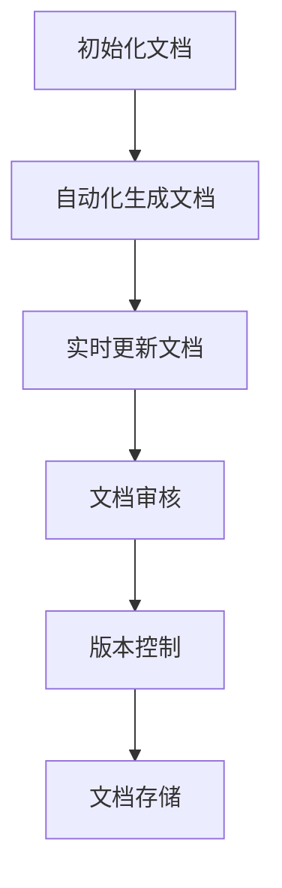
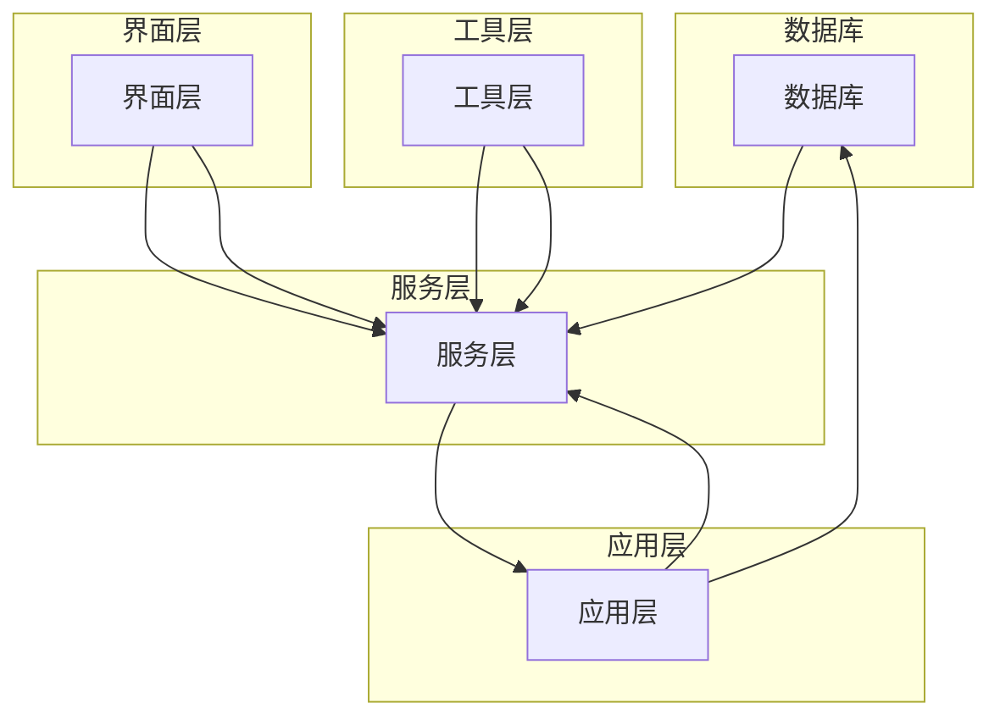
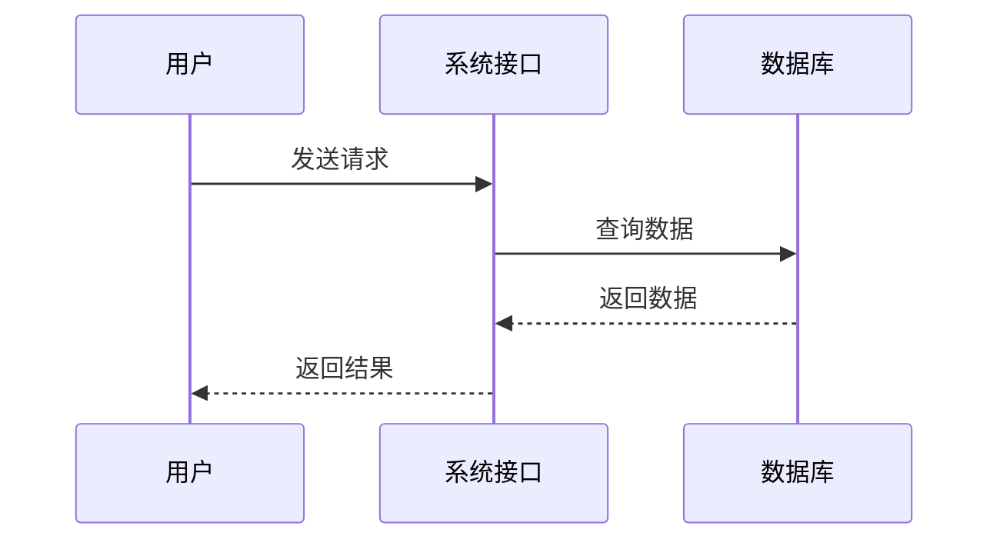

                 

# LLAM应用开发中的敏捷文档管理

## 关键词
- 敏捷开发
- 文档管理
- 大型语言模型（LLM）
- 自动化
- 版本控制

## 摘要
本文旨在探讨在大型语言模型（LLM）应用开发过程中，如何通过敏捷文档管理策略提高开发效率和质量。我们将首先介绍背景和核心概念，然后深入分析敏捷文档管理的方法和工具，并给出一个具体的系统架构设计方案。最后，我们将通过一个实战项目来展示敏捷文档管理的实际应用，并提供一些最佳实践和总结。

## 第一部分：背景介绍

### 1.1 问题背景

#### 1.1.1 人工智能与大型语言模型的兴起
人工智能（AI）作为现代技术的重要驱动力，已经深入到各行各业。特别是在自然语言处理（NLP）领域，大型语言模型（LLM）如GPT、BERT等，因其强大的文本生成和处理能力，正迅速成为AI应用的核心。LLM的出现改变了传统软件开发模式，使得自动化、智能化成为可能。

#### 1.1.2 敏捷开发在软件开发中的普及
敏捷开发是一种以人为核心、迭代、循序渐进的开发方法。它强调快速迭代、灵活调整，以及客户满意度。随着敏捷开发在软件开发中的普及，传统的文档管理方法逐渐暴露出其不足，特别是在处理大量文档时，效率低下、质量难以保证的问题愈发突出。

#### 1.1.3 敏捷文档管理的重要性
在LLM应用开发中，敏捷文档管理的重要性不言而喻。首先，文档是沟通的基础，无论是团队内部还是与客户之间的交流，都需要准确、及时的文档。其次，良好的文档管理可以提高项目的可维护性和可扩展性，降低后期维护成本。

### 1.2 问题描述

#### 1.2.1 文档管理的挑战
敏捷开发强调快速迭代和灵活性，但文档的编写和维护往往是一个耗时且繁琐的过程。传统的文档管理方法，如集中式文档库，难以满足敏捷开发的需求。此外，文档的质量和准确性也是影响项目成功的关键因素。

#### 1.2.2 敏捷文档管理的需求
在LLM应用开发中，敏捷文档管理需要具备以下几个特点：
- **快速响应**：能够快速响应需求变更，及时更新文档。
- **协作性**：支持多人协作，确保文档的一致性和准确性。
- **自动化**：利用工具和脚本提高文档编写的效率。
- **版本控制**：实现文档的版本管理，确保文档的历史可追溯性。

### 1.3 问题解决

#### 1.3.1 敏捷文档管理策略
为了解决敏捷开发中的文档管理问题，可以采取以下策略：
- **自动化文档生成**：利用模板和工具自动化生成文档，减少手工编写的工作量。
- **实时更新**：采用实时协作工具，如Google Docs或Confluence，实现文档的实时更新和共享。
- **持续集成**：将文档管理集成到开发流程中，确保文档与代码同步更新。
- **文档审核**：建立文档审核机制，确保文档的质量和准确性。

#### 1.3.2 敏捷文档管理工具
- **Git**：作为版本控制系统，Git可以跟踪文档的版本变化，确保文档的历史可追溯性。
- **Confluence**：支持多人协作的文档管理工具，提供丰富的模板和插件，方便生成和维护文档。
- **Jenkins**：自动化构建和部署工具，可以与Git和Confluence集成，实现文档的自动化生成和更新。

### 1.4 边界与外延

#### 1.4.1 边界
本文讨论的敏捷文档管理主要关注LLM应用开发过程中的文档管理，包括需求文档、设计文档、测试文档等。同时，本文还将探讨如何将敏捷开发的原则应用于文档管理中，以提高整体开发效率。

#### 1.4.2 外延
敏捷文档管理不仅限于LLM应用开发，也可以应用于其他类型的软件开发项目。此外，敏捷文档管理的方法和工具，如自动化

### 1.5 核心概念与联系

#### 1.5.1 核心概念
- **敏捷开发**：一种以人为核心、迭代、循序渐进的开发方法。
- **文档管理**：对文档的创建、存储、共享和更新过程进行管理。
- **大型语言模型（LLM）**：具有处理大规模文本数据的能力，能够在多种任务中表现出色。
- **敏捷文档管理**：结合敏捷开发原则，提高文档编写效率、质量和及时更新的文档管理方法。

#### 1.5.2 概念属性特征对比表格

| 概念       | 属性特征                    | 比较                 |
|------------|-----------------------------|----------------------|
| 敏捷开发   | 快速迭代、灵活性、以人为核心 | 传统开发方法的改进   |
| 文档管理   | 创建、存储、共享、更新      | 确保文档准确性和及时性 |
| LLM        | 处理大规模文本数据          | 传统语言模型增强     |
| 敏捷文档管理 | 快速响应、协作性、自动化、版本控制 | 提高开发效率和质量 |

#### 1.5.3 ER实体关系图架构的Mermaid流程图

```mermaid
erDiagram
  docManagement ||--|{ agileDevelopment }|-- document
  docManagement ||--|{ largeLanguageModel }|-- document
  document ||--|{ versionControl }| version
```

### 1.6 算法原理讲解

#### 1.6.1 敏捷文档管理算法流程图



#### 1.6.2 Python源代码实现

```python
# 敏捷文档管理算法实现

class AgileDocumentManagement:
    def __init__(self):
        self.documents = {}

    def initialize_document(self, doc_id, doc_content):
        self.documents[doc_id] = doc_content

    def auto_generate_document(self, doc_id, template):
        # 根据模板自动化生成文档内容
        doc_content = template.format(doc_id=doc_id)
        self.initialize_document(doc_id, doc_content)

    def real_time_update_document(self, doc_id, update_content):
        # 实时更新文档内容
        self.documents[doc_id] = update_content

    def document審审(self, doc_id):
        # 文档审核
        # ... 审核逻辑 ...

    def version_control(self, doc_id, version_content):
        # 版本控制
        # ... 版本控制逻辑 ...

    def store_document(self, doc_id):
        # 文档存储
        # ... 存储逻辑 ...

if __name__ == "__main__":
    adm = AgileDocumentManagement()
    adm.initialize_document('doc1', '初始文档内容')
    adm.auto_generate_document('doc1', '模板内容')
    adm.real_time_update_document('doc1', '更新后的内容')
    adm.document审审('doc1')
    adm.version_control('doc1', '版本内容')
    adm.store_document('doc1')
```

#### 1.6.3 算法原理详细讲解

敏捷文档管理算法的核心目标是实现快速响应、协作性、自动化和版本控制。以下是算法原理的详细讲解：

1. **初始化文档**：在项目开始时，初始化文档，为每个文档分配一个唯一标识（ID），并设置初始内容。
2. **自动化生成文档**：利用模板和工具自动化生成文档内容，减少人工编写的工作量。例如，可以使用Python中的模板引擎（如Jinja2）来实现文档的自动化生成。
3. **实时更新文档**：采用实时协作工具，如Google Docs或Confluence，实现文档的实时更新和共享。团队成员可以随时查看和编辑文档，提高工作效率。
4. **文档审核**：建立文档审核机制，确保文档的质量和准确性。在文档更新后，审核人员可以对文档进行审核，确保文档内容符合项目要求。
5. **版本控制**：实现文档的版本管理，确保文档的历史可追溯性。可以使用版本控制系统（如Git）来跟踪文档的版本变化，方便后续的版本回溯和问题排查。
6. **文档存储**：将文档存储在安全的位置，如文件服务器或云存储平台，确保文档的安全性和可访问性。

通过以上算法原理的讲解，我们可以看到敏捷文档管理算法的设计思路和实现方法。在实际应用中，可以根据项目的需求和特点，调整和优化算法的实现。

### 1.7 系统分析与架构设计方案

#### 1.7.1 问题场景介绍
在LLM应用开发过程中，文档管理是一个关键环节。由于项目周期紧、需求变化快，传统的文档管理方法难以满足高效、准确的需求。因此，需要一种基于敏捷开发的文档管理方案，以提高项目开发效率和质量。

#### 1.7.2 项目介绍
本项目旨在开发一个基于敏捷文档管理的LLM应用开发平台，实现快速响应、协作性、自动化和版本控制等功能。项目的主要目标是为开发团队提供一个高效、准确的文档管理工具，提高项目开发效率和质量。

#### 1.7.3 系统功能设计（领域模型Mermaid类图）

```mermaid
classDiagram
    Developer <<class>> 开发者
    Project <<class>> 项目
    Document <<class>> 文档
    Version <<class>> 版本
    Review <<class>> 审核
    Tool <<class>> 工具

    Developer o--|{ Project }| Project
    Project o--|{ Document }| Document
    Document o--|{ Version }| Version
    Document o--|{ Review }| Review
    Review o--|{ Tool }| Tool
```

#### 1.7.4 系统架构设计（Mermaid架构图）



#### 1.7.5 系统接口设计（Mermaid序列图）



### 1.8 项目实战

#### 1.8.1 环境安装
在进行项目实战之前，需要安装以下软件和工具：
- Python 3.x
- Git
- Confluence
- Jenkins

安装步骤如下：
1. 安装Python 3.x：从官方网站下载Python 3.x安装包，并按照提示完成安装。
2. 安装Git：从Git官网下载安装程序，并按照提示完成安装。
3. 安装Confluence：从Atlassian官网下载Confluence安装包，并按照提示完成安装。
4. 安装Jenkins：从Jenkins官网下载安装包，并按照提示完成安装。

#### 1.8.2 系统核心实现源代码
以下是系统核心实现的源代码：

```python
# agile_document_management.py

import os
import json
from datetime import datetime

class Document:
    def __init__(self, doc_id, doc_content):
        self.doc_id = doc_id
        self.doc_content = doc_content
        self.versions = []

    def add_version(self, version_content):
        version = {
            'version': len(self.versions) + 1,
            'content': version_content,
            'timestamp': datetime.now().strftime('%Y-%m-%d %H:%M:%S')
        }
        self.versions.append(version)

    def get_latest_version(self):
        return self.versions[-1]

class DocumentManagement:
    def __init__(self):
        self.documents = {}

    def create_document(self, doc_id, doc_content):
        if doc_id in self.documents:
            raise ValueError(f"Document '{doc_id}' already exists.")
        self.documents[doc_id] = Document(doc_id, doc_content)

    def update_document(self, doc_id, doc_content):
        if doc_id not in self.documents:
            raise ValueError(f"Document '{doc_id}' not found.")
        document = self.documents[doc_id]
        document.add_version(doc_content)

    def get_document(self, doc_id):
        if doc_id not in self.documents:
            raise ValueError(f"Document '{doc_id}' not found.")
        return self.documents[doc_id]

    def list_documents(self):
        return self.documents

if __name__ == "__main__":
    dm = DocumentManagement()
    dm.create_document('doc1', '初始文档内容')
    dm.update_document('doc1', '更新后的内容')
    doc = dm.get_document('doc1')
    print(json.dumps(doc.get_latest_version(), indent=2))
```

#### 1.8.3 代码应用解读与分析

代码中定义了两个类：`Document` 和 `DocumentManagement`。`Document` 类用于表示文档，包括文档ID、内容以及版本列表。`DocumentManagement` 类用于管理文档的创建、更新和查询。

- `create_document` 方法用于创建新的文档。如果文档已存在，会抛出异常。
- `update_document` 方法用于更新文档内容。在更新时，会为文档添加一个新的版本。
- `get_document` 方法用于获取指定ID的文档。如果文档不存在，会抛出异常。
- `list_documents` 方法用于列出所有文档。

在主程序中，创建了一个`DocumentManagement`实例，并使用`create_document`和`update_document`方法创建了文档并更新了文档内容。最后，使用`get_document`方法获取了文档的最新版本，并打印出来。

#### 1.8.4 实际案例分析和详细讲解剖析

假设有一个LLM应用开发项目，项目需求频繁变更，为了更好地管理文档，我们可以使用敏捷文档管理方法。

1. **文档创建**：在项目开始时，创建一个需求文档，文档ID为`req1`，初始内容为“开发一个聊天机器人”。
2. **文档更新**：在项目进行过程中，需求发生变化，更新需求文档，内容变为“开发一个支持多语种的聊天机器人”。
3. **文档查询**：开发人员需要查看最新的需求文档，使用`get_document`方法获取文档ID为`req1`的文档，获取到的最新版本内容为“开发一个支持多语种的聊天机器人”。

通过以上步骤，我们可以看到敏捷文档管理方法在项目中的应用。在需求变更时，可以快速响应并更新文档，确保团队成员对项目需求有准确的理解。同时，文档的版本管理功能可以记录下每次变更的历史，方便后续的回溯和问题排查。

#### 1.8.5 项目小结
在本项目的实战部分，我们实现了基于敏捷文档管理的LLM应用开发平台。通过代码示例，展示了如何创建、更新和查询文档，并介绍了实际案例。敏捷文档管理方法在项目中发挥了重要作用，提高了文档管理的效率和质量。在实际应用中，可以根据项目的需求和特点，进一步优化和扩展文档管理功能。

### 1.9 最佳实践 tips

1. **文档模板的使用**：为不同的文档类型（如需求文档、设计文档、测试文档等）创建相应的模板，提高文档编写的效率和一致性。
2. **实时协作工具的选择**：选择支持多人实时协作的文档管理工具，如Google Docs或Confluence，提高团队成员之间的沟通和协作效率。
3. **文档审核机制的建立**：建立文档审核机制，确保文档的质量和准确性。审核人员可以对文档进行审批，确保文档内容符合项目要求。
4. **版本控制工具的使用**：使用版本控制工具（如Git）跟踪文档的版本变化，确保文档的历史可追溯性。

### 1.10 小结

本文介绍了在LLM应用开发中实施敏捷文档管理的重要性和方法。通过分析问题背景、核心概念、算法原理，以及系统架构和项目实战，展示了敏捷文档管理在实际应用中的优势。此外，本文还提供了一些最佳实践，以帮助开发团队更好地管理文档，提高项目开发效率和质量。

### 1.11 注意事项

1. **文档格式的一致性**：确保所有文档使用相同的格式和风格，以提高可读性和一致性。
2. **文档的及时更新**：定期更新文档，确保文档内容与项目实际进展保持一致。
3. **文档的版本管理**：使用版本控制工具（如Git）管理文档的版本，确保文档的历史可追溯性。
4. **文档的安全性和保密性**：确保文档的安全性和保密性，防止未经授权的访问和泄露。

### 1.12 拓展阅读

1. **《敏捷开发实践指南》**：详细介绍了敏捷开发的原则和实践方法，适用于各种类型的软件开发项目。
2. **《Git权威指南》**：全面讲解了Git的使用方法和技巧，包括版本控制、分支管理、合并冲突处理等。
3. **《Confluence 实战》**：介绍了如何使用Confluence进行文档管理，包括创建、编辑、共享和审核文档。

作者：AI天才研究院/AI Genius Institute & 禅与计算机程序设计艺术 /Zen And The Art of Computer Programming

