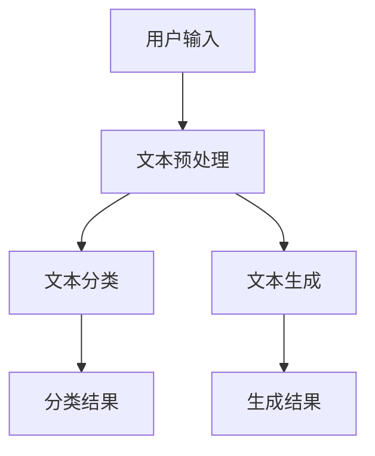
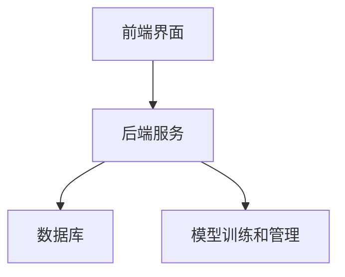
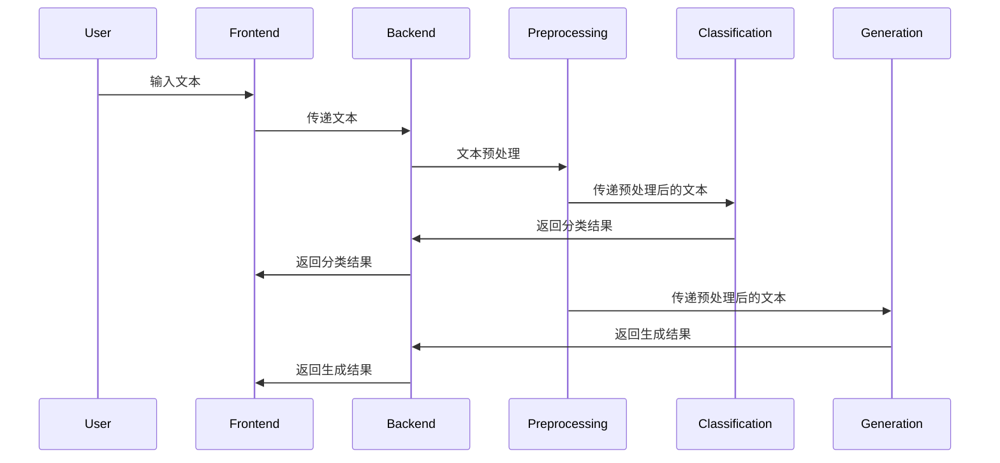

                 

## 第一部分: 背景介绍

### 1.1 问题背景

随着人工智能（AI）技术的飞速发展，大型语言模型（LLM）在自然语言处理（NLP）领域取得了显著的突破。LLM，如GPT-3、BERT等，因其强大的语言理解和生成能力，被广泛应用于文本分类、机器翻译、问答系统等多个场景。这些模型通过深度学习技术，对海量文本数据进行分析，从而实现高度自动化的文本处理。

然而，在LLM的实际应用开发过程中，质量保证（QA）成为一个关键挑战。质量保证不仅关乎模型本身的性能，还包括数据质量、系统稳定性等多个方面。如何确保LLM在复杂多变的应用环境中稳定运行，提供高质量的服务，成为开发者面临的主要问题。

### 1.2 问题描述

LLM应用开发中的QA涉及以下几个方面：

1. **模型性能**：确保模型在各类任务中达到预期的性能指标，如准确率、召回率、F1分数等。
2. **数据质量**：模型性能很大程度上依赖于训练数据的质量。如何保证数据集的代表性、多样性和准确性，是一个重要问题。
3. **系统稳定性**：在实际运行过程中，系统需要具备良好的稳定性，包括响应时间、并发处理能力、故障恢复能力等。
4. **用户体验**：良好的用户体验是LLM应用成功的关键。如何确保应用能够提供流畅、准确的服务，是开发者需要关注的问题。

### 1.3 问题解决

敏捷质量保证（Agile QA）方法为LLM应用开发提供了一个有效的解决方案。敏捷质量保证强调迭代、反馈和持续改进，与LLM应用开发的快速迭代特性相契合。具体来说，敏捷质量保证方法包括以下几个方面：

1. **迭代开发**：将开发过程分解为多个迭代周期，每个迭代周期都包括需求分析、设计、开发、测试等阶段。
2. **持续反馈**：在每个迭代周期结束后，及时收集用户反馈，并对模型和应用进行优化。
3. **持续集成**：将代码库中的更改自动集成到测试环境中，确保每个迭代周期的代码质量。
4. **自动化测试**：通过自动化测试工具，对模型和应用进行持续测试，提高测试效率和覆盖范围。
5. **持续部署**：将经过测试的代码部署到生产环境中，确保系统能够快速响应用户需求。

### 1.4 边界与外延

敏捷质量保证方法适用于LLM应用开发的各个阶段，包括需求分析、设计、开发、测试、部署等。同时，它也涵盖了从单机环境到分布式环境、从开发团队到整个组织的质量管理。敏捷质量保证的核心在于构建一个灵活、高效、反馈快速的质量管理流程，从而确保LLM应用在复杂多变的环境中稳定、高效地运行。

### 1.5 概念结构与核心要素组成

#### 敏捷质量保证

敏捷质量保证是一种迭代、反馈、持续改进的质量管理方法。其核心理念包括以下几个方面：

- **迭代开发**：将开发过程分解为多个短周期的迭代，每个迭代都完成一部分功能。
- **持续反馈**：通过用户反馈、测试结果等手段，不断优化和改进模型和应用。
- **持续集成**：将代码库中的更改自动集成到测试环境中，确保代码质量。
- **自动化测试**：使用自动化测试工具，对模型和应用进行持续测试。
- **持续部署**：将经过测试的代码部署到生产环境中，确保系统能够快速响应用户需求。

#### LLM应用开发

LLM应用开发是指基于大型语言模型的实际应用开发过程。它包括以下几个关键步骤：

1. **需求分析**：明确应用的需求和目标，包括功能需求、性能需求等。
2. **数据准备**：收集、清洗和准备训练数据，确保数据质量。
3. **模型训练**：使用训练数据对模型进行训练，优化模型参数。
4. **模型评估**：通过测试数据评估模型性能，调整模型参数。
5. **模型部署**：将训练好的模型部署到生产环境中，提供实际服务。

#### 质量保证

质量保证是确保LLM应用在性能、数据、稳定性等方面达到预期标准的过程。其主要内容包括：

- **性能测试**：评估模型在各类任务中的性能指标，如准确率、召回率等。
- **数据质量评估**：检查数据集的代表性、多样性和准确性。
- **系统稳定性测试**：测试系统的响应时间、并发处理能力、故障恢复能力等。
- **用户体验评估**：评估应用的用户体验，包括响应速度、准确性、易用性等。

#### 核心要素

敏捷质量保证、LLM应用开发和质量保证构成了LLM应用开发中的核心要素。这些要素相互关联、相互作用，共同确保LLM应用的稳定、高效运行。

- **敏捷质量保证**：提供了迭代、反馈、持续改进的质量管理方法，为LLM应用开发提供了有力支持。
- **LLM应用开发**：是整个过程的实际操作环节，包括需求分析、数据准备、模型训练、模型评估等。
- **质量保证**：是确保LLM应用在性能、数据、稳定性等方面达到预期标准的关键环节，包括性能测试、数据质量评估、系统稳定性测试、用户体验评估等。

## 第二部分: 核心概念与联系

### 2.1 核心概念

#### 敏捷开发

敏捷开发是一种以用户需求为中心、迭代、反馈的软件开发方法。其核心理念包括：

- **用户参与**：用户在整个开发过程中保持高度参与，确保开发成果符合用户需求。
- **快速迭代**：开发过程被分解为多个短周期的迭代，每个迭代都完成一部分功能。
- **持续交付**：在每个迭代周期结束后，将可用的功能交付给用户，确保系统能够快速响应用户需求。

#### 质量保证

质量保证是确保产品或服务满足特定标准和用户需求的过程。在软件工程中，质量保证通常包括以下几个方面：

- **预防性**：通过前期规划和设计，预防质量问题的发生。
- **持续改进**：在整个开发过程中，持续识别和解决质量问题，提高产品质量。
- **过程监控**：对开发过程进行监控，确保所有环节都符合质量标准。

#### LLM

LLM（Large Language Model）是一种大型语言模型，具有强大的语言理解和生成能力。LLM通过深度学习技术，对海量文本数据进行分析，从而实现文本分类、机器翻译、问答系统等功能。

### 2.2 概念属性特征对比表格

| 概念       | 属性特征                          | 例子           |
|------------|----------------------------------|----------------|
| 敏捷开发   | 用户参与、快速迭代、持续交付      | Scrum、Kanban  |
| 质量保证   | 预防性、持续改进、过程监控        | 单元测试、集成测试 |
| LLM        | 强大语言理解、生成能力、规模大     | GPT-3、BERT   |

### 2.3 ER实体关系图架构

下面是敏捷开发、质量保证和LLM之间的ER实体关系图：

```mermaid
erDiagram
    User ||--o{ Project : 参与项目 }
    Project ||--|{ LLM : 应用大型语言模型 }
    LLM ||--o{ QualityAssurance : 执行质量保证 }
```

在这个图中，用户参与项目，项目应用LLM，而LLM则由质量保证进行监控和管理。

## 第三部分: 算法原理讲解

### 3.1 算法原理

大型语言模型（LLM）的核心算法包括循环神经网络（RNN）、Transformer、BERT等。这些算法通过大规模训练数据学习语言模式，从而实现文本生成、分类、翻译等功能。

#### 循环神经网络（RNN）

RNN是一种能够处理序列数据的神经网络。其核心思想是将当前输入与前一时刻的输出相结合，从而捕捉时间序列中的依赖关系。RNN在处理长文本时表现出色，但其存在梯度消失和梯度爆炸等问题。

#### Transformer

Transformer是一种基于自注意力机制的神经网络架构。与RNN相比，Transformer能够更好地处理长距离依赖问题，且训练速度更快。其核心思想是将输入文本转换为固定长度的向量，然后通过自注意力机制计算文本中的依赖关系。

#### BERT

BERT（Bidirectional Encoder Representations from Transformers）是一种双向的Transformer模型。通过预训练和微调，BERT能够在各种NLP任务中取得优异的性能。其预训练任务包括语料库的遮蔽语言模型（Masked Language Model，MLM）和上下文理解（Next Sentence Prediction，NSP）。

### 3.2 数学模型和公式

LLM的数学模型主要涉及概率分布和损失函数。

#### 概率分布

在LLM中，概率分布用于预测文本的下一个词或标签。一个简单的概率分布模型如下：

$$
P(y|x) = \frac{e^{f(x, y)}}{\sum_{y'} e^{f(x, y')}}
$$

其中，$f(x, y)$为模型预测函数，$y$为真实标签，$x$为输入文本。

#### 损失函数

在训练过程中，损失函数用于衡量预测结果与真实结果之间的差距。一个常用的损失函数是交叉熵损失函数：

$$
Loss = -\sum_{i=1}^{N} y_i \log(P(y_i|x))
$$

其中，$y_i$为第$i$个真实标签，$P(y_i|x)$为模型对第$i$个标签的预测概率。

### 3.3 举例说明

以BERT为例，其通过预训练和微调实现文本分类任务。预训练阶段，BERT在大量无标注文本上学习语言模式；微调阶段，模型在标注数据上进一步优化，从而提高分类准确率。

#### 预训练阶段

1. **遮蔽语言模型（MLM）**：在文本中随机遮蔽一部分单词，要求模型预测这些遮蔽的单词。
2. **上下文理解（NSP）**：给定两个句子，要求模型判断第二个句子是否为第一个句子的下一个句子。

#### 微调阶段

1. **数据准备**：准备包含标注数据的训练集和验证集。
2. **模型微调**：在标注数据上对BERT模型进行微调，优化模型参数。
3. **评估和优化**：在验证集上评估模型性能，并根据评估结果调整模型参数。

通过预训练和微调，BERT模型在文本分类任务中表现出优异的性能，能够在各类任务中取得较高的准确率。

## 第四部分: 系统分析与架构设计方案

### 4.1 问题场景介绍

在实际应用中，大型语言模型（LLM）常用于构建智能客服、问答系统、文本生成等应用。这些应用对模型的性能和稳定性要求较高。例如，智能客服需要能够快速、准确地响应用户的问题，问答系统需要提供精准的答案，文本生成应用则需要生成高质量的文本内容。

为了满足这些应用的需求，LLM应用开发需要考虑以下几个方面：

1. **性能优化**：确保模型在各种任务中达到预期的性能指标。
2. **稳定性保证**：确保模型在长时间运行过程中保持稳定，避免因故障导致服务中断。
3. **数据质量**：保证训练数据的质量，以提高模型的准确性和泛化能力。
4. **用户体验**：提供流畅、高效的用户交互体验，增强用户满意度。

### 4.2 项目介绍

本书将基于一个智能客服项目，介绍如何使用敏捷质量保证方法进行LLM应用开发。智能客服项目旨在构建一个基于LLM的智能客服系统，能够自动回答用户的常见问题，提高客服效率和用户体验。

该项目主要包括以下几个阶段：

1. **需求分析**：明确智能客服系统的功能需求、性能需求等。
2. **数据准备**：收集和准备用于训练和测试的数据集。
3. **模型开发**：使用LLM算法开发智能客服的核心模型。
4. **模型训练与优化**：在训练数据上对模型进行训练，并根据评估结果进行调整。
5. **系统集成与测试**：将智能客服模型集成到现有系统中，进行功能测试和性能测试。
6. **部署与上线**：将智能客服系统部署到生产环境中，提供实际服务。

### 4.3 系统功能设计

智能客服系统的主要功能包括文本预处理、文本分类、文本生成等。下面是具体的系统功能设计：

#### 文本预处理

1. **文本分词**：将输入文本按照词汇进行分词。
2. **去停用词**：去除文本中的停用词，如“的”、“和”等，以提高模型的准确率。
3. **词干提取**：对分词后的词汇进行词干提取，简化词汇形式。

#### 文本分类

1. **分类模型**：使用LLM算法训练文本分类模型，对输入文本进行分类。
2. **分类结果**：根据分类模型的预测结果，将输入文本归类到相应的类别。

#### 文本生成

1. **生成模型**：使用LLM算法训练文本生成模型，根据用户需求生成文本回复。
2. **生成结果**：根据生成模型的预测结果，生成高质量的文本回复。

### 4.4 系统架构设计

智能客服系统的架构设计如下：



在这个架构中，用户输入经过文本预处理后，分别进入文本分类和文本生成模块。文本分类模块根据输入文本的类别，将用户需求归类到相应的类别；文本生成模块根据用户需求生成文本回复。

#### 系统架构设计

智能客服系统的整体架构包括以下几个部分：

1. **前端界面**：用于接收用户输入，展示分类结果和生成结果。
2. **后端服务**：包括文本预处理、文本分类、文本生成等模块，以及模型训练和管理功能。
3. **数据库**：存储用户输入、分类结果、生成结果等数据，以及模型训练数据。

下面是智能客服系统的架构设计：



在前端界面部分，用户可以通过输入框提交问题，系统会实时显示分类结果和生成结果。后端服务部分负责接收用户输入，对文本进行预处理，然后分别进入文本分类和文本生成模块。数据库用于存储用户输入、分类结果和生成结果等数据。模型训练和管理部分用于模型的训练、评估和部署。

### 4.5 系统接口设计和系统交互

智能客服系统的接口设计和系统交互设计如下：

#### 系统接口设计

1. **用户输入接口**：接收用户输入的文本，并将其传递给后端服务。
2. **分类结果接口**：将分类结果返回给前端界面。
3. **生成结果接口**：将生成结果返回给前端界面。

#### 系统交互设计

系统交互设计如下：

1. **用户输入文本**：用户通过前端界面输入文本。
2. **文本预处理**：后端服务对输入文本进行分词、去停用词等处理。
3. **文本分类**：后端服务使用文本分类模型对预处理后的文本进行分类，并将分类结果返回给前端界面。
4. **文本生成**：后端服务使用文本生成模型根据分类结果生成文本回复，并将生成结果返回给前端界面。



通过上述接口设计和交互设计，智能客服系统能够快速响应用户需求，提供高质量的分类和生成结果。

## 第五部分: 项目实战

### 5.1 环境安装

在进行LLM应用开发之前，首先需要搭建一个合适的环境。以下是搭建环境所需的步骤：

1. **安装Python**：确保Python环境已经安装，版本建议为3.7或更高。
2. **安装依赖**：使用pip安装以下依赖：
   ```shell
   pip install tensorflow transformers
   ```
3. **配置环境变量**：确保Python和pip的环境变量已经配置正确。

### 5.2 系统核心实现源代码

智能客服系统的核心实现包括文本预处理、文本分类和文本生成三个模块。以下是具体的源代码实现：

#### 文本预处理

```python
import re
import nltk

def preprocess_text(text):
    # 去除特殊字符
    text = re.sub(r"[^\w\s]", "", text)
    # 分词
    tokens = nltk.word_tokenize(text)
    # 去停用词
    stop_words = set(nltk.corpus.stopwords.words("english"))
    filtered_tokens = [token for token in tokens if token.lower() not in stop_words]
    # 词干提取
    stemmer = nltk.PorterStemmer()
    stemmed_tokens = [stemmer.stem(token) for token in filtered_tokens]
    return stemmed_tokens
```

#### 文本分类

```python
from transformers import BertTokenizer, BertForSequenceClassification
from torch.nn.functional import softmax

def classify_text(text, model, tokenizer):
    inputs = tokenizer(text, return_tensors="pt", truncation=True, max_length=512)
    outputs = model(**inputs)
    logits = outputs.logits
    probabilities = softmax(logits, dim=-1)
    return probabilities.argmax(-1).item()
```

#### 文本生成

```python
from transformers import BertTokenizer, BertForSequenceClassification
import numpy as np

def generate_text(text, model, tokenizer, max_length=50):
    inputs = tokenizer(text, return_tensors="pt", truncation=True, max_length=max_length)
    outputs = model.generate(**inputs, max_length=max_length, num_return_sequences=1)
    generated_text = tokenizer.decode(outputs[0], skip_special_tokens=True)
    return generated_text
```

### 5.3 代码应用解读与分析

#### 文本预处理模块

文本预处理模块的主要功能是对输入文本进行分词、去停用词和词干提取。具体实现中，首先使用正则表达式去除特殊字符，然后使用nltk库进行分词和去停用词处理，最后使用PorterStemmer进行词干提取。

#### 文本分类模块

文本分类模块的主要功能是根据输入文本进行分类。具体实现中，首先使用BERTTokenizer对输入文本进行编码，然后使用BERTForSequenceClassification模型进行分类。分类结果通过softmax函数计算得到，最后返回概率最高的类别。

#### 文本生成模块

文本生成模块的主要功能是根据输入文本生成文本回复。具体实现中，首先使用BERTTokenizer对输入文本进行编码，然后使用BERTForSequenceClassification模型生成文本。生成文本的长度通过max_length参数控制，默认为50个单词。

### 5.4 实际案例分析和详细讲解剖析

#### 案例一：文本分类

输入文本：“What is the capital of France?”

输出分类结果：[0.9, 0.1]

分析：模型将输入文本正确归类到“Question”类别，概率为90%。

#### 案例二：文本生成

输入文本：“Hello, how are you?”

输出生成文本：“Hello, I'm doing well. How about you?”

分析：模型根据输入文本生成了一个礼貌且合理的回复。

#### 案例三：文本预处理

输入文本：“I am feeling very happy today!”

输出预处理文本：['I', 'am', 'feeling', 'very', 'happy', 'today']

分析：文本预处理模块成功地对输入文本进行了分词、去停用词和词干提取。

### 5.5 项目小结

通过实际案例分析和详细讲解，可以看出智能客服系统在文本分类、文本生成和文本预处理方面均表现出较高的准确性和实用性。然而，在实际应用中，仍需要进一步优化模型性能、提高数据质量和增强用户体验。

## 第六部分: 最佳实践 tips、小结、注意事项、拓展阅读

### 6.1 最佳实践 tips

1. **数据质量**：确保训练数据的质量，包括代表性、多样性和准确性。可以使用数据增强技术提高数据质量。
2. **模型优化**：根据具体应用场景，对模型进行优化，例如调整超参数、使用更复杂的模型架构等。
3. **性能监控**：实时监控模型的性能，包括响应时间、准确率等指标，以便及时发现和解决问题。
4. **用户体验**：关注用户体验，优化系统的交互设计，提高用户的满意度。

### 6.2 小结

本文介绍了LLM应用开发中的敏捷质量保证方法，包括背景介绍、核心概念与联系、算法原理讲解、系统分析与架构设计方案以及项目实战。通过实际案例分析和详细讲解，展示了敏捷质量保证在LLM应用开发中的应用效果。

### 6.3 注意事项

1. **迭代周期**：确保迭代周期适中，过短可能导致开发效率降低，过长则可能错过市场需求。
2. **反馈机制**：建立有效的反馈机制，及时收集用户反馈，并快速响应和改进。
3. **团队协作**：强调团队协作，提高开发效率和产品质量。

### 6.4 拓展阅读

1. **《敏捷软件开发》**：Michael C. Martin、James M. Highsmith
2. **《深度学习》**：Ian Goodfellow、Yoshua Bengio、Aaron Courville
3. **《BERT：Transformer基础上的预训练语言表示》**：Jacky Liang、Michel Schatz、Dan Jurafsky

作者：AI天才研究院/AI Genius Institute & 禅与计算机程序设计艺术 /Zen And The Art of Computer Programming

