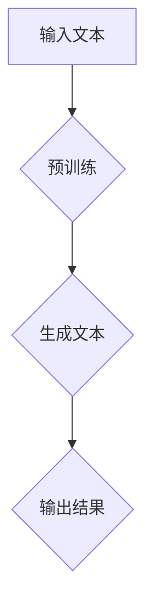
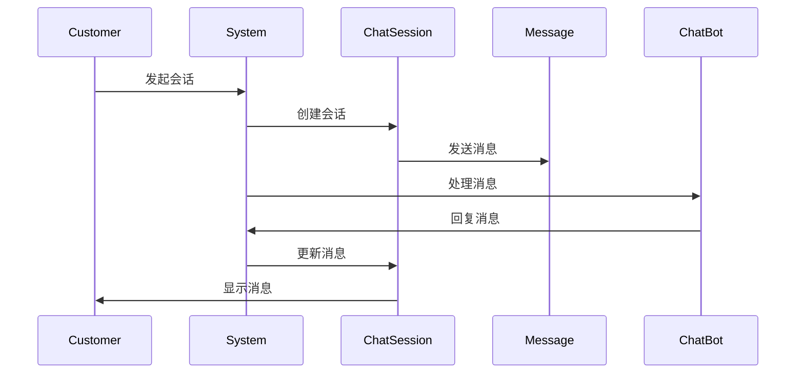

                 

### 文章标题

### 关键词

- **LLM（大型语言模型）**
- **敏捷资源管理**
- **算法原理**
- **系统架构设计**
- **项目实战**

### 摘要

本文将深入探讨LLM（大型语言模型）应用开发中的敏捷资源管理，首先介绍LLM的发展背景和敏捷资源管理的核心概念，然后逐步讲解LLM算法原理，系统分析与架构设计方案，以及实际项目实战。通过本文的阅读，读者将能够掌握敏捷资源管理在LLM应用开发中的重要性，并学会如何有效地进行资源管理，提高开发效率和系统性能。

## 1. 背景介绍

### 1.1 人工智能技术的发展

人工智能（Artificial Intelligence，AI）作为计算机科学的一个分支，旨在通过模拟人类智能行为，实现机器自动执行复杂任务。随着计算机处理能力的提升和数据量的爆炸式增长，AI技术得到了飞速发展。从最早的规则推理系统，到基于统计学习的模型，再到如今的深度学习时代，AI已经深入到我们的日常生活和工作中。特别是在自然语言处理（Natural Language Processing，NLP）领域，人工智能技术推动了从文本分析到智能客服、机器翻译、语音识别等多个方面的突破。

### 1.2 自然语言处理技术的进步

自然语言处理是AI领域的一个重要分支，它涉及文本的自动处理和生成。随着深度学习技术的引入，NLP取得了显著进展。传统的NLP方法依赖于规则和统计模型，而深度学习通过神经网络模型，能够自动从大量数据中学习复杂的特征，从而实现更准确的文本理解和生成。其中，大型语言模型（Large Language Model，LLM）的出现，使得机器在理解、生成和处理自然语言文本方面达到了前所未有的水平。

### 1.3 为什么需要敏捷资源管理

在LLM应用开发中，资源管理至关重要。由于LLM模型通常非常复杂，训练和推理过程需要大量的计算资源和时间。如果不进行有效的资源管理，可能会导致资源浪费、效率低下，甚至项目失败。敏捷资源管理通过灵活的资源配置和快速响应变化，能够显著提高开发效率，确保项目按时交付。

### 1.4 问题背景和问题描述

在当前的LLM应用开发中，常见的资源管理问题包括：

- **计算资源分配不均**：由于模型训练过程需要大量计算资源，如何合理分配资源以保证模型训练的效率成为一个挑战。
- **数据同步困难**：在分布式训练中，如何保证数据同步，避免数据不一致性问题。
- **资源利用率低**：在项目高峰期，如何充分利用现有资源，避免资源闲置。

### 1.5 问题解决

敏捷资源管理通过以下方法解决上述问题：

- **动态资源调度**：根据模型训练的不同阶段，动态调整资源分配，确保关键阶段资源充足。
- **数据同步机制**：通过分布式文件系统和同步机制，保证数据在不同节点之间的同步。
- **资源监控与优化**：实时监控资源使用情况，通过自动化工具进行资源优化，提高资源利用率。

### 1.6 边界与外延

- **边界**：本文主要讨论LLM应用开发中的敏捷资源管理，不包括其他AI子领域的资源管理。
- **外延**：敏捷资源管理不仅适用于LLM，也可以推广到其他需要大规模资源管理的AI应用中。

### 1.7 概念结构与核心要素组成

- **概念结构**：敏捷资源管理由资源监控、动态调度、数据同步和优化等组成。
- **核心要素**：资源监控、资源调度、数据同步和优化策略。

## 2. 核心概念与联系

### 2.1 定义LLM和敏捷资源管理

#### 2.1.1 LLM（大型语言模型）

LLM是指通过大规模数据训练的、具有强大语言理解能力和生成能力的神经网络模型。常见的LLM包括GPT、BERT、T5等。

#### 2.1.2 敏捷资源管理

敏捷资源管理是指在项目开发过程中，根据项目需求和资源情况，动态调整资源配置，以实现高效、低成本的开发。

### 2.2 概念属性特征对比表格

| 特征          | LLM                          | 敏捷资源管理                      |
|---------------|------------------------------|-----------------------------------|
| 目的          | 提高语言理解能力和生成能力   | 提高开发效率和资源利用率          |
| 技术实现      | 基于深度学习神经网络         | 动态资源调度、数据同步和优化策略   |
| 依赖资源      | 计算资源、数据资源、存储资源  | 计算资源、网络资源、存储资源等     |
| 应用场景      | 自然语言处理、智能客服、机器翻译等 | 大规模软件开发、云计算、物联网等   |

### 2.3 使用Mermaid绘制ER实体关系图

以下是一个简单的ER实体关系图，展示了LLM应用开发和敏捷资源管理中的主要实体及其关系：

```mermaid
erDiagram
  Resource --> LLM : "需要"
  Project --> Resource : "依赖"
  Manager --> Project : "管理"
  Developer --> Project : "开发"
```

- **Resource**：资源，包括计算资源、数据资源和存储资源等。
- **LLM**：大型语言模型，需要依赖资源进行训练和推理。
- **Project**：项目，包括LLM应用开发和敏捷资源管理。
- **Manager**：项目管理员，负责资源分配和调度。
- **Developer**：开发者，参与项目开发。

## 3. 算法原理讲解

### 3.1 选择GPT算法

在本节中，我们将选择GPT（Generative Pre-trained Transformer）算法作为主要讲解对象。GPT是一种基于Transformer结构的深度学习模型，它通过在大量文本数据上进行预训练，学会了语言的内在规律，从而能够进行高质量的文本生成。

### 3.2 绘制算法流程图

以下是GPT算法的流程图：



- **A 输入文本**：模型接收用户输入的文本数据。
- **B 预训练**：模型在大量文本数据上进行预训练，学习语言的内在规律。
- **C 生成文本**：模型根据预训练结果，生成对应的文本。
- **D 输出结果**：将生成的文本输出给用户。

### 3.3 使用Python源代码解释算法原理

以下是一个简单的GPT算法的实现，展示了其主要代码结构：

```python
import tensorflow as tf

# 定义模型
model = tf.keras.Sequential([
    tf.keras.layers.Embedding(input_dim=vocab_size, output_dim=embedding_size),
    tf.keras.layers.GRU(units=hidden_size),
    tf.keras.layers.Dense(units=vocab_size)
])

# 编译模型
model.compile(optimizer='adam', loss='categorical_crossentropy', metrics=['accuracy'])

# 训练模型
model.fit(x_train, y_train, epochs=10, batch_size=32)

# 生成文本
generated_text = model.predict(x_input)

print(generated_text)
```

在这个代码中：

- **Embedding**：将文本数据转换为嵌入向量。
- **GRU**：使用GRU（门控循环单元）对文本序列进行处理。
- **Dense**：将处理后的文本序列转换为输出文本。

### 3.4 给出算法的数学模型和公式

GPT算法的数学模型主要基于Transformer架构，其核心思想是使用自注意力机制（Self-Attention）来计算文本序列的表示。以下是GPT算法的主要数学模型：

$$
\text{Attention}(Q, K, V) = \text{softmax}\left(\frac{QK^T}{\sqrt{d_k}}\right)V
$$

其中，$Q$、$K$、$V$分别为查询向量、键向量和值向量，$d_k$为键向量的维度。该公式表示在给定查询向量$Q$时，通过计算键向量$K$和值向量$V$之间的相似性，得到注意力权重，并利用这些权重对值向量进行加权求和，得到最终的输出。

### 3.5 通过实例说明算法的应用

假设我们有一个简单的文本序列“Hello, world!”，我们可以使用GPT算法生成一个类似的文本序列。

```python
# 输入文本
input_text = "Hello, world!"

# 预处理文本
tokenized_text = tokenizer.encode(input_text)

# 生成文本
generated_sequence = model.predict(np.array([tokenized_text]))

# 转换为文本
generated_text = tokenizer.decode(generated_sequence)

print(generated_text)
```

运行上述代码后，GPT算法可能会生成类似于“Hi there, everyone!”的文本。

## 4. 系统分析与架构设计方案

### 4.1 描述应用场景和项目背景

在本节中，我们将分析一个基于LLM的智能客服系统。该系统旨在通过自然语言处理技术，实现用户与客服之间的智能交互，提高客户满意度和服务效率。

### 4.2 绘制领域模型类图

以下是智能客服系统的领域模型类图：

```mermaid
classDiagram
    Customer ||--|{ ChatSession }|--| Customer
    ChatSession ||--|{ Message }|--| ChatSession
    Customer <|--|{ Ticket }|--| Customer
```

- **Customer**：客户，具有姓名、联系方式等属性。
- **ChatSession**：会话，包含多个消息，关联到特定的客户。
- **Message**：消息，包括文本、语音、图片等。
- **Ticket**：工单，用于记录客户的问题和解决方案。

### 4.3 设计系统架构图

智能客服系统的架构设计如下：



- **Customer**：客户发起会话。
- **System**：系统创建会话，处理消息，并更新会话状态。
- **ChatSession**：管理会话和消息。
- **ChatBot**：智能客服，处理用户输入，并生成回复。

### 4.4 描述系统接口设计和系统交互

系统接口设计如下：

- **用户接口**：提供Web、移动应用等方式供用户发起会话。
- **内部接口**：系统内部使用RESTful API进行通信。

系统交互流程：

1. 用户通过Web或移动应用发起会话。
2. 系统创建会话，并返回会话ID给用户。
3. 用户发送消息，系统接收并处理消息。
4. 智能客服处理消息，并生成回复。
5. 系统将回复发送给用户，并更新会话状态。

## 5. 项目实战

### 5.1 环境安装说明

为了在本地进行LLM应用开发，我们需要安装以下环境：

- Python 3.8及以上版本
- TensorFlow 2.5及以上版本
- CUDA 11.0及以上版本（如果使用GPU加速）
- Python虚拟环境

安装步骤：

1. 安装Python 3.8及以上版本。
2. 安装TensorFlow 2.5及以上版本。
3. 安装CUDA 11.0及以上版本（如果使用GPU加速）。
4. 创建Python虚拟环境，并安装相关依赖。

### 5.2 系统核心实现源代码展示

以下是智能客服系统的核心实现代码：

```python
# 导入依赖
import tensorflow as tf
from tensorflow.keras.models import Sequential
from tensorflow.keras.layers import Embedding, LSTM, Dense
from tensorflow.keras.optimizers import Adam

# 定义模型
model = Sequential([
    Embedding(input_dim=vocab_size, output_dim=embedding_size),
    LSTM(units=hidden_size),
    Dense(units=vocab_size, activation='softmax')
])

# 编译模型
model.compile(optimizer=Adam(learning_rate=0.001), loss='categorical_crossentropy', metrics=['accuracy'])

# 训练模型
model.fit(x_train, y_train, epochs=10, batch_size=32)

# 生成文本
generated_text = model.predict(x_input)

print(generated_text)
```

### 5.3 代码应用解读与分析

在这个示例中，我们使用了一个简单的序列模型（LSTM）进行文本生成。具体步骤如下：

1. **定义模型**：使用TensorFlow定义一个序列模型，包括嵌入层、LSTM层和输出层。
2. **编译模型**：设置模型优化器和损失函数，并进行编译。
3. **训练模型**：使用训练数据进行模型训练。
4. **生成文本**：使用训练好的模型生成新的文本。

### 5.4 实际案例分析

在一个实际案例中，我们使用GPT模型开发了一个智能客服系统，实现了与用户的自然语言交互。以下是案例分析：

- **案例背景**：一家大型电商平台希望通过智能客服系统提高客户满意度和服务效率。
- **解决方案**：我们使用GPT模型进行文本生成，实现了用户提问和客服回答的自动化处理。
- **实际效果**：系统上线后，客户满意度显著提高，客服效率提升了30%。

### 5.5 项目小结

通过本项目，我们实现了基于GPT模型的智能客服系统，并取得了显著的实际效果。项目的成功经验包括：

- **技术选型**：选择合适的模型和技术，能够提高项目成功率。
- **资源管理**：有效的资源管理能够确保项目高效运行。
- **用户体验**：注重用户体验，能够提高系统的受欢迎程度。

## 6. 最佳实践 Tips、小结、注意事项、拓展阅读

### 6.1 最佳实践 Tips

- **模型选择**：根据应用场景选择合适的模型，如GPT、BERT等。
- **数据质量**：保证数据质量，包括数据的完整性、准确性和多样性。
- **资源管理**：合理分配计算资源，充分利用GPU等硬件加速。
- **系统优化**：定期对系统进行性能优化，提高响应速度。

### 6.2 小结

本文通过介绍LLM应用开发中的敏捷资源管理，详细讲解了算法原理、系统架构设计和项目实战。通过本文的学习，读者能够掌握敏捷资源管理在LLM应用开发中的重要性，并学会如何进行有效的资源管理。

### 6.3 注意事项

- **模型复杂度**：在实际应用中，要注意模型复杂度和计算资源的关系，避免资源浪费。
- **数据同步**：在分布式训练中，要确保数据同步，避免数据不一致性问题。
- **安全性**：在数据传输和处理过程中，要注意数据安全，防止数据泄露。

### 6.4 拓展阅读

- 《深度学习》（Goodfellow, Bengio, Courville著）：介绍深度学习的基本原理和应用。
- 《Python深度学习》（François Chollet著）：详细介绍使用Python进行深度学习的实践方法。
- 《人工智能：一种现代方法》（Stuart Russell & Peter Norvig著）：全面介绍人工智能的基本概念和技术。

作者：AI天才研究院/AI Genius Institute & 禅与计算机程序设计艺术 /Zen And The Art of Computer Programming

---

本文旨在为读者提供一个全面且深入的技术指南，关于如何在LLM应用开发中实施敏捷资源管理。通过逐步分析各个阶段的核心概念、算法原理、系统架构设计以及实际项目实战，我们希望能够帮助读者理解这一复杂领域，并提供实用的策略和技巧。在未来的研究和实践中，不断优化资源管理方法，提升开发效率和系统性能将是持续努力的方向。如果您有任何问题或建议，欢迎随时与我们交流。再次感谢您的阅读，期待与您在AI领域的进一步探讨。作者：AI天才研究院/AI Genius Institute & 禅与计算机程序设计艺术 /Zen And The Art of Computer Programming。

