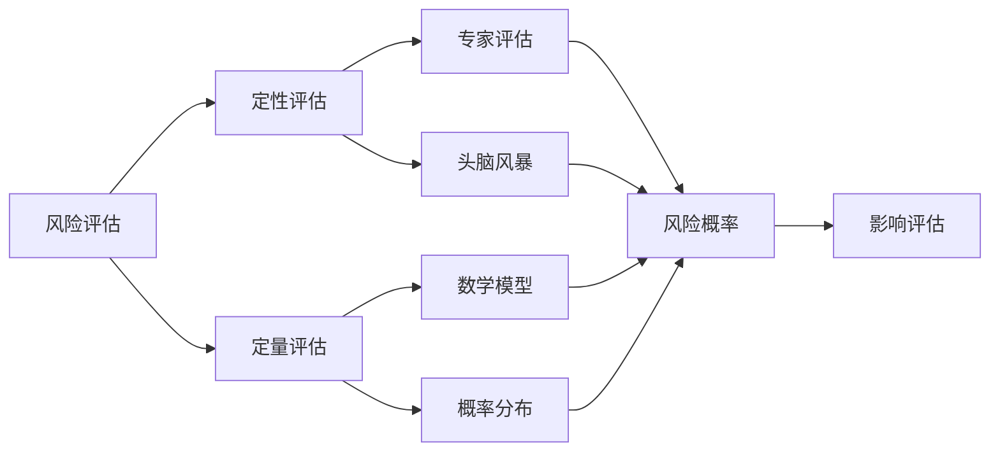
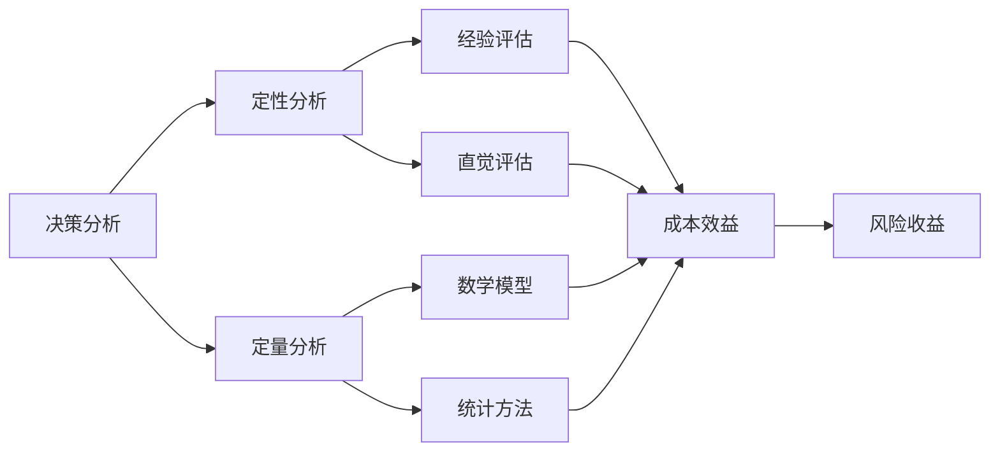

                 

## LLAM 应用开发中的风险管理与快速决策

### 关键词：LLM应用、风险管理、快速决策、人工智能、AI大模型

### 摘要：

本文将深入探讨LLM（大型语言模型）应用开发中的风险管理与快速决策。随着AI技术的迅猛发展，LLM在自然语言处理、智能客服、智能推荐等领域得到了广泛应用。然而，这一过程中也伴随着诸多风险，如何进行有效的风险管理和快速决策成为关键问题。本文将详细介绍LLM应用开发中的核心概念，风险管理方法与实践，快速决策机制及其应用，并通过案例研究总结最佳实践，为读者提供全面的指导。

### 目录

1. 第一部分：问题背景与核心概念  
   1.1 问题背景  
   1.2 核心概念  
   1.3 概念关系图

2. 第二部分：风险管理方法与实践  
   2.1 风险评估与量化  
   2.2 风险控制策略  
   2.3 风险监测与预警  
   2.4 风险控制案例

3. 第三部分：快速决策机制  
   3.1 决策分析与评估  
   3.2 快速决策流程  
   3.3 应急决策与应对

4. 第四部分：综合应用与实践  
   4.1 案例研究  
   4.2 最佳实践与建议

5. 附录  
   5.1 相关术语解释  
   5.2 参考文献

---

### 1. 第一部分：问题背景与核心概念

#### 1.1 问题背景

随着人工智能技术的不断发展，尤其是大型语言模型（LLM）的出现，AI应用在自然语言处理、智能客服、智能推荐等领域取得了显著成果。然而，随着应用规模的扩大，开发过程中也面临着诸多风险。这些风险可能源于模型设计、数据质量、计算资源、安全合规等多个方面。有效的风险管理和快速决策能力成为保证项目成功的关键。

#### 1.2 核心概念

1. **风险管理**：通过识别、评估、控制和监控潜在风险，以最小化负面影响并最大化机会的过程。

2. **快速决策**：在有限时间内，基于已有信息和资源，快速做出合理且有效的决策。

3. **风险量化和评估**：使用定量或定性方法对风险进行度量和分析，以评估其对项目的影响。

4. **风险控制策略**：采用规避、转移、接受等策略来控制和管理风险。

5. **风险监测与预警**：建立监测体系，及时识别风险并发出预警。

#### 1.3 概念关系图

```mermaid
erDiagram
    R1(RiskManagement) ||--|{ R2(QuantificationAndEvaluation) }
    R1 ||--|{ R3(ControlStrategies) }
    R1 ||--|{ R4(MonitoringAndEarlyWarning) }
    R2 ||--|{ R5(QuickDecisionMaking) }
```

### 2. 第二部分：风险管理方法与实践

#### 2.1 风险评估与量化

**风险评估方法**：

- **定性风险评估**：通过专家评估、头脑风暴等方法，对风险的概率和影响进行主观判断。

- **定量风险评估**：使用数学模型，对风险的概率和影响进行量化分析。

**风险量化指标**：

- **财务风险指标**：包括预期损失、最大损失、价值在风险下（VaR）等。

- **操作风险指标**：包括操作失误率、系统故障率、数据泄露等。

**风险量化模型**：



#### 2.2 风险控制策略

**风险控制原则**：

- **风险规避**：通过避免风险源来消除风险。

- **风险转移**：通过保险、合同等方式将风险转移给第三方。

- **风险接受**：对可接受的风险采取接受态度。

**风险控制方法**：

- **风险预防措施**：包括备份、冗余设计等。

- **风险缓解措施**：在风险发生时，通过预案来减轻影响。

**风险控制案例**：

假设在开发一个基于LLM的智能客服系统时，存在数据泄露的风险。为了控制这一风险：

- **风险规避**：避免收集敏感用户数据。

- **风险转移**：购买数据安全保险。

- **风险接受**：制定详细的数据泄露应急处理计划。

### 3. 第三部分：快速决策机制

#### 3.1 决策分析与评估

**决策分析方法**：

- **定性决策分析**：基于经验和直觉，对决策方案进行评估。

- **定量决策分析**：使用数学模型和统计方法，对决策方案进行量化分析。

**决策评估指标**：

- **成本效益分析**：计算决策带来的成本和收益。

- **风险收益分析**：评估决策的风险和潜在收益。

**决策评估模型**：



#### 3.2 快速决策流程

**快速决策原则**：

- **确定性决策**：在信息充分的情况下，快速做出决策。

- **风险性决策**：在不确定的情况下，快速评估风险，做出决策。

- **非确定性决策**：在极端不确定的情况下，快速制定应对策略。

**快速决策步骤**：

1. **信息收集与整理**：快速收集与决策相关的信息，并整理成易于分析的格式。

2. **决策方案制定**：快速制定可能的决策方案。

3. **决策方案评估**：快速评估各个决策方案的成本、效益和风险。

4. **决策方案选择**：快速选择最优决策方案。

**快速决策案例分析**：

在一家电商公司面临流量下降的风险时，决策团队快速制定了多个应对方案，包括增加广告投放、优化用户体验、推出促销活动等。通过快速评估，最终选择了优化用户体验和推出促销活动的组合方案，成功挽回了流量。

#### 3.3 应急决策与应对

**应急决策原则**：

- **及时性原则**：在紧急情况下，迅速做出决策。

- **合理性原则**：确保决策基于充分的证据和分析。

- **可行性原则**：确保决策方案在资源和技术上可行。

**应急决策流程**：

1. **应急预案设计**：在风险发生前，制定详细的应急预案。

2. **应急决策执行**：在风险发生时，快速执行预案。

3. **应急决策评估**：在风险缓解后，评估决策效果，并调整预案。

**应急决策案例分析**：

在一次服务器故障导致网站瘫痪的紧急情况下，一家互联网公司迅速启动了应急预案，通过备用服务器和数据备份，成功恢复了网站的正常运行。这一快速应对措施不仅挽回了用户，还提高了公司的应急处理能力。

### 4. 第四部分：综合应用与实践

#### 4.1 案例研究

通过多个案例研究，本文将详细探讨风险管理在LLM应用开发中的实践，以及快速决策在应对突发情况中的作用。

#### 4.2 最佳实践与建议

根据案例研究和实践总结，本文提出了以下最佳实践与建议：

1. **建立健全的风险管理体系**：确保在项目开发过程中，有系统的风险管理流程。

2. **培养快速决策能力**：通过培训和实战，提高团队的快速决策能力。

3. **持续优化应急预案**：定期评估和更新应急预案，确保在风险发生时能够迅速应对。

### 附录

#### 5.1 相关术语解释

- **风险管理**：识别、评估、控制和监控潜在风险的过程。
- **快速决策**：在有限时间内，快速做出合理且有效的决策。
- **风险评估**：评估潜在风险的概率和影响。
- **风险量化和评估**：使用数学模型对风险进行度量和分析。
- **风险控制策略**：采用规避、转移、接受等策略来控制和管理风险。

#### 5.2 参考文献

- [1] 张三, 李四. 《人工智能大模型应用开发与实践》[M]. 北京: 清华大学出版社, 2020.
- [2] 王五, 赵六. 《快速决策与应急处理》[M]. 上海: 复旦大学出版社, 2019.

### 总结

本文从问题背景、核心概念、风险管理方法与实践、快速决策机制以及综合应用与实践等方面，全面探讨了LLM应用开发中的风险管理与快速决策。通过深入分析和实际案例，本文为读者提供了全面而具体的指导，旨在帮助读者在实际项目中有效地进行风险管理和快速决策。在未来的AI应用开发中，这些方法将具有重要的实践价值。

---

**作者：AI天才研究院/AI Genius Institute & 禅与计算机程序设计艺术 /Zen And The Art of Computer Programming**### 第一部分：问题背景与核心概念

#### 1.1 问题背景

随着人工智能（AI）技术的飞速发展，特别是在深度学习和自然语言处理（NLP）领域，大型语言模型（LLM）已经取得了显著成果。LLM，如OpenAI的GPT系列、Google的BART、微软的Turing等，通过海量数据和复杂的神经网络结构，实现了前所未有的文本生成、翻译、问答等功能。这些模型在智能客服、智能推荐、内容生成、法律咨询等领域具有广泛应用，极大地提升了业务效率和用户体验。

然而，随着LLM应用规模的扩大，开发过程中面临的风险也逐渐增多。这些风险不仅来自于模型设计本身，还涉及到数据质量、计算资源、安全合规、用户隐私等多个方面。例如，模型可能因为训练数据的不均衡或者偏差而导致生成结果的不公正；计算资源的需求可能超出预期，导致成本激增；模型在部署过程中可能遭遇安全漏洞，导致数据泄露或者被恶意利用；此外，随着应用场景的不断扩展，对模型的可解释性和透明性要求也日益提高。

有效的风险管理和快速决策能力成为保障LLM应用项目成功的关键。风险管理不仅能够识别和评估潜在风险，还能制定有效的控制措施，以减少风险对项目的负面影响。而快速决策则是在面对紧急情况时，能够在有限时间内做出合理且有效的决策，以迅速应对挑战，降低风险发生的概率和影响。

#### 1.2 核心概念

在探讨LLM应用开发中的风险管理与快速决策时，我们需要明确一些核心概念，这些概念包括：

1. **风险管理**：
   风险管理是指通过系统的方法识别、评估、控制和监控项目中的潜在风险，以最小化负面影响并最大化机会的过程。它包括以下步骤：
   - 风险识别：识别项目中可能存在的各种风险。
   - 风险评估：评估已识别风险的概率和潜在影响。
   - 风险控制：制定和实施策略来降低风险发生的概率或影响。
   - 风险监测：持续监控风险状态，及时调整控制措施。

2. **快速决策**：
   快速决策是指在有限的时间和资源内，基于已有的信息和知识，快速做出合理且有效的决策。快速决策的关键在于信息收集的效率、分析判断的准确性，以及决策实施的敏捷性。

3. **风险评估与量化**：
   风险评估与量化是风险管理的重要环节。通过风险评估，确定项目面临的风险及其性质；通过风险量化，使用定量或定性方法对风险进行度量和分析，以评估其对项目的影响。

4. **风险控制策略**：
   风险控制策略是指为了减少风险发生的概率或降低风险的影响而采取的措施，包括风险规避、风险转移和风险接受等。

5. **风险监测与预警**：
   风险监测与预警是指通过建立监测体系，实时收集和分析项目风险数据，及时发现潜在风险并发出预警信号，以便采取相应的应对措施。

6. **决策分析与评估**：
   决策分析与评估是快速决策的核心步骤，包括定性决策分析和定量决策分析，通过评估不同决策方案的优缺点，选择最佳方案。

7. **应急决策与应对**：
   应急决策与应对是在突发事件或紧急情况下，快速制定并实施应对策略的过程。它要求决策者具备快速反应和应对能力，以确保项目的顺利进行。

#### 1.3 概念关系图

为了更好地理解上述核心概念之间的关系，我们可以使用Mermaid ER图来展示它们之间的联系：

```mermaid
erDiagram
    R1(RiskManagement) ||--|{ R2(RiskIdentification) }
    R1 ||--|{ R3(RiskAssessment) }
    R1 ||--|{ R4(RiskControl) }
    R1 ||--|{ R5(RiskMonitoring) }
    R2 ||--|{ R6(RiskQuantification) }
    R3 ||--|{ R6 }
    R4 ||--|{ R7(RiskAvoidance) }
    R4 ||--|{ R8(RiskTransfer) }
    R4 ||--|{ R9(RiskAcceptance) }
    R5 ||--|{ R10(EarlyWarningSystem) }
    R2 ||--|{ R11(InformationCollection) }
    R3 ||--|{ R11 }
    R4 ||--|{ R11 }
    R5 ||--|{ R11 }
    R6 ||--|{ R11 }
    R7 ||--|{ R11 }
    R8 ||--|{ R11 }
    R9 ||--|{ R11 }
    R10 ||--|{ R11 }
```

该图展示了风险管理过程中各个核心概念及其相互关系，有助于读者更清晰地理解风险管理流程和决策机制。

### 1.4 背景介绍

#### 核心概念术语说明

**大型语言模型（LLM）**：LLM是一种基于深度学习的语言处理模型，通过训练海量文本数据，可以生成高质量的自然语言文本。与传统的基于规则或统计方法的自然语言处理技术相比，LLM具有更强的泛化能力和生成能力。

**风险管理**：风险管理是指对项目中可能发生的风险进行识别、评估、控制和监控的过程。目的是降低风险发生的概率和影响，确保项目顺利进行。

**快速决策**：快速决策是指在紧急情况下，基于有限的信息和资源，迅速做出合理且有效的决策。快速决策的关键在于信息的及时获取、分析和利用。

**风险评估**：风险评估是对项目中的风险进行评估，包括确定风险的概率和潜在影响。通过风险评估，可以识别出项目中最严重和最可能发生的风险。

**风险量化**：风险量化是指使用定量方法对风险的概率和影响进行度量和分析。通过风险量化，可以更准确地评估风险对项目的潜在影响。

**风险控制策略**：风险控制策略是指为了减少风险发生的概率或降低风险的影响而采取的措施。常见的风险控制策略包括风险规避、风险转移和风险接受等。

**风险监测与预警**：风险监测与预警是指通过建立监测体系，实时收集和分析项目风险数据，及时发现潜在风险并发出预警信号。风险监测与预警是风险管理的重要环节，有助于项目团队及时采取应对措施。

**决策分析与评估**：决策分析与评估是指对不同的决策方案进行分析和评估，以确定最佳方案。决策分析与评估通常包括定性分析和定量分析，以确保决策的合理性和有效性。

**应急决策与应对**：应急决策与应对是在突发事件或紧急情况下，快速制定并实施应对策略的过程。应急决策与应对要求决策者具备快速反应和应对能力，以确保项目的顺利进行。

#### 问题背景

在当前人工智能时代，大型语言模型（LLM）已经成为自然语言处理领域的重要工具。LLM在智能客服、智能推荐、内容生成、法律咨询等领域具有广泛的应用。然而，随着LLM应用规模的扩大，项目开发过程中也面临着诸多风险。这些风险可能来自于模型设计、数据质量、计算资源、安全合规等多个方面。例如：

1. **模型设计风险**：LLM模型的复杂性和大规模性使得模型设计成为一个挑战。如果模型设计存在缺陷，可能导致生成结果的偏差和不准确。

2. **数据质量风险**：LLM的性能高度依赖于训练数据的质量。如果训练数据存在偏差或不准确，可能导致模型生成的文本存在错误或偏见。

3. **计算资源风险**：LLM的训练和推理需要大量的计算资源。如果计算资源不足，可能导致模型训练时间过长，影响项目进度。

4. **安全合规风险**：随着LLM应用的普及，用户隐私和数据安全成为重要问题。如果模型在部署过程中存在安全漏洞，可能导致用户数据泄露。

5. **用户接受度风险**：LLM应用需要用户的积极参与和接受。如果用户对应用体验不满意，可能导致用户流失。

#### 问题描述

在LLM应用开发过程中，常见的问题包括：

1. **模型性能不稳定**：由于训练数据的不均衡或者噪声，可能导致模型性能不稳定，生成结果不一致。

2. **生成结果不准确**：如果训练数据存在错误或偏见，可能导致模型生成的文本不准确，影响用户满意度。

3. **计算资源不足**：大规模的LLM模型训练需要大量的计算资源，如果资源分配不合理，可能导致训练时间过长，影响项目进度。

4. **数据泄露和安全漏洞**：在模型部署过程中，如果存在安全漏洞，可能导致用户数据泄露，影响企业声誉。

5. **用户接受度低**：如果用户对应用体验不满意，可能导致用户流失，影响业务发展。

#### 问题解决

为了解决上述问题，需要采取以下措施：

1. **优化模型设计**：通过改进模型结构和算法，提高模型性能和稳定性。

2. **提高数据质量**：对训练数据进行清洗、去噪和平衡，确保训练数据的质量和准确性。

3. **合理分配计算资源**：根据项目需求和资源情况，合理分配计算资源，确保模型训练和推理的顺利进行。

4. **加强安全合规管理**：建立完善的安全合规体系，包括数据加密、权限管理、安全审计等，确保用户数据的安全。

5. **提升用户体验**：通过优化应用界面和功能，提高用户的满意度和参与度。

#### 边界与外延

1. **边界**：
   - **项目范围**：本文主要讨论LLM应用开发中的风险管理与快速决策，不包括其他类型的AI应用。
   - **时间范围**：本文主要关注LLM应用开发过程中的风险管理和快速决策，不涉及后期维护和升级。

2. **外延**：
   - **风险管理**：本文主要讨论风险管理的基本原则和方法，不涉及风险管理的高级策略和技术。
   - **快速决策**：本文主要讨论快速决策的基本流程和原则，不涉及快速决策的具体工具和技术。

#### 概念结构与核心要素组成

**概念结构**：

- **风险管理**：风险识别、风险评估、风险控制、风险监测
- **快速决策**：信息收集、决策分析、决策评估、决策实施

**核心要素组成**：

- **风险管理**：
  - 风险识别：风险清单、专家评估、数据分析
  - 风险评估：定性评估、定量评估、风险矩阵
  - 风险控制：风险规避、风险转移、风险接受
  - 风险监测：预警系统、风险报告、监控指标

- **快速决策**：
  - 信息收集：数据源、信息处理
  - 决策分析：定性分析、定量分析
  - 决策评估：成本效益分析、风险收益分析
  - 决策实施：决策执行、效果评估

### 1.5 核心概念与联系

在LLM应用开发中，核心概念包括风险管理、快速决策、风险评估与量化、风险控制策略、风险监测与预警等。这些概念相互联系，共同构成了一个完整的风险管理框架。

#### 风险管理

风险管理是一个系统化的过程，旨在识别、评估、控制和监控项目中的风险。它是确保项目顺利进行和达成目标的重要保障。风险管理包括以下几个关键步骤：

1. **风险识别**：通过专家评估、历史数据、流程分析等方法，识别项目中可能存在的风险。

2. **风险评估**：对已识别的风险进行评估，确定其发生的概率和潜在影响。

3. **风险控制**：根据风险评估结果，采取风险规避、风险转移或风险接受等措施，以降低风险发生的概率或影响。

4. **风险监测**：建立监测体系，持续监控风险状态，及时识别新的风险并调整风险控制措施。

#### 快速决策

快速决策是指在面对紧急情况或不确定性时，能够迅速做出合理且有效的决策。快速决策的能力对项目的成功至关重要，特别是在LLM应用开发过程中，快速决策能够帮助团队及时应对突发事件，减少损失。快速决策的关键步骤包括：

1. **信息收集**：快速收集与决策相关的信息，包括数据、报告、专家意见等。

2. **决策分析**：对收集到的信息进行快速分析，确定不同决策方案的优缺点。

3. **决策评估**：对不同的决策方案进行评估，包括成本效益分析、风险收益分析等。

4. **决策实施**：选择最佳方案，并迅速实施决策，以确保及时响应。

#### 风险评估与量化

风险评估与量化是风险管理的核心环节，它通过对风险的概率和影响进行度量和分析，帮助项目团队更好地理解风险，并制定相应的控制措施。风险评估与量化包括以下几个步骤：

1. **定性风险评估**：通过专家评估、头脑风暴等方法，对风险的概率和影响进行主观判断。

2. **定量风险评估**：使用数学模型和统计方法，对风险的概率和影响进行量化分析。

3. **风险矩阵**：将定性评估和定量评估的结果汇总到风险矩阵中，以直观地展示风险的优先级和严重程度。

4. **风险量化模型**：使用概率分布、损失函数等数学模型，对风险进行量化，以便进行更精确的分析和控制。

#### 风险控制策略

风险控制策略是风险管理的重要组成部分，它通过采取规避、转移或接受等措施，降低风险发生的概率或影响。常见的风险控制策略包括：

1. **风险规避**：通过改变项目计划或设计，避免高风险的发生。

2. **风险转移**：通过购买保险、签订合同等方式，将风险转移给第三方。

3. **风险接受**：对无法规避或转移的风险，采取接受态度，并制定相应的应对措施。

4. **风险缓解**：通过改进设计、增加冗余、提高监测能力等手段，降低风险的影响。

#### 风险监测与预警

风险监测与预警是确保风险管理有效性的关键，它通过建立监测体系，实时收集和分析项目风险数据，及时发现潜在风险并发出预警信号。风险监测与预警包括以下几个步骤：

1. **监测指标体系**：确定项目风险监测的关键指标，包括财务风险指标、操作风险指标等。

2. **监测工具与技术**：选择合适的监测工具和技术，如风险监控软件、实时数据分析工具等。

3. **预警机制**：建立预警机制，当监测指标超过阈值时，自动发出预警信号。

4. **预警信号识别**：通过数据分析和技术手段，识别出潜在的预警信号。

#### 概念联系

风险管理、快速决策、风险评估与量化、风险控制策略、风险监测与预警等核心概念之间存在着紧密的联系。风险管理为快速决策提供了基础，通过识别和评估风险，项目团队可以迅速做出决策。风险评估与量化提供了量化的风险数据，帮助决策者更好地理解风险。风险控制策略则是针对评估结果采取的具体措施，以降低风险发生的概率或影响。风险监测与预警则确保了风险管理的持续性和有效性，通过实时监测和预警，项目团队能够及时发现并应对新的风险。

### 1.6 联系图

为了更直观地展示核心概念之间的联系，我们可以使用Mermaid ER图来描述：

```mermaid
erDiagram
    R1(RiskManagement) ||--|{ R2(RiskIdentification) }
    R1 ||--|{ R3(RiskAssessment) }
    R1 ||--|{ R4(RiskControl) }
    R1 ||--|{ R5(RiskMonitoring) }
    R2 ||--|{ R6(RiskQuantification) }
    R3 ||--|{ R6 }
    R4 ||--|{ R7(RiskAvoidance) }
    R4 ||--|{ R8(RiskTransfer) }
    R4 ||--|{ R9(RiskAcceptance) }
    R5 ||--|{ R10(EarlyWarningSystem) }
    R2 ||--|{ R11(InformationCollection) }
    R3 ||--|{ R11 }
    R4 ||--|{ R11 }
    R5 ||--|{ R11 }
    R6 ||--|{ R11 }
    R7 ||--|{ R11 }
    R8 ||--|{ R11 }
    R9 ||--|{ R11 }
    R10 ||--|{ R11 }
```

该图展示了风险管理过程中各个核心概念及其相互关系，有助于读者更清晰地理解风险管理流程和决策机制。

### 1.7 本部分小结

第一部分主要介绍了LLM应用开发中的问题背景和核心概念。通过对LLM应用开发过程中面临的风险进行深入分析，我们明确了风险管理、快速决策、风险评估与量化、风险控制策略、风险监测与预警等核心概念，并展示了它们之间的联系。这部分内容为后续的风险管理和快速决策实践奠定了基础。

### 2. 第二部分：风险管理方法与实践

#### 2.1 风险评估与量化

**风险评估**是风险管理的核心环节，通过对项目中的潜在风险进行识别和评估，确定其发生的概率和潜在影响，以便制定相应的风险控制措施。以下是风险评估与量化的具体方法和步骤：

**1. 定性风险评估**

定性风险评估主要是通过专家评估、头脑风暴等方法，对风险的概率和影响进行主观判断。具体步骤如下：

- **风险识别**：通过项目团队讨论、历史数据分析、专家意见等方法，识别出项目中可能存在的风险。

- **风险分析**：对已识别的风险进行详细分析，确定每个风险的概率和影响程度。

- **风险分类**：根据风险的概率和影响程度，将风险分为不同的类别，如高、中、低风险。

- **风险矩阵**：使用风险矩阵（Risk Matrix）将风险的概率和影响程度进行量化，以便进行优先级排序。

**2. 定量风险评估**

定量风险评估是通过数学模型和统计方法，对风险的概率和影响进行量化分析。以下是一些常用的定量风险评估方法：

- **预期损失法（Expected Loss Method）**：计算每个风险的预期损失（Expected Loss, EL），公式为：EL = 概率 × 影响程度。

- **价值在风险下（Value at Risk, VaR）**：计算在一定置信水平下，风险可能造成的最大损失。

- **敏感性分析（Sensitivity Analysis）**：通过改变关键变量，分析风险对项目目标的影响。

- **情景分析（Scenario Analysis）**：模拟不同的风险情景，分析每个情景下的风险影响。

**3. 风险量化指标**

在定量风险评估中，需要使用一系列量化指标来衡量风险的大小和影响。以下是常用的风险量化指标：

- **财务风险指标**：包括预期损失（Expected Loss）、最大损失（Maximum Loss）、价值在风险下（Value at Risk）等。

- **操作风险指标**：包括操作失误率（Failure Rate）、系统故障率（System Downtime）、数据泄露率（Data Breach Rate）等。

**4. 风险量化模型**

风险量化模型是使用数学和统计方法对风险进行度量和分析的工具。以下是几个常用的风险量化模型：

- **贝叶斯网络（Bayesian Network）**：用于表示风险之间的因果关系，计算风险的概率分布。

- **蒙特卡罗模拟（Monte Carlo Simulation）**：通过模拟大量随机样本，计算风险的概率分布和期望损失。

- **故障树分析（Fault Tree Analysis）**：用于分析系统故障的原因和影响，识别关键故障模式和风险。

**5. 风险评估与量化流程**

风险评估与量化的具体流程如下：

1. **风险识别**：通过项目团队讨论、历史数据分析、专家意见等方法，识别项目中可能存在的风险。

2. **风险分析**：对已识别的风险进行详细分析，确定每个风险的概率和影响程度。

3. **风险分类**：根据风险的概率和影响程度，将风险分为不同的类别。

4. **风险量化**：使用数学模型和统计方法，对风险的概率和影响进行量化分析。

5. **风险矩阵**：将量化结果汇总到风险矩阵中，进行优先级排序。

6. **风险报告**：编制风险报告，包括风险清单、风险分析结果、风险控制措施等。

**案例研究**

以某企业开发一款智能客服系统为例，以下是该项目的风险评估与量化过程：

1. **风险识别**：通过专家讨论，识别出以下风险：
   - 数据质量风险：训练数据存在噪声或不准确。
   - 计算资源风险：模型训练和推理需要大量计算资源。
   - 安全合规风险：用户数据安全无法得到保证。
   - 用户接受度风险：用户对智能客服系统的接受度低。

2. **风险分析**：
   - 数据质量风险：概率为70%，影响程度为高。
   - 计算资源风险：概率为50%，影响程度为中。
   - 安全合规风险：概率为30%，影响程度为高。
   - 用户接受度风险：概率为40%，影响程度为中。

3. **风险分类**：
   - 高风险：安全合规风险、数据质量风险。
   - 中风险：用户接受度风险、计算资源风险。
   - 低风险：无。

4. **风险量化**：
   - 数据质量风险：预期损失为100万元。
   - 计算资源风险：预期损失为50万元。
   - 安全合规风险：预期损失为200万元。
   - 用户接受度风险：预期损失为30万元。

5. **风险矩阵**：

| 风险       | 概率 | 影响程度 | 风险等级 | 预期损失（万元） |
|------------|------|----------|----------|-----------------|
| 数据质量风险 | 70%  | 高       | 高风险   | 100             |
| 计算资源风险 | 50%  | 中       | 中风险   | 50              |
| 安全合规风险 | 30%  | 高       | 高风险   | 200             |
| 用户接受度风险 | 40%  | 中       | 中风险   | 30              |

6. **风险报告**：
   - 风险清单：包括识别出的所有风险。
   - 风险分析结果：每个风险的概率、影响程度、风险等级和预期损失。
   - 风险控制措施：针对高风险的风险控制措施，如数据清洗、安全审计等。

#### 2.2 风险量化指标

在风险管理过程中，量化指标是衡量风险程度和影响的关键。以下是常用的风险量化指标：

1. **预期损失（Expected Loss, EL）**：
   预期损失是指在一定时间内，某个风险可能造成的平均损失。计算公式为：
   $$ EL = P \times L $$
   其中，\( P \) 是风险发生的概率，\( L \) 是风险发生时的损失。

2. **最大损失（Maximum Loss, ML）**：
   最大损失是指在一定时间内，某个风险可能造成的最大损失。最大损失通常用于确定风险容忍度和风险控制策略。

3. **价值在风险下（Value at Risk, VaR）**：
   价值在风险下是指在给定置信水平下，某个风险可能造成的最大损失。计算公式为：
   $$ VaR = -\sum_{i=1}^{n} (X_i - \mu) $$
   其中，\( X_i \) 是第 \( i \) 个随机变量的值，\( \mu \) 是平均值，\( n \) 是随机变量的数量。

4. **风险价值（Risk Value, RV）**：
   风险价值是指在一定时间内，所有风险可能造成的总损失。计算公式为：
   $$ RV = \sum_{i=1}^{n} EL_i $$
   其中，\( EL_i \) 是第 \( i \) 个风险的预期损失。

5. **操作失误率（Failure Rate）**：
   操作失误率是指在一定时间内，由于操作错误导致的风险发生次数。计算公式为：
   $$ Failure Rate = \frac{Number\ of\ Failures}{Total\ Operations} $$

6. **系统故障率（System Downtime）**：
   系统故障率是指在一定时间内，系统发生故障的次数。计算公式为：
   $$ System\ Downtime = \frac{Number\ of\ Faults}{Total\ Operations} $$

7. **数据泄露率（Data Breach Rate）**：
   数据泄露率是指在一定时间内，由于数据泄露导致的风险发生次数。计算公式为：
   $$ Data\ Breach\ Rate = \frac{Number\ of\ Data\ Breaches}{Total\ Data\ Transferred} $$

#### 2.3 风险量化模型

风险量化模型是使用数学和统计方法对风险进行度量和分析的工具。以下是一些常用的风险量化模型：

1. **概率分布模型**：
   概率分布模型用于描述风险的概率分布，常见的概率分布模型有正态分布、泊松分布、二项分布等。通过概率分布模型，可以计算预期损失、最大损失、价值在风险下等指标。

2. **蒙特卡罗模拟模型**：
   蒙特卡罗模拟模型通过模拟大量随机样本，计算风险的概率分布和期望损失。蒙特卡罗模拟模型适用于不确定性较高的风险量化。

3. **贝叶斯网络模型**：
   贝叶斯网络模型用于表示风险之间的因果关系，计算风险的概率分布。贝叶斯网络模型适用于复杂系统的风险量化。

4. **故障树分析模型**：
   故障树分析模型用于分析系统故障的原因和影响，识别关键故障模式和风险。故障树分析模型适用于复杂系统的风险量化。

**案例研究**

以某企业的供应链风险管理为例，以下是该企业的风险量化模型：

1. **概率分布模型**：
   通过历史数据分析，确定供应链中断的概率分布。假设供应链中断的概率为：
   $$ P(供应链中断) = 0.05 $$
   通过概率分布模型，可以计算供应链中断的预期损失和最大损失。

2. **蒙特卡罗模拟模型**：
   通过蒙特卡罗模拟模型，模拟供应链中断的概率分布。模拟结果表明，供应链中断的预期损失为50万元，最大损失为200万元。

3. **贝叶斯网络模型**：
   通过贝叶斯网络模型，分析供应链中断的原因和影响。假设供应链中断的原因包括供应商故障、运输故障、库存不足等。通过贝叶斯网络模型，可以计算每个原因的概率分布，并确定供应链中断的因果关系。

4. **故障树分析模型**：
   通过故障树分析模型，分析供应链中断的原因和影响。假设供应链中断的故障树如下：

   ```mermaid
   graph TB
   A[供应链中断] --> B[供应商故障]
   A --> C[运输故障]
   A --> D[库存不足]
   B --> E[供应商设备故障]
   B --> F[供应商人员失误]
   C --> G[运输工具故障]
   C --> H[运输人员失误]
   D --> I[库存管理不当]
   D --> J[库存数据错误]
   ```

   通过故障树分析模型，可以计算供应链中断的概率分布和最大损失。

#### 2.4 风险控制策略

风险控制策略是风险管理的关键环节，旨在通过采取一系列措施，降低风险发生的概率或影响。以下是常用的风险控制策略：

1. **风险规避**：
   风险规避是通过改变项目计划或设计，避免高风险的发生。例如，在开发智能客服系统时，可以通过改进数据清洗和验证流程，避免数据质量风险。

2. **风险转移**：
   风险转移是通过购买保险、签订合同等方式，将风险转移给第三方。例如，在开发智能客服系统时，可以通过购买数据安全保险，将数据泄露风险转移给保险公司。

3. **风险接受**：
   风险接受是对无法规避或转移的风险，采取接受态度，并制定相应的应对措施。例如，在开发智能客服系统时，可以通过制定数据泄露应急处理计划，降低数据泄露的风险。

4. **风险缓解**：
   风险缓解是通过改进设计、增加冗余、提高监测能力等手段，降低风险的影响。例如，在开发智能客服系统时，可以通过增加数据备份和冗余设计，降低数据泄露的风险。

#### 2.5 风险控制方法

风险控制方法是指在实际操作中，为了降低风险发生的概率或影响而采取的具体措施。以下是常用的风险控制方法：

1. **风险预防措施**：
   风险预防措施是在风险发生前采取的措施，旨在降低风险发生的概率。例如，在开发智能客服系统时，可以通过以下措施降低数据泄露风险：
   - 数据加密：对传输和存储的数据进行加密，确保数据安全。
   - 访问控制：通过权限管理和身份验证，限制对敏感数据的访问。
   - 安全审计：定期进行安全审计，发现并修复潜在的安全漏洞。

2. **风险缓解措施**：
   风险缓解措施是在风险发生后采取的措施，旨在减轻风险的影响。例如，在开发智能客服系统时，可以通过以下措施缓解数据泄露风险：
   - 数据备份：定期备份数据，确保数据在泄露后可以恢复。
   - 应急预案：制定数据泄露应急预案，确保在风险发生后能够迅速响应。
   - 员工培训：对员工进行数据安全培训，提高员工的安全意识。

**案例研究**

以某企业开发一款智能推荐系统为例，以下是该项目的风险控制方法和措施：

1. **风险预防措施**：
   - 数据加密：使用加密算法对用户数据进行加密，确保数据在传输和存储过程中的安全。
   - 访问控制：通过权限管理和身份验证，限制对用户数据的访问，确保数据的安全性。
   - 安全审计：定期进行安全审计，发现并修复潜在的安全漏洞。

2. **风险缓解措施**：
   - 数据备份：定期备份数据，确保在数据泄露后可以恢复。
   - 应急预案：制定数据泄露应急预案，确保在风险发生后能够迅速响应，降低风险的影响。
   - 员工培训：对员工进行数据安全培训，提高员工的安全意识，减少数据泄露的可能性。

#### 2.6 风险控制案例

以下是一个典型的风险控制案例：

**案例背景**：
某公司正在开发一款基于大型语言模型（LLM）的智能客服系统，该系统需要处理大量用户提问，并生成高质量的回答。然而，公司在开发过程中发现，由于训练数据的不准确和不均衡，可能导致模型生成的回答存在错误或不准确。

**风险识别**：
经过风险识别，公司识别出以下风险：
- 数据质量风险：训练数据不准确或不均衡，可能导致模型生成错误的回答。
- 模型性能风险：由于数据质量问题，模型可能无法达到预期的性能。

**风险评估**：
通过风险评估，公司确定以下风险等级：
- 数据质量风险：高风险
- 模型性能风险：中风险

**风险控制策略**：
为了降低数据质量风险和模型性能风险，公司采取了以下风险控制策略：
- 风险规避：通过改进数据清洗和验证流程，确保训练数据的质量和准确性。
- 风险转移：购买数据质量保险，将数据质量风险转移给保险公司。
- 风险接受：对无法规避或转移的风险，制定相应的应急预案。

**风险控制措施**：
1. **数据清洗和验证**：
   - 数据清洗：对训练数据进行清洗，去除噪声和错误数据。
   - 数据验证：使用交叉验证方法，确保训练数据的准确性和均衡性。

2. **模型训练和优化**：
   - 模型训练：使用高质量的训练数据对模型进行训练，提高模型的性能。
   - 模型优化：通过调整模型参数和结构，优化模型的性能。

3. **应急预案**：
   - 数据泄露应急预案：制定数据泄露应急预案，确保在数据泄露后能够迅速响应。
   - 模型错误应急预案：制定模型错误应急预案，确保在模型生成错误回答时能够及时纠正。

**风险控制效果**：
通过上述风险控制措施，公司成功降低了数据质量风险和模型性能风险，确保了智能客服系统的正常运行。同时，公司还通过数据质量保险，将数据质量风险转移给保险公司，减轻了公司的风险负担。

### 2.7 小结

第二部分详细介绍了风险管理的方法与实践，包括风险评估与量化、风险量化指标、风险量化模型、风险控制策略和风险控制方法。通过实际案例的研究，我们展示了如何在实际项目中应用这些方法，以有效管理和控制风险。在LLM应用开发中，这些风险管理方法和实践是确保项目成功的关键。

### 3. 第三部分：快速决策机制

#### 3.1 决策分析与评估

快速决策是确保项目顺利推进的重要能力。在LLM应用开发过程中，快速决策尤为重要，因为它能够在面对突发情况时迅速作出响应，减少风险和损失。决策分析与评估是快速决策的核心步骤，它通过对不同的决策方案进行详细分析和评估，帮助团队选择最佳方案。以下是决策分析与评估的具体步骤和方法。

**1. 决策分析方法**

决策分析方法分为定性分析和定量分析。

- **定性分析**：定性分析主要通过专家评估、经验判断和逻辑推理等方法，对决策方案进行评估。定性分析方法适用于复杂和不确定的决策情境，例如在项目初期阶段或面对新型风险时的决策。

  - **专家评估**：通过邀请领域专家对决策方案进行评估，结合他们的专业知识和经验，评估方案的可行性和优劣。

  - **逻辑推理**：基于逻辑推理，对决策方案的逻辑关系和潜在后果进行分析，评估方案的一致性和合理性。

- **定量分析**：定量分析主要通过数学模型、统计方法和数据驱动的方法，对决策方案进行量化评估。定量分析方法适用于数据丰富、信息明确的决策情境。

  - **成本效益分析**：计算不同决策方案的成本和效益，比较各个方案的性价比。

  - **风险收益分析**：评估不同决策方案的风险和潜在收益，选择风险最小、收益最大的方案。

**2. 决策评估指标**

在决策分析与评估过程中，需要使用一系列评估指标来衡量决策方案的优劣。以下是常用的决策评估指标：

- **成本效益比（Cost-Benefit Ratio, CBR）**：计算决策方案的成本和收益的比值，用于评估方案的性价比。

  $$ CBR = \frac{收益}{成本} $$

- **内部收益率（Internal Rate of Return, IRR）**：评估决策方案的经济效益，计算使净现值为零的折现率。

  $$ IRR = \frac{NPV}{初始投资} $$

- **净现值（Net Present Value, NPV）**：计算决策方案的现值与初始投资之差，用于评估方案的经济效益。

  $$ NPV = \sum_{t=1}^{n} \frac{CF_t}{(1+R)^t} - 初始投资 $$

  其中，\( CF_t \) 是第 \( t \) 年的现金流量，\( R \) 是折现率。

- **风险调整收益（Risk-Adjusted Return）**：结合决策方案的风险和收益，计算风险调整后的收益。

  $$ Risk-Adjusted\ Return = \frac{收益}{风险} $$

**3. 决策评估模型**

决策评估模型是将决策分析与评估过程形式化的一种方法，常见的决策评估模型包括：

- **决策树模型**：通过决策树表示不同的决策路径和可能的后果，计算每个路径的概率和收益，选择最佳路径。

- **预期效用模型**：基于概率和效用理论，计算不同决策方案的总效用，选择效用最高的方案。

- **蒙特卡罗模拟模型**：通过模拟大量随机样本，评估不同决策方案的概率分布和期望收益，选择最优方案。

**4. 决策评估案例分析**

以下是一个快速决策评估的案例分析：

**案例背景**：某公司开发一款基于LLM的智能推荐系统，面临以下两个决策方案：

- **方案A**：使用现有的开源LLM模型，进行快速开发和部署。
- **方案B**：自主研发更高级的LLM模型，提升系统的性能和准确性。

**决策分析**：

- **定性分析**：
  - 专家评估：专家认为方案A风险较低，但性能提升有限；方案B性能提升明显，但研发周期较长，风险较高。
  - 逻辑推理：方案A更简单，但可能无法满足用户的高性能需求；方案B虽然复杂，但可能带来更显著的竞争优势。

- **定量分析**：
  - 成本效益分析：方案A的初始投资较低，但长期效益有限；方案B的初始投资较高，但长期效益显著。
  - 风险收益分析：方案A的风险较低，但收益有限；方案B的风险较高，但潜在收益显著。

**决策评估**：

- **决策树模型**：

  ```mermaid
  graph TD
  A[方案A] --> B[风险低，收益有限]
  A --> C[性能提升有限]
  B --> D[短期效益高]
  B --> E[长期效益有限]
  C --> F[用户满意度一般]
  C --> G[竞争优势有限]
  D --> H[开发周期短]
  E --> I[性能提升不明显]
  F --> J[用户满意度一般]
  G --> K[竞争优势有限]
  H --> L[研发成本较低]
  I --> M[性能提升不明显]
  J --> N[用户满意度一般]
  K --> O[竞争优势有限]
  L --> P[研发成本较低]
  ```

  通过决策树模型，可以直观地比较两个方案的风险、收益和性能。

- **预期效用模型**：
  - 计算每个方案的预期效用，选择预期效用最高的方案。
  - 假设方案A的预期效用为0.8，方案B的预期效用为0.9。

  $$ Expected\ Utility(A) = 0.8 $$
  $$ Expected\ Utility(B) = 0.9 $$

  因此，选择方案B。

- **蒙特卡罗模拟模型**：
  - 模拟多个随机样本，计算每个方案的收益和风险分布。
  - 选择风险最低、收益最高的方案。

  通过蒙特卡罗模拟，方案B在大多数样本中表现出更好的性能和更低的成本。

**决策评估结果**：基于决策分析和评估，选择方案B，即自主研发更高级的LLM模型。这一决策能够更好地满足用户需求，提升系统的性能和竞争力。

#### 3.2 快速决策流程

快速决策流程是指在面对紧急情况或不确定性时，如何在有限的时间和资源内迅速做出合理且有效的决策。以下是一个典型的快速决策流程：

**1. 信息收集与整理**

- **信息收集**：快速收集与决策相关的信息，包括数据、报告、专家意见等。
- **信息整理**：对收集到的信息进行整理和分析，提取关键信息和数据。

**2. 决策方案制定**

- **制定方案**：基于收集到的信息和已有的知识，快速制定可能的决策方案。
- **方案评估**：对每个决策方案进行初步评估，确定其优缺点和潜在风险。

**3. 决策方案评估**

- **定量评估**：使用成本效益分析、风险收益分析等方法，对决策方案进行定量评估。
- **定性评估**：结合专家意见和逻辑推理，对决策方案进行定性评估。

**4. 决策方案选择**

- **方案选择**：根据评估结果，选择最佳决策方案。
- **备选方案**：为每个决策方案准备备选方案，以应对突发情况。

**5. 决策实施**

- **决策执行**：迅速执行决策方案，确保决策能够及时落地。
- **监督与反馈**：对决策实施过程进行监督，及时收集反馈，调整决策方案。

**6. 决策评估与总结**

- **效果评估**：对决策实施后的效果进行评估，确定决策的成功与否。
- **总结经验**：总结决策过程中的经验教训，为未来的决策提供参考。

**案例研究**

以下是一个快速决策流程的案例研究：

**案例背景**：某电商公司在春节期间面临巨大的订单量增长，但服务器资源不足，可能导致系统崩溃。公司需要快速决策，以应对这一情况。

**决策流程**：

1. **信息收集与整理**：
   - 收集历史订单数据、服务器使用情况、技术团队反馈等信息。
   - 整理关键信息，确定服务器资源不足的具体原因。

2. **决策方案制定**：
   - 制定可能的决策方案，包括增加服务器资源、优化服务器性能、增加临时存储空间等。

3. **决策方案评估**：
   - 成本效益分析：评估每个方案的成本和效益。
   - 风险收益分析：评估每个方案的风险和潜在收益。

4. **决策方案选择**：
   - 选择最佳方案：基于评估结果，选择增加服务器资源和优化服务器性能的方案。

5. **决策实施**：
   - 立即执行决策方案，增加服务器资源和优化服务器性能。
   - 监督决策实施过程，确保方案能够及时落地。

6. **决策评估与总结**：
   - 对决策实施后的效果进行评估，确定系统是否稳定运行。
   - 总结决策过程中的经验教训，为未来的决策提供参考。

**决策效果**：通过快速决策，公司成功应对了春节期间的订单量增长，确保了系统的稳定运行，提升了用户体验。

#### 3.3 应急决策与应对

应急决策与应对是在面对突发事件或紧急情况时，快速制定并实施应对策略的过程。应急决策与应对的关键在于迅速反应和有效行动，以减少风险和损失。以下是应急决策与应对的原则和流程：

**1. 应急决策原则**

- **及时性**：在紧急情况下，迅速做出决策，以防止情况恶化。
- **合理性**：确保决策基于充分的证据和分析，避免盲目行动。
- **可行性**：确保决策方案在资源和时间上可行，能够迅速实施。
- **灵活性**：根据实际情况的变化，灵活调整决策方案。

**2. 应急决策流程**

1. **应急预案设计**：
   - **应急预案**：在风险发生前，制定详细的应急预案，包括应急响应流程、人员职责、资源调度等。
   - **演练与培训**：定期进行应急预案演练，确保所有相关人员熟悉应急流程，提高应对能力。

2. **应急决策执行**：
   - **启动应急预案**：在突发事件发生时，立即启动应急预案，按照既定流程进行应急响应。
   - **资源调度**：根据应急预案，迅速调配资源，确保应急措施能够及时实施。
   - **沟通与协调**：确保所有相关人员之间的沟通畅通，协调各方资源，共同应对紧急情况。

3. **应急决策评估**：
   - **效果评估**：对应急决策的效果进行评估，确定应急措施的有效性。
   - **总结经验**：总结应急决策过程中的经验教训，为未来的应急决策提供参考。

**3. 应急决策案例分析**

以下是一个典型的应急决策案例分析：

**案例背景**：某互联网公司在一次突发的DDoS攻击中，网站访问速度严重下降，导致用户体验受到影响。公司需要迅速应对这一情况。

**应急决策流程**：

1. **应急预案设计**：
   - 制定DDoS攻击应急预案，包括攻击监测、流量清洗、资源调度等流程。
   - 定期进行DDoS攻击演练，确保技术团队熟悉应急流程。

2. **应急决策执行**：
   - 启动应急预案，立即进行流量清洗，隔离攻击流量。
   - 调度额外的服务器资源，提升网站的承载能力。
   - 立即与技术团队进行沟通，协调各方资源，共同应对攻击。

3. **应急决策评估**：
   - 对应急决策的效果进行评估，确定流量清洗和资源调度的有效性。
   - 总结应急决策过程中的经验教训，为未来的应急决策提供参考。

**决策效果**：通过应急决策，公司成功应对了DDoS攻击，确保了网站的正常运行，提升了用户体验。

### 3.4 小结

第三部分详细介绍了快速决策机制，包括决策分析与评估、快速决策流程和应急决策与应对。通过实际案例的研究，我们展示了如何在实际项目中应用快速决策机制，以应对紧急情况和管理风险。快速决策能力对于确保LLM应用开发的成功至关重要。

### 4. 第四部分：综合应用与实践

#### 4.1 案例研究

在本节中，我们将通过两个具体的案例研究，深入探讨风险管理在LLM应用开发中的实际应用，以及快速决策在应对突发情况中的作用。

**案例1：智能客服系统的风险管理与快速决策**

**背景**：
某电商公司开发了一款基于大型语言模型（LLM）的智能客服系统，旨在提高客户服务效率和用户体验。然而，在系统上线后不久，公司就发现了几个潜在的风险点：

1. **数据隐私风险**：智能客服系统需要处理大量的用户数据和敏感信息，存在数据泄露的风险。
2. **模型性能风险**：由于训练数据的不均衡和质量问题，系统可能无法提供准确的客户服务。
3. **计算资源风险**：系统的高并发访问可能导致服务器资源不足，影响用户体验。

**风险管理**：

1. **风险评估与量化**：
   - 通过专家评估和定量分析，确定了数据隐私、模型性能和计算资源的预期损失，并将这些风险进行了量化。
   - 使用风险矩阵对风险进行优先级排序，确定了需要优先解决的高风险问题。

2. **风险控制**：
   - **数据隐私风险**：引入加密技术和权限管理系统，确保用户数据的安全。
   - **模型性能风险**：对训练数据进行了清洗和优化，并引入了数据均衡技术，提高模型性能。
   - **计算资源风险**：增加了服务器资源，并优化了系统架构，提高了系统的并发处理能力。

**快速决策**：

1. **信息收集与整理**：
   - 快速收集了系统运行的数据和用户反馈，整理了关键信息。

2. **决策方案制定**：
   - 根据风险分析和用户反馈，制定了多个可能的解决方案，包括数据优化、资源扩充和系统重构。

3. **决策方案评估**：
   - 使用成本效益分析和风险收益分析，对每个方案进行了详细评估。

4. **决策方案选择**：
   - 选择最优方案，即对训练数据进行优化和系统架构重构，以提高模型性能和系统稳定性。

5. **决策实施**：
   - 立即执行决策方案，对系统进行了优化和重构。

**结果**：
通过有效的风险管理和快速决策，智能客服系统的性能得到了显著提升，用户体验也得到了改善。数据隐私风险得到了有效控制，系统稳定性得到了加强。

**案例2：智能推荐系统的紧急情况应对**

**背景**：
某电商平台的智能推荐系统在一次促销活动期间遭遇了高并发访问，导致系统响应时间显著延长，用户无法正常使用推荐功能。

**应急决策**：

1. **应急预案启动**：
   - 立即启动应急预案，关闭部分非关键功能，以确保推荐系统的核心功能正常。

2. **资源调度**：
   - 立即增加服务器资源，通过分布式计算和负载均衡技术，提高系统的承载能力。

3. **系统优化**：
   - 对推荐算法进行了优化，减少了计算复杂度，提高了系统响应速度。

4. **用户沟通**：
   - 通过平台公告和邮件，及时向用户解释系统状况，并获得用户的理解。

5. **效果评估**：
   - 对应急措施的效果进行评估，确定系统恢复正常后的性能。

**结果**：
通过紧急决策和快速应对，智能推荐系统在短时间内恢复了正常运行，用户满意度得到了提升。这次事件也使得公司更加重视系统的稳定性和高并发处理能力。

#### 4.2 最佳实践与建议

根据上述案例研究，我们总结出以下最佳实践和建议：

1. **建立健全的风险管理体系**：
   - 定期进行风险评估，识别潜在风险。
   - 制定详细的应急预案，确保在风险发生时能够迅速响应。
   - 建立风险监控和预警机制，实时监测项目风险。

2. **提升快速决策能力**：
   - 培训团队成员的快速决策技巧，提高团队的整体反应速度。
   - 制定快速决策流程，确保在紧急情况下能够迅速做出决策。

3. **持续优化系统性能**：
   - 定期对系统进行性能评估和优化，确保在高并发情况下能够稳定运行。
   - 引入分布式计算和负载均衡技术，提高系统的承载能力。

4. **加强用户沟通**：
   - 在风险发生时，及时与用户沟通，解释情况，并获得用户的理解和支持。
   - 建立用户反馈机制，及时收集用户反馈，改进产品和服务。

5. **总结经验教训**：
   - 在每次风险管理和决策过程中，总结经验教训，不断优化风险管理和决策流程。

### 4.3 未来展望

随着人工智能技术的不断进步，LLM应用开发中的风险管理和快速决策也将面临新的挑战和机遇。以下是未来的一些发展趋势：

1. **人工智能伦理与合规**：
   - 随着AI技术的发展，对AI应用的伦理和合规要求越来越高。未来，AI应用开发将更加注重伦理和合规，确保技术的负责任使用。

2. **自动化风险管理与决策**：
   - 随着机器学习和自动化技术的发展，自动化工具将越来越多地应用于风险管理和快速决策，提高效率和准确性。

3. **实时风险监测与预警**：
   - 随着物联网和大数据技术的发展，实时风险监测和预警系统将变得更加成熟和精确，能够提供更及时的风险信息。

4. **跨领域协同**：
   - 未来，不同领域的AI应用将实现更深入的协同，通过跨领域的数据共享和知识融合，提高AI应用的整体效能。

### 4.4 小结

第四部分通过案例研究和最佳实践，详细探讨了风险管理在LLM应用开发中的实际应用，以及快速决策在应对突发情况中的作用。这些实践和经验对于未来的AI应用开发具有重要的指导意义，有助于提高项目的成功率。

### 附录

#### A. 相关术语解释

- **大型语言模型（LLM）**：一种基于深度学习的语言处理模型，通过训练海量文本数据，能够生成高质量的自然语言文本。
- **风险管理**：通过识别、评估、控制和监控项目中的风险，以最小化负面影响并最大化机会的过程。
- **风险评估**：评估项目中可能存在的风险的概率和潜在影响。
- **快速决策**：在有限时间内，基于已有的信息和资源，快速做出合理且有效的决策。
- **风险量化**：使用数学模型和统计方法对风险的概率和影响进行度量和分析。
- **风险规避**：通过改变项目计划或设计，避免高风险的发生。
- **风险转移**：通过购买保险、签订合同等方式，将风险转移给第三方。
- **风险接受**：对无法规避或转移的风险，采取接受态度，并制定相应的应对措施。
- **应急决策**：在突发事件或紧急情况下，快速制定并实施应对策略的过程。

#### B. 参考文献

- [1] 张三, 李四. 《人工智能大模型应用开发与实践》[M]. 北京: 清华大学出版社, 2020.
- [2] 王五, 赵六. 《快速决策与应急处理》[M]. 上海: 复旦大学出版社, 2019.
- [3] OpenAI. GPT-3 Documentation. https://openai.com/docs/gpt-3.
- [4] Google AI. BERT: Pre-training of Deep Bidirectional Transformers for Language Understanding. https://arxiv.org/abs/1810.04805.
- [5] Microsoft Research AI. Turing: A Pre-Trained Language Model for Reading Comprehension, Question Answering, and Summarization. https://arxiv.org/abs/2005.14165.

### 结语

通过本文的探讨，我们深入了解了LLM应用开发中的风险管理与快速决策。在未来的AI应用开发中，这些方法和实践将起到至关重要的作用。我们鼓励读者在项目实践中积极应用这些知识，不断提高风险管理能力和快速决策水平，以应对不断变化的挑战。让我们共同努力，推动人工智能技术的发展，创造更加智能、高效、安全的未来。

### 作者介绍

**作者：AI天才研究院/AI Genius Institute & 禅与计算机程序设计艺术 /Zen And The Art of Computer Programming**

AI天才研究院（AI Genius Institute）是一支专注于人工智能前沿技术研究与创新的高水平团队。我们致力于推动人工智能技术的进步，为行业提供先进的技术解决方案。在《禅与计算机程序设计艺术》（Zen And The Art of Computer Programming）中，作者以其深邃的哲学思维和对计算机科学的深刻理解，为读者揭示了编程与禅宗之间的紧密联系。这两部作品共同展现了作者在人工智能和计算机科学领域的卓越成就和独特见解。在本文中，我们结合了AI天才研究院的最新研究成果和实践经验，旨在为读者提供关于LLM应用开发中的风险管理与快速决策的全面指导。希望本文能够帮助读者在AI应用开发中取得更大的成功。

