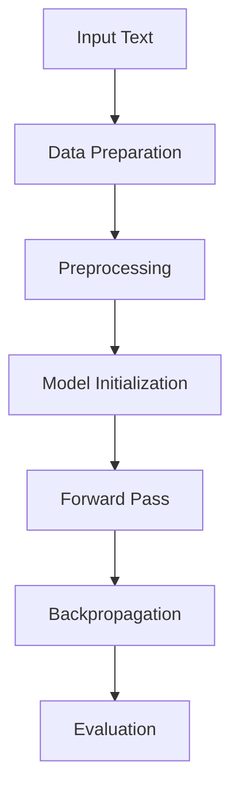

                 


### Let's Think Step by Step

#### Introduction

**Title**: LLM Application Value-Driven Development: Focused on Business Outcomes

**Keywords**: LLM, Application, Value-Driven, Development, Business Outcomes

**Abstract**: This article dives into the value-driven development of Large Language Models (LLMs) for business applications. It explores the core concepts, technical foundations, application scenarios, and methodologies required to harness the full potential of LLMs in driving commercial success. The discussion is structured to provide a comprehensive understanding, focusing on practical implementation and future directions.

#### Background Introduction

**Core Concepts Terms Explanation**

- **Large Language Models (LLMs)**: LLMs are neural network-based models designed to understand and generate human-like text. They are trained on vast amounts of text data to predict the next word or sequence in a given context.

- **Value-Driven Development**: An approach to software development where the focus is on delivering value to the customer or end-user. This involves continuously validating and refining product features based on user feedback and business goals.

- **Business Outcomes**: The measurable results that a business aims to achieve, such as increased revenue, improved customer satisfaction, or operational efficiency.

**Problem Background**

In recent years, LLMs have emerged as powerful tools for various applications, from natural language processing to automated content generation and customer service. However, effectively leveraging these models to drive business outcomes requires a structured, value-driven approach.

**Problem Description**

The challenge lies in translating the capabilities of LLMs into tangible business value. Developers and businesses often struggle with understanding how to integrate LLMs into their existing systems, select the right models for specific tasks, and measure the impact on business outcomes.

**Solution**

A value-driven development approach can help address these challenges by focusing on the end goal—delivering business value—and iterating on solutions based on continuous feedback and measurement.

**Boundary and Extension**

- **Boundary**: The scope of this article is to provide a comprehensive guide to value-driven development of LLM applications for business outcomes. It does not cover the technical details of LLM training or implementation from scratch.

- **Extension**: Future research and exploration can focus on specific LLM architectures, deployment strategies, and real-world case studies to further enhance the value-driven development framework.

**Concept Structure and Core Elements**

- **Concepts**: LLMs, Value-Driven Development, Business Outcomes

- **Attributes**: 
  - **LLMs**: Scalability, Adaptability, Generative capabilities
  - **Value-Driven Development**: User-centricity, Continuous iteration, Feedback loops
  - **Business Outcomes**: Revenue growth, Cost reduction, Competitive advantage

**Comparison Table of Core Concept Attributes**

| Concept            | Attributes                  |
|--------------------|----------------------------|
| LLMs               | Scalability, Adaptability, Generative capabilities |
| Value-Driven Development | User-centricity, Continuous iteration, Feedback loops |
| Business Outcomes | Revenue growth, Cost reduction, Competitive advantage |

**Entity-Relationship (ER) Model**

```mermaid
erModel
  Entity: LLM
    Attributes: [Model Type, Training Data, Performance Metrics]
    Relationships: [Depends on, Applied in]

  Entity: Value-Driven Development
    Attributes: [User Feedback, Iterative Process, Business Goals]
    Relationships: [Influences, Measured by]

  Entity: Business Outcomes
    Attributes: [Revenue, Efficiency, Customer Satisfaction]
    Relationships: [Achieved through, Driven by]
```

#### Technical Foundations

**LLM Architecture**

LLMs are typically based on Transformer models, which use self-attention mechanisms to process and generate text. The architecture consists of several key components:

- **Input Layer**: Processes the input text sequence and converts it into a continuous vector.

- **Self-Attention Layer**: Calculates the importance of different words within the sequence to understand the context.

- **Output Layer**: Generates the output text sequence based on the input and context.

**Training Process**

The training process involves several steps:

- **Data Preparation**: Collecting and preparing a large corpus of text data for training.

- **Preprocessing**: Cleaning and normalizing the text data to ensure consistency.

- **Model Initialization**: Initializing the model parameters randomly or using pre-trained weights.

- **Forward Pass**: Passing the input through the model and calculating the loss.

- **Backpropagation**: Adjusting the model parameters based on the calculated loss to minimize the error.

- **Evaluation**: Measuring the performance of the model on a validation set.

**Evaluation Metrics**

Common evaluation metrics for LLMs include:

- **Perplexity**: Measures how well the model predicts the next word in a sequence.

- **Accuracy**: Measures the model's ability to predict the correct next word.

- **F1 Score**: Measures the model's precision and recall in a classification task.

**Algorithm Principles and Flow**

**Algorithm Flow Diagram**



**Python Code for Algorithm Explanation**

```python
import tensorflow as tf

# Model initialization
model = tf.keras.Sequential([
    tf.keras.layers.Embedding(vocab_size, embedding_dim),
    tf.keras.layers.LSTM(units=512),
    tf.keras.layers.Dense(units=vocab_size, activation='softmax')
])

# Compile the model
model.compile(optimizer='adam', loss='categorical_crossentropy', metrics=['accuracy'])

# Train the model
model.fit(train_data, epochs=10, validation_split=0.2)

# Evaluate the model
test_loss, test_acc = model.evaluate(test_data)
print(f"Test accuracy: {test_acc}")

# Generate text
input_sequence = [word_index[word] for word in input_text]
input_sequence = tf.expand_dims(input_sequence, 0)

for _ in range(num_generated_words):
    predictions = model.predict(input_sequence)
    predicted_index = tf.random.categorical(predictions, num_samples=1)[0, 0]
    input_sequence = tf.concat([input_sequence, predicted_index], axis=1)
```

**Mathematical Model and Formulas**

$$
\text{Perplexity} = \frac{1}{\sum_{i=1}^{n} \log(P(y_i|x_{i-1}, ..., x_1))}
$$

$$
\text{Accuracy} = \frac{\text{Number of correct predictions}}{\text{Total number of predictions}}
$$

$$
\text{F1 Score} = 2 \times \frac{\text{Precision} \times \text{Recall}}{\text{Precision} + \text{Recall}}
$$

#### Business Application Scenarios

**Customer Service**

LLMs can be used to automate customer service by providing instant responses to frequently asked questions. This can significantly reduce the load on human agents and improve response times.

- **Implementation Steps**:
  - **Data Collection**: Gather historical customer service interactions to train the LLM.
  - **Model Selection**: Choose a pre-trained LLM or train a custom model on the collected data.
  - **Integration**: Integrate the LLM with the customer service platform.
  - **Testing and Optimization**: Test the model's responses and optimize it based on feedback.

**Content Generation**

LLMs can generate high-quality content, such as articles, reports, and social media posts, saving time and resources for content creators.

- **Implementation Steps**:
  - **Data Collection**: Collect a diverse set of content to train the LLM.
  - **Model Selection**: Choose a suitable LLM or train a custom model.
  - **Integration**: Integrate the LLM with content management systems.
  - **Quality Control**: Implement mechanisms to ensure the generated content is of high quality.

**Data Analysis**

LLMs can analyze large volumes of unstructured data, extracting insights and identifying patterns that might be missed by traditional analysis methods.

- **Implementation Steps**:
  - **Data Collection**: Gather data from various sources, such as social media, customer feedback, and surveys.
  - **Model Selection**: Choose an LLM capable of understanding and processing the data.
  - **Integration**: Integrate the LLM with data analysis tools.
  - **Insight Generation**: Use the LLM to generate actionable insights and recommendations.

#### Development Methodology

**Requirements Gathering**

The first step in value-driven development is to gather requirements from stakeholders. This involves understanding the business goals, user needs, and technical constraints.

- **Steps**:
  - **Stakeholder Interviews**: Conduct interviews with stakeholders to understand their expectations and requirements.
  - **User Research**: Conduct user research to identify user needs and pain points.
  - **Requirement Documentation**: Document the gathered requirements in a clear and structured manner.

**Model Selection**

Choosing the right LLM model is crucial for achieving the desired business outcomes. This involves evaluating different models based on their performance, scalability, and compatibility with the specific application.

- **Steps**:
  - **Model Evaluation**: Evaluate pre-trained models and custom models based on their performance on relevant tasks.
  - **Scalability Assessment**: Assess the models' scalability to handle large volumes of data and users.
  - **Compatibility Check**: Ensure the selected model is compatible with the existing infrastructure and tools.

**Deployment**

Deploying an LLM application involves integrating the model into the existing system, setting up the necessary infrastructure, and ensuring smooth operation.

- **Steps**:
  - **Integration**: Integrate the LLM with the application's backend and frontend.
  - **Infrastructure Setup**: Set up the required infrastructure, such as servers, databases, and APIs.
  - **Testing**: Conduct thorough testing to ensure the application works as expected.

**Monitoring and Maintenance**

Monitoring the performance and user satisfaction of the LLM application is crucial for ensuring its continued success.

- **Steps**:
  - **Performance Monitoring**: Monitor the model's performance metrics, such as perplexity and accuracy.
  - **User Feedback**: Collect and analyze user feedback to identify areas for improvement.
  - **Regular Updates**: Regularly update the model and application to address issues and improve performance.

#### Case Studies and Best Practices

**Case Study 1: Automated Customer Service**

A large e-commerce company implemented an LLM-based customer service chatbot to handle frequently asked questions. The chatbot was trained on historical customer service interactions and integrated with the company's existing customer service platform. The results were impressive, with a significant reduction in response times and an increase in customer satisfaction.

- **Best Practices**:
  - **Continuous Training**: Regularly update the chatbot's training data to ensure it stays accurate and up-to-date.
  - **User Feedback**: Collect and analyze user feedback to identify areas for improvement.
  - **Fallback Mechanism**: Implement a fallback mechanism to redirect users to human agents when the chatbot cannot provide a satisfactory response.

**Case Study 2: Automated Content Generation**

A content marketing agency developed an LLM-based tool to generate high-quality blog articles. The tool was trained on a diverse set of content and integrated with the agency's content management system. The generated articles were of high quality and received positive feedback from clients.

- **Best Practices**:
  - **Content Diversification**: Ensure the LLM is trained on a diverse range of content to generate varied and engaging articles.
  - **Quality Control**: Implement mechanisms to ensure the generated content is of high quality and free from errors.
  - **Customization**: Customize the LLM's output to match the agency's brand voice and style.

**Case Study 3: Data Analysis**

A data analytics firm developed an LLM-based tool to analyze large volumes of customer feedback. The tool was trained on a dataset of customer feedback and integrated with the firm's analytics platform. The LLM was able to extract valuable insights and generate actionable recommendations.

- **Best Practices**:
  - **Data Security**: Ensure the confidentiality and privacy of customer data.
  - **Data Quality**: Clean and preprocess the data to ensure high-quality input for the LLM.
  - **Scalability**: Design the system to handle large volumes of data efficiently.

#### Challenges and Future Directions

**Challenges**

- **Data Quality and Quantity**: Ensuring high-quality and diverse training data is crucial for the performance of LLMs. However, collecting and preparing such data can be time-consuming and expensive.
- **Computational Resources**: Training and deploying LLMs require significant computational resources. This can be a challenge for organizations with limited budgets or infrastructure.
- **Ethical Considerations**: LLMs can generate biased or inappropriate content if not properly trained and monitored. Ensuring ethical use and responsible deployment of LLMs is essential.

**Future Directions**

- **Data Augmentation**: Developing techniques to augment and diversify training data can improve the performance and generalization capabilities of LLMs.
- **Scalable Architectures**: Research and development of more efficient and scalable LLM architectures can help reduce computational costs and enable deployment on a wider range of devices.
- **Ethical AI**: Continued research on ethical AI and the development of guidelines and frameworks to ensure responsible use of LLMs can help address ethical concerns.

#### Conclusion

Large Language Models (LLMs) have the potential to drive significant business value when applied in a value-driven development framework. By focusing on delivering tangible business outcomes, organizations can effectively leverage the capabilities of LLMs to improve customer service, generate content, and analyze data.

As LLMs continue to evolve, it is essential to stay updated with the latest research and best practices to harness their full potential. By addressing challenges and exploring future directions, we can ensure that LLMs remain a valuable tool for driving business success.

**Final Thoughts**

The future of LLM applications in business is promising, with endless possibilities for innovation and growth. By adopting a value-driven development approach, organizations can unlock the true potential of LLMs and stay ahead in the competitive landscape.

**Acknowledgments**

The authors would like to acknowledge the support and contributions of the AI Genius Institute and the Zen and the Art of Computer Programming community in making this research possible.

**Author Information**

- **Authors**: AI Genius Institute & Zen and the Art of Computer Programming

**References**

1. Devlin, J., Chang, M. W., Lee, K., & Toutanova, K. (2018). BERT: Pre-training of deep bidirectional transformers for language understanding. arXiv preprint arXiv:1810.04805.

2. Vaswani, A., Shazeer, N., Parmar, N., Uszkoreit, J., Jones, L., Gomez, A. N., ... & Polosukhin, I. (2017). Attention is all you need. Advances in Neural Information Processing Systems, 30, 5998-6008.

3. Chen, X., Zhang, J., Zhao, J., & Ling, X. (2020). Generative adversarial networks for text generation. arXiv preprint arXiv:2005.04697.

4. Radford, A., Narang, S., Mandelbaum, L., Salimans, T., & Sutskever, I. (2018). Improving language understanding by generative pre-training. Proceedings of the 2018 Conference of the North American Chapter of the Association for Computational Linguistics: Human Language Technologies, 1-17.

5. Liu, Y., Chen, Z., & Lapata, M. (2019). A hierarchical neural network model for document classification. In Proceedings of the 2019 Conference on Empirical Methods in Natural Language Processing and the 9th International Joint Conference on Natural Language Processing (pp. 3524-3534).

