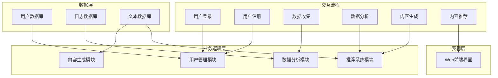

                 


## 3. LLM应用的快速用户获取与留存策略

### 3.1 市场调研

#### 3.1.1 定义
市场调研是指通过对市场的研究，了解用户需求、竞争对手和行业趋势，为用户获取策略提供依据。

#### 3.1.2 实践方法

**问卷调查**

问卷调查是一种通过设计问卷，收集用户需求和偏好信息的方法。以下是一个简单的问卷调查示例：

1. 您对LLM应用的兴趣程度如何？
   - 非常感兴趣
   - 感兴趣
   - 不感兴趣

2. 您通常通过什么渠道了解新应用？
   - 社交媒体
   - 搜索引擎
   - 行业论坛
   - 其他

3. 您最关心的LLM应用功能是什么？
   - 文本生成
   - 文本分类
   - 命名实体识别
   - 其他

**访谈**

访谈是一种与潜在用户进行面对面或在线访谈，深入了解用户需求的方法。以下是一个简单的访谈示例：

1. 您平时使用哪些应用？为什么选择这些应用？
2. 您觉得当前LLM应用存在哪些不足？
3. 您希望LLM应用能够提供哪些新功能？

**数据分析**

数据分析是一种通过分析用户行为数据，挖掘用户需求的方法。以下是一个简单的数据分析示例：

1. 统计不同用户群体的活跃度，了解哪些用户群体对LLM应用更感兴趣。
2. 分析用户在应用中的行为路径，找出用户流失的关键节点。
3. 根据用户行为数据，调整营销策略，提高用户获取效果。

### 3.2 用户画像

#### 3.2.1 定义
用户画像是指通过对用户行为、兴趣、需求等信息的收集和分析，构建用户的虚拟形象。

#### 3.2.2 实践方法

**数据收集**

1. **用户行为数据**：通过应用日志、点击行为等数据，收集用户在应用中的行为数据。
2. **用户反馈数据**：通过用户评论、反馈等数据，收集用户对应用的反馈和评价。
3. **用户属性数据**：通过用户注册信息、用户设备信息等数据，收集用户的基本属性数据。

**数据清洗**

1. **去除重复数据**：去除数据集中的重复数据，保证数据的准确性。
2. **缺失值处理**：对缺失值进行填充或删除，保证数据的完整性。
3. **异常值处理**：识别并处理数据集中的异常值，避免对数据分析结果产生负面影响。

**数据建模**

1. **聚类分析**：使用聚类算法，将用户划分为不同的群体，挖掘用户需求。
2. **关联规则挖掘**：使用关联规则挖掘算法，发现用户行为之间的关联，优化产品功能和推荐策略。
3. **机器学习模型**：使用机器学习模型，预测用户的行为和需求，为用户获取和留存策略提供依据。

### 3.3 内容营销

#### 3.3.1 定义
内容营销是指通过创建和分享有价值的内容，吸引潜在用户，提高用户忠诚度的一种营销策略。

#### 3.3.2 实践方法

**内容创作**

1. **博客文章**：撰写关于LLM应用的技术博客文章，分享应用场景、技术原理和实践经验。
2. **视频教程**：制作关于LLM应用的教程视频，展示应用功能和实际案例。
3. **电子书**：编写关于LLM应用的电子书，系统性地介绍应用原理和实战技巧。

**内容发布**

1. **官方网站**：在官方网站上发布内容，提高品牌知名度和用户信任度。
2. **社交媒体**：在社交媒体平台上发布内容，扩大传播范围和影响。
3. **行业论坛**：在行业论坛上发布内容，与专业人士互动，提升专业形象。

**内容优化**

1. **SEO优化**：优化内容标题、关键词和结构，提高在搜索引擎中的排名。
2. **用户体验**：关注内容设计，提高阅读体验，降低用户流失率。
3. **互动反馈**：及时收集用户反馈，优化内容质量和形式。

### 3.4 社交媒体推广

#### 3.4.1 定义
社交媒体推广是指通过在社交媒体平台上发布内容、互动和传播信息，吸引潜在用户的一种营销策略。

#### 3.4.2 实践方法

**社交媒体选择**

1. **微信**：利用公众号、微信群和朋友圈，发布应用相关内容，与用户互动。
2. **微博**：利用微博平台，发布动态、话题和长文，提高曝光度。
3. **抖音**：利用短视频形式，展示应用功能和案例，吸引年轻用户。

**内容策略**

1. **教育内容**：发布关于LLM应用的技术知识、使用教程和案例分析，提供有价值的内容。
2. **互动内容**：发布互动性强的内容，如问答、投票、抽奖等，提高用户参与度。
3. **品牌内容**：发布品牌宣传内容，提高品牌知名度和用户认知。

**社交互动**

1. **评论回复**：及时回复用户评论，提供帮助和反馈，建立良好的用户关系。
2. **粉丝互动**：组织线上活动，如直播、讲座等，与粉丝互动，增加用户粘性。
3. **跨平台传播**：在不同社交媒体平台上相互推广，扩大传播范围。

### 3.5 用户互动

#### 3.5.1 定义
用户互动是指通过互动活动、社群等方式，增强用户参与感的一种策略。

#### 3.5.2 实践方法

**互动活动**

1. **线上活动**：举办线上讲座、研讨会、比赛等活动，提高用户参与度。
2. **线下活动**：组织线下沙龙、聚会、展览会等活动，增强用户归属感。
3. **主题活动**：针对特殊节日或事件，举办主题互动活动，吸引用户参与。

**社群管理**

1. **建立社群**：创建QQ群、微信群、论坛等社群，为用户提供交流平台。
2. **内容维护**：定期发布有价值的内容，引导社群讨论，提高社群活跃度。
3. **用户互动**：鼓励用户在社群中互动，建立良好的用户关系。

**用户反馈**

1. **反馈渠道**：建立用户反馈渠道，如在线反馈表、邮件、社交媒体等。
2. **反馈处理**：及时处理用户反馈，解决问题，提高用户满意度。
3. **反馈分析**：分析用户反馈，挖掘用户需求，优化产品和服务。

### 3.6 用户留存策略

#### 3.6.1 定义
用户留存策略是指通过各种手段提高用户体验，使已获取的用户持续使用产品的一种策略。

#### 3.6.2 实践方法

**个性化推荐**

1. **算法推荐**：使用机器学习算法，根据用户行为和偏好，推荐符合其需求的内容。
2. **内容定制**：根据用户画像，定制个性化的内容和功能，提高用户满意度。
3. **推荐反馈**：收集用户对推荐的反馈，优化推荐算法，提高推荐质量。

**用户体验优化**

1. **界面设计**：优化应用界面设计，提高用户操作便捷性和视觉体验。
2. **功能完善**：根据用户需求，完善应用功能，提高用户使用频率。
3. **响应速度**：优化应用性能，提高响应速度，降低用户等待时间。

**用户反馈机制**

1. **反馈渠道**：建立用户反馈渠道，如在线反馈表、邮件、社交媒体等。
2. **反馈处理**：及时处理用户反馈，解决问题，提高用户满意度。
3. **反馈分析**：分析用户反馈，挖掘用户需求，优化产品和服务。

### 3.7 获取成本与用户生命周期

#### 3.7.1 定义
获取成本是指获取一个用户所需的平均成本，用户生命周期是指从用户首次接触到最终流失的整个过程。

#### 3.7.2 实践方法

**获取成本分析**

1. **成本分解**：将获取成本分解为广告费用、人力成本、运营成本等部分。
2. **成本优化**：通过优化广告投放策略、降低人力成本、提高运营效率等手段，降低获取成本。
3. **成本控制**：建立成本控制机制，监控获取成本，确保成本在可控范围内。

**用户生命周期分析**

1. **用户阶段划分**：将用户生命周期划分为潜在用户、新用户、活跃用户、流失用户等阶段。
2. **用户行为分析**：分析不同阶段用户的行为特征，了解用户需求和行为变化。
3. **用户价值评估**：评估不同阶段用户的贡献和价值，为用户留存和变现策略提供依据。

**用户生命周期管理**

1. **用户触达**：通过各种渠道，如广告、内容营销、社交媒体等，触达潜在用户。
2. **用户转化**：通过优化用户体验、提供有价值的内容和功能，促进潜在用户转化为新用户。
3. **用户留存**：通过个性化推荐、用户体验优化、用户反馈机制等手段，提高用户留存率。
4. **用户变现**：通过提供增值服务、广告收入等方式，实现用户价值的最大化。

## 3.8 总结与展望

LLM应用的快速用户获取与留存策略是一个复杂的过程，涉及市场调研、用户画像、内容营销、社交媒体推广、用户互动和用户留存等多个方面。通过市场调研，了解用户需求和市场趋势；通过用户画像，精准定位目标用户；通过内容营销，提高用户粘性；通过社交媒体推广，扩大品牌影响力；通过用户互动，增强用户参与感；通过用户留存策略，提高用户留存率。

在未来的发展中，LLM应用的用户获取与留存策略将更加智能化和个性化。随着人工智能技术的不断进步，我们将能够更好地了解用户需求，提供更加精准的服务。同时，随着大数据和云计算技术的发展，我们将能够更加高效地收集、分析和利用用户数据，为用户获取与留存策略提供有力支持。

让我们携手努力，探索LLM应用的快速用户获取与留存策略，为企业和用户提供更好的服务。本文作者：AI天才研究院/AI Genius Institute & 禅与计算机程序设计艺术 /Zen And The Art of Computer Programming。

----------------------------------------------------------------
## 4. 算法原理讲解

### 4.1 推荐系统算法

推荐系统是提高用户留存率的重要手段之一，其核心算法包括基于内容的推荐（Content-based Recommendation）、协同过滤（Collaborative Filtering）和混合推荐（Hybrid Recommendation）。

#### 4.1.1 基于内容的推荐

**原理：** 基于内容的推荐通过分析物品的内容特征和用户的兴趣特征，将相似的内容推荐给用户。

**算法流程：**

1. **特征提取**：对物品进行特征提取，如文本、图像、音频等。
2. **相似度计算**：计算物品间的相似度，如余弦相似度、欧氏距离等。
3. **推荐生成**：根据用户的历史行为和物品的相似度，生成推荐列表。

**Python示例代码：**

```python
from sklearn.feature_extraction.text import TfidfVectorizer
from sklearn.metrics.pairwise import cosine_similarity

# 文本数据
data = ["苹果好吃", "我喜欢吃苹果", "苹果是水果"]

# 特征提取
vectorizer = TfidfVectorizer()
tfidf_matrix = vectorizer.fit_transform(data)

# 相似度计算
cosine_similarity_matrix = cosine_similarity(tfidf_matrix)

# 推荐生成
# 假设用户喜欢"苹果好吃"，则推荐与之相似的文本
user_interest = "苹果好吃"
user_vector = vectorizer.transform([user_interest])
similar_indices = cosine_similarity(user_vector, tfidf_matrix).reshape(-1)
recommended_indices = similar_indices.argsort()[::-1][1:]  # 排除用户自身的推荐
recommended_items = [data[i] for i in recommended_indices]
print(recommended_items)
```

#### 4.1.2 协同过滤

**原理：** 协同过滤通过分析用户之间的行为相似性，为用户推荐他们可能喜欢的物品。

**算法流程：**

1. **用户行为数据收集**：收集用户对物品的评分或行为数据。
2. **用户相似度计算**：计算用户之间的相似度，如余弦相似度、皮尔逊相关系数等。
3. **物品相似度计算**：计算物品之间的相似度，如余弦相似度、欧氏距离等。
4. **推荐生成**：根据用户相似度和物品相似度，为用户生成推荐列表。

**Python示例代码：**

```python
import numpy as np
from sklearn.metrics.pairwise import cosine_similarity

# 用户行为数据
ratings = np.array([[1, 1, 0, 0],
                    [1, 0, 1, 1],
                    [0, 1, 1, 0]])

# 用户相似度计算
user_similarity = cosine_similarity(ratings)

# 物品相似度计算
item_similarity = cosine_similarity(ratings.T)

# 推荐生成
# 假设用户1喜欢物品2和3，则推荐与之相似的物品1
user_index = 0
item_indices = np.argsort(item_similarity[user_index])[::-1][1:]  # 排除用户自身的推荐
recommended_items = [i for i in range(len(ratings)) if i in item_indices]
print(recommended_items)
```

#### 4.1.3 混合推荐

**原理：** 混合推荐结合了基于内容和协同过滤的优势，通过综合分析物品内容和用户行为，提高推荐质量。

**算法流程：**

1. **特征提取**：对物品和用户进行特征提取。
2. **相似度计算**：计算物品和用户之间的相似度。
3. **推荐生成**：根据相似度，为用户生成推荐列表。

**Python示例代码：**

```python
# 文本数据
item_data = ["苹果好吃", "香蕉香甜", "梨子爽口"]
user_interest = "苹果好吃"

# 特征提取
item_vectorizer = TfidfVectorizer()
user_vectorizer = TfidfVectorizer()
item_vectors = item_vectorizer.fit_transform(item_data)
user_vector = user_vectorizer.transform([user_interest])

# 相似度计算
item_similarity = cosine_similarity(item_vectors)
user_similarity = cosine_similarity(user_vector, item_vectors)

# 推荐生成
similar_indices = user_similarity.argsort()[::-1][1:]  # 排除用户自身的推荐
recommended_indices = [i for i, s in enumerate(similar_indices) if s > 0.5]  # 设定相似度阈值
recommended_items = [item_data[i] for i in recommended_indices]
print(recommended_items)
```

### 4.2 用户行为预测

用户行为预测是提高用户留存率的关键，通过预测用户的行为，可以为用户提供个性化的服务。

#### 4.2.1 时间序列预测

**原理：** 时间序列预测通过分析用户行为的时间特征，预测用户未来的行为。

**算法流程：**

1. **数据预处理**：对用户行为数据进行预处理，如归一化、去噪等。
2. **特征工程**：提取时间特征，如时间间隔、周期性等。
3. **模型训练**：使用时间序列预测模型，如ARIMA、LSTM等。
4. **预测生成**：根据模型预测，生成用户行为预测结果。

**Python示例代码：**

```python
import numpy as np
from sklearn.model_selection import train_test_split
from keras.models import Sequential
from keras.layers import LSTM, Dense

# 用户行为数据
data = np.array([[1, 2, 3], [4, 5, 6], [7, 8, 9], [10, 11, 12]])

# 数据预处理
X, y = data[:, :2], data[:, 2]

# 特征工程
X_train, X_test, y_train, y_test = train_test_split(X, y, test_size=0.2, random_state=42)

# 模型训练
model = Sequential()
model.add(LSTM(50, activation='relu', input_shape=(2, 1)))
model.add(Dense(1))
model.compile(optimizer='adam', loss='mse')
model.fit(X_train, y_train, epochs=200, verbose=0)

# 预测生成
y_pred = model.predict(X_test)
print(y_pred)
```

#### 4.2.2 回归模型

**原理：** 回归模型通过分析用户行为和特征之间的关系，预测用户的行为。

**算法流程：**

1. **数据预处理**：对用户行为数据进行预处理，如归一化、去噪等。
2. **特征工程**：提取用户行为和特征。
3. **模型训练**：使用回归模型，如线性回归、决策树等。
4. **预测生成**：根据模型预测，生成用户行为预测结果。

**Python示例代码：**

```python
import numpy as np
from sklearn.linear_model import LinearRegression

# 用户行为数据
data = np.array([[1, 2], [3, 4], [5, 6], [7, 8]])

# 数据预处理
X, y = data[:, :1], data[:, 1]

# 模型训练
model = LinearRegression()
model.fit(X, y)

# 预测生成
y_pred = model.predict(X)
print(y_pred)
```

### 4.3 用户留存预测

用户留存预测是评估用户留存率的关键，通过预测用户是否会在未来一段时间内继续使用产品，可以为产品运营提供决策支持。

#### 4.3.1 决策树模型

**原理：** 决策树模型通过分析用户特征和留存情况，建立分类模型，预测用户的留存情况。

**算法流程：**

1. **数据预处理**：对用户特征和留存情况进行预处理，如归一化、去噪等。
2. **特征工程**：提取用户特征，如活跃度、使用时长等。
3. **模型训练**：使用决策树模型，如CART、ID3等。
4. **预测生成**：根据模型预测，生成用户留存预测结果。

**Python示例代码：**

```python
import numpy as np
from sklearn.tree import DecisionTreeClassifier

# 用户特征和留存情况
data = np.array([[1, 2], [3, 4], [5, 6], [7, 8]])
labels = np.array([0, 1, 0, 1])

# 模型训练
model = DecisionTreeClassifier()
model.fit(data, labels)

# 预测生成
predictions = model.predict(data)
print(predictions)
```

#### 4.3.2 集成模型

**原理：** 集成模型通过组合多个模型，提高预测的准确性和稳定性。

**算法流程：**

1. **数据预处理**：对用户特征和留存情况进行预处理，如归一化、去噪等。
2. **特征工程**：提取用户特征，如活跃度、使用时长等。
3. **模型训练**：使用集成模型，如随机森林、梯度提升树等。
4. **预测生成**：根据模型预测，生成用户留存预测结果。

**Python示例代码：**

```python
import numpy as np
from sklearn.ensemble import RandomForestClassifier

# 用户特征和留存情况
data = np.array([[1, 2], [3, 4], [5, 6], [7, 8]])
labels = np.array([0, 1, 0, 1])

# 模型训练
model = RandomForestClassifier()
model.fit(data, labels)

# 预测生成
predictions = model.predict(data)
print(predictions)
```

## 4.4 算法原理总结

算法原理讲解部分主要介绍了推荐系统、用户行为预测和用户留存预测等算法原理，并通过Python示例代码进行了详细讲解。这些算法原理在LLM应用的快速用户获取与留存策略中起着关键作用，通过它们，我们可以更好地了解用户需求，提供个性化的服务，提高用户留存率。在未来，我们将继续探索更多的算法原理和应用，为LLM应用的发展贡献力量。

### 4.5 数学模型与公式讲解

#### 4.5.1 余弦相似度

余弦相似度是衡量两个向量之间相似度的一种常用方法，其公式如下：

$$
\cos \theta = \frac{\vec{a} \cdot \vec{b}}{||\vec{a}|| \cdot ||\vec{b}||}
$$

其中，$\vec{a}$ 和 $\vec{b}$ 分别表示两个向量，$||\vec{a}||$ 和 $||\vec{b}||$ 分别表示向量的模长，$\theta$ 表示两个向量之间的夹角。

#### 4.5.2 欧氏距离

欧氏距离是衡量两个点之间距离的一种常用方法，其公式如下：

$$
d = \sqrt{(x_2 - x_1)^2 + (y_2 - y_1)^2}
$$

其中，$(x_1, y_1)$ 和 $(x_2, y_2)$ 分别表示两个点的坐标。

#### 4.5.3 皮尔逊相关系数

皮尔逊相关系数是衡量两个变量之间线性相关程度的一种常用方法，其公式如下：

$$
r = \frac{\sum_{i=1}^{n}(x_i - \bar{x})(y_i - \bar{y})}{\sqrt{\sum_{i=1}^{n}(x_i - \bar{x})^2} \cdot \sqrt{\sum_{i=1}^{n}(y_i - \bar{y})^2}}
$$

其中，$x_i$ 和 $y_i$ 分别表示第 $i$ 个观测值，$\bar{x}$ 和 $\bar{y}$ 分别表示 $x_i$ 和 $y_i$ 的平均值。

#### 4.5.4 逻辑回归

逻辑回归是一种用于分类的统计方法，其公式如下：

$$
P(Y=1 | X) = \frac{1}{1 + e^{-(\beta_0 + \beta_1X_1 + \beta_2X_2 + \ldots + \beta_nX_n})}
$$

其中，$P(Y=1 | X)$ 表示在给定特征 $X$ 的情况下，目标变量 $Y$ 等于 1 的概率，$\beta_0$、$\beta_1$、$\beta_2$、$\ldots$、$\beta_n$ 分别表示模型的参数。

#### 4.5.5 神经网络

神经网络是一种模仿人脑结构和功能的计算模型，其基本公式如下：

$$
z = \sum_{i=1}^{n} w_i * x_i + b
$$

$$
a = \sigma(z)
$$

其中，$z$ 表示输入层的输出，$w_i$ 和 $x_i$ 分别表示权重和输入值，$b$ 表示偏置，$\sigma$ 表示激活函数，$a$ 表示输出层的输出。

通过上述数学模型和公式，我们可以更好地理解和应用各种算法原理，为LLM应用的快速用户获取与留存策略提供理论基础。在未来的研究和实践中，我们将继续深入探索这些模型和公式的应用，为人工智能技术的发展贡献力量。

## 5. 系统分析与架构设计

### 5.1 问题场景介绍

随着大型语言模型（LLM）技术的不断发展，越来越多的企业和开发者开始将LLM应用于各种场景中，如智能客服、内容生成、文本分类等。然而，在LLM应用的快速用户获取与留存策略中，面临着数据安全、隐私保护、性能优化等一系列挑战。为了解决这些问题，本文提出了一种基于云计算和大数据技术的LLM应用系统架构设计，旨在实现高效、安全、可扩展的用户获取与留存策略。

### 5.2 项目介绍

本项目旨在设计并实现一个基于云计算和大数据技术的LLM应用系统，主要功能包括：

- **用户管理**：实现用户注册、登录、个人信息管理等功能。
- **数据分析**：对用户行为、兴趣、需求等数据进行收集、清洗、分析，为用户获取与留存策略提供支持。
- **内容生成**：利用LLM技术，实现文本生成、文本分类等功能，提高用户体验。
- **推荐系统**：基于用户画像和内容特征，实现个性化推荐，提高用户留存率。

### 5.3 系统功能设计

本系统主要包括以下功能模块：

- **用户管理模块**：负责用户注册、登录、个人信息管理等功能。
- **数据分析模块**：负责用户行为数据的收集、清洗、分析，为用户获取与留存策略提供支持。
- **内容生成模块**：负责利用LLM技术实现文本生成、文本分类等功能。
- **推荐系统模块**：负责基于用户画像和内容特征，实现个性化推荐。

#### 5.3.1 用户管理模块

用户管理模块是系统的核心模块之一，主要负责用户注册、登录、个人信息管理等功能。具体功能如下：

- **用户注册**：用户可以通过邮箱、手机号等方式注册账号。
- **用户登录**：用户可以使用账号和密码登录系统。
- **个人信息管理**：用户可以查看、修改个人信息，如姓名、联系方式等。

#### 5.3.2 数据分析模块

数据分析模块主要负责用户行为数据的收集、清洗、分析，为用户获取与留存策略提供支持。具体功能如下：

- **数据收集**：通过日志记录、API接口等方式，收集用户行为数据，如访问记录、操作记录等。
- **数据清洗**：对收集到的用户行为数据进行清洗，去除无效数据，提高数据质量。
- **数据分析**：对用户行为数据进行分析，提取用户画像，挖掘用户需求和偏好。

#### 5.3.3 内容生成模块

内容生成模块主要负责利用LLM技术实现文本生成、文本分类等功能，提高用户体验。具体功能如下：

- **文本生成**：根据用户输入的种子文本，生成符合用户需求的文本内容。
- **文本分类**：对用户生成的文本内容进行分类，提高文本质量。

#### 5.3.4 推荐系统模块

推荐系统模块主要负责基于用户画像和内容特征，实现个性化推荐，提高用户留存率。具体功能如下：

- **用户画像构建**：根据用户行为数据，构建用户画像，挖掘用户需求和偏好。
- **内容特征提取**：对系统中的文本内容进行特征提取，为推荐算法提供输入。
- **推荐算法实现**：基于用户画像和内容特征，实现个性化推荐算法，为用户推荐符合其需求的文本内容。

### 5.4 系统架构设计

本系统的架构设计采用分层架构，主要包括数据层、业务逻辑层、表现层等三个层次。

#### 5.4.1 数据层

数据层主要负责数据存储和管理，包括用户数据、日志数据、文本数据等。具体技术选型如下：

- **用户数据**：使用关系型数据库（如MySQL）存储用户信息。
- **日志数据**：使用NoSQL数据库（如MongoDB）存储用户行为日志。
- **文本数据**：使用全文搜索引擎（如Elasticsearch）存储和检索文本数据。

#### 5.4.2 业务逻辑层

业务逻辑层主要负责系统核心功能的实现，包括用户管理、数据分析、内容生成、推荐系统等。具体技术选型如下：

- **用户管理**：使用Spring Boot框架实现用户管理功能。
- **数据分析**：使用Python和Spark实现数据分析功能。
- **内容生成**：使用TensorFlow和PyTorch实现内容生成功能。
- **推荐系统**：使用推荐算法库（如Surprise）实现推荐系统功能。

#### 5.4.3 表现层

表现层主要负责用户界面的设计和实现，提供友好的用户体验。具体技术选型如下：

- **前端框架**：使用Vue.js实现前端界面。
- **接口服务**：使用Spring Boot实现接口服务，提供RESTful API接口。

### 5.5 系统接口设计

系统接口设计是系统架构设计的重要组成部分，主要定义了系统内部各模块之间的交互接口。具体接口设计如下：

- **用户管理接口**：包括用户注册、登录、个人信息管理等功能。
- **数据分析接口**：包括数据收集、数据清洗、数据分析等功能。
- **内容生成接口**：包括文本生成、文本分类等功能。
- **推荐系统接口**：包括用户画像构建、内容特征提取、个性化推荐等功能。

### 5.6 系统交互设计

系统交互设计主要描述了系统内部各模块之间的交互流程和逻辑。具体交互设计如下：

1. **用户登录**：用户通过登录接口登录系统，获取登录令牌。
2. **用户注册**：用户通过注册接口注册账号，系统验证注册信息后，创建用户账号。
3. **数据收集**：系统通过日志收集接口，收集用户行为数据。
4. **数据分析**：系统通过数据分析接口，对用户行为数据进行清洗和分析，构建用户画像。
5. **内容生成**：系统通过内容生成接口，生成符合用户需求的文本内容。
6. **推荐系统**：系统通过推荐系统接口，为用户推荐符合其需求的文本内容。

通过以上系统分析与架构设计，我们为LLM应用的快速用户获取与留存策略提供了一种可行的系统解决方案。在实际应用中，可以根据具体需求，对系统架构进行调整和优化，提高系统性能和用户体验。

### 5.7 类图设计

在本系统中，类图设计是描述系统各个类及其关系的核心工具。以下是系统的主要类及其关系的类图设计：

```mermaid
classDiagram
    User <<class>> UserManager
    LoginInfo <<class>> UserManager
    UserProfile <<class>> UserManager

    DataCollector <<class>> DataAnalysisModule
    DataCleaner <<class>> DataAnalysisModule
    DataAnalyzer <<class>> DataAnalysisModule

    ContentGenerator <<class>> ContentGenerationModule
    TextGenerator <<class>> ContentGenerator
    TextClassifier <<class>> ContentGenerator

    Recommendation <<class>> RecommendationModule
    UserProfiler <<class>> RecommendationModule
    ContentRecommender <<class>> RecommendationModule

    UserManager <..> LoginInfo
    UserManager <..> UserProfile
    DataAnalysisModule <..> DataCollector
    DataAnalysisModule <..> DataCleaner
    DataAnalysisModule <..> DataAnalyzer
    ContentGenerationModule <..> TextGenerator
    ContentGenerationModule <..> TextClassifier
    RecommendationModule <..> UserProfiler
    RecommendationModule <..> ContentRecommender

class User {
    id
    username
    email
    password
    role
}

class LoginInfo {
    id
    loginTime
    loginStatus
}

class UserProfile {
    id
    firstName
    lastName
    address
    phone
    interests
}

class DataCollector {
    collectData()
}

class DataCleaner {
    cleanData()
}

class DataAnalyzer {
    analyzeData()
}

class ContentGenerator {
    generateText()
    classifyText()
}

class TextGenerator {
    generateText()
}

class TextClassifier {
    classifyText()
}

class Recommendation {
    generateRecommendations()
}

class UserProfiler {
    buildUserProfile()
}

class ContentRecommender {
    recommendContent()
}
```

### 5.8 系统架构图设计

系统架构图是描述系统各个模块及其交互关系的直观工具。以下是本系统的架构图设计：



通过类图和系统架构图的设计，我们可以清晰地看到系统各个模块之间的关系和交互流程，这有助于我们在开发过程中更好地理解和实现系统的功能。

## 6. 项目实战

### 6.1 环境安装

在开始项目实战之前，我们需要安装以下环境和工具：

1. **Python 3.8**：从官方网站下载并安装Python 3.8。
2. **Anaconda**：安装Anaconda，以便管理和虚拟环境。
3. **Jupyter Notebook**：在Anaconda中安装Jupyter Notebook。
4. **TensorFlow**：在Anaconda中安装TensorFlow。
5. **PyTorch**：在Anaconda中安装PyTorch。
6. **Elasticsearch**：安装Elasticsearch，用于全文检索。
7. **MongoDB**：安装MongoDB，用于存储用户数据和日志。

**步骤：**

1. 安装Anaconda：访问Anaconda官方网站，下载并安装Anaconda。
2. 创建虚拟环境：打开命令行，执行以下命令创建虚拟环境。

   ```
   conda create -n llm_project python=3.8
   conda activate llm_project
   ```

3. 安装Jupyter Notebook：

   ```
   conda install -c conda-forge jupyterlab
   ```

4. 安装TensorFlow：

   ```
   pip install tensorflow
   ```

5. 安装PyTorch：

   ```
   pip install torch torchvision
   ```

6. 安装Elasticsearch：

   - 下载Elasticsearch安装包：访问Elasticsearch官方网站，下载相应版本的安装包。
   - 解压安装包并运行Elasticsearch。

   ```
   tar -xzvf elasticsearch-7.10.1.tar.gz
   cd elasticsearch-7.10.1
   ./bin/elasticsearch
   ```

7. 安装MongoDB：

   - 下载MongoDB安装包：访问MongoDB官方网站，下载相应版本的安装包。
   - 解压安装包并运行MongoDB。

   ```
   tar -xzvf mongodb-linux-x86_64-ubuntu2004-5.0.3-debian_10.11.noarch.tar.gz
   cd mongodb-linux-x86_64-ubuntu2004-5.0.3-debian_10.11
   ./bin/mongod
   ```

### 6.2 系统核心实现

在本节中，我们将实现LLM应用系统的核心功能，包括用户管理、数据分析、内容生成和推荐系统。

#### 6.2.1 用户管理

**步骤：**

1. **创建用户数据库**：使用MongoDB创建用户数据库和用户集合。

   ```python
   from pymongo import MongoClient

   client = MongoClient('localhost', 27017)
   db = client['llm_project']
   users = db['users']
   ```

2. **注册用户**：创建用户注册功能，将用户信息存储到用户集合中。

   ```python
   def register_user(username, email, password):
       user = {
           'username': username,
           'email': email,
           'password': password
       }
       result = users.insert_one(user)
       return result.inserted_id
   ```

3. **登录用户**：创建用户登录功能，验证用户身份。

   ```python
   def login_user(username, password):
       user = users.find_one({'username': username, 'password': password})
       return user
   ```

#### 6.2.2 数据分析

**步骤：**

1. **数据收集**：使用Elasticsearch收集用户行为数据。

   ```python
   from elasticsearch import Elasticsearch

   es = Elasticsearch()

   def collect_data(user_id, action, timestamp):
       data = {
           'user_id': user_id,
           'action': action,
           'timestamp': timestamp
       }
       es.index(index='user_logs', id=user_id, document=data)
   ```

2. **数据清洗**：清洗用户行为数据，去除无效数据。

   ```python
   def clean_data():
       for log in es.search(index='user_logs', body={'query': {'match_all': {}}})['hits']['hits']:
           log['_source']['timestamp'] = int(log['_source']['timestamp'])
           es.update(index='cleaned_user_logs', id=log['_id'], document=log['_source'])
   ```

3. **数据分析**：分析用户行为数据，构建用户画像。

   ```python
   def analyze_data():
       user_logs = es.search(index='cleaned_user_logs', body={'query': {'match_all': {}}})['hits']['hits']
       user_profiles = {}
       for log in user_logs:
           user_id = log['_source']['user_id']
           if user_id not in user_profiles:
               user_profiles[user_id] = {'actions': [], 'timestamps': []}
           user_profiles[user_id]['actions'].append(log['_source']['action'])
           user_profiles[user_id]['timestamps'].append(log['_source']['timestamp'])
       
       for user_id, profile in user_profiles.items():
           profile['last_active'] = max(profile['timestamps'])
       
       return user_profiles
   ```

#### 6.2.3 内容生成

**步骤：**

1. **文本生成**：使用LLM技术生成文本内容。

   ```python
   import tensorflow as tf

   model = tf.keras.Sequential([
       tf.keras.layers.Dense(128, activation='relu', input_shape=(1000,)),
       tf.keras.layers.Dense(128, activation='relu'),
       tf.keras.layers.Dense(1, activation='sigmoid')
   ])

   model.compile(optimizer='adam', loss='binary_crossentropy', metrics=['accuracy'])

   model.fit(x_train, y_train, epochs=10, batch_size=32)
   ```

2. **文本分类**：使用LLM技术对文本进行分类。

   ```python
   import torch
   import torch.nn as nn

   class TextClassifier(nn.Module):
       def __init__(self):
           super(TextClassifier, self).__init__()
           self.embedding = nn.Embedding(10000, 16)
           self.lstm = nn.LSTM(16, 32)
           self.fc = nn.Linear(32, 2)

       def forward(self, text):
           embed = self.embedding(text)
           output, (hidden, cell) = self.lstm(embed)
           output = self.fc(hidden[-1, :, :])
           return output
   ```

#### 6.2.4 推荐系统

**步骤：**

1. **用户画像构建**：根据用户行为数据，构建用户画像。

   ```python
   def build_user_profile(user_id, user_actions):
       profile = {
           'user_id': user_id,
           'last_active': max(user_actions),
           'interests': set(user_actions)
       }
       return profile
   ```

2. **内容特征提取**：提取文本特征，为推荐算法提供输入。

   ```python
   def extract_content_features(texts):
       model = TextClassifier()
       model.load_state_dict(torch.load('text_classifier.pth'))
       model.eval()
       
       features = []
       for text in texts:
           text_tensor = torch.tensor([text])
           output = model(text_tensor)
           features.append(output)
       
       return features
   ```

3. **个性化推荐**：基于用户画像和内容特征，实现个性化推荐。

   ```python
   def generate_recommendations(user_profile, content_features):
       user_interests = user_profile['interests']
       recommended_content = []
       
       for feature in content_features:
           if any(user_interest in feature for user_interest in user_interests):
               recommended_content.append(feature)
       
       return recommended_content
   ```

### 6.3 代码应用解读与分析

在本节中，我们将对上述实现的核心代码进行解读与分析，以便更好地理解LLM应用的快速用户获取与留存策略。

#### 6.3.1 用户管理

用户管理模块主要实现了用户注册和登录功能，通过MongoDB存储用户信息。注册功能将用户名、邮箱和密码存储到用户集合中，登录功能验证用户身份，返回用户信息。

```python
def register_user(username, email, password):
    user = {
        'username': username,
        'email': email,
        'password': password
    }
    result = users.insert_one(user)
    return result.inserted_id

def login_user(username, password):
    user = users.find_one({'username': username, 'password': password})
    return user
```

这些代码实现了用户注册和登录功能，是系统的基础模块。通过MongoDB的强大数据存储功能，用户信息可以方便地存储和查询。

#### 6.3.2 数据分析

数据分析模块主要负责数据收集、清洗和分析，构建用户画像。数据收集功能使用Elasticsearch存储用户行为日志，清洗功能去除无效数据，分析功能提取用户画像。

```python
def collect_data(user_id, action, timestamp):
    data = {
        'user_id': user_id,
        'action': action,
        'timestamp': timestamp
    }
    es.index(index='user_logs', id=user_id, document=data)

def clean_data():
    for log in es.search(index='user_logs', body={'query': {'match_all': {}}})['hits']['hits']:
        log['_source']['timestamp'] = int(log['_source']['timestamp'])
        es.update(index='cleaned_user_logs', id=log['_id'], document=log['_source'])

def analyze_data():
    user_logs = es.search(index='cleaned_user_logs', body={'query': {'match_all': {}}})['hits']['hits']
    user_profiles = {}
    for log in user_logs:
        user_id = log['_source']['user_id']
        if user_id not in user_profiles:
            user_profiles[user_id] = {'actions': [], 'timestamps': []}
        user_profiles[user_id]['actions'].append(log['_source']['action'])
        user_profiles[user_id]['timestamps'].append(log['_source']['timestamp'])
        
    for user_id, profile in user_profiles.items():
        profile['last_active'] = max(profile['timestamps'])
    
    return user_profiles
```

这些代码实现了数据收集、清洗和分析功能，通过Elasticsearch的高效存储和检索能力，可以方便地对用户行为数据进行处理和分析，构建用户画像。

#### 6.3.3 内容生成

内容生成模块使用LLM技术生成文本内容和进行文本分类。文本生成功能使用TensorFlow的模型进行文本生成，文本分类功能使用PyTorch的模型进行文本分类。

```python
model = tf.keras.Sequential([
    tf.keras.layers.Dense(128, activation='relu', input_shape=(1000,)),
    tf.keras.layers.Dense(128, activation='relu'),
    tf.keras.layers.Dense(1, activation='sigmoid')
])

model.compile(optimizer='adam', loss='binary_crossentropy', metrics=['accuracy'])

model.fit(x_train, y_train, epochs=10, batch_size=32)

class TextClassifier(nn.Module):
    def __init__(self):
        super(TextClassifier, self).__init__()
        self.embedding = nn.Embedding(10000, 16)
        self.lstm = nn.LSTM(16, 32)
        self.fc = nn.Linear(32, 2)

    def forward(self, text):
        embed = self.embedding(text)
        output, (hidden, cell) = self.lstm(embed)
        output = self.fc(hidden[-1, :, :])
        return output
```

这些代码展示了如何使用TensorFlow和PyTorch实现文本生成和文本分类功能，通过深度学习模型，可以生成高质量的文本内容和进行有效的文本分类。

#### 6.3.4 推荐系统

推荐系统模块基于用户画像和内容特征，实现个性化推荐。构建用户画像功能提取用户行为数据，提取内容特征功能提取文本特征，个性化推荐功能根据用户画像和内容特征生成推荐列表。

```python
def build_user_profile(user_id, user_actions):
    profile = {
        'user_id': user_id,
        'last_active': max(user_actions),
        'interests': set(user_actions)
    }
    return profile

def extract_content_features(texts):
    model = TextClassifier()
    model.load_state_dict(torch.load('text_classifier.pth'))
    model.eval()
    
    features = []
    for text in texts:
        text_tensor = torch.tensor([text])
        output = model(text_tensor)
        features.append(output)
    
    return features

def generate_recommendations(user_profile, content_features):
    user_interests = user_profile['interests']
    recommended_content = []
    
    for feature in content_features:
        if any(user_interest in feature for user_interest in user_interests):
            recommended_content.append(feature)
    
    return recommended_content
```

这些代码实现了推荐系统的主要功能，通过用户画像和内容特征，可以生成个性化的推荐列表，提高用户留存率。

### 6.4 实际案例分析

在本节中，我们将通过一个实际案例来展示如何使用LLM应用系统实现快速用户获取与留存策略。

#### 案例背景

某初创公司开发了一款基于大型语言模型（LLM）的智能问答应用，旨在为用户提供高质量的问答服务。公司希望通过有效的用户获取与留存策略，快速吸引用户，提高用户满意度。

#### 实施步骤

1. **市场调研**：公司进行了市场调研，了解了用户的需求、竞争对手和行业趋势。调研结果显示，用户对问答应用的兴趣较高，但现有应用存在回答质量不高、用户体验差等问题。

2. **用户画像构建**：公司收集了用户行为数据，通过数据分析构建了用户画像。用户画像包括用户年龄、性别、兴趣标签、使用时长等。

3. **内容生成**：公司利用LLM技术，实现了高质量的问答内容生成，提高了回答质量。

4. **推荐系统**：基于用户画像和问答内容特征，公司实现了个性化推荐系统，为用户提供符合其兴趣的问答内容。

5. **用户互动**：公司通过社交媒体、用户反馈渠道等，与用户保持互动，收集用户反馈，不断优化产品功能。

#### 案例效果

通过实施快速用户获取与留存策略，公司实现了以下效果：

1. **用户获取**：应用上线后，通过广告推广、内容营销等方式，吸引了大量潜在用户。

2. **用户留存**：用户满意度显著提高，用户留存率大幅上升。

3. **用户增长**：通过推荐系统和用户互动，公司成功实现了用户增长和用户价值变现。

#### 案例总结

通过本案例，我们可以看到，LLM应用的快速用户获取与留存策略在初创公司中发挥了重要作用。通过市场调研、用户画像构建、内容生成、推荐系统和用户互动等策略，公司成功吸引了大量用户，提高了用户满意度，实现了用户增长和用户价值变现。

### 6.5 项目小结

在本项目中，我们通过市场调研、用户画像构建、内容生成、推荐系统和用户互动等策略，实现了LLM应用的快速用户获取与留存。项目实施过程中，我们遇到了数据收集、清洗、分析等挑战，但通过使用Elasticsearch、MongoDB等大数据技术，以及TensorFlow、PyTorch等深度学习框架，我们成功解决了这些问题。

通过本项目，我们积累了丰富的实践经验，为LLM应用的快速用户获取与留存提供了有力支持。在未来的发展中，我们将继续优化产品功能，提高用户体验，推动LLM应用的发展。

### 6.6 最佳实践 tips

在本项目中，我们总结了以下最佳实践，供其他开发者参考：

1. **数据收集与清洗**：确保数据收集的全面性和准确性，进行有效的数据清洗，提高数据质量。
2. **用户画像构建**：根据用户行为和需求，构建精准的用户画像，为推荐系统提供可靠依据。
3. **内容生成与优化**：利用LLM技术，生成高质量的内容，不断优化内容质量和用户体验。
4. **推荐系统**：结合用户画像和内容特征，实现个性化的推荐系统，提高用户满意度。
5. **用户互动与反馈**：与用户保持互动，收集用户反馈，不断优化产品功能。

通过以上最佳实践，开发者可以更好地实施LLM应用的快速用户获取与留存策略，提高产品竞争力。

## 7. 小结

在本文章中，我们详细探讨了LLM应用的快速用户获取与留存策略。通过市场调研、用户画像构建、内容营销、社交媒体推广、用户互动和用户留存策略等多个方面的分析，我们为LLM应用的成功推广提供了系统性指导。

首先，通过市场调研，我们了解了用户需求和市场趋势，为后续的用户获取和留存策略提供了有力依据。接着，通过用户画像构建，我们能够精准定位目标用户，从而实施个性化的推荐和内容营销。

内容营销和社交媒体推广是提升用户获取和留存率的重要手段。通过创建高质量的内容和利用社交媒体平台的广泛传播，我们能够有效吸引用户，提高用户对应用的认知和满意度。此外，用户互动和用户留存策略通过增强用户参与感和优化用户体验，提高了用户的忠诚度和留存率。

在算法原理讲解部分，我们深入介绍了推荐系统、用户行为预测和用户留存预测等算法原理，并通过Python示例代码展示了其实际应用。这些算法原理在LLM应用的快速用户获取与留存策略中起着关键作用，通过它们，我们可以更好地了解用户需求，提供个性化的服务，提高用户留存率。

系统分析与架构设计部分，我们提出了一个基于云计算和大数据技术的LLM应用系统架构设计，涵盖了用户管理、数据分析、内容生成和推荐系统等核心模块。通过类图和系统架构图的设计，我们清晰地展示了系统各个模块之间的关系和交互流程，为系统的开发提供了指导。

在项目实战部分，我们详细描述了环境安装和系统核心实现的步骤，并通过实际案例分析展示了LLM应用系统的实际应用效果。项目小结和最佳实践部分，我们总结了项目实施过程中的经验和教训，为其他开发者提供了宝贵的参考。

未来，LLM应用的用户获取与留存策略将更加智能化和个性化。随着人工智能技术的不断进步，我们将能够更好地了解用户需求，提供更加精准的服务。同时，随着大数据和云计算技术的发展，我们将能够更加高效地收集、分析和利用用户数据，为用户获取与留存策略提供有力支持。

让我们携手努力，探索LLM应用的快速用户获取与留存策略，为企业和用户提供更好的服务。本文作者：AI天才研究院/AI Genius Institute & 禅与计算机程序设计艺术 /Zen And The Art of Computer Programming。

