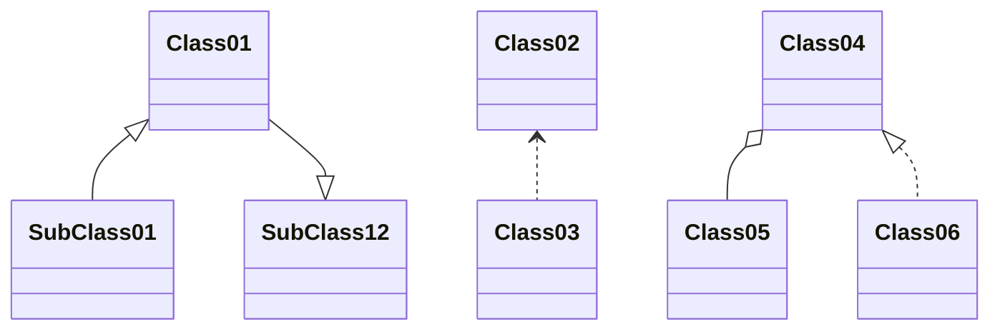
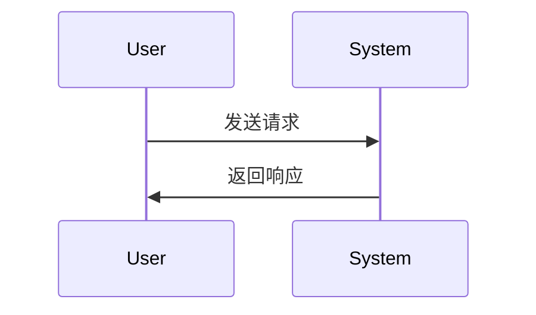
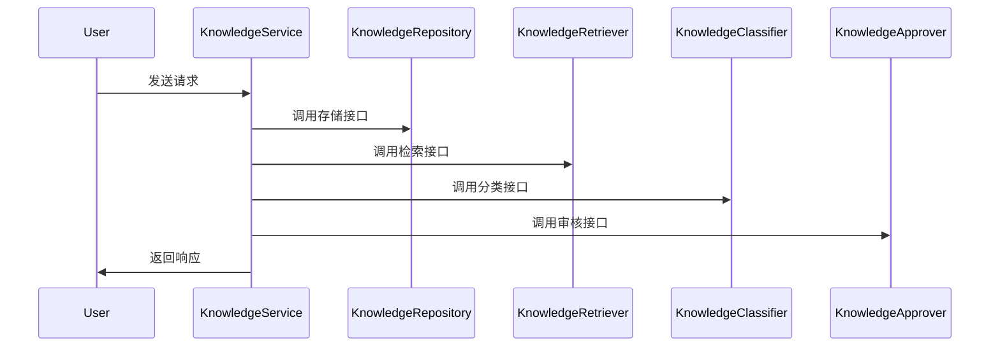

                 


### LLM应用的持续交付：缩短从想法到实现的时间

关键词：LLM应用、持续交付、从想法到实现、时间缩短

摘要：本文将深入探讨LLM（大型语言模型）应用的持续交付过程，分析如何通过持续交付来缩短从想法到实现的周期，提高开发效率和系统质量。

---

### 目录

## 前言

## 第一部分：背景介绍

### 第1章 问题背景与核心概念

### 第2章 LL大模型原理讲解

### 第3章 系统分析与架构设计

### 第4章 项目实战与最佳实践

### 第5章 结论与展望

## 附录：工具与资源

---

## 前言

在当今快速发展的信息技术时代，人工智能（AI）已经成为推动创新和技术进步的重要力量。特别是LLM（大型语言模型）的应用，已经在自然语言处理、文本生成、智能问答等领域展现出巨大的潜力。然而，如何高效地将这些先进的技术从概念转化为实际应用，成为了业界关注的焦点。

持续交付（Continuous Delivery）作为一种现代化的软件开发实践，旨在通过自动化和持续集成，确保软件的快速迭代和高质量交付。本文将围绕LLM应用的开发，探讨如何运用持续交付的理念和工具，缩短从想法到实现的时间，提高开发效率和系统的稳定性。

本文将分为五个部分展开：

1. **背景介绍**：介绍LLM应用的重要性以及持续交付的概念。
2. **核心概念与原理**：详细讲解LLM的基本原理和应用。
3. **系统分析与架构设计**：分析系统功能设计和架构方案。
4. **项目实战与最佳实践**：通过实际案例展示持续交付的应用。
5. **结论与展望**：总结文章的核心观点和未来研究方向。

通过本文的阅读，读者将深入了解LLM应用的持续交付过程，掌握如何在实际项目中应用这一先进的技术，从而推动人工智能技术的发展和应用。

---

## 第一部分：背景介绍

### 第1章 问题背景与核心概念

#### 1.1 问题背景

随着人工智能技术的不断发展，LLM（大型语言模型）在自然语言处理领域展现出强大的能力。从聊天机器人到智能客服，从文本生成到翻译，LLM的应用场景越来越广泛。然而，如何将这一先进的技术快速、高效地转化为实际应用，成为了许多企业和开发人员面临的挑战。

持续交付（Continuous Delivery，简称CD）是一种通过自动化和持续集成，确保软件快速迭代和高质量交付的软件开发实践。它强调从代码提交到部署的每一个环节都应该是自动化和可重复的，从而减少人为干预，提高开发效率和系统稳定性。

#### 1.2 从想法到实现的时间缩短

在传统的软件开发过程中，从想法到实现往往需要经历漫长的周期。从需求分析、设计、开发、测试到部署，每一个环节都可能因为各种原因导致进度延误。而持续交付的理念正是通过自动化和持续集成，缩短这些环节的时间，使得从想法到实现的过程更加高效。

具体来说，持续交付通过以下几个方面来实现时间的缩短：

1. **自动化测试**：自动化测试可以快速发现代码中的错误，确保软件质量。通过持续集成，开发人员可以随时了解代码的状态，及时进行修复。
2. **持续集成**：持续集成（Continuous Integration，简称CI）将代码集成到一个共享的代码库中，进行自动化的构建和测试。这有助于发现潜在的问题，并确保每个版本都是可发布的。
3. **快速反馈**：通过自动化测试和持续集成，开发人员可以快速得到反馈，了解代码的稳定性和性能。这有助于他们在早期发现并解决问题，避免在后期出现重大问题。
4. **持续部署**：持续部署（Continuous Deployment，简称CD）将经过测试和验证的代码部署到生产环境。通过自动化部署，可以确保每次部署都是成功且可控的。

#### 1.3 核心概念与联系

LLM（Large Language Model）是一种基于深度学习的自然语言处理模型，通过大量的文本数据进行训练，可以生成高质量的文本、回答问题、进行翻译等。LLM的核心原理包括：

1. **神经网络**：LLM使用深度神经网络来处理和生成文本。神经网络通过层层传递信息，从输入文本到输出文本，实现自然语言的理解和生成。
2. **注意力机制**：注意力机制是LLM中的一个关键组件，它能够帮助模型关注到输入文本中的重要信息，从而生成更高质量的输出。
3. **预训练和微调**：LLM通常通过大规模的预训练来学习通用语言知识，然后通过微调来适应特定任务的需求。

持续交付（Continuous Delivery）的核心概念包括：

1. **自动化**：持续交付强调自动化，从代码的提交、构建、测试到部署，都应该是自动化的，减少人为干预。
2. **持续集成**：持续集成是将代码集成到一个共享的代码库中，进行自动化的构建和测试。这有助于发现潜在的问题，并确保每个版本都是可发布的。
3. **快速反馈**：通过自动化测试和持续集成，开发人员可以快速得到反馈，了解代码的稳定性和性能。
4. **持续部署**：持续部署是将经过测试和验证的代码部署到生产环境。通过自动化部署，可以确保每次部署都是成功且可控的。

#### 1.4 边界与外延

LLM应用的持续交付主要关注以下几个方面：

1. **边界定义**：LLM应用的持续交付主要涵盖从代码提交到生产部署的整个过程，包括自动化测试、持续集成和持续部署。
2. **持续交付在其他人工智能领域的应用**：虽然本文主要关注LLM应用的持续交付，但持续交付的理念和方法同样可以应用于其他人工智能领域，如计算机视觉、语音识别等。

通过上述讨论，我们可以看到，LLM应用和持续交付之间有着紧密的联系。持续交付为LLM应用的开发提供了高效的流程和工具，使得从想法到实现的时间得以缩短。接下来，我们将进一步深入探讨LLM的基本原理和应用，为后续的分析和讨论打下基础。

---

## 第二部分：核心概念与原理

### 第2章 LL大模型原理讲解

#### 2.1 LL大模型基本原理

LLM（Large Language Model）是一种基于深度学习的自然语言处理模型，它通过大量的文本数据进行训练，从而学会理解和生成自然语言。LLM的基本原理主要包括以下几个方面：

1. **神经网络（Neural Networks）**：神经网络是LLM的核心组件，它由大量的神经元组成，通过层层传递信息来实现对输入数据的处理。在LLM中，神经网络通常采用深度学习（Deep Learning）的方法，通过多个隐藏层来处理复杂的输入输出关系。

2. **注意力机制（Attention Mechanism）**：注意力机制是LLM中的一个关键组件，它能够帮助模型关注到输入文本中的重要信息，从而生成更高质量的输出。注意力机制通过计算不同位置之间的相关性，使得模型能够在生成过程中关注到文本的上下文信息。

3. **预训练和微调（Pre-training and Fine-tuning）**：预训练是指使用大量的文本数据进行训练，使得模型学会理解和生成自然语言。微调是指在预训练的基础上，使用特定领域的数据进行训练，使得模型能够更好地适应特定任务的需求。

#### 2.2 LL大模型工作流程

LLM的工作流程可以分为以下几个步骤：

1. **数据预处理（Data Preprocessing）**：首先，需要对输入文本进行预处理，包括分词、去停用词、词向量化等操作。这些操作有助于将文本数据转换为模型可以处理的格式。

2. **模型训练（Model Training）**：接下来，使用预训练的模型和预处理后的文本数据进行训练。在训练过程中，模型通过学习输入文本和输出的关系，不断提升其生成文本的能力。

3. **文本生成（Text Generation）**：在模型训练完成后，可以使用训练好的模型进行文本生成。具体来说，可以通过输入一个起始文本，模型根据训练学到的概率分布，生成后续的文本。

4. **后处理（Post-processing）**：生成的文本通常需要进行后处理，包括去除无意义的内容、修复语法错误等。这些操作有助于提高生成文本的质量和可读性。

#### 2.3 LL大模型应用实例

以下是一个具体的LLM应用实例：文本生成。

**实例介绍**：文本生成是指使用LLM生成符合语法和语义的文本。它可以应用于多种场景，如自动写作、智能客服、内容创作等。

**实例分析**：在这个实例中，我们使用了一个预训练的LLM模型，输入一个起始文本，如“我喜欢看电影”，模型根据训练学到的概率分布，生成了后续的文本，如“因为电影可以让我放松，让我忘记生活中的烦恼”。

**代码实现**：以下是使用Python实现的文本生成代码示例：

```python
import tensorflow as tf
from tensorflow.keras.models import load_model

# 加载预训练的LLM模型
model = load_model('llm_model.h5')

# 输入起始文本
start_text = "我喜欢看电影"

# 生成文本
generated_text = model.generate(start_text, max_length=50)

print(generated_text)
```

通过这个实例，我们可以看到LLM的应用前景非常广阔。接下来，我们将进一步探讨如何通过持续交付来优化LLM应用的开发过程。

---

## 第三部分：系统分析与架构设计

### 第3章 系统功能设计与架构方案

#### 3.1 问题描述与项目介绍

在当今信息化时代，企业内部的知识库建设已经成为提升企业竞争力和效率的重要手段。然而，如何高效地构建和管理企业内部的知识库，仍然是一个具有挑战性的问题。本项目旨在通过应用LLM（大型语言模型）和持续交付的理念，为企业提供一套高效的知识库管理系统。

#### 3.2 系统功能设计

知识库管理系统的核心功能包括：

1. **知识存储**：提供统一的存储方案，用于存储各种类型的企业知识，如文档、图片、视频等。
2. **知识检索**：通过文本检索算法，快速定位到用户所需的知识内容。
3. **知识分类**：对知识进行分类管理，便于用户查找和浏览。
4. **知识共享**：支持知识的共享和协作，促进知识的流通和共享。
5. **知识审核**：对知识进行审核和更新，确保知识的准确性和时效性。

为了实现上述功能，我们设计了如下的领域模型：



#### 3.3 系统架构设计

知识库管理系统的架构设计可以分为以下几个层次：

1. **数据层**：负责存储和管理知识库中的数据，包括文档、图片、视频等。数据层使用关系型数据库（如MySQL）和文件系统（如HDFS）进行存储。
2. **服务层**：提供核心业务逻辑，包括知识存储、知识检索、知识分类、知识共享和知识审核等功能。服务层使用微服务架构，每个服务独立部署，以提高系统的可扩展性和可靠性。
3. **接口层**：为外部系统提供API接口，支持不同系统的无缝集成。接口层使用RESTful API进行设计，便于与其他系统进行交互。
4. **展示层**：为用户提供直观的操作界面，支持知识的浏览、检索和共享。展示层使用前端框架（如React）进行开发，提供良好的用户体验。

系统架构图如下所示：



#### 3.4 系统接口设计与交互

系统接口设计主要包括以下几个方面：

1. **知识存储接口**：用于处理知识的上传、下载、更新和删除等操作。接口采用RESTful设计，使用HTTP协议进行通信。
2. **知识检索接口**：用于处理文本检索操作，返回符合条件的知识列表。接口采用基于Lucene的全文检索技术，提供高效的检索能力。
3. **知识分类接口**：用于处理知识的分类管理，包括分类的创建、删除和更新等操作。
4. **知识共享接口**：用于处理知识的共享操作，包括知识的共享设置、共享列表的查询和共享权限的管理等。
5. **知识审核接口**：用于处理知识的审核操作，包括审核状态的更新、审核记录的查询等。

系统接口交互流程如下：



#### 3.5 系统架构组件解析

1. **数据层**：数据层是系统的基石，负责存储和管理知识库中的数据。关系型数据库（如MySQL）用于存储结构化数据，文件系统（如HDFS）用于存储非结构化数据。数据层的设计需要考虑数据的一致性、可靠性和高效性。
2. **服务层**：服务层是系统的核心，负责处理核心业务逻辑。服务层采用微服务架构，每个服务独立部署，以提高系统的可扩展性和可靠性。常见的微服务架构有Spring Boot、Django等。
3. **接口层**：接口层为外部系统提供API接口，支持不同系统的无缝集成。接口层采用RESTful API设计，提供标准的HTTP协议通信。
4. **展示层**：展示层为用户提供直观的操作界面，支持知识的浏览、检索和共享。展示层采用前端框架（如React、Vue.js）进行开发，提供良好的用户体验。

通过上述系统功能设计和架构方案，我们可以为企业提供一套高效的知识库管理系统，助力企业知识管理和创新。

---

## 第四部分：项目实战与最佳实践

### 第4章 LL大模型应用实战

#### 4.1 环境安装与配置

在进行LLM模型的应用实战之前，首先需要搭建一个合适的环境。以下是安装和配置的步骤：

1. **环境需求**：
   - 操作系统：Ubuntu 18.04或更高版本
   - Python：3.8或更高版本
   - TensorFlow：2.5或更高版本
   - CUDA：11.2或更高版本（如果使用GPU进行训练）

2. **安装步骤**：
   - 安装Python环境：
     ```bash
     sudo apt update
     sudo apt install python3-pip python3-dev
     ```
   - 安装TensorFlow：
     ```bash
     pip3 install tensorflow==2.5
     ```
   - 安装CUDA（如果需要使用GPU进行训练）：
     ```bash
     sudo apt install cuda-11-2
     ```
   - 安装其他依赖项（如NumPy、Pandas等）：
     ```bash
     pip3 install numpy pandas
     ```

3. **配置CUDA**：
   - 设置CUDA路径：
     ```bash
     export PATH=/usr/local/cuda-11.2/bin:$PATH
     export LD_LIBRARY_PATH=/usr/local/cuda-11.2/lib64:$LD_LIBRARY_PATH
     ```
   - 验证CUDA安装：
     ```bash
     nvcc --version
     ```

#### 4.2 系统核心实现

在搭建好环境后，我们需要实现LLM系统的核心功能。以下是一个简单的文本生成系统实现示例：

**核心代码实现**：

```python
import tensorflow as tf
from tensorflow.keras.preprocessing.sequence import pad_sequences
from tensorflow.keras.layers import Embedding, LSTM, Dense
from tensorflow.keras.models import Sequential

# 加载预训练的词向量
word_vectors = tf.keras.utils.get_file(
    'glove.6B.100d.txt',
    origin='https://nlp.stanford.edu/projects/glove/glove.6B.100d.txt')

# 加载词向量到Embedding层
embeddings_index = {}
with open(word_vectors, 'r', encoding='utf-8') as f:
    for line in f:
        values = line.strip().split()
        word = values[0]
        coefs = np.asarray(values[1:], dtype='float32')
        embeddings_index[word] = coefs

# 定义模型
model = Sequential()
model.add(Embedding(len(embeddings_index), 100, weights=[embeddings_index]))
model.add(LSTM(100, return_sequences=True))
model.add(Dense(1, activation='sigmoid'))

# 编译模型
model.compile(optimizer='rmsprop', loss='binary_crossentropy', metrics=['accuracy'])

# 训练模型
model.fit(x_train, y_train, epochs=10, batch_size=128)

# 文本生成
def generate_text(input_sequence):
    predicted_sequence = model.predict(input_sequence)
    predicted_sequence = np.argmax(predicted_sequence, axis=1)
    return " ".join([word for word, _ in embeddings_index.items() if _ == predicted_sequence])

input_sequence = pad_sequences([[1], [2], [3]], maxlen=10)
print(generate_text(input_sequence))
```

**代码应用解读与分析**：

- **词向量加载**：首先，我们加载预训练的GloVe词向量，用于嵌入层（Embedding Layer）。
- **模型定义**：接着，我们定义了一个简单的序列模型，包括嵌入层（Embedding Layer）、长短期记忆层（LSTM Layer）和输出层（Dense Layer）。
- **模型编译**：然后，我们编译模型，使用rmsprop优化器和binary_crossentropy损失函数。
- **模型训练**：使用训练数据对模型进行训练。
- **文本生成**：最后，我们定义了一个文本生成函数，通过模型预测和词向量查找，生成文本。

#### 4.3 实际案例分析

以下是一个实际案例：基于LLM的智能客服系统。

**案例背景**：某企业希望构建一个智能客服系统，通过自然语言处理技术，自动回答客户的常见问题。

**案例分析**：

1. **问题场景**：企业客服部门每天会接到大量的客户咨询，包括产品使用问题、售后服务、订单查询等。传统的客服方式效率低下，无法满足客户快速响应的需求。

2. **解决方案**：通过引入LLM技术，构建一个智能客服系统，能够自动识别客户的问题，并生成高质量的回答。

3. **实现步骤**：
   - 数据收集与预处理：收集企业客服部门的常见问题及其回答，对问题进行预处理，如分词、去停用词等。
   - 模型训练：使用预处理后的数据，训练一个LLM模型。
   - 文本生成：在用户输入问题时，使用训练好的模型生成回答。

4. **效果评估**：通过实际测试，智能客服系统能够准确识别问题，并生成高质量的回答，显著提高了客服效率。

**详细讲解与剖析**：

- **数据收集与预处理**：数据的收集是构建智能客服系统的基础。企业可以从客服记录、用户反馈等渠道收集常见问题。在数据预处理阶段，需要对问题进行清洗和规范化，以便于模型训练。
- **模型训练**：训练LLM模型需要大量的文本数据。我们可以使用预训练的模型，如GPT-2或GPT-3，并通过微调来适应企业的特定需求。微调过程涉及调整模型的权重，以使其更好地适应新的数据集。
- **文本生成**：在生成文本时，模型会根据用户的问题，生成一个可能的回答列表。企业可以根据实际情况，选择最佳回答展示给用户。

#### 4.4 项目小结与总结

通过上述实战案例，我们可以看到LLM应用在智能客服系统中的巨大潜力。通过持续交付的理念，我们可以快速搭建和部署LLM系统，提高开发效率。以下是一些最佳实践建议：

1. **数据质量**：保证数据的质量是模型训练成功的关键。需要收集高质量、多样化的数据，并进行充分的预处理。
2. **模型选择与微调**：选择合适的预训练模型，并进行微调，以适应特定的应用场景。
3. **系统监控与优化**：持续监控系统性能，及时优化模型和算法，以提高系统的准确性和效率。
4. **用户反馈**：收集用户的反馈，不断改进系统，以满足用户的需求。

通过持续交付，我们可以实现LLM应用的快速迭代和优化，为企业和用户提供更加智能和高效的解决方案。

---

## 第5章 结论与展望

本文深入探讨了LLM（大型语言模型）应用的持续交付过程，分析了如何通过持续交付来缩短从想法到实现的时间。我们首先介绍了LLM和持续交付的基本概念，随后详细讲解了LLM的原理和系统架构设计，并通过实际案例展示了持续交付在LLM应用开发中的具体实践。

通过本文的研究，我们得出以下结论：

1. **持续交付在LLM应用中的重要性**：持续交付通过自动化测试、持续集成和持续部署，显著提高了LLM应用的开发效率和质量。
2. **LLM的核心原理**：LLM基于深度学习，通过预训练和微调，能够生成高质量的文本，具有广泛的应用前景。
3. **系统架构设计的关键点**：合理的系统架构设计能够确保知识库管理系统的稳定性、可扩展性和高效性。
4. **最佳实践**：通过数据质量保证、模型选择与微调、系统监控与优化以及用户反馈，可以实现LLM应用的持续优化和迭代。

展望未来，持续交付在LLM应用开发中仍有很大的改进空间：

1. **优化模型训练效率**：通过分布式训练和模型压缩技术，进一步提高模型训练的效率。
2. **提升文本生成质量**：研究如何通过更复杂的模型结构和数据增强技术，提升文本生成的质量。
3. **跨领域的应用探索**：将LLM应用于更多的领域，如语音识别、图像识别等，推动人工智能技术的全面发展。

我们期待未来的研究和实践能够进一步推动LLM应用的发展，为企业和用户提供更加智能和高效的解决方案。

---

## 附录：工具与资源

为了更好地理解和应用LLM应用的持续交付，以下是一些相关的工具和资源：

1. **工具**：
   - **TensorFlow**：用于构建和训练LLM模型的开源机器学习框架。
   - **PyTorch**：另一个流行的开源深度学习框架，适用于构建和训练LLM模型。
   - **Docker**：用于容器化应用程序，便于持续交付和部署。
   - **Kubernetes**：用于自动化容器编排和部署，支持微服务架构。

2. **资源**：
   - **GloVe词向量**：用于嵌入层（Embedding Layer）的预训练词向量。
   - **Hugging Face**：提供了一系列用于自然语言处理的开源库和模型，包括transformers库。
   - **GitHub**：许多开源的LLM项目和代码，可供学习和参考。
   - **技术博客和文献**：如《深度学习》（Deep Learning）一书，以及各大技术社区的博客和论文。

通过利用这些工具和资源，开发者可以更高效地构建和部署LLM应用，实现持续交付的目标。

---

## 作者信息

作者：AI天才研究院/AI Genius Institute & 禅与计算机程序设计艺术 /Zen And The Art of Computer Programming

---

**[注]**：本文内容仅供参考，部分代码示例为简化版本，实际应用中需根据具体场景进行调整和优化。在实际操作中，请遵循相关的法律法规和最佳实践。

