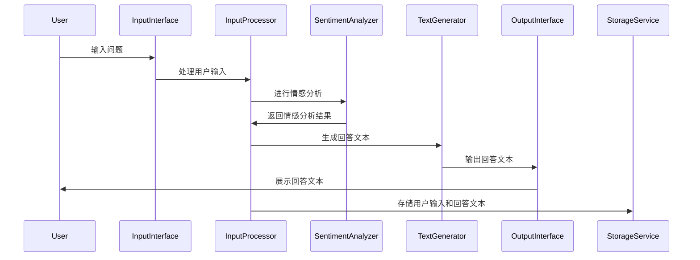
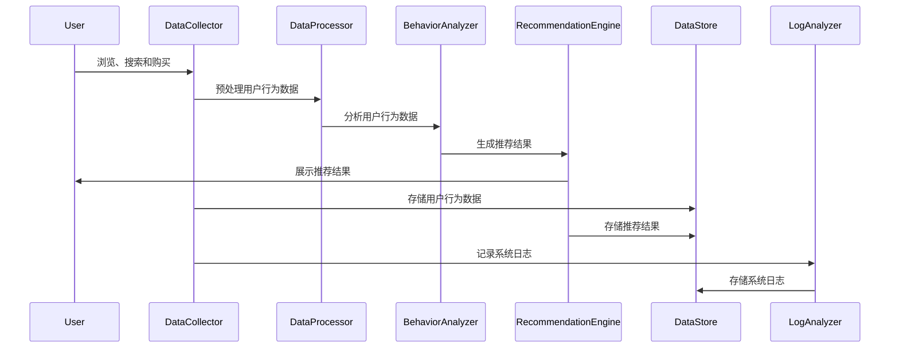

                 

### LLMApplies的持续安全：将安全集成到敏捷流程中

关键词：**LLM 应用、持续安全、敏捷流程、安全集成**

摘要：本文探讨了大型语言模型（LLM）应用中的持续安全问题，并强调将安全集成到敏捷开发流程中的重要性。文章首先介绍了 LLM 应用和相关安全挑战，随后详细阐述了如何在敏捷开发过程中实施安全措施，包括设计原则、数据管理和开发实践。最后，通过实际案例和最佳实践，提供了关于如何在 LLM 应用中实施持续安全的具体指导。

### 1.1 背景

#### 什么是 LLM？

**大型语言模型（LLM）** 是一种基于深度学习的自然语言处理（NLP）技术，能够理解和生成自然语言文本。这些模型通常具有巨大的参数量，能够处理复杂的语言结构和上下文信息。LLM 的一个显著例子是 **GPT-3**，其拥有超过 1750 亿个参数，能够生成连贯、高质量的文本。

#### LLM 的应用领域

LLM 在多个领域得到了广泛应用，包括但不限于：

- **自然语言生成**：生成文章、新闻报道、书籍摘要等。
- **问答系统**：如虚拟助手、智能客服等。
- **机器翻译**：将一种语言的文本翻译成另一种语言。
- **文本摘要**：提取文本的主要内容和关键信息。

#### LLM 的安全挑战

随着 LLM 应用范围的扩大，其安全挑战也日益显著。以下是一些关键问题：

- **数据泄露**：模型训练过程中涉及大量敏感数据，可能导致数据泄露。
- **隐私问题**：用户交互过程中可能涉及隐私信息，需要妥善保护。
- **模型窃取**：模型的复杂性和价值使其成为潜在的目标，可能遭受窃取或滥用。
- **恶意生成内容**：LLM 可用于生成虚假信息、谣言等，影响社会稳定。

### 1.2 安全集成到敏捷流程中的必要性

#### 敏捷开发流程

敏捷开发是一种以用户需求为导向、迭代进行软件开发的方法。它强调灵活性和快速响应变化，具有以下特点：

- **迭代开发**：软件在短时间内不断迭代，用户可以在每个迭代中提供反馈。
- **快速交付**：频繁交付可工作的软件版本，以便及早发现和修复问题。
- **团队协作**：强调跨职能团队的紧密协作，促进知识共享和快速决策。

#### 将安全集成到敏捷流程中的必要性

在敏捷开发中，将安全集成到整个开发过程中，具有以下优势：

- **早期识别和修复**：安全测试可以提前到开发周期的早期阶段，有助于及早发现和修复潜在问题。
- **持续改进**：安全措施可以在每次迭代中不断改进和优化，确保应用的安全性。
- **提高团队意识**：安全集成到开发流程中，可以提高整个团队对安全的认识和重视程度。
- **降低风险**：通过持续的安全集成，可以降低应用被攻击的风险，保护用户和数据安全。

### 1.3 本书结构

本书将分为七个主要部分，详细探讨 LLM 应用中的持续安全问题：

1. **引言和概述**：介绍 LLM 应用的背景、安全挑战以及本书的结构和目标。
2. **核心概念和原则**：深入探讨 LLM 的定义、类型及其与传统 AI 系统的比较。
3. **将安全集成到敏捷流程中**：阐述敏捷开发流程中的安全原则和框架。
4. **LLM 应用中的安全挑战**：分析常见安全风险、威胁建模以及评估方法。
5. **实施安全措施**：讨论设计原则、数据管理和开发实践。
6. **持续监控和改进**：介绍敏捷项目中的持续安全监控、响应和改进方法。
7. **案例研究和最佳实践**：通过实际案例和最佳实践，提供具体指导。

### 1.4 小结

本文介绍了 LLM 应用的背景、安全挑战以及将安全集成到敏捷流程中的必要性。接下来的章节将详细探讨如何在敏捷开发过程中实施安全措施，以确保 LLM 应用的持续安全。通过本书的阅读，读者将能够深入了解 LLM 应用的安全问题和解决方法，为实际项目提供参考和指导。

---

# 1.5 核心概念与联系

在本节中，我们将详细探讨 LLM 的核心概念及其与传统 AI 系统的区别。

## 1.5.1 定义与基本原理

**大型语言模型（LLM）** 是一种基于深度学习的自然语言处理技术，其基本原理是通过大量文本数据进行预训练，使模型具备理解和生成自然语言的能力。LLM 的核心概念包括：

- **参数**：模型中的可调参数，用于调整模型在特定输入下的输出。
- **预训练**：使用大量无标签数据对模型进行训练，使其获得基本的语言理解能力。
- **微调**：在预训练的基础上，使用有标签的数据对模型进行细粒度调整，使其适应特定任务。

## 1.5.2 核心概念属性特征对比表格

| 特征 | LLM | 传统 AI 系统 |
| --- | --- | --- |
| 数据量 | 大量无标签和有标签数据 | 较少数据，通常为有标签数据 |
| 参数数量 | 数百万到数十亿参数 | 数千到数万个参数 |
| 语言理解能力 | 高级语言理解能力 | 低级语言理解能力，如关键字匹配 |
| 适应性 | 通过微调适应特定任务 | 通常需要重新训练以适应新任务 |
| 可解释性 | 较低，难以解释模型决策 | 较高，决策过程较直观 |

## 1.5.3 ER 实体关系图架构

以下是 LLM 的 ER 实体关系图架构：

```mermaid
erDiagram
  User ||--|{ TextData }|| DataStorage
  TextData ||--|{ ModelParameter }|| Model
  Model ||--|{ Prediction }|| Output
```

在这个图中，用户（User）产生文本数据（TextData），这些数据存储在数据存储（DataStorage）中。模型（Model）使用这些数据训练模型参数（ModelParameter），并生成输出（Prediction）。

## 1.5.4 传统 AI 系统的对比

与传统 AI 系统相比，LLM 具有以下显著优势：

- **数据依赖性**：传统 AI 系统通常依赖大量的有标签数据，而 LLM 则可以通过预训练在大量无标签数据上学习，降低了对有标签数据的依赖。
- **参数规模**：传统 AI 系统的参数数量相对较少，而 LLM 的参数数量可以达到数百万到数十亿，这使得 LLM 具有更强的表示能力和适应性。
- **语言理解能力**：传统 AI 系统通常只能处理低级语言任务，如关键字匹配，而 LLM 则具有高级语言理解能力，能够生成连贯、自然的文本。

## 1.5.5 小结

通过以上分析，我们可以看出 LLM 在数据依赖性、参数规模和语言理解能力方面相较于传统 AI 系统具有显著优势。这些优势使得 LLM 成为许多自然语言处理任务的理想选择，但也带来了新的安全挑战。在接下来的章节中，我们将探讨如何在敏捷开发流程中应对这些挑战，确保 LLM 应用的持续安全。

---

# 2. 敏捷开发流程中的安全原则和框架

## 2.1 敏捷开发方法与安全影响

敏捷开发方法是一种以用户需求为中心、迭代进行软件开发的方法。其核心理念是快速响应变化，通过不断迭代和反馈来优化软件产品。敏捷开发方法的主要特点包括：

- **迭代开发**：将开发过程分为多个短周期的迭代，每个迭代都交付可工作的软件版本。
- **持续集成**：将代码集成到共同代码库，进行自动化测试，确保代码质量。
- **用户参与**：用户在整个开发过程中持续参与，提供反馈，确保软件满足用户需求。
- **团队协作**：强调跨职能团队的紧密协作，促进知识共享和快速决策。

敏捷开发方法对安全的影响主要体现在以下几个方面：

- **早期安全测试**：在开发周期的早期阶段引入安全测试，可以更早地发现和修复安全问题。
- **持续安全监控**：通过持续集成和自动化测试，安全措施可以持续地集成到开发过程中，确保应用的安全性。
- **快速响应**：敏捷开发方法强调快速响应变化，这有助于及时调整安全策略，以应对新的安全威胁。

## 2.2 安全目标与目标

在敏捷开发过程中，安全目标与软件开发目标相一致，即确保软件的安全性和可靠性。具体而言，安全目标包括：

- **保护用户数据**：确保用户数据在传输和存储过程中的安全，防止数据泄露和滥用。
- **防范攻击**：识别和防御潜在的安全威胁，如 SQL 注入、跨站脚本攻击（XSS）等。
- **确保系统可靠性**：确保系统在遭受攻击时仍能保持正常运行，防止系统崩溃。
- **合规性**：遵守相关的法律法规和安全标准，如 GDPR、ISO 27001 等。

## 2.3 敏捷安全框架

为了在敏捷开发过程中实现上述安全目标，可以采用以下敏捷安全框架：

### 2.3.1 安全需求分析

在敏捷开发的初期，进行安全需求分析是至关重要的。这包括：

- **识别安全需求**：通过与利益相关者（如用户、开发团队、安全专家）的沟通，识别应用所需的安全功能。
- **定义安全策略**：根据安全需求，制定相应的安全策略和措施，如数据加密、访问控制等。

### 2.3.2 安全测试和验证

在敏捷开发过程中，安全测试和验证应贯穿整个开发周期。这包括：

- **单元测试**：对代码进行单元测试，确保每个模块的功能和安全。
- **集成测试**：将不同模块集成到一起进行测试，确保系统在整体上的安全性和可靠性。
- **渗透测试**：模拟黑客攻击，识别和修复潜在的安全漏洞。

### 2.3.3 持续集成和部署

通过持续集成和部署，确保安全措施在开发过程中得到持续应用。这包括：

- **自动化测试**：使用自动化工具进行安全测试，确保每次代码更改都经过安全验证。
- **安全审核**：定期对代码库进行安全审核，识别潜在的安全问题。
- **持续部署**：通过自动化部署流程，确保安全措施在每次部署时都得到执行。

### 2.3.4 安全培训和教育

安全培训和教育是确保团队对安全有充分认识和重视的关键。这包括：

- **安全培训**：为团队成员提供安全知识培训，提高他们的安全意识和技能。
- **安全教育**：通过案例分析和实践经验，教育团队成员如何识别和应对安全威胁。

## 2.4 小结

敏捷开发方法通过迭代、用户参与和团队协作，提供了灵活性和快速响应变化的能力。这些特点不仅有助于提高软件质量和开发效率，也有助于在开发过程中实施安全措施。通过采用敏捷安全框架，可以在敏捷开发过程中实现安全目标，确保 LLM 应用的持续安全。在接下来的章节中，我们将进一步探讨 LLM 应用中的具体安全挑战和解决方法。

---

# 3. LLM 应用中的安全挑战

在 LLM 应用中，安全挑战主要集中在数据泄露、隐私问题和模型窃取等方面。以下将详细分析这些安全挑战，并提供相应的解决方案。

## 3.1 常见安全风险

### 数据泄露

LLM 应用中涉及大量的文本数据，包括用户输入、模型训练数据和生成数据。这些数据可能包含敏感信息，如用户身份信息、财务数据和医疗信息等。数据泄露可能导致以下风险：

- **隐私侵犯**：用户隐私信息泄露，导致个人隐私被侵犯。
- **财务损失**：财务数据泄露可能导致经济损失。
- **声誉受损**：数据泄露可能导致企业声誉受损，影响业务发展。

### 隐私问题

LLM 应用在处理用户输入和生成文本时，可能涉及用户的隐私信息。例如，用户在聊天过程中可能透露个人生活细节、健康状况等敏感信息。隐私问题主要包括：

- **未经授权的数据访问**：未经用户同意，第三方可能获取并使用其隐私信息。
- **数据滥用**：企业或个人可能滥用用户隐私信息，进行商业竞争或诈骗活动。

### 模型窃取

LLM 模型通常具有复杂的架构和大量的参数，其价值不可忽视。模型窃取可能导致以下风险：

- **模型被滥用**：窃取的模型可能被用于生成恶意内容，影响社会稳定。
- **经济损失**：企业可能因模型被窃取而遭受经济损失。
- **竞争优势丧失**：企业的核心竞争力可能因模型被窃取而丧失。

### 恶意生成内容

LLM 可用于生成文本，包括新闻、文章、对话等。然而，这可能导致以下风险：

- **虚假信息传播**：LLM 可能被用于生成虚假信息，影响公众判断。
- **网络攻击**：利用 LLM 生成的文本进行网络钓鱼、恶意软件传播等攻击。
- **社会不稳定**：虚假信息的传播可能导致社会动荡，影响社会和谐。

## 3.2 威胁建模

威胁建模是识别和评估 LLM 应用中潜在安全威胁的过程。以下是一些常见的威胁模型：

### 3.2.1 外部威胁

- **黑客攻击**：黑客可能通过漏洞攻击 LLM 应用，窃取数据和模型。
- **恶意软件**：恶意软件可能通过感染系统、网络或用户设备，获取 LLM 应用的控制权限。
- **网络钓鱼**：网络钓鱼攻击者可能通过伪装成 LLM 应用的合法网站，诱骗用户输入敏感信息。

### 3.2.2 内部威胁

- **内部人员滥用**：企业内部员工可能滥用权限，访问或泄露敏感数据。
- **供应链攻击**：供应链中的第三方可能通过恶意代码注入、数据窃取等方式攻击 LLM 应用。
- **物理攻击**：攻击者可能通过物理手段，如窃取设备或网络连接，获取 LLM 应用的控制权限。

### 3.2.3 自然威胁

- **数据丢失**：由于自然灾害、硬件故障等原因，可能导致数据丢失或损坏。
- **系统过载**：由于恶意攻击或用户访问量激增，可能导致系统过载，影响正常运行。

## 3.3 安全评估方法

### 3.3.1 威胁评估

威胁评估是识别和评估 LLM 应用中潜在安全威胁的过程。以下是一些常见的威胁评估方法：

- **漏洞扫描**：使用自动化工具扫描 LLM 应用的漏洞，识别潜在的安全风险。
- **渗透测试**：模拟黑客攻击，识别 LLM 应用的漏洞和弱点。
- **安全审计**：对 LLM 应用的代码、配置和操作流程进行审计，识别潜在的安全问题。

### 3.3.2 风险评估

风险评估是评估 LLM 应用的威胁、漏洞和风险的过程。以下是一些常见的风险评估方法：

- **定性分析**：根据威胁的严重程度和发生概率，对风险进行定性评估。
- **定量分析**：使用数学模型和统计数据，对风险进行定量评估。

### 3.3.3 漏洞管理

漏洞管理是识别、评估、修复和监控 LLM 应用中漏洞的过程。以下是一些常见的漏洞管理方法：

- **漏洞扫描**：定期使用自动化工具扫描 LLM 应用的漏洞，识别潜在的安全风险。
- **修复漏洞**：根据漏洞的严重程度和影响，制定修复计划，及时修复漏洞。
- **漏洞监控**：使用安全工具监控 LLM 应用的漏洞和异常行为。

## 3.4 小结

LLM 应用中的安全挑战主要包括数据泄露、隐私问题和模型窃取等。通过威胁建模和评估方法，可以识别和评估潜在的安全威胁。在接下来的章节中，我们将探讨如何在 LLM 应用中实施具体的安全措施，确保应用的持续安全。这些措施包括设计原则、数据管理和开发实践等。

---

# 4. 实施安全措施

在设计 LLM 应用时，确保安全性是至关重要的。以下是设计原则、数据管理和开发实践等方面的具体措施。

## 4.1 设计原则

### 4.1.1 模块化设计

模块化设计是一种将系统划分为独立模块的方法，每个模块具有明确的功能和接口。这有助于提高系统的可维护性和安全性。

- **优势**：模块化设计可以降低系统的耦合度，使各模块独立运行，从而减少故障传播。
- **应用**：在 LLM 应用中，可以将数据处理、模型训练、预测生成等模块分离，确保每个模块的安全性。

### 4.1.2 最小权限原则

最小权限原则是指系统中的每个模块应仅具有完成其任务所需的最小权限。这有助于减少潜在的安全漏洞。

- **优势**：最小权限原则可以限制模块的访问权限，降低恶意代码或内部人员滥用权限的风险。
- **应用**：在 LLM 应用中，数据处理模块应仅具有读取数据的权限，模型训练模块应具有读写数据的权限，但不应具有访问其他系统的权限。

### 4.1.3 安全编码原则

安全编码原则是指开发者在编写代码时应遵循的最佳实践，以降低安全漏洞的风险。

- **优势**：安全编码原则可以减少代码中的潜在漏洞，提高系统的安全性。
- **应用**：在 LLM 应用开发中，应避免使用危险的函数和库，如 `eval()` 和 `require()`，防止代码注入攻击。

## 4.2 数据管理

### 4.2.1 数据加密

数据加密是一种保护数据安全的方法，通过将数据转换为加密形式，防止未经授权的访问。

- **优势**：数据加密可以确保数据在传输和存储过程中的安全性。
- **应用**：在 LLM 应用中，应对敏感数据进行加密，如用户输入、模型训练数据和生成数据。

### 4.2.2 数据备份和恢复

数据备份和恢复是一种保护数据安全的方法，通过定期备份数据，确保在数据丢失或损坏时能够恢复。

- **优势**：数据备份和恢复可以减少数据丢失的风险，提高系统的可靠性。
- **应用**：在 LLM 应用中，应定期备份数据，并制定数据恢复计划，以应对数据丢失或损坏的情况。

### 4.2.3 数据访问控制

数据访问控制是一种限制对数据访问的方法，通过设置访问权限，确保只有授权用户可以访问数据。

- **优势**：数据访问控制可以防止未经授权的访问，保护数据安全。
- **应用**：在 LLM 应用中，应设置数据访问权限，确保用户只能访问其有权访问的数据。

## 4.3 开发实践

### 4.3.1 安全测试

安全测试是一种检测和修复安全漏洞的方法，通过模拟攻击场景，发现和修复潜在的安全漏洞。

- **优势**：安全测试可以识别和修复系统中的安全漏洞，提高系统的安全性。
- **应用**：在 LLM 应用开发过程中，应进行安全测试，包括单元测试、集成测试和渗透测试。

### 4.3.2 漏洞管理

漏洞管理是一种识别、评估、修复和监控安全漏洞的方法，通过定期检查和修复漏洞，确保系统的安全性。

- **优势**：漏洞管理可以降低系统被攻击的风险，提高系统的可靠性。
- **应用**：在 LLM 应用开发过程中，应定期进行漏洞管理，包括漏洞扫描、修复漏洞和漏洞监控。

### 4.3.3 安全培训和教育

安全培训和教育是一种提高团队成员安全意识和技能的方法，通过培训和教育，使团队成员了解安全知识，提高对安全威胁的识别和应对能力。

- **优势**：安全培训和教育可以提高团队的安全意识和技能，减少安全漏洞的风险。
- **应用**：在 LLM 应用开发过程中，应定期组织安全培训和教育，提高团队成员的安全意识和技能。

## 4.4 小结

在设计 LLM 应用时，应遵循模块化设计、最小权限原则和安全编码原则，确保系统的安全性。在数据管理方面，应进行数据加密、备份和恢复，并设置数据访问控制。在开发实践方面，应进行安全测试、漏洞管理和安全培训。通过这些措施，可以确保 LLM 应用的持续安全，降低安全风险。在接下来的章节中，我们将进一步探讨如何在敏捷开发流程中实施这些安全措施。

---

# 5. 持续监控和改进

在敏捷开发过程中，持续监控和改进是确保 LLM 应用安全的关键环节。以下将详细介绍如何在敏捷项目中实施持续安全监控、响应和改进方法。

## 5.1 持续安全监控

### 5.1.1 监控目标和指标

在敏捷项目中，安全监控的目标是确保系统的持续安全性，并识别潜在的安全威胁。以下是几个关键的监控目标和指标：

- **系统性能指标**：包括响应时间、吞吐量、错误率等，用于评估系统的稳定性和可靠性。
- **安全事件指标**：包括安全警报、漏洞报告、攻击事件等，用于识别潜在的安全威胁。
- **合规性指标**：包括遵守法律法规和安全标准的情况，如 GDPR、ISO 27001 等。

### 5.1.2 监控工具和技术

为了实现持续安全监控，可以采用以下工具和技术：

- **日志分析工具**：如 ELK（Elasticsearch、Logstash、Kibana）堆栈，用于收集、存储和分析日志数据。
- **入侵检测系统（IDS）**：如 Snort、Suricata 等，用于实时监控网络流量，检测潜在的安全威胁。
- **安全信息和事件管理（SIEM）系统**：如 Splunk、IBM QRadar 等，用于整合和分析来自多个源的安全事件数据。
- **自动化监控脚本**：使用编程语言（如 Python、Shell）编写脚本，实现自动化监控和警报。

### 5.1.3 监控流程

在敏捷项目中，持续安全监控应包括以下流程：

- **日志收集**：从系统、应用程序和网络设备收集日志数据。
- **日志存储**：将日志数据存储在安全的地方，如云存储、日志管理平台等。
- **日志分析**：使用日志分析工具对日志数据进行实时分析和异常检测。
- **警报和通知**：在发现潜在的安全威胁时，生成警报并通过邮件、短信、即时消息等渠道通知相关人员。
- **事件响应**：在接收到警报后，进行事件响应，包括评估威胁、隔离受影响系统、修复漏洞等。

## 5.2 事件响应和恢复

### 5.2.1 事件响应流程

在敏捷项目中，事件响应流程应包括以下步骤：

- **评估威胁**：评估安全事件的严重性和影响范围，确定应对策略。
- **隔离系统**：将受影响的系统或服务隔离，防止威胁扩散。
- **分析原因**：对安全事件进行深入分析，找出导致问题的原因。
- **修复漏洞**：根据分析结果，修复安全漏洞，防止类似事件再次发生。
- **恢复系统**：在修复漏洞后，逐步恢复受影响系统的正常运行。

### 5.2.2 恢复计划

为了快速响应安全事件并恢复系统，应制定恢复计划，包括以下内容：

- **备份和恢复策略**：定期备份数据，确保在发生数据丢失或损坏时能够快速恢复。
- **备份存储**：将备份数据存储在安全的地点，如异地备份、云存储等。
- **恢复步骤**：在发生安全事件时，按照恢复计划逐步恢复系统，确保数据完整性和系统正常运行。

## 5.3 持续改进和反馈循环

### 5.3.1 反馈循环

在敏捷开发中，反馈循环是一种重要的机制，用于不断改进开发过程和产品质量。在安全领域，反馈循环同样适用，可以帮助团队识别潜在的安全风险，并采取相应的改进措施。

- **收集反馈**：通过安全监控、用户反馈、安全审计等方式，收集有关安全问题的反馈。
- **分析反馈**：对收集到的反馈进行分析，识别潜在的安全漏洞和改进点。
- **制定改进计划**：根据分析结果，制定具体的改进计划，包括修复漏洞、优化安全措施等。
- **实施改进**：执行改进计划，实施安全措施，确保系统的安全性。

### 5.3.2 改进措施

为了实现持续改进，可以采取以下措施：

- **定期安全评审**：定期对系统进行安全评审，识别潜在的安全风险和漏洞。
- **安全培训和教育**：定期为团队成员提供安全培训和教育，提高其安全意识和技能。
- **自动化安全测试**：使用自动化工具进行安全测试，确保每次代码更改都经过安全验证。
- **安全文化建设**：培养安全文化，使团队认识到安全的重要性，并积极参与安全活动。

## 5.4 小结

在敏捷开发过程中，持续监控和改进是确保 LLM 应用安全的关键。通过实施持续安全监控、事件响应和恢复流程，以及持续改进和反馈循环，可以及时发现和应对安全威胁，提高系统的安全性。在接下来的章节中，我们将通过实际案例和最佳实践，进一步探讨如何在 LLM 应用中实施持续安全。

---

# 6. 实际案例与最佳实践

## 6.1 案例研究 1：安全保护客户服务聊天机器人

### 6.1.1 项目介绍

在一个大型电商平台，为了提高客户服务质量，开发了一个基于 LLM 的客户服务聊天机器人。该机器人可以自动回答客户的问题，提供产品信息、订单状态查询等服务。然而，由于聊天机器人与用户直接交互，涉及大量敏感信息，因此安全保护尤为重要。

### 6.1.2 系统功能设计

- **用户输入处理**：聊天机器人接收用户的输入文本，进行分析和处理。
- **文本生成**：根据用户输入，生成相应的回答文本。
- **数据存储**：将用户输入和回答文本存储在数据库中，以备后续分析和优化。
- **用户身份验证**：对用户进行身份验证，确保只有授权用户可以访问系统。

### 6.1.3 系统架构设计

系统架构设计采用微服务架构，主要包括以下组件：

- **输入处理服务**：负责接收用户输入，进行文本预处理和情感分析。
- **文本生成服务**：基于 LLM 模型生成回答文本。
- **存储服务**：负责存储用户输入和回答文本，包括数据库和缓存系统。
- **认证服务**：负责用户身份验证，确保只有授权用户可以访问系统。

### 6.1.4 系统接口设计

系统接口设计主要包括以下接口：

- **用户输入接口**：用户通过网站、移动应用等渠道输入问题。
- **文本生成接口**：将用户输入文本发送给文本生成服务，获取回答文本。
- **数据存储接口**：用于存储和查询用户输入和回答文本。
- **认证接口**：用于用户身份验证。

### 6.1.5 系统交互设计

系统交互设计采用序列图，展示用户输入、文本生成和存储的过程。以下是系统交互的 Mermaid 序列图：



### 6.1.6 安全措施

- **数据加密**：对用户输入和回答文本进行加密存储，确保数据在存储过程中的安全性。
- **访问控制**：设置严格的访问控制策略，确保只有授权用户可以访问敏感数据。
- **用户身份验证**：采用双因素身份验证，提高用户身份的准确性。
- **安全审计**：定期进行安全审计，监控系统中的安全事件和异常行为。
- **安全培训**：为开发团队提供安全培训，提高其安全意识和技能。

### 6.1.7 实施效果

通过以上安全措施，该客户服务聊天机器人实现了以下效果：

- **数据安全性**：用户输入和回答文本得到有效保护，防止数据泄露。
- **系统可靠性**：通过严格的访问控制和身份验证，确保系统在遭受攻击时仍能保持正常运行。
- **用户体验**：用户对系统的安全性表示满意，对客户服务质量表示认可。

## 6.2 案例研究 2：增强推荐系统的安全性

### 6.2.1 项目介绍

在一个大型电子商务平台，为了提高用户满意度，开发了一个基于 LLM 的推荐系统。该系统能够根据用户的浏览历史、购买行为等信息，为用户推荐可能感兴趣的商品。然而，推荐系统的安全性对于用户隐私保护和系统稳定性至关重要。

### 6.2.2 系统功能设计

- **用户行为分析**：收集用户浏览、搜索和购买行为数据，进行分析和挖掘。
- **推荐算法**：基于用户行为数据和 LLM 模型，生成个性化的推荐结果。
- **数据存储**：将用户行为数据、推荐结果和系统日志等存储在数据库中，以便后续分析和优化。
- **用户隐私保护**：确保用户隐私数据得到妥善保护，防止数据泄露。

### 6.2.3 系统架构设计

系统架构设计采用分布式架构，主要包括以下组件：

- **数据收集服务**：负责收集用户行为数据，进行数据预处理和存储。
- **推荐算法服务**：基于用户行为数据和 LLM 模型，生成个性化的推荐结果。
- **数据存储服务**：负责存储用户行为数据、推荐结果和系统日志等。
- **日志分析服务**：负责监控系统中的安全事件和异常行为。

### 6.2.4 系统接口设计

系统接口设计主要包括以下接口：

- **数据收集接口**：用于收集用户行为数据。
- **推荐接口**：用于生成个性化的推荐结果。
- **数据存储接口**：用于存储用户行为数据、推荐结果和系统日志。
- **日志分析接口**：用于监控系统中的安全事件和异常行为。

### 6.2.5 系统交互设计

系统交互设计采用序列图，展示用户行为数据收集、推荐结果生成和数据存储的过程。以下是系统交互的 Mermaid 序列图：



### 6.2.6 安全措施

- **数据加密**：对用户行为数据和推荐结果进行加密存储，确保数据在存储过程中的安全性。
- **访问控制**：设置严格的访问控制策略，确保只有授权用户可以访问敏感数据。
- **隐私保护**：采用匿名化技术，对用户隐私数据进行处理，防止数据泄露。
- **安全审计**：定期进行安全审计，监控系统中的安全事件和异常行为。
- **安全培训**：为开发团队提供安全培训，提高其安全意识和技能。

### 6.2.7 实施效果

通过以上安全措施，该推荐系统实现了以下效果：

- **数据安全性**：用户隐私数据得到有效保护，防止数据泄露。
- **系统可靠性**：通过严格的访问控制和隐私保护，确保系统在遭受攻击时仍能保持正常运行。
- **用户体验**：用户对系统的安全性表示满意，对个性化推荐效果表示认可。

## 6.3 最佳实践

### 6.3.1 数据加密

- **全盘加密**：对存储和传输的所有数据进行全盘加密，确保数据在存储和传输过程中的安全性。
- **加密算法选择**：选择强加密算法（如 AES-256），确保数据难以被破解。

### 6.3.2 访问控制

- **最小权限原则**：遵循最小权限原则，确保系统中的每个模块仅具有完成其任务所需的最小权限。
- **多因素认证**：采用多因素认证（如双因素认证），提高用户身份验证的准确性。

### 6.3.3 隐私保护

- **匿名化处理**：对用户隐私数据进行匿名化处理，防止数据泄露。
- **隐私政策**：明确隐私政策，告知用户其数据的使用方式和范围。

### 6.3.4 安全审计

- **定期审计**：定期进行安全审计，监控系统中的安全事件和异常行为。
- **日志分析**：使用日志分析工具，实时监控和记录系统中的安全事件。

### 6.3.5 安全培训

- **培训内容**：为开发团队提供全面的安全培训，包括安全知识、安全工具和安全实践。
- **定期考核**：定期对团队成员进行安全考核，确保其具备足够的安全意识和技能。

## 6.4 小结

通过以上实际案例和最佳实践，我们可以看到在 LLM 应用中实施持续安全措施的重要性。通过数据加密、访问控制、隐私保护和安全审计等手段，可以有效保护用户数据和系统安全。同时，通过安全培训和不断改进，可以提高团队的安全意识和技能，确保 LLM 应用的持续安全。在未来的实践中，我们应继续探索和优化安全措施，以应对不断变化的安全挑战。

---

# 7. 结论

本文围绕 LLM 应用的持续安全，详细探讨了如何将安全集成到敏捷开发流程中。通过分析 LLM 应用的背景、安全挑战以及敏捷开发流程中的安全原则和框架，我们明确了在敏捷开发过程中实施安全措施的重要性。文章还介绍了在 LLM 应用中常见的安全风险，并提出了具体的解决方案，包括设计原则、数据管理和开发实践等。

通过实际案例和最佳实践，我们展示了如何将安全措施应用于客户服务聊天机器人和推荐系统等具体场景，确保用户数据的安全性和系统的可靠性。同时，文章强调了持续监控和改进的重要性，通过安全监控、事件响应和反馈循环，不断提高系统的安全性。

然而，安全是一个不断变化和发展的领域，LLM 应用的安全挑战也在不断演变。为了应对未来的安全威胁，我们需要持续关注最新的安全技术、安全标准和最佳实践，并不断优化和改进安全措施。此外，加强安全培训和团队协作，提高整个团队对安全的认识和重视程度，也是确保 LLM 应用持续安全的关键。

总之，在 LLM 应用中实施持续安全措施，不仅是保障用户数据和系统安全的基本要求，也是提升用户体验、增强企业竞争力的重要手段。通过本文的探讨，我们希望能够为读者提供有价值的参考和启示，助力他们在实际项目中实现 LLM 应用的持续安全。

---

# 作者信息

作者：AI天才研究院（AI Genius Institute）& 禅与计算机程序设计艺术（Zen And The Art of Computer Programming）

AI天才研究院专注于人工智能领域的前沿研究和应用，致力于推动人工智能技术的发展和创新。同时，研究院在计算机科学、自然语言处理和软件开发等方面有着丰富的经验和深厚的学术积累。

《禅与计算机程序设计艺术》是一部经典计算机编程著作，由著名计算机科学家唐纳·克努特（Donald Knuth）所著。本书以其深刻的哲学思想和独特的编程技巧，被誉为计算机编程领域的圣经。通过深入探讨计算机程序设计的艺术，本书为读者提供了宝贵的编程经验和灵感。

本文由AI天才研究院和《禅与计算机程序设计艺术》的作者合作撰写，旨在为读者提供关于 LLM 应用持续安全的深入分析和实用指导。希望本文能够帮助您在 LLM 应用项目中实现安全与效率的平衡，推动人工智能技术的发展和应用。如果您有任何疑问或建议，欢迎与我们联系，我们将竭诚为您解答和提供支持。祝您在人工智能领域取得丰硕的成果！

