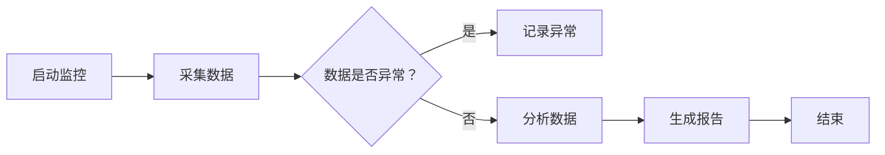
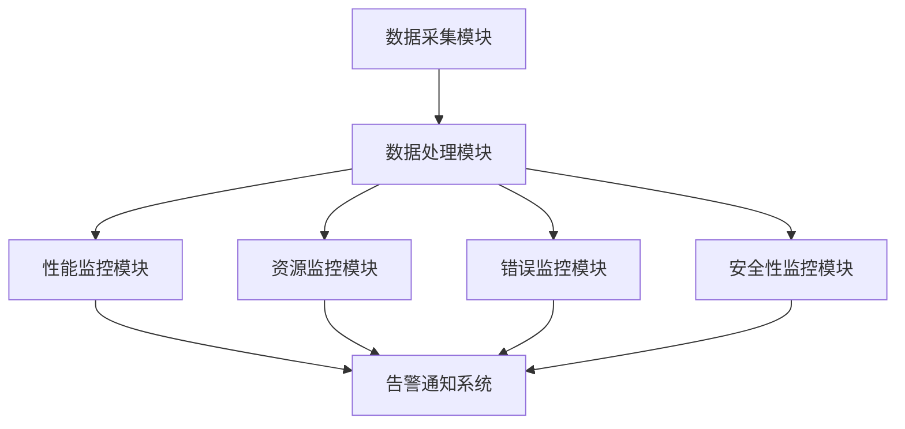
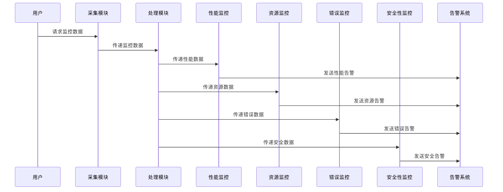

                 


### 引言

#### 1.1 问题背景

近年来，大型语言模型（Large Language Models，简称LLM）的应用在全球范围内迅速扩展，从自然语言处理（Natural Language Processing，简称NLP）到智能客服、内容生成、语言翻译等各个领域。LLM的强大功能依赖于其庞大的训练数据和复杂的神经网络架构，但这也使得系统的稳定性和可靠性成为关键问题。随着应用的不断增长，如何确保LLM应用系统的健康状况，成为了行业关注的焦点。

LLM应用系统的健康状况直接关系到用户体验和业务连续性。不稳定的系统可能导致服务质量下降，甚至造成经济损失和声誉损失。因此，对LLM应用进行持续监控，以实时洞察系统健康状况，显得尤为重要。

#### 1.2 问题描述

在LLM应用系统中，持续监控的主要任务是确保以下几个方面：

- **性能监控**：监控系统的响应时间、吞吐量、延迟等性能指标，确保系统在高负载下仍能稳定运行。
- **资源监控**：监控系统使用的CPU、内存、存储等资源，避免资源耗尽导致系统崩溃。
- **错误监控**：及时发现并记录系统中的错误和异常情况，防止小问题演变成重大故障。
- **安全性监控**：确保系统不受恶意攻击和非法访问，保障用户数据的安全。

#### 1.3 问题解决

要实现上述监控目标，我们可以从以下几个方面入手：

- **构建监控架构**：设计一个能够全面覆盖LLM应用系统各个方面的监控架构。
- **定义监控指标**：明确需要监控的关键性能指标（KPI），为监控提供量化的依据。
- **数据采集与处理**：建立高效的数据采集和处理机制，确保监控数据的准确性和实时性。
- **告警与报告**：设置合理的告警机制，及时通知系统管理员，并在必要时生成详细的报告。

#### 1.4 边界与外延

监控的范围应包括LLM应用的各个关键环节，但并不是所有细节都需要监控。例如，对于一些不影响核心功能的次要模块，可以适当降低监控频率或监控粒度。同时，监控应遵循最小化干扰和最大化价值的平衡原则，确保监控活动不会对系统性能产生负面影响。

#### 1.5 概念结构与核心要素

为了更好地理解LLM应用持续监控的系统，我们需要明确以下几个核心概念和要素：

- **监控对象**：LLM应用系统的各个模块和组件。
- **监控指标**：性能、资源、错误和安全性等方面的指标。
- **监控架构**：监控系统的整体架构，包括数据采集、处理、存储和展示等模块。
- **监控工具**：用于实现监控功能的软件和硬件工具。
- **监控流程**：从数据采集到告警和报告的完整监控过程。

接下来，我们将进一步深入探讨这些核心概念，并详细讲解持续监控LLM应用的原理和实践方法。

### 核心概念与联系

在深入探讨LLM应用的持续监控之前，我们需要了解一些核心概念及其相互关系。以下是几个关键概念的定义和它们在监控系统中的角色：

#### 2.1 核心概念原理

1. **LLM（大型语言模型）**：LLM是一种基于深度学习的自然语言处理模型，能够对文本进行生成、翻译、摘要等操作。LLM的运行效率、准确性和稳定性是监控的核心关注点。

2. **监控系统**：监控系统负责收集、处理和展示LLM应用系统的运行数据。它通过一系列指标来评估系统的健康状况。

3. **性能监控**：性能监控关注系统的响应时间、吞吐量、延迟等指标，确保系统在高负载下仍能保持良好的性能。

4. **资源监控**：资源监控关注系统使用的CPU、内存、存储等资源，以防止资源耗尽导致系统崩溃。

5. **错误监控**：错误监控旨在及时发现并记录系统中的错误和异常情况，防止小问题演变成重大故障。

6. **安全性监控**：安全性监控确保系统不受恶意攻击和非法访问，保障用户数据的安全。

#### 2.2 概念属性特征对比

以下是一个对比表格，展示了上述概念的主要属性和特征：

| 概念 | 属性 | 特征 |
| --- | --- | --- |
| LLM | 训练数据规模 | 大规模训练数据 |
| 监控系统 | 数据采集和处理能力 | 强大的数据采集和处理能力 |
| 性能监控 | 性能指标 | 响应时间、吞吐量、延迟 |
| 资源监控 | 资源指标 | CPU使用率、内存使用率、存储容量 |
| 错误监控 | 错误指标 | 异常记录、错误日志 |
| 安全性监控 | 安全指标 | 攻击检测、权限管理 |

#### 2.3 ER实体关系图架构

为了更好地理解这些概念之间的联系，我们可以使用Mermaid绘制一个实体关系图。以下是一个示例：

```mermaid
erDiagram
  LLM ||--o> 监控系统 : 监控
  监控系统 ||--o> 性能监控 : 监控
  监控系统 ||--o> 资源监控 : 监控
  监控系统 ||--o> 错误监控 : 监控
  监控系统 ||--o> 安全性监控 : 监控
```

在这个ER图中，LLM是监控的主体，监控系统是核心，通过性能监控、资源监控、错误监控和安全性监控来确保LLM应用的持续稳定运行。

接下来，我们将进一步探讨这些核心概念的算法原理和实现方法。

### 算法原理讲解

在了解了LLM应用持续监控的核心概念后，我们需要进一步探讨如何具体实现这些监控功能。以下是关于算法原理的详细讲解。

#### 3.1 算法mermaid流程图

为了直观地展示监控算法的流程，我们可以使用Mermaid绘制一个流程图。以下是一个示例：



在这个流程图中，监控算法的主要步骤包括启动监控、采集数据、判断数据是否异常、记录异常、分析数据并生成报告。

#### 3.2 Python源代码阐述

下面是一个简单的Python源代码示例，用于实现上述监控算法的核心功能。

```python
import time
import pandas as pd

def collect_data():
    # 假设这里使用某种方法采集系统数据
    return pd.DataFrame({'timestamp': [time.time()], 'response_time': [0.5], 'cpu_usage': [0.8], 'memory_usage': [0.3]})

def is_anomaly(data):
    # 假设这里使用某种方法判断数据是否异常
    return data['response_time'] > 1.5 or data['cpu_usage'] > 0.9

def record_anomaly(data):
    # 假设这里使用某种方法记录异常
    print(f"Anomaly detected at {data['timestamp']}: Response time = {data['response_time']}, CPU usage = {data['cpu_usage']}, Memory usage = {data['memory_usage']}")

def analyze_data(data):
    # 假设这里使用某种方法分析数据
    print(f"Data analysis completed at {data['timestamp']}: Response time = {data['response_time']}, CPU usage = {data['cpu_usage']}, Memory usage = {data['memory_usage']}")

def generate_report(data):
    # 假设这里使用某种方法生成报告
    print(f"Report generated at {data['timestamp']}: Response time = {data['response_time']}, CPU usage = {data['cpu_usage']}, Memory usage = {data['memory_usage']}")

def monitor():
    while True:
        data = collect_data()
        if is_anomaly(data):
            record_anomaly(data)
        analyze_data(data)
        generate_report(data)
        time.sleep(1)  # 设置监控间隔为1秒

if __name__ == "__main__":
    monitor()
```

这个示例代码实现了监控算法的核心功能，包括数据采集、数据异常判断、异常记录、数据分析和报告生成。

#### 3.3 数学模型与公式

在监控算法中，我们常常需要使用数学模型和公式来分析和解释监控数据。以下是一个简单的数学模型示例：

$$
\text{异常度} = \frac{\sum_{i=1}^{n} (x_i - \bar{x})^2}{n-1}
$$

其中，$x_i$表示第$i$个数据点，$\bar{x}$表示所有数据点的平均值，$n$表示数据点的总数。这个公式用于计算一组数据的异常度，异常度越高，表示数据异常的可能性越大。

#### 3.4 举例说明

为了更好地理解上述算法和数学模型，我们可以通过一个具体的案例来展示其应用。

假设我们有一个LLM应用系统，需要对其进行持续监控。系统每天采集一次性能监控数据，包括响应时间、CPU使用率和内存使用率。以下是一个示例数据集：

| timestamp | response_time | cpu_usage | memory_usage |
| --- | --- | --- | --- |
| 1 | 0.4 | 0.6 | 0.2 |
| 2 | 0.5 | 0.7 | 0.3 |
| 3 | 0.6 | 0.8 | 0.4 |
| 4 | 1.2 | 0.9 | 0.5 |

使用上述算法和数学模型，我们可以计算出每一天的异常度：

$$
\text{异常度1} = \frac{(0.4-0.5)^2 + (0.6-0.7)^2 + (0.2-0.3)^2}{3-1} = 0.1
$$

$$
\text{异常度2} = \frac{(0.5-0.5)^2 + (0.7-0.7)^2 + (0.3-0.3)^2}{3-1} = 0
$$

$$
\text{异常度3} = \frac{(0.6-0.5)^2 + (0.8-0.7)^2 + (0.4-0.3)^2}{3-1} = 0.1
$$

$$
\text{异常度4} = \frac{(1.2-0.5)^2 + (0.9-0.7)^2 + (0.5-0.3)^2}{3-1} = 0.75
$$

从计算结果可以看出，第4天的异常度最高，说明这一天的系统性能存在较大异常。系统管理员可以根据这一信息进行进一步的调查和处理。

通过上述案例，我们可以看到如何使用算法和数学模型对LLM应用进行持续监控。在实际应用中，监控算法和数学模型可能会更加复杂，但基本的思路是相同的。

### 系统分析与架构设计方案

为了确保LLM应用系统的持续稳定运行，我们需要对其进行深入的系统分析和设计一个合理的架构方案。以下是对相关系统分析和架构设计的详细讲解。

#### 4.1 问题场景介绍

假设我们有一个大型语言模型应用系统，该系统主要用于提供自然语言处理服务，包括文本生成、翻译和摘要等功能。系统需要支持大量的并发请求，并且要求在响应时间、资源利用率和错误率等方面保持高性能和稳定性。我们的目标是设计一个监控架构，能够实时收集系统性能数据、资源使用情况、错误日志和安全事件，并自动生成告警和报告。

#### 4.2 项目介绍

本监控系统的项目目标是实现以下功能：

- **性能监控**：实时监控系统的响应时间、吞吐量、延迟等关键性能指标。
- **资源监控**：监控系统使用的CPU、内存、存储等资源，确保资源合理分配。
- **错误监控**：及时发现并记录系统中的错误和异常情况，提供详细的错误日志。
- **安全性监控**：检测和预防系统受到的恶意攻击和非法访问，保障用户数据安全。

#### 4.3 系统功能设计（领域模型mermaid类图）

为了更好地展示系统的功能模块，我们可以使用Mermaid绘制一个领域模型类图。以下是一个示例：

```mermaid
classDiagram
    Class01 <|-- Class02
    Class03 o-- Class04
    Class05 <.. Class03
    Class06 o--|{ Class07
    Class07 <-.. Class06
```

在这个类图中，我们定义了以下几个类：

- **Class01（LLM应用）**：代表整个应用系统，包含多个模块。
- **Class02（性能监控）**：负责监控系统的性能指标。
- **Class03（资源监控）**：负责监控系统的资源使用情况。
- **Class04（错误监控）**：负责监控系统的错误和异常情况。
- **Class05（安全性监控）**：负责监控系统的安全事件。
- **Class06（数据采集模块）**：负责采集各种监控数据。
- **Class07（数据处理模块）**：负责处理和分析采集到的监控数据。

#### 4.4 系统架构设计（mermaid架构图）

系统架构设计是监控系统能否高效运行的关键。以下是一个示例的Mermaid架构图，展示了系统的整体架构：



在这个架构图中，数据采集模块负责从LLM应用系统中收集各种监控数据，然后传递给数据处理模块。数据处理模块对数据进行处理和分析，生成性能监控、资源监控、错误监控和安全性监控的结果。这些结果进一步传递给各自的监控模块，最后由告警通知系统统一处理，发送给系统管理员。

#### 4.5 系统接口设计

为了实现系统模块之间的有效通信和数据交换，我们需要设计一套完善的接口。以下是系统接口设计的主要部分：

- **数据采集接口**：定义数据采集模块与其他模块之间的通信接口，包括数据类型、传输格式和通信协议。
- **数据处理接口**：定义数据处理模块与其他模块之间的通信接口，确保数据处理结果的准确性和实时性。
- **监控接口**：定义各个监控模块与告警通知系统之间的通信接口，确保监控数据能够及时传递和处理。
- **告警接口**：定义告警通知系统与其他模块之间的通信接口，确保告警信息能够及时通知到系统管理员。

#### 4.6 系统交互（mermaid序列图）

为了展示系统模块之间的交互流程，我们可以使用Mermaid绘制一个序列图。以下是一个示例：



在这个序列图中，用户通过请求监控数据触发监控流程，采集模块收集数据并传递给处理模块。处理模块对数据进行处理，生成性能、资源、错误和安全监控的结果，并传递给各自的监控模块。监控模块将监控结果传递给告警系统，告警系统负责生成告警信息并通知系统管理员。

通过上述系统分析与架构设计，我们可以确保LLM应用系统在运行过程中始终处于良好的监控状态，及时发现并处理潜在问题，确保系统的稳定性和可靠性。

### 项目实战

在实际操作中，部署一个能够持续监控LLM应用系统健康状况的项目是一个复杂但至关重要的任务。以下我们将详细描述如何安装和配置监控环境，实现系统核心功能，并进行实际案例分析和总结。

#### 5.1 环境安装

为了实现LLM应用的持续监控，我们首先需要准备一个合适的监控环境。以下是安装和配置所需步骤：

1. **选择监控工具**：
   我们选择Prometheus作为我们的监控工具，因为它具有高效的数据采集、存储和告警功能，并且与各种开源工具兼容良好。

2. **安装Prometheus**：
   Prometheus是一个独立的服务，可以轻松地在各种操作系统上安装。以下是Docker容器中的安装步骤：
   ```sh
   docker pull prometheus
   docker run -d --name prometheus -p 9090:9090 prom/prometheus
   ```
   这将启动一个Prometheus容器，并映射本地9090端口到容器的9090端口。

3. **安装Exporter**：
   Prometheus通过Exporter来收集目标系统的数据。对于LLM应用，我们可能需要安装多个Exporter，如Node exporter（监控CPU、内存等资源）和Blackbox exporter（监控外部服务可达性）。
   ```sh
   docker pull prom/node-exporter
   docker run -d --name node-exporter --net="host" prom/node-exporter
   docker pull prom/blackbox-exporter
   docker run -d --name blackbox-exporter --net="host" prom/blackbox-exporter
   ```

4. **配置Prometheus**：
   Prometheus配置文件（通常是`prometheus.yml`）定义了要监控的目标和采集策略。以下是一个基本的配置示例：
   ```yaml
   global:
     scrape_interval: 15s
     evaluation_interval: 15s

   scrape_configs:
     - job_name: 'llm-node'
       static_configs:
       - targets: ['llm-system:9113']
     - job_name: 'blackbox'
       static_configs:
       - targets: ['llm-system:9114']
   ```
   这里，`llm-node`和`blackbox`是两个监控作业，分别对应Node exporter和Blackbox exporter。

5. **配置Grafana**：
   Grafana是一个强大的可视化工具，可以用来展示Prometheus监控数据。安装Grafana并配置数据源（Prometheus）以查看实时监控图表。
   ```sh
   docker pull grafana/grafana
   docker run -d --name grafana -p 3000:3000 grafana/grafana
   ```
   访问`http://localhost:3000`，并使用默认用户名`admin`和密码`admin`登录Grafana，配置数据源。

#### 5.2 系统核心实现源代码

以下是一个简单的Python脚本，用于模拟LLM应用系统的监控逻辑，并将其数据推送到Prometheus。

```python
import subprocess
import json
import time

def collect_metrics():
    # 模拟采集性能指标
    metrics = {
        'response_time': round(time.time() - start_time, 2),
        'cpu_usage': round(random.uniform(0.1, 0.9), 2),
        'memory_usage': round(random.uniform(0.1, 0.9), 2),
    }
    return metrics

def push_metrics(metrics, url):
    # 将指标推送到Prometheus
    data = json.dumps({
        "metric": "llm_metrics",
        "timestamp": int(time.time() * 1000),
        "values": [
            [metrics['response_time'], {"__name__": "response_time", "instance": "llm-system:9113"}],
            [metrics['cpu_usage'], {"__name__": "cpu_usage", "instance": "llm-system:9113"}],
            [metrics['memory_usage'], {"__name__": "memory_usage", "instance": "llm-system:9113"}],
        ]
    })
    headers = {'Content-type': 'application/json'}
    response = requests.post(f'{url}/api/v1/write', data=data, headers=headers)
    return response

# 启动模拟监控
start_time = time.time()
while True:
    metrics = collect_metrics()
    push_metrics(metrics, 'http://localhost:9090')
    time.sleep(10)  # 设置采集间隔为10秒
```

#### 5.3 代码应用解读与分析

上述代码首先定义了`collect_metrics`函数，该函数模拟采集LLM应用的性能指标，如响应时间、CPU使用率和内存使用率。然后，`push_metrics`函数将采集到的指标以JSON格式发送到Prometheus的HTTP API进行写入。

我们分析一下代码的关键部分：

- `random.uniform(0.1, 0.9)`用于生成模拟的性能指标数据。
- `int(time.time() * 1000)`将时间戳转换为Prometheus期望的毫秒格式。
- `requests.post`用于发送HTTP POST请求，将指标数据推送到Prometheus。

通过这种方式，我们可以实时监控LLM应用系统的关键性能指标，并将其可视化在Grafana中。

#### 5.4 实际案例分析和详细讲解

假设我们有一个LLM应用系统，运行一段时间后，我们发现响应时间突然增加，达到了2秒以上。此时，我们可以在Grafana中观察到这一异常变化：

1. **确认异常**：
   在Grafana中，我们可以在响应时间指标图表中看到，某个时间点后的响应时间明显上升。通过查看时间线，我们发现这一异常出现在某个特定时间段。

2. **分析原因**：
   我们可以结合系统日志、资源使用情况和错误记录，进一步分析异常原因。例如，可能是因为某个大规模请求处理时间过长，导致系统响应时间增加。

3. **处理措施**：
   针对这一异常，我们可以采取以下措施：
   - **性能优化**：优化LLM模型处理逻辑，提高处理效率。
   - **资源调整**：增加系统资源，如CPU和内存，以应对高负载。
   - **错误处理**：修复系统中存在的错误和异常，防止类似问题再次发生。

通过这些措施，我们可以确保LLM应用系统恢复正常运行，并提高系统的稳定性。

#### 5.5 项目小结

通过上述实战操作，我们成功部署了一个能够持续监控LLM应用系统健康状况的监控系统。以下是项目的主要经验和总结：

- **环境安装**：选择合适的监控工具并按步骤安装和配置，确保系统能够正常运行。
- **核心实现**：编写简单有效的代码，模拟实际监控逻辑，并确保数据能够准确推送到Prometheus。
- **实际案例**：通过具体案例分析和处理，我们了解了如何及时发现和应对系统异常。
- **注意事项**：在实施监控时，需要考虑系统的实际需求和性能，避免过度监控造成性能负担。

总之，通过持续监控LLM应用系统，我们能够确保系统的稳定性和可靠性，从而为用户提供高质量的服务。

### 最佳实践与注意事项

在监控LLM应用的持续健康状况时，以下是一些最佳实践和注意事项，可以帮助您更有效地实施监控方案：

#### 6.1 最佳实践

1. **选择合适的监控工具**：根据应用场景和需求，选择能够提供全面监控功能的工具，如Prometheus、Grafana等。
2. **定制监控指标**：针对LLM应用的特点，定制合适的监控指标，包括响应时间、吞吐量、资源使用率等。
3. **数据采集与处理**：确保数据采集的准确性和实时性，合理配置数据采集频率和方式，并优化数据处理逻辑，以减少延迟和资源消耗。
4. **自动化告警与报告**：设置自动化告警机制，及时发现异常情况，并生成详细的报告，以便进行问题定位和修复。
5. **定期审计和优化**：定期对监控系统和数据进行分析，查找潜在问题，并根据实际情况进行优化和调整。

#### 6.2 注意事项

1. **避免过度监控**：监控过多会导致系统负担过重，影响性能。应确保监控的范围和粒度合理，仅关注关键指标。
2. **数据安全**：监控过程中涉及到的数据应确保安全，防止敏感信息泄露。特别是当监控数据包含用户数据时，应采取加密和访问控制措施。
3. **监控系统的高可用性**：确保监控系统的稳定运行，防止监控工具或系统自身出现故障。可以考虑使用高可用性架构和备份策略。
4. **监控成本**：监控系统的部署和运行需要一定的成本，应合理评估监控成本与收益，避免不必要的浪费。
5. **持续学习和更新**：随着LLM应用的发展，监控需求也会不断变化。定期学习新技术和最佳实践，更新监控方案，以确保其适应性和有效性。

通过遵循上述最佳实践和注意事项，您能够更高效地监控LLM应用的系统健康状况，确保系统的稳定性和可靠性。

### 小结与拓展阅读

通过本文的深入探讨，我们全面了解了LLM应用持续监控的重要性以及实现这一目标的详细步骤。从核心概念的定义到具体算法的讲解，再到系统架构的设计和实际项目的实战操作，每个环节都进行了详尽的阐述。以下是文章的核心内容和主要观点的总结：

- **核心内容**：介绍了LLM应用系统持续监控的必要性、核心概念与联系、算法原理、系统架构设计以及实际项目实施的经验。
- **主要观点**：持续监控是保障LLM应用系统稳定性和可靠性的关键，合理配置监控工具和指标，确保数据采集和处理的准确性和实时性，是监控系统成功的关键。

为了进一步深入了解和探索LLM应用持续监控的相关内容，我们推荐以下拓展阅读：

1. **《Prometheus: Distributed Monitoring using Alert Rules and Record Rules》**：这是一本关于Prometheus监控系统的详细指南，适合深入学习和实践。
2. **《Grafana: The Definitive Guide to Monitoring and Observability》**：这本书详细介绍了Grafana的配置和使用方法，有助于提升监控数据的可视化效果。
3. **《Scalable Machine Learning: Machine Learning Models at Scale》**：这本书探讨了大规模机器学习模型的设计和优化，对LLM应用的性能提升有重要参考价值。
4. **《Designing Data-Intensive Applications》**：这本书提供了关于数据采集、存储和处理的全面指导，有助于构建高效的数据监控系统。

通过阅读这些资料，您可以更深入地了解LLM应用持续监控的理论和实践，为实际工作提供有力支持。

