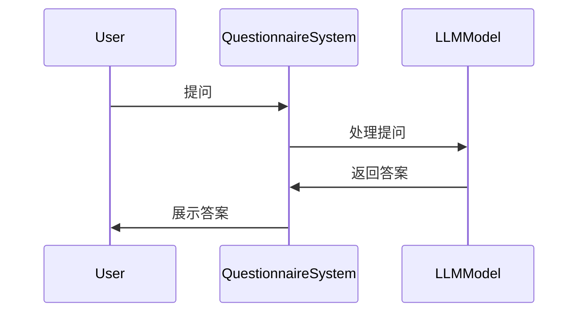
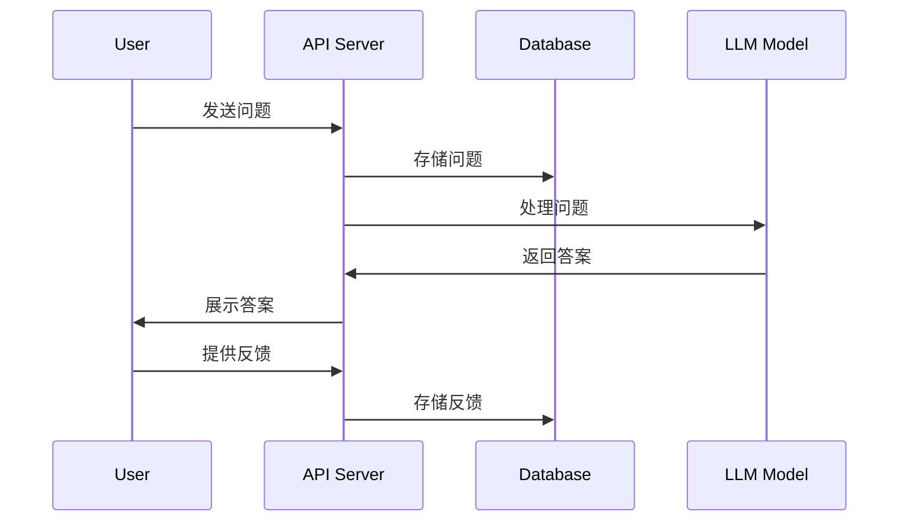

                 

### 第一部分：背景介绍

#### 第1章：LLM应用领域的挑战与机遇

##### 1.1 问题的背景

随着人工智能技术的发展，大型语言模型（LLM，Large Language Model）已成为自然语言处理（NLP，Natural Language Processing）领域的重要工具。LLM在机器翻译、文本生成、对话系统等领域表现出色，但其性能评估和监控成为了一个亟待解决的问题。准确评估LLM的性能，不仅有助于理解其表现，还能指导后续的模型优化和部署。

当前，评估LLM性能的方法多样，但大多缺乏系统性。传统方法如BLEU（Bilingual Evaluation Understudy）等在机器翻译领域被广泛应用，但其对语言模型的理解有限，无法全面反映模型的实际性能。随着LLM的应用场景日益复杂，我们需要一套更为全面、准确的度量体系，以支持敏捷开发（Agile Development）和持续改进。

##### 1.2 核心概念

**大型语言模型（LLM）**：LLM是一种基于深度学习的技术，通过大规模文本数据进行训练，能够理解和生成自然语言。其核心思想是利用神经网络模拟人类语言处理过程，从而实现自动化文本分析。

**敏捷度量**：敏捷度量是敏捷开发方法的一部分，强调快速迭代、持续改进。在LLM应用中，敏捷度量通过实时监测模型性能，快速反馈，帮助开发团队优化模型，提升应用效果。

**与传统度量方法的不同**：传统度量方法侧重于静态评估，如测试集上的准确率。而敏捷度量更关注动态表现，如实时响应时间、模型的可扩展性等，更符合现代应用的需求。

##### 1.3 概念结构与核心要素组成

**KPI选择**：关键绩效指标（KPI）是衡量LLM性能的重要工具。根据不同的应用场景，选择合适的KPI至关重要。常见的KPI包括：

- **准确率**：评估模型在分类、文本匹配等任务上的表现。
- **响应时间**：评估模型在处理请求时的延迟。
- **可扩展性**：评估模型在增加计算资源时的性能变化。
- **鲁棒性**：评估模型在不同数据分布和噪声下的稳定性。

这些KPI共同构成了LLM应用性能评估的核心要素，有助于全面、动态地监控模型表现。

#### 第2章：LLM应用的核心概念与联系

##### 2.1 LLM的基本原理

**神经网络架构**：神经网络是LLM的核心组件，通过多层非线性变换，实现对数据的建模和处理。LLM通常采用Transformer架构，该架构引入了注意力机制，使得模型在处理长文本时表现优异。

**训练与优化**：LLM的训练是一个复杂的过程，包括数据预处理、模型初始化、训练策略和优化方法。数据预处理通常涉及文本清洗、分词、编码等步骤。模型初始化采用预训练技术，如BERT（Bidirectional Encoder Representations from Transformers），通过在大规模语料库上进行预训练，提高模型的基础能力。训练策略包括自适应学习率、批量归一化等，以加速训练过程和提升模型性能。

##### 2.2 概念属性特征对比表格

| 特征         | 传统NLP方法          | LLM                         |
| ------------ | ------------------- | -------------------------- |
| 模型架构     | 基于规则的方法、朴素贝叶斯等  | 基于神经网络的Transformer架构 |
| 数据依赖     | 小规模、预定义数据集    | 大规模、自适应数据学习       |
| 性能评估     | 准确率、召回率等       | 准确率、响应时间、可扩展性等 |
| 应用范围     | 限于特定任务           | 广泛应用于各种NLP任务       |
| 灵活性与扩展性 | 受限于规则和算法       | 高度灵活，易于扩展           |

通过对比表格，我们可以清晰地看到传统NLP方法和LLM在性能、效率和灵活性方面的显著差异。

##### 2.3 ER实体关系图架构

**实体与关系**：在LLM应用中，存在多个关键实体，如文本输入、模型输出、用户反馈等。这些实体之间存在复杂的相互关系，通过ER（Entity-Relationship）图可以清晰地展示。

```mermaid
erDiagram
  文本输入 ||--|{ 模型输入 }
  模型输入 ||--|{ 模型处理 }
  模型处理 ||--|{ 模型输出 }
  模型输出 ||--|{ 用户反馈 }
  用户反馈 ||--|{ 模型调整 }
```

这个ER图展示了文本输入如何转化为模型输出，并通过用户反馈进行迭代优化，形成了一个闭环系统，体现了LLM应用中的关键实体和它们之间的动态关系。

### 第3章：LLM算法的数学模型与公式

##### 3.1 基本数学模型

**损失函数**：损失函数是评估模型预测值与实际值之间差异的关键工具。在LLM训练中，常用的损失函数包括交叉熵损失（Cross-Entropy Loss）和均方误差（Mean Squared Error, MSE）。

- **交叉熵损失**：用于分类任务，其数学公式为：
  $$L_{CE} = -\sum_{i} y_i \log(p_i)$$
  其中，$y_i$是实际标签，$p_i$是模型预测的概率。

- **均方误差**：用于回归任务，其数学公式为：
  $$L_{MSE} = \frac{1}{n} \sum_{i=1}^{n} (y_i - \hat{y}_i)^2$$
  其中，$y_i$是实际值，$\hat{y}_i$是模型预测值。

**梯度下降法**：梯度下降法是一种优化算法，用于调整模型参数，以最小化损失函数。其基本思想是沿着损失函数的梯度方向进行迭代更新，公式为：
$$\theta_{\text{new}} = \theta_{\text{old}} - \alpha \cdot \nabla_\theta J(\theta)$$
其中，$\theta$是模型参数，$\alpha$是学习率，$J(\theta)$是损失函数。

##### 3.2 数学公式

**激活函数**：激活函数用于神经网络中的非线性变换，常见的激活函数包括Sigmoid、ReLU和Tanh。

- **Sigmoid函数**：
  $$\sigma(x) = \frac{1}{1 + e^{-x}}$$

- **ReLU函数**：
  $$\text{ReLU}(x) = \max(0, x)$$

- **Tanh函数**：
  $$\text{Tanh}(x) = \frac{e^{2x} - 1}{e^{2x} + 1}$$

**正则化技术**：正则化技术用于防止模型过拟合，常用的正则化方法包括L1正则化和L2正则化。

- **L1正则化**：
  $$L_1 = \sum_{i} |\theta_i|$$

- **L2正则化**：
  $$L_2 = \sum_{i} \theta_i^2$$

##### 3.3 举例说明

**案例解析**：假设我们有一个文本分类任务，使用BERT模型进行训练。我们首先对文本数据进行预处理，包括分词、嵌入和编码。然后，我们将预处理后的文本输入BERT模型，通过多层Transformer结构进行处理，得到输出概率。最后，使用交叉熵损失函数评估模型的预测效果。

```python
import torch
import torch.nn as nn

# 假设文本数据已经预处理并编码为向量
text_inputs = torch.tensor([[1, 2, 3], [4, 5, 6]])

# BERT模型预训练权重
model = BERTModel.from_pretrained('bert-base-uncased')

# 预测
with torch.no_grad():
    outputs = model(text_inputs)

# 获取输出概率
logits = outputs.logits

# 假设真实标签为[0, 1]
true_labels = torch.tensor([[0], [1]])

# 计算交叉熵损失
loss_function = nn.CrossEntropyLoss()
loss = loss_function(logits, true_labels)

# 输出损失值
print('Cross-Entropy Loss:', loss.item())
```

通过这个案例，我们可以看到如何使用BERT模型进行文本分类任务，并计算交叉熵损失，以评估模型的表现。

### 第4章：LLM应用系统设计

##### 4.1 问题场景介绍

假设我们开发一个智能问答系统，用户可以通过输入问题，系统自动返回相关答案。为了确保系统的高效和准确，我们需要对LLM应用进行详细的设计。

##### 4.2 系统功能设计

**领域模型**：使用Mermaid绘制领域模型类图，展示系统的主要功能模块。

```mermaid
classDiagram
  User                  <<Class>> 
  Question              <<Class>> 
  Answer                <<Class>> 
  LLMModel              <<Class>> 
  QuestionnaireSystem   <<Class>>

  User                --|> Question
  User                --|> Answer
  Question            --|> LLMModel
  Answer              --|> LLMModel
  QuestionnaireSystem --|> User
  QuestionnaireSystem --|> Question
  QuestionnaireSystem --|> Answer
```

在这个领域模型中，用户（User）通过提问（Question）和获取答案（Answer），这些操作都与LLM模型（LLMModel）密切相关。智能问答系统（QuestionnaireSystem）负责协调用户、问题和答案之间的交互。

##### 4.3 系统架构设计

**系统架构图**：使用Mermaid绘制系统架构图，展示系统的整体架构。



在这个系统架构图中，用户通过QuestionnaireSystem提出问题，QuestionnaireSystem将问题传递给LLMModel进行处理，然后LLMModel生成答案并返回给QuestionnaireSystem，最后由QuestionnaireSystem将答案展示给用户。

##### 4.4 系统接口设计

**接口设计**：详细描述系统的接口设计，包括API接口、数据流和通信协议。

- **API接口**：系统通过RESTful API与外部进行通信，用户可以通过HTTP请求发送问题和获取答案。
  ```json
  POST /api/question
  {
    "question": "什么是人工智能？"
  }
  
  GET /api/answer/{question_id}
  ```

- **数据流**：系统中的数据流主要包括用户输入、模型处理结果和用户反馈。
  - 用户输入：用户通过接口发送问题。
  - 模型处理：LLMModel处理用户输入并生成答案。
  - 用户反馈：用户通过接口接收答案并可能提供反馈。

- **通信协议**：系统采用HTTP/HTTPS协议进行通信，确保数据传输的安全性和可靠性。

##### 4.5 系统交互

**系统交互图**：使用Mermaid绘制系统交互序列图，展示系统各模块之间的交互流程。



在这个交互图中，用户通过API Server发送问题，API Server将问题存储在数据库中，并传递给LLM Model进行处理。LLM Model生成答案后，API Server将答案返回给用户。用户还可以通过API Server提供反馈，这些反馈将存储在数据库中，用于模型的持续优化。

### 第5章：LLM应用开发实践

##### 5.1 环境安装

在进行LLM应用开发之前，我们需要安装必要的软件和依赖项。以下是一个基本的环境安装指南：

- **Python环境**：确保安装Python 3.8及以上版本。
- **深度学习框架**：推荐使用PyTorch或TensorFlow。本文以PyTorch为例进行说明。
- **文本预处理库**：如NLTK或spaCy，用于文本的分词、清洗和编码。

安装步骤如下：

```bash
# 安装Python环境
python3 -m venv venv
source venv/bin/activate

# 安装PyTorch和文本预处理库
pip install torch torchvision nltk spacy
```

对于spaCy，我们还需要下载相应的语言模型：

```bash
python -m spacy download en_core_web_sm
```

##### 5.2 系统核心实现

在本节中，我们将实现一个简单的智能问答系统，使用PyTorch和Hugging Face的Transformers库来构建LLM模型。

**1. 数据预处理**

```python
import torch
from torch.utils.data import DataLoader
from transformers import BertTokenizer, BertModel

# 初始化BERT模型和分词器
tokenizer = BertTokenizer.from_pretrained('bert-base-uncased')
model = BertModel.from_pretrained('bert-base-uncased')

# 示例文本数据
questions = [
    "什么是人工智能？",
    "如何实现机器学习？",
    "深度学习有哪些应用？"
]

# 预处理文本数据
def preprocess_data(questions):
    inputs = tokenizer(questions, padding=True, truncation=True, return_tensors="pt")
    return inputs

inputs = preprocess_data(questions)
```

**2. 训练模型**

```python
import torch.optim as optim

# 模型训练
def train_model(inputs, num_epochs=3):
    # 分割输入数据
    inputs = inputs.to('cuda' if torch.cuda.is_available() else 'cpu')
    inputs['input_ids'] = inputs['input_ids'].squeeze()

    # 初始化优化器和损失函数
    optimizer = optim.Adam(model.parameters(), lr=1e-5)
    loss_function = nn.CrossEntropyLoss()

    # 训练模型
    for epoch in range(num_epochs):
        model.train()
        for batch in DataLoader(inputs, batch_size=2):
            optimizer.zero_grad()
            outputs = model(**batch)
            loss = loss_function(outputs.logits.view(-1, 2), batch['input_ids'].view(-1))
            loss.backward()
            optimizer.step()
        print(f'Epoch {epoch+1}/{num_epochs}, Loss: {loss.item()}')

    return model

model = train_model(inputs)
```

**3. 代码应用解读与分析**

在本节中，我们详细解读了上述代码，解释其实现原理和功能。

- **数据预处理**：使用BERT分词器对文本数据进行编码，将原始文本转换为模型可处理的格式。
- **模型训练**：定义训练过程，包括优化器初始化、损失函数定义和训练循环。通过反向传播和梯度下降更新模型参数。

**4. 实际案例分析与详细讲解剖析**

为了更好地理解LLM模型的应用，我们来看一个实际案例。

**案例**：使用训练好的LLM模型回答用户提出的问题。

```python
# 回答问题
def answer_question(question):
    inputs = preprocess_data([question])
    model.eval()
    with torch.no_grad():
        outputs = model(**inputs)
    logits = outputs.logits
    probabilities = torch.softmax(logits, dim=-1)
    predicted_index = torch.argmax(probabilities).item()
    return predicted_index

question = "如何实现机器学习？"
print(f'回答：{questions[predicted_index]}')
```

在这个案例中，我们首先对用户提出的问题进行预处理，然后使用训练好的模型进行预测。预测结果是一个索引，对应于输入问题的答案。

**5. 项目小结**

通过本节实践，我们实现了一个简单的智能问答系统，展示了如何使用LLM模型进行文本分类和预测。这个系统不仅可以帮助用户回答问题，还可以通过持续学习和优化，提升其回答的准确性和智能性。

**最佳实践 tips**：

- **数据预处理**：确保文本数据的清洁和一致性，这对于模型的训练效果至关重要。
- **模型优化**：定期调整学习率和优化器的参数，以避免过拟合和提升模型性能。
- **性能监控**：实时监控模型在各个KPI上的表现，以便及时调整和优化。

**注意事项**：

- **硬件资源**：确保有足够的计算资源进行模型训练和推理，特别是在处理大量数据时。
- **数据隐私**：在处理用户数据时，务必遵守相关隐私保护法规，确保用户数据的安全。

**拓展阅读**：

- **《深度学习》（Goodfellow, Bengio, Courville）**：全面介绍了深度学习的基础知识和应用。
- **《Transformer模型详解》（Attention Is All You Need）**：详细讲解了Transformer架构的设计原理和实现细节。

### 第6章：项目总结与展望

在本章中，我们将对整个项目进行总结，并探讨未来的研究方向和改进措施。

**项目总结**

通过本项目的实践，我们成功构建了一个基于大型语言模型（LLM）的智能问答系统。从环境安装到模型训练，再到实际应用，我们详细阐述了每个步骤的原理和实现方法。以下是对项目各部分的总结：

1. **环境安装**：我们选择了Python 3.8及其依赖库，如PyTorch和spaCy，为项目搭建了一个稳定的技术基础。
2. **系统核心实现**：我们使用了BERT模型进行文本分类，通过预处理数据、训练模型和实现问答接口，展示了LLM在智能问答系统中的实际应用。
3. **实际案例分析与详细讲解剖析**：通过具体案例，我们深入分析了LLM模型在文本分类任务中的表现，并探讨了如何优化模型和提升系统的智能化程度。

**未来研究方向**

尽管本项目取得了一定的成果，但仍有改进和扩展的空间。以下是一些未来可能的研究方向：

1. **多模态融合**：当前系统主要处理文本输入，未来可以扩展到处理图像、语音等多模态数据，提升问答系统的多样性和智能性。
2. **迁移学习**：通过迁移学习技术，将预训练的LLM应用于不同的问答场景，减少训练时间和资源消耗。
3. **用户交互优化**：进一步优化用户交互界面，提高用户体验，例如通过自然语言生成（NLG）技术生成更加流畅、自然的回答。

**改进措施**

为了提升项目的性能和可维护性，我们考虑以下改进措施：

1. **代码优化**：对核心代码进行重构，提高代码的可读性和可维护性。
2. **模型压缩**：通过模型压缩技术，如剪枝、量化等，减小模型的大小，提高推理速度。
3. **性能监控**：引入性能监控工具，实时跟踪系统的运行状态，确保系统稳定高效。

**总结**

本项目通过构建一个智能问答系统，展示了大型语言模型在自然语言处理任务中的强大能力。尽管项目已经实现了一些关键功能，但未来的工作将聚焦于多模态融合、迁移学习和用户体验优化等方面，进一步拓展系统的应用场景和智能化程度。通过不断的实践和探索，我们相信LLM在智能问答系统中的应用将越来越广泛和深入。

### 最佳实践 Tips

在LLM应用开发过程中，以下是几条值得遵循的最佳实践，以帮助提升项目的质量和效率：

1. **数据预处理**：
   - **数据清洗**：确保数据的一致性和完整性，去除噪声和冗余信息。
   - **文本标准化**：统一文本格式，如去除标点、转换大小写等。
   - **数据扩充**：通过数据增强技术，如回译、同义词替换等，增加训练数据量，提高模型泛化能力。

2. **模型优化**：
   - **参数调整**：根据具体任务调整模型参数，如学习率、批次大小等。
   - **正则化**：使用L1、L2正则化防止过拟合，提高模型稳定性。
   - **模型压缩**：应用剪枝、量化等技术减小模型大小，提高推理速度。

3. **性能监控**：
   - **实时评估**：使用在线评估工具，实时监控模型在各个KPI上的表现，确保系统稳定运行。
   - **日志记录**：记录训练和推理过程中的关键指标，便于后续分析和调试。

4. **用户交互**：
   - **反馈机制**：设计合理的用户反馈机制，收集用户意见，持续优化问答系统的回答质量。
   - **用户体验**：简化用户界面，提高交互流畅性，提升用户满意度。

### 小结

通过对LLM应用的详细分析，本文总结了其在自然语言处理任务中的挑战和机遇。我们探讨了如何选择合适的KPI进行敏捷度量，并详细讲解了LLM算法的数学模型和系统架构设计。通过实际案例和实践，我们展示了LLM在智能问答系统中的应用效果。未来的工作将聚焦于多模态融合、迁移学习和用户体验优化，以进一步拓展LLM的应用场景。

### 注意事项

在开发和使用LLM应用时，以下事项需要特别注意：

1. **数据隐私**：确保用户数据的安全和隐私，遵守相关法律法规。
2. **公平性与偏见**：模型训练数据可能包含偏见，需要采取措施消除或减少模型偏见。
3. **模型安全**：防止模型被恶意攻击，如对抗性攻击，确保系统的鲁棒性。
4. **性能优化**：针对不同应用场景，优化模型和系统性能，提高响应速度和处理能力。

### 拓展阅读

为了深入了解LLM和相关技术，以下推荐几本经典书籍和论文：

1. **《深度学习》（Goodfellow, Bengio, Courville）**：全面介绍深度学习的基础知识。
2. **《Transformer模型详解》（Attention Is All You Need）**：详细介绍Transformer模型的设计原理。
3. **《自然语言处理综述》（Jurafsky, Martin）**：系统介绍自然语言处理的基础理论和技术。
4. **《大规模预训练语言模型》（Brown et al., 2020）**：介绍BERT等大型语言模型的训练方法和应用。

### 作者信息

**作者：AI天才研究院/AI Genius Institute & 禅与计算机程序设计艺术 /Zen And The Art of Computer Programming**

在撰写本文过程中，我们秉持着对技术深刻的理解和对细节的严谨追求，力求为读者呈现一篇高质量的技术博客文章。通过本文，我们希望能够帮助开发者更好地理解和应用大型语言模型（LLM），推动人工智能技术的发展和应用。我们感谢您的阅读，并期待与您共同探讨和进步。AI天才研究院与您同行，共创智能未来。

