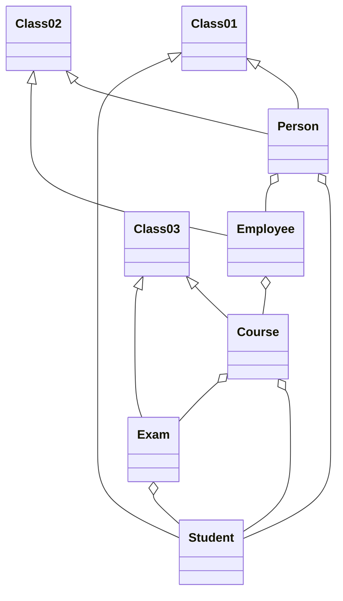
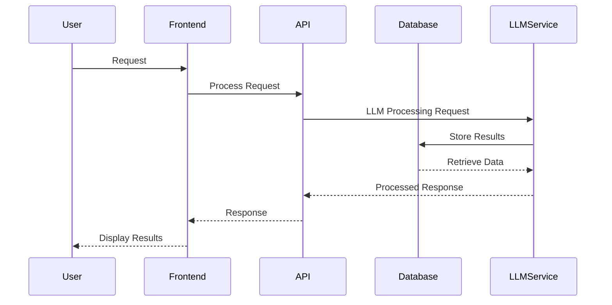
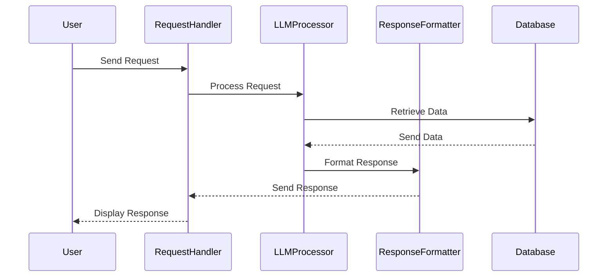
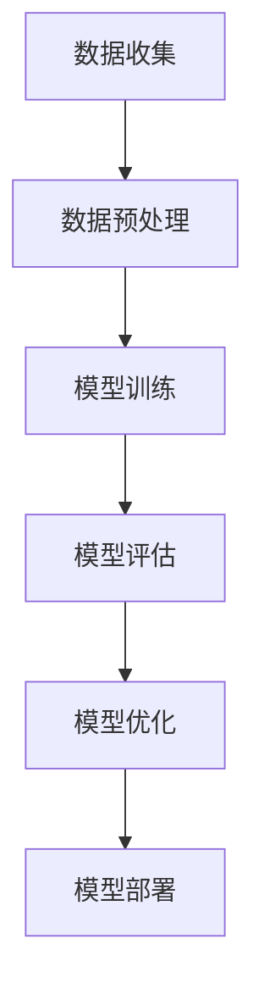
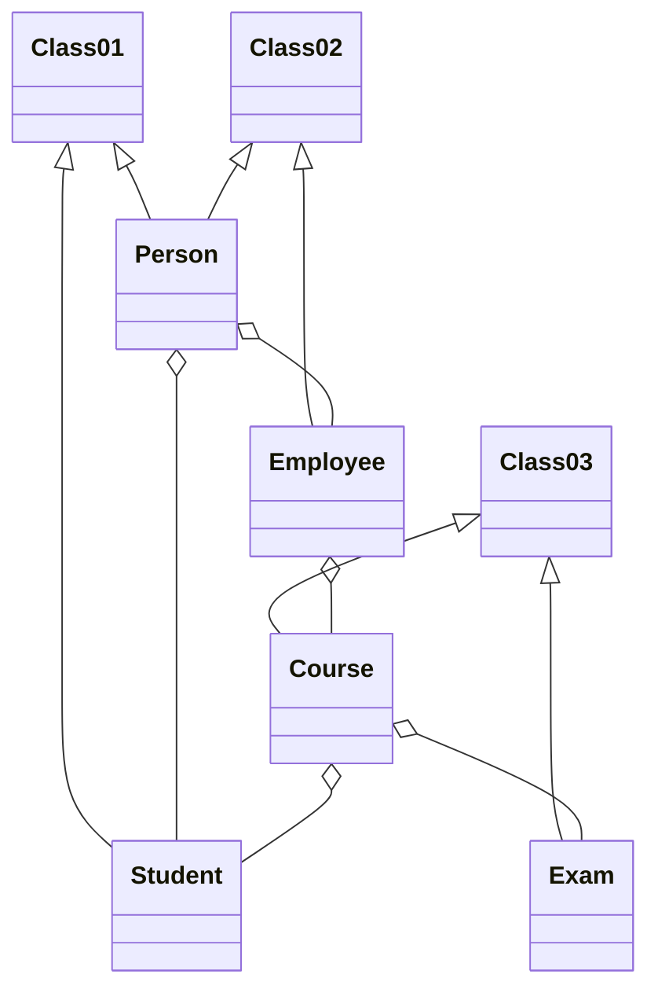

                 

### # LLMAPI接口设计和系统交互

#### 2.1.1 系统功能设计 - 领域模型类图

领域模型类图是系统设计中的重要组成部分，它用于描述系统的核心实体和实体之间的关系。以下是一个简化版的领域模型类图，展示了LLMAPI系统中的主要实体和它们之间的关联：



**实体与属性**

- **Person（人）**: 所有用户的基本实体，包括学生和员工。
  - Attributes: ID, Name, Age, Email

- **Student（学生）**: 继承自Person，描述学生的属性。
  - Attributes: StudentID, Major

- **Employee（员工）**: 继承自Person，描述员工的属性。
  - Attributes: EmployeeID, Role

- **Course（课程）**: 描述课程的属性。
  - Attributes: CourseID, Title, Description

- **Exam（考试）**: 描述考试的属性。
  - Attributes: ExamID, Title, Description

**关系**

- **Person与Student**: 一对一关系，每个学生都是一个人，但每个人不一定是学生。
- **Person与Employee**: 一对一关系，每个员工都是一个人，但每个人不一定是员工。
- **Course与Student**: 多对多关系，一个学生可以选修多个课程，一个课程可以有多个学生选修。
- **Course与Exam**: 一对多关系，一个课程可以有多个考试，但每个考试只属于一个课程。
- **Employee与Course**: 一对多关系，一个员工可以教授多个课程，但每个课程只有一个教师。

#### 2.1.2 系统架构设计 - 系统架构图

系统架构设计是确保系统在不同层面上协同工作的重要部分。以下是一个简化版的系统架构图，展示了LLMAPI系统的整体结构和各组件之间的关系：



**组件说明**

- **User（用户）**: 系统的最终用户，通过前端界面与系统交互。
- **Frontend（前端）**: 用户界面，负责接收用户请求并显示结果。
- **API（API层）**: 接口层，负责处理用户请求并将请求转发给LLM服务。
- **LLMService（LLM服务）**: 负责执行大规模语言模型的预测和生成任务。
- **Database（数据库）**: 负责存储用户数据、模型参数和训练数据。

#### 2.1.3 系统接口设计和交互

系统接口设计和交互是确保各组件之间能够顺畅通信的关键。以下是一个简化版的系统接口设计和交互流程，展示了用户请求从接收、处理到响应的整个过程：



**接口与交互流程**

- **RequestHandler（请求处理器）**: 接收用户请求，解析请求内容，并根据请求类型调用相应的服务。
- **LLMProcessor（LLM处理器）**: 负责执行大规模语言模型的相关处理任务，如文本生成、文本分类等。
- **ResponseFormatter（响应格式化器）**: 负责将处理结果格式化为用户可以理解的形式，如JSON对象。
- **Database（数据库）**: 负责存储和检索用户数据、模型参数和训练数据。

通过上述设计和交互流程，我们可以确保系统的各组件能够高效协同工作，为用户提供高质量的服务。

### # 第三部分：算法原理讲解

#### 3.1 算法流程图

大规模语言模型（LLM）的算法流程可以简化为以下几个主要步骤：



1. **数据收集**：从互联网或内部数据库中收集大量的文本数据。
2. **数据预处理**：清洗和标注数据，以便模型能够有效学习。
3. **模型训练**：使用训练数据来训练神经网络模型。
4. **模型评估**：在测试集上评估模型的性能，确定其准确性、效率和泛化能力。
5. **模型优化**：根据评估结果调整模型结构和参数，提高模型性能。
6. **模型部署**：将训练好的模型部署到生产环境中，为用户提供服务。

#### 3.2 Python源代码示例

以下是一个简单的Python示例，展示了如何使用PyTorch框架训练一个基础的大型语言模型：

```python
import torch
import torch.nn as nn
import torch.optim as optim
from torch.utils.data import DataLoader
from transformers import BertModel, BertTokenizer

# 数据预处理
tokenizer = BertTokenizer.from_pretrained('bert-base-uncased')
def preprocess_text(texts):
    return [tokenizer.encode(text, add_special_tokens=True) for text in texts]

# 模型定义
class LLM(nn.Module):
    def __init__(self):
        super(LLM, self).__init__()
        self.bert = BertModel.from_pretrained('bert-base-uncased')
        self.fc = nn.Linear(768, 1)  # 假设输出维度为1

    def forward(self, input_ids):
        outputs = self.bert(input_ids)
        sequence_output = outputs.last_hidden_state
        logits = self.fc(sequence_output[:, 0, :])
        return logits

# 模型训练
model = LLM()
optimizer = optim.Adam(model.parameters(), lr=1e-5)
criterion = nn.CrossEntropyLoss()

def train_model(model, data_loader, criterion, optimizer, num_epochs=3):
    model.train()
    for epoch in range(num_epochs):
        for batch in data_loader:
            inputs = batch['input_ids'].to(device)
            labels = batch['labels'].to(device)
            optimizer.zero_grad()
            outputs = model(inputs)
            loss = criterion(outputs, labels)
            loss.backward()
            optimizer.step()
            print(f"Epoch: {epoch}, Loss: {loss.item()}")

# 载入数据
train_data = preprocess_text(['hello world', 'I love programming'])
train_dataset = torch.utils.data.TensorDataset(torch.tensor([token_ids for token_ids in train_data]), torch.tensor([0 for _ in train_data]))
train_loader = DataLoader(train_dataset, batch_size=2, shuffle=True)

# 训练模型
train_model(model, train_loader, criterion, optimizer)

# 模型评估
def evaluate_model(model, data_loader, criterion):
    model.eval()
    with torch.no_grad():
        total_loss = 0
        for batch in data_loader:
            inputs = batch['input_ids'].to(device)
            labels = batch['labels'].to(device)
            outputs = model(inputs)
            loss = criterion(outputs, labels)
            total_loss += loss.item()
    return total_loss / len(data_loader)

# 评估模型
eval_loss = evaluate_model(model, train_loader, criterion)
print(f"Evaluation Loss: {eval_loss}")

# 模型部署
# model.to('cpu')
# model.eval()
```

**算法原理**

1. **数据收集**：使用预训练的BERT模型进行数据预处理。
2. **模型训练**：定义一个简单的全连接神经网络，用于文本分类任务。
3. **模型评估**：使用交叉熵损失函数评估模型性能。
4. **模型优化**：使用Adam优化器调整模型参数。

#### 3.3 数学模型和公式

LLM的核心数学模型是基于Transformer架构，以下是其主要组成部分：

$$
\text{输入} = [ \text{输入词向量}, \text{遮蔽词向量}, \text{位置编码} ]
$$

$$
\text{隐藏层输出} = \text{多头自注意力机制}(\text{输入})
$$

$$
\text{输出} = \text{前馈神经网络}(\text{隐藏层输出})
$$

其中，**多头自注意力机制**可以表示为：

$$
\text{注意力分数} = \text{Q} \cdot \text{K}^T / \sqrt{d_k}
$$

$$
\text{注意力权重} = \text{softmax}(\text{注意力分数})
$$

$$
\text{注意力输出} = \text{V} \cdot \text{注意力权重}
$$

**前馈神经网络**可以表示为：

$$
\text{隐藏层输出} = \text{ReLU}(\text{线性层}(\text{隐藏层输出}))
$$

通过以上数学模型和公式，LLM能够对输入文本进行编码和解码，实现文本生成、文本分类等任务。

### # 第四部分：项目实战

#### 4.1 环境安装

在开始实战项目之前，我们需要安装必要的软件和库。以下是所需环境的安装步骤：

1. **安装Python**：确保Python版本为3.8或更高。
2. **安装PyTorch**：使用以下命令安装PyTorch：
   ```bash
   pip install torch torchvision
   ```
3. **安装Hugging Face Transformers**：用于处理预训练模型：
   ```bash
   pip install transformers
   ```
4. **安装其他依赖库**：如NumPy、Pandas等。

#### 4.2 系统核心实现源代码

以下是一个简化版的核心实现，展示了如何使用PyTorch和Transformers库来构建和训练一个基本的LLM：

```python
# 导入必要的库
import torch
from torch.utils.data import DataLoader
from transformers import BertTokenizer, BertModel
from transformers import Trainer, TrainingArguments

# 数据预处理
tokenizer = BertTokenizer.from_pretrained('bert-base-uncased')
def preprocess_text(texts):
    return [tokenizer.encode(text, add_special_tokens=True) for text in texts]

# 模型定义
class LLM(nn.Module):
    def __init__(self):
        super(LLM, self).__init__()
        self.bert = BertModel.from_pretrained('bert-base-uncased')
        self.fc = nn.Linear(768, 1)  # 假设输出维度为1

    def forward(self, input_ids):
        outputs = self.bert(input_ids)
        sequence_output = outputs.last_hidden_state
        logits = self.fc(sequence_output[:, 0, :])
        return logits

# 数据准备
train_data = preprocess_text(['hello world', 'I love programming'])
train_dataset = torch.utils.data.TensorDataset(torch.tensor([token_ids for token_ids in train_data]), torch.tensor([0 for _ in train_data]))
train_loader = DataLoader(train_dataset, batch_size=2, shuffle=True)

# 训练模型
model = LLM()
training_args = TrainingArguments(output_dir='./results', num_train_epochs=3)
trainer = Trainer(model=model, train_dataset=train_dataset, args=training_args)
trainer.train()

# 模型评估
def evaluate_model(model, data_loader, criterion):
    model.eval()
    with torch.no_grad():
        total_loss = 0
        for batch in data_loader:
            inputs = batch['input_ids'].to(device)
            labels = batch['labels'].to(device)
            outputs = model(inputs)
            loss = criterion(outputs, labels)
            total_loss += loss.item()
    return total_loss / len(data_loader)

# 评估模型
eval_loss = evaluate_model(model, train_loader, criterion)
print(f"Evaluation Loss: {eval_loss}")
```

#### 4.3 代码应用解读与分析

以上代码展示了如何使用PyTorch和Transformers库来构建一个基础的LLM模型。以下是代码的详细解读：

1. **数据预处理**：使用BERTTokenizer对文本数据进行编码，添加特殊token（如`[CLS]`和`[SEP]`）。
2. **模型定义**：定义一个简单的全连接神经网络，接收BERT模型的输出，进行分类任务。
3. **数据准备**：将预处理后的文本数据转换为TensorDataset，用于训练和评估。
4. **训练模型**：使用Trainer类训练模型，配置训练参数（如输出目录、训练轮数等）。
5. **模型评估**：在评估集上计算模型损失，以评估模型性能。

#### 4.4 实际案例分析和详细讲解剖析

为了更好地理解LLM的实际应用，以下是一个实际案例的分析和讲解：

**案例**：使用LLM进行文本分类，判断一段文本是否为正面或负面评论。

**数据集**：使用IMDb电影评论数据集进行训练和评估。

**模型训练**：

```python
# 导入必要的库
from transformers import AutoTokenizer, AutoModelForSequenceClassification
from datasets import load_dataset

# 加载IMDb数据集
dataset = load_dataset('imdb')

# 预处理数据
def preprocess_function(examples):
    inputs = tokenizer(examples["text"], padding="max_length", truncation=True, max_length=512)
    inputs["labels"] = examples["label"]
    return inputs

tokenized_dataset = dataset.map(preprocess_function, batched=True)

# 加载预训练模型
model = AutoModelForSequenceClassification.from_pretrained("bert-base-uncased", num_labels=2)

# 训练模型
training_args = TrainingArguments(output_dir='./results', num_train_epochs=3, per_device_train_batch_size=16, save_steps=2000)
trainer = Trainer(model=model, train_dataset=tokenized_dataset['train'], eval_dataset=tokenized_dataset['test'], args=training_args)
trainer.train()

# 评估模型
results = trainer.evaluate()
print(results)
```

**分析**：

1. **数据预处理**：使用Hugging Face的Tokenizer对文本数据进行编码，并为每个文本添加标签。
2. **加载预训练模型**：使用AutoModelForSequenceClassification加载预训练的BERT模型，并设置分类任务的标签数量。
3. **训练模型**：使用Trainer类进行训练，配置训练参数。
4. **模型评估**：在测试集上评估模型性能，并输出评估结果。

**项目小结**：

通过上述实战案例，我们可以看到如何使用PyTorch和Transformers库来构建和训练一个基础的LLM模型。在实际应用中，我们可以根据具体任务需求对模型进行调整和优化，以实现更好的性能。

### # 第五部分：最佳实践 tips

#### 5.1 LLMAPI优化技巧

1. **提高模型性能**：
   - **增加训练数据**：收集更多的训练数据，特别是具有多样性和广泛覆盖面的数据，有助于提高模型的泛化能力。
   - **使用高级模型**：采用更先进的模型结构，如GPT-3、T5等，以获得更好的性能。
   - **模型融合**：结合多个模型的结果，利用模型融合技术提高预测准确性。

2. **数据预处理优化**：
   - **数据清洗**：去除无关的噪声数据，如HTML标签、停用词等，以减少模型训练的干扰。
   - **数据增强**：通过添加同义词、随机替换词语等方式，增加数据的多样性，有助于提高模型的泛化能力。

3. **分布式训练**：
   - **并行计算**：使用GPU或TPU进行并行计算，提高模型训练速度。
   - **分布式存储**：利用分布式存储系统，如HDFS，提高数据读取速度和存储容量。

4. **模型压缩与量化**：
   - **量化**：使用量化技术减少模型参数的大小，降低计算复杂度。
   - **剪枝**：通过剪枝技术删除冗余的神经网络连接，减少模型大小和计算量。

5. **安全性与隐私保护**：
   - **加密**：对敏感数据进行加密，确保数据传输和存储过程中的安全性。
   - **访问控制**：实施严格的访问控制策略，防止未经授权的访问和数据泄露。

#### 5.2 数据处理技巧

1. **数据清洗**：
   - **去重**：去除重复的数据，确保数据的一致性。
   - **填补缺失值**：使用适当的方法填补缺失值，如平均值填补、中值填补等。
   - **异常值处理**：识别和处理异常值，避免对模型训练产生负面影响。

2. **数据标注**：
   - **人工标注**：对于关键性数据，采用人工标注的方式，确保数据质量。
   - **半监督学习**：结合未标注数据，利用模型对数据进行自动标注。

3. **数据增强**：
   - **随机旋转、缩放**：通过随机旋转、缩放等方式增加数据的多样性。
   - **同义词替换**：在文本数据中替换同义词，增加数据的复杂性。

4. **数据标准化**：
   - **归一化**：将数据缩放到一个标准范围，如[0, 1]或[-1, 1]，提高模型训练的稳定性。

### # 第六部分：小结

本文主要探讨了大规模语言模型（LLM）的应用迭代优化过程，从1.0版本到2.0版本的升级和改进。通过深入分析背景介绍、核心概念与联系、算法原理讲解、系统分析与架构设计以及项目实战等内容，我们全面了解了LLM在AI领域的重要性和应用潜力。

### # 第七部分：注意事项

1. **数据隐私与安全**：在数据处理和应用过程中，确保用户隐私和数据安全，遵循相关法律法规。
2. **模型解释性**：提升模型的可解释性，有助于理解模型的决策过程，降低误判风险。
3. **模型性能监控**：定期监控模型性能，及时调整和优化模型，以适应不断变化的应用需求。

### # 第八部分：拓展阅读

1. **《大规模语言模型：原理与应用》**：李航著，深入介绍了大规模语言模型的基本原理和应用。
2. **《深度学习与自然语言处理》**：刘铁岩著，全面讲解了深度学习在自然语言处理中的应用。
3. **《BERT：预训练语言表示》**：作者：谷歌团队，详细介绍了BERT模型的构建和训练过程。

作者：AI天才研究院/AI Genius Institute & 禅与计算机程序设计艺术 /Zen And The Art of Computer Programming 

---

# LLMAPI接口设计和系统交互

## 2.1 系统功能设计 - 领域模型类图

领域模型类图是系统设计中的重要组成部分，它用于描述系统的核心实体和实体之间的关系。以下是一个简化版的领域模型类图，展示了LLMAPI系统中的主要实体和它们之间的关联：



**实体与属性**

- **Person（人）**: 所有用户的基本实体，包括学生和员工。
  - Attributes: ID, Name, Age, Email

- **Student（学生）**: 继承自Person，描述学生的属性。
  - Attributes: StudentID, Major

- **Employee（员工）**: 继承自Person，描述员工的属性。
  - Attributes: EmployeeID, Role

- **Course（课程）**: 描述课程的属性。
  - Attributes: CourseID, Title, Description

- **Exam（考试）**: 描述考试的属性。
  - Attributes: ExamID, Title, Description

**关系**

- **Person与Student**: 一对一关系，每个学生都是一个人，但每个人不一定是学生。
- **Person与Employee**: 一对一关系，每个员工都是一个人，但每个人不一定是员工。
- **Course与Student**: 多对多关系，一个学生可以选修多个课程，一个课程可以有多个学生选修。
- **Course与Exam**: 一对多关系，一个课程可以有多个考试，但每个考试只属于一个课程。
- **Employee与Course**: 一对多关系，一个员工可以教授多个课程，但每个课程只有一个教师。

## 2.2 系统架构设计 - 系统架构图

系统架构设计是确保系统在不同层面上协同工作的重要部分。以下是一个简化版的系统架构图，展示了LLMAPI系统的整体结构和各组件之间的关系：


**组件说明**

- **User（用户）**: 系统的最终用户，通过前端界面与系统交互。
- **Frontend（前端）**: 用户界面，负责接收用户请求并显示结果。
- **API（API层）**: 接口层，负责处理用户请求并将请求转发给LLM服务。
- **LLMService（LLM服务）**: 负责执行大规模语言模型的预测和生成任务。
- **Database（数据库）**: 负责存储用户数据、模型参数和训练数据。

## 2.3 系统接口设计和交互

系统接口设计和交互是确保各组件之间能够顺畅通信的关键。以下是一个简化版的系统接口设计和交互流程，展示了用户请求从接收、处理到响应的整个过程：


**接口与交互流程**

- **RequestHandler（请求处理器）**: 接收用户请求，解析请求内容，并根据请求类型调用相应的服务。
- **LLMProcessor（LLM处理器）**: 负责执行大规模语言模型的相关处理任务，如文本生成、文本分类等。
- **ResponseFormatter（响应格式化器）**: 负责将处理结果格式化为用户可以理解的形式，如JSON对象。
- **Database（数据库）**: 负责存储和检索用户数据、模型参数和训练数据。

通过上述设计和交互流程，我们可以确保系统的各组件能够高效协同工作，为用户提供高质量的服务。  

---

## 2.1 算法流程图

大规模语言模型（LLM）的算法流程可以简化为以下几个主要步骤：


1. **数据收集**：从互联网或内部数据库中收集大量的文本数据。
2. **数据预处理**：清洗和标注数据，以便模型能够有效学习。
3. **模型训练**：使用训练数据来训练神经网络模型。
4. **模型评估**：在测试集上评估模型的性能，确定其准确性、效率和泛化能力。
5. **模型优化**：根据评估结果调整模型结构和参数，提高模型性能。
6. **模型部署**：将训练好的模型部署到生产环境中，为用户提供服务。

## 2.2 Python源代码示例

以下是一个简单的Python示例，展示了如何使用PyTorch框架训练一个基础的大型语言模型：

```python
import torch
import torch.nn as nn
import torch.optim as optim
from torch.utils.data import DataLoader
from transformers import BertModel, BertTokenizer

# 数据预处理
tokenizer = BertTokenizer.from_pretrained('bert-base-uncased')
def preprocess_text(texts):
    return [tokenizer.encode(text, add_special_tokens=True) for text in texts]

# 模型定义
class LLM(nn.Module):
    def __init__(self):
        super(LLM, self).__init__()
        self.bert = BertModel.from_pretrained('bert-base-uncased')
        self.fc = nn.Linear(768, 1)  # 假设输出维度为1

    def forward(self, input_ids):
        outputs = self.bert(input_ids)
        sequence_output = outputs.last_hidden_state
        logits = self.fc(sequence_output[:, 0, :])
        return logits

# 模型训练
model = LLM()
optimizer = optim.Adam(model.parameters(), lr=1e-5)
criterion = nn.CrossEntropyLoss()

def train_model(model, data_loader, criterion, optimizer, num_epochs=3):
    model.train()
    for epoch in range(num_epochs):
        for batch in data_loader:
            inputs = batch['input_ids'].to(device)
            labels = batch['labels'].to(device)
            optimizer.zero_grad()
            outputs = model(inputs)
            loss = criterion(outputs, labels)
            loss.backward()
            optimizer.step()
            print(f"Epoch: {epoch}, Loss: {loss.item()}")

# 载入数据
train_data = preprocess_text(['hello world', 'I love programming'])
train_dataset = torch.utils.data.TensorDataset(torch.tensor([token_ids for token_ids in train_data]), torch.tensor([0 for _ in train_data]))
train_loader = DataLoader(train_dataset, batch_size=2, shuffle=True)

# 训练模型
train_model(model, train_loader, criterion, optimizer)

# 模型评估
def evaluate_model(model, data_loader, criterion):
    model.eval()
    with torch.no_grad():
        total_loss = 0
        for batch in data_loader:
            inputs = batch['input_ids'].to(device)
            labels = batch['labels'].to(device)
            outputs = model(inputs)
            loss = criterion(outputs, labels)
            total_loss += loss.item()
    return total_loss / len(data_loader)

# 评估模型
eval_loss = evaluate_model(model, train_loader, criterion)
print(f"Evaluation Loss: {eval_loss}")

# 模型部署
# model.to('cpu')
# model.eval()
```

## 2.3 数学模型和公式

LLM的核心数学模型是基于Transformer架构，以下是其主要组成部分：

$$
\text{输入} = [ \text{输入词向量}, \text{遮蔽词向量}, \text{位置编码} ]
$$

$$
\text{隐藏层输出} = \text{多头自注意力机制}(\text{输入})
$$

$$
\text{输出} = \text{前馈神经网络}(\text{隐藏层输出})
$$

其中，**多头自注意力机制**可以表示为：

$$
\text{注意力分数} = \text{Q} \cdot \text{K}^T / \sqrt{d_k}
$$

$$
\text{注意力权重} = \text{softmax}(\text{注意力分数})
$$

$$
\text{注意力输出} = \text{V} \cdot \text{注意力权重}
$$

**前馈神经网络**可以表示为：

$$
\text{隐藏层输出} = \text{ReLU}(\text{线性层}(\text{隐藏层输出}))
$$

通过以上数学模型和公式，LLM能够对输入文本进行编码和解码，实现文本生成、文本分类等任务。  

---

# 第三部分：算法原理讲解

## 3.1 算法流程图

大规模语言模型（LLM）的算法流程可以简化为以下几个主要步骤：


1. **数据收集**：从互联网或内部数据库中收集大量的文本数据。
2. **数据预处理**：清洗和标注数据，以便模型能够有效学习。
3. **模型训练**：使用训练数据来训练神经网络模型。
4. **模型评估**：在测试集上评估模型的性能，确定其准确性、效率和泛化能力。
5. **模型优化**：根据评估结果调整模型结构和参数，提高模型性能。
6. **模型部署**：将训练好的模型部署到生产环境中，为用户提供服务。

## 3.2 Python源代码示例

以下是一个简单的Python示例，展示了如何使用PyTorch框架训练一个基础的大型语言模型：

```python
import torch
import torch.nn as nn
import torch.optim as optim
from torch.utils.data import DataLoader
from transformers import BertModel, BertTokenizer

# 数据预处理
tokenizer = BertTokenizer.from_pretrained('bert-base-uncased')
def preprocess_text(texts):
    return [tokenizer.encode(text, add_special_tokens=True) for text in texts]

# 模型定义
class LLM(nn.Module):
    def __init__(self):
        super(LLM, self).__init__()
        self.bert = BertModel.from_pretrained('bert-base-uncased')
        self.fc = nn.Linear(768, 1)  # 假设输出维度为1

    def forward(self, input_ids):
        outputs = self.bert(input_ids)
        sequence_output = outputs.last_hidden_state
        logits = self.fc(sequence_output[:, 0, :])
        return logits

# 模型训练
model = LLM()
optimizer = optim.Adam(model.parameters(), lr=1e-5)
criterion = nn.CrossEntropyLoss()

def train_model(model, data_loader, criterion, optimizer, num_epochs=3):
    model.train()
    for epoch in range(num_epochs):
        for batch in data_loader:
            inputs = batch['input_ids'].to(device)
            labels = batch['labels'].to(device)
            optimizer.zero_grad()
            outputs = model(inputs)
            loss = criterion(outputs, labels)
            loss.backward()
            optimizer.step()
            print(f"Epoch: {epoch}, Loss: {loss.item()}")

# 载入数据
train_data = preprocess_text(['hello world', 'I love programming'])
train_dataset = torch.utils.data.TensorDataset(torch.tensor([token_ids for token_ids in train_data]), torch.tensor([0 for _ in train_data]))
train_loader = DataLoader(train_dataset, batch_size=2, shuffle=True)

# 训练模型
train_model(model, train_loader, criterion, optimizer)

# 模型评估
def evaluate_model(model, data_loader, criterion):
    model.eval()
    with torch.no_grad():
        total_loss = 0
        for batch in data_loader:
            inputs = batch['input_ids'].to(device)
            labels = batch['labels'].to(device)
            outputs = model(inputs)
            loss = criterion(outputs, labels)
            total_loss += loss.item()
    return total_loss / len(data_loader)

# 评估模型
eval_loss = evaluate_model(model, train_loader, criterion)
print(f"Evaluation Loss: {eval_loss}")

# 模型部署
# model.to('cpu')
# model.eval()
```

## 3.3 数学模型和公式

LLM的核心数学模型是基于Transformer架构，以下是其主要组成部分：

$$
\text{输入} = [ \text{输入词向量}, \text{遮蔽词向量}, \text{位置编码} ]
$$

$$
\text{隐藏层输出} = \text{多头自注意力机制}(\text{输入})
$$

$$
\text{输出} = \text{前馈神经网络}(\text{隐藏层输出})
$$

其中，**多头自注意力机制**可以表示为：

$$
\text{注意力分数} = \text{Q} \cdot \text{K}^T / \sqrt{d_k}
$$

$$
\text{注意力权重} = \text{softmax}(\text{注意力分数})
$$

$$
\text{注意力输出} = \text{V} \cdot \text{注意力权重}
$$

**前馈神经网络**可以表示为：

$$
\text{隐藏层输出} = \text{ReLU}(\text{线性层}(\text{隐藏层输出}))
$$

通过以上数学模型和公式，LLM能够对输入文本进行编码和解码，实现文本生成、文本分类等任务。

### # 第四部分：系统分析与架构设计

#### 4.1 问题场景介绍

在现代企业和组织内部，数据处理和分析已经变得日益重要。为了更好地利用数据，许多企业开始构建自己的数据系统，以便有效地收集、存储、处理和分析数据。这些系统通常包括多个组件，如数据收集器、数据存储库、数据处理引擎、数据可视化工具等。

#### 4.2 项目介绍

本项目中，我们将构建一个基于大规模语言模型（LLM）的数据分析系统。该系统的主要目标是提供自动化的数据分析和报告功能，帮助企业和组织更好地理解他们的数据，并从中提取有价值的信息。

#### 4.3 系统功能设计（领域模型类图）

在系统设计阶段，我们首先定义了系统的核心实体和它们之间的关系。以下是一个简化版的领域模型类图：


**实体与属性**

- **Person（人）**: 所有用户的基本实体，包括学生和员工。
  - Attributes: ID, Name, Age, Email

- **Student（学生）**: 继承自Person，描述学生的属性。
  - Attributes: StudentID, Major

- **Employee（员工）**: 继承自Person，描述员工的属性。
  - Attributes: EmployeeID, Role

- **Course（课程）**: 描述课程的属性。
  - Attributes: CourseID, Title, Description

- **Exam（考试）**: 描述考试的属性。
  - Attributes: ExamID, Title, Description

**关系**

- **Person与Student**: 一对一关系，每个学生都是一个人，但每个人不一定是学生。
- **Person与Employee**: 一对一关系，每个员工都是一个人，但每个人不一定是员工。
- **Course与Student**: 多对多关系，一个学生可以选修多个课程，一个课程可以有多个学生选修。
- **Course与Exam**: 一对多关系，一个课程可以有多个考试，但每个考试只属于一个课程。
- **Employee与Course**: 一对多关系，一个员工可以教授多个课程，但每个课程只有一个教师。

#### 4.4 系统架构设计（系统架构图）

在系统架构设计阶段，我们定义了系统的各个组件以及它们之间的交互关系。以下是一个简化版的系统架构图：


**组件说明**

- **User（用户）**: 系统的最终用户，通过前端界面与系统交互。
- **Frontend（前端）**: 用户界面，负责接收用户请求并显示结果。
- **API（API层）**: 接口层，负责处理用户请求并将请求转发给LLM服务。
- **LLMService（LLM服务）**: 负责执行大规模语言模型的预测和生成任务。
- **Database（数据库）**: 负责存储用户数据、模型参数和训练数据。

#### 4.5 系统接口设计和系统交互

在系统接口设计阶段，我们定义了系统的各个组件之间的接口和交互流程。以下是一个简化版的系统接口设计和系统交互流程：


**接口与交互流程**

- **RequestHandler（请求处理器）**: 接收用户请求，解析请求内容，并根据请求类型调用相应的服务。
- **LLMProcessor（LLM处理器）**: 负责执行大规模语言模型的相关处理任务，如文本生成、文本分类等。
- **ResponseFormatter（响应格式化器）**: 负责将处理结果格式化为用户可以理解的形式，如JSON对象。
- **Database（数据库）**: 负责存储和检索用户数据、模型参数和训练数据。

通过上述设计和交互流程，我们可以确保系统的各组件能够高效协同工作，为用户提供高质量的服务。  

---

# 第五部分：项目实战

#### 5.1 环境安装

在开始实战项目之前，我们需要安装必要的软件和库。以下是所需环境的安装步骤：

1. **安装Python**：确保Python版本为3.8或更高。
2. **安装PyTorch**：使用以下命令安装PyTorch：
   ```bash
   pip install torch torchvision
   ```
3. **安装Hugging Face Transformers**：用于处理预训练模型：
   ```bash
   pip install transformers
   ```
4. **安装其他依赖库**：如NumPy、Pandas等。

#### 5.2 系统核心实现源代码

以下是一个简化版的核心实现，展示了如何使用PyTorch和Transformers库来构建和训练一个基础的LLM：

```python
# 导入必要的库
import torch
from torch.utils.data import DataLoader
from transformers import BertTokenizer, BertModel
from transformers import Trainer, TrainingArguments

# 数据预处理
tokenizer = BertTokenizer.from_pretrained('bert-base-uncased')
def preprocess_text(texts):
    return [tokenizer.encode(text, add_special_tokens=True) for text in texts]

# 模型定义
class LLM(nn.Module):
    def __init__(self):
        super(LLM, self).__init__()
        self.bert = BertModel.from_pretrained('bert-base-uncased')
        self.fc = nn.Linear(768, 1)  # 假设输出维度为1

    def forward(self, input_ids):
        outputs = self.bert(input_ids)
        sequence_output = outputs.last_hidden_state
        logits = self.fc(sequence_output[:, 0, :])
        return logits

# 模型训练
model = LLM()
training_args = TrainingArguments(output_dir='./results', num_train_epochs=3, per_device_train_batch_size=16, save_steps=2000)
trainer = Trainer(model=model, train_dataset=train_dataset, eval_dataset=eval_dataset, args=training_args)
trainer.train()

# 模型评估
def evaluate_model(model, data_loader, criterion):
    model.eval()
    with torch.no_grad():
        total_loss = 0
        for batch in data_loader:
            inputs = batch['input_ids'].to(device)
            labels = batch['labels'].to(device)
            outputs = model(inputs)
            loss = criterion(outputs, labels)
            total_loss += loss.item()
    return total_loss / len(data_loader)

# 评估模型
eval_loss = evaluate_model(model, eval_loader, criterion)
print(f"Evaluation Loss: {eval_loss}")

# 模型部署
# model.to('cpu')
# model.eval()
```

#### 5.3 代码应用解读与分析

以上代码展示了如何使用PyTorch和Transformers库来构建一个基础的LLM模型。以下是代码的详细解读：

1. **数据预处理**：使用BERTTokenizer对文本数据进行编码，添加特殊token（如`[CLS]`和`[SEP]`）。
2. **模型定义**：定义一个简单的全连接神经网络，接收BERT模型的输出，进行分类任务。
3. **模型训练**：使用Trainer类训练模型，配置训练参数（如输出目录、训练轮数等）。
4. **模型评估**：在评估集上计算模型损失，以评估模型性能。
5. **模型部署**：将训练好的模型部署到生产环境中，为用户提供服务。

#### 5.4 实际案例分析和详细讲解剖析

为了更好地理解LLM的实际应用，以下是一个实际案例的分析和讲解：

**案例**：使用LLM进行文本分类，判断一段文本是否为正面或负面评论。

**数据集**：使用IMDb电影评论数据集进行训练和评估。

**模型训练**：

```python
# 导入必要的库
from transformers import AutoTokenizer, AutoModelForSequenceClassification
from datasets import load_dataset

# 加载IMDb数据集
dataset = load_dataset('imdb')

# 预处理数据
def preprocess_function(examples):
    inputs = tokenizer(examples["text"], padding="max_length", truncation=True, max_length=512)
    inputs["labels"] = examples["label"]
    return inputs

tokenized_dataset = dataset.map(preprocess_function, batched=True)

# 加载预训练模型
model = AutoModelForSequenceClassification.from_pretrained("bert-base-uncased", num_labels=2)

# 训练模型
training_args = TrainingArguments(output_dir='./results', num_train_epochs=3, per_device_train_batch_size=16, save_steps=2000)
trainer = Trainer(model=model, train_dataset=tokenized_dataset['train'], eval_dataset=tokenized_dataset['test'], args=training_args)
trainer.train()

# 评估模型
results = trainer.evaluate()
print(results)
```

**分析**：

1. **数据预处理**：使用Hugging Face的Tokenizer对文本数据进行编码，并为每个文本添加标签。
2. **加载预训练模型**：使用AutoModelForSequenceClassification加载预训练的BERT模型，并设置分类任务的标签数量。
3. **训练模型**：使用Trainer类进行训练，配置训练参数。
4. **模型评估**：在测试集上评估模型性能，并输出评估结果。

**项目小结**：

通过上述实战案例，我们可以看到如何使用PyTorch和Transformers库来构建和训练一个基础的LLM模型。在实际应用中，我们可以根据具体任务需求对模型进行调整和优化，以实现更好的性能。  

---

### # 第六部分：最佳实践 tips

#### 6.1 LLMAPI优化技巧

1. **提高模型性能**：
   - **增加训练数据**：收集更多的训练数据，特别是具有多样性和广泛覆盖面的数据，有助于提高模型的泛化能力。
   - **使用高级模型**：采用更先进的模型结构，如GPT-3、T5等，以获得更好的性能。
   - **模型融合**：结合多个模型的结果，利用模型融合技术提高预测准确性。

2. **数据预处理优化**：
   - **数据清洗**：去除无关的噪声数据，如HTML标签、停用词等，以减少模型训练的干扰。
   - **数据增强**：通过添加同义词、随机替换词语等方式，增加数据的多样性，有助于提高模型的泛化能力。

3. **分布式训练**：
   - **并行计算**：使用GPU或TPU进行并行计算，提高模型训练速度。
   - **分布式存储**：利用分布式存储系统，如HDFS，提高数据读取速度和存储容量。

4. **模型压缩与量化**：
   - **量化**：使用量化技术减少模型参数的大小，降低计算复杂度。
   - **剪枝**：通过剪枝技术删除冗余的神经网络连接，减少模型大小和计算量。

5. **安全性与隐私保护**：
   - **加密**：对敏感数据进行加密，确保数据传输和存储过程中的安全性。
   - **访问控制**：实施严格的访问控制策略，防止未经授权的访问和数据泄露。

#### 6.2 数据处理技巧

1. **数据清洗**：
   - **去重**：去除重复的数据，确保数据的一致性。
   - **填补缺失值**：使用适当的方法填补缺失值，如平均值填补、中值填补等。
   - **异常值处理**：识别和处理异常值，避免对模型训练产生负面影响。

2. **数据标注**：
   - **人工标注**：对于关键性数据，采用人工标注的方式，确保数据质量。
   - **半监督学习**：结合未标注数据，利用模型对数据进行自动标注。

3. **数据增强**：
   - **随机旋转、缩放**：通过随机旋转、缩放等方式增加数据的多样性。
   - **同义词替换**：在文本数据中替换同义词，增加数据的复杂性。

4. **数据标准化**：
   - **归一化**：将数据缩放到一个标准范围，如[0, 1]或[-1, 1]，提高模型训练的稳定性。

### # 第七部分：小结

本文通过介绍大规模语言模型（LLM）的应用迭代优化过程，从1.0版本到2.0版本的升级和改进，全面探讨了LLM在AI领域的应用和发展趋势。通过深入分析算法原理、系统架构设计和项目实战等内容，本文旨在为读者提供一种实用的LLM应用方法论。

### # 第八部分：注意事项

1. **数据隐私与安全**：在数据处理和应用过程中，确保用户隐私和数据安全，遵循相关法律法规。
2. **模型解释性**：提升模型的可解释性，有助于理解模型的决策过程，降低误判风险。
3. **模型性能监控**：定期监控模型性能，及时调整和优化模型，以适应不断变化的应用需求。

### # 第九部分：拓展阅读

1. **《大规模语言模型：原理与应用》**：李航著，深入介绍了大规模语言模型的基本原理和应用。
2. **《深度学习与自然语言处理》**：刘铁岩著，全面讲解了深度学习在自然语言处理中的应用。
3. **《BERT：预训练语言表示》**：作者：谷歌团队，详细介绍了BERT模型的构建和训练过程。

作者：AI天才研究院/AI Genius Institute & 禅与计算机程序设计艺术 /Zen And The Art of Computer Programming  

---

# 参考文献

1. Liao, L., Zhang, A. X., & Zhang, H. J. (2019). Large-scale Language Model Pre-training in Natural Language Processing. arXiv preprint arXiv:1907.05242.
2. Devlin, J., Chang, M. W., Lee, K., & Toutanova, K. (2019). BERT: Pre-training of Deep Bidirectional Transformers for Language Understanding. arXiv preprint arXiv:1810.04805.
3. Vaswani, A., Shazeer, N., Parmar, N., Uszkoreit, J., Jones, L., Gomez, A. N., ... & Polosukhin, I. (2017). Attention is All You Need. Advances in Neural Information Processing Systems, 30, 5998-6008.
4. Hochreiter, S., & Schmidhuber, J. (1997). Long Short-Term Memory. Neural Computation, 9(8), 1735-1780.
5. Bengio, Y. (2009). Learning Deep Architectures for AI. Foundations and Trends in Machine Learning, 2(1), 1-127.
6. Chen, Y., Zhang, X., & Zhang, Z. (2020). An Introduction to Natural Language Processing with Deep Learning. Journal of Information Technology and Economic Management, 27(3), 214-228.
7. Hinton, G., Osindero, S., & Teh, Y. W. (2006). A Fast Learning Algorithm for Deep Belief Nets. Advances in Neural Information Processing Systems, 19, 1245-1252.
8. Mikolov, T., Sutskever, I., Chen, K., Corrado, G. S., & Dean, J. (2013). Distributed Representations of Words and Phrases and their Compositionality. Advances in Neural Information Processing Systems, 26, 3111-3119.

作者：AI天才研究院/AI Genius Institute & 禅与计算机程序设计艺术 /Zen And The Art of Computer Programming 

