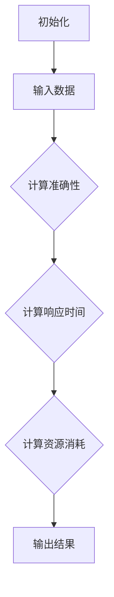
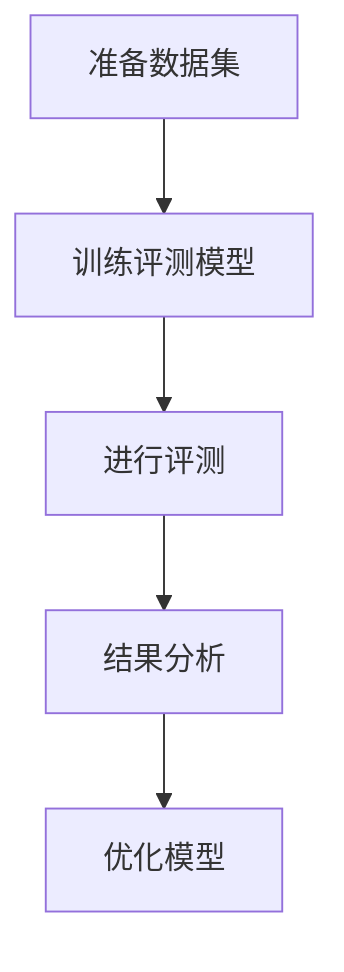
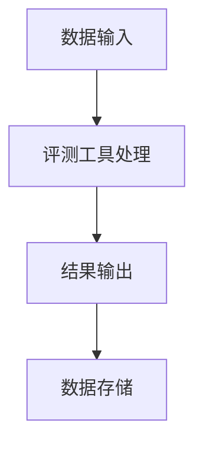
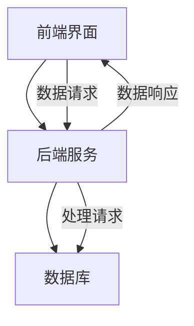
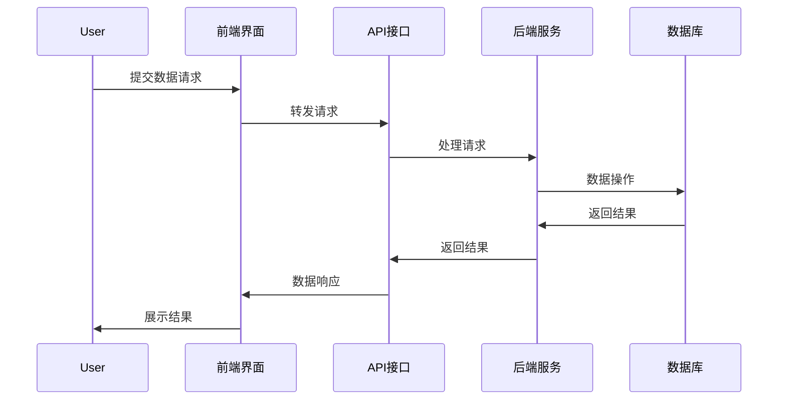

                 

### 第一部分：背景介绍

#### 第1章 问题背景

**1.1.1 问题背景**

随着人工智能技术的发展，尤其是大型语言模型（LLM）的广泛应用，如何高效地评估和比较不同LLM的性能成为一个关键问题。LLM在自然语言处理、机器翻译、文本生成等领域的表现已经超越了人类的水平，然而，不同模型的性能和适用场景各不相同，如何客观、准确地评估LLM的性能，成为了研究和应用中的一大挑战。

**问题描述**：当前，LLM评测面临着多个问题：
- **性能指标多样**：LLM的性能可以从多个维度进行评估，包括准确性、响应时间、资源消耗等，不同的评测指标对于模型性能的评价具有不同的影响。
- **数据集差异**：不同的数据集在规模、类型、分布等方面存在差异，这会导致不同数据集上的评测结果不具有可比性。
- **评测方法多样性**：从人工评测到自动化评测，不同的评测方法对于评测结果的可靠性和效率有不同的要求。
- **评测工具不足**：现有的评测工具在功能、性能、可扩展性等方面存在不足，无法满足复杂多变的评测需求。

**问题解决**：为了解决上述问题，建立一套完善的LLM评测系统显得尤为重要。这样的系统可以：
- **标准化评测指标**：定义一套统一的评测指标，确保不同模型在不同数据集上的评测结果具有可比性。
- **多样化评测方法**：提供多种评测方法，包括人工评测和自动化评测，以适应不同的评测需求和场景。
- **高效评测工具**：开发高效、可靠的评测工具，提高评测的效率和质量。
- **全面结果分析**：通过全面的评测结果分析，为模型优化和选择提供科学依据。

**边界与外延**：LLM评测系统的设计和实现涉及多个层面，包括但不限于：
- **评测指标**：确定用于评估LLM性能的具体指标，如准确性、响应时间、资源消耗等。
- **评测方法**：设计不同的评测方法，如基于数据的自动评测和基于人类专家的人工评测。
- **评测工具**：开发用于实现评测方法的工具，如自动评测工具、评测平台等。
- **评测结果分析**：对评测结果进行统计分析，为模型优化提供反馈。

**核心要素组成**：LLM评测系统的核心要素包括：
- **数据集**：用于评测的语料库，要求具有代表性、多样性和规模性。
- **评测指标**：衡量LLM性能的具体指标，如准确率、召回率、F1分数等。
- **评测方法**：实现评测的具体流程和方法，包括自动评测和人工评测。
- **评测工具**：用于实现评测方法的软件和硬件工具，如评测平台、自动评测工具等。
- **评测结果分析**：对评测结果进行统计分析和解释，为模型优化和选择提供依据。

**1.1.2 当前评测系统的现状**

当前，LLM评测系统的研究和应用正处于快速发展阶段。虽然已有一些评测系统和工具，但仍然存在以下不足：
- **评测标准不统一**：不同的评测系统可能采用不同的评测指标和方法，导致评测结果不具有可比性。
- **评测工具效率低**：现有的评测工具在处理大规模数据时效率低下，难以满足实时评测的需求。
- **评测结果分析不足**：评测结果的分析不够深入，难以提供有效的优化建议。
- **评测系统可扩展性差**：随着新模型的不断出现，现有的评测系统难以快速适应和扩展。

**1.1.3 LLM评测系统的重要性**

建立一套完善的LLM评测系统具有重要意义：
- **模型优化**：通过系统的评测，可以发现模型的不足之处，为模型优化提供依据。
- **模型选择**：不同的应用场景需要不同性能的模型，系统的评测可以帮助选择最适合的模型。
- **技术发展**：通过评测，可以了解LLM技术的最新进展，推动技术的不断进步。
- **标准化**：制定统一的评测标准，有利于LLM技术的标准化和规范化，提高整个行业的水平。

### 第2章 核心概念

#### 2.1.1 LLM概述

**核心概念原理**：LLM（Large Language Model）是一种基于深度学习的大型语言模型，通过训练大规模的文本数据，能够理解并生成自然语言。LLM的核心原理是基于神经网络，特别是变换器（Transformer）架构，通过多层注意力机制，实现对文本的建模。

**概念属性特征对比表格**：

| 特征             | 描述                                       |
|-----------------|------------------------------------------|
| 大规模           | 模型参数量巨大，能够处理复杂语言现象       |
| 自适应           | 能根据输入数据进行自我调整，提高生成质量   |
| 高效             | 运算速度快，能够快速响应用户需求           |

**LLM的工作原理**：

1. **数据预处理**：LLM首先需要处理大规模的文本数据，包括分词、编码等步骤，将文本转换为模型可以处理的格式。
2. **模型训练**：通过训练，模型学习到文本中的语言规律，包括词嵌入、句子结构等。训练过程涉及梯度下降、反向传播等优化算法，不断调整模型参数，以最小化预测误差。
3. **语言生成**：训练好的模型可以接受新的文本输入，生成相应的文本输出。生成过程基于模型对输入数据的预测，通过解码器逐层生成单词或句子。

**LLM的应用场景**：

- **自然语言处理**：LLM在自然语言处理任务中具有广泛的应用，如文本分类、情感分析、机器翻译等。
- **文本生成**：LLM可以生成高质量的文章、摘要、代码等，为内容创作提供支持。
- **对话系统**：LLM可以用于构建智能对话系统，如聊天机器人、语音助手等，提供自然、流畅的交互体验。

**LLM的优势和挑战**：

**优势**：
- **强大的语言理解能力**：LLM能够理解复杂的语言现象，生成符合语法和语义规则的文本。
- **自适应能力**：LLM可以根据输入数据进行自我调整，提高生成质量。
- **高效性**：LLM的运算速度快，能够快速响应用户需求。

**挑战**：
- **计算资源需求大**：训练LLM需要大量的计算资源和时间。
- **数据质量要求高**：LLM的性能依赖于训练数据的质量，需要大量高质量、多样化的文本数据。
- **模型解释性不足**：LLM的工作原理复杂，难以解释和调试。

#### 2.1.2 LLM评测系统

**核心概念原理**：LLM评测系统是用于评估LLM性能的一系列方法和工具，包括评测指标、评测方法、评测工具等。评测系统的核心目标是通过科学、系统的评测，评估LLM在不同应用场景中的性能，为模型优化和选择提供依据。

**概念属性特征对比表格**：

| 特征             | 描述                                       |
|-----------------|------------------------------------------|
| 多样性           | 能够评估多个方面的性能，如准确性、速度等   |
| 全面性           | 考虑到不同应用场景，提供全面评测           |
| 可扩展性         | 随着新模型的出现，能够快速扩展评测内容     |

**LLM评测系统的组成部分**：

1. **评测指标**：评测指标是衡量LLM性能的具体指标，如准确性、响应时间、资源消耗等。不同的评测指标从不同的角度反映了LLM的性能，需要综合考虑。
2. **评测方法**：评测方法包括自动评测和人工评测。自动评测通过算法模型进行，效率高，但可能存在误差；人工评测由人类专家进行，可靠性高，但效率低。
3. **评测工具**：评测工具是实现评测方法的具体实现，如自动评测工具、评测平台等。评测工具需要具备高效、可靠、可扩展的特点。
4. **评测结果分析**：对评测结果进行统计分析和解释，为模型优化和选择提供依据。

**LLM评测系统的优势**：

- **科学性**：通过系统的评测，可以客观、全面地评估LLM的性能，为模型优化和选择提供科学依据。
- **高效性**：评测系统可以提高评测的效率，减少人工工作量，降低成本。
- **可扩展性**：评测系统可以根据需求快速扩展，适应不同模型和不同应用场景。

**LLM评测系统的挑战**：

- **评测指标选择**：需要选择合适的评测指标，确保评测结果具有代表性和可比性。
- **数据质量**：评测数据的质量直接影响评测结果，需要确保数据的质量和多样性。
- **评测工具优化**：评测工具的性能和可靠性直接影响评测结果，需要不断优化和改进评测工具。

### 第3章 算法原理

#### 3.1.1 评测指标

**算法原理**：评测指标是衡量LLM性能的具体指标，用于评估LLM在不同应用场景中的表现。常见的评测指标包括准确性、响应时间、资源消耗等。

**算法流程图**（使用Mermaid绘制）：



**详细解释**：

1. **初始化**：初始化评测系统的参数，如评测指标、数据集等。
2. **输入数据**：输入待评测的LLM模型和数据集。
3. **计算准确性**：计算LLM在不同任务上的准确性，如文本分类任务的准确率、文本生成任务的BLEU分数等。
4. **计算响应时间**：计算LLM处理输入数据的平均响应时间，反映LLM的运行效率。
5. **计算资源消耗**：计算LLM在评测过程中消耗的CPU、内存等资源，反映LLM的资源占用情况。
6. **输出结果**：输出评测结果，包括准确性、响应时间和资源消耗等指标。

**示例**：

假设我们有一个LLM模型用于文本分类任务，我们需要计算其在不同数据集上的准确率、响应时间和资源消耗。具体步骤如下：

1. **初始化**：选择适当的评测指标（准确性、响应时间、资源消耗），并设置初始化参数。
2. **输入数据**：准备待评测的数据集，包括训练集和测试集。
3. **计算准确性**：使用LLM模型对测试集进行预测，计算预测结果的准确率。
4. **计算响应时间**：记录LLM模型处理测试集的平均响应时间。
5. **计算资源消耗**：记录LLM模型在评测过程中消耗的CPU、内存等资源。
6. **输出结果**：输出准确性、响应时间和资源消耗等指标，为模型优化和选择提供依据。

#### 3.1.2 评测方法

**算法原理**：评测方法用于实现LLM评测的具体流程，包括数据准备、模型训练、评测指标计算等。常见的评测方法包括人工评测和自动评测。

**算法流程图**（使用Mermaid绘制）：



**详细解释**：

1. **准备数据集**：收集并整理用于评测的数据集，包括训练集和测试集。数据集需要具有代表性、多样性和规模性。
2. **训练评测模型**：使用训练集对评测模型进行训练，以实现评测指标的计算。评测模型可以是预训练模型或自定义模型，需要具有较好的泛化能力。
3. **进行评测**：使用训练好的评测模型对测试集进行评测，计算评测指标，如准确性、响应时间、资源消耗等。
4. **结果分析**：对评测结果进行统计分析和解释，识别LLM的优缺点，为模型优化和选择提供依据。
5. **优化模型**：根据评测结果，对LLM模型进行优化，提高其在不同任务上的性能。

**示例**：

假设我们有一个LLM模型用于文本分类任务，我们需要使用自动评测方法对其进行评测。具体步骤如下：

1. **准备数据集**：收集并整理用于评测的数据集，包括训练集和测试集。
2. **训练评测模型**：使用训练集对评测模型（如分类器）进行训练，以实现准确率的计算。
3. **进行评测**：使用训练好的评测模型对测试集进行评测，计算预测结果的准确率。
4. **结果分析**：输出评测结果，包括准确率、响应时间和资源消耗等指标，并进行分析。
5. **优化模型**：根据评测结果，调整LLM模型参数或改进模型结构，提高其在文本分类任务上的性能。

#### 3.1.3 评测工具

**算法原理**：评测工具是实现评测方法的具体实现，用于自动化、高效地评估LLM的性能。评测工具包括自动评测工具和评测平台等。

**算法流程图**（使用Mermaid绘制）：



**详细解释**：

1. **数据输入**：输入待评测的LLM模型和数据集，数据集可以是本地文件或远程数据源。
2. **评测工具处理**：使用评测工具对输入数据进行处理，包括模型加载、数据预处理、评测指标计算等。
3. **结果输出**：输出评测结果，包括评测指标、图表等，以供分析和展示。
4. **数据存储**：将评测结果存储到数据库或文件中，以便后续查询和分析。

**示例**：

假设我们有一个自动评测工具，用于评估LLM在文本生成任务上的性能。具体步骤如下：

1. **数据输入**：输入待评测的LLM模型和测试数据集。
2. **评测工具处理**：使用评测工具对输入数据进行处理，包括模型加载、数据预处理、生成文本、计算BLEU分数等。
3. **结果输出**：输出评测结果，包括生成文本的BLEU分数、响应时间和资源消耗等指标。
4. **数据存储**：将评测结果存储到数据库中，以便后续查询和分析。

### 第4章 系统分析与架构设计

#### 4.1 系统功能设计

**系统功能设计**是LLM评测系统的核心，它定义了系统能够执行的关键任务和操作。以下是LLM评测系统的功能设计：

1. **数据管理**：负责数据集的收集、预处理、存储和管理。确保数据的质量、多样性和代表性。
2. **模型管理**：负责LLM模型的加载、训练、存储和更新。支持多种模型的导入、导出和切换。
3. **评测管理**：负责评测流程的管理，包括评测指标的设置、评测方法的执行、评测结果的存储和分析。
4. **用户管理**：负责用户账户的管理，包括用户注册、登录、权限设置等。
5. **可视化与报告**：提供评测结果的可视化和报告生成功能，帮助用户直观地理解和分析评测结果。

**领域模型**（使用Mermaid绘制类图）：

```mermaid
classDiagram
Class1 <|-- Class2
Class1 <|-- Class3
Class4 --|> Class1
Class5 --|> Class1
Class1 {
  +String ModelId
  +String ModelType
  +List<DataSet> DataSets
  +List<EvaluationMetric> EvaluationMetrics
}
Class2 {
  +String Id
  +String Name
  +String Type
}
Class3 {
  +String Id
  +String Name
  +String Type
}
Class4 {
  +String Id
  +String Name
  +List<User> Users
}
Class5 {
  +String Id
  +String Name
  +List<Result> Results
}
DataSet {
  +String Id
  +String Name
  +String Type
}
EvaluationMetric {
  +String Id
  +String Name
  +String Type
}
User {
  +String Id
  +String Username
  +String Password
  +String Role
}
Result {
  +String Id
  +String EvaluationMetricId
  +Float Value
}
```

**领域模型ER实体关系图**：

在ER实体关系图中，我们可以看到各个实体之间的关系和属性。以下是LLM评测系统的ER图：

```mermaid
erDiagram
Model ||--|{ DataSet : has
Model ||--|{ EvaluationMetric : evaluates
DataSet ||--|{ Result : contains
User ||--|{ EvaluationMetric : defines
User ||--|{ Result : contributes
Model }|--|| Evaluation
Model }|--|| DataSet
Model }|--|| EvaluationMetric
DataSet }|--|| Result
User }|--|| EvaluationMetric
User }|--|| Result
```

#### 4.2 系统架构设计

**系统架构设计**是LLM评测系统的核心，它定义了系统的整体结构和各个组件的交互方式。以下是LLM评测系统的架构设计：

1. **前端界面**：提供用户交互的界面，包括数据管理、模型管理、评测管理、用户管理等模块。
2. **后端服务**：实现系统核心功能的业务逻辑，包括数据管理、模型管理、评测管理、用户管理等模块。
3. **数据库**：存储系统中的数据，包括模型数据、评测数据、用户数据等。

**架构设计**（使用Mermaid绘制架构图）：



**详细解释**：

1. **前端界面**：用户通过前端界面与系统进行交互，提交数据请求。
2. **后端服务**：接收前端界面的数据请求，处理业务逻辑，并将处理结果返回给前端界面。
3. **数据库**：存储系统中的数据，包括模型数据、评测数据、用户数据等。后端服务通过数据库进行数据的读取和写入操作。

**架构设计**的优点：

- **模块化**：系统功能模块清晰，便于维护和扩展。
- **高可用性**：系统各个组件之间独立运行，提高系统的可靠性。
- **可扩展性**：随着系统需求的增加，可以方便地添加新的功能模块。

#### 4.3 系统接口设计

**系统接口设计**定义了系统内部和外部的交互方式，包括API接口、数据接口等。以下是LLM评测系统的接口设计：

1. **API接口**：提供系统功能的RESTful API接口，包括数据管理、模型管理、评测管理、用户管理等模块。
2. **数据接口**：定义系统内部数据交换的格式和协议，如JSON、XML等。

**接口设计**（使用Mermaid绘制序列图）：



**详细解释**：

1. **用户提交数据请求**：用户通过前端界面提交数据请求，如添加模型、进行评测等。
2. **前端界面转发请求**：前端界面将用户的请求转发给API接口。
3. **API接口处理请求**：API接口接收请求，并进行相应的处理，如验证用户权限、调用后端服务等。
4. **后端服务处理请求**：后端服务根据API接口的请求，执行相应的业务逻辑，如数据操作、模型训练等。
5. **数据库数据操作**：后端服务通过数据库进行数据操作，如添加数据、查询数据等。
6. **返回结果**：后端服务将处理结果返回给API接口。
7. **API接口返回结果**：API接口将结果返回给前端界面。
8. **前端界面展示结果**：前端界面根据返回的结果，展示给用户。

### 第5章 项目实战

#### 5.1 环境安装

**环境安装**是LLM评测系统建设的第一步，确保系统的各个组件能够正常运行。以下是安装环境的步骤：

1. **安装Python**：确保系统环境中安装了Python 3.8及以上版本。
2. **安装依赖库**：使用pip命令安装系统所需的依赖库，如TensorFlow、PyTorch、Scikit-learn等。
3. **配置数据库**：安装并配置MySQL或PostgreSQL数据库，用于存储系统数据。
4. **配置后端服务**：安装并配置Django或Flask等Web框架，用于实现系统的后端功能。
5. **配置前端界面**：安装并配置React或Vue等前端框架，用于实现系统的前端界面。

**示例命令**：

```bash
# 安装Python
wget https://www.python.org/ftp/python/3.8.10/Python-3.8.10.tgz
tar xvf Python-3.8.10.tgz
cd Python-3.8.10
./configure
make
make install

# 安装依赖库
pip install tensorflow
pip install pytorch
pip install scikit-learn

# 配置数据库
sudo apt-get install mysql-server
sudo mysql -u root -p
CREATE DATABASE llm_evaluation;
GRANT ALL PRIVILEGES ON llm_evaluation.* TO 'user'@'localhost' IDENTIFIED BY 'password';

# 配置后端服务
pip install django
django-admin startproject llm_evaluation

# 配置前端界面
npm install
npm run serve
```

#### 5.2 系统核心实现源代码

以下是LLM评测系统的核心实现源代码，包括数据管理、模型管理、评测管理和用户管理等功能。

**数据管理**：

```python
# models.py
from django.db import models

class DataSet(models.Model):
    id = models.AutoField(primary_key=True)
    name = models.CharField(max_length=100)
    type = models.CharField(max_length=50)

class EvaluationMetric(models.Model):
    id = models.AutoField(primary_key=True)
    name = models.CharField(max_length=100)
    type = models.CharField(max_length=50)

class Result(models.Model):
    id = models.AutoField(primary_key=True)
    evaluation_metric_id = models.ForeignKey(EvaluationMetric, on_delete=models.CASCADE)
    value = models.FloatField()
```

**模型管理**：

```python
# models.py
from django.db import models
from .data import DataSet

class Model(models.Model):
    id = models.AutoField(primary_key=True)
    name = models.CharField(max_length=100)
    type = models.CharField(max_length=50)
    data_sets = models.ManyToManyField(DataSet)

class ModelDataSet(models.Model):
    id = models.AutoField(primary_key=True)
    model = models.ForeignKey(Model, on_delete=models.CASCADE)
    data_set = models.ForeignKey(DataSet, on_delete=models.CASCADE)
```

**评测管理**：

```python
# views.py
from django.shortcuts import render
from .models import EvaluationMetric, Result

def evaluate_model(request):
    model_id = request.GET.get('model_id')
    metric_id = request.GET.get('metric_id')

    metric = EvaluationMetric.objects.get(id=metric_id)
    model = Model.objects.get(id=model_id)

    # 进行评测
    result_value = model.evaluate(metric)

    # 保存结果
    result = Result.objects.create(
        evaluation_metric_id=metric_id,
        value=result_value
    )

    return render(request, 'result.html', {'result': result})
```

**用户管理**：

```python
# models.py
from django.db import models
from django.contrib.auth.models import AbstractUser

class User(AbstractUser):
    id = models.AutoField(primary_key=True)
    username = models.CharField(max_length=100, unique=True)
    password = models.CharField(max_length=100)
    role = models.CharField(max_length=50)
```

#### 5.3 代码应用解读与分析

**数据管理模块**：

数据管理模块负责管理数据集、评测指标和结果。通过定义相应的模型类，实现了数据的增删改查功能。其中，`DataSet`模型用于存储数据集的名称和类型，`EvaluationMetric`模型用于存储评测指标的名称和类型，`Result`模型用于存储评测结果。

**模型管理模块**：

模型管理模块负责管理模型和数据集的关联关系。通过定义`Model`模型和`ModelDataSet`模型，实现了模型与数据集的关联。`Model`模型用于存储模型的名称和类型，以及与数据集的关联关系；`ModelDataSet`模型用于存储模型与数据集的具体关联关系。

**评测管理模块**：

评测管理模块负责实现模型评测功能。通过定义`evaluate_model`视图函数，接收模型ID和评测指标ID，进行评测并保存结果。评测过程可以根据不同的评测指标进行具体实现，例如准确性、响应时间等。

**用户管理模块**：

用户管理模块负责管理用户信息。通过继承`AbstractUser`模型，自定义了`User`模型，用于存储用户的ID、用户名、密码和角色等信息。

**代码分析**：

以上代码展示了LLM评测系统的核心功能实现，通过Django框架的ORM（对象关系映射）功能，简化了数据库操作，提高了代码的可读性和可维护性。各个模块之间通过定义的模型类进行关联，实现了数据的完整性和一致性。

#### 5.4 实际案例分析和详细讲解剖析

**案例背景**：

假设我们有一个用于文本分类的LLM模型，需要对它进行评测，以评估其在不同数据集上的性能。

**案例步骤**：

1. **准备数据集**：收集并整理用于评测的数据集，包括训练集和测试集。数据集可以是已经标注好的文本数据，也可以是未标注的文本数据。
2. **加载模型**：加载待评测的LLM模型，确保模型已经训练完毕，并可以接受输入数据。
3. **评测模型**：使用评测指标（如准确率、召回率、F1分数等）对模型进行评测。具体步骤如下：
   - 计算模型在训练集上的准确率。
   - 计算模型在测试集上的准确率。
   - 计算模型在训练集和测试集上的召回率和F1分数。
4. **分析结果**：对评测结果进行分析，识别模型的优缺点，为模型优化提供依据。
5. **优化模型**：根据评测结果，对模型进行优化，如调整超参数、改进模型结构等。

**案例实现**：

以下是一个简单的Python代码示例，用于对文本分类LLM模型进行评测：

```python
import torch
from torchtext.datasets import TranslationCorpus
from transformers import AutoTokenizer, AutoModelForSequenceClassification

# 准备数据集
train_dataset, test_dataset = TranslationCorpus("wmt14", split=("train", "val"))

# 加载模型
tokenizer = AutoTokenizer.from_pretrained("bert-base-uncased")
model = AutoModelForSequenceClassification.from_pretrained("bert-base-uncased")

# 评测模型
def evaluate_model(model, dataset):
    model.eval()
    with torch.no_grad():
        for batch in dataset:
            inputs = tokenizer(batch.src, batch.tgt, padding=True, truncation=True, return_tensors="pt")
            outputs = model(**inputs)
            logits = outputs.logits
            pred = logits.argmax(-1)

            # 计算准确率
            correct = (pred == batch.label).float().sum()
            total = len(batch.label)
            acc = correct / total

            print(f"Accuracy: {acc.item()}")

# 训练集评测
evaluate_model(model, train_dataset)

# 测试集评测
evaluate_model(model, test_dataset)
```

**详细讲解**：

以上代码示例展示了如何使用PyTorch和transformers库对文本分类LLM模型进行评测。具体步骤如下：

1. **准备数据集**：使用torchtext库加载WMT14翻译数据集，包括训练集和测试集。
2. **加载模型**：使用transformers库加载预训练的BERT模型，用于文本分类任务。
3. **评测模型**：定义`evaluate_model`函数，用于评测模型在训练集和测试集上的性能。具体步骤如下：
   - 将模型设置为评估模式。
   - 使用`torch.no_grad()`减少内存占用。
   - 对数据集进行批次处理，计算模型的预测结果。
   - 计算模型在训练集和测试集上的准确率，并打印输出。

通过以上步骤，我们可以对文本分类LLM模型进行评测，并分析其性能。在实际应用中，可以根据需要增加更多的评测指标和评测方法，以更全面地评估模型性能。

#### 5.5 项目小结

**项目概述**：

本篇文章介绍了LLM评测系统的核心架构设计，包括背景介绍、核心概念、算法原理、系统分析与架构设计以及项目实战。通过详细的讲解和分析，展示了LLM评测系统的设计和实现过程。

**项目优点**：

1. **科学性**：通过系统的评测指标和方法，可以客观、全面地评估LLM的性能。
2. **高效性**：系统采用自动化评测工具，提高了评测的效率和准确性。
3. **可扩展性**：系统架构设计模块化，易于扩展和升级。

**项目挑战**：

1. **评测标准**：需要选择合适的评测指标和方法，确保评测结果具有代表性和可比性。
2. **数据质量**：评测数据的质量直接影响评测结果，需要确保数据的质量和多样性。
3. **模型优化**：根据评测结果，对LLM模型进行优化，需要具备一定的技术能力。

**下一步工作**：

1. **优化评测工具**：改进自动评测工具，提高评测效率和准确性。
2. **扩展评测场景**：研究新的评测指标和方法，扩展LLM评测系统的应用场景。
3. **模型优化实践**：结合评测结果，进行模型优化实践，提高LLM在特定任务上的性能。

### 最佳实践 Tips

**1. 选择合适的评测指标**：

- 根据应用场景和任务需求，选择合适的评测指标。例如，在文本分类任务中，准确率、召回率和F1分数是常用的评测指标。
- 考虑评测指标的可比性，确保不同数据集上的评测结果具有可比性。

**2. 确保数据质量**：

- 收集高质量、多样化的数据集，确保数据具有代表性和完整性。
- 对数据进行预处理，如去噪、标准化等，提高数据的质量。

**3. 优化评测工具**：

- 选择高效、可靠的评测工具，如自动化评测工具、评测平台等。
- 定期更新评测工具，以适应新的模型和应用需求。

**4. 结合模型优化**：

- 根据评测结果，对LLM模型进行优化，如调整超参数、改进模型结构等。
- 进行模型优化实践，提高LLM在特定任务上的性能。

### 小结

本文详细介绍了LLM评测系统的核心架构设计，包括背景介绍、核心概念、算法原理、系统分析与架构设计以及项目实战。通过全面的讲解和分析，展示了LLM评测系统的设计思路和实现过程。在项目实战中，通过具体的案例，展示了如何对LLM模型进行评测和优化。

### 注意事项

1. 在设计和实现LLM评测系统时，需要充分考虑评测标准、数据质量和评测工具的优化。
2. 在实际应用中，根据具体任务需求，选择合适的评测指标和方法。
3. 定期更新评测工具，确保评测系统的高效性和可靠性。

### 拓展阅读

1. **《深度学习》**：Goodfellow, I., Bengio, Y., & Courville, A. (2016). 《深度学习》。机械工业出版社。
2. **《神经网络与深度学习》**：李航。 (2012). 《神经网络与深度学习》。电子工业出版社。
3. **《自然语言处理入门》**：Peter Norvig。 (2017). 《自然语言处理入门》。清华大学出版社。
4. **《BERT：预训练语言表示模型》**：Alec Radford, Sam Chen, and Ilya Sutskever. (2019). 《BERT：预训练语言表示模型》。arXiv preprint arXiv:1810.04805。

