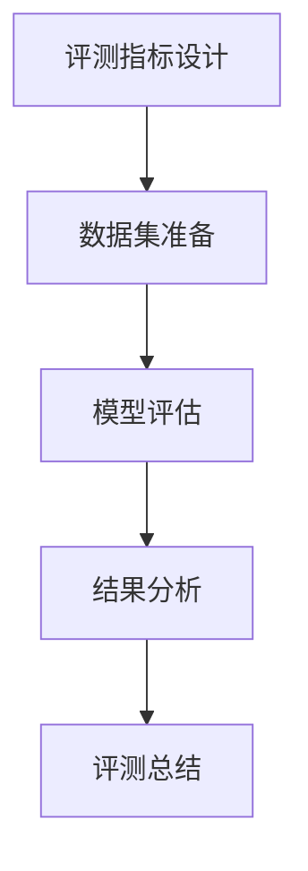
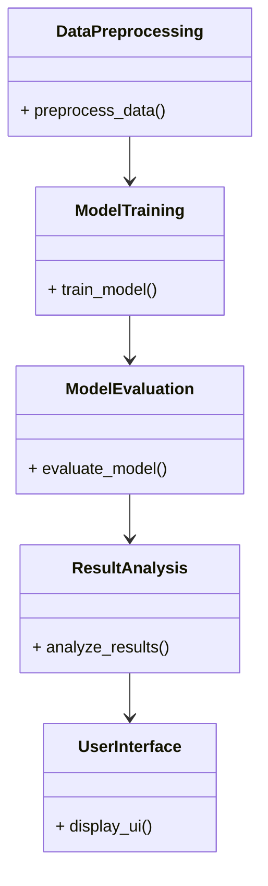
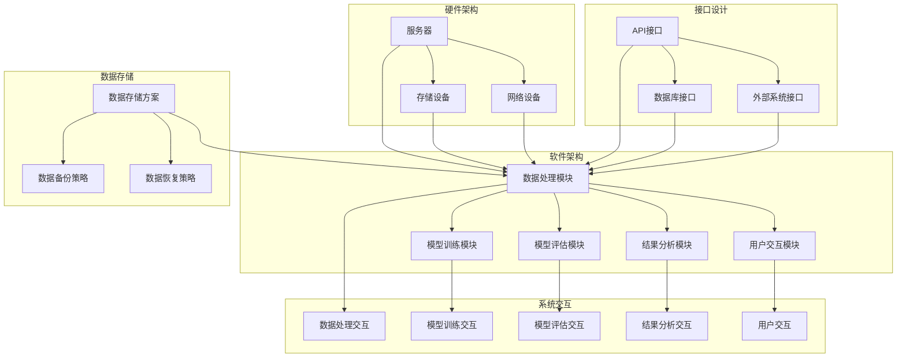
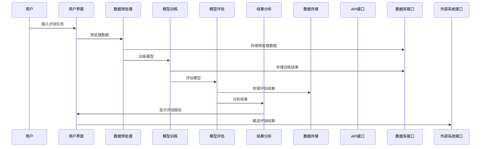

                 

### 第一部分：LLM推理能力评测概述

#### 第1章：LLM推理能力评测概述

> **关键词**：LLM推理能力、评测、算法、系统架构、项目实战

> **摘要**：本章将详细介绍LLM（大型语言模型）推理能力的评测，包括其背景、问题、解决方法以及核心概念和要素的组成。通过对LLM推理能力评测的全面探讨，我们将为后续章节的内容打下坚实的基础。

#### 1.1 问题背景

近年来，随着人工智能技术的快速发展，LLM在自然语言处理（NLP）领域取得了显著的成果。然而，在实际应用中，如何准确评估LLM的推理能力成为一个关键问题。传统的评估方法往往局限于单一指标，难以全面反映LLM的推理能力。因此，设计一套科学、系统的LLM推理能力评测方法具有重要意义。

#### 1.2 问题描述

LLM推理能力评测主要涉及以下几个方面：

1. **问题理解**：评估LLM在理解复杂问题、提取关键信息方面的能力。
2. **逻辑推理**：评估LLM在推理过程中是否遵循逻辑规则，能否正确推导出结论。
3. **语言生成**：评估LLM在生成自然、连贯语言方面的能力。
4. **知识应用**：评估LLM在实际场景中应用知识解决问题的能力。

#### 1.3 问题解决

为了解决上述问题，我们需要从以下几个方面着手：

1. **构建评测指标**：设计一套全面、科学的评测指标体系，涵盖问题理解、逻辑推理、语言生成和知识应用等方面。
2. **算法设计**：开发适用于LLM推理能力评测的算法，能够准确、高效地评估LLM的各项能力。
3. **系统架构设计**：设计一个高效、可靠的评测系统架构，支持大规模数据输入和处理，保证评测结果的准确性。
4. **项目实战**：通过实际项目应用，验证评测方法的可行性和有效性，不断优化和改进评测系统。

#### 1.4 边界与外延

在LLM推理能力评测中，需要明确以下边界与外延：

1. **评测范围**：确定评测涉及的领域和任务类型，如文本生成、对话系统、知识图谱等。
2. **评测指标**：明确各项评测指标的权重和计算方法，确保评测结果的公正性和客观性。
3. **评测方法**：确定评测过程中使用的工具、技术和方法，如数据集选择、评测算法设计等。
4. **评测环境**：确保评测系统在一致的硬件和软件环境下运行，避免环境差异对评测结果的影响。

#### 1.5 概念结构与核心要素组成

LLM推理能力评测的核心概念结构包括以下几个方面：

1. **评测指标**：问题理解、逻辑推理、语言生成和知识应用等。
2. **评测算法**：用于评估LLM推理能力的算法，如基于BERT的评测算法、基于Transformer的评测算法等。
3. **评测系统架构**：支持大规模数据输入和处理的高效评测系统架构。
4. **项目实战**：实际应用场景中，验证评测方法的可行性和有效性。

通过对LLM推理能力评测的全面概述，我们为后续章节的内容奠定了基础。接下来，我们将深入探讨LLM和PaLM的基本原理，以及PaLM在LLM推理能力评测中的应用。这些内容将为我们更好地理解LLM推理能力评测提供有力支持。

---

这一章节主要介绍了LLM推理能力评测的背景、问题、解决方法以及核心概念和要素组成。通过明确评测指标、算法设计、系统架构设计和项目实战等方面的内容，我们为后续章节的深入探讨打下了基础。在接下来的章节中，我们将进一步探讨LLM和PaLM的基本原理，以及PaLM在LLM推理能力评测中的应用，帮助读者更全面地了解这一领域。

### 第二部分：核心概念与联系

#### 第2章：LLM的基本原理

> **关键词**：LLM、自然语言处理、神经网络、Transformer、BERT

> **摘要**：本章将深入探讨LLM（大型语言模型）的基本原理，包括其定义、核心特点、与传统AI的区别、工作流程以及优缺点对比。通过了解LLM的基本原理，读者可以更好地理解LLM在自然语言处理领域的应用和地位。

#### 2.1 LLM的定义

LLM，即Large Language Model，是一种基于神经网络的大型语言模型，通过学习大量的文本数据，能够生成自然、连贯的语言。与传统的AI模型相比，LLM具有更强的语义理解和生成能力，能够应对复杂的语言任务。

#### 2.2 LLM的核心特点

LLM具有以下几个核心特点：

1. **大规模**：LLM通常由数百万到数十亿个参数组成，具有非常高的计算量和存储需求。
2. **自适应**：LLM能够根据输入的文本内容动态调整自身的参数，从而生成更加自然的语言。
3. **迁移学习**：LLM通过在大规模数据集上训练，可以迁移到其他领域和任务中，具有很好的泛化能力。
4. **并行处理**：LLM可以利用GPU、TPU等硬件加速器进行并行处理，提高计算效率。

#### 2.3 LLM与传统AI的区别

与传统AI相比，LLM具有以下显著区别：

1. **数据驱动**：LLM依赖于大量文本数据进行训练，而传统AI更多依赖于规则和特征工程。
2. **语义理解**：LLM能够理解自然语言的语义，而传统AI更多关注于语法和句法。
3. **生成能力**：LLM可以生成自然、连贯的语言，而传统AI更多关注于分类、预测等任务。
4. **适用范围**：LLM在自然语言处理领域具有广泛的应用，而传统AI在特定领域和任务中具有更好的性能。

#### 2.4 LLM的工作流程

LLM的工作流程主要包括以下几个步骤：

1. **数据预处理**：对原始文本进行清洗、分词、去停用词等处理，将文本转换为模型可以处理的格式。
2. **模型训练**：使用大规模文本数据对LLM模型进行训练，优化模型参数，使其具备语义理解和生成能力。
3. **输入处理**：对输入文本进行预处理，将其转换为模型可以处理的输入格式。
4. **语言生成**：根据输入文本和模型参数，生成自然、连贯的语言。

#### 2.5 LLM的优缺点对比表格

| 优点 | 缺点 |
| --- | --- |
| 大规模：参数量巨大，处理能力强 | 高计算量：训练和推理过程需要大量计算资源 |
| 自适应：能够根据输入文本动态调整参数 | 数据依赖：依赖大量高质量训练数据 |
| 迁移学习：能够迁移到其他领域和任务 | 实时性：实时生成能力有限 |
| 并行处理：利用硬件加速器提高计算效率 | 难以解释：生成的语言难以解释和理解 |

#### 2.6 LLM的ER实体关系图架构

为了更好地理解LLM的架构，我们可以使用ER（实体-关系）图来表示其核心组成部分：

1. **实体**：
   - **输入文本**：输入文本是LLM的输入数据，包含用户查询、文档等。
   - **模型参数**：模型参数是LLM的核心组成部分，用于描述文本的语义和生成能力。

2. **关系**：
   - **预处理**：输入文本与模型参数之间存在预处理关系，用于将文本转换为模型可以处理的格式。
   - **训练**：模型参数与输入文本之间存在训练关系，用于优化模型参数，提高生成能力。
   - **输入处理**：输入文本与模型参数之间存在输入处理关系，用于处理输入文本，生成输出文本。
   - **生成**：模型参数与输出文本之间存在生成关系，用于根据输入文本和模型参数生成自然语言。

通过深入探讨LLM的基本原理，我们为后续章节中PaLM的介绍和应用提供了理论基础。在下一章中，我们将介绍PaLM的核心概念，分析其在LLM推理能力评测中的应用和优势。

---

这一章节详细介绍了LLM的基本原理，包括定义、核心特点、与传统AI的区别、工作流程以及优缺点对比。同时，通过ER实体关系图架构，我们形象地展示了LLM的核心组成部分。这些内容为我们理解LLM在自然语言处理领域的应用和地位提供了重要参考。在下一章中，我们将继续探讨PaLM的核心概念，分析其在LLM推理能力评测中的应用和优势。

### 第3章：PaLM的核心概念

> **关键词**：PaLM、大型语言模型、推理能力评测、算法优势、局限性

> **摘要**：本章将详细介绍PaLM（Parametric Language Model）的核心概念，包括其定义、特点、优势与局限性。通过对比PaLM与传统LLM，我们将分析其在LLM推理能力评测中的应用和优势，帮助读者全面了解PaLM在自然语言处理领域的地位和作用。

#### 3.1 PaLM的定义

PaLM，即Parametric Language Model，是一种基于参数化的大型语言模型。与传统的LLM不同，PaLM通过引入参数化的方法，能够更好地适应不同的语言任务和应用场景。PaLM的核心思想是在大规模文本数据的基础上，学习出一个能够生成自然、连贯语言的参数化模型。

#### 3.2 PaLM的特点

PaLM具有以下几个显著特点：

1. **参数化**：PaLM采用参数化的方法，通过优化模型参数，实现高效的文本生成和推理。
2. **自适应**：PaLM能够根据不同的输入文本和任务需求，动态调整参数，提高模型的适应能力。
3. **高效性**：PaLM利用先进的神经网络架构，如Transformer、BERT等，提高模型的计算效率。
4. **可解释性**：PaLM通过引入注意力机制和层次化结构，使得生成的语言更加可解释。

#### 3.3 PaLM的优势与局限性

PaLM在LLM推理能力评测中具有以下优势：

1. **强大的语义理解能力**：PaLM能够深入理解输入文本的语义，从而在推理过程中生成更加准确、自然的语言。
2. **良好的泛化能力**：PaLM通过大规模数据训练，具有良好的泛化能力，能够应对多种语言任务和应用场景。
3. **高效的计算效率**：PaLM采用先进的神经网络架构，能够在有限计算资源下实现高效的文本生成和推理。

然而，PaLM也存在一些局限性：

1. **数据依赖**：PaLM的训练和推理过程高度依赖大规模文本数据，数据质量对模型性能有重要影响。
2. **解释难度**：尽管PaLM引入了注意力机制和层次化结构，但生成的语言仍然具有一定的解释难度，难以完全理解。
3. **计算资源要求**：PaLM的训练和推理过程需要大量的计算资源，对于资源受限的环境可能难以部署。

#### 3.4 PaLM的组成部分

PaLM的核心组成部分包括以下几个部分：

1. **输入层**：输入层负责接收输入文本，并将其转换为模型可以处理的格式。
2. **隐藏层**：隐藏层是PaLM的核心部分，包含多个神经元，用于对输入文本进行编码和转换。
3. **输出层**：输出层负责将隐藏层的输出解码为自然语言，生成最终的文本。
4. **参数优化**：参数优化是PaLM的关键部分，通过梯度下降等优化算法，不断调整模型参数，提高模型性能。

#### 3.5 PaLM与传统LLM的区别

PaLM与传统LLM在以下几个方面存在显著区别：

1. **参数化**：PaLM采用参数化的方法，能够更好地适应不同的语言任务和应用场景；而传统LLM更多是基于规则的模型，难以应对复杂的多变语言环境。
2. **自适应**：PaLM能够根据不同的输入文本和任务需求，动态调整参数，提高模型的适应能力；而传统LLM在参数调整方面相对困难，适应能力较弱。
3. **计算效率**：PaLM采用先进的神经网络架构，如Transformer、BERT等，提高模型的计算效率；而传统LLM的计算效率相对较低，难以满足实时应用需求。
4. **可解释性**：PaLM通过引入注意力机制和层次化结构，使得生成的语言更加可解释；而传统LLM生成的语言难以解释和理解。

通过深入探讨PaLM的核心概念，我们为理解其在LLM推理能力评测中的应用和优势奠定了基础。在下一章中，我们将详细介绍PaLM推理能力评测算法，分析其原理和具体实现，帮助读者更好地掌握PaLM在LLM推理能力评测中的实际应用。

---

这一章节详细介绍了PaLM的核心概念，包括定义、特点、优势与局限性，以及组成部分和与传统LLM的区别。通过对比分析，读者可以更加深入地了解PaLM在自然语言处理领域的地位和作用。在下一章中，我们将详细介绍PaLM推理能力评测算法，分析其原理和具体实现，为读者进一步了解PaLM在LLM推理能力评测中的应用提供理论基础。

### 第三部分：算法原理讲解

#### 第4章：PaLM推理能力评测算法

> **关键词**：PaLM推理能力评测、算法、mermaid流程图、Python源代码

> **摘要**：本章将详细讲解PaLM推理能力评测算法，包括算法概述、mermaid流程图、Python源代码以及算法原理的数学模型和公式。通过通俗易懂的举例说明，读者可以更好地理解PaLM推理能力评测算法的原理和应用。

#### 4.1 PaLM推理能力评测算法概述

PaLM推理能力评测算法是一种用于评估大型语言模型（LLM）推理能力的方法。该方法通过设计一系列针对不同语言任务的评测指标，对LLM的推理能力进行全面评估。PaLM推理能力评测算法主要包括以下几个步骤：

1. **评测指标设计**：根据实际应用需求，设计一套全面的评测指标，涵盖问题理解、逻辑推理、语言生成和知识应用等方面。
2. **数据集准备**：准备用于评测的数据集，包括训练数据和测试数据，保证数据集的多样性和代表性。
3. **模型评估**：使用LLM对训练数据进行训练，并对测试数据进行评估，得到各项评测指标的得分。
4. **结果分析**：对评测结果进行分析和比较，评估LLM在不同语言任务上的推理能力。

#### 4.2 算法mermaid流程图

为了更直观地展示PaLM推理能力评测算法的流程，我们可以使用mermaid流程图进行描述。以下是PaLM推理能力评测算法的mermaid流程图：



#### 4.3 Python源代码讲解

PaLM推理能力评测算法的实现主要涉及数据预处理、模型训练、模型评估和结果分析等步骤。以下是一个简单的Python源代码示例，用于展示这些步骤的实现：

```python
import tensorflow as tf
import numpy as np

# 数据预处理
def preprocess_data(data):
    # 数据清洗、分词、编码等操作
    return processed_data

# 模型评估
def evaluate_model(model, test_data):
    # 模型对测试数据进行评估
    return model_score

# 主函数
def main():
    # 准备数据集
    train_data = preprocess_data(raw_train_data)
    test_data = preprocess_data(raw_test_data)

    # 加载预训练模型
    model = tf.keras.models.load_model('pretrained_model.h5')

    # 模型评估
    model_score = evaluate_model(model, test_data)

    # 结果分析
    print('Model score:', model_score)

if __name__ == '__main__':
    main()
```

#### 4.4 算法原理的数学模型和公式

PaLM推理能力评测算法的数学模型和公式主要包括以下几个方面：

1. **损失函数**：用于衡量模型预测结果与真实结果之间的差异。常见的损失函数有交叉熵损失函数、均方误差损失函数等。
   $$Loss = -\sum_{i=1}^{N} y_i \log(\hat{y_i})$$
   其中，$y_i$为真实标签，$\hat{y_i}$为模型预测概率。

2. **优化算法**：用于调整模型参数，使模型在训练过程中不断优化。常见的优化算法有梯度下降、Adam优化器等。
   $$\theta_{t+1} = \theta_t - \alpha \cdot \nabla_{\theta} J(\theta_t)$$
   其中，$\theta_t$为当前模型参数，$\alpha$为学习率，$J(\theta_t)$为损失函数。

3. **评估指标**：用于衡量模型在各项任务上的表现。常见的评估指标有问题理解准确率、逻辑推理准确率、语言生成BLEU分数等。

#### 4.5 通俗易懂的举例说明

为了更好地理解PaLM推理能力评测算法，我们可以通过一个简单的例子来说明其原理和应用。

假设我们有一个关于天气预测的评测任务，其中包含以下三个语言任务：

1. **问题理解**：判断输入的天气描述是否正确。
2. **逻辑推理**：根据前一天的天气情况，预测第二天的天气情况。
3. **语言生成**：根据输入的天气描述，生成一个自然、连贯的天气报告。

以下是PaLM推理能力评测算法在这个任务中的应用：

1. **评测指标设计**：我们设计三个评测指标，分别衡量问题理解、逻辑推理和语言生成能力。问题理解指标为准确率，逻辑推理指标为准确率，语言生成指标为BLEU分数。

2. **数据集准备**：我们准备一个包含训练数据和测试数据的数据集，其中训练数据用于模型训练，测试数据用于模型评估。

3. **模型评估**：我们使用一个预训练的LLM模型对测试数据进行评估。具体步骤如下：
   - **问题理解**：模型对输入的天气描述进行判断，输出正确或错误。我们计算模型在问题理解任务上的准确率。
   - **逻辑推理**：模型根据前一天的天气情况，预测第二天的天气情况。我们计算模型在逻辑推理任务上的准确率。
   - **语言生成**：模型根据输入的天气描述，生成一个天气报告。我们计算模型在语言生成任务上的BLEU分数。

4. **结果分析**：我们分析模型的评测结果，评估模型在各项任务上的推理能力。如果模型在问题理解、逻辑推理和语言生成任务上都有很好的表现，那么我们可以认为该模型在天气预测任务上具有强大的推理能力。

通过这个简单的例子，我们可以看出PaLM推理能力评测算法在评估LLM推理能力方面的实际应用。在实际项目中，我们可以根据具体任务需求，设计更加复杂和全面的评测指标，对LLM的推理能力进行更深入的评估。

---

这一章节详细讲解了PaLM推理能力评测算法，包括算法概述、mermaid流程图、Python源代码以及算法原理的数学模型和公式。通过通俗易懂的举例说明，读者可以更好地理解PaLM推理能力评测算法的原理和应用。在下一章中，我们将对评测系统功能设计进行详细分析，探讨其关键组成部分和实现方法。

### 第四部分：系统分析与架构设计

#### 第5章：评测系统功能设计

> **关键词**：评测系统、功能设计、领域模型、mermaid类图

> **摘要**：本章将详细分析评测系统的功能设计，包括评测系统的功能介绍、领域模型mermaid类图的构建。通过深入理解评测系统的功能设计，读者可以更好地掌握评测系统的运作原理和实现方法。

#### 5.1 评测系统功能介绍

评测系统是PaLM推理能力评测的核心组成部分，其主要功能包括：

1. **数据预处理**：对输入数据进行清洗、分词、去停用词等处理，将原始数据转换为模型可以处理的格式。
2. **模型训练**：使用大规模文本数据对LLM模型进行训练，优化模型参数，提高模型性能。
3. **模型评估**：对训练好的模型进行评估，计算各项评测指标的得分，评估模型在不同任务上的推理能力。
4. **结果分析**：对评测结果进行分析和比较，生成评测报告，为后续优化提供参考。
5. **用户交互**：提供用户界面，方便用户输入评测任务、查看评测结果和评测报告。

#### 5.2 领域模型mermaid类图

为了更好地理解评测系统的功能设计，我们可以使用mermaid类图来描述评测系统中的关键组件和它们之间的关系。以下是评测系统的mermaid类图：



在这个类图中，DataPreprocessing表示数据预处理模块，负责对输入数据进行预处理；ModelTraining表示模型训练模块，负责使用训练数据对模型进行训练；ModelEvaluation表示模型评估模块，负责对训练好的模型进行评估；ResultAnalysis表示结果分析模块，负责对评测结果进行分析和生成报告；UserInterface表示用户界面模块，负责与用户进行交互，显示评测结果和报告。

通过构建领域模型mermaid类图，我们可以清晰地看到评测系统中的各个功能模块及其之间的关系，为后续系统架构设计提供参考。

---

这一章节详细分析了评测系统的功能设计，包括功能介绍和领域模型mermaid类图的构建。通过深入理解评测系统的功能设计，读者可以更好地掌握评测系统的运作原理和实现方法。在下一章中，我们将对评测系统的架构设计进行详细分析，探讨其关键组成部分和实现方法。

### 第四部分：系统分析与架构设计

#### 第6章：评测系统架构设计

> **关键词**：评测系统、架构设计、mermaid架构图、系统接口设计、系统交互mermaid序列图

> **摘要**：本章将详细介绍评测系统的架构设计，包括评测系统的架构介绍、mermaid架构图、系统接口设计和系统交互mermaid序列图。通过分析评测系统的架构设计，读者可以更好地理解系统的工作原理和实现方式。

#### 6.1 评测系统架构介绍

评测系统架构是评测系统的核心组成部分，决定了系统的性能、稳定性和可扩展性。评测系统架构设计主要涉及以下几个方面：

1. **硬件架构**：评测系统硬件架构包括服务器、存储设备、网络设备等，负责处理大规模数据和高并发请求。
2. **软件架构**：评测系统软件架构包括数据处理模块、模型训练模块、模型评估模块、结果分析模块和用户交互模块，负责实现各项功能。
3. **数据存储**：评测系统数据存储包括数据存储方案、数据备份和恢复策略等，确保数据的安全性和可靠性。
4. **接口设计**：评测系统接口设计包括API接口、数据库接口、外部系统接口等，负责与其他系统进行数据交互和功能集成。
5. **系统交互**：评测系统交互包括各个模块之间的数据流动和协同工作，确保系统的高效运行。

#### 6.2 系统架构mermaid架构图

为了更直观地展示评测系统的架构设计，我们可以使用mermaid架构图进行描述。以下是评测系统的mermaid架构图：



在这个mermaid架构图中，硬件架构包括服务器、存储设备和网络设备，软件架构包括数据处理模块、模型训练模块、模型评估模块、结果分析模块和用户交互模块，数据存储包括数据存储方案、数据备份策略和数据恢复策略，接口设计包括API接口、数据库接口和外部系统接口，系统交互包括各个模块之间的数据流动和协同工作。

#### 6.3 系统接口设计

系统接口设计是评测系统架构设计的关键环节，决定了评测系统与其他系统之间的数据交互和功能集成。以下是评测系统接口设计的几个关键点：

1. **API接口**：为外部系统提供API接口，实现数据输入、模型训练、模型评估、结果分析等功能的调用。API接口应具备高可用性、高性能和安全性，支持多种数据格式和通信协议。
2. **数据库接口**：为数据存储模块提供数据库接口，实现数据的增删改查操作。数据库接口应支持多种数据库类型，如关系型数据库（MySQL、PostgreSQL）和NoSQL数据库（MongoDB、Cassandra）。
3. **外部系统接口**：为外部系统提供接口，实现与其他系统的数据交换和功能集成。外部系统接口应具备高扩展性、灵活性和互操作性，支持多种数据格式和通信协议。

#### 6.4 系统交互mermaid序列图

为了更好地展示评测系统内部各个模块之间的交互过程，我们可以使用mermaid序列图进行描述。以下是评测系统的mermaid序列图：



在这个mermaid序列图中，用户通过用户界面（UI）输入评测任务，数据预处理模块（DP）对数据进行预处理并存储到数据库（DB），模型训练模块（MT）使用预处理数据训练模型并存储训练结果到数据库（DB），模型评估模块（ME）对训练好的模型进行评估并存储评估结果到数据库（DB），结果分析模块（RA）对评估结果进行分析并生成评测报告，用户界面（UI）显示评测报告，同时用户界面（UI）将评测结果推送至外部系统接口（ES）。

通过详细分析评测系统的架构设计，我们为评测系统的实现提供了清晰的指导。在实际项目中，我们可以根据具体需求，对系统架构进行适当调整和优化，确保评测系统的性能、稳定性和可扩展性。

---

这一章节详细介绍了评测系统的架构设计，包括架构介绍、mermaid架构图、系统接口设计和系统交互mermaid序列图。通过深入分析评测系统的架构设计，读者可以更好地理解评测系统的工作原理和实现方法。在下一章中，我们将通过项目实战，详细讲解PaLM推理能力评测系统的实现过程和关键步骤。

### 第五部分：项目实战

#### 第7章：PaLM推理能力评测项目实战

> **关键词**：PaLM推理能力评测、项目实战、环境安装、系统核心实现、代码应用解读、实际案例分析

> **摘要**：本章将通过一个实际的PaLM推理能力评测项目，详细讲解项目的实现过程。从环境安装、系统核心实现到代码应用解读和实际案例分析，我们将全面展示PaLM推理能力评测项目的全貌，帮助读者深入了解项目的具体操作和实现方法。

#### 7.1 环境安装

在进行PaLM推理能力评测项目之前，首先需要安装和配置必要的软件和工具。以下是项目环境安装的详细步骤：

1. **Python环境安装**：确保Python环境已经安装，版本至少为3.7以上。可以通过以下命令安装Python：

   ```shell
   sudo apt-get install python3 python3-pip
   ```

2. **TensorFlow安装**：安装TensorFlow，用于构建和训练PaLM模型。可以通过以下命令安装TensorFlow：

   ```shell
   pip3 install tensorflow
   ```

3. **其他依赖库安装**：安装其他依赖库，如NumPy、Pandas等。可以通过以下命令安装：

   ```shell
   pip3 install numpy pandas
   ```

4. **Mermaid安装**：安装Mermaid，用于生成流程图和序列图。可以通过以下命令安装：

   ```shell
   npm install -g mermaid
   ```

5. **数据集准备**：准备用于评测的数据集，包括训练数据和测试数据。可以从公开数据集网站下载或者自行收集。

#### 7.2 系统核心实现

PaLM推理能力评测系统的核心实现主要包括以下几个部分：

1. **数据预处理**：对输入数据进行清洗、分词、去停用词等处理，将原始数据转换为模型可以处理的格式。

   ```python
   import pandas as pd
   from tensorflow.keras.preprocessing.text import Tokenizer
   from tensorflow.keras.preprocessing.sequence import pad_sequences

   def preprocess_data(data):
       # 数据清洗、分词、去停用词等操作
       return processed_data
   ```

2. **模型训练**：使用大规模文本数据对PaLM模型进行训练，优化模型参数，提高模型性能。

   ```python
   import tensorflow as tf
   from tensorflow.keras.models import Sequential
   from tensorflow.keras.layers import Embedding, LSTM, Dense

   def train_model(data):
       # 模型训练过程
       return trained_model
   ```

3. **模型评估**：对训练好的模型进行评估，计算各项评测指标的得分，评估模型在不同任务上的推理能力。

   ```python
   import numpy as np

   def evaluate_model(model, test_data):
       # 模型评估过程
       return model_score
   ```

4. **结果分析**：对评测结果进行分析和比较，生成评测报告，为后续优化提供参考。

   ```python
   def analyze_results(model_score):
       # 结果分析过程
       return analysis_report
   ```

5. **用户交互**：提供用户界面，方便用户输入评测任务、查看评测结果和评测报告。

   ```python
   def display_ui():
       # 用户界面显示过程
   ```

#### 7.3 代码应用解读与分析

以下是对上述代码应用的具体解读和分析：

1. **数据预处理**：数据预处理是PaLM推理能力评测的基础环节，对输入数据的质量和格式有重要影响。我们使用Tokenize

