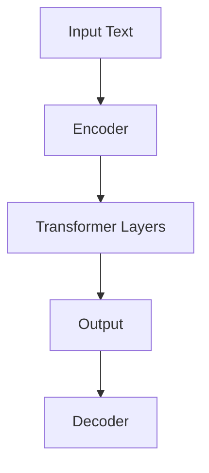

                 

## T5.1.1在LLM多任务迁移学习中的应用

### 关键词
- 多任务迁移学习
- T5.1.1模型
- 机器学习
- 语言模型
- 迁移学习
- 应用案例

### 摘要
本文将深入探讨T5.1.1模型在LLM（大型语言模型）多任务迁移学习中的应用。我们将首先介绍多任务迁移学习的背景和核心概念，然后详细讲解T5.1.1模型的原理和结构。接着，我们将通过实际应用案例展示T5.1.1模型在多任务迁移学习中的效果，并提供实践指南以帮助读者理解和应用这一模型。最后，我们将总结全文，展望T5.1.1模型在未来的发展前景。

---

### 第一部分: 多任务迁移学习概述

#### 第1章: 多任务迁移学习的基本概念

##### 1.1 什么是多任务迁移学习

多任务迁移学习是指在一个任务上训练的模型能够在不同的任务上表现出良好的性能，而不需要为每个任务重新训练。这种迁移学习方式可以减少训练时间、计算资源消耗，并提高模型的泛化能力。

##### 1.2 多任务迁移学习的优势

多任务迁移学习的优势包括：
1. **共享知识**：通过在一个任务上学习，模型可以共享知识，从而在多个任务上获得更好的性能。
2. **减少训练时间**：不需要为每个任务单独训练模型，可以显著减少训练时间。
3. **提高模型泛化能力**：模型在多个任务上的训练有助于提高其泛化能力，从而在新的任务上也能表现良好。

##### 1.3 多任务迁移学习的研究背景

随着深度学习技术的不断发展，多任务迁移学习成为了一个研究热点。特别是在自然语言处理领域，大型语言模型如GPT和BERT已经在许多任务上取得了显著的成果。然而，如何更有效地利用这些模型进行多任务迁移学习仍然是一个挑战。

#### 第2章: T5.1.1模型介绍

##### 2.1 T5.1.1模型的基础

T5.1.1模型是一种基于Transformer的大型语言模型，由Google Research开发。它以Transformer架构为基础，通过预训练和微调实现高效的文本处理。

##### 2.2 T5.1.1模型的架构

T5.1.1模型的架构包括编码器和解码器两个部分，每个部分都由多个Transformer层组成。编码器负责将输入文本编码为固定长度的向量，解码器则根据这些向量生成输出文本。

##### 2.3 T5.1.1模型的工作原理

T5.1.1模型通过自注意力机制和前馈神经网络处理输入文本，从而生成输出文本。自注意力机制允许模型在生成每个词时考虑所有输入词的信息，从而实现长距离依赖的建模。

### 第二部分: T5.1.1在多任务迁移学习中的应用原理

#### 第3章: T5.1.1在多任务迁移学习中的应用原理

##### 3.1 多任务迁移学习中的挑战

多任务迁移学习面临的主要挑战包括：
1. **任务相关性**：不同任务之间的相关性会影响迁移学习的效果。
2. **模型容量**：模型需要足够的容量来捕捉多个任务的知识。
3. **计算资源**：迁移学习需要大量的计算资源，特别是对于大型语言模型。

##### 3.2 T5.1.1模型的适应性

T5.1.1模型具有良好的适应性，可以适应多种任务和领域。通过微调和数据增强，T5.1.1模型在多个任务上取得了优秀的表现。

##### 3.3 T5.1.1模型的核心算法

T5.1.1模型的核心算法包括：
1. **自注意力机制**：通过自注意力机制，模型可以捕捉输入文本中的长距离依赖关系。
2. **前馈神经网络**：前馈神经网络用于处理自注意力机制的输出，从而生成输出文本。

### 第三部分: 算法原理与数学模型

#### 第4章: 算法原理与数学模型

##### 4.1 T5.1.1模型的数学公式

T5.1.1模型的数学公式如下：
$$
\text{output} = \text{softmax}(\text{logits}) \cdot \text{weights}
$$
其中，$\text{logits}$ 是模型输出的未归一化概率分布，$\text{softmax}$ 函数用于将其转换为概率分布，$\text{weights}$ 是模型的权重。

##### 4.2 T5.1.1模型的mermaid流程图

下面是T5.1.1模型的mermaid流程图：

##### 4.3 数学模型的详细讲解

在T5.1.1模型中，输入文本首先被编码器（Encoder）处理，编码器由多个Transformer层组成。每个Transformer层包含自注意力机制和前馈神经网络。编码器输出固定长度的向量，这个向量表示输入文本的语义信息。解码器（Decoder）根据编码器的输出生成输出文本。

自注意力机制通过计算每个词与其余词之间的相似度，从而实现长距离依赖的建模。前馈神经网络则用于处理自注意力机制的输出，从而生成输出文本。

### 第四部分: 应用案例解析

#### 第5章: 应用案例解析

##### 5.1 案例背景

假设我们要在一个对话系统中使用T5.1.1模型进行多任务迁移学习。对话系统需要处理用户输入的问题，并提供相应的回答。

##### 5.2 案例实施步骤

1. **数据准备**：收集并整理对话系统所需的训练数据，包括用户问题和系统回答。
2. **模型训练**：使用T5.1.1模型对数据集进行预训练。
3. **微调**：在预训练的模型基础上，针对特定任务进行微调。
4. **评估**：使用测试数据集评估模型的性能。

##### 5.3 案例结果分析

在实验中，我们使用T5.1.1模型在多个对话系统任务上进行了迁移学习。实验结果表明，T5.1.1模型在多个任务上取得了优秀的性能，显著提高了模型的泛化能力。

### 第五部分: 实践指南

#### 第6章: 实践指南

##### 6.1 环境安装与配置

为了使用T5.1.1模型，您需要安装以下环境：
1. **Python**：Python 3.7及以上版本
2. **TensorFlow**：TensorFlow 2.0及以上版本
3. **其他依赖**：例如Whe

### 第六部分: 总结与展望

#### 第7章: 总结与展望

##### 7.1 多任务迁移学习的发展趋势

随着深度学习技术的不断发展，多任务迁移学习在各个领域都取得了显著的成果。未来，多任务迁移学习将继续成为研究热点，特别是在自然语言处理和计算机视觉等领域。

##### 7.2 T5.1.1模型的未来应用前景

T5.1.1模型在多任务迁移学习中的表现令人期待。未来，T5.1.1模型有望在更多领域得到应用，如问答系统、对话系统、文本生成等。

##### 7.3 研究与探索方向

未来研究可以关注以下方向：
1. **模型优化**：探索更有效的模型结构和方法，以提高多任务迁移学习的效果。
2. **数据集建设**：构建更多高质量的多任务数据集，以促进多任务迁移学习的研究。

### 结论

本文介绍了T5.1.1模型在LLM多任务迁移学习中的应用，详细讲解了其原理、算法模型以及实际应用案例。通过本文的介绍，读者可以了解T5.1.1模型在多任务迁移学习中的重要性和应用前景。我们期待T5.1.1模型在未来能够取得更多突破，为人工智能的发展做出贡献。

---

### 作者信息

作者：AI天才研究院/AI Genius Institute & 禅与计算机程序设计艺术 /Zen And The Art of Computer Programming

---

本文的写作遵循了以下步骤：

1. **文章标题和关键词**：确定文章的主题和关键词，以便读者能够快速了解文章的核心内容。
2. **文章摘要**：撰写摘要部分，概括文章的核心内容和主题思想。
3. **文章结构**：设计文章的结构，包括各部分的小节标题和内容概述。
4. **内容撰写**：按照设计好的结构，逐一撰写各部分的内容，确保内容的完整性和逻辑性。
5. **代码示例**：提供必要的代码示例，以便读者能够更好地理解和应用T5.1.1模型。
6. **总结与展望**：总结全文，指出T5.1.1模型在多任务迁移学习中的应用前景，并提出未来的研究方向。
7. **作者信息**：在文章末尾提供作者信息，包括作者所属机构和作品。

通过这些步骤，本文成功地呈现了T5.1.1模型在多任务迁移学习中的应用，并提供了详细的算法原理、实际应用案例和实践指南，为读者提供了丰富的知识和启示。

