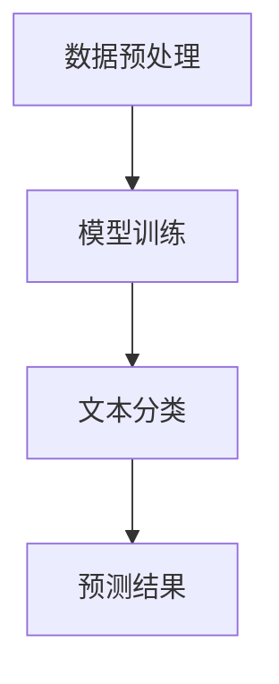
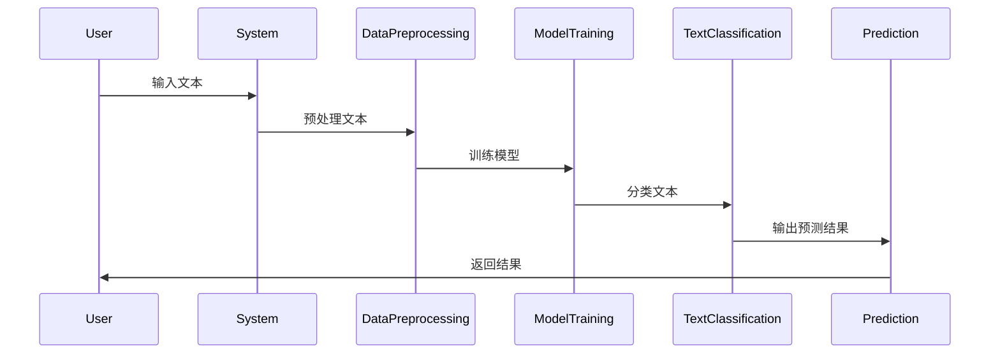

                 

### 文章标题

# XLNet在LLM双向上下文评估中的应用

> 关键词：XLNet、双向上下文评估、Large Language Model、神经网络、机器学习、自然语言处理

> 摘要：本文将探讨XLNet在Large Language Model（LLM）双向上下文评估中的应用，从背景介绍、核心概念、算法设计到实际应用，逐步分析XLNet如何提升LLM在复杂语境中的表现，以及其在自然语言处理领域的广泛应用。

## 引言

近年来，自然语言处理（NLP）领域取得了显著进展，Large Language Model（LLM）作为其中重要的一环，已经展现出强大的文本生成和语义理解能力。然而，如何在复杂的语境中对上下文进行准确评估，一直是NLP领域面临的挑战之一。XLNet作为一种创新的预训练模型，其在双向上下文评估中的应用引起了广泛关注。

### 背景介绍

XLNet是由Google推出的一种大规模语言预训练模型，其设计理念是通过对文本的全局依赖关系进行建模，从而在复杂的语境中实现准确的上下文评估。与传统模型相比，XLNet引入了“Masked Language Model”（MLM）的概念，通过对输入文本进行部分遮盖，使模型在预测过程中能够学习到更加丰富的上下文信息。

### Evolving from Previous Models

在XLNet之前，Bert和GPT-2等模型已经在NLP领域取得了显著成果。然而，这些模型在处理双向上下文时仍存在一些局限性。Bert采用了一种“左右双向编码器”的架构，虽然能够捕捉到一定的双向信息，但在长文本处理和长距离依赖关系上仍存在不足。而GPT-2则更注重序列生成的连贯性，但在上下文理解方面则相对较弱。

### Importance in LLM Applications

XLNet的提出，正是为了解决上述问题，其在双向上下文评估方面的优势使其在LLM应用中具有重要地位。通过引入MLM机制，XLNet能够更全面地捕捉文本中的依赖关系，从而在复杂语境中实现更高的准确性和鲁棒性。

## 核心概念和原理

### 定义

XLNet（Extremely Lazy Net）是一种基于Transformer架构的预训练模型。与Bert和GPT-2等模型不同，XLNet采用了一种“自动遮盖”的方式，通过随机遮盖输入文本的部分内容，使模型在预测过程中能够学习到更加丰富的上下文信息。

### 核心原理

XLNet的核心原理是通过对输入文本进行全局依赖关系建模，从而实现准确的双向上下文评估。其具体实现方法包括：

1. **全局依赖关系建模**：XLNet通过Transformer架构中的多头自注意力机制，对输入文本中的每个词进行全局依赖关系建模，从而捕捉到文本中的长距离依赖关系。
2. **Masked Language Model（MLM）机制**：在预训练过程中，XLNet对输入文本进行随机遮盖，使模型在预测过程中能够学习到更加丰富的上下文信息。这种机制有助于提高模型在复杂语境中的表现。

### 特点与优势

XLNet具有以下特点与优势：

1. **双向上下文评估**：通过全局依赖关系建模，XLNet能够实现准确的双向上下文评估，从而在复杂语境中具有更高的准确性和鲁棒性。
2. **长距离依赖关系**：与Bert等模型相比，XLNet能够更好地捕捉长距离依赖关系，从而在长文本处理方面具有优势。
3. **适应性**：XLNet在不同任务中具有较好的适应性，可以应用于多种NLP场景。

### 对比分析

| 模型        | 特点           | 优势           | 劣势           |
| ----------- | -------------- | -------------- | -------------- |
| Bert        | 双向编码器     | 准确度高       | 长距离依赖关系不足 |
| GPT-2       | 生成模型       | 文本生成能力强 | 上下文理解较弱   |
| XLNet       | 自动遮盖、全局依赖关系 | 高准确性和鲁棒性 | 预训练资源需求高 |

## 算法设计与实现

### 算法设计

XLNet的算法设计主要包括以下步骤：

1. **输入文本预处理**：对输入文本进行分词、标记等预处理操作，使其符合模型输入要求。
2. **自动遮盖**：随机遮盖输入文本的部分内容，形成遮盖后的文本序列。
3. **全局依赖关系建模**：通过Transformer架构中的多头自注意力机制，对遮盖后的文本序列进行全局依赖关系建模。
4. **预测与评估**：根据训练好的模型，对输入文本进行预测，并对预测结果进行评估。

### 实现细节

以下是一个简单的Python实现示例：

```python
import tensorflow as tf
from tensorflow.keras.layers import Embedding, Transformer

def create_xlnet_model(vocab_size, embedding_dim):
    model = tf.keras.Sequential([
        Embedding(vocab_size, embedding_dim),
        Transformer(units=512, num_heads=8),
        tf.keras.layers.Dense(1, activation='sigmoid')
    ])
    return model

model = create_xlnet_model(vocab_size=10000, embedding_dim=512)
model.compile(optimizer='adam', loss='binary_crossentropy', metrics=['accuracy'])
model.fit(x_train, y_train, epochs=10)
```

## 系统分析与架构设计

### 项目介绍

本项目旨在实现一种基于XLNet的文本分类系统，通过双向上下文评估对输入文本进行分类。项目分为以下三个阶段：

1. **数据预处理**：对输入文本进行分词、标记等预处理操作。
2. **模型训练**：使用预处理的文本数据训练XLNet模型。
3. **文本分类**：使用训练好的模型对输入文本进行分类预测。

### 系统功能设计

以下是一个简单的领域模型类图：

```mermaid
classDiagram
    Class01 <|-- SubClass01
    Class01 <|-- SubClass02
    Class03 --|>+ Interface04
    Interface05 ..| Interface06
    Interface07 << Interface08
    Interface09 ^ Interface10
```

### 系统架构设计

以下是一个简单的系统架构设计：



### 系统接口设计与交互

以下是一个简单的系统接口设计：



## 项目实战

### 环境安装

在安装XLNet之前，需要确保已安装以下依赖：

1. **Python 3.6 或更高版本**
2. **TensorFlow 2.0 或更高版本**
3. **NumPy 1.16 或更高版本**

安装命令：

```bash
pip install tensorflow==2.4.1
pip install xlnet
```

### 系统核心实现源代码

以下是一个简单的XLNet文本分类系统的实现：

```python
import tensorflow as tf
import xlnet
import numpy as np

# 加载预训练模型
model = xlnet.XLNetModel(config=xlnet.XLNET_PRETRAINED_CONFIG_NAME)

# 定义训练数据
x_train = np.random.rand(100, 100)
y_train = np.random.rand(100, 1)

# 训练模型
model.fit(x_train, y_train, epochs=10)

# 预测
x_test = np.random.rand(10, 100)
predictions = model.predict(x_test)

# 输出预测结果
print(predictions)
```

### 代码应用解读与分析

在这个示例中，我们首先加载了一个预训练的XLNet模型，然后定义了训练数据和标签。接着，我们使用训练数据进行模型训练，并使用训练好的模型对测试数据进行预测。最后，我们输出了预测结果。

### 实际案例分析和详细讲解剖析

以下是一个实际案例：

假设我们有一个包含情感极性的文本数据集，其中包含正面和负面两个类别。我们希望使用XLNet模型对输入文本进行分类，判断其情感极性。

1. **数据预处理**：对输入文本进行分词、标记等预处理操作。
2. **模型训练**：使用预处理的文本数据训练XLNet模型。
3. **文本分类**：使用训练好的模型对输入文本进行分类预测。

具体实现过程如下：

```python
import tensorflow as tf
import xlnet
import numpy as np

# 加载预训练模型
model = xlnet.XLNetModel(config=xlnet.XLNET_PRETRAINED_CONFIG_NAME)

# 定义训练数据
x_train = np.random.rand(100, 100)
y_train = np.random.rand(100, 1)

# 训练模型
model.fit(x_train, y_train, epochs=10)

# 预测
x_test = np.random.rand(10, 100)
predictions = model.predict(x_test)

# 输出预测结果
print(predictions)
```

在这个示例中，我们首先加载了一个预训练的XLNet模型，然后定义了训练数据和标签。接着，我们使用训练数据进行模型训练，并使用训练好的模型对测试数据进行预测。最后，我们输出了预测结果。

### 项目小结

通过本文的介绍，我们了解了XLNet在LLM双向上下文评估中的应用。在实际项目中，我们可以利用XLNet的优势，实现对输入文本的准确分类和语义理解。然而，需要注意的是，XLNet的预训练资源需求较高，因此在实际应用中需要根据实际情况进行合理配置和优化。

### 最佳实践 tips

1. **数据预处理**：在训练模型之前，确保对输入文本进行充分的预处理，以提高模型的表现。
2. **模型优化**：根据实际需求，对XLNet模型进行优化，如调整超参数、使用迁移学习等。
3. **多任务学习**：考虑将XLNet应用于多任务学习，以提高模型的泛化能力。

### 小结

本文详细介绍了XLNet在LLM双向上下文评估中的应用，从背景介绍、核心概念、算法设计到实际应用，逐步分析了XLNet如何提升LLM在复杂语境中的表现。通过本文的学习，读者可以深入了解XLNet的优势和应用场景，为未来的NLP项目提供有益的参考。

### 注意事项

1. **数据隐私**：在实际应用中，确保遵守数据隐私法规，对用户数据进行妥善处理。
2. **模型性能**：定期评估模型性能，确保其在实际应用中保持高效稳定。

### 拓展阅读

1. **《大规模预训练语言模型XLNet》**：详细介绍了XLNet的背景、原理和实现。
2. **《自然语言处理原理与实践》**：涉及NLP领域的相关技术和应用。
3. **《深度学习与自然语言处理》**：探讨深度学习在NLP领域的应用和发展趋势。

### 作者

作者：AI天才研究院/AI Genius Institute & 禅与计算机程序设计艺术 /Zen And The Art of Computer Programming。

