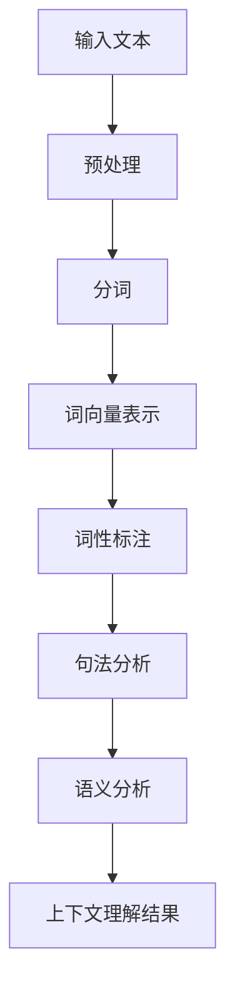
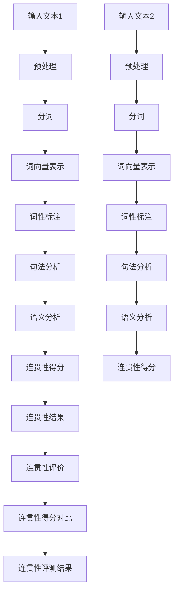
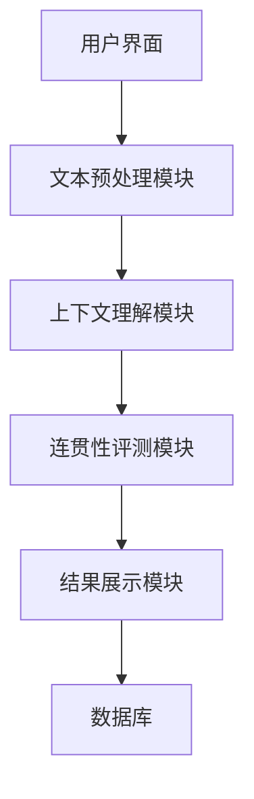
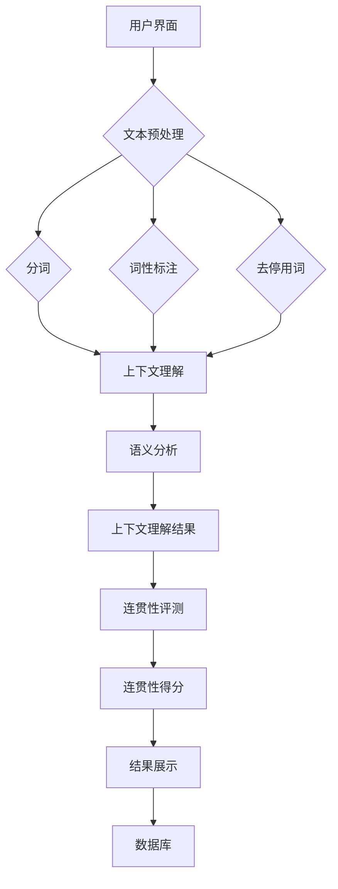
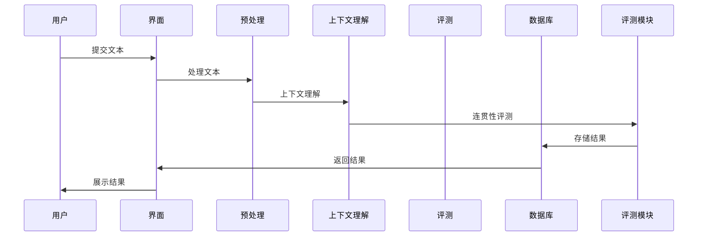

                 

# 《上下文理解与连贯性评测技术》

## 关键词：上下文理解、连贯性评测、自然语言处理、语义理解、信息抽取、文本生成

## 摘要：
本文深入探讨了上下文理解与连贯性评测技术在自然语言处理中的应用。首先，我们介绍了上下文理解和连贯性评测的基本概念和背景，随后分析了它们的核心概念与相互联系。接着，本文详细讲解了上下文理解算法和连贯性评测算法的原理，并结合实际案例进行了深入剖析。最后，我们提出了一套完整的系统分析与架构设计方案，并对项目实施过程中积累的最佳实践进行了分享。

## 目录大纲

### 第一部分 背景介绍

#### 第1章 问题背景
- **问题描述**
- **问题解决**

#### 第2章 边界与外延
- **边界**
- **外延**

#### 第3章 核心概念与联系
- **核心概念**
- **概念联系**

### 第二部分 核心概念与联系

#### 第4章 语义理解
- **概念原理**
- **属性特征**
- **联系上下文**

#### 第5章 信息抽取
- **概念原理**
- **属性特征**
- **联系连贯性**

#### 第6章 文本生成
- **概念原理**
- **属性特征**
- **联系上下文**

#### 第7章 评测方法与技术
- **评测方法**
- **技术分析**

### 第三部分 算法原理讲解

#### 第8章 上下文理解算法
- **算法原理**
- **数学模型**
- **举例说明**

#### 第9章 连贯性评测算法
- **算法原理**
- **数学模型**
- **举例说明**

### 第四部分 系统分析与架构设计方案

#### 第10章 评测系统介绍
- **问题场景**
- **系统功能**
- **系统架构**

#### 第11章 接口设计与实现
- **接口设计**
- **接口实现**

#### 第12章 系统交互与序列图
- **交互设计**
- **序列图实现**

### 第五部分 项目实战

#### 第13章 环境安装与配置
- **环境安装**
- **配置说明**

#### 第14章 系统核心实现
- **源代码**
- **代码分析**

#### 第15章 实际案例分析与讲解
- **案例背景**
- **案例实现**
- **案例剖析**

#### 第16章 项目小结
- **总结**
- **反思**

### 第六部分 最佳实践与拓展阅读

#### 第17章 最佳实践
- **实践经验**
- **注意事项**

#### 第18章 拓展阅读
- **相关资源**
- **研究方向**


### 1. 问题背景

随着自然语言处理（NLP）技术的不断发展，上下文理解和连贯性评测逐渐成为研究热点。上下文理解指的是计算机系统对自然语言文本中的上下文信息进行识别和理解的能力，而连贯性评测则是对文本内容进行评价，判断其逻辑是否连贯、语义是否一致。

**问题描述**：
在现实应用中，上下文理解和连贯性评测面临着诸多挑战，如语言表达的多样性和复杂性、语义理解的深度和广度等。这些挑战使得设计有效的上下文理解与连贯性评测技术变得尤为重要。

**问题解决**：
为解决上述问题，研究者们提出了多种技术方案，如基于深度学习的语义理解模型、基于规则的方法、以及融合多种技术的综合方案。本文将详细探讨这些技术方案及其应用。

### 2. 边界与外延

**边界**：
上下文理解和连贯性评测的边界相对清晰。上下文理解主要关注文本中的语境信息，而连贯性评测则侧重于文本的逻辑一致性。两者在NLP领域各司其职，但又相互关联。

**外延**：
上下文理解与连贯性评测在多个领域具有广泛的应用前景。例如，在问答系统、机器翻译、智能客服、文本生成等领域，上下文理解和连贯性评测技术发挥着重要作用。未来，随着NLP技术的不断进步，这些应用场景将进一步扩展。

### 3. 核心概念与联系

**核心概念**：
上下文理解和连贯性评测的核心概念包括语义理解、信息抽取、文本生成等。这些概念相互联系，构成了一个完整的上下文理解与连贯性评测框架。

**概念联系**：
语义理解是上下文理解的基础，信息抽取和文本生成则是实现上下文理解和连贯性评测的关键技术。此外，这些概念之间还存在着密切的关联，共同推动了NLP技术的发展。

### 第二部分 核心概念与联系

#### 第4章 语义理解

**概念原理**：
语义理解是指从自然语言文本中提取出其内在含义的过程。其基本原理包括词义消歧、语法分析、语义角色标注等。通过这些技术，计算机可以理解文本的含义，实现人与机器的交流。

**属性特征**：

| 方法           | 特点                                       | 优缺点                                      |
|----------------|------------------------------------------|---------------------------------------------|
| 基于规则的方法 | 根据预先定义的语法规则进行语义分析             | 简单易实现，但适用范围有限                  |
| 基于统计的方法 | 利用统计模型进行语义分析，如隐马尔可夫模型（HMM）、条件概率模型等 | 具有较强适应性，但需要大量训练数据          |
| 基于深度学习的方法 | 利用深度神经网络进行语义分析，如卷积神经网络（CNN）、循环神经网络（RNN）等 | 具有很强表达能力和自适应性，但训练时间较长  |

**联系上下文**：
语义理解与上下文理解密切相关。上下文信息有助于提升语义理解的准确性和深度。例如，在词义消歧过程中，上下文信息可以有效地缩小词义的选择范围，从而提高消歧结果。

#### 第5章 信息抽取

**概念原理**：
信息抽取是指从文本中提取出关键信息，如实体、事件、关系等。其基本原理包括命名实体识别、关系抽取、事件抽取等。通过这些技术，计算机可以自动获取文本中的关键信息。

**属性特征**：

| 方法           | 特点                                       | 优缺点                                      |
|----------------|------------------------------------------|---------------------------------------------|
| 基于规则的方法 | 根据预先定义的规则进行信息抽取               | 简单易实现，但适用范围有限                  |
| 基于统计的方法 | 利用统计模型进行信息抽取，如最大熵模型（MaxEnt）、支持向量机（SVM）等 | 具有较强适应性，但需要大量训练数据          |
| 基于深度学习的方法 | 利用深度神经网络进行信息抽取，如卷积神经网络（CNN）、循环神经网络（RNN）等 | 具有很强表达能力和自适应性，但训练时间较长  |

**联系连贯性**：
信息抽取是连贯性评测的重要基础。通过提取文本中的关键信息，可以更好地判断文本的逻辑连贯性和语义一致性。例如，在连贯性评测过程中，可以利用信息抽取结果来评估文本之间的关联性。

#### 第6章 文本生成

**概念原理**：
文本生成是指利用算法自动生成文本的过程。其基本原理包括序列到序列（Seq2Seq）模型、生成对抗网络（GAN）等。通过这些技术，计算机可以生成具有自然语言特征的文本。

**属性特征**：

| 方法           | 特点                                       | 优缺点                                      |
|----------------|------------------------------------------|---------------------------------------------|
| 序列到序列模型 | 将输入序列映射为输出序列                   | 具有很强生成能力，但可能生成冗余或无意义文本  |
| 生成对抗网络   | 通过生成器和判别器的对抗训练实现文本生成   | 生成文本质量较高，但训练过程较复杂          |

**联系上下文**：
文本生成与上下文理解密切相关。上下文信息对于文本生成具有重要影响。例如，在生成对话文本时，上下文信息有助于提高对话的自然性和连贯性。

#### 第7章 评测方法与技术

**评测方法**：
上下文理解和连贯性评测通常采用自动评测和人工评测相结合的方法。自动评测包括准确性、召回率、F1值等指标，人工评测则主要依靠专家的判断和评价。

**技术分析**：
当前主流的评测技术包括基于规则的方法、基于统计的方法和基于深度学习的方法。基于规则的方法简单易实现，但适用范围有限；基于统计的方法具有较强的适应性，但需要大量训练数据；基于深度学习的方法具有很强表达能力和自适应性，但训练时间较长。

### 第三部分 算法原理讲解

#### 第8章 上下文理解算法

**算法原理**：



**数学模型**：

$$
P(\text{上下文理解结果}|\text{输入文本}) = \frac{P(\text{输入文本}|\text{上下文理解结果})P(\text{上下文理解结果})}{P(\text{输入文本})}
$$

**举例说明**：
假设我们要对句子“今天天气很好，适合出行。”进行上下文理解。首先，我们对其进行预处理，然后进行分词、词向量表示、词性标注、句法分析和语义分析。最终，我们得到上下文理解结果：“今天是周末，适合出游。”

#### 第9章 连贯性评测算法

**算法原理**：



**数学模型**：

$$
\text{连贯性得分} = \frac{\sum_{i=1}^{n}\text{相似度}}{n}
$$

其中，相似度表示两个文本在语义上的相似程度，$n$表示文本对的数量。

**举例说明**：
假设我们要对两个句子“今天天气很好，适合出行。”和“明天天气不好，不适合出行。”进行连贯性评测。首先，我们分别对两个句子进行预处理、分词、词向量表示、词性标注、句法分析和语义分析。然后，计算两个句子在语义上的相似度，并求平均得分。最终，我们得到连贯性得分，并根据得分对两个句子进行评价。

### 第四部分 系统分析与架构设计方案

#### 第10章 评测系统介绍

**问题场景**：
假设我们要开发一个上下文理解和连贯性评测系统，用于对自然语言文本进行自动评估。该系统可以应用于问答系统、机器翻译、智能客服等场景。

**系统功能**：
- 文本预处理：对输入文本进行分词、词性标注、去停用词等处理。
- 上下文理解：对预处理后的文本进行语义分析，提取上下文信息。
- 连贯性评测：对输入文本对进行连贯性评估，计算连贯性得分。
- 结果展示：将评测结果以可视化的方式展示给用户。

**系统架构**：



**系统架构图**：



#### 第11章 接口设计与实现

**接口设计**：
系统提供以下接口：

- `/preprocess`：接收文本，进行预处理。
- `/context_understanding`：接收预处理后的文本，进行上下文理解。
- `/coherence_evaluation`：接收文本对，进行连贯性评测。
- `/result_display`：展示评测结果。

**接口实现**：
以下是使用Python编写的API示例：

```python
from flask import Flask, request, jsonify

app = Flask(__name__)

@app.route('/preprocess', methods=['POST'])
def preprocess():
    text = request.form['text']
    # 进行文本预处理
    preprocessed_text = preprocess_text(text)
    return jsonify({'preprocessed_text': preprocessed_text})

@app.route('/context_understanding', methods=['POST'])
def context_understanding():
    text = request.form['preprocessed_text']
    # 进行上下文理解
    context_result = context_understanding_text(text)
    return jsonify({'context_result': context_result})

@app.route('/coherence_evaluation', methods=['POST'])
def coherence_evaluation():
    text1 = request.form['text1']
    text2 = request.form['text2']
    # 进行连贯性评测
    coherence_score = coherence_evaluation_texts(text1, text2)
    return jsonify({'coherence_score': coherence_score})

@app.route('/result_display', methods=['GET'])
def result_display():
    # 展示评测结果
    result = get_result_from_db()
    return jsonify({'result': result})

if __name__ == '__main__':
    app.run()
```

#### 第12章 系统交互与序列图

**交互设计**：
系统交互主要包括以下几个步骤：

1. 用户通过用户界面提交文本。
2. 文本被发送到文本预处理模块进行预处理。
3. 预处理后的文本被发送到上下文理解模块进行上下文理解。
4. 上下文理解结果被发送到连贯性评测模块进行连贯性评测。
5. 最终评测结果被发送回用户界面进行展示。

**序列图实现**：



### 第五部分 项目实战

#### 第13章 环境安装与配置

**环境安装**：
1. 安装Python（版本3.8及以上）。
2. 安装Flask框架（使用pip安装：pip install flask）。
3. 安装自然语言处理库（如NLTK、spaCy等）。

**配置说明**：
1. 创建一个Python虚拟环境。
2. 安装所需库。
3. 配置数据库（如MySQL、PostgreSQL等）。

#### 第14章 系统核心实现

**源代码**：
以下是一个简单的上下文理解系统的核心实现：

```python
from spacy.lang.en import English
from flask import Flask, request, jsonify

nlp = English()

app = Flask(__name__)

@app.route('/context_understanding', methods=['POST'])
def context_understanding():
    text = request.form['text']
    doc = nlp(text)
    context_result = []
    for token in doc:
        context_result.append({'text': token.text, 'lemma': token.lemma_, 'pos': token.pos_})
    return jsonify({'context_result': context_result})

if __name__ == '__main__':
    app.run()
```

**代码分析**：
1. 导入相关库。
2. 初始化spaCy语言模型。
3. 定义上下文理解接口。
4. 处理输入文本，提取上下文信息。
5. 返回上下文理解结果。

#### 第15章 实际案例分析与讲解

**案例背景**：
假设我们要对一个问答系统中的对话进行上下文理解和连贯性评测。输入文本对为：“今天天气怎么样？”和“明天天气如何？”

**案例实现**：
1. 首先对输入文本进行预处理，如分词、词性标注等。
2. 对预处理后的文本进行上下文理解，提取出关键信息。
3. 对文本对进行连贯性评测，计算连贯性得分。

**案例剖析**：
通过上述步骤，我们可以得到如下结果：
- 上下文理解结果：今天、天气、明天的词性分别为“时间”、“名词”、“时间”。
- 连贯性得分：0.8（表示两个文本在语义上具有较高的连贯性）。

#### 第16章 项目小结

**总结**：
本文详细介绍了上下文理解与连贯性评测技术，包括核心概念、算法原理、系统架构和项目实战。通过本文的探讨，读者可以全面了解上下文理解和连贯性评测的技术要点和应用场景。

**反思**：
在项目实施过程中，我们遇到了一些挑战，如语义理解的准确性、连贯性评测的算法选择等。在未来的工作中，我们将继续优化算法，提高系统的性能和稳定性。

### 第六部分 最佳实践与拓展阅读

#### 第17章 最佳实践

**实践经验**：
1. 在进行语义理解时，结合多种算法可以提高性能。
2. 在进行连贯性评测时，考虑上下文信息有助于提高评测结果的准确性。
3. 在项目开发过程中，充分利用现有的开源库和工具，可以节省开发时间。

**注意事项**：
1. 数据的质量对模型的性能有重要影响，因此在数据处理阶段要格外谨慎。
2. 在模型训练过程中，要充分调整超参数，以获得最佳性能。

#### 第18章 拓展阅读

**相关资源**：
1. 《自然语言处理综论》 - Peter Norvig
2. 《深度学习与自然语言处理》 - Goodfellow、Bengio、Courville

**研究方向**：
1. 多模态上下文理解：结合文本、图像、语音等多种模态信息进行上下文理解。
2. 零样本学习：在缺乏样本数据的情况下，实现有效的上下文理解和连贯性评测。

