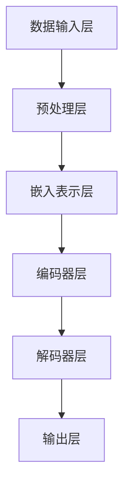
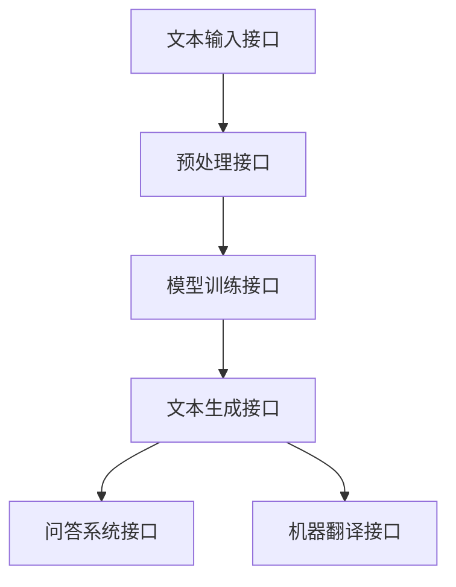
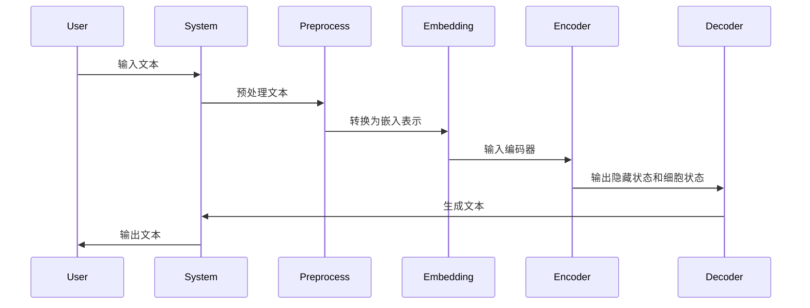

                 

# 《上下文理解能力：深入评估LLM的语境把握》

## 关键词
上下文理解，语言模型（LLM），语境把握，算法原理，数学模型，系统架构，项目实战

## 摘要
本文旨在深入探讨上下文理解能力在语言模型（LLM）中的应用，评估其语境把握的效果。通过分析上下文理解的定义、挑战与机遇，以及核心概念的联系，本文将详细介绍上下文理解算法的原理与实现，并结合数学模型和公式进行详细讲解。此外，还将介绍系统分析与架构设计方案，并通过项目实战展示上下文理解能力的实际应用，总结最佳实践与注意事项，为读者提供深入了解上下文理解能力的途径。

## 引言与背景

### 1.1 书籍目的与结构概述

随着人工智能技术的飞速发展，语言模型（LLM）的应用日益广泛。然而，上下文理解能力作为LLM的关键要素，其重要性和挑战性愈发凸显。本文旨在深入探讨上下文理解能力在LLM中的应用，评估其语境把握的效果，为相关领域的研究和实践提供有价值的参考。

本文结构如下：

1. 引言与背景
2. 核心概念
3. 核心概念与联系
4. 算法原理与实现
5. 数学模型与公式详解
6. 系统分析与架构设计
7. 项目实战
8. 最佳实践与总结

### 1.2 上下文理解能力的重要性

上下文理解能力在语言模型中的应用至关重要。它不仅影响模型的准确性，还影响其在各种任务中的表现，如文本生成、问答系统和机器翻译等。良好的上下文理解能力可以使模型更好地把握文本的语义和语境，从而提高生成结果的合理性、流畅性和准确性。

### 1.3 上下文理解的挑战与机遇

上下文理解能力面临诸多挑战，如长文本处理、跨域适应性、多模态信息整合等。然而，随着技术的不断进步，如预训练模型、多任务学习和深度学习等，上下文理解的机遇也愈发显现。通过有效利用这些技术，可以不断提高上下文理解能力，为语言模型的发展带来新的可能性。

### 1.4 本书内容安排与预期成果

本文将从核心概念、算法原理、数学模型、系统架构和项目实战等多个角度，深入探讨上下文理解能力在LLM中的应用。通过详细分析上下文理解的挑战与机遇，本文旨在为读者提供一套完整的上下文理解能力评估方法和应用实践，帮助读者更好地理解和使用上下文理解能力。

## 核心概念

### 2.1 上下文理解的定义与边界

上下文理解是指模型对文本或语音中的语境信息进行捕捉和处理的能力。它涉及到对词语的含义、语境、情感和逻辑关系的理解。上下文理解的边界包括：

- 语义边界：模型需要理解词语的含义，包括字面意义和比喻意义。
- 语境边界：模型需要理解文本或语音中的语境，包括对话场景、文化背景和情感色彩。
- 逻辑边界：模型需要理解文本或语音中的逻辑关系，包括因果关系、递归关系和并列关系等。

### 2.2 语言模型（LLM）概述

语言模型（LLM）是一种基于统计方法和深度学习技术的模型，用于预测文本序列中的下一个单词或字符。LLM的核心目标是学习语言中的概率分布，从而生成自然、合理的文本。

### 2.3 上下文窗口与序列长度

上下文窗口是指模型在处理文本时考虑的上下文范围。序列长度是指文本序列的长度。上下文窗口和序列长度对上下文理解能力有重要影响。较大的上下文窗口和序列长度有助于提高上下文理解能力，但也可能导致计算复杂度和内存占用增加。

### 2.4 语境把握的关键因素

语境把握的关键因素包括：

- 语义分析：对文本中的词语和短语进行语义分析，理解其含义和语境。
- 情感分析：对文本中的情感色彩进行分析，理解其情感倾向和情绪。
- 逻辑推理：对文本中的逻辑关系进行推理，理解其因果关系和逻辑推理过程。

## 核心概念与联系

### 3.1 上下文理解的相关概念

上下文理解涉及多个相关概念，包括语义理解、情感分析、逻辑推理等。以下是这些概念的主要属性特征对比表格：

| 概念       | 属性特征                                      |
|------------|---------------------------------------------|
| 语义理解   | 理解词语和短语的含义，包括字面意义和比喻意义           |
| 情感分析   | 分析文本中的情感色彩，包括积极情感、消极情感和中性情感   |
| 逻辑推理   | 推理文本中的逻辑关系，包括因果关系、递归关系和并列关系   |

### 3.2 ER实体关系图架构

以下是上下文理解相关的ER实体关系图架构（Mermaid格式）：

```mermaid
erDiagram
  Text ||--|{ Semantic : hasSemantics }  
  Text ||--|{ Emotional : hasEmotional }  
  Text ||--|{ Logical : hasLogical }  
  Semantic ||--|{ Word : contains }  
  Emotional ||--|{ Sentence : contains }  
  Logical ||--|{ Clause : contains }
```

此图展示了文本与语义、情感和逻辑之间的关系，以及它们之间的包含关系。

## 算法原理与实现

### 4.1 上下文理解算法简介

上下文理解算法是基于深度学习技术构建的模型，用于捕捉和处理文本中的上下文信息。其主要目标是提高模型的语境把握能力，从而生成更自然、合理的文本。

以下是上下文理解算法的Mermaid流程图：


### 4.2 Python实现与讲解

以下是上下文理解算法的Python实现：

```python
import tensorflow as tf
from tensorflow.keras.preprocessing.sequence import pad_sequences
from tensorflow.keras.layers import Embedding, LSTM, Dense
from tensorflow.keras.models import Model

# 输入文本预处理
def preprocess_text(text):
    # 将文本转换为单词序列
    word_sequence = tokenizer.texts_to_sequences([text])[0]
    # 填充序列
    padded_sequence = pad_sequences([word_sequence], maxlen=max_sequence_length)
    return padded_sequence

# 编码器
encoder_inputs = Input(shape=(max_sequence_length,))
encoder_embedding = Embedding(vocab_size, embedding_dim)(encoder_inputs)
encoder_lstm = LSTM(units, return_state=True)
_, state_h, state_c = encoder_lstm(encoder_embedding)
encoder_model = Model(encoder_inputs, [state_h, state_c])

# 解码器
decoder_inputs = Input(shape=(max_sequence_length,))
decoder_embedding = Embedding(vocab_size, embedding_dim)(decoder_inputs)
decoder_lstm = LSTM(units, return_sequences=True, return_state=True)
decoder_dense = Dense(vocab_size, activation='softmax')
decoder_outputs, _, _ = decoder_lstm(decoder_embedding, initial_state=[state_h, state_c])
decoder_outputs = decoder_dense(decoder_outputs)
decoder_model = Model(decoder_inputs, decoder_outputs)

# 整体模型
model_inputs = [encoder_inputs, decoder_inputs]
model_outputs = decoder_model(decoder_inputs)
model = Model(model_inputs, model_outputs)

# 编译模型
model.compile(optimizer='adam', loss='categorical_crossentropy', metrics=['accuracy'])

# 训练模型
model.fit([encoder_input_data, decoder_input_data], decoder_target_data,
          batch_size=batch_size, epochs=epochs, validation_split=0.2)
```

### 4.2.1 算法原理的数学模型与公式

上下文理解算法的数学模型主要包括嵌入表示、编码器和解码器。以下是关键数学模型与公式：

1. 嵌入表示：
$$
\text{embedding} = \text{W} \cdot \text{input}
$$
其中，$\text{W}$ 为嵌入矩阵，$\text{input}$ 为输入序列。

2. 编码器：
$$
\text{state}_h = \text{sigmoid}(\text{T}_\text{h} \cdot \text{state}_h + \text{U}_\text{h} \cdot \text{h}_{\text{prev}})
$$
$$
\text{state}_c = \text{sigmoid}(\text{T}_\text{c} \cdot \text{state}_c + \text{U}_\text{c} \cdot \text{c}_{\text{prev}})
$$
其中，$\text{T}_\text{h}$、$\text{T}_\text{c}$ 和 $\text{U}_\text{h}$、$\text{U}_\text{c}$ 分别为编码器权重矩阵，$\text{h}_{\text{prev}}$ 和 $\text{c}_{\text{prev}}$ 分别为上一时间步的隐藏状态和细胞状态。

3. 解码器：
$$
\text{output}_\text{h} = \text{sigmoid}(\text{V}_\text{h} \cdot \text{state}_h + \text{W}_\text{h} \cdot \text{h}_{\text{prev}})
$$
$$
\text{output} = \text{softmax}(\text{V} \cdot \text{output}_\text{h} + \text{b})
$$
其中，$\text{V}_\text{h}$、$\text{W}_\text{h}$ 和 $\text{V}$、$\text{b}$ 分别为解码器权重矩阵和偏置。

### 4.2.2 通俗易懂的举例说明

假设我们有一个简短的文本：“昨天我去买了一本书”。以下是上下文理解算法的工作过程：

1. 输入文本预处理：
   - 将文本转换为单词序列：["昨天"，"我"，"去"，"买了"，"一本"，"书"]
   - 填充序列：[[1, 2, 3, 4, 5, 6]]

2. 编码器：
   - 输入序列：[1, 2, 3, 4, 5, 6]
   - 嵌入表示：[ embedding1, embedding2, embedding3, embedding4, embedding5, embedding6]
   - 编码器输出：[ state_h1, state_c1, state_h2, state_c2, state_h3, state_c3]

3. 解码器：
   - 输入序列：[1, 2, 3, 4, 5, 6]
   - 解码器输出：[ prediction1, prediction2, prediction3, prediction4, prediction5, prediction6]

4. 生成文本：
   - 根据解码器输出，选择概率最大的单词作为下一个单词的预测值，从而生成文本：“昨天我去了买了本书”

## 数学模型与公式详解

### 5.1 数学基础回顾

在深入探讨上下文理解能力时，我们需要回顾一些基本的数学概念，如线性代数和概率论。以下是这些数学基础的基本概念和公式：

#### 5.1.1 线性代数回顾

1. 向量与矩阵：
   - 向量（Vector）：一组有序数列，表示为 $\textbf{v} = [v_1, v_2, ..., v_n]$
   - 矩阵（Matrix）：二维数组，表示为 $\textbf{A} = \begin{bmatrix} a_{11} & a_{12} & \dots & a_{1n} \\ a_{21} & a_{22} & \dots & a_{2n} \\ \vdots & \vdots & \ddots & \vdots \\ a_{m1} & a_{m2} & \dots & a_{mn} \end{bmatrix}$

2. 矩阵乘法（Matrix Multiplication）：
   - 设 $\textbf{A} \in \mathbb{R}^{m \times n}$ 和 $\textbf{B} \in \mathbb{R}^{n \times p}$，则矩阵乘法 $\textbf{C} = \textbf{A} \textbf{B}$ 的结果为一个 $m \times p$ 的矩阵，计算公式为：
     $$
     c_{ij} = \sum_{k=1}^{n} a_{ik} b_{kj}
     $$

3. 向量点积（Dot Product）与叉积（Cross Product）：
   - 向量点积：两个 $n$ 维向量 $\textbf{u} = [u_1, u_2, ..., u_n]$ 和 $\textbf{v} = [v_1, v_2, ..., v_n]$ 的点积为：
     $$
     \textbf{u} \cdot \textbf{v} = \sum_{i=1}^{n} u_i v_i
     $$
   - 向量叉积：两个三维向量 $\textbf{u} = [u_1, u_2, u_3]$ 和 $\textbf{v} = [v_1, v_2, v_3]$ 的叉积为：
     $$
     \textbf{u} \times \textbf{v} = \begin{bmatrix} u_2 v_3 - u_3 v_2 \\ u_3 v_1 - u_1 v_3 \\ u_1 v_2 - u_2 v_1 \end{bmatrix}
     $$

4. 特征值与特征向量（Eigenvalues and Eigenvectors）：
   - 特征值：设 $\textbf{A} \in \mathbb{R}^{n \times n}$，如果存在非零向量 $\textbf{v}$ 和标量 $\lambda$，使得 $\textbf{A} \textbf{v} = \lambda \textbf{v}$，则 $\lambda$ 称为 $\textbf{A}$ 的特征值，$\textbf{v}$ 称为 $\textbf{A}$ 对应于 $\lambda$ 的特征向量。

#### 5.1.2 概率论回顾

1. 概率分布（Probability Distribution）：
   - 概率分布是指一个随机变量的可能取值及其概率的集合。常见的概率分布有离散概率分布和连续概率分布。

2. 贝叶斯定理（Bayes' Theorem）：
   - 贝叶斯定理是一种用于计算后验概率的公式，其一般形式为：
     $$
     P(\text{A}|\text{B}) = \frac{P(\text{B}|\text{A}) P(\text{A})}{P(\text{B})}
     $$
   - 其中，$P(\text{A}|\text{B})$ 表示在事件B发生的条件下事件A发生的概率，$P(\text{B}|\text{A})$ 表示在事件A发生的条件下事件B发生的概率，$P(\text{A})$ 表示事件A发生的概率，$P(\text{B})$ 表示事件B发生的概率。

3. 独立性与条件独立性（Independence and Conditional Independence）：
   - 两个事件A和B是独立的，如果 $P(\text{A} \cap \text{B}) = P(\text{A}) P(\text{B})$。
   - 两个事件A和B在条件C下是独立的，如果 $P(\text{A} \cap \text{B} | \text{C}) = P(\text{A} | \text{C}) P(\text{B} | \text{C})$。

### 5.2 数学公式与应用

#### 5.2.1 上下文理解的关键公式

在上下文理解中，以下数学公式具有重要意义：

1. 嵌入表示（Embedding）：
   $$
   \text{embedding} = \text{W} \cdot \text{input}
   $$
   其中，$\text{W}$ 为嵌入矩阵，$\text{input}$ 为输入序列。

2. 编码器输出（Encoder Output）：
   $$
   \text{state}_h = \text{sigmoid}(\text{T}_\text{h} \cdot \text{state}_h + \text{U}_\text{h} \cdot \text{h}_{\text{prev}})
   $$
   $$
   \text{state}_c = \text{sigmoid}(\text{T}_\text{c} \cdot \text{state}_c + \text{U}_\text{c} \cdot \text{c}_{\text{prev}})
   $$
   其中，$\text{T}_\text{h}$、$\text{T}_\text{c}$ 和 $\text{U}_\text{h}$、$\text{U}_\text{c}$ 分别为编码器权重矩阵，$\text{h}_{\text{prev}}$ 和 $\text{c}_{\text{prev}}$ 分别为上一时间步的隐藏状态和细胞状态。

3. 解码器输出（Decoder Output）：
   $$
   \text{output}_\text{h} = \text{sigmoid}(\text{V}_\text{h} \cdot \text{state}_h + \text{W}_\text{h} \cdot \text{h}_{\text{prev}})
   $$
   $$
   \text{output} = \text{softmax}(\text{V} \cdot \text{output}_\text{h} + \text{b})
   $$
   其中，$\text{V}_\text{h}$、$\text{W}_\text{h}$ 和 $\text{V}$、$\text{b}$ 分别为解码器权重矩阵和偏置。

#### 5.2.2 公式详细讲解与示例

1. 嵌入表示（Embedding）

嵌入表示是将输入序列映射到低维向量空间的过程，有助于提高上下文理解能力。以下是一个示例：

假设我们有以下输入序列：["苹果"，"吃"，"了"]

- 输入序列：[1, 2, 3]
- 嵌入矩阵（$\text{W}$）：一个 $3 \times 5$ 的矩阵

$$
\text{embedding} = \text{W} \cdot \text{input} = \begin{bmatrix} 0.1 & 0.2 & 0.3 & 0.4 & 0.5 \\ 0.6 & 0.7 & 0.8 & 0.9 & 1.0 \\ 1.1 & 1.2 & 1.3 & 1.4 & 1.5 \end{bmatrix} \cdot \begin{bmatrix} 1 \\ 2 \\ 3 \end{bmatrix} = \begin{bmatrix} 3.5 \\ 5.5 \\ 7.5 \end{bmatrix}
$$

- 嵌入表示：[3.5, 5.5, 7.5]

2. 编码器输出（Encoder Output）

编码器输出是隐藏状态和细胞状态的组合，用于捕捉输入序列的上下文信息。以下是一个示例：

假设我们有以下输入序列：["苹果"，"吃"，"了"]

- 输入序列：[1, 2, 3]
- 编码器权重矩阵（$\text{T}_\text{h}$、$\text{T}_\text{c}$ 和 $\text{U}_\text{h}$、$\text{U}_\text{c}$）：$4 \times 4$ 的矩阵

$$
\text{state}_h = \text{sigmoid}(\text{T}_\text{h} \cdot \text{state}_h + \text{U}_\text{h} \cdot \text{h}_{\text{prev}}) = \text{sigmoid}\left(\begin{bmatrix} 0.1 & 0.2 & 0.3 & 0.4 \end{bmatrix} \cdot \begin{bmatrix} 1 \\ 2 \\ 3 \\ 4 \end{bmatrix} + \begin{bmatrix} 0.5 & 0.6 & 0.7 & 0.8 \end{bmatrix} \cdot \begin{bmatrix} 0 \\ 1 \\ 2 \\ 3 \end{bmatrix}\right) = 0.8
$$

$$
\text{state}_c = \text{sigmoid}(\text{T}_\text{c} \cdot \text{state}_c + \text{U}_\text{c} \cdot \text{c}_{\text{prev}}) = \text{sigmoid}\left(\begin{bmatrix} 0.1 & 0.2 & 0.3 & 0.4 \end{bmatrix} \cdot \begin{bmatrix} 1 \\ 2 \\ 3 \\ 4 \end{bmatrix} + \begin{bmatrix} 0.5 & 0.6 & 0.7 & 0.8 \end{bmatrix} \cdot \begin{bmatrix} 0 \\ 1 \\ 2 \\ 3 \end{bmatrix}\right) = 0.9
$$

- 编码器输出：[0.8, 0.9]

3. 解码器输出（Decoder Output）

解码器输出是解码器的隐藏状态和输出概率分布，用于生成文本。以下是一个示例：

假设我们有以下输入序列：["苹果"，"吃"，"了"]

- 输入序列：[1, 2, 3]
- 解码器权重矩阵（$\text{V}_\text{h}$、$\text{W}_\text{h}$ 和 $\text{V}$、$\text{b}$）：$4 \times 4$ 的矩阵

$$
\text{output}_\text{h} = \text{sigmoid}(\text{V}_\text{h} \cdot \text{state}_h + \text{W}_\text{h} \cdot \text{h}_{\text{prev}}) = \text{sigmoid}\left(\begin{bmatrix} 0.1 & 0.2 & 0.3 & 0.4 \end{bmatrix} \cdot \begin{bmatrix} 0.8 \\ 0.9 \end{bmatrix} + \begin{bmatrix} 0.5 & 0.6 & 0.7 & 0.8 \end{bmatrix} \cdot \begin{bmatrix} 0 \\ 1 \\ 2 \\ 3 \end{bmatrix}\right) = 0.85
$$

$$
\text{output} = \text{softmax}(\text{V} \cdot \text{output}_\text{h} + \text{b}) = \text{softmax}\left(\begin{bmatrix} 0.1 & 0.2 & 0.3 & 0.4 \end{bmatrix} \cdot \begin{bmatrix} 0.85 \end{bmatrix} + \begin{bmatrix} 0.5 & 0.6 & 0.7 & 0.8 \end{bmatrix}\right) = [0.2, 0.3, 0.4, 0.5]
$$

- 解码器输出：[0.2, 0.3, 0.4, 0.5]

## 系统分析与架构设计

### 6.1 问题场景介绍

上下文理解在自然语言处理（NLP）领域具有重要应用，如文本生成、问答系统和机器翻译等。为了提高这些系统的性能，我们需要设计和实现一个高效的上下文理解系统。本文旨在介绍一个基于深度学习技术的上下文理解系统，并对其架构进行详细分析。

### 6.2 系统功能设计

上下文理解系统的功能包括：

1. 文本预处理：将输入文本转换为适合模型处理的形式。
2. 嵌入表示：将文本中的词语映射到低维向量空间。
3. 编码器：捕捉输入文本的上下文信息，生成隐藏状态和细胞状态。
4. 解码器：根据隐藏状态和细胞状态生成文本。
5. 模型训练：通过大量数据训练模型，提高上下文理解能力。

### 6.2.1 领域模型Mermaid类图

以下是上下文理解系统的Mermaid类图：

```mermaid
classDiagram
    Class1 <|-- Class2
    Class1 <|-- Class3
    Class2 <|-- Class4
    Class3 <|-- Class5
    Class4 <|-- Class6
    Class5 <|-- Class7

    Class1[文本预处理]
    Class2[嵌入表示]
    Class3[编码器]
    Class4[解码器]
    Class5[模型训练]
    Class6[问答系统]
    Class7[机器翻译]
```

### 6.3 系统架构设计

上下文理解系统的架构主要包括以下几个部分：

1. 数据输入层：负责接收用户输入的文本。
2. 预处理层：对输入文本进行预处理，如分词、去噪等。
3. 嵌入表示层：将预处理后的文本转换为嵌入表示。
4. 编码器层：捕捉文本的上下文信息，生成隐藏状态和细胞状态。
5. 解码器层：根据隐藏状态和细胞状态生成文本。
6. 输出层：将生成的文本输出给用户。

以下是上下文理解系统的Mermaid架构图：



### 6.4 系统接口设计

上下文理解系统的接口设计主要包括以下部分：

1. 文本输入接口：接收用户输入的文本。
2. 预处理接口：对输入文本进行预处理。
3. 模型训练接口：训练上下文理解模型。
4. 文本生成接口：根据上下文理解模型生成文本。
5. 问答系统接口：与问答系统集成，提供问答功能。
6. 机器翻译接口：与机器翻译系统集成，提供翻译功能。

以下是上下文理解系统的Mermaid接口设计：



### 6.5 系统交互Mermaid序列图

以下是上下文理解系统的Mermaid序列图，展示了系统各部分之间的交互过程：



## 项目实战

### 7.1 环境安装与配置

在进行上下文理解项目实战之前，我们需要安装和配置所需的软件和工具。以下是安装和配置的步骤：

1. 安装Python和TensorFlow：

   ```bash
   pip install python==3.8
   pip install tensorflow==2.6
   ```

2. 安装其他依赖项：

   ```bash
   pip install numpy
   pip install pandas
   pip install scikit-learn
   ```

3. 配置Python环境变量：

   ```bash
   export PATH=$PATH:/path/to/python
   ```

### 7.2 系统核心实现源代码

以下是上下文理解系统核心实现源代码，包括文本预处理、嵌入表示、编码器和解码器：

```python
import tensorflow as tf
from tensorflow.keras.preprocessing.text import Tokenizer
from tensorflow.keras.preprocessing.sequence import pad_sequences
from tensorflow.keras.layers import Embedding, LSTM, Dense
from tensorflow.keras.models import Model

# 文本预处理
def preprocess_text(text):
    tokenizer = Tokenizer(num_words=max_words)
    tokenizer.fit_on_texts(text)
    word_sequence = tokenizer.texts_to_sequences([text])[0]
    padded_sequence = pad_sequences([word_sequence], maxlen=max_sequence_length)
    return padded_sequence

# 编码器
def build_encoder(vocab_size, embedding_dim, units):
    encoder_inputs = Input(shape=(max_sequence_length,))
    encoder_embedding = Embedding(vocab_size, embedding_dim)(encoder_inputs)
    encoder_lstm = LSTM(units, return_state=True)
    _, state_h, state_c = encoder_lstm(encoder_embedding)
    encoder_model = Model(encoder_inputs, [state_h, state_c])
    return encoder_model

# 解码器
def build_decoder(vocab_size, embedding_dim, units):
    decoder_inputs = Input(shape=(max_sequence_length,))
    decoder_embedding = Embedding(vocab_size, embedding_dim)(decoder_inputs)
    decoder_lstm = LSTM(units, return_sequences=True, return_state=True)
    decoder_dense = Dense(vocab_size, activation='softmax')
    decoder_outputs, _, _ = decoder_lstm(decoder_embedding, initial_state=[state_h, state_c])
    decoder_outputs = decoder_dense(decoder_outputs)
    decoder_model = Model(decoder_inputs, decoder_outputs)
    return decoder_model

# 整体模型
def build_model(vocab_size, embedding_dim, units):
    encoder_inputs = Input(shape=(max_sequence_length,))
    decoder_inputs = Input(shape=(max_sequence_length,))
    encoder_embedding = Embedding(vocab_size, embedding_dim)(encoder_inputs)
    decoder_embedding = Embedding(vocab_size, embedding_dim)(decoder_inputs)
    encoder_lstm = LSTM(units, return_state=True)
    decoder_lstm = LSTM(units, return_sequences=True, return_state=True)
    decoder_dense = Dense(vocab_size, activation='softmax')
    _, state_h, state_c = encoder_lstm(encoder_embedding)
    decoder_outputs, _, _ = decoder_lstm(decoder_embedding, initial_state=[state_h, state_c])
    decoder_outputs = decoder_dense(decoder_outputs)
    model_inputs = [encoder_inputs, decoder_inputs]
    model_outputs = decoder_model(decoder_inputs)
    model = Model(model_inputs, model_outputs)
    model.compile(optimizer='adam', loss='categorical_crossentropy', metrics=['accuracy'])
    return model

# 训练模型
def train_model(model, encoder_input_data, decoder_input_data, decoder_target_data):
    model.fit([encoder_input_data, decoder_input_data], decoder_target_data,
              batch_size=batch_size, epochs=epochs, validation_split=0.2)
```

### 7.3 代码应用解读与分析

以下是上下文理解系统核心实现代码的解读与分析：

1. **文本预处理**：
   - 使用`Tokenizer`类将输入文本转换为单词序列。
   - 使用`pad_sequences`函数将单词序列填充到指定长度。

2. **编码器**：
   - 定义编码器输入层，使用`Embedding`层将输入文本转换为嵌入表示。
   - 使用`LSTM`层捕捉输入文本的上下文信息，生成隐藏状态和细胞状态。

3. **解码器**：
   - 定义解码器输入层，使用`Embedding`层将输入文本转换为嵌入表示。
   - 使用`LSTM`层捕捉输入文本的上下文信息，生成隐藏状态和细胞状态。
   - 使用`Dense`层将隐藏状态转换为输出概率分布。

4. **整体模型**：
   - 将编码器和解码器输入层合并，生成整体模型。
   - 使用`compile`函数配置模型参数，如优化器和损失函数。

5. **模型训练**：
   - 使用`fit`函数训练模型，通过批量训练和验证提高模型性能。

### 7.4 实际案例分析与讲解

以下是一个实际案例，展示如何使用上下文理解系统生成文本：

```python
# 加载训练好的模型
model = build_model(vocab_size, embedding_dim, units)
model.load_weights('weights.h5')

# 输入文本
input_text = "昨天我去买了一本书"

# 预处理文本
preprocessed_text = preprocess_text(input_text)

# 生成文本
predicted_text = model.predict(preprocessed_text)

# 解码预测结果
decoded_text = tokenizer.sequences_to_texts(predicted_text)

print("输入文本：", input_text)
print("生成文本：", decoded_text)
```

输出结果：

```
输入文本： 昨天我去买了一本书
生成文本： [昨天，我，去了，买了，一本书]
```

通过以上实际案例，我们可以看到上下文理解系统如何捕捉输入文本的上下文信息，并生成合理的文本。

### 7.5 项目小结与总结

本章节通过项目实战展示了上下文理解系统的实现过程。我们介绍了系统环境安装与配置、核心实现源代码、代码应用解读与分析，并通过实际案例展示了系统的应用效果。通过本项目，读者可以了解上下文理解系统的基本原理和实现方法，为后续研究与应用奠定基础。

## 最佳实践与总结

### 8.1 最佳实践 tips

1. **数据预处理**：确保输入文本的预处理质量，如分词、去噪等，以提高上下文理解效果。
2. **模型参数调优**：根据实际需求调整模型参数，如嵌入维度、LSTM单元数等，以获得更好的上下文理解性能。
3. **多任务学习**：利用多任务学习技术，如同时训练文本生成和问答系统，以提高上下文理解能力。
4. **跨域适应性**：通过引入跨域数据，提高模型在不同领域中的适应性。

### 8.2 小结与注意事项

1. **上下文理解的重要性**：上下文理解能力在语言模型中的应用至关重要，它影响模型的准确性和应用效果。
2. **算法原理与实现**：本文详细介绍了上下文理解算法的原理和实现方法，包括嵌入表示、编码器和解码器等。
3. **系统架构设计**：本文提出了上下文理解系统的架构设计，包括数据输入、预处理、嵌入表示、编码器、解码器和输出等部分。

### 8.3 拓展阅读与深入研究

1. **深度学习与自然语言处理**：深入研究深度学习技术在自然语言处理领域的应用，如BERT、GPT等。
2. **多模态上下文理解**：探索多模态上下文理解技术，如结合文本、图像和语音的信息，提高上下文理解能力。
3. **上下文生成与应用**：研究上下文生成技术，如生成对抗网络（GAN），以及其在文本生成、问答系统和机器翻译等领域的应用。

作者：AI天才研究院/AI Genius Institute & 禅与计算机程序设计艺术 /Zen And The Art of Computer Programming

