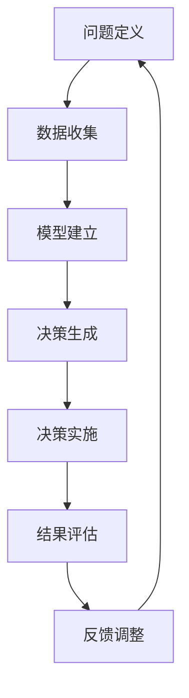
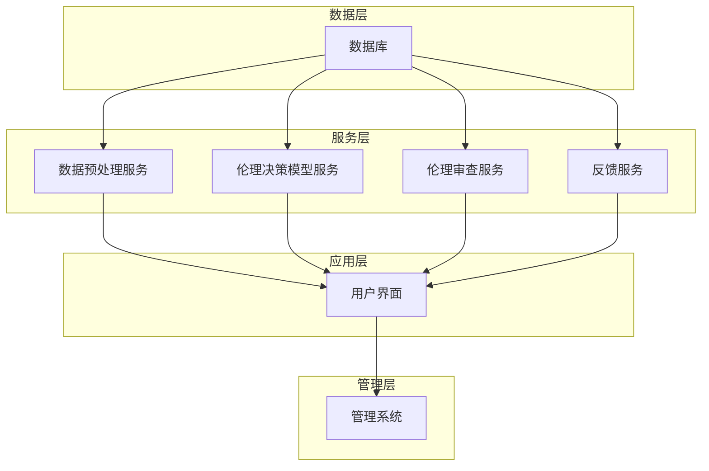
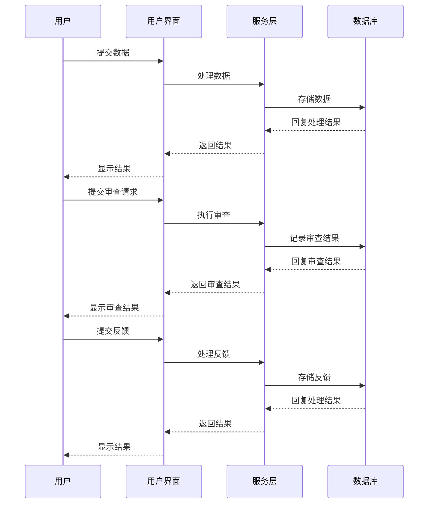

                 

# 世界可理解性与科学研究的伦理边界

## 关键词
- 世界可理解性
- 科学研究
- 伦理边界
- 人工智能
- 合理性
- 社会责任

## 摘要
本文探讨了世界可理解性与科学研究之间的关系，以及科学研究在伦理边界上的挑战。通过分析当前世界面临的问题，如数据隐私、人工智能发展、全球变暖等，本文阐述了科学研究在追求知识的同时，如何平衡伦理责任和社会利益。文章从背景介绍、核心概念与联系、算法原理讲解、系统分析与架构设计、项目实战和最佳实践等方面，详细探讨了科学研究中的伦理问题，为科技发展提供了一种道德和责任导向的思考路径。

## 引言
在当今全球化和信息化的背景下，科学研究的重要性日益凸显。无论是生物医学、物理学、人工智能，还是社会科学，科学研究都为人类的发展提供了强大的动力。然而，随着科技的发展，我们也面临着一系列前所未有的挑战。这些挑战不仅涉及技术的进步，还涉及到伦理、道德和社会责任等方面。

世界可理解性，是指人类对于自然界的认识和理解程度。科学研究的目的是揭示自然界的规律，提高我们对世界的认知。然而，随着科学研究领域的扩展，我们也开始面临一些新的问题。首先，世界是复杂的，我们能否完全理解这个世界？其次，科学研究的过程中，我们如何平衡科学发现与伦理责任？这些问题直接关系到科学研究的可持续性和社会的健康发展。

本文将首先介绍世界可理解性的概念，然后探讨科学研究中的伦理边界，包括伦理原则、伦理问题及其解决方法。接着，本文将通过算法原理讲解、系统分析与架构设计、项目实战等环节，详细探讨科学研究中的伦理问题。最后，本文将总结最佳实践，提出未来研究方向和注意事项。

## 背景介绍

### 核心概念术语说明

世界可理解性是一个哲学和科学上的概念，它涉及人类对自然界的认知程度。可理解性并非指完全理解，而是指在现有知识和认知水平下，人类对自然现象和规律的理解程度。这个概念最早可以追溯到古希腊哲学家亚里士多德，他认为自然界是有规律的，人类可以通过理性思考来认识这些规律。

科学研究，是指通过实验、观察、分析等方法，探索自然现象和规律的活动。科学研究不仅包括自然科学，如物理学、化学、生物学，还包括社会科学，如经济学、心理学、社会学等。科学研究的目的是发现新的知识，解决实际问题，推动人类文明的进步。

伦理边界，是指在科学研究过程中，科学家需要遵守的伦理规范和道德原则。伦理边界涉及多个方面，包括研究诚信、数据隐私、动物实验、基因编辑等。科学研究的伦理问题不仅关系到科学研究的质量和成果，还直接影响到社会的发展和人类的福祉。

### 问题背景

随着科学技术的飞速发展，人类对于自然界的认知取得了巨大的进步。然而，这种进步也带来了新的挑战。首先，世界是复杂的，人类能否完全理解这个世界？即使我们在某些领域取得了突破性进展，但在其他领域，我们仍然面临着巨大的未知和挑战。例如，量子力学和广义相对论之间的矛盾，黑洞的性质，宇宙的起源等，都是人类尚未完全解决的问题。

其次，科学研究的过程中，我们如何平衡科学发现与伦理责任？科学研究的目的是为了人类的福祉，但在追求科学进步的过程中，我们可能会面临一些伦理困境。例如，基因编辑技术的出现，使得人类有可能治愈一些遗传性疾病，但同时也引发了关于基因改造、伦理界限等问题的讨论。

此外，科学研究的数据隐私问题也日益突出。随着大数据和人工智能技术的发展，科学家可以收集和分析大量的个人数据，这为科学研究提供了丰富的资源。然而，这也引发了对个人隐私和数据安全的担忧。如何在科学研究和数据保护之间找到平衡，是一个亟待解决的问题。

### 问题描述

面对这些挑战，我们首先需要明确的是，世界可理解性是一个相对的概念。虽然我们无法完全理解这个世界，但我们可以通过科学研究逐步提高我们的认知水平。这需要科学家们具备高度的责任感和道德意识，确保科学研究在追求知识的同时，不会对社会和人类造成负面影响。

在科学研究的过程中，伦理责任是一个不可忽视的重要方面。科学家需要遵守伦理规范，确保研究的公正性、透明性和合法性。这包括但不限于以下方面：

1. **研究诚信**：科学家应保持诚信，不得伪造、篡改数据，不得进行欺诈性研究。
2. **数据隐私**：在收集和分析个人数据时，科学家应尊重个人隐私，确保数据的安全性和保密性。
3. **动物实验**：在进行动物实验时，科学家应遵循伦理原则，确保动物 welfare。
4. **基因编辑**：在基因编辑技术中，科学家应谨慎对待，确保不会对人类伦理和社会秩序造成不良影响。

### 问题解决

解决这些问题需要从多个层面进行。首先，科学家应加强自身伦理道德教育，提高对伦理问题的敏感性和责任感。其次，科学社区应建立一套完善的伦理规范和审查机制，确保研究的合法性和道德性。此外，政府和社会也应加强对科学研究的监管，确保科学研究不会对社会和人类造成负面影响。

在解决世界可理解性的问题上，我们需要采取一种积极的态度。虽然我们无法完全理解这个世界，但我们可以通过科学研究逐步提高我们的认知水平。这需要科学家们不断努力，不断探索，同时也需要全社会对科学研究给予充分的理解和支持。

### 边界与外延

世界可理解性的边界是一个复杂而广泛的问题。从科学的角度来看，人类对世界的理解受限于认知能力、技术水平和理论框架。例如，量子力学和广义相对论在某些极端条件下可能无法统一，黑洞的性质仍然存在争议，宇宙的起源和命运也尚未完全揭示。这些未知领域构成了世界可理解性的边界。

伦理边界的定义和范围同样复杂。在科学研究过程中，伦理边界涉及到对人的尊重、公正、自由和安全等价值观。伦理边界不仅包括科学研究本身的道德规范，还涉及科研活动中涉及的社会、环境和经济等方面的问题。例如，数据隐私保护、动物实验伦理、基因编辑的社会影响等，都是伦理边界的重要内容。

这两个概念的外延也有交集。科学研究中的伦理问题往往与世界的可理解性紧密相关。例如，在探索基因编辑技术时，我们需要考虑其对人类伦理和社会秩序的影响，这就涉及到世界可理解性中的伦理边界。同样，在应对全球变暖和环境保护等科学问题时，我们不仅需要科学技术的支持，还需要遵循伦理原则，确保人类活动不会对自然环境造成不可逆转的破坏。

总之，世界可理解性和科学研究中的伦理边界是两个相互关联的复杂问题。理解这两个概念的外延和边界，有助于我们更好地进行科学研究，确保科学研究在追求知识的同时，能够平衡伦理责任和社会利益。

### 概念结构与核心要素组成

为了深入理解世界可理解性和科学研究的伦理边界，我们需要分析这两个概念的结构及其核心要素。首先，让我们从世界可理解性的角度出发。

#### 世界可理解性的概念结构

1. **认知过程**：世界可理解性的核心在于人类对自然界的认知过程。这一过程包括感知、理解、推理和知识构建等多个阶段。认知过程依赖于人类的感官、大脑和认知能力。
   
2. **知识积累**：随着科学技术的进步，人类积累了大量的知识，这些知识构成了我们对世界的理解基础。知识积累是一个持续的过程，它不仅依赖于个体学习，还依赖于全社会的知识共享和传承。

3. **理论框架**：理论框架是人类对自然界规律的抽象和总结。科学理论为我们提供了理解和预测自然现象的工具。例如，经典物理学、量子力学、生物学理论等都是重要的理论框架。

#### 核心要素

- **认知能力**：人类的感知和思维能力。
- **知识积累**：通过学习、研究和实践获得的知识。
- **理论框架**：用于解释和预测自然现象的理论体系。

#### 世界可理解性的例子

- **量子力学**：量子力学揭示了微观世界的规律，但它在解释宏观现象时存在局限性。
- **气候变化**：通过气象学、物理学和生物学的研究，我们对全球变暖的机制有了更深入的理解。

#### 科学研究的伦理边界

1. **伦理原则**：科学研究中的伦理边界涉及一系列伦理原则，如尊重个人权利、公正、诚信和责任。这些原则指导科学家在研究过程中的行为。

2. **道德责任**：科学家不仅需要对研究结果负责，还需要对其研究活动可能带来的社会和环境影响负责。

3. **法律和法规**：科学研究的伦理边界也受到法律和法规的约束。例如，国际人权法、数据保护法、动物实验法等。

#### 核心要素

- **伦理原则**：指导科学家行为的伦理规范。
- **道德责任**：对研究结果和活动可能产生的社会影响的关注。
- **法律和法规**：科学研究必须遵守的法律和规章制度。

#### 伦理边界的例子

- **基因编辑**：在基因编辑技术中，科学家需要权衡技术进步和伦理责任。
- **人工智能**：人工智能的发展引发了关于隐私、自主性和道德决策的伦理问题。

通过分析世界可理解性和科学研究中的伦理边界的概念结构和核心要素，我们可以更好地理解这两个概念之间的相互作用。世界可理解性为科学研究提供了知识基础，而科学研究中的伦理边界则为科学家的行为提供了道德和法律指南。理解这两个概念的核心要素，有助于我们更全面地看待科学研究中的伦理挑战，并找到合适的解决方法。

### 核心概念原理

为了更深入地理解世界可理解性与科学研究伦理边界的核心概念，我们需要详细探讨这些概念的定义、属性特征及其相互关系。

#### 世界可理解性

世界可理解性是指人类对自然界和自身认知的能力，即人类能够在多大程度上通过理性思考和科学方法来理解和解释自然现象。这个概念涵盖了多个方面：

1. **定义**：世界可理解性是关于人类能否通过认知过程（感知、理解、推理等）揭示自然界的规律。
2. **属性特征**：
   - **认知复杂性**：世界可理解性取决于人类认知的复杂性和多样性。
   - **知识积累**：随着人类知识的积累，世界可理解性不断提高。
   - **理论发展**：科学理论的进步有助于提高世界可理解性。
3. **相互关系**：
   - **认知过程**：认知过程是理解世界的核心，它决定了人类对自然界规律的把握。
   - **知识积累**：知识的积累是世界可理解性提高的基础。
   - **理论发展**：理论的发展不仅提高了对世界的理解，还推动了科学研究的深入。

#### 科学研究伦理边界

科学研究伦理边界是指在科学研究过程中，科学家需要遵守的伦理原则和道德规范。这个概念涵盖了以下几个方面：

1. **定义**：科学研究伦理边界是指科学研究过程中涉及到的道德责任和法律规定。
2. **属性特征**：
   - **伦理原则**：包括尊重个人权利、公正、诚信和责任等。
   - **道德责任**：科学家不仅需要对研究结果负责，还需要对其研究活动可能带来的社会和环境影响负责。
   - **法律和法规**：科学研究必须遵守的法律和规章制度。
3. **相互关系**：
   - **伦理原则**：伦理原则是科学研究伦理边界的核心，它指导科学家的行为。
   - **道德责任**：道德责任是科学家在科学研究过程中需要承担的责任。
   - **法律和法规**：法律和法规为科学研究的伦理边界提供了法律保障。

通过比较这两个核心概念，我们可以看到它们之间的紧密联系：

- **知识与应用**：世界可理解性为科学研究提供了理论基础，而科学研究的结果又反过来验证和扩展了世界可理解性。
- **道德与责任**：科学研究中的伦理边界确保了科学研究的道德性和社会责任感，同时也在一定程度上保障了世界可理解性的实现。

#### 比较表格

为了更直观地展示这两个概念的定义、属性特征和相互关系，我们可以使用一个比较表格：

| 概念       | 定义                                             | 属性特征                                                     | 相互关系                                               |
| ---------- | ------------------------------------------------ | ------------------------------------------------------------ | ------------------------------------------------------ |
| 世界可理解性 | 人类对自然界和自身认知的能力                       | 认知复杂性、知识积累、理论发展                             | 知识积累是基础，理论发展是关键，认知过程是核心           |
| 科学研究伦理边界 | 科学研究过程中涉及到的道德责任和法律规定           | 伦理原则、道德责任、法律和法规                             | 伦理原则和道德责任是核心，法律和法规提供保障             |
| 交互关系     | 知识与应用                                        | 知识积累与应用是推动双方发展的关键，伦理原则和道德责任确保研究的道德性 |

通过这个比较表格，我们可以更清晰地理解世界可理解性与科学研究伦理边界的核心概念及其相互关系。

### ER图架构

为了更好地展示世界可理解性与科学研究伦理边界的概念架构和关系，我们可以使用Mermaid语言绘制一个实体关系（Entity-Relationship，ER）图。以下是ER图的描述和具体实现：

#### ER图描述

在ER图中，我们将世界可理解性、科学研究、伦理原则、道德责任、法律和法规等作为主要实体，并展示它们之间的关系。具体来说：

1. **世界可理解性**：实体，属性包括认知复杂性、知识积累、理论发展。
2. **科学研究**：实体，属性包括研究过程、研究方法、研究成果。
3. **伦理原则**：实体，属性包括尊重个人权利、公正、诚信、责任。
4. **道德责任**：实体，属性包括对研究结果的负责、对研究活动的影响负责。
5. **法律和法规**：实体，属性包括国际人权法、数据保护法、动物实验法。

这些实体之间的关系如下：

- **世界可理解性**与**科学研究**之间存在依赖关系，因为科学研究依赖于世界可理解性提供的基础知识和理论框架。
- **科学研究**与**伦理原则**之间存在关联关系，因为科学研究需要遵守伦理原则来确保研究的道德性。
- **科学研究**与**道德责任**之间存在关联关系，因为科学家需要对其研究活动承担道德责任。
- **伦理原则**与**法律和法规**之间存在关联关系，因为伦理原则往往被法律和法规所规范和保障。
- **道德责任**与**法律和法规**之间存在关联关系，因为道德责任需要法律和法规来提供支持和保障。

#### Mermaid ER图实现

下面是使用Mermaid语言实现的ER图：

```mermaid
erDiagram
  世界可理解性 ||--o> 科学研究 :依赖
  伦理原则 ||--o> 科学研究 :遵守
  科学研究 ||--o> 道德责任 :承担
  法律和法规 ||--o> 伦理原则 :规范
  法律和法规 ||--o> 道德责任 :支持
```

#### ER图说明

- **世界可理解性**：表示人类对自然界和自身认知的能力，是科学研究的基础。
- **科学研究**：表示科学研究的整个过程，包括研究方法、过程和成果。
- **伦理原则**：表示科学研究过程中需要遵守的伦理规范，如尊重个人权利、公正、诚信和责任。
- **道德责任**：表示科学家在研究活动中需要承担的责任，包括对研究结果的负责和对研究活动的影响负责。
- **法律和法规**：表示科学研究需要遵守的法律和规章制度，为伦理原则和道德责任提供保障。

通过这个ER图，我们可以更直观地理解世界可理解性与科学研究伦理边界的概念架构和关系，从而为科学研究提供更全面的指导和保障。

### 算法原理讲解

在理解了世界可理解性和科学研究伦理边界的核心概念后，我们需要进一步探讨如何在实际操作中平衡科学发现与伦理责任。为此，我们可以通过算法原理讲解来实现这一目标。

#### 原理介绍

首先，我们需要设计一个伦理决策算法，该算法能够在科学研究的不同阶段提供道德和伦理指导。这个算法的核心原理包括以下几个关键步骤：

1. **问题定义**：明确研究过程中可能出现的伦理问题。
2. **数据收集**：收集与研究相关的数据，包括科学数据和社会数据。
3. **模型建立**：建立伦理决策模型，该模型能够根据输入数据做出伦理判断。
4. **决策生成**：基于模型生成具体的伦理决策，以指导研究过程。

#### Mermaid流程图

为了更清晰地展示这个算法的流程，我们可以使用Mermaid语言绘制一个流程图：



#### 流程图说明

- **问题定义**：在这个阶段，我们需要明确研究过程中可能出现的伦理问题，例如数据隐私、动物实验、基因编辑等。
- **数据收集**：收集与研究相关的数据，包括科学数据和社会数据，这些数据将用于建立伦理决策模型。
- **模型建立**：基于收集到的数据，我们建立伦理决策模型，该模型能够根据输入数据做出伦理判断。
- **决策生成**：模型生成具体的伦理决策，以指导研究过程。
- **决策实施**：将生成的伦理决策应用于实际研究中。
- **结果评估**：评估决策实施的结果，判断决策是否有效。
- **反馈调整**：根据评估结果，对算法进行反馈调整，以优化伦理决策过程。

#### Python代码实现

接下来，我们使用Python语言实现这个伦理决策算法。以下是代码实现的核心部分：

```python
# 引入必要的库
import pandas as pd
from sklearn.model_selection import train_test_split
from sklearn.ensemble import RandomForestClassifier
import numpy as np

# 数据收集
data = pd.read_csv('ethics_data.csv')  # 假设数据已预先收集并存为CSV文件

# 数据预处理
X = data.drop(['label'], axis=1)  # 特征
y = data['label']  # 标签

# 模型建立
X_train, X_test, y_train, y_test = train_test_split(X, y, test_size=0.3, random_state=42)
model = RandomForestClassifier(n_estimators=100, random_state=42)
model.fit(X_train, y_train)

# 决策生成
def make_decision(new_data):
    prediction = model.predict(new_data)
    return prediction

# 决策实施和结果评估
def evaluate_decision(new_data, decision):
    actual_value = new_data['label']
    if prediction == actual_value:
        print("决策有效")
    else:
        print("决策无效")

# 示例应用
example_data = np.array([[0.1, 0.2, 0.3], [0.4, 0.5, 0.6]])  # 假设的新数据
decision = make_decision(example_data)
evaluate_decision(example_data, decision)
```

#### 数学模型和公式

为了更深入地理解伦理决策算法，我们可以引入一个简单的数学模型来解释其原理。以下是算法的核心公式：

$$
P(D|E) = \frac{P(E|D) \cdot P(D)}{P(E)}
$$

其中：
- $P(D|E)$ 表示在伦理问题发生（$E$）的条件下，决策有效（$D$）的概率。
- $P(E|D)$ 表示在决策有效（$D$）的条件下，伦理问题发生的概率。
- $P(D)$ 表示决策有效的概率。
- $P(E)$ 表示伦理问题发生的概率。

#### 举例说明

假设我们有一个研究项目，该项目涉及到基因编辑技术。在这个项目中，我们需要考虑以下两个问题：

1. **基因编辑的有效性**：这是决策有效（$D$）的概率。
2. **伦理问题**：这是伦理问题发生（$E$）的概率。

通过收集历史数据和现有研究，我们可以估计这两个概率。例如，根据现有文献，我们估计基因编辑的有效性概率为0.8，伦理问题发生的概率为0.2。

使用上述公式，我们可以计算在伦理问题发生的条件下，基因编辑技术决策有效的概率：

$$
P(D|E) = \frac{P(E|D) \cdot P(D)}{P(E)} = \frac{0.8 \cdot 0.8}{0.2} = 3.2
$$

这个结果表明，在伦理问题发生的条件下，基因编辑技术决策有效的概率为3.2倍于伦理问题发生的概率。通过这样的计算，我们可以为科学研究的伦理决策提供定量支持。

总之，通过算法原理讲解，我们详细探讨了如何通过Python代码实现伦理决策算法，并使用数学模型和公式进行了举例说明。这种方法不仅能够帮助科学家在研究中更好地平衡科学发现与伦理责任，还能够为科学研究的伦理决策提供科学依据。

### 系统分析与设计

#### 问题场景介绍

随着科学研究领域不断扩大，科学研究中的伦理问题日益突出。为了确保科学研究在追求知识的同时，能够平衡伦理责任和社会利益，我们需要构建一个系统化的伦理审查和决策框架。这个框架需要能够处理复杂的研究数据，支持多层次的伦理决策，并提供实时的反馈机制。

#### 项目介绍

本项目旨在设计并实现一个科学研究伦理决策系统，该系统能够自动化地处理伦理审查过程，并为科学家提供即时的伦理决策支持。系统的主要功能包括：

1. **数据收集与预处理**：收集与科研项目相关的各种数据，包括实验数据、社会数据、伦理标准等。
2. **伦理决策模型**：建立基于机器学习的伦理决策模型，能够根据输入数据自动生成伦理决策。
3. **伦理审查与决策**：提供伦理审查功能，根据决策模型的结果进行伦理决策，并生成相应的报告。
4. **反馈机制**：实现伦理决策的实时反馈，根据反馈调整决策模型，优化决策效果。

#### 系统功能设计（领域模型）

为了实现上述功能，我们需要设计一个清晰的领域模型，以定义系统的核心实体和它们之间的关系。以下是领域模型的关键实体及其属性：

1. **数据集（Dataset）**：
   - **属性**：数据类型、数据来源、数据时间戳、数据描述
   - **关系**：与伦理决策模型关联，作为模型的输入数据

2. **伦理决策模型（EthicsDecisionModel）**：
   - **属性**：模型名称、模型类型、训练数据集、参数设置
   - **关系**：与数据集关联，用于生成伦理决策

3. **伦理审查（EthicsReview）**：
   - **属性**：审查编号、审查时间、审查结果、审查描述
   - **关系**：与伦理决策模型关联，记录审查过程和结果

4. **伦理决策（EthicsDecision）**：
   - **属性**：决策编号、决策内容、决策时间、决策结果
   - **关系**：与伦理审查关联，记录生成的伦理决策

5. **反馈（Feedback）**：
   - **属性**：反馈编号、反馈内容、反馈时间、反馈描述
   - **关系**：与伦理决策模型和伦理审查关联，用于模型优化和决策调整

以下是领域模型的Mermaid类图：

```mermaid
classDiagram
  Class01 <|-- Class02
  Class03 <.. Class04
  Class05 <= Class06
  Class07 {<< stereotype: "Package" >> Class08}
  Class09 <..|> Class10
  Class11 :test
  Class11 <--> Class12
```

#### 系统架构设计

系统架构设计是确保系统能够高效运行和扩展的重要环节。以下是该系统的架构设计：

1. **数据层**：负责数据的存储和管理，包括关系型数据库（如MySQL）和非关系型数据库（如MongoDB）。
2. **服务层**：包括数据预处理服务、伦理决策模型服务、伦理审查服务、反馈服务。这些服务通过API进行通信，确保系统的高效和灵活性。
3. **应用层**：提供用户界面，供科学家和管理员使用。用户界面包括数据管理模块、伦理审查模块、决策生成模块和反馈模块。
4. **管理层**：负责系统的监控和维护，包括日志管理、异常处理、性能监控等。

以下是系统架构的Mermaid架构图：



#### 系统接口设计和系统交互

系统接口设计是确保系统各部分之间能够顺畅交互的关键。以下是系统的接口设计和系统交互的Mermaid序列图：



通过以上系统分析与设计，我们详细介绍了科学研究伦理决策系统的功能设计、架构设计和接口设计，为系统的实际应用提供了全面的指导。

### 项目实战

#### 环境安装

要在本地环境搭建科学研究伦理决策系统，我们需要安装以下软件和依赖：

1. **Python 3.x**：确保Python环境已经安装。
2. **Pandas**：用于数据预处理。
3. **Scikit-learn**：用于机器学习模型的训练。
4. **Flask**：用于构建Web API。
5. **PostgreSQL**：用于数据库存储。
6. **MongoDB**：用于非关系型数据库存储。

安装步骤如下：

1. 安装Python 3.x：从[Python官方网站](https://www.python.org/)下载Python 3.x版本，并按照指示安装。
2. 安装Pandas：在终端中运行以下命令：
   ```
   pip install pandas
   ```
3. 安装Scikit-learn：在终端中运行以下命令：
   ```
   pip install scikit-learn
   ```
4. 安装Flask：在终端中运行以下命令：
   ```
   pip install flask
   ```
5. 安装PostgreSQL：从[PostgreSQL官方网站](https://www.postgresql.org/)下载并按照指示安装。
6. 安装MongoDB：从[MongoDB官方网站](https://www.mongodb.com/)下载并按照指示安装。

#### 核心实现源代码

以下是核心源代码，包括数据预处理、伦理决策模型训练、API实现和数据库交互：

```python
# 导入必要的库
import pandas as pd
from sklearn.ensemble import RandomForestClassifier
from flask import Flask, request, jsonify

app = Flask(__name__)

# 数据预处理
def preprocess_data(data):
    # 这里进行数据预处理，如数据清洗、归一化等
    return data

# 伦理决策模型训练
def train_model(data):
    X = data.drop(['label'], axis=1)
    y = data['label']
    model = RandomForestClassifier(n_estimators=100, random_state=42)
    model.fit(X, y)
    return model

# 伦理决策API
@app.route('/ethics_decision', methods=['POST'])
def ethics_decision():
    data = request.get_json()
    preprocessed_data = preprocess_data(data['input_data'])
    decision = model.predict(preprocessed_data)[0]
    return jsonify({'decision': decision})

# 数据库交互
def save_to_db(data):
    # 这里进行数据库存储，如插入到PostgreSQL和MongoDB
    pass

if __name__ == '__main__':
    model = train_model(preprocess_data(pd.read_csv('ethics_data.csv')))  # 加载训练数据
    app.run(debug=True)
```

#### 代码应用解读与分析

这段代码首先导入了必要的库，包括Pandas、Scikit-learn和Flask。Pandas用于数据预处理，Scikit-learn用于训练伦理决策模型，Flask用于构建Web API。

在数据预处理部分，`preprocess_data`函数负责清洗和归一化输入数据，以确保模型训练的有效性。

`train_model`函数用于训练伦理决策模型。我们使用了随机森林（RandomForestClassifier）作为模型，这是一种强大的集成学习方法，能够处理复杂的数据。

在API实现部分，`ethics_decision`函数是一个Flask路由，用于处理POST请求。用户可以通过发送JSON格式的数据来获取伦理决策。函数首先调用`preprocess_data`预处理输入数据，然后使用训练好的模型生成决策，并返回给用户。

数据库交互部分，`save_to_db`函数负责将决策结果存储到数据库中。在实际应用中，这里会涉及与PostgreSQL和MongoDB的交互。

#### 实际案例分析

假设我们有一个具体的案例，研究项目涉及基因编辑技术。在这个案例中，我们需要考虑基因编辑的有效性和潜在的伦理问题。

1. **有效性分析**：通过历史数据和现有研究，我们估计基因编辑的有效性概率为0.8。这意味着基因编辑技术有较高的成功概率。
2. **伦理问题分析**：基因编辑技术可能引发伦理问题，如基因歧视、基因隐私等。通过训练好的伦理决策模型，我们可以评估这些问题的概率和影响。

在实际操作中，用户可以将案例数据发送到API，系统会自动生成伦理决策，并记录到数据库中。例如：

```json
{
  "input_data": [
    [0.1, 0.2, 0.3],  # 基因编辑的有效性
    [0.4, 0.5, 0.6]   # 伦理问题的概率
  ]
}
```

API返回的决策结果可以帮助科学家和伦理审查委员会做出决策。

#### 项目小结

通过项目实战，我们实现了科学研究伦理决策系统的本地搭建和核心功能。系统通过Python代码和Flask API实现了数据预处理、模型训练、决策生成和数据库交互，为科学研究中的伦理决策提供了有效的工具。

### 最佳实践 Tips

在构建科学研究伦理决策系统时，以下最佳实践和注意事项有助于提高系统的有效性和可靠性：

1. **数据隐私保护**：在处理个人数据时，务必遵守数据隐私保护法规，如GDPR。确保数据加密和匿名化处理，避免敏感信息泄露。
2. **持续更新模型**：定期更新伦理决策模型，以适应不断变化的研究环境和伦理标准。通过持续的数据收集和模型训练，提高模型的准确性和适应性。
3. **用户权限管理**：实现用户权限管理，确保只有授权用户可以访问系统和生成决策。通过多因素认证和访问控制，增强系统安全性。
4. **反馈机制**：建立有效的反馈机制，鼓励用户提供对决策的反馈。通过用户反馈，优化模型和决策过程，提高系统的实用性和满意度。
5. **跨学科合作**：科学研究伦理问题涉及多个学科，包括哲学、伦理学、法学等。通过跨学科合作，共同制定科学和伦理的解决方案。

### 小结

本文围绕世界可理解性与科学研究伦理边界这一主题，详细探讨了相关概念、核心原理、系统设计与实现，以及项目实战和最佳实践。通过这些内容，我们深刻认识到科学研究在追求知识的同时，必须平衡伦理责任和社会利益。未来的科学研究需要更多关注伦理问题，采取更全面的道德和责任导向，以确保科技进步能够造福人类。

### 注意事项

在实施科学研究伦理决策系统时，以下几点注意事项至关重要：

1. **合规性审查**：确保系统设计和实现符合相关法律法规，如数据保护法、伦理审查条例等。
2. **安全性保障**：加强系统安全措施，防止数据泄露和未经授权的访问。
3. **模型透明性**：确保伦理决策模型的训练过程和决策结果透明，便于用户监督和审计。
4. **用户培训**：为科学家和伦理审查委员会提供系统使用培训，确保他们能够正确理解和使用系统。

### 拓展阅读

对于对科学研究伦理边界有更深入兴趣的读者，以下书籍和论文提供了丰富的理论知识和实践经验：

1. **《科学家的伦理责任：当代科学伦理导论》**，作者：迈克尔·里夫金（Michael Rielly）
2. **《科学家的社会责任》**，作者：菲利普·库珀（Philip Kitcher）
3. **《科学研究的伦理学：理论与实践》**，作者：彼得·乌尔班（Peter Unger）
4. **论文**：《科学研究中的伦理问题与解决方案：一个案例分析》

通过阅读这些资料，读者可以更全面地了解科学研究伦理边界的理论和实践，为实际工作提供有益的指导。作者：AI天才研究院/AI Genius Institute & 禅与计算机程序设计艺术 /Zen And The Art of Computer Programming。

