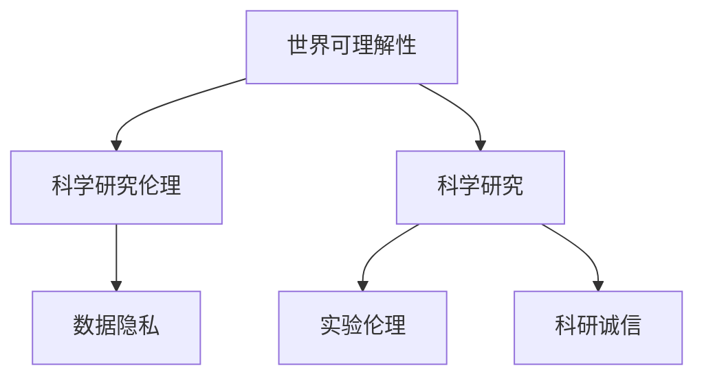

                 

# 世界可理解性与科学研究的伦理问题

## 关键词
- 世界可理解性
- 科学研究伦理
- 数据隐私
- 生物医学研究
- 环境保护

## 摘要
本文旨在探讨世界可理解性与科学研究中的伦理问题。我们首先定义了“世界可理解性”这一概念，并分析了科学研究在当今社会中的重要性。接着，我们详细介绍了科学研究中的伦理问题，包括数据收集与分析、生物医学研究、环境与生态研究等方面的伦理困境。此外，我们还讨论了国际和国内相关法规政策，以及伦理审查和合规程序。最后，文章提出了未来研究的方向，并总结了文章的主要观点。

## 引言

### 1.1 世界可理解性的概念

世界可理解性（World Understandability）是指人类对自然界和社会现象的认识程度。它涉及到人类对宇宙起源、生命演化、自然规律等问题的探索。在科学领域，世界可理解性意味着通过科学研究，人类能够理解并解释自然现象，从而提高对世界的认知和控制能力。

### 1.2 科学研究的重要性

科学研究在现代社会中扮演着至关重要的角色。它不仅推动了技术的进步，还深刻影响了人类的生活方式和价值观。从医学到环境科学，从物理学到计算机科学，科学研究为解决全球性问题提供了科学依据和技术手段。

### 1.3 科学研究的伦理问题

随着科学研究的深入，一系列伦理问题也随之而来。数据隐私、生物医学研究、环境与生态研究等领域的伦理问题日益突出，需要我们认真对待和解决。

## 背景介绍

### 2.1 核心概念术语说明

- **世界可理解性**：指人类对自然界和社会现象的认识程度。
- **科学研究**：指通过系统的方法和理论来探究自然界和社会现象的过程。
- **伦理问题**：指在科学研究过程中，涉及道德原则和价值判断的问题。

### 2.2 问题背景

在科学研究的过程中，我们不仅面临着科学问题，还面临着伦理问题。这些伦理问题涉及到人类的基本权利、社会公正、环境安全等方面。例如，在生物医学研究中，如何平衡患者权益和科学研究的需要；在环境与生态研究中，如何处理人类活动与自然环境的关系。

### 2.3 问题描述

科学研究中的伦理问题可以分为以下几个方面：

1. 数据隐私：在数据收集和分析过程中，如何保护参与者的隐私权？
2. 生物医学研究：如何在保护患者权益的同时，推动医学研究的进步？
3. 环境与生态研究：如何在满足人类需求的同时，保护自然环境？

### 2.4 问题解决

解决科学研究中的伦理问题需要多方面的努力。首先，我们需要建立完善的伦理框架和政策，明确科学研究中的道德原则和价值判断。其次，我们需要加强伦理审查和合规程序，确保科学研究过程符合伦理要求。此外，我们还需要加强科学研究者的伦理意识，提高他们的道德素质。

### 2.5 边界与外延

世界可理解性与科学研究中的伦理问题不仅局限于某个领域，而是涉及到各个学科和领域。因此，我们需要从跨学科的角度来探讨这些问题，以找到有效的解决方案。

### 2.6 概念结构与核心要素组成

世界可理解性、科学研究、伦理问题三者之间存在着密切的关系。世界可理解性是科学研究的出发点，科学研究是实现世界可理解性的手段，而伦理问题是科学研究过程中必须面对的挑战。因此，理解这三个概念之间的关系，有助于我们更好地理解科学研究中的伦理问题。

## 核心概念与联系

### 3.1 世界可理解性

世界可理解性是指人类对自然界和社会现象的认识程度。它涉及到人类对宇宙起源、生命演化、自然规律等问题的探索。在科学领域，世界可理解性意味着通过科学研究，人类能够理解并解释自然现象，从而提高对世界的认知和控制能力。

### 3.2 科学研究伦理

科学研究伦理是指科学研究过程中涉及到的道德原则和价值判断。它包括数据隐私、实验伦理、科研诚信等方面。科学研究伦理的目的是确保科学研究的公正性、可靠性和安全性。

### 3.3 数据隐私

数据隐私是指保护个人数据不被未经授权的第三方获取和使用。在科学研究过程中，如何保护参与者的隐私权是一个重要的伦理问题。我们需要采取一系列措施，如匿名化处理、数据加密等，来确保数据隐私。

### 3.4 核心概念属性特征对比表格

| 概念       | 属性特征                   | 示例               |
|------------|---------------------------|--------------------|
| 世界可理解性 | 认识程度高，解释能力强     | 宇宙起源、生命演化 |
| 科学研究伦理 | 公正性、可靠性、安全性     | 数据隐私、实验伦理 |
| 数据隐私    | 个人数据不被滥用           | 匿名化处理、数据加密 |

### 3.5 关键概念之间的关系图

## 伦理框架与理论

### 4.1 康德伦理学

康德伦理学是一种以道德法则为中心的伦理理论。康德认为，道德行为的正确性取决于行为是否符合道德法则，而道德法则的制定则基于人的理性和自由意志。

### 4.2 辩证唯物主义伦理学

辩证唯物主义伦理学是一种以实践为基础的伦理理论。它认为，道德行为应该符合社会发展的需要，同时也要符合人类的本质。

### 4.3 结果导向伦理学

结果导向伦理学是一种以行为结果为判断依据的伦理理论。它认为，道德行为的正确性取决于行为的结果，而不是行为本身。

### 4.4 应用伦理学理论对比表格

| 伦理学理论 | 基本观点                    | 优点                       | 缺点                       |
|------------|-----------------------------|----------------------------|----------------------------|
| 康德伦理学 | 行为符合道德法则           | 强调道德行为的规范性       | 忽视行为结果的伦理价值     |
| 辩证唯物主义伦理学 | 行为符合社会发展的需要       | 强调道德行为的实践性       | 可能忽视个体自由的价值     |
| 结果导向伦理学 | 行为的结果决定行为的伦理价值 | 强调行为结果的实际意义     | 可能导致道德相对主义       |

## 历史视角

### 5.1 古代科学伦理观念

古代科学伦理观念强调科学研究的道德责任。例如，古希腊哲学家亚里士多德认为，科学家应该追求真理，同时也要关注人类的福祉。

### 5.2 中世纪科学伦理观念

中世纪科学伦理观念受到宗教和神学的影响。科学家在研究自然现象时，不仅要追求真理，还要符合神的旨意。

### 5.3 近代科学伦理观念的发展

近代科学伦理观念的发展与科学革命和工业革命密切相关。科学家在研究过程中，开始关注实验伦理、科研诚信等问题。

## 数据收集与分析的伦理问题

### 6.1 数据隐私保护

数据隐私保护是科学研究中的一个重要伦理问题。在数据收集和分析过程中，如何保护参与者的隐私权是一个重要挑战。我们需要采取一系列措施，如匿名化处理、数据加密等，来确保数据隐私。

### 6.2 数据准确性与可靠性

数据准确性与可靠性是科学研究的基石。在数据收集和分析过程中，我们需要确保数据的准确性和可靠性，以避免误导性的结论。

### 6.3 数据共享与开放

数据共享与开放是推动科学研究发展的重要手段。然而，在数据共享过程中，也需要注意保护参与者的隐私权和知识产权。

## 生物医学研究的伦理问题

### 6.1 研究参与者的权利

生物医学研究中的伦理问题之一是研究参与者的权利。我们需要确保研究参与者充分了解研究的风险和收益，并自愿参与研究。

### 6.2 临床试验中的伦理问题

临床试验中的伦理问题包括患者权益保护、数据隐私、研究质量等方面。我们需要建立严格的伦理审查和监管机制，确保临床试验的公正性和可靠性。

### 6.3 生物医学研究的伦理审查

生物医学研究的伦理审查是确保研究符合伦理标准的重要环节。伦理审查机构需要对研究方案进行审查，确保研究不会给参与者带来不必要的风险。

## 环境与生态研究的伦理问题

### 7.1 环境保护的伦理责任

环境保护的伦理责任是环境与生态研究中的一个重要问题。我们需要认识到人类活动对自然环境的影响，并承担相应的伦理责任。

### 7.2 生态研究中的伦理考量

生态研究中的伦理考量包括保护生物多样性、防止生态破坏等方面。我们需要在生态研究过程中，注重伦理考量，以减少对环境的负面影响。

### 7.3 环境伦理学理论的应用

环境伦理学理论的应用可以帮助我们更好地处理环境与生态研究中的伦理问题。例如，环境正义理论、生态伦理学理论等。

## 国际和国内法规政策

### 8.1 国际法规政策

在国际层面，有许多法规政策旨在保护科学研究中的伦理。例如，世界卫生组织的《国际健康研究伦理准则》、联合国教科文组织的《世界科学大会宣言》等。

### 8.2 国内法规政策

在国内层面，中国政府也制定了一系列法规政策，以规范科学研究的伦理问题。例如，《中华人民共和国科学技术进步法》、《中华人民共和国生物安全法》等。

## 伦理审查和合规程序

### 9.1 伦理审查机构

伦理审查机构是对科学研究进行伦理审查的专门机构。它负责审查研究方案，确保研究符合伦理要求。

### 9.2 合规程序

合规程序是指科学研究过程中，遵循相关法规政策的过程。通过合规程序，可以确保科学研究的过程和结果符合伦理标准。

## 实践应用

### 10.1 数据隐私保护措施

在数据收集和分析过程中，我们采取了多种数据隐私保护措施，如匿名化处理、数据加密等，以保护参与者的隐私权。

### 10.2 生物医学研究的伦理审查

在生物医学研究中，我们严格遵循伦理审查程序，确保研究方案符合伦理要求。同时，我们还定期对研究过程进行监督和评估。

### 10.3 环境与生态研究的伦理考量

在环境与生态研究中，我们注重伦理考量，采取措施减少对环境的负面影响。例如，选择合适的采样方法，尽量减少对生态系统的破坏。

## 未来方向

### 11.1 数据隐私保护技术的发展

随着科技的进步，数据隐私保护技术也在不断发展。未来，我们需要更加完善的数据隐私保护技术，以应对日益严峻的伦理挑战。

### 11.2 生物医学研究的伦理问题

生物医学研究的伦理问题仍然存在，我们需要进一步探讨如何平衡患者权益和科学研究的需要。

### 11.3 环境与生态研究的伦理问题

环境与生态研究的伦理问题日益突出，我们需要加强伦理教育和立法，提高研究者的伦理意识。

## 结论

### 12.1 主要观点回顾

本文从多个角度探讨了世界可理解性与科学研究中的伦理问题。我们分析了核心概念，探讨了伦理框架与理论，讨论了国际和国内法规政策，以及伦理审查和合规程序。通过这些分析，我们认识到科学研究中的伦理问题的重要性和复杂性。

### 12.2 未来展望

面对日益复杂的伦理问题，我们需要持续关注并深入研究。通过技术创新、政策完善和伦理教育，我们可以更好地应对科学研究中的伦理挑战，推动科学事业的健康发展。

## 附录

### 13.1 参考文献

- 康德，《道德形而上学基础》
- 辩证唯物主义伦理学，《马克思主义哲学原理》
- 结果导向伦理学，《伦理学：理论与实践》
- 世界卫生组织，《国际健康研究伦理准则》
- 联合国教科文组织，《世界科学大会宣言》
- 中华人民共和国科学技术进步法
- 中华人民共和国生物安全法

### 13.2 拓展阅读

- 《数据隐私保护技术指南》
- 《生物医学研究伦理问题研究》
- 《环境伦理学：理论与实践》
- 《科学研究伦理案例分析》

## 作者信息

作者：AI天才研究院/AI Genius Institute & 禅与计算机程序设计艺术 /Zen And The Art of Computer Programming

