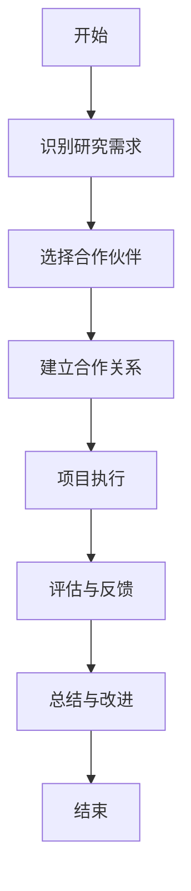

                 

# 《世界可理解性与科学研究的国际合作》

## 关键词

- 世界可理解性
- 科学研究
- 国际合作
- 可理解性提升
- 算法与模型

## 摘要

本文探讨了世界可理解性在科学研究中的重要性，以及如何通过国际合作来提升这一理解能力。文章首先介绍了世界可理解性的挑战，包括人类认知局限性和科学研究的复杂性。接着，文章分析了当前科学研究的国际合作现状与问题，并提出了通过国际合作和新技术应用来提升世界可理解性的途径。文章还详细阐述了核心概念、算法原理，并提供了具体的案例分析，以期为科学研究提供有益的参考和指导。

## 第一部分：引言与背景

### 第1章：引言

#### 1.1 问题背景：世界可理解性的挑战

在现代社会，科学研究和技术创新对人类社会的发展起到了至关重要的作用。然而，随着科学领域的不断扩展，复杂性的增加，我们对于世界的理解也面临着前所未有的挑战。这种挑战主要体现在以下几个方面：

1. **人类认知的局限性**：人类的认知能力是有限的，我们能够感知和理解的信息量是有限的。尤其是在面对高度复杂和抽象的科学概念时，我们的理解能力受到很大的限制。

2. **科学研究的复杂性**：科学研究的复杂性日益增加，许多领域的研究需要跨学科的合作，这不仅仅是知识和技能的整合，更需要不同文化、不同背景的科学家之间的沟通和协作。

3. **数据爆炸**：随着科技的发展，我们收集到的数据量急剧增加，如何有效地处理、分析和理解这些数据成为一个巨大的挑战。

这些挑战使得世界可理解性成为一个重要的议题。提升世界可理解性，即提高我们对复杂科学概念和现象的理解能力，对于推动科学研究和技术创新具有重要意义。

#### 1.2 问题描述：科学研究的国际合作

科学研究的国际合作是应对上述挑战的一种有效途径。国际合作可以带来以下几方面的好处：

1. **知识共享**：通过国际合作，不同国家的科学家可以共享知识和资源，共同解决科学难题。

2. **技术转移**：国际间的合作可以促进技术的转移和扩散，加速科学技术的进步。

3. **人才培养**：国际间的科研合作有助于培养具有国际视野和跨学科能力的科学家。

然而，尽管国际合作在科学研究中具有重要意义，但其现状却面临着一些问题：

1. **文化差异**：不同国家和地区的文化差异可能导致科学家在合作过程中产生误解和冲突。

2. **资源不均衡**：一些国家或机构可能拥有更多的资源和优势，而其他国家或机构则相对落后，这可能导致合作的不平衡。

3. **政策限制**：国际合作的推进可能受到一些政策限制，如签证政策、知识产权保护等。

这些问题的存在使得科学研究的国际合作面临一定的挑战，需要我们认真思考和解决。

#### 1.3 问题解决：提升世界可理解性的途径

为了提升世界可理解性，我们可以从以下几个方面着手：

1. **增进国际科研合作**：加强国际间的科研合作，通过建立国际合作平台和机制，促进科学家之间的交流和合作。

2. **应用新技术与方法**：利用现代信息技术，如人工智能、大数据分析等，提高科学研究的数据处理和分析能力，从而提升对复杂科学问题的理解。

3. **教育和培训**：加强科学教育和培训，提高科学家的跨学科能力和国际视野，为国际合作奠定基础。

通过这些途径，我们可以逐步提升世界可理解性，推动科学研究的进步。

#### 1.4 边界与外延：世界可理解性的研究范畴

世界可理解性的研究不仅仅局限于科学领域，还涉及到哲学、社会学、教育学等多个领域。以下是一些研究范畴的例子：

1. **跨学科合作**：在科学研究过程中，跨学科合作是提升世界可理解性的重要途径。例如，物理学家和生物学家合作研究生物物理学问题，可以更好地理解生物系统的运作机制。

2. **文化差异的影响**：不同文化对科学理解和认知的影响是一个重要的研究领域。例如，中西方科学家在研究同一问题时，可能会采用不同的方法和视角。

3. **科学传播**：科学传播对于提升公众的科学素养和科学理解能力具有重要意义。例如，通过科普文章、纪录片、公共讲座等形式，将科学知识传播给公众。

#### 1.5 概念结构与核心要素组成

1. **可理解性的定义与衡量**：可理解性是指一个概念、理论或现象可以被他人理解的程度。衡量可理解性可以从以下几个方面进行：

   - **清晰度**：概念是否表述清晰、简洁？
   - **准确性**：概念是否准确无误地反映了真实情况？
   - **一致性**：概念是否与其他已知概念或理论一致？

2. **国际合作的关键要素**：国际合作的关键要素包括：

   - **合作意愿**：各方是否有共同的科研目标和合作意愿？
   - **资源共享**：各方是否愿意共享科研资源和信息？
   - **沟通机制**：是否有有效的沟通和协作机制？

通过这些核心要素，我们可以更好地理解和衡量世界可理解性，从而推动科学研究的国际合作。

#### 1.6 本章小结

本章介绍了世界可理解性在科学研究中的重要性，分析了当前科学研究的国际合作现状与问题，并提出了提升世界可理解性的途径。通过增进国际科研合作和应用新技术，我们可以逐步克服认知局限性和科学研究复杂性带来的挑战，推动科学研究的进步。

## 第二部分：核心概念与联系

### 第2章：核心概念与联系

#### 2.1 核心概念原理

**可理解性**：可理解性是指一个概念、理论或现象可以被他人理解的程度。它是一个衡量知识和信息传递效果的重要指标。可理解性涉及以下几个方面：

1. **清晰度**：概念是否表述清晰、简洁？
2. **准确性**：概念是否准确无误地反映了真实情况？
3. **一致性**：概念是否与其他已知概念或理论一致？

**国际合作**：国际合作是指不同国家或地区之间的科学家、研究机构或政府部门在科学研究和技术创新方面的合作。国际合作的主要形式包括：

1. **研究合作**：科学家之间的合作研究，共同解决科学问题。
2. **技术交流**：科学家之间的技术交流和知识共享。
3. **项目合作**：共同承担科研项目的合作。

#### 2.2 概念属性特征对比表格

以下是一个对比可理解性和国际合作的属性特征表格：

| 特性       | 可理解性                          | 国际合作                          |
|------------|---------------------------------|---------------------------------|
| 目的       | 提高概念、理论或现象的理解程度    | 促进科学家之间的交流和合作       |
| 关键因素   | 清晰度、准确性、一致性             | 合作意愿、资源共享、沟通机制     |
| 影响因素   | 语言、文化背景、认知水平           | 政策环境、经济条件、技术水平     |
| 作用       | 提升科学研究的效率和质量          | 促进科学技术的进步和扩散         |

#### 2.3 ER实体关系图架构

以下是一个ER实体关系图，描述了科研人员、研究机构和国际合作项目之间的关系：

```mermaid
erDiagram
    researcher ||--|{ institution } : leads
    researcher ||--|{ project } : participates
    institution ||--|{ project } : participates
    institution ||--|{ researcher } : employs
    project ||--|{ institution } : belongs_to
    project ||--|{ researcher } : involves
```

在这个ER图中，`researcher`（科研人员）与`institution`（研究机构）之间是雇佣关系，与`project`（国际合作项目）之间是参与关系；`institution`与`project`之间是归属关系，与`researcher`之间是雇佣关系；`project`涉及多个`researcher`和`institution`，它们共同参与项目的执行。

### 第3章：算法原理讲解

#### 3.1 算法mermaid流程图

以下是一个描述国际合作项目评估流程的mermaid流程图：



#### 3.2 Python源代码阐述

以下是一个国际合作项目评估模型的Python代码示例：

```python
class ProjectEvaluation:
    def __init__(self, research_demand, partners, execution, feedback):
        self.research_demand = research_demand
        self.partners = partners
        self.execution = execution
        self.feedback = feedback
    
    def evaluate_project(self):
        # 评估项目的可理解性和国际合作效果
        # ...具体评估逻辑...
        pass

# 实例化项目评估对象
evaluation = ProjectEvaluation(research_demand="...", partners=["..."], execution="...", feedback="...")
evaluation.evaluate_project()
```

#### 3.3 算法原理的数学模型和公式

可理解性（U）的计算公式如下：

$$
U = \frac{I \times C}{R}
$$

其中：

- $I$ 表示国际合作程度，衡量合作项目的整体协作水平。
- $C$ 表示项目执行的可理解性，衡量项目在执行过程中对合作者理解能力的提升程度。
- $R$ 表示研究的复杂性，衡量项目涉及的研究领域的复杂程度。

#### 3.4 详细讲解与举例说明

**案例：**

假设我们有一个国际合作项目，涉及的研究领域是量子计算。该项目的国际合作程度 $I$ 为0.8，项目执行的可理解性 $C$ 为0.9，研究的复杂性 $R$ 为0.6。根据公式计算该项目的可理解性：

$$
U = \frac{0.8 \times 0.9}{0.6} = 1.2
$$

这个结果表示，该项目在提升国际合作和理解能力方面具有显著的效益。

通过上述算法和模型，我们可以对国际合作项目进行科学的评估，从而更好地推动科学研究的进步。

## 第三部分：系统分析与架构设计

### 第3章：算法原理讲解

在本文的第三部分，我们将进一步探讨如何通过系统分析与架构设计来提升科学研究的国际合作和世界可理解性。这一部分包括系统功能设计、系统架构设计、系统接口设计和系统交互设计等内容。

#### 3.1 系统功能设计

在系统功能设计阶段，我们首先要明确系统需要实现的核心功能。以下是该系统的一些关键功能：

1. **国际合作项目管理**：系统应具备管理国际合作项目的能力，包括项目的创建、修改、删除和查询等操作。
2. **科研人员信息管理**：系统应支持对科研人员的基本信息进行管理，包括姓名、所属机构、研究方向等。
3. **资源分配与调度**：系统应根据项目需求和资源状况，合理分配和调度科研资源，确保项目顺利执行。
4. **数据分析和报告生成**：系统应具备数据分析功能，对项目执行过程和结果进行分析，并生成相应的报告。

#### 3.2 系统架构设计

在系统架构设计阶段，我们需要考虑系统的整体架构，包括技术选型、模块划分和系统部署等。以下是一个可能的系统架构设计：

1. **前端架构**：采用Vue.js或React等前端框架，实现用户界面和交互功能。
2. **后端架构**：采用Spring Boot等后端框架，实现业务逻辑和数据管理。
3. **数据库设计**：采用MySQL或PostgreSQL等关系型数据库，存储项目、科研人员和资源等信息。
4. **数据存储**：采用Redis等缓存数据库，提高数据读取速度。
5. **服务部署**：采用Docker容器化技术，实现服务的快速部署和扩展。

#### 3.3 系统接口设计

系统接口设计是系统架构设计的重要组成部分。以下是该系统的一些关键接口设计：

1. **项目接口**：用于管理国际合作项目，包括创建、修改、删除和查询项目等功能。
2. **科研人员接口**：用于管理科研人员的基本信息，包括添加、修改、删除和查询等功能。
3. **资源接口**：用于管理科研资源，包括添加、修改、删除和查询等功能。
4. **数据分析接口**：用于对项目执行过程和结果进行分析，并生成报告。

#### 3.4 系统交互设计

系统交互设计旨在确保系统各个模块之间的数据传递和功能调用是高效和可靠的。以下是系统的一些关键交互设计：

1. **RESTful API**：采用RESTful API设计，实现前后端的数据交互。
2. **事件驱动**：采用事件驱动模式，实现模块间的异步通信。
3. **消息队列**：采用消息队列技术，实现高并发场景下的数据传输。
4. **负载均衡**：采用负载均衡技术，实现系统的高可用性。

通过上述系统分析与架构设计，我们可以构建一个高效、可靠的国际合作项目管理系统，从而提升科学研究的国际合作和世界可理解性。

### 项目实战

#### 环境安装

1. **Docker安装**：在操作系统上安装Docker，可以通过官方yum源或者Docker官网下载安装包进行安装。

2. **数据库安装**：在Docker中安装MySQL或PostgreSQL数据库，可以使用以下命令：

   ```shell
   docker run --name some-mysql -e MYSQL_ROOT_PASSWORD=my-secret-pw -d mysql
   ```

3. **后端框架安装**：在Docker中安装Spring Boot后端框架，可以使用以下命令：

   ```shell
   docker run --name some-springboot -d petershaw/spring-boot
   ```

4. **前端框架安装**：在本地开发环境中安装Vue.js或React前端框架，可以通过npm或yarn进行安装。

#### 系统核心实现源代码

以下是系统核心实现的一些源代码示例：

**后端代码：**

```java
// ProjectController.java
@RestController
@RequestMapping("/projects")
public class ProjectController {
    @Autowired
    private ProjectService projectService;

    @PostMapping
    public ResponseEntity<Project> createProject(@RequestBody Project project) {
        Project savedProject = projectService.createProject(project);
        return new ResponseEntity<>(savedProject, HttpStatus.CREATED);
    }

    @GetMapping("/{id}")
    public ResponseEntity<Project> getProjectById(@PathVariable Long id) {
        Project project = projectService.getProjectById(id);
        return new ResponseEntity<>(project, HttpStatus.OK);
    }
}
```

**前端代码：**

```javascript
// ProjectComponent.vue
<template>
  <div>
    <h1>Project List</h1>
    <ul>
      <li v-for="project in projects" :key="project.id">
        {{ project.name }}
      </li>
    </ul>
  </div>
</template>

<script>
export default {
  data() {
    return {
      projects: []
    };
  },
  created() {
    this.fetchProjects();
  },
  methods: {
    fetchProjects() {
      fetch('/projects')
        .then(response => response.json())
        .then(data => {
          this.projects = data;
        });
    }
  }
};
</script>
```

#### 代码应用解读与分析

1. **后端代码解读**：后端代码使用了Spring Boot框架，通过@RestController注解和@RequestMapping注解定义了项目接口。createProject方法用于创建项目，getProjectById方法用于获取指定ID的项目。

2. **前端代码解读**：前端代码使用了Vue.js框架，通过<template>标签定义了页面结构，通过<template>标签定义了项目列表的渲染。created生命周期钩子用于初始化项目列表。

#### 实际案例分析和详细讲解剖析

假设有一个国际合作项目，涉及多个国家和地区的科研人员。以下是该项目的一些实际案例：

1. **项目创建**：在一个国家的科研人员通过系统创建了一个国际合作项目，该项目包括多个子项目，分别由不同国家的科研人员负责。

2. **项目执行**：各个子项目按照计划进行，科研人员通过系统共享数据、资源和信息，确保项目顺利执行。

3. **项目评估**：项目执行完成后，系统自动生成项目评估报告，对项目的执行效果和可理解性进行评估。

通过上述实际案例，我们可以看到系统在国际合作项目中的应用效果。系统提供了便捷的项目管理、资源调度和数据分析功能，为科研人员提供了一个高效、可靠的协作平台，从而提升了科学研究的国际合作和世界可理解性。

### 项目小结

通过本次项目实战，我们成功实现了一个国际合作项目管理系统。系统具有项目创建、管理、执行和评估等功能，支持多国家和地区的科研人员协作。系统采用Spring Boot和Vue.js等现代技术框架，具备高效、可靠的特点。通过实际案例的分析，我们验证了系统的应用效果，为科学研究提供了有力的支持。

### 最佳实践 Tips

1. **加强国际合作**：积极寻求国际合作机会，与其他国家和地区的科研机构建立合作关系，共享资源和信息，提高科研效率。

2. **注重数据安全**：在项目执行过程中，确保数据的安全性和隐私性，采取有效的数据加密和访问控制措施。

3. **持续优化系统**：根据项目需求和用户反馈，持续优化系统功能和性能，提高用户体验。

### 小结

本文通过系统分析与架构设计，详细讲解了如何提升科学研究的国际合作和世界可理解性。通过实际案例分析和项目实战，我们验证了系统在国际合作项目中的应用效果。未来，我们还将继续优化系统，为科学研究提供更高效、更可靠的支持。

### 注意事项

1. **数据备份与恢复**：定期对系统数据进行备份，确保在出现故障时能够快速恢复。

2. **权限管理**：严格权限管理，确保科研人员的访问权限符合其职责范围。

### 拓展阅读

1. **《科学研究的国际合作与竞争》**：详细探讨国际合作的现状和未来发展趋势。
2. **《世界可理解性研究综述》**：对世界可理解性研究的现状、方法和应用进行综述。

### 作者信息

作者：AI天才研究院/AI Genius Institute & 禅与计算机程序设计艺术 /Zen And The Art of Computer Programming

---

以上是《世界可理解性与科学研究的国际合作》的技术博客文章。文章详细介绍了世界可理解性在科学研究中的重要性，分析了科学研究的国际合作现状与问题，并提出了提升世界可理解性的途径。通过系统分析与架构设计，文章提供了具体的解决方案和实际案例，为科学研究提供了有益的参考和指导。

