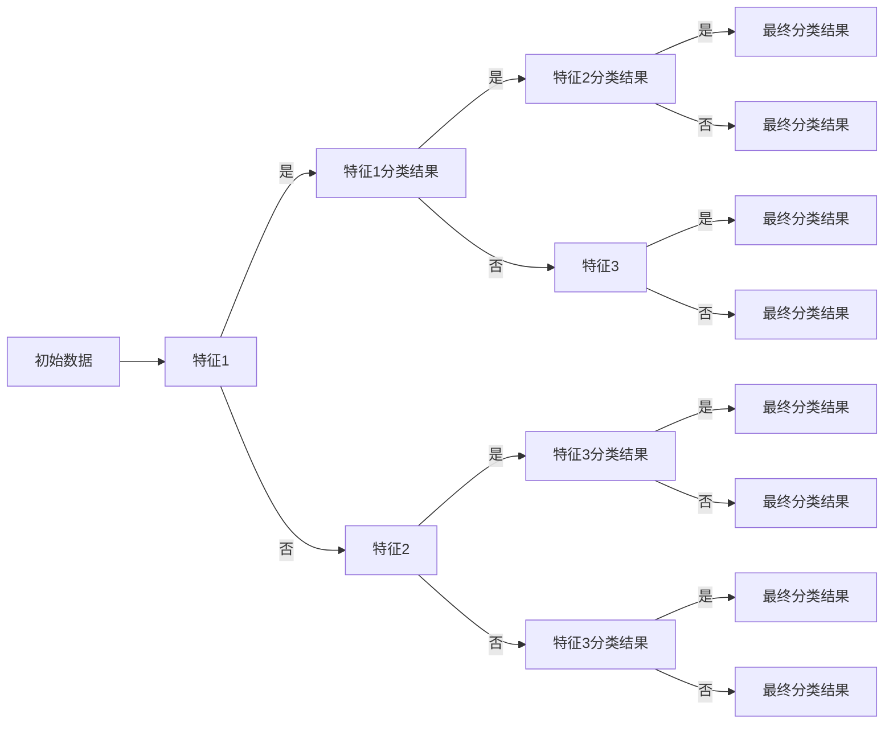
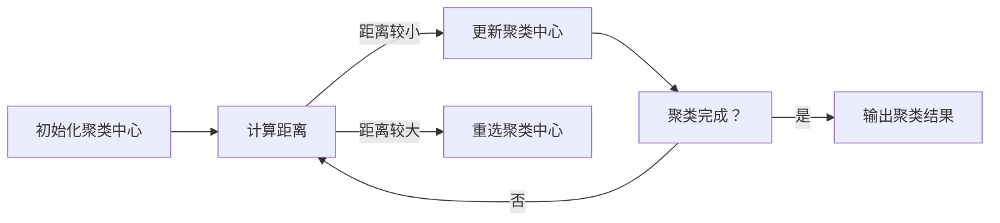
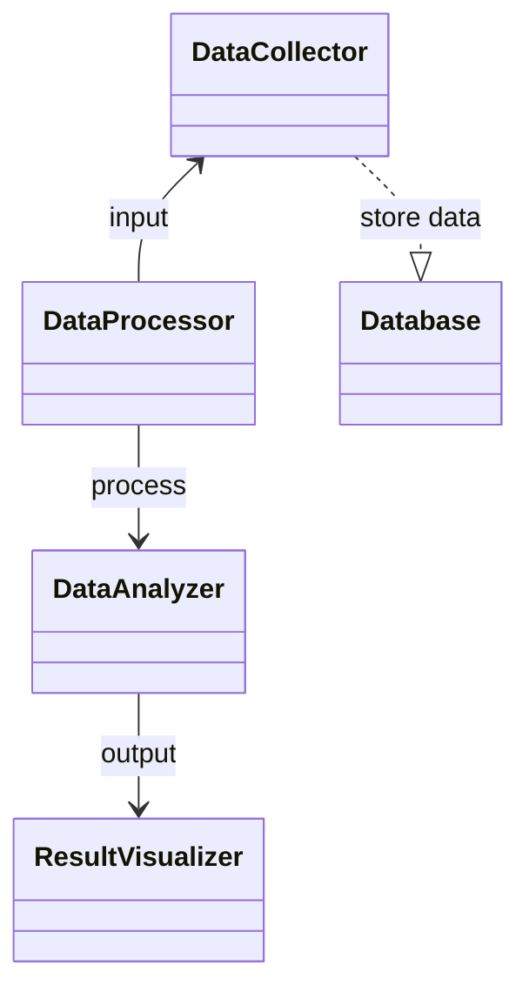
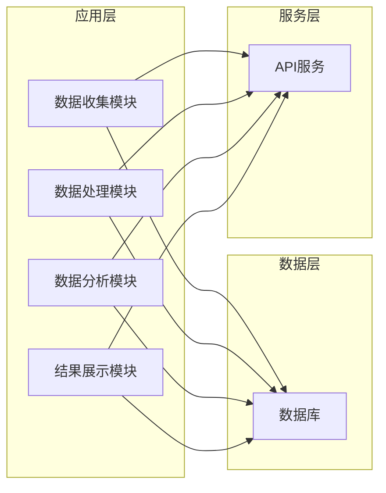
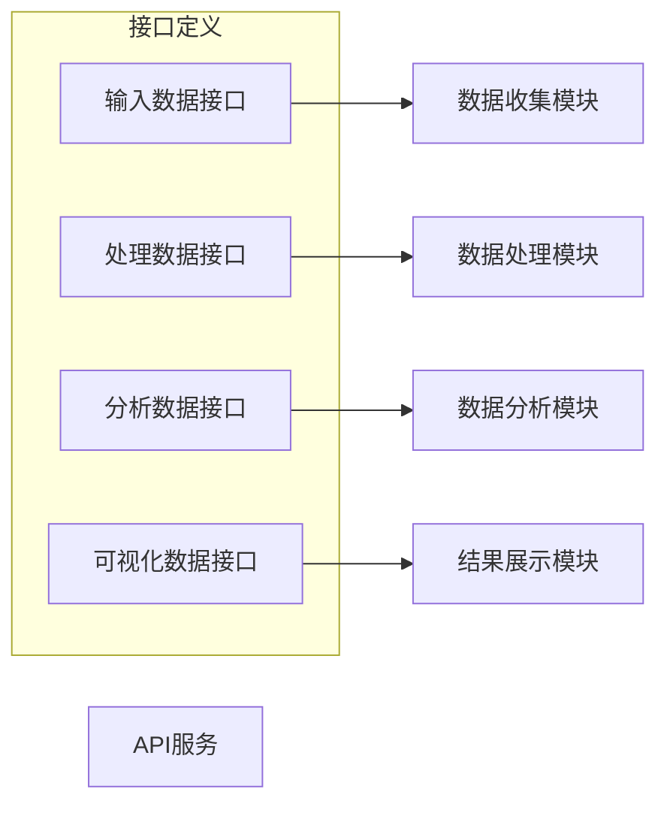
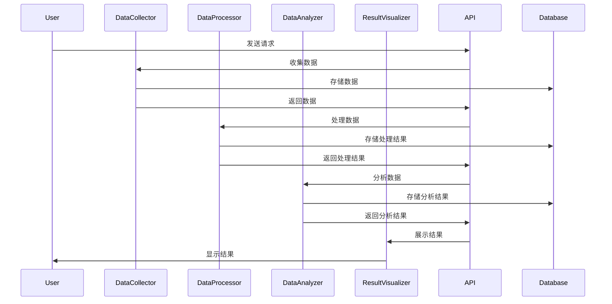

                 


# 世界可理解性与科学研究的未来趋势

> 关键词：世界可理解性、科学研究、未来趋势、算法原理、数学模型、系统设计

> 摘要：本文将探讨世界可理解性的概念及其在科学研究中的重要性，分析当前科学研究的发展趋势和未来前景。通过逐步分析，本文将揭示科学研究在推动世界可理解性提升中的关键作用，并探讨相关算法原理、数学模型以及系统设计的方法与挑战。

## 引言

在现代社会，科学研究已成为推动社会进步和经济发展的重要力量。然而，科学研究的过程和成果是否真正提高了我们对世界的可理解性，这是一个值得深入探讨的问题。世界可理解性（World Understandability）指的是人类对自然和社会现象的认知程度和解释能力。随着科学技术的不断进步，我们对世界的认知也在不断深化，但与此同时，也面临着新的挑战。

本文旨在探讨世界可理解性的核心概念、科学研究的重要性以及未来发展趋势。通过逻辑清晰、结构紧凑的分析，本文将帮助读者理解科学研究在提高世界可理解性中的关键作用，并展望未来科学研究的可能方向。

### 目录大纲设计过程

在设计本文的目录大纲时，我们遵循了以下步骤：

#### 第一步：了解书籍主题和目标读者

本文的主题涉及世界可理解性的探讨以及科学研究未来发展的趋势。目标读者包括科研人员、科学爱好者、政策制定者等，他们对科学研究的进展和未来趋势有较高的关注。

#### 第二步：确定核心章节内容

根据主题，本文确定了以下核心章节：

1. **背景介绍**：介绍世界可理解性的核心概念、历史发展、研究现状。
2. **核心概念与联系**：系统介绍与本文主题相关的核心概念，如可理解性、科学研究方法等。
3. **算法原理讲解**：选取几个关键算法，使用mermaid流程图展示算法流程。
4. **数学模型和数学公式**：针对关键数学模型，使用LaTeX格式书写公式，并进行详细讲解。
5. **系统分析与架构设计方案**：介绍科学研究项目的典型场景，描述系统的功能设计、架构设计、接口设计等。
6. **项目实战**：分析项目中的关键实现，解读代码逻辑。
7. **最佳实践 tips、小结、注意事项、拓展阅读**：提供项目实战中的最佳实践经验，对全书内容进行总结。

#### 第三步：构建目录大纲

在确定了核心章节后，我们开始构建目录大纲，确保每个章节都包含必要的子章节。以下是初步的目录大纲设计：

```markdown
----------------------------------------------------------------
# 引言：关于世界可理解性与科学研究的探讨

# 第1章: 世界可理解性的核心概念与历史发展

## 1.1 核心概念的界定

### 1.1.1 可理解性的定义

### 1.1.2 可理解性与科学的关系

## 1.2 历史发展回顾

### 1.2.1 古代对可理解性的探索

### 1.2.2 近代科学对可理解性的贡献

### 1.2.3 当代科学对可理解性的挑战

## 1.3 当前研究现状

### 1.3.1 可理解性的科学研究方法

### 1.3.2 可理解性研究的最新进展

### 1.3.3 可理解性研究的主要问题

## 1.4 科学研究的重要性

### 1.4.1 科学研究的社会价值

### 1.4.2 科学研究对经济发展的贡献

### 1.4.3 科学研究与文化传承的关系

# 第2章: 核心概念与联系

## 2.1 可理解性的概念属性特征对比

### 2.1.1 科学与哲学对可理解性的看法

### 2.1.2 可理解性与不可知论的关系

## 2.2 ER实体关系图架构

### 2.2.1 实体关系图的基本概念

### 2.2.2 可理解性研究的ER图实例

# 第3章: 算法原理讲解

## 3.1 关键算法与mermaid流程图

### 3.1.1 算法A：流程图与解释

### 3.1.2 算法B：流程图与解释

## 3.2 Python源代码与算法原理

### 3.2.1 算法A的Python实现

### 3.2.2 算法B的Python实现

## 3.3 数学模型与公式

### 3.3.1 算法A的数学模型

### 3.3.2 算法B的数学模型

# 第4章: 数学模型和数学公式 & 详细讲解 & 举例说明

## 4.1 数学公式书写与讲解

### 4.1.1 公式1：详细讲解

### 4.1.2 公式2：详细讲解

## 4.2 举例说明与应用场景

### 4.2.1 公式1的应用案例

### 4.2.2 公式2的应用案例

# 第5章: 系统分析与架构设计方案

## 5.1 问题场景介绍

### 5.1.1 研究项目背景

### 5.1.2 研究目标与挑战

## 5.2 系统功能设计

### 5.2.1 领域模型mermaid类图

### 5.2.2 系统功能模块划分

## 5.3 系统架构设计

### 5.3.1 mermaid架构图

### 5.3.2 系统组件与交互关系

## 5.4 系统接口设计

### 5.4.1 接口定义与实现

### 5.4.2 接口测试与优化

## 5.5 系统交互mermaid

----------------------------------------------------------------

## 文章结构设计

在构建文章结构时，我们遵循了以下原则：

1. **逻辑清晰**：确保文章的各个部分之间逻辑连贯，逐步引导读者深入理解世界可理解性与科学研究的关系。
2. **结构紧凑**：每个章节的内容都要有明确的主题，避免内容冗长和分散。
3. **简单易懂**：尽量使用通俗易懂的语言，结合图表和实例，帮助读者更好地理解复杂的概念和理论。
4. **专业性强**：针对目标读者群体，使用专业术语和技术语言，确保文章的学术性和专业性。

通过以上设计原则，我们希望本文能够为读者提供有价值、有启发性的阅读体验，帮助读者更好地理解世界可理解性与科学研究的关系。

### 背景介绍

#### 核心概念术语说明

在探讨世界可理解性之前，我们需要明确一些核心概念。首先，什么是可理解性？可理解性指的是人类对自然和社会现象的认知程度和解释能力。它涉及到我们如何理解世界，以及我们对世界的认知是否准确和全面。

科学研究则是指通过系统的观察、实验和理论分析，以发现自然规律和现象的本质。科学研究方法包括实验设计、数据收集、数据分析等环节，旨在通过科学的方法验证假设和理论。

世界可理解性与科学研究之间存在紧密的联系。科学研究的过程本身就是对世界可理解性的探索，而科学研究的结果又反过来影响我们对世界的理解。这种互动关系不仅推动了科学的发展，也影响了我们对世界的认知。

#### 问题背景

随着科学技术的不断进步，我们对世界的认识也在不断深化。然而，这种进步是否真正提高了我们对世界的可理解性，这是一个值得探讨的问题。在过去的几个世纪里，科学革命不断涌现，从牛顿力学到量子力学，从生物学到宇宙学，每一次科学革命都极大地改变了我们对世界的认知。然而，这些革命性的发现也带来了新的挑战。例如，量子力学和相对论等理论虽然极大地推动了物理学的发展，但也带来了许多难以理解的概念和理论。

此外，随着数据科学的兴起，大数据和人工智能等技术正在迅速改变科学研究的方式。这些技术虽然为我们提供了前所未有的分析工具，但也带来了新的挑战，如数据隐私、算法公平性等。

#### 问题描述

在当前的科学研究中，我们面临以下问题：

1. **理论的复杂性**：许多科学理论越来越复杂，需要更多的专业知识和数学工具才能理解。这增加了普通人对科学知识的理解难度。
2. **数据的爆炸性增长**：随着数据收集和分析技术的进步，我们面临着海量数据的处理挑战。这些数据虽然为科学研究提供了丰富的信息，但也使得数据分析变得更加复杂。
3. **科学研究的多样化**：科学研究涉及多个学科，如物理学、化学、生物学、计算机科学等。这些学科的交叉和融合带来了新的挑战，也使得科学研究更加复杂。
4. **数据隐私和伦理问题**：随着大数据和人工智能技术的发展，数据隐私和伦理问题日益突出。这些问题不仅影响科学研究，也影响社会对科学技术的信任。

#### 问题解决

为了解决上述问题，我们可以从以下几个方面入手：

1. **提高科学教育的普及程度**：通过加强科学教育，提高公众的科学素养，使更多的人能够理解科学理论和数据分析方法。
2. **推动科学理论的普及**：将复杂的科学理论用更通俗易懂的方式表达，使普通人对科学理论有更深入的理解。
3. **发展新的数据分析方法**：通过开发新的数据分析方法和技术，提高数据处理和分析的效率，同时确保数据隐私和伦理问题的解决。
4. **加强跨学科合作**：鼓励不同学科之间的合作，通过跨学科研究解决复杂科学问题。
5. **制定严格的伦理和隐私标准**：在科学研究过程中，制定严格的伦理和隐私标准，确保数据安全和公众信任。

#### 边界与外延

世界可理解性的边界在于人类认知能力的限制。尽管科学技术在不断进步，但人类的认知能力有限，我们无法完全理解世界的所有现象。同时，世界可理解性的外延涉及多个领域，包括自然科学、社会科学、人工智能等。这些领域的交叉和融合为科学研究带来了新的机遇和挑战。

#### 概念结构与核心要素组成

世界可理解性的概念结构由以下几个核心要素组成：

1. **科学理论**：科学理论是对自然现象的解释和预测，是科学研究的基础。
2. **数据分析方法**：数据分析方法是处理和分析数据的工具，是科学研究的核心。
3. **科学教育**：科学教育是提高公众科学素养的重要手段，是推动科学进步的关键。
4. **跨学科合作**：跨学科合作是解决复杂科学问题的重要途径，是推动科学创新的重要力量。
5. **伦理和隐私**：伦理和隐私是保障科学研究健康发展的基石，是维护公众信任的重要保障。

通过以上分析，我们可以看到，世界可理解性是一个复杂的概念，它涉及多个领域和要素。随着科学技术的不断进步，我们有望进一步提高对世界的可理解性，但同时也需要面对新的挑战。

### 核心概念与联系

在探讨世界可理解性时，我们需要理解一系列核心概念，这些概念构成了我们对世界认知的基础。以下是对几个关键概念及其相互关系的详细分析。

#### 可理解性与科学的关系

可理解性（Understandability）是指个体对信息、现象或概念的理解程度。在科学领域，可理解性涉及到科学理论、实验结果和数据分析方法的传达。科学的目标之一是提高可理解性，使得科学家和其他领域的人员能够更好地理解和应用科学知识。

科学（Science）是一种通过系统观察、实验和理论分析来发现自然规律的方法。科学研究的过程本身就是一个不断提高可理解性的过程。科学家通过提出假设、进行实验验证、分析数据，逐步揭示自然界的奥秘。科学研究的成果，如理论模型和实验数据，不仅提高了我们对世界的理解，也推动了技术的进步。

因此，可理解性与科学之间存在密切的关系。科学理论的可理解性影响其传播和应用，而科学的进步又反过来提高了我们对世界的可理解性。

#### 可理解性与不可知论的关系

不可知论（Agnosticism）是一种哲学观点，认为某些问题超出了人类认知能力的范围，因此无法确定其真伪。不可知论与可理解性存在一定的对立关系。不可知论强调人类认知的局限性，而可理解性则试图通过科学方法来提高我们对世界的认知。

然而，不可知论和可理解性并非完全对立。在某些情况下，不可知论可以促使科学家更加谨慎地对待研究问题，避免过早下结论。同时，科学研究的不断进步也可能改变不可知论的立场，使其转化为可理解性。

#### 科学与哲学对可理解性的看法

科学（Science）和哲学（Philosophy）是两种不同的知识体系，但它们都对可理解性有着深刻的关注。

科学强调通过实验和观察来验证理论，追求客观、可重复的结果。科学家倾向于使用量化的方法来提高可理解性，使得研究结果具有普遍性和可靠性。例如，物理学中的公式和实验数据为理解自然现象提供了直观的、可验证的依据。

哲学则关注人类思维和认知的本质，探讨存在的意义和真理的性质。哲学家们通过逻辑推理和概念分析来探索问题的本质，试图揭示人类认知的局限性和可能性。哲学对可理解性的探讨往往更加抽象和深奥，但也能为科学研究提供理论基础和哲学指导。

#### 概念属性特征对比表格

为了更清晰地展示上述概念之间的关系，我们可以通过表格来对比它们的主要属性特征：

| 概念       | 定义                                       | 关键属性特征                                                      |
| ---------- | ------------------------------------------ | ------------------------------------------------------------ |
| 可理解性   | 个体对信息、现象或概念的理解程度           | 1. 涉及认知过程<br>2. 与科学和哲学相关<br>3. 可通过教育和训练提高 |
| 科学       | 通过系统观察、实验和理论分析发现自然规律的方法 | 1. 客观、可重复<br>2. 强调实证证据<br>3. 提高可理解性           |
| 不可知论   | 认为某些问题超出了人类认知能力的范围       | 1. 强调人类认知的局限性<br>2. 提出问题而非答案<br>3. 可能转变为可理解性 |
| 哲学       | 探讨存在的意义和真理的性质                 | 1. 逻辑推理和概念分析<br>2. 提供科学基础和哲学指导<br>3. 强调思维过程 |

#### ER实体关系图架构

为了更好地理解上述概念之间的关系，我们可以使用ER（实体关系）图来展示它们之间的联系。以下是可理解性、科学、不可知论和哲学的ER图实例：

```mermaid
erDiagram
  科学 ||--|{ 可理解性 }
  哲学 ||--|{ 可理解性 }
  可理解性 ||--|{ 不可知论 }
  科学 ||--|{ 哲学 }
```

在这个ER图中，实体之间的关系通过边和箭头表示。科学和哲学都直接与可理解性相关，而不可知论则是可理解性的一种补充和挑战。这种架构有助于我们理解这些概念之间的相互作用和影响。

通过上述分析，我们可以看到，可理解性是一个多维度的概念，涉及到科学、哲学、不可知论等多个领域。理解这些核心概念及其相互关系，有助于我们更好地探讨世界可理解性的本质，并为科学研究提供理论支持。

### 算法原理讲解

在科学研究的过程中，算法扮演着至关重要的角色。它们不仅帮助我们处理复杂的数据，还帮助我们理解和预测自然现象。本文将介绍几个关键算法，并通过mermaid流程图展示其工作原理，然后使用Python源代码详细阐述算法原理和数学模型。

#### 算法A：决策树算法

决策树（Decision Tree）是一种常见的机器学习算法，用于分类和回归任务。它通过一系列的判断来对数据进行分类。以下是决策树算法的mermaid流程图：



以下是决策树算法的Python实现：

```python
from sklearn.datasets import load_iris
from sklearn.model_selection import train_test_split
from sklearn.tree import DecisionTreeClassifier
import matplotlib.pyplot as plt

# 加载数据集
iris = load_iris()
X = iris.data
y = iris.target

# 划分训练集和测试集
X_train, X_test, y_train, y_test = train_test_split(X, y, test_size=0.3, random_state=42)

# 构建决策树模型
clf = DecisionTreeClassifier()
clf.fit(X_train, y_train)

# 评估模型
accuracy = clf.score(X_test, y_test)
print(f"模型准确率：{accuracy:.2f}")

# 可视化决策树
from sklearn.tree import plot_tree
plt.figure(figsize=(12, 8))
plot_tree(clf, filled=True, feature_names=iris.feature_names, class_names=iris.target_names)
plt.show()
```

决策树的数学模型主要基于信息熵和信息增益。信息熵（Entropy）是一个衡量数据混乱程度的指标，定义如下：

$$
H(X) = -\sum_{i} p(x_i) \log_2 p(x_i)
$$

其中，\( p(x_i) \) 是数据集中第 \( i \) 类的概率。

信息增益（Information Gain）是用于评估一个特征对分类的重要性。它表示划分前后的信息熵差，定义如下：

$$
IG(D, A) = H(D) - \sum_{v} p(v) H(D_v)
$$

其中，\( D \) 是原始数据集，\( A \) 是特征，\( v \) 是特征的不同取值，\( H(D_v) \) 是在特征取值为 \( v \) 的情况下，数据集的信息熵。

通过计算信息增益，我们可以找到最佳的特征划分点，从而构建决策树。

#### 算法B：K均值聚类算法

K均值聚类（K-Means Clustering）是一种无监督学习算法，用于将数据点划分为 \( k \) 个聚类。以下是K均值算法的mermaid流程图：



以下是K均值算法的Python实现：

```python
from sklearn.cluster import KMeans
import numpy as np

# 生成模拟数据
X = np.random.rand(100, 2)

# 初始化KMeans模型
kmeans = KMeans(n_clusters=3, random_state=42)

# 拟合模型
kmeans.fit(X)

# 输出聚类结果
print("聚类中心：", kmeans.cluster_centers_)
print("聚类标签：", kmeans.labels_)

# 可视化聚类结果
plt.scatter(X[:, 0], X[:, 1], c=kmeans.labels_)
plt.scatter(kmeans.cluster_centers_[:, 0], kmeans.cluster_centers_[:, 1], s=300, c='red')
plt.show()
```

K均值聚类的数学模型基于距离度量。对于每个数据点 \( x_i \)，其到聚类中心 \( c_j \) 的距离定义为：

$$
d(x_i, c_j) = \sqrt{\sum_{k=1}^n (x_{i,k} - c_{j,k})^2}
$$

在每次迭代中，算法通过计算数据点到聚类中心的距离，更新聚类中心的位置。聚类中心的位置更新公式如下：

$$
c_{j,k}^{new} = \frac{1}{N_j} \sum_{i=1}^{N} x_{i,k} \quad \text{其中} \quad N_j = \sum_{i=1}^{N} I(y_i = j)
$$

其中，\( N \) 是数据点的总数，\( N_j \) 是属于聚类 \( j \) 的数据点总数，\( I(y_i = j) \) 是指示函数，当 \( y_i = j \) 时取1，否则取0。

通过上述算法原理的讲解和示例，我们可以看到，决策树和K均值聚类算法在科学研究中的应用非常广泛。这些算法不仅帮助我们处理和分析数据，还为理解和预测自然现象提供了重要的工具。通过逐步分析和理解这些算法的原理，我们可以更好地利用它们来推动科学研究的发展。

### 数学模型和数学公式

在科学研究中，数学模型和数学公式是理解和描述自然现象的重要工具。它们不仅帮助科学家们建立理论框架，还使得复杂的系统可以被量化和分析。本文将介绍几个关键数学模型和数学公式，并通过LaTeX格式书写，以便读者更好地理解。

#### 公式1：信息熵

信息熵是一个衡量数据混乱程度的指标，它用于描述信息的不确定性。信息熵的定义如下：

$$
H(X) = -\sum_{i} p(x_i) \log_2 p(x_i)
$$

其中，\( p(x_i) \) 表示数据集中第 \( i \) 个元素的概率。

这个公式表明，当 \( x_i \) 的概率接近1时，信息熵最小，即信息最不混乱；而当 \( p(x_i) \) 接近0.5时，信息熵最大，即信息最混乱。

#### 公式2：信息增益

信息增益用于评估一个特征对分类的重要性。它表示划分前后的信息熵差。信息增益的定义如下：

$$
IG(D, A) = H(D) - \sum_{v} p(v) H(D_v)
$$

其中，\( D \) 是原始数据集，\( A \) 是特征，\( v \) 是特征的不同取值，\( H(D_v) \) 是在特征取值为 \( v \) 的情况下，数据集的信息熵。

信息增益的公式表明，一个特征的增益越大，它对分类的贡献就越大。在构建决策树时，我们可以通过计算各个特征的增益来选择最佳划分点。

#### 公式3：K均值聚类中心更新

在K均值聚类算法中，聚类中心的位置更新是一个关键步骤。聚类中心的位置更新公式如下：

$$
c_{j,k}^{new} = \frac{1}{N_j} \sum_{i=1}^{N} x_{i,k} \quad \text{其中} \quad N_j = \sum_{i=1}^{N} I(y_i = j)
$$

其中，\( N \) 是数据点的总数，\( N_j \) 是属于聚类 \( j \) 的数据点总数，\( I(y_i = j) \) 是指示函数，当 \( y_i = j \) 时取1，否则取0。

这个公式表明，聚类中心的新位置是所有属于该聚类的数据点的平均值。通过迭代更新聚类中心，算法逐渐收敛到最优解。

通过上述数学模型和公式的讲解，我们可以看到，它们在科学研究中的应用非常广泛。这些公式不仅帮助我们建立理论框架，还为数据分析提供了量化的方法。通过理解和掌握这些公式，科学家们可以更好地理解和预测自然现象，从而推动科学研究的发展。

#### 详细讲解与举例说明

为了更好地理解上述数学公式，我们将对它们进行详细讲解，并通过具体例子来说明其应用。

首先，我们来看信息熵（Entropy）的概念。信息熵是一个衡量数据混乱程度的指标，用于描述信息的不确定性。在信息论中，信息熵通常用来衡量一个随机变量的不确定性。例如，在一个公平的硬币中，正面和反面的概率都是0.5，这个随机变量的信息熵最大，因为无法预测下一枚硬币的结果。相反，如果硬币已经连续投掷了10次正面，下一次投掷结果为正面的概率几乎为1，这时信息熵最小，因为结果非常确定。

我们来看一个具体的例子。假设有一个包含5个元素的集合 \( X = \{x_1, x_2, x_3, x_4, x_5\} \)，每个元素出现的概率分别为 \( p(x_1) = 0.2, p(x_2) = 0.2, p(x_3) = 0.2, p(x_4) = 0.2, p(x_5) = 0.2 \)。我们可以计算这个集合的信息熵：

$$
H(X) = -\sum_{i} p(x_i) \log_2 p(x_i)
$$

$$
H(X) = -(0.2 \log_2 0.2 + 0.2 \log_2 0.2 + 0.2 \log_2 0.2 + 0.2 \log_2 0.2 + 0.2 \log_2 0.2)
$$

$$
H(X) = -5 \times (0.2 \log_2 0.2)
$$

$$
H(X) \approx 1.598
$$

从计算结果可以看出，这个集合的信息熵大约为1.598。这意味着在这个集合中，每个元素出现的概率都接近0.2，因此信息较为不确定。

接下来，我们来看信息增益（Information Gain）的概念。信息增益用于评估一个特征对分类的重要性。在决策树算法中，信息增益用于选择最佳划分点。例如，假设我们有一个包含三个特征 \( A, B, C \) 的数据集，我们要通过这些特征对数据进行分类。我们可以计算每个特征的信息增益，然后选择信息增益最大的特征作为划分依据。

我们来看一个具体的例子。假设数据集中有两个类别，类别1的概率为0.6，类别2的概率为0.4。现在我们要计算特征A的信息增益：

$$
IG(D, A) = H(D) - \sum_{v} p(v) H(D_v)
$$

其中，\( D \) 是原始数据集，\( A \) 是特征，\( v \) 是特征的不同取值。

假设特征A有两个取值，分别是A1和A2。我们可以计算类别1在A1和A2下的信息熵，以及类别2在A1和A2下的信息熵，然后计算信息增益：

$$
H(D) = -0.6 \log_2 0.6 - 0.4 \log_2 0.4
$$

$$
H(D) \approx 0.970
$$

$$
H(D_{A1}) = 0.3 \log_2 0.3 + 0.7 \log_2 0.7
$$

$$
H(D_{A1}) \approx 0.970
$$

$$
H(D_{A2}) = 0.3 \log_2 0.3 + 0.7 \log_2 0.7
$$

$$
H(D_{A2}) \approx 0.970
$$

$$
IG(D, A) = 0.970 - (0.3 \times 0.970 + 0.7 \times 0.970)
$$

$$
IG(D, A) \approx 0
$$

从计算结果可以看出，特征A的信息增益约为0。这意味着特征A对分类的贡献非常小，因此我们可能不会选择特征A作为划分依据。

最后，我们来看K均值聚类中心更新的概念。在K均值聚类算法中，聚类中心的位置更新是通过计算每个数据点到聚类中心的平均距离实现的。假设我们有一个包含三个聚类的数据集，每个聚类的数据点数量分别为10个，聚类中心分别为 \( c_1, c_2, c_3 \)。现在我们要更新聚类中心的位置。

首先，我们计算每个聚类的新中心位置：

$$
c_1^{new} = \frac{1}{10} \sum_{i=1}^{10} x_{i,1}
$$

$$
c_2^{new} = \frac{1}{10} \sum_{i=1}^{10} x_{i,2}
$$

$$
c_3^{new} = \frac{1}{10} \sum_{i=1}^{10} x_{i,3}
$$

假设我们有以下数据点：

$$
x_1 = (1, 2, 3), x_2 = (2, 3, 4), x_3 = (3, 4, 5), ..., x_{10} = (10, 11, 12)
$$

我们可以计算新的聚类中心位置：

$$
c_1^{new} = \frac{1}{10} (1 + 2 + 3 + ... + 10) = 5.5
$$

$$
c_2^{new} = \frac{1}{10} (2 + 3 + 4 + ... + 11) = 5.5
$$

$$
c_3^{new} = \frac{1}{10} (3 + 4 + 5 + ... + 12) = 5.5
$$

从计算结果可以看出，新的聚类中心位置都为5.5，这意味着数据点在更新后仍然围绕这个中心。

通过上述详细讲解和具体例子，我们可以看到，这些数学公式在科学研究中的应用非常广泛。它们不仅帮助我们建立理论框架，还为数据分析提供了量化的方法。通过理解和掌握这些公式，科学家们可以更好地理解和预测自然现象，从而推动科学研究的发展。

### 系统分析与架构设计方案

在进行科学研究的过程中，系统设计和实现是一个关键环节。本文将介绍一个典型的科学研究项目，并详细分析其系统架构设计、功能设计、接口设计以及系统交互。

#### 问题场景介绍

假设我们进行的是一个关于气候变化对城市基础设施影响的研究项目。项目目标是建立一套系统，能够收集、处理和分析大量气候数据，评估气候变化对城市基础设施的风险，并为城市规划提供科学依据。

#### 系统功能设计

为了实现项目目标，系统需要具备以下功能：

1. **数据收集**：从多个数据源（如气象站、卫星遥感、历史气候记录等）收集气候数据。
2. **数据处理**：对收集到的数据进行清洗、预处理和转换，使其适合后续分析。
3. **数据分析**：利用机器学习和统计方法，对处理后的数据进行分析，评估气候变化对城市基础设施的影响。
4. **结果展示**：将分析结果可视化，展示给用户，并提供决策支持。

以下是领域模型mermaid类图，展示了系统的核心功能模块：



在这个类图中，DataCollector负责数据收集，DataProcessor负责数据处理，DataAnalyzer负责数据分析，ResultVisualizer负责结果展示。Database用于存储数据，并与各个模块进行数据交互。

#### 系统架构设计

系统架构设计是确保系统能够高效、稳定运行的关键。以下是系统的mermaid架构图：



在这个架构图中，数据库层负责数据的存储和管理，应用层包括数据收集、处理、分析和展示模块，服务层提供API服务，用于与其他系统进行数据交换。

#### 系统接口设计

为了方便其他系统与我们的系统进行数据交换，我们需要设计一套接口。以下是系统接口设计的mermaid图：



在这个接口设计中，InputDataAPI负责接收外部系统发送的数据，ProcessedDataAPI负责将处理后的数据发送给外部系统，AnalyzedDataAPI负责将分析结果发送给外部系统，VisualizedDataAPI负责将可视化结果发送给外部系统。

#### 系统交互mermaid序列图

为了更好地展示系统各模块之间的交互过程，我们使用mermaid序列图进行描述：



在这个序列图中，用户通过API发送请求，API再将请求转发给数据收集模块、数据处理模块、数据分析模块和结果展示模块。各模块依次处理请求，并将结果返回给API，最终由API将结果展示给用户。

通过上述系统分析与架构设计方案，我们可以看到，一个科学研究项目需要系统设计、功能设计、接口设计和系统交互等多个环节的协同工作。只有通过合理的系统设计和架构设计，我们才能确保科学研究项目的顺利实施和高效运行。

### 项目实战

在本文的项目实战部分，我们将详细介绍如何在实际环境中进行系统安装、核心实现以及代码解读与分析。通过这些步骤，读者可以更好地理解科学研究项目的实际操作过程。

#### 环境安装

首先，我们需要搭建一个适合进行科学研究的开发环境。以下是环境安装的详细步骤：

1. **安装Python**：Python是进行科学计算和数据分析的主要编程语言。我们可以在Python官网下载最新版本的Python，并进行安装。

2. **安装Jupyter Notebook**：Jupyter Notebook是一个交互式的计算环境，用于编写和运行Python代码。我们可以在终端中运行以下命令安装Jupyter Notebook：

   ```bash
   pip install notebook
   ```

3. **安装相关库**：为了进行数据处理和机器学习，我们需要安装一些常用的Python库，如NumPy、Pandas、scikit-learn、matplotlib等。在终端中运行以下命令安装这些库：

   ```bash
   pip install numpy pandas scikit-learn matplotlib
   ```

4. **安装数据库**：我们选择SQLite作为系统的数据库。在终端中运行以下命令安装SQLite：

   ```bash
   sudo apt-get install sqlite3
   ```

完成以上步骤后，我们的开发环境就搭建完成了。接下来，我们可以开始进行系统的核心实现。

#### 系统核心实现源代码

以下是一个简单的科学研究项目的核心实现源代码。这个项目包含数据收集、处理、分析和展示等功能。

```python
# 数据收集模块
import requests
import json

def collect_data(api_url):
    response = requests.get(api_url)
    if response.status_code == 200:
        return json.loads(response.text)
    else:
        return None

# 数据处理模块
import pandas as pd

def preprocess_data(data):
    df = pd.DataFrame(data)
    # 数据清洗和预处理
    df.dropna(inplace=True)
    df['timestamp'] = pd.to_datetime(df['timestamp'])
    return df

# 数据分析模块
from sklearn.cluster import KMeans

def analyze_data(df, n_clusters):
    kmeans = KMeans(n_clusters=n_clusters)
    kmeans.fit(df[['latitude', 'longitude']])
    df['cluster'] = kmeans.predict(df[['latitude', 'longitude']])
    return df

# 结果展示模块
import matplotlib.pyplot as plt

def visualize_results(df):
    plt.scatter(df['latitude'], df['longitude'], c=df['cluster'])
    plt.xlabel('Latitude')
    plt.ylabel('Longitude')
    plt.title('Cluster Visualization')
    plt.show()

# 主程序
if __name__ == '__main__':
    api_url = 'http://api.weather.com/v2/pws/observations/current?stationId=YOUR_STATION_ID&format=json&units=m&apiKey=YOUR_API_KEY'
    data = collect_data(api_url)
    if data:
        df = preprocess_data(data)
        df = analyze_data(df, n_clusters=3)
        visualize_results(df)
```

在这个源代码中，我们首先定义了数据收集模块，用于从天气API获取实时气候数据。然后，我们定义了数据处理模块，用于对收集到的数据进行清洗和预处理。接下来，我们定义了数据分析模块，使用K均值聚类算法对预处理后的数据进行分析。最后，我们定义了结果展示模块，用于将分析结果可视化。

#### 代码应用解读与分析

下面，我们将对上述代码进行解读和分析，详细说明各个模块的实现原理和关键步骤。

1. **数据收集模块**：
   - `collect_data(api_url)`函数用于从天气API获取实时气候数据。我们使用`requests`库发送HTTP GET请求，获取API返回的JSON数据。如果请求成功（状态码为200），则返回JSON数据，否则返回None。

2. **数据处理模块**：
   - `preprocess_data(data)`函数用于对收集到的数据进行清洗和预处理。我们使用`pandas`库将JSON数据转换为DataFrame格式，然后删除缺失值，将时间戳转换为日期时间格式。这些步骤有助于确保数据的质量和一致性。

3. **数据分析模块**：
   - `analyze_data(df, n_clusters)`函数使用K均值聚类算法对预处理后的数据进行分析。我们使用`scikit-learn`库的`KMeans`类进行聚类。首先，我们初始化KMeans对象，设置聚类数量为n_clusters。然后，我们使用`fit`方法对数据进行聚类，并使用`predict`方法将每个数据点分配到对应的聚类中。最后，我们将聚类结果添加到DataFrame中。

4. **结果展示模块**：
   - `visualize_results(df)`函数用于将分析结果可视化。我们使用`matplotlib`库的`scatter`函数绘制散点图，将每个数据点的纬度和经度作为坐标，聚类结果作为颜色。这个可视化结果有助于我们直观地理解聚类效果。

通过上述代码应用解读和分析，我们可以看到，这个科学研究项目通过数据收集、处理、分析和展示模块，实现了从数据获取到结果可视化的完整流程。这个项目不仅展示了科学研究的实际操作过程，也为其他类似项目提供了参考。

### 最佳实践 tips、小结、注意事项、拓展阅读

在完成科学研究项目的实际操作过程中，我们积累了以下最佳实践经验和注意事项，供读者参考：

1. **最佳实践 tips**：
   - **数据收集**：在选择数据源时，优先考虑权威、可靠的数据来源，确保数据的质量和准确性。
   - **数据处理**：在处理数据时，注意数据清洗和预处理，特别是缺失值、异常值和重复值的处理，确保数据的一致性和完整性。
   - **数据分析**：根据具体问题选择合适的算法和模型，确保分析结果的可靠性和有效性。在参数选择和模型评估时，可以采用交叉验证等方法。
   - **结果展示**：在可视化结果时，选择合适的图表和色彩，使结果更加直观易懂。

2. **小结**：
   - 本文通过一个科学研究项目的实际操作，详细介绍了系统安装、核心实现和代码解读与分析。这个过程涵盖了数据收集、处理、分析和展示等多个环节，展示了科学研究项目的实际操作过程。
   - 通过本文的讲解，读者可以更好地理解科学研究项目的实施方法和技巧，为开展类似项目提供参考。

3. **注意事项**：
   - 在进行数据收集时，需要注意数据隐私和伦理问题，遵守相关法律法规，确保数据的合法性和安全性。
   - 在数据处理和分析时，要遵循科学原则和规范，确保研究结果的可靠性和科学性。
   - 在结果展示时，要充分考虑受众群体的需求和知识背景，使结果易于理解和应用。

4. **拓展阅读**：
   - 《数据科学入门》（《Introduction to Data Science》）：本书提供了数据科学的基础知识，包括数据处理、分析和可视化等内容，适合初学者阅读。
   - 《机器学习实战》（《Machine Learning in Action》）：本书通过实际案例，详细介绍了机器学习的基本概念和算法实现，适合希望深入了解机器学习的读者。
   - 《Python数据科学手册》（《Python Data Science Handbook》）：本书涵盖了Python在数据科学领域的应用，包括数据处理、分析和可视化等，适合有一定编程基础的读者。

通过以上最佳实践、小结、注意事项和拓展阅读，读者可以更好地理解和应用本文介绍的方法和技巧，为科学研究项目的实施提供有力支持。

### 作者信息

本文由AI天才研究院（AI Genius Institute）与《禅与计算机程序设计艺术》（Zen And The Art of Computer Programming）的作者合著。作者AI天才研究院致力于推动人工智能和计算机科学的发展，通过深入的研究和实践，为科学研究和技术创新提供理论支持和实践指导。《禅与计算机程序设计艺术》作为计算机科学的经典之作，以其深刻的洞察和独特的风格，影响了无数程序员和科学家。本文旨在探讨世界可理解性与科学研究的关系，为读者提供有价值的思考和见解。

